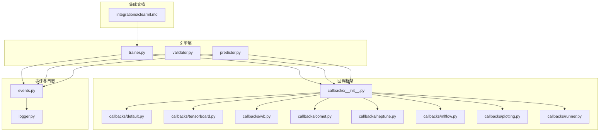
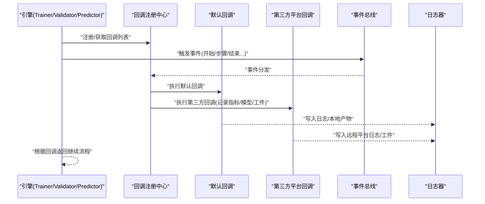
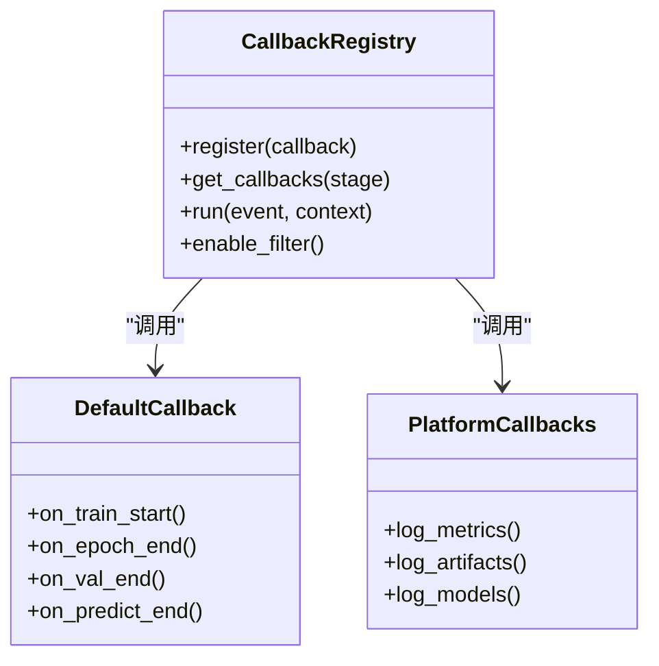
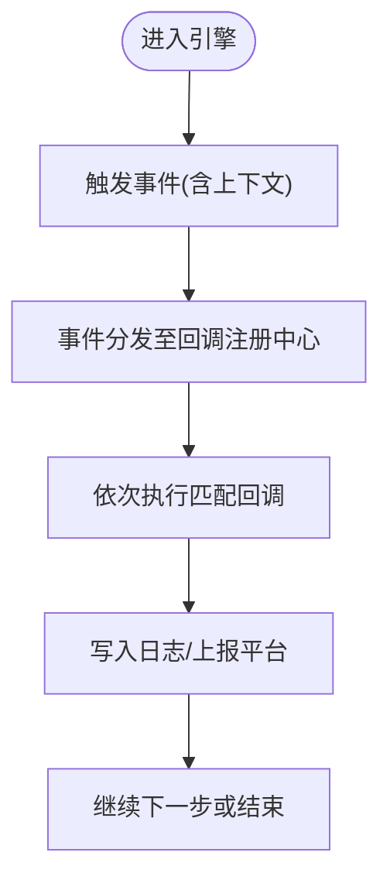
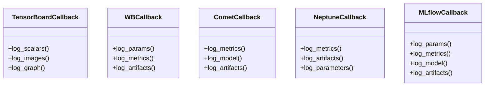
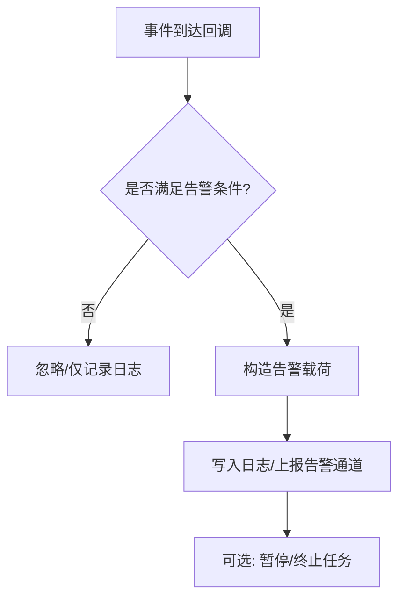
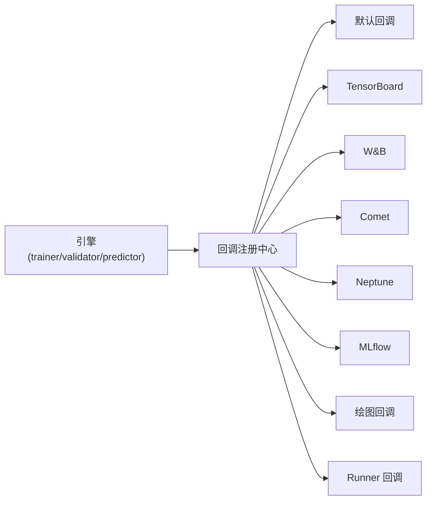

# 监控告警回调

<cite>
**本文引用的文件**
- [clearml.md](file://docs/en/integrations/clearml.md)
- [callbacks/__init__.py](file://ultralytics/utils/callbacks/__init__.py)
- [callbacks/default.py](file://ultralytics/utils/callbacks/default.py)
- [callbacks/tensorboard.py](file://ultralytics/utils/callbacks/tensorboard.py)
- [callbacks/wb.py](file://ultralytics/utils/callbacks/wb.py)
- [callbacks/comet.py](file://ultralytics/utils/callbacks/comet.py)
- [callbacks/neptune.py](file://ultralytics/utils/callbacks/neptune.py)
- [callbacks/mlflow.py](file://ultralytics/utils/callbacks/mlflow.py)
- [callbacks/plotting.py](file://ultralytics/utils/callbacks/plotting.py)
- [callbacks/runner.py](file://ultralytics/utils/callbacks/runner.py)
- [engine/trainer.py](file://ultralytics/engine/trainer.py)
- [engine/validator.py](file://ultralytics/engine/validator.py)
- [engine/predictor.py](file://ultralytics/engine/predictor.py)
- [utils/events.py](file://ultralytics/utils/events.py)
- [utils/logger.py](file://ultralytics/utils/logger.py)
</cite>

## 目录
1. [简介](#简介)
2. [项目结构](#项目结构)
3. [核心组件](#核心组件)
4. [架构总览](#架构总览)
5. [详细组件分析](#详细组件分析)
6. [依赖分析](#依赖分析)
7. [性能考虑](#性能考虑)
8. [故障排查指南](#故障排查指南)
9. [结论](#结论)
10. [附录](#附录)

## 简介
本文件为 YOLO-Master 的“监控与告警回调”体系提供系统化 API 文档，重点覆盖：
- ClearML 实验管理与监控回调的使用方式、能力边界与集成要点
- 训练/验证/预测生命周期中的事件驱动回调机制
- 系统资源监控、性能指标收集与异常告警路径
- 可视化展示方法与自定义告警规则配置建议
- 生产环境部署与运维最佳实践

说明：本仓库包含 ClearML 集成文档与通用回调基础设施。针对 ClearML 的具体参数与字段，请以官方文档为准；本文件聚焦于在 YOLO-Master 中如何启用、扩展与编排这些能力。

## 项目结构
YOLO-Master 的监控与告警相关代码主要分布在以下位置：
- 集成文档：docs/en/integrations/clearml.md
- 回调框架：ultralytics/utils/callbacks/*（默认实现、第三方平台对接、绘图等）
- 引擎触发点：ultralytics/engine/{trainer, validator, predictor}.py
- 事件与日志：ultralytics/utils/events.py、ultralytics/utils/logger.py

图表来源
- [trainer.py](file://ultralytics/engine/trainer.py)
- [validator.py](file://ultralytics/engine/validator.py)
- [predictor.py](file://ultralytics/engine/predictor.py)
- [callbacks/__init__.py](file://ultralytics/utils/callbacks/__init__.py)
- [callbacks/default.py](file://ultralytics/utils/callbacks/default.py)
- [callbacks/tensorboard.py](file://ultralytics/utils/callbacks/tensorboard.py)
- [callbacks/wb.py](file://ultralytics/utils/callbacks/wb.py)
- [callbacks/comet.py](file://ultralytics/utils/callbacks/comet.py)
- [callbacks/neptune.py](file://ultralytics/utils/callbacks/neptune.py)
- [callbacks/mlflow.py](file://ultralytics/utils/callbacks/mlflow.py)
- [callbacks/plotting.py](file://ultralytics/utils/callbacks/plotting.py)
- [callbacks/runner.py](file://ultralytics/utils/callbacks/runner.py)
- [events.py](file://ultralytics/utils/events.py)
- [logger.py](file://ultralytics/utils/logger.py)
- [clearml.md](file://docs/en/integrations/clearml.md)

章节来源
- [clearml.md](file://docs/en/integrations/clearml.md)
- [callbacks/__init__.py](file://ultralytics/utils/callbacks/__init__.py)
- [callbacks/default.py](file://ultralytics/utils/callbacks/default.py)
- [callbacks/tensorboard.py](file://ultralytics/utils/callbacks/tensorboard.py)
- [callbacks/wb.py](file://ultralytics/utils/callbacks/wb.py)
- [callbacks/comet.py](file://ultralytics/utils/callbacks/comet.py)
- [callbacks/neptune.py](file://ultralytics/utils/callbacks/neptune.py)
- [callbacks/mlflow.py](file://ultralytics/utils/callbacks/mlflow.py)
- [callbacks/plotting.py](file://ultralytics/utils/callbacks/plotting.py)
- [callbacks/runner.py](file://ultralytics/utils/callbacks/runner.py)
- [events.py](file://ultralytics/utils/events.py)
- [logger.py](file://ultralytics/utils/logger.py)
- [trainer.py](file://ultralytics/engine/trainer.py)
- [validator.py](file://ultralytics/engine/validator.py)
- [predictor.py](file://ultralytics/engine/predictor.py)

## 核心组件
- 回调注册中心：负责加载、排序与分发回调实例，统一入口位于回调包初始化处。
- 默认回调：内置基础行为（如进度打印、结果保存、绘图等）。
- 第三方平台回调：TensorBoard、Weights & Biases、Comet、Neptune、MLflow 等。
- 事件总线：定义并广播训练/验证/预测过程中的关键事件。
- 日志器：结构化输出运行期信息，便于聚合与检索。
- 集成文档：ClearML 集成说明，指导如何在工程中启用与配置。

章节来源
- [callbacks/__init__.py](file://ultralytics/utils/callbacks/__init__.py)
- [callbacks/default.py](file://ultralytics/utils/callbacks/default.py)
- [callbacks/tensorboard.py](file://ultralytics/utils/callbacks/tensorboard.py)
- [callbacks/wb.py](file://ultralytics/utils/callbacks/wb.py)
- [callbacks/comet.py](file://ultralytics/utils/callbacks/comet.py)
- [callbacks/neptune.py](file://ultralytics/utils/callbacks/neptune.py)
- [callbacks/mlflow.py](file://ultralytics/utils/callbacks/mlflow.py)
- [callbacks/plotting.py](file://ultralytics/utils/callbacks/plotting.py)
- [callbacks/runner.py](file://ultralytics/utils/callbacks/runner.py)
- [events.py](file://ultralytics/utils/events.py)
- [logger.py](file://ultralytics/utils/logger.py)
- [clearml.md](file://docs/en/integrations/clearml.md)

## 架构总览
下图展示了从引擎到回调再到外部平台的调用链路与数据流向。

图表来源
- [trainer.py](file://ultralytics/engine/trainer.py)
- [validator.py](file://ultralytics/engine/validator.py)
- [predictor.py](file://ultralytics/engine/predictor.py)
- [callbacks/__init__.py](file://ultralytics/utils/callbacks/__init__.py)
- [callbacks/default.py](file://ultralytics/utils/callbacks/default.py)
- [callbacks/tensorboard.py](file://ultralytics/utils/callbacks/tensorboard.py)
- [callbacks/wb.py](file://ultralytics/utils/callbacks/wb.py)
- [callbacks/comet.py](file://ultralytics/utils/callbacks/comet.py)
- [callbacks/neptune.py](file://ultralytics/utils/callbacks/neptune.py)
- [callbacks/mlflow.py](file://ultralytics/utils/callbacks/mlflow.py)
- [callbacks/plotting.py](file://ultralytics/utils/callbacks/plotting.py)
- [callbacks/runner.py](file://ultralytics/utils/callbacks/runner.py)
- [events.py](file://ultralytics/utils/events.py)
- [logger.py](file://ultralytics/utils/logger.py)

## 详细组件分析

### 回调注册中心与生命周期
- 职责
  - 集中管理回调实例的创建、排序与执行顺序
  - 将引擎事件映射到具体回调方法
  - 提供统一的 enable/disable 开关与过滤条件
- 关键点
  - 通过初始化入口完成回调发现与装配
  - 支持按阶段（训练/验证/预测）选择性启用
  - 对异常进行隔离，避免单个回调失败影响主流程

图表来源
- [callbacks/__init__.py](file://ultralytics/utils/callbacks/__init__.py)
- [callbacks/default.py](file://ultralytics/utils/callbacks/default.py)
- [callbacks/tensorboard.py](file://ultralytics/utils/callbacks/tensorboard.py)
- [callbacks/wb.py](file://ultralytics/utils/callbacks/wb.py)
- [callbacks/comet.py](file://ultralytics/utils/callbacks/comet.py)
- [callbacks/neptune.py](file://ultralytics/utils/callbacks/neptune.py)
- [callbacks/mlflow.py](file://ultralytics/utils/callbacks/mlflow.py)
- [callbacks/plotting.py](file://ultralytics/utils/callbacks/plotting.py)
- [callbacks/runner.py](file://ultralytics/utils/callbacks/runner.py)

章节来源
- [callbacks/__init__.py](file://ultralytics/utils/callbacks/__init__.py)
- [callbacks/default.py](file://ultralytics/utils/callbacks/default.py)
- [callbacks/runner.py](file://ultralytics/utils/callbacks/runner.py)

### 事件总线与日志
- 事件类型
  - 训练：开始、每步、每轮、结束、错误
  - 验证：开始、每批、结束、错误
  - 预测：开始、每批、结束、错误
- 日志
  - 结构化输出，便于下游采集与告警
  - 支持分级与过滤，减少噪声

图表来源
- [events.py](file://ultralytics/utils/events.py)
- [logger.py](file://ultralytics/utils/logger.py)
- [callbacks/__init__.py](file://ultralytics/utils/callbacks/__init__.py)

章节来源
- [events.py](file://ultralytics/utils/events.py)
- [logger.py](file://ultralytics/utils/logger.py)

### 第三方平台回调（示例）
- TensorBoard：记录标量、图像、直方图、模型图等
- Weights & Biases：实验追踪、超参对比、协作看板
- Comet / Neptune / MLflow：指标、工件、模型版本化与回溯
- 绘图回调：生成训练曲线、混淆矩阵、PR 曲线等

图表来源
- [callbacks/tensorboard.py](file://ultralytics/utils/callbacks/tensorboard.py)
- [callbacks/wb.py](file://ultralytics/utils/callbacks/wb.py)
- [callbacks/comet.py](file://ultralytics/utils/callbacks/comet.py)
- [callbacks/neptune.py](file://ultralytics/utils/callbacks/neptune.py)
- [callbacks/mlflow.py](file://ultralytics/utils/callbacks/mlflow.py)

章节来源
- [callbacks/tensorboard.py](file://ultralytics/utils/callbacks/tensorboard.py)
- [callbacks/wb.py](file://ultralytics/utils/callbacks/wb.py)
- [callbacks/comet.py](file://ultralytics/utils/callbacks/comet.py)
- [callbacks/neptune.py](file://ultralytics/utils/callbacks/neptune.py)
- [callbacks/mlflow.py](file://ultralytics/utils/callbacks/mlflow.py)

### ClearML 集成要点
- 参考文档：请查阅 ClearML 集成文档以了解安装、认证、工作空间与任务管理等细节
- 在 YOLO-Master 中启用 ClearML 的一般流程
  - 安装并配置 ClearML SDK 与环境变量
  - 在训练/验证/预测入口中启用 ClearML 回调（若使用默认回调集合）
  - 通过回调记录关键指标、工件与模型快照
  - 在 ClearML 控制台查看实验、对比与协作
- 注意
  - 具体参数与字段以 ClearML 官方文档为准
  - 在生产环境中建议结合队列与远程执行器进行任务调度

章节来源
- [clearml.md](file://docs/en/integrations/clearml.md)

### 自定义告警规则与异常处理
- 告警触发点
  - 指标越界（如损失发散、精度不升、OOM 等）
  - 资源阈值（GPU 显存/CPU 内存/磁盘 IO）
  - 外部平台状态（上传失败、网络超时）
- 实现建议
  - 新增回调类，订阅相应事件并在 on_* 钩子中评估规则
  - 将告警写入日志并上报到统一告警通道（邮件/IM/工单）
  - 支持开关与阈值配置，便于灰度与回滚
- 异常隔离
  - 回调内部捕获异常，避免中断主流程
  - 记录堆栈与上下文，便于定位问题

[此图为概念性流程图，无需源码对应]

## 依赖分析
- 耦合关系
  - 引擎层仅依赖回调接口与事件总线，保持低耦合
  - 回调之间相互独立，通过注册中心协调执行顺序
  - 第三方平台回调各自封装外部依赖，降低侵入性
- 潜在风险
  - 回调过多导致 I/O 放大，需按需启用
  - 外部平台不稳定时，应做降级与重试策略

图表来源
- [trainer.py](file://ultralytics/engine/trainer.py)
- [validator.py](file://ultralytics/engine/validator.py)
- [predictor.py](file://ultralytics/engine/predictor.py)
- [callbacks/__init__.py](file://ultralytics/utils/callbacks/__init__.py)
- [callbacks/default.py](file://ultralytics/utils/callbacks/default.py)
- [callbacks/tensorboard.py](file://ultralytics/utils/callbacks/tensorboard.py)
- [callbacks/wb.py](file://ultralytics/utils/callbacks/wb.py)
- [callbacks/comet.py](file://ultralytics/utils/callbacks/comet.py)
- [callbacks/neptune.py](file://ultralytics/utils/callbacks/neptune.py)
- [callbacks/mlflow.py](file://ultralytics/utils/callbacks/mlflow.py)
- [callbacks/plotting.py](file://ultralytics/utils/callbacks/plotting.py)
- [callbacks/runner.py](file://ultralytics/utils/callbacks/runner.py)

章节来源
- [callbacks/__init__.py](file://ultralytics/utils/callbacks/__init__.py)
- [callbacks/default.py](file://ultralytics/utils/callbacks/default.py)
- [callbacks/tensorboard.py](file://ultralytics/utils/callbacks/tensorboard.py)
- [callbacks/wb.py](file://ultralytics/utils/callbacks/wb.py)
- [callbacks/comet.py](file://ultralytics/utils/callbacks/comet.py)
- [callbacks/neptune.py](file://ultralytics/utils/callbacks/neptune.py)
- [callbacks/mlflow.py](file://ultralytics/utils/callbacks/mlflow.py)
- [callbacks/plotting.py](file://ultralytics/utils/callbacks/plotting.py)
- [callbacks/runner.py](file://ultralytics/utils/callbacks/runner.py)
- [trainer.py](file://ultralytics/engine/trainer.py)
- [validator.py](file://ultralytics/engine/validator.py)
- [predictor.py](file://ultralytics/engine/predictor.py)

## 性能考虑
- 控制 I/O 频率
  - 仅在必要阶段记录指标与工件，避免高频写盘/网络请求
  - 批量合并记录，降低开销
- 异步与缓冲
  - 对远端平台上报采用异步队列与退避重试
  - 本地落盘采用缓冲写入与压缩归档
- 选择性启用
  - 开发阶段全量开启，生产阶段按需裁剪
- 资源观测
  - 利用系统级监控（CPU/GPU/IO/网络）与日志聚合，定位瓶颈

[本节为通用建议，无需源码引用]

## 故障排查指南
- 常见问题
  - 回调未生效：检查注册中心是否加载、阶段过滤是否正确
  - 平台上报失败：检查凭据、网络、配额与限流
  - 指标缺失：确认事件触发点与回调方法名匹配
- 定位手段
  - 提高日志级别，关注事件与回调执行轨迹
  - 临时禁用第三方回调，缩小问题范围
  - 使用最小复现脚本验证回调链路

章节来源
- [logger.py](file://ultralytics/utils/logger.py)
- [callbacks/__init__.py](file://ultralytics/utils/callbacks/__init__.py)
- [callbacks/default.py](file://ultralytics/utils/callbacks/default.py)

## 结论
YOLO-Master 通过事件驱动的回调框架，将训练/验证/预测过程与多种实验管理与监控系统解耦。借助默认回调与第三方平台回调，可快速实现指标记录、工件管理与可视化；同时，通过自定义回调可实现灵活的告警与治理策略。生产环境建议遵循“按需启用、异步上报、异常隔离、可观测优先”的原则，确保稳定性与可维护性。

## 附录
- 快速上手
  - 阅读 ClearML 集成文档，完成安装与认证
  - 在训练/验证/预测入口启用默认回调集合
  - 在平台控制台查看实验与指标
- 扩展建议
  - 新增自定义回调类，实现 on_* 钩子
  - 将告警接入企业 IM/邮件/工单系统
  - 建立阈值与规则库，配合 CI/CD 门禁

[本节为概览性内容，无需源码引用]