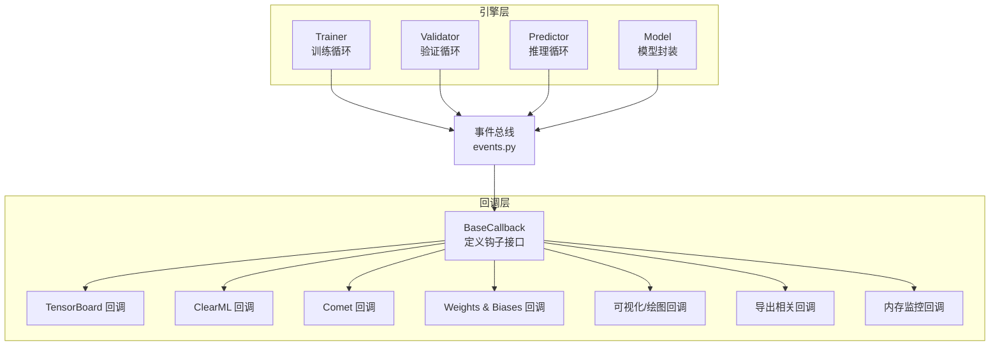
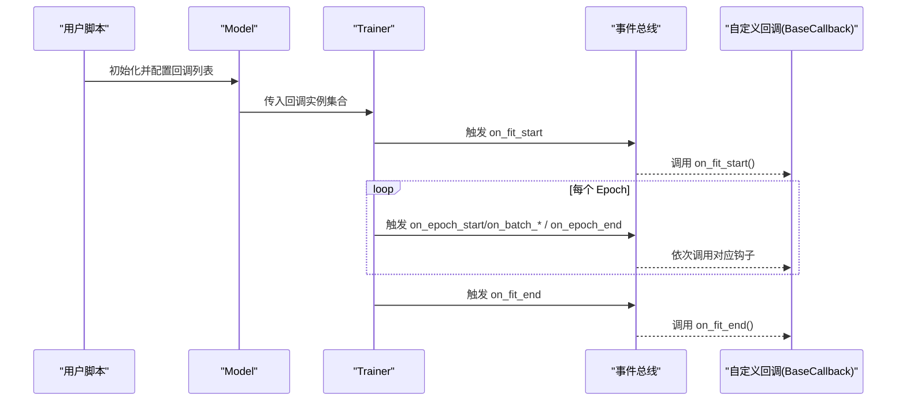
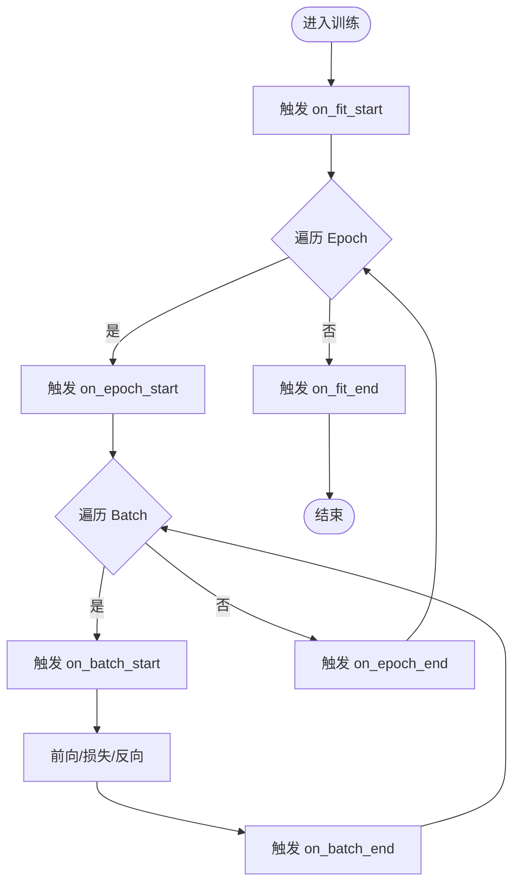
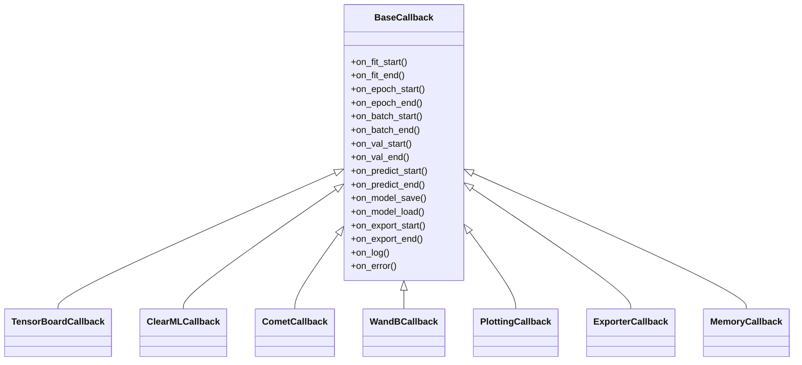

# 自定义回调开发

<cite>
**本文引用的文件**
- [ultralytics/utils/callbacks/__init__.py](file://ultralytics/utils/callbacks/__init__.py)
- [ultralytics/utils/callbacks/base.py](file://ultralytics/utils/callbacks/base.py)
- [ultralytics/utils/callbacks/tensorboard.py](file://ultralytics/utils/callbacks/tensorboard.py)
- [ultralytics/utils/callbacks/clearml.py](file://ultralytics/utils/callbacks/clearml.py)
- [ultralytics/utils/callbacks/comet.py](file://ultralytics/utils/callbacks/comet.py)
- [ultralytics/utils/callbacks/wandb.py](file://ultralytics/utils/callbacks/wandb.py)
- [ultralytics/utils/callbacks/plotting.py](file://ultralytics/utils/callbacks/plotting.py)
- [ultralytics/utils/callbacks/exporter.py](file://ultralytics/utils/callbacks/exporter.py)
- [ultralytics/utils/callbacks/mem.py](file://ultralytics/utils/callbacks/mem.py)
- [ultralytics/utils/events.py](file://ultralytics/utils/events.py)
- [ultralytics/engine/trainer.py](file://ultralytics/engine/trainer.py)
- [ultralytics/engine/validator.py](file://ultralytics/engine/validator.py)
- [ultralytics/engine/predictor.py](file://ultralytics/engine/predictor.py)
- [ultralytics/engine/model.py](file://ultralytics/engine/model.py)
</cite>

## 目录
1. [简介](#简介)
2. [项目结构](#项目结构)
3. [核心组件](#核心组件)
4. [架构总览](#架构总览)
5. [详细组件分析](#详细组件分析)
6. [依赖分析](#依赖分析)
7. [性能考虑](#性能考虑)
8. [故障排查指南](#故障排查指南)
9. [结论](#结论)
10. [附录](#附录)

## 简介
本指南面向希望在 YOLO-Master 中扩展训练与推理流程的开发者，系统讲解如何基于 BaseCallback 实现自定义回调。内容覆盖：
- 回调生命周期钩子、事件触发机制与异步处理模式
- 参数传递与状态管理最佳实践
- 常见场景示例：自定义指标计算、动态学习率调整、模型检查点管理
- 性能优化、内存管理与错误处理
- 调试与测试方法

## 项目结构
YOLO-Master 的回调体系位于 ultralytics/utils/callbacks 目录，采用“基类 + 内置实现 + 注册入口”的组织方式；训练、验证与预测引擎在关键阶段通过统一的事件总线分发回调事件。

图表来源
- [ultralytics/utils/callbacks/base.py](file://ultralytics/utils/callbacks/base.py)
- [ultralytics/utils/callbacks/tensorboard.py](file://ultralytics/utils/callbacks/tensorboard.py)
- [ultralytics/utils/callbacks/clearml.py](file://ultralytics/utils/callbacks/clearml.py)
- [ultralytics/utils/callbacks/comet.py](file://ultralytics/utils/callbacks/comet.py)
- [ultralytics/utils/callbacks/wandb.py](file://ultralytics/utils/callbacks/wandb.py)
- [ultralytics/utils/callbacks/plotting.py](file://ultralytics/utils/callbacks/plotting.py)
- [ultralytics/utils/callbacks/exporter.py](file://ultralytics/utils/callbacks/exporter.py)
- [ultralytics/utils/callbacks/mem.py](file://ultralytics/utils/callbacks/mem.py)
- [ultralytics/utils/events.py](file://ultralytics/utils/events.py)
- [ultralytics/engine/trainer.py](file://ultralytics/engine/trainer.py)
- [ultralytics/engine/validator.py](file://ultralytics/engine/validator.py)
- [ultralytics/engine/predictor.py](file://ultralytics/engine/predictor.py)
- [ultralytics/engine/model.py](file://ultralytics/engine/model.py)

章节来源
- [ultralytics/utils/callbacks/__init__.py](file://ultralytics/utils/callbacks/__init__.py)
- [ultralytics/utils/callbacks/base.py](file://ultralytics/utils/callbacks/base.py)
- [ultralytics/utils/events.py](file://ultralytics/utils/events.py)
- [ultralytics/engine/trainer.py](file://ultralytics/engine/trainer.py)
- [ultralytics/engine/validator.py](file://ultralytics/engine/validator.py)
- [ultralytics/engine/predictor.py](file://ultralytics/engine/predictor.py)
- [ultralytics/engine/model.py](file://ultralytics/engine/model.py)

## 核心组件
- BaseCallback：所有回调的抽象基类，定义标准钩子（如 on_train_start、on_epoch_end、on_fit_end 等），并提供统一的上下文访问能力（模型、优化器、日志、设备、配置等）。
- 事件总线（events）：集中派发回调事件，确保训练/验证/预测各阶段对回调的统一调用。
- 内置回调：TensorBoard、ClearML、Comet、W&B、绘图、导出、内存监控等，均继承自 BaseCallback。
- 引擎集成：Trainer/Validator/Predictor/Model 在关键节点触发事件，驱动回调执行。

章节来源
- [ultralytics/utils/callbacks/base.py](file://ultralytics/utils/callbacks/base.py)
- [ultralytics/utils/events.py](file://ultralytics/utils/events.py)
- [ultralytics/utils/callbacks/tensorboard.py](file://ultralytics/utils/callbacks/tensorboard.py)
- [ultralytics/utils/callbacks/clearml.py](file://ultralytics/utils/callbacks/clearml.py)
- [ultralytics/utils/callbacks/comet.py](file://ultralytics/utils/callbacks/comet.py)
- [ultralytics/utils/callbacks/wandb.py](file://ultralytics/utils/callbacks/wandb.py)
- [ultralytics/utils/callbacks/plotting.py](file://ultralytics/utils/callbacks/plotting.py)
- [ultralytics/utils/callbacks/exporter.py](file://ultralytics/utils/callbacks/exporter.py)
- [ultralytics/utils/callbacks/mem.py](file://ultralytics/utils/callbacks/mem.py)
- [ultralytics/engine/trainer.py](file://ultralytics/engine/trainer.py)
- [ultralytics/engine/validator.py](file://ultralytics/engine/validator.py)
- [ultralytics/engine/predictor.py](file://ultralytics/engine/predictor.py)
- [ultralytics/engine/model.py](file://ultralytics/engine/model.py)

## 架构总览
下图展示了从引擎到回调的生命周期调用链，以及事件分发路径。

图表来源
- [ultralytics/engine/trainer.py](file://ultralytics/engine/trainer.py)
- [ultralytics/utils/events.py](file://ultralytics/utils/events.py)
- [ultralytics/utils/callbacks/base.py](file://ultralytics/utils/callbacks/base.py)

## 详细组件分析

### 基类与钩子设计
- 设计要点
  - 所有回调需继承 BaseCallback，并在需要时覆写相应钩子方法。
  - 钩子命名遵循 on_<阶段>_<动作> 约定，便于理解与组合。
  - 回调内部可通过上下文对象访问当前训练状态（如 epoch、batch、loss、metrics、device、cfg 等）。
- 典型钩子
  - 训练：on_fit_start、on_fit_end、on_epoch_start、on_epoch_end、on_batch_start、on_batch_end
  - 验证：on_val_start、on_val_end、on_val_batch_start、on_val_batch_end
  - 推理：on_predict_start、on_predict_end、on_predict_batch_*
  - 通用：on_model_save、on_model_load、on_export_start、on_export_end、on_log、on_error 等

章节来源
- [ultralytics/utils/callbacks/base.py](file://ultralytics/utils/callbacks/base.py)

### 事件分发与生命周期
- 事件总线负责将引擎阶段的信号广播给所有已注册的回调。
- 引擎在以下关键点触发事件：
  - 训练开始/结束、每轮开始/结束、每批开始/结束
  - 验证开始/结束、每批开始/结束
  - 推理开始/结束、每批开始/结束
  - 模型保存/加载、导出开始/结束、日志记录、异常捕获等

图表来源
- [ultralytics/engine/trainer.py](file://ultralytics/engine/trainer.py)
- [ultralytics/utils/events.py](file://ultralytics/utils/events.py)

章节来源
- [ultralytics/utils/events.py](file://ultralytics/utils/events.py)
- [ultralytics/engine/trainer.py](file://ultralytics/engine/trainer.py)

### 参数传递与状态管理
- 参数传递
  - 通过构造函数注入外部依赖（如存储后端、阈值、采样策略等）。
  - 通过回调上下文读取运行时信息（epoch、step、loss、metrics、device、cfg 等）。
- 状态管理
  - 使用实例属性维护跨批次/跨轮次的累计统计量（如滑动平均、历史曲线、计数器等）。
  - 注意线程安全：在多进程/分布式环境下，避免共享可变状态或加锁保护。
  - 清理资源：在 on_fit_end 或 on_error 中释放句柄、关闭连接、清空缓存。

章节来源
- [ultralytics/utils/callbacks/base.py](file://ultralytics/utils/callbacks/base.py)

### 异步处理模式
- 若回调涉及 I/O（网络上传、磁盘写入、远程 API 调用），建议：
  - 在 on_batch_end/on_epoch_end 中提交异步任务，避免阻塞主训练循环。
  - 使用队列缓冲高频事件，批量落盘或上报。
  - 在 on_fit_end 等待未完成的任务完成并处理异常。

章节来源
- [ultralytics/utils/callbacks/base.py](file://ultralytics/utils/callbacks/base.py)

### 实战示例一：自定义指标计算
- 目标：在每步/每轮后计算额外指标（如类别精度、IoU 分位数、长尾分布统计等），并持久化。
- 步骤
  - 继承 BaseCallback，覆写 on_batch_end 或 on_epoch_end。
  - 从上下文获取预测与标签，计算指标并更新累计状态。
  - 在 on_epoch_end 汇总并记录（本地文件或远端服务）。
- 注意事项
  - 控制计算开销，必要时降采样或使用近似算法。
  - 避免在 GPU 上频繁同步，尽量在 CPU 侧聚合。

章节来源
- [ultralytics/utils/callbacks/base.py](file://ultralytics/utils/callbacks/base.py)

### 实战示例二：动态学习率调整
- 目标：根据验证集指标或训练损失趋势动态调整学习率。
- 步骤
  - 覆写 on_epoch_end，读取验证指标与当前学习率。
  - 根据策略（如早停、余弦退火、自适应衰减）计算新学习率。
  - 通过上下文提供的优化器接口设置新的学习率。
- 注意事项
  - 仅在验证可用时触发，避免过拟合噪声。
  - 记录学习率变化轨迹以便复现与分析。

章节来源
- [ultralytics/utils/callbacks/base.py](file://ultralytics/utils/callbacks/base.py)

### 实战示例三：模型检查点管理
- 目标：按策略保存最佳/最近模型，支持断点续训与版本回溯。
- 步骤
  - 覆写 on_epoch_end 或 on_fit_end，依据指标选择保存时机。
  - 使用统一路径与命名规范，保留必要元数据（配置、时间戳、指标）。
  - 在 on_fit_end 进行归档或清理旧权重。
- 注意事项
  - 大模型保存耗时，可结合异步与增量保存策略。
  - 多卡环境下确保仅主进程写入。

章节来源
- [ultralytics/utils/callbacks/base.py](file://ultralytics/utils/callbacks/base.py)

### 内置回调参考
- TensorBoard：记录损失、指标、超参、图结构等。
- ClearML/Comet/W&B：实验追踪与可视化。
- Plotting：绘制训练曲线、混淆矩阵、PR 曲线等。
- Exporter：导出前后钩子，用于导出产物校验与文档生成。
- Mem：监控显存/CPU 内存峰值与趋势。

章节来源
- [ultralytics/utils/callbacks/tensorboard.py](file://ultralytics/utils/callbacks/tensorboard.py)
- [ultralytics/utils/callbacks/clearml.py](file://ultralytics/utils/callbacks/clearml.py)
- [ultralytics/utils/callbacks/comet.py](file://ultralytics/utils/callbacks/comet.py)
- [ultralytics/utils/callbacks/wandb.py](file://ultralytics/utils/callbacks/wandb.py)
- [ultralytics/utils/callbacks/plotting.py](file://ultralytics/utils/callbacks/plotting.py)
- [ultralytics/utils/callbacks/exporter.py](file://ultralytics/utils/callbacks/exporter.py)
- [ultralytics/utils/callbacks/mem.py](file://ultralytics/utils/callbacks/mem.py)

## 依赖分析
- 耦合关系
  - 引擎层（Trainer/Validator/Predictor/Model）依赖事件总线，不直接感知具体回调实现。
  - 回调层仅依赖 BaseCallback 与事件总线，保持低耦合与高内聚。
- 外部依赖
  - 第三方日志/追踪库（TensorBoard、ClearML、Comet、W&B）按需引入，避免冷启动开销。
- 潜在风险
  - 回调间共享全局状态可能导致竞态条件，应尽量避免或通过线程安全容器管理。
  - 大量回调同时执行可能拖慢训练，需评估开销与必要性。

图表来源
- [ultralytics/utils/callbacks/base.py](file://ultralytics/utils/callbacks/base.py)
- [ultralytics/utils/callbacks/tensorboard.py](file://ultralytics/utils/callbacks/tensorboard.py)
- [ultralytics/utils/callbacks/clearml.py](file://ultralytics/utils/callbacks/clearml.py)
- [ultralytics/utils/callbacks/comet.py](file://ultralytics/utils/callbacks/comet.py)
- [ultralytics/utils/callbacks/wandb.py](file://ultralytics/utils/callbacks/wandb.py)
- [ultralytics/utils/callbacks/plotting.py](file://ultralytics/utils/callbacks/plotting.py)
- [ultralytics/utils/callbacks/exporter.py](file://ultralytics/utils/callbacks/exporter.py)
- [ultralytics/utils/callbacks/mem.py](file://ultralytics/utils/callbacks/mem.py)

章节来源
- [ultralytics/utils/callbacks/__init__.py](file://ultralytics/utils/callbacks/__init__.py)
- [ultralytics/utils/callbacks/base.py](file://ultralytics/utils/callbacks/base.py)

## 性能考虑
- 减少同步与拷贝
  - 避免在高频钩子中进行昂贵的 GPU-CPU 同步。
  - 优先在 CPU 侧聚合指标，再批量写入。
- 批量化与去抖
  - 对日志/上传操作进行批处理与去抖，降低 I/O 压力。
- 选择性启用
  - 根据环境（是否 GPU、是否分布式）动态启用重型回调。
- 内存管理
  - 及时释放中间结果，避免累积引用导致 OOM。
  - 使用弱引用或池化对象复用昂贵资源。
- 异步与并发
  - 将 I/O 放入独立线程/协程，主循环只负责调度。
  - 限制并发度，防止打满磁盘或网络带宽。

[本节为通用指导，无需特定文件来源]

## 故障排查指南
- 常见问题
  - 回调未触发：确认回调已正确注册且未被过滤；检查事件名称与钩子名匹配。
  - 训练变慢：定位耗时回调，禁用非必要回调或改为异步。
  - 内存泄漏：检查是否在回调中持有大图/张量引用；在合适钩子中显式释放。
  - 分布式不一致：确保仅主进程执行写操作；避免共享非线程安全状态。
- 诊断工具
  - 使用内存监控回调观察峰值与趋势。
  - 开启详细日志，记录关键钩子进入/退出时间与异常堆栈。
  - 最小化复现实例：仅启用一个自定义回调，逐步增加复杂度。

章节来源
- [ultralytics/utils/callbacks/mem.py](file://ultralytics/utils/callbacks/mem.py)
- [ultralytics/utils/callbacks/base.py](file://ultralytics/utils/callbacks/base.py)

## 结论
通过 BaseCallback 与事件总线，YOLO-Master 提供了灵活、可扩展的训练与推理增强机制。开发者可在不侵入核心逻辑的前提下，实现指标计算、学习率调度、检查点管理等多样化需求。遵循性能与稳定性最佳实践，可获得稳定高效的扩展体验。

[本节为总结性内容，无需特定文件来源]

## 附录

### 快速上手清单
- 新建回调类，继承 BaseCallback
- 覆写所需钩子（如 on_epoch_end、on_fit_end）
- 在构造中注入外部依赖（存储、阈值、策略等）
- 在 on_fit_start 初始化状态，在 on_fit_end 清理资源
- 在引擎初始化时注册回调实例
- 先在小数据集验证功能与性能，再扩展到全量数据

章节来源
- [ultralytics/utils/callbacks/base.py](file://ultralytics/utils/callbacks/base.py)

### 常用钩子速查
- 训练：on_fit_start、on_fit_end、on_epoch_start、on_epoch_end、on_batch_start、on_batch_end
- 验证：on_val_start、on_val_end、on_val_batch_start、on_val_batch_end
- 推理：on_predict_start、on_predict_end、on_predict_batch_start、on_predict_batch_end
- 通用：on_model_save、on_model_load、on_export_start、on_export_end、on_log、on_error

章节来源
- [ultralytics/utils/callbacks/base.py](file://ultralytics/utils/callbacks/base.py)