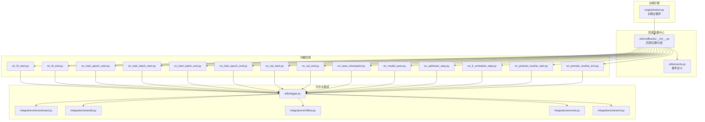
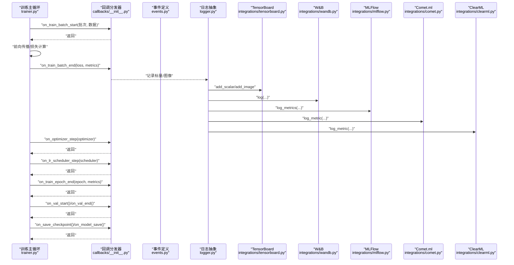
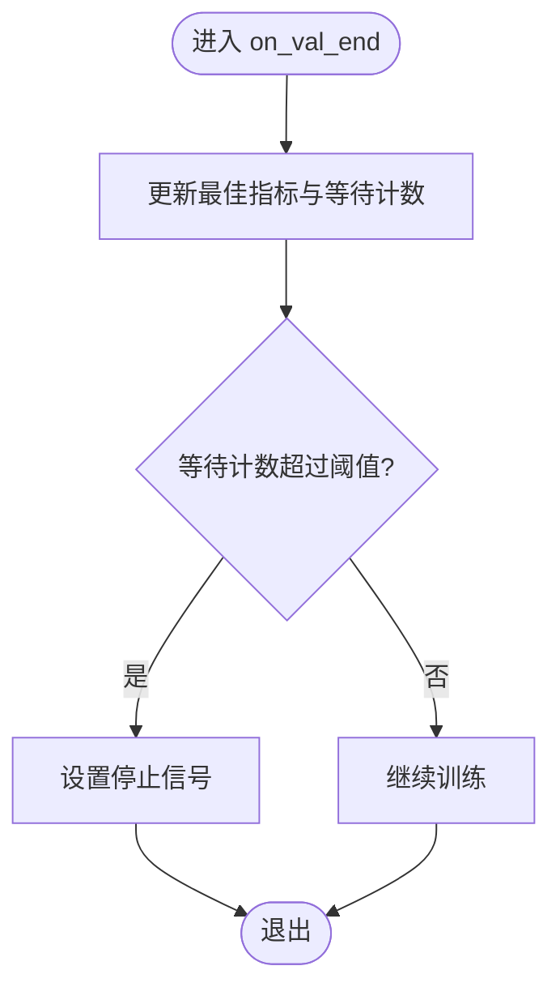
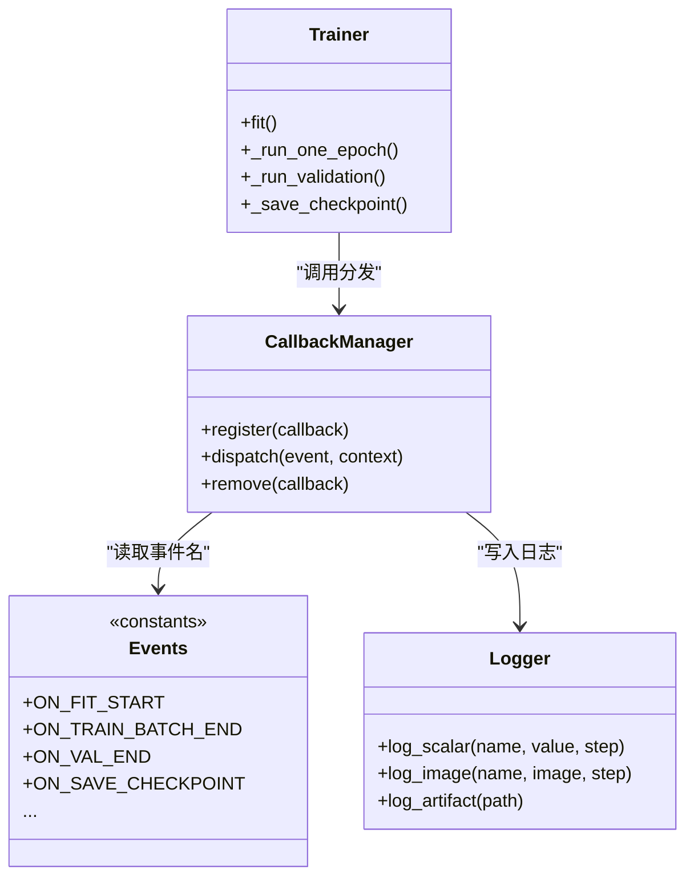
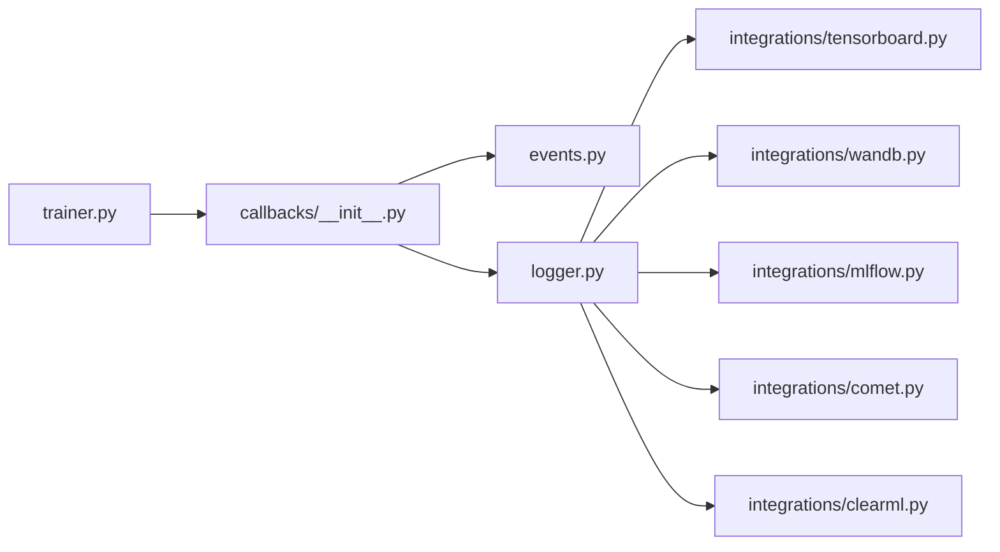

# 训练回调API

<cite>
**本文引用的文件**
- [trainer.py](file://ultralytics/engine/trainer.py)
- [callbacks/__init__.py](file://ultralytics/utils/callbacks/__init__.py)
- [callbacks/on_fit_start.py](file://ultralytics/utils/callbacks/on_fit_start.py)
- [callbacks/on_fit_end.py](file://ultralytics/utils/callbacks/on_fit_end.py)
- [callbacks/on_train_epoch_start.py](file://ultralytics/utils/callbacks/on_train_epoch_start.py)
- [callbacks/on_train_batch_start.py](file://ultralytics/utils/callbacks/on_train_batch_start.py)
- [callbacks/on_train_batch_end.py](file://ultralytics/utils/callbacks/on_train_batch_end.py)
- [callbacks/on_val_start.py](file://ultralytics/utils/callbacks/on_val_start.py)
- [callbacks/on_val_end.py](file://ultralytics/utils/callbacks/on_val_end.py)
- [callbacks/on_save_checkpoint.py](file://ultralytics/utils/callbacks/on_save_checkpoint.py)
- [callbacks/on_model_save.py](file://ultralytics/utils/callbacks/on_model_save.py)
- [callbacks/on_pretrain_routine_start.py](file://ultralytics/utils/callbacks/on_pretrain_routine_start.py)
- [callbacks/on_pretrain_routine_end.py](file://ultralytics/utils/callbacks/on_pretrain_routine_end.py)
- [callbacks/on_optimizer_step.py](file://ultralytics/utils/callbacks/on_optimizer_step.py)
- [callbacks/on_lr_scheduler_step.py](file://ultralytics/utils/callbacks/on_lr_scheduler_step.py)
- [callbacks/on_train_epoch_end.py](file://ultralytics/utils/callbacks/on_train_epoch_end.py)
- [events.py](file://ultralytics/utils/events.py)
- [logger.py](file://ultralytics/utils/logger.py)
- [integrations/tensorboard.py](file://ultralytics/utils/integrations/tensorboard.py)
- [integrations/wandb.py](file://ultralytics/utils/integrations/wandb.py)
- [integrations/mlflow.py](file://ultralytics/utils/integrations/mlflow.py)
- [integrations/comet.py](file://ultralytics/utils/integrations/comet.py)
- [integrations/clearml.py](file://ultralytics/utils/integrations/clearml.py)
</cite>

## 目录
1. [简介](#简介)
2. [项目结构](#项目结构)
3. [核心组件](#核心组件)
4. [架构总览](#架构总览)
5. [详细组件分析](#详细组件分析)
6. [依赖关系分析](#依赖关系分析)
7. [性能考虑](#性能考虑)
8. [故障排查指南](#故障排查指南)
9. [结论](#结论)
10. [附录](#附录)

## 简介
本文件为 YOLO-Master 训练回调系统的完整 API 文档，覆盖训练生命周期中的关键钩子点：模型初始化、数据加载、前向传播、损失计算、反向传播、优化器更新、验证与保存等阶段。文档同时记录内置集成（TensorBoard、Weights & Biases、ClearML、Comet.ml、MLFlow）的用法，并提供自定义回调开发示例（指标收集、检查点保存、早停机制），以及异步处理与性能优化的最佳实践。

## 项目结构
YOLO-Master 的训练回调系统位于 utils/callbacks 与 engine/trainer 中，采用“事件驱动”的设计：训练主循环在关键步骤触发事件，回调管理器分发到已注册的回调函数或类方法。

图表来源
- [trainer.py](file://ultralytics/engine/trainer.py)
- [callbacks/__init__.py](file://ultralytics/utils/callbacks/__init__.py)
- [events.py](file://ultralytics/utils/events.py)
- [logger.py](file://ultralytics/utils/logger.py)
- [integrations/tensorboard.py](file://ultralytics/utils/integrations/tensorboard.py)
- [integrations/wandb.py](file://ultralytics/utils/integrations/wandb.py)
- [integrations/mlflow.py](file://ultralytics/utils/integrations/mlflow.py)
- [integrations/comet.py](file://ultralytics/utils/integrations/comet.py)
- [integrations/clearml.py](file://ultralytics/utils/integrations/clearml.py)

章节来源
- [trainer.py](file://ultralytics/engine/trainer.py)
- [callbacks/__init__.py](file://ultralytics/utils/callbacks/__init__.py)
- [events.py](file://ultralytics/utils/events.py)
- [logger.py](file://ultralytics/utils/logger.py)

## 核心组件
- 训练主循环（trainer.py）
  - 负责在训练各阶段调用回调分发器，提供上下文信息（如 epoch、batch、loss、metrics、optimizer、scheduler、checkpoint 路径等）。
- 回调注册中心（callbacks/__init__.py）
  - 提供回调注册、去重、按阶段分发、异常隔离等能力；支持函数式与类方法两种形式。
- 事件定义（events.py）
  - 集中定义训练生命周期事件常量与参数契约，确保回调间数据一致性。
- 日志抽象（logger.py）
  - 统一日志接口，供内置回调写入 TensorBoard/W&B/ClearML/Comet/MLFlow 等后端。

章节来源
- [trainer.py](file://ultralytics/engine/trainer.py)
- [callbacks/__init__.py](file://ultralytics/utils/callbacks/__init__.py)
- [events.py](file://ultralytics/utils/events.py)
- [logger.py](file://ultralytics/utils/logger.py)

## 架构总览
下图展示一次典型训练步的回调时序：从批次开始到结束，包含前向、损失、反向传播、优化器更新、学习率调度、指标记录与可选的验证/保存。

图表来源
- [trainer.py](file://ultralytics/engine/trainer.py)
- [callbacks/__init__.py](file://ultralytics/utils/callbacks/__init__.py)
- [events.py](file://ultralytics/utils/events.py)
- [logger.py](file://ultralytics/utils/logger.py)
- [integrations/tensorboard.py](file://ultralytics/utils/integrations/tensorboard.py)
- [integrations/wandb.py](file://ultralytics/utils/integrations/wandb.py)
- [integrations/mlflow.py](file://ultralytics/utils/integrations/mlflow.py)
- [integrations/comet.py](file://ultralytics/utils/integrations/comet.py)
- [integrations/clearml.py](file://ultralytics/utils/integrations/clearml.py)

## 详细组件分析

### 回调生命周期与接口规范
- 事件命名约定
  - on_<阶段>_<时机>(context)
  - 阶段包括：fit、pretrain、train、val、save、model_save、optimizer_step、lr_scheduler_step
  - 时机包括：start、end
- 通用上下文字段（由 events.py 定义）
  - 常见字段：epoch、step、batch、data、loss、metrics、optimizer、scheduler、best_model_path、run_dir、device、rank/world_size 等
  - 具体字段以 events.py 为准，不同事件可能携带不同上下文

章节来源
- [events.py](file://ultralytics/utils/events.py)

#### 预训练与整体拟合
- on_pretrain_routine_start / on_pretrain_routine_end
  - 用于准备环境、初始化外部跟踪器、打印配置摘要等
- on_fit_start / on_fit_end
  - 用于全局初始化与收尾（如关闭跟踪会话、汇总报告）

章节来源
- [callbacks/on_pretrain_routine_start.py](file://ultralytics/utils/callbacks/on_pretrain_routine_start.py)
- [callbacks/on_pretrain_routine_end.py](file://ultralytics/utils/callbacks/on_pretrain_routine_end.py)
- [callbacks/on_fit_start.py](file://ultralytics/utils/callbacks/on_fit_start.py)
- [callbacks/on_fit_end.py](file://ultralytics/utils/callbacks/on_fit_end.py)

#### 训练阶段
- on_train_epoch_start
  - 适合重置 epoch 级统计、预热缓存
- on_train_batch_start
  - 适合记录输入样本元信息、计时起点
- on_train_batch_end
  - 适合记录 loss、梯度范数、预测可视化、指标快照
- on_train_epoch_end
  - 适合聚合 epoch 指标、写入日志、触发验证/保存策略

章节来源
- [callbacks/on_train_epoch_start.py](file://ultralytics/utils/callbacks/on_train_epoch_start.py)
- [callbacks/on_train_batch_start.py](file://ultralytics/utils/callbacks/on_train_batch_start.py)
- [callbacks/on_train_batch_end.py](file://ultralytics/utils/callbacks/on_train_batch_end.py)
- [callbacks/on_train_epoch_end.py](file://ultralytics/utils/callbacks/on_train_epoch_end.py)

#### 验证阶段
- on_val_start / on_val_end
  - 适合切换评估模式、记录验证集信息、汇总 mAP/Precision/Recall/F1 等

章节来源
- [callbacks/on_val_start.py](file://ultralytics/utils/callbacks/on_val_start.py)
- [callbacks/on_val_end.py](file://ultralytics/utils/callbacks/on_val_end.py)

#### 优化器与学习率
- on_optimizer_step
  - 适合记录权重/梯度统计、NaN/Inf 检测、梯度裁剪后状态
- on_lr_scheduler_step
  - 适合记录学习率曲线、warmup/decay 状态

章节来源
- [callbacks/on_optimizer_step.py](file://ultralytics/utils/callbacks/on_optimizer_step.py)
- [callbacks/on_lr_scheduler_step.py](file://ultralytics/utils/callbacks/on_lr_scheduler_step.py)

#### 检查点与模型保存
- on_save_checkpoint
  - 适合打包额外元数据（超参、随机种子、环境信息）
- on_model_save
  - 适合导出中间模型、生成可部署产物、上传远端存储

章节来源
- [callbacks/on_save_checkpoint.py](file://ultralytics/utils/callbacks/on_save_checkpoint.py)
- [callbacks/on_model_save.py](file://ultralytics/utils/callbacks/on_model_save.py)

### 内置集成使用指南
- TensorBoard
  - 通过 logger 写入标量、图像、直方图；建议在 on_fit_start 初始化，on_fit_end 关闭
  - 参考路径：[integrations/tensorboard.py](file://ultralytics/utils/integrations/tensorboard.py)
- Weights & Biases
  - 支持 log、watch、save_artifact；建议在 on_fit_start 启动 run，on_fit_end finish
  - 参考路径：[integrations/wandb.py](file://ultralytics/utils/integrations/wandb.py)
- MLFlow
  - 支持 log_params/log_metrics/log_artifacts；建议 on_fit_start 创建实验，on_fit_end 结束
  - 参考路径：[integrations/mlflow.py](file://ultralytics/utils/integrations/mlflow.py)
- Comet.ml
  - 支持 log_metric/log_artifact；注意并发限制与网络重试
  - 参考路径：[integrations/comet.py](file://ultralytics/utils/integrations/comet.py)
- ClearML
  - 支持 log_metric/log_figure；适合远程任务管理
  - 参考路径：[integrations/clearml.py](file://ultralytics/utils/integrations/clearml.py)

章节来源
- [logger.py](file://ultralytics/utils/logger.py)
- [integrations/tensorboard.py](file://ultralytics/utils/integrations/tensorboard.py)
- [integrations/wandb.py](file://ultralytics/utils/integrations/wandb.py)
- [integrations/mlflow.py](file://ultralytics/utils/integrations/mlflow.py)
- [integrations/comet.py](file://ultralytics/utils/integrations/comet.py)
- [integrations/clearml.py](file://ultralytics/utils/integrations/clearml.py)

### 自定义回调开发示例

#### 指标收集回调
- 目标：在每步/每 epoch 收集并聚合指标，输出到统一日志后端
- 实现要点：
  - 在 on_train_batch_end 追加指标
  - 在 on_train_epoch_end 聚合并写入 logger
  - 避免阻塞训练：对耗时操作使用队列或异步提交
- 参考位置：
  - [callbacks/on_train_batch_end.py](file://ultralytics/utils/callbacks/on_train_batch_end.py)
  - [callbacks/on_train_epoch_end.py](file://ultralytics/utils/callbacks/on_train_epoch_end.py)
  - [logger.py](file://ultralytics/utils/logger.py)

#### 模型检查点保存回调
- 目标：按策略保存最佳/最近检查点，附带元数据
- 实现要点：
  - 在 on_train_epoch_end 判断是否满足保存条件
  - 在 on_save_checkpoint 注入额外元数据（如当前 LR、GPU 利用率）
  - 在 on_model_save 执行导出或上传
- 参考位置：
  - [callbacks/on_train_epoch_end.py](file://ultralytics/utils/callbacks/on_train_epoch_end.py)
  - [callbacks/on_save_checkpoint.py](file://ultralytics/utils/callbacks/on_save_checkpoint.py)
  - [callbacks/on_model_save.py](file://ultralytics/utils/callbacks/on_model_save.py)

#### 早停机制回调
- 目标：当验证指标长时间不提升时提前终止训练
- 实现要点：
  - 在 on_val_end 记录最佳指标与等待计数
  - 超过阈值则设置停止信号（通过事件上下文或共享状态）
  - 在 on_fit_end 清理资源
- 参考位置：
  - [callbacks/on_val_end.py](file://ultralytics/utils/callbacks/on_val_end.py)
  - [callbacks/on_fit_end.py](file://ultralytics/utils/callbacks/on_fit_end.py)

图表来源
- [callbacks/on_val_end.py](file://ultralytics/utils/callbacks/on_val_end.py)
- [callbacks/on_fit_end.py](file://ultralytics/utils/callbacks/on_fit_end.py)

### 回调注册与分发流程
- 注册方式
  - 函数式：直接传入回调函数
  - 类方法：继承基类并重写对应方法
- 分发机制
  - trainer 在关键节点调用分发器
  - 分发器根据事件名查找已注册回调并依次执行
  - 异常隔离：单个回调异常不影响其他回调与训练主流程

图表来源
- [trainer.py](file://ultralytics/engine/trainer.py)
- [callbacks/__init__.py](file://ultralytics/utils/callbacks/__init__.py)
- [events.py](file://ultralytics/utils/events.py)
- [logger.py](file://ultralytics/utils/logger.py)

章节来源
- [callbacks/__init__.py](file://ultralytics/utils/callbacks/__init__.py)
- [trainer.py](file://ultralytics/engine/trainer.py)
- [events.py](file://ultralytics/utils/events.py)
- [logger.py](file://ultralytics/utils/logger.py)

## 依赖关系分析
- 低耦合高内聚
  - trainer 仅依赖回调分发器与事件常量，不感知具体回调实现
  - 回调之间通过事件上下文通信，避免直接相互引用
- 外部依赖
  - 日志后端（TensorBoard/W&B/MLFlow/Comet/ClearML）通过 logger 抽象接入，便于替换与扩展
- 潜在风险
  - 回调中同步 IO 会阻塞训练主循环，需采用异步或批量化策略
  - 多进程环境下需保证回调线程安全与设备亲和性

图表来源
- [trainer.py](file://ultralytics/engine/trainer.py)
- [callbacks/__init__.py](file://ultralytics/utils/callbacks/__init__.py)
- [events.py](file://ultralytics/utils/events.py)
- [logger.py](file://ultralytics/utils/logger.py)
- [integrations/tensorboard.py](file://ultralytics/utils/integrations/tensorboard.py)
- [integrations/wandb.py](file://ultralytics/utils/integrations/wandb.py)
- [integrations/mlflow.py](file://ultralytics/utils/integrations/mlflow.py)
- [integrations/comet.py](file://ultralytics/utils/integrations/comet.py)
- [integrations/clearml.py](file://ultralytics/utils/integrations/clearml.py)

## 性能考虑
- 异步与批量化
  - 将网络上传、磁盘 IO 放入后台线程/进程池，避免阻塞 GPU 计算
  - 指标聚合采用滑动窗口或指数移动平均，减少频繁写入
- 日志频率控制
  - 按步/按 epoch 动态调整记录频率，避免高频小粒度写入造成瓶颈
- 内存与显存
  - 避免在回调中持有大对象引用；及时释放中间结果
  - 图像/张量转 CPU 后再落盘，减少显存压力
- 分布式训练
  - 仅在 rank=0 进行网络 IO 与文件写入
  - 使用事件上下文中的 world_size/rank 做条件分支

[本节为通用指导，无需特定文件来源]

## 故障排查指南
- 常见问题
  - 回调抛出异常导致训练中断：确认回调异常隔离逻辑，定位具体回调
  - 日志缺失或不一致：核对事件上下文字段与 logger 调用顺序
  - 多进程下重复写入：检查 rank 条件与锁机制
- 诊断建议
  - 在 on_fit_start 打印已注册回调列表
  - 在 on_train_batch_end 记录最小化上下文（step、loss、metrics 摘要）
  - 针对网络后端（W&B/MLFlow/Comet/ClearML）启用重试与超时保护

章节来源
- [callbacks/__init__.py](file://ultralytics/utils/callbacks/__init__.py)
- [logger.py](file://ultralytics/utils/logger.py)
- [integrations/wandb.py](file://ultralytics/utils/integrations/wandb.py)
- [integrations/mlflow.py](file://ultralytics/utils/integrations/mlflow.py)
- [integrations/comet.py](file://ultralytics/utils/integrations/comet.py)
- [integrations/clearml.py](file://ultralytics/utils/integrations/clearml.py)

## 结论
YOLO-Master 的训练回调系统以事件为核心，提供了清晰的生命周期钩子与统一的日志抽象，便于快速集成多种实验跟踪工具与自定义逻辑。遵循异步与批量化原则，可在不牺牲训练吞吐的前提下实现丰富的监控与自动化能力。

[本节为总结性内容，无需特定文件来源]

## 附录
- 常用事件清单（以 events.py 为准）
  - on_fit_start/on_fit_end
  - on_pretrain_routine_start/on_pretrain_routine_end
  - on_train_epoch_start/on_train_epoch_end
  - on_train_batch_start/on_train_batch_end
  - on_val_start/on_val_end
  - on_optimizer_step
  - on_lr_scheduler_step
  - on_save_checkpoint/on_model_save
- 集成后端
  - TensorBoard、Weights & Biases、MLFlow、Comet.ml、ClearML

章节来源
- [events.py](file://ultralytics/utils/events.py)
- [integrations/tensorboard.py](file://ultralytics/utils/integrations/tensorboard.py)
- [integrations/wandb.py](file://ultralytics/utils/integrations/wandb.py)
- [integrations/mlflow.py](file://ultralytics/utils/integrations/mlflow.py)
- [integrations/comet.py](file://ultralytics/utils/integrations/comet.py)
- [integrations/clearml.py](file://ultralytics/utils/integrations/clearml.py)