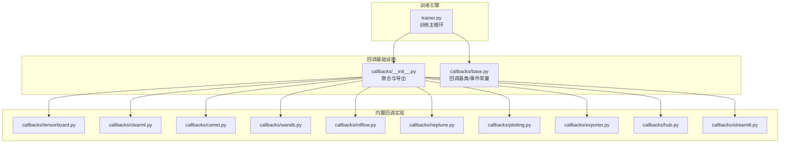
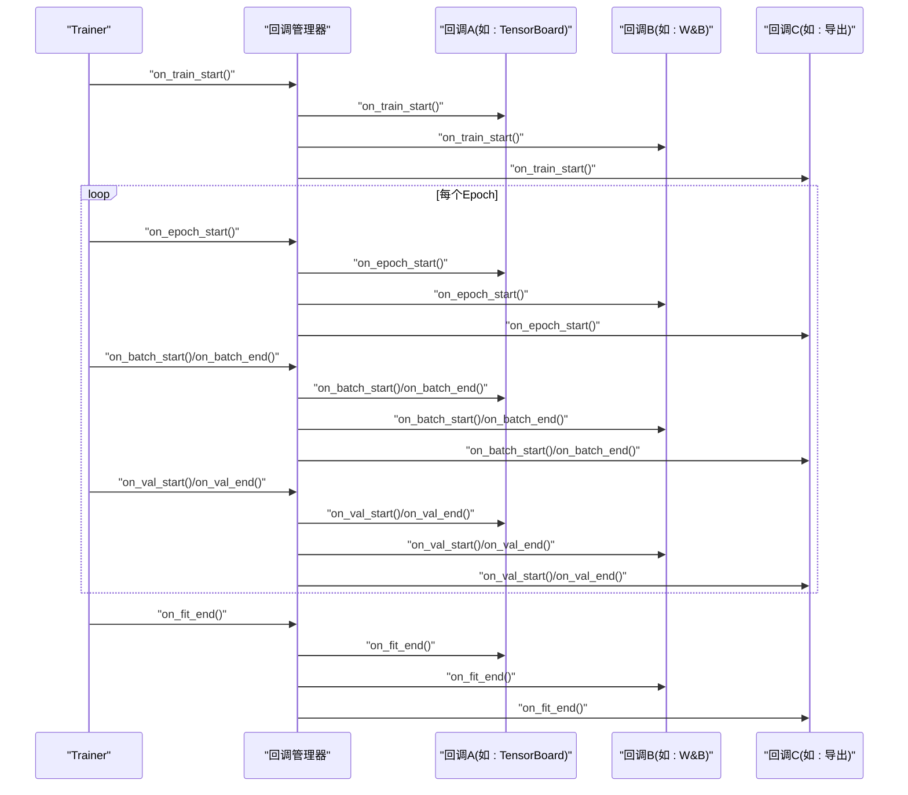
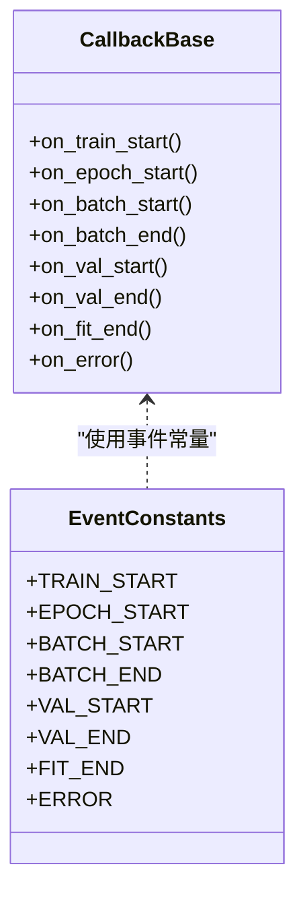
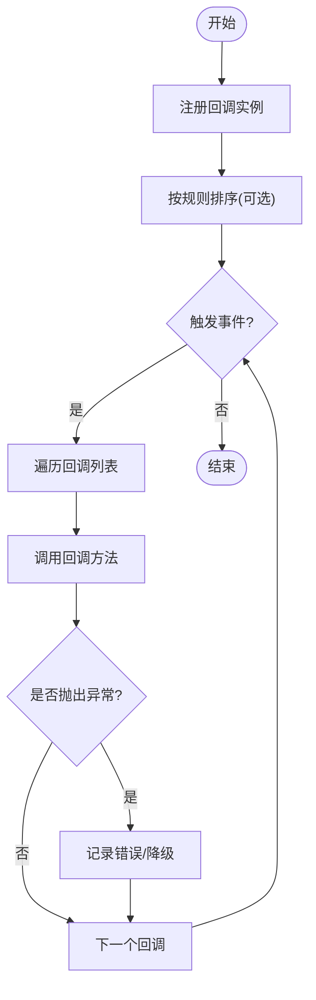
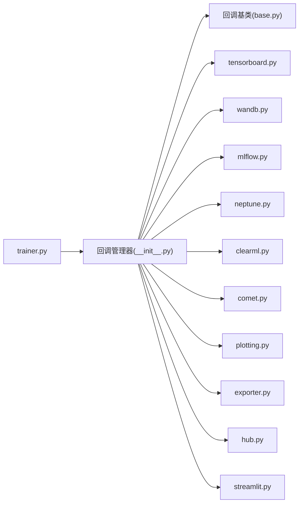

# 训练回调概述

<cite>
**本文引用的文件**
- [ultralytics/utils/callbacks/__init__.py](file://ultralytics/utils/callbacks/__init__.py)
- [ultralytics/utils/callbacks/base.py](file://ultralytics/utils/callbacks/base.py)
- [ultralytics/utils/callbacks/tensorboard.py](file://ultralytics/utils/callbacks/tensorboard.py)
- [ultralytics/utils/callbacks/clearml.py](file://ultralytics/utils/callbacks/clearml.py)
- [ultralytics/utils/callbacks/comet.py](file://ultralytics/utils/callbacks/comet.py)
- [ultralytics/utils/callbacks/wandb.py](file://ultralytics/utils/callbacks/wandb.py)
- [ultralytics/utils/callbacks/mlflow.py](file://ultralytics/utils/callbacks/mlflow.py)
- [ultralytics/utils/callbacks/neptune.py](file://ultralytics/utils/callbacks/neptune.py)
- [ultralytics/utils/callbacks/plotting.py](file://ultralytics/utils/callbacks/plotting.py)
- [ultralytics/utils/callbacks/exporter.py](file://ultralytics/utils/callbacks/exporter.py)
- [ultralytics/utils/callbacks/hub.py](file://ultralytics/utils/callbacks/hub.py)
- [ultralytics/utils/callbacks/streamlit.py](file://ultralytics/utils/callbacks/streamlit.py)
- [ultralytics/engine/trainer.py](file://ultralytics/engine/trainer.py)
</cite>

## 目录
1. [简介](#简介)
2. [项目结构](#项目结构)
3. [核心组件](#核心组件)
4. [架构总览](#架构总览)
5. [详细组件分析](#详细组件分析)
6. [依赖关系分析](#依赖关系分析)
7. [性能考虑](#性能考虑)
8. [故障排查指南](#故障排查指南)
9. [结论](#结论)
10. [附录](#附录)

## 简介
本概述文档面向YOLO-Master的训练回调系统，聚焦以下目标：
- 解释训练回调的基本概念、设计原理与生命周期管理
- 说明回调系统的架构模式：注册机制、执行顺序控制与错误处理策略
- 提供自定义回调开发的基础框架与使用指南（如何继承基类实现功能）
- 给出性能优化建议与最佳实践

该文档旨在帮助读者快速理解并扩展训练过程中的可插拔能力，如日志记录、指标上报、可视化、模型导出、云端同步等。

## 项目结构
YOLO-Master将训练回调统一组织在工具层，便于被引擎侧的Trainer调用与编排。关键位置如下：
- 回调接口与基类定义：位于工具层的回调包中，提供统一的钩子方法与生命周期事件
- 内置回调实现：涵盖TensorBoard、ClearML、Comet、W&B、MLflow、Neptune、绘图、导出、Hub、Streamlit等
- 训练引擎集成点：Trainer在训练循环的关键阶段触发回调事件

图表来源
- [ultralytics/engine/trainer.py](file://ultralytics/engine/trainer.py)
- [ultralytics/utils/callbacks/__init__.py](file://ultralytics/utils/callbacks/__init__.py)
- [ultralytics/utils/callbacks/base.py](file://ultralytics/utils/callbacks/base.py)
- [ultralytics/utils/callbacks/tensorboard.py](file://ultralytics/utils/callbacks/tensorboard.py)
- [ultralytics/utils/callbacks/clearml.py](file://ultralytics/utils/callbacks/clearml.py)
- [ultralytics/utils/callbacks/comet.py](file://ultralytics/utils/callbacks/comet.py)
- [ultralytics/utils/callbacks/wandb.py](file://ultralytics/utils/callbacks/wandb.py)
- [ultralytics/utils/callbacks/mlflow.py](file://ultralytics/utils/callbacks/mlflow.py)
- [ultralytics/utils/callbacks/neptune.py](file://ultralytics/utils/callbacks/neptune.py)
- [ultralytics/utils/callbacks/plotting.py](file://ultralytics/utils/callbacks/plotting.py)
- [ultralytics/utils/callbacks/exporter.py](file://ultralytics/utils/callbacks/exporter.py)
- [ultralytics/utils/callbacks/hub.py](file://ultralytics/utils/callbacks/hub.py)
- [ultralytics/utils/callbacks/streamlit.py](file://ultralytics/utils/callbacks/streamlit.py)

章节来源
- [ultralytics/utils/callbacks/__init__.py](file://ultralytics/utils/callbacks/__init__.py)
- [ultralytics/utils/callbacks/base.py](file://ultralytics/utils/callbacks/base.py)
- [ultralytics/engine/trainer.py](file://ultralytics/engine/trainer.py)

## 核心组件
- 回调基类与事件常量
  - 提供统一的回调方法签名与生命周期事件常量，确保所有回调遵循一致的契约
  - 典型事件包括：训练开始/结束、每个epoch开始/结束、每步开始/结束、验证开始/结束、保存检查点、导出、错误等
- 回调注册器/管理器
  - 负责收集、排序、执行回调实例
  - 支持按优先级或固定顺序执行，保证关键回调（如保存、导出）的执行时机
- 内置回调实现
  - 日志与指标：TensorBoard、ClearML、Comet、W&B、MLflow、Neptune
  - 可视化与导出：绘图、导出器、Streamlit UI
  - 平台集成：Hub上传与状态同步

章节来源
- [ultralytics/utils/callbacks/base.py](file://ultralytics/utils/callbacks/base.py)
- [ultralytics/utils/callbacks/__init__.py](file://ultralytics/utils/callbacks/__init__.py)

## 架构总览
训练回调采用“事件驱动 + 插件化”的架构模式：
- 事件驱动：Trainer在训练流程的关键节点发出事件
- 插件化：各回调作为独立模块订阅事件，按需实现逻辑
- 集中编排：回调管理器维护回调列表与执行顺序，并对异常进行隔离与上报

图表来源
- [ultralytics/engine/trainer.py](file://ultralytics/engine/trainer.py)
- [ultralytics/utils/callbacks/__init__.py](file://ultralytics/utils/callbacks/__init__.py)
- [ultralytics/utils/callbacks/base.py](file://ultralytics/utils/callbacks/base.py)

## 详细组件分析

### 回调基类与事件常量
- 职责
  - 定义回调方法的统一签名（例如：接收当前训练上下文、配置、进度信息等）
  - 提供事件常量，用于标识不同生命周期阶段
- 设计要点
  - 无副作用默认实现，便于子类选择性覆盖
  - 通过类型提示与文档字符串明确输入输出约定
- 复杂度
  - 时间复杂度：O(1)（仅定义与分发）
  - 空间复杂度：O(1)

图表来源
- [ultralytics/utils/callbacks/base.py](file://ultralytics/utils/callbacks/base.py)

章节来源
- [ultralytics/utils/callbacks/base.py](file://ultralytics/utils/callbacks/base.py)

### 回调管理器与注册机制
- 职责
  - 维护回调实例集合
  - 提供注册/注销接口
  - 按顺序遍历并调用对应事件方法
- 执行顺序控制
  - 支持按插入顺序或优先级排序
  - 对关键回调（如保存、导出）设置固定位置，避免被用户回调阻塞
- 错误处理策略
  - 单个回调异常不影响其他回调执行
  - 捕获异常并记录到统一日志，必要时中断训练或降级运行

图表来源
- [ultralytics/utils/callbacks/__init__.py](file://ultralytics/utils/callbacks/__init__.py)
- [ultralytics/utils/callbacks/base.py](file://ultralytics/utils/callbacks/base.py)

章节来源
- [ultralytics/utils/callbacks/__init__.py](file://ultralytics/utils/callbacks/__init__.py)
- [ultralytics/utils/callbacks/base.py](file://ultralytics/utils/callbacks/base.py)

### 内置回调实现概览
- 日志与指标
  - TensorBoard：写入标量、图像、直方图等
  - ClearML/Comet/W&B/MLflow/Neptune：对接各自平台，上传实验元数据与指标
- 可视化与导出
  - Plotting：绘制训练曲线、混淆矩阵、PR曲线等
  - Exporter：在合适时机触发模型导出
- 平台集成
  - Hub：上传权重、同步训练状态
  - Streamlit：提供交互式UI展示训练进度

章节来源
- [ultralytics/utils/callbacks/tensorboard.py](file://ultralytics/utils/callbacks/tensorboard.py)
- [ultralytics/utils/callbacks/clearml.py](file://ultralytics/utils/callbacks/clearml.py)
- [ultralytics/utils/callbacks/comet.py](file://ultralytics/utils/callbacks/comet.py)
- [ultralytics/utils/callbacks/wandb.py](file://ultralytics/utils/callbacks/wandb.py)
- [ultralytics/utils/callbacks/mlflow.py](file://ultralytics/utils/callbacks/mlflow.py)
- [ultralytics/utils/callbacks/neptune.py](file://ultralytics/utils/callbacks/neptune.py)
- [ultralytics/utils/callbacks/plotting.py](file://ultralytics/utils/callbacks/plotting.py)
- [ultralytics/utils/callbacks/exporter.py](file://ultralytics/utils/callbacks/exporter.py)
- [ultralytics/utils/callbacks/hub.py](file://ultralytics/utils/callbacks/hub.py)
- [ultralytics/utils/callbacks/streamlit.py](file://ultralytics/utils/callbacks/streamlit.py)

### 自定义回调开发指南
- 步骤
  - 继承回调基类，按需覆写所需事件方法
  - 在回调初始化时准备资源（如连接远端服务、打开文件句柄）
  - 在相应事件中执行业务逻辑（如记录指标、生成可视化）
  - 在训练结束时清理资源（关闭连接、释放内存）
- 注册方式
  - 通过回调管理器提供的注册接口添加自定义回调
  - 如需控制执行顺序，可在注册时指定优先级或插入位置
- 错误处理
  - 在回调内部捕获并处理异常，避免影响其他回调
  - 对于不可恢复的错误，可选择向上抛出以便管理器统一处理

章节来源
- [ultralytics/utils/callbacks/base.py](file://ultralytics/utils/callbacks/base.py)
- [ultralytics/utils/callbacks/__init__.py](file://ultralytics/utils/callbacks/__init__.py)

## 依赖关系分析
- Trainer与回调管理器耦合度低，通过事件接口解耦
- 回调之间相互独立，不直接依赖彼此，降低环依赖风险
- 外部库依赖（如TensorBoard、W&B、MLflow等）仅在对应回调中引入，减少主流程负担

图表来源
- [ultralytics/engine/trainer.py](file://ultralytics/engine/trainer.py)
- [ultralytics/utils/callbacks/__init__.py](file://ultralytics/utils/callbacks/__init__.py)
- [ultralytics/utils/callbacks/base.py](file://ultralytics/utils/callbacks/base.py)
- [ultralytics/utils/callbacks/tensorboard.py](file://ultralytics/utils/callbacks/tensorboard.py)
- [ultralytics/utils/callbacks/wandb.py](file://ultralytics/utils/callbacks/wandb.py)
- [ultralytics/utils/callbacks/mlflow.py](file://ultralytics/utils/callbacks/mlflow.py)
- [ultralytics/utils/callbacks/neptune.py](file://ultralytics/utils/callbacks/neptune.py)
- [ultralytics/utils/callbacks/clearml.py](file://ultralytics/utils/callbacks/clearml.py)
- [ultralytics/utils/callbacks/comet.py](file://ultralytics/utils/callbacks/comet.py)
- [ultralytics/utils/callbacks/plotting.py](file://ultralytics/utils/callbacks/plotting.py)
- [ultralytics/utils/callbacks/exporter.py](file://ultralytics/utils/callbacks/exporter.py)
- [ultralytics/utils/callbacks/hub.py](file://ultralytics/utils/callbacks/hub.py)
- [ultralytics/utils/callbacks/streamlit.py](file://ultralytics/utils/callbacks/streamlit.py)

章节来源
- [ultralytics/engine/trainer.py](file://ultralytics/engine/trainer.py)
- [ultralytics/utils/callbacks/__init__.py](file://ultralytics/utils/callbacks/__init__.py)

## 性能考虑
- 异步与批处理
  - 对I/O密集型回调（如远端上传）建议使用异步或批量提交，减少网络往返
- 采样与节流
  - 高频事件（如每步）应进行采样或节流，避免频繁写入导致训练瓶颈
- 资源复用
  - 复用连接与对象（如Writer、Logger），避免在每个事件中重复创建
- 计算卸载
  - 将重计算任务移至后台线程或进程，避免阻塞训练主循环
- 条件启用
  - 根据配置动态启用回调，减少不必要的开销

[本节为通用指导，无需特定文件引用]

## 故障排查指南
- 常见问题
  - 回调未触发：检查事件常量与方法名是否与基类一致；确认已正确注册
  - 执行顺序问题：查看管理器排序逻辑，必要时调整优先级或插入位置
  - 异常中断：定位具体回调的异常堆栈，确认是否吞掉异常或未做隔离
  - 资源泄漏：确保在on_fit_end或析构中释放资源
- 诊断建议
  - 开启详细日志，记录每个事件的进入与退出
  - 为回调增加计时与计数统计，识别热点路径
  - 逐步禁用部分回调以定位问题源

章节来源
- [ultralytics/utils/callbacks/base.py](file://ultralytics/utils/callbacks/base.py)
- [ultralytics/utils/callbacks/__init__.py](file://ultralytics/utils/callbacks/__init__.py)

## 结论
YOLO-Master的训练回调系统通过事件驱动与插件化设计，实现了高内聚、低耦合的可扩展架构。统一的基类与事件常量简化了自定义回调的开发，而回调管理器提供了可靠的执行顺序与错误隔离机制。结合性能优化与最佳实践，开发者可以高效地扩展训练流程，满足多样化的监控、可视化与集成需求。

[本节为总结性内容，无需特定文件引用]

## 附录
- 术语
  - 回调：在训练生命周期特定时刻触发的可插拔函数或对象
  - 事件：表示训练流程中的某个阶段或动作
  - 回调管理器：负责注册、排序与执行回调的组件
- 参考路径
  - 基类与事件常量：[ultralytics/utils/callbacks/base.py](file://ultralytics/utils/callbacks/base.py)
  - 回调聚合与导出：[ultralytics/utils/callbacks/__init__.py](file://ultralytics/utils/callbacks/__init__.py)
  - 训练引擎集成点：[ultralytics/engine/trainer.py](file://ultralytics/engine/trainer.py)