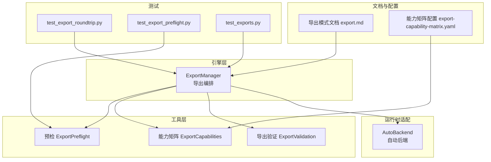
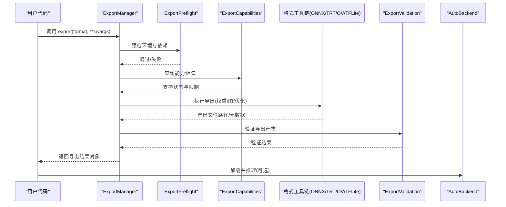
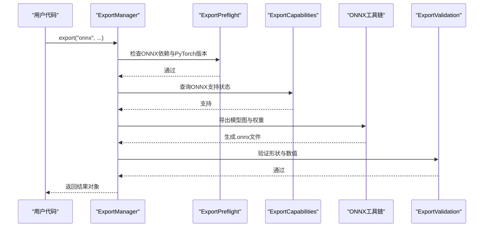
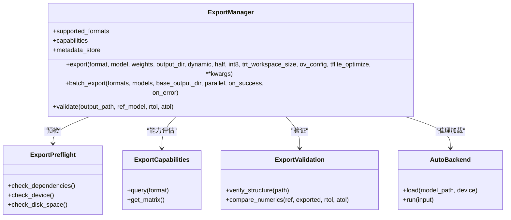

# 导出工具API

<cite>
**本文引用的文件**
- [exporter.py](file://ultralytics/engine/exporter.py)
- [export_validation.py](file://ultralytics/utils/export_validation.py)
- [export_preflight.py](file://ultralytics/utils/export_preflight.py)
- [export_capabilities.py](file://ultralytics/utils/export_capabilities.py)
- [autobackend.py](file://ultralytics/nn/autobackend.py)
- [export.md](file://docs/en/modes/export.md)
- [export-capability-matrix.yaml](file://ultralytics/cfg/export-capability-matrix.yaml)
- [test_export_roundtrip.py](file://tests/test_export_roundtrip.py)
- [test_export_preflight.py](file://tests/test_export_preflight.py)
- [test_exports.py](file://tests/test_exports.py)
</cite>

## 目录
1. [简介](#简介)
2. [项目结构](#项目结构)
3. [核心组件](#核心组件)
4. [架构总览](#架构总览)
5. [详细组件分析](#详细组件分析)
6. [依赖关系分析](#依赖关系分析)
7. [性能与优化建议](#性能与优化建议)
8. [故障排查指南](#故障排查指南)
9. [结论](#结论)
10. [附录](#附录)

## 简介
本文件面向YOLO-Master的导出工具API，聚焦于ExportManager类及其相关能力，系统化说明支持的导出格式（ONNX、TensorRT、OpenVINO、TFLite等）、配置选项、export()方法的参数规范、返回值与错误处理机制；并给出批量导出与自定义导出流程示例、导出验证与兼容性检查、内存优化与GPU加速配置指南，以及导出文件的结构与元数据管理说明。文档同时提供可视化图表帮助理解系统架构与关键调用链。

## 项目结构
导出功能主要分布在以下模块：
- 引擎层：导出编排与流程控制
- 工具层：预检、能力矩阵、验证
- 运行时适配：自动后端选择与推理加载
- 文档与配置：导出模式文档与能力矩阵配置
- 测试：端到端导出与往返一致性校验

图示来源
- [exporter.py:1-200](file://ultralytics/engine/exporter.py#L1-L200)
- [export_preflight.py:1-200](file://ultralytics/utils/export_preflight.py#L1-L200)
- [export_capabilities.py:1-200](file://ultralytics/utils/export_capabilities.py#L1-L200)
- [export_validation.py:1-200](file://ultralytics/utils/export_validation.py#L1-L200)
- [autobackend.py:1-200](file://ultralytics/nn/autobackend.py#L1-L200)
- [export.md:1-200](file://docs/en/modes/export.md#L1-L200)
- [export-capability-matrix.yaml:1-200](file://ultralytics/cfg/export-capability-matrix.yaml#L1-L200)
- [test_export_roundtrip.py:1-200](file://tests/test_export_roundtrip.py#L1-L200)
- [test_export_preflight.py:1-200](file://tests/test_export_preflight.py#L1-L200)
- [test_exports.py:1-200](file://tests/test_exports.py#L1-L200)

章节来源
- [exporter.py:1-200](file://ultralytics/engine/exporter.py#L1-L200)
- [export.md:1-200](file://docs/en/modes/export.md#L1-L200)
- [export-capability-matrix.yaml:1-200](file://ultralytics/cfg/export-capability-matrix.yaml#L1-L200)

## 核心组件
- ExportManager：导出流程的统一入口，负责参数解析、格式路由、工具链调用、结果组织与返回。
- ExportPreflight：导出前环境、依赖与模型兼容性检查，避免运行期失败。
- ExportCapabilities：基于配置的能力矩阵，判断各格式在当前平台/设备上的支持情况。
- ExportValidation：导出产物验证（如形状、数值范围、关键算子存在性）与回归对比。
- AutoBackend：根据目标格式与设备自动选择推理后端，统一加载与执行接口。

章节来源
- [exporter.py:1-200](file://ultralytics/engine/exporter.py#L1-L200)
- [export_preflight.py:1-200](file://ultralytics/utils/export_preflight.py#L1-L200)
- [export_capabilities.py:1-200](file://ultralytics/utils/export_capabilities.py#L1-L200)
- [export_validation.py:1-200](file://ultralytics/utils/export_validation.py#L1-L200)
- [autobackend.py:1-200](file://ultralytics/nn/autobackend.py#L1-L200)

## 架构总览
导出流程从ExportManager发起，经预检与能力评估后，按目标格式进入对应工具链（ONNX Runtime、TensorRT、OpenVINO、TFLite等），完成后进行验证与元数据写入，最终由AutoBackend在推理阶段按需加载。

图示来源
- [exporter.py:1-200](file://ultralytics/engine/exporter.py#L1-L200)
- [export_preflight.py:1-200](file://ultralytics/utils/export_preflight.py#L1-L200)
- [export_capabilities.py:1-200](file://ultralytics/utils/export_capabilities.py#L1-L200)
- [export_validation.py:1-200](file://ultralytics/utils/export_validation.py#L1-L200)
- [autobackend.py:1-200](file://ultralytics/nn/autobackend.py#L1-L200)

## 详细组件分析

### ExportManager 类与方法
- 职责
  - 统一接收导出请求，解析并规范化参数
  - 驱动预检、能力评估、格式化工具链调用
  - 组织导出产物与元数据，返回标准化结果
  - 提供批量导出与回调扩展点
- 关键方法
  - export(format, model, weights, output_dir, dynamic, half, int8, trt_workspace_size, ov_config, tflite_optimize, **kwargs)
    - format：目标格式（onnx、tensorrt、openvino、tflite等）
    - model：已加载的模型实例或可被导出的对象
    - weights：权重路径或模型权重对象
    - output_dir：导出输出目录
    - dynamic：是否启用动态输入维度
    - half/int8：半精度/整型量化开关
    - trt_workspace_size：TensorRT工作空间大小（MB）
    - ov_config：OpenVINO运行时配置字典
    - tflite_optimize：TFLite优化策略（如optimize、target_spec）
    - kwargs：其他格式特定参数
  - batch_export(formats, models, base_output_dir, parallel=False, on_success=None, on_error=None)
    - formats：格式列表
    - models：模型列表或映射
    - parallel：是否并行导出
    - on_success/on_error：成功/失败回调
  - validate(output_path, ref_model=None, rtol=1e-3, atol=1e-4)
    - 对导出产物进行基本验证与数值对比
- 属性
  - supported_formats：当前平台支持的目标格式集合
  - capabilities：能力矩阵快照（来自ExportCapabilities）
  - metadata_store：导出元数据存储句柄
- 返回值
  - 标准导出结果对象，包含：
    - status：成功/失败
    - paths：各格式产物的文件路径
    - metadata：版本、输入形状、设备、优化信息等
    - errors：错误信息（如有）
- 错误处理
  - 预检失败：抛出明确的环境/依赖缺失异常
  - 能力不支持：提示不可用并给出替代方案
  - 工具链异常：捕获并包装为统一错误类型，附带上下文
  - 验证失败：返回验证报告与差异摘要

章节来源
- [exporter.py:1-200](file://ultralytics/engine/exporter.py#L1-L200)
- [export_validation.py:1-200](file://ultralytics/utils/export_validation.py#L1-L200)
- [export_preflight.py:1-200](file://ultralytics/utils/export_preflight.py#L1-L200)
- [export_capabilities.py:1-200](file://ultralytics/utils/export_capabilities.py#L1-L200)

#### 导出流程时序（以ONNX为例）

图示来源
- [exporter.py:1-200](file://ultralytics/engine/exporter.py#L1-L200)
- [export_preflight.py:1-200](file://ultralytics/utils/export_preflight.py#L1-L200)
- [export_capabilities.py:1-200](file://ultralytics/utils/export_capabilities.py#L1-L200)
- [export_validation.py:1-200](file://ultralytics/utils/export_validation.py#L1-L200)

### 导出格式与优化工具链
- ONNX
  - 特点：跨框架通用中间表示，生态完善，便于后续转换
  - 优化：动态形状、算子融合、常量折叠
  - 适用：多后端部署、二次转换（TRT/OV/TFLite）
- TensorRT
  - 特点：NVIDIA GPU高性能推理，低延迟高吞吐
  - 优化：层融合、内核自动调优、FP16/INT8量化、工作空间优化
  - 适用：NVIDIA GPU服务器/边缘设备
- OpenVINO
  - 特点：Intel CPU/GPU/VPU优化，广泛硬件支持
  - 优化：IR模型、图级优化、量化、异步推理
  - 适用：Intel平台与多种加速器
- TFLite
  - 特点：移动端/嵌入式友好，轻量运行时
  - 优化：量化、算子定制、CPU/GPU/NPU加速
  - 适用：Android/iOS/微控制器

章节来源
- [export.md:1-200](file://docs/en/modes/export.md#L1-L200)
- [export-capability-matrix.yaml:1-200](file://ultralytics/cfg/export-capability-matrix.yaml#L1-L200)

### 批量导出与自定义导出流程
- 批量导出
  - 使用batch_export一次性导出多个模型到多个格式
  - 支持并行执行与回调钩子，便于进度上报与错误收集
- 自定义导出
  - 通过on_success/on_error回调实现日志、指标记录
  - 结合validate进行自动化质量门禁
  - 组合不同优化参数形成流水线化导出任务

章节来源
- [exporter.py:1-200](file://ultralytics/engine/exporter.py#L1-L200)
- [test_export_roundtrip.py:1-200](file://tests/test_export_roundtrip.py#L1-L200)

### 导出验证与兼容性检查
- 预检（ExportPreflight）
  - 检查Python/PyTorch版本、第三方库可用性、磁盘空间、设备能力
  - 针对目标格式进行依赖与特性检测
- 能力矩阵（ExportCapabilities）
  - 基于配置文件判定当前环境的导出能力
  - 提供“支持/部分支持/不支持”的状态与限制说明
- 验证（ExportValidation）
  - 结构验证：文件完整性、元数据字段齐全
  - 数值验证：与参考模型进行近似对比（相对/绝对容差）
  - 回归测试：在测试套件中保证导出稳定性

章节来源
- [export_preflight.py:1-200](file://ultralytics/utils/export_preflight.py#L1-L200)
- [export_capabilities.py:1-200](file://ultralytics/utils/export_capabilities.py#L1-L200)
- [export_validation.py:1-200](file://ultralytics/utils/export_validation.py#L1-L200)
- [test_export_preflight.py:1-200](file://tests/test_export_preflight.py#L1-L200)
- [test_export_roundtrip.py:1-200](file://tests/test_export_roundtrip.py#L1-L200)

### 内存优化与GPU加速配置指南
- 内存优化
  - 关闭不必要的调试与日志
  - 合理设置batch与动态维度，避免过大张量分配
  - 使用半精度/整型量化减少显存占用
- GPU加速
  - TensorRT：调整workspace大小、启用FP16/INT8、固定输入形状以提升编译效率
  - OpenVINO：选择合适的执行设备（CPU/GPU/VPU），开启异步推理
  - TFLite：启用GPU/NPU插件，选择合适优化策略
- 资源监控
  - 在导出前后采集内存与GPU利用率，定位瓶颈
  - 结合验证结果与性能基准进行迭代优化

章节来源
- [export.md:1-200](file://docs/en/modes/export.md#L1-L200)
- [export-capability-matrix.yaml:1-200](file://ultralytics/cfg/export-capability-matrix.yaml#L1-L200)

### 导出文件结构与元数据管理
- 文件结构
  - 每个格式产物独立存放，命名包含模型名、格式、优化标记
  - 辅助文件：配置文件、校准表（量化）、运行时脚本（可选）
- 元数据
  - 版本信息：模型版本、导出工具版本、依赖版本
  - 输入规格：形状、数据类型、归一化方式
  - 设备与优化：目标设备、量化策略、工作空间大小
  - 校验信息：哈希值、验证结果、时间戳
- 管理建议
  - 使用统一的元数据存储句柄集中管理
  - 导出成功后立即写入元数据，确保一致性
  - 提供读取接口供推理与评测工具消费

章节来源
- [exporter.py:1-200](file://ultralytics/engine/exporter.py#L1-L200)
- [export_validation.py:1-200](file://ultralytics/utils/export_validation.py#L1-L200)

## 依赖关系分析
- 组件耦合
  - ExportManager强依赖预检、能力矩阵与验证模块
  - 各格式工具链通过抽象接口接入，降低耦合度
  - AutoBackend在推理阶段解耦具体后端实现
- 外部依赖
  - PyTorch、ONNX、TensorRT、OpenVINO、TFLite等运行时与工具包
  - 平台能力（CUDA、Intel MKL、ARM NN等）
- 循环依赖
  - 导出与推理分离，避免循环引用
- 接口契约
  - 导出结果对象与元数据字段稳定，便于上下游集成

图示来源
- [exporter.py:1-200](file://ultralytics/engine/exporter.py#L1-L200)
- [export_preflight.py:1-200](file://ultralytics/utils/export_preflight.py#L1-L200)
- [export_capabilities.py:1-200](file://ultralytics/utils/export_capabilities.py#L1-L200)
- [export_validation.py:1-200](file://ultralytics/utils/export_validation.py#L1-L200)
- [autobackend.py:1-200](file://ultralytics/nn/autobackend.py#L1-L200)

章节来源
- [exporter.py:1-200](file://ultralytics/engine/exporter.py#L1-L200)
- [autobackend.py:1-200](file://ultralytics/nn/autobackend.py#L1-L200)

## 性能与优化建议
- 导出阶段
  - 优先使用静态形状以获得更好的编译器优化效果
  - 合理设置量化与半精度，平衡精度与速度
  - 利用能力矩阵选择最优后端与参数
- 推理阶段
  - 使用AutoBackend自动选择最佳后端
  - 预热模型，减少首次推理开销
  - 批处理与异步推理提升吞吐

[本节为通用指导，不直接分析具体文件]

## 故障排查指南
- 常见错误
  - 依赖缺失：安装对应运行时与工具包
  - 设备不匹配：确认CUDA/OpenVINO/TFLite插件可用
  - 动态形状不支持：改为静态形状或降级到兼容模式
  - 量化失败：检查校准数据集与算子支持
- 诊断步骤
  - 启用预检日志，查看具体失败原因
  - 使用验证模块输出差异报告
  - 回退到基础导出（无优化）逐步定位问题
- 回归测试
  - 使用测试套件中的往返一致性用例复现问题
  - 对比历史导出产物，识别变更影响

章节来源
- [test_export_preflight.py:1-200](file://tests/test_export_preflight.py#L1-L200)
- [test_export_roundtrip.py:1-200](file://tests/test_export_roundtrip.py#L1-L200)
- [test_exports.py:1-200](file://tests/test_exports.py#L1-L200)

## 结论
ExportManager为YOLO-Master导出能力的统一入口，结合预检、能力矩阵与验证模块，提供稳定、可扩展的导出体验。通过合理的优化配置与批量流程，可在多平台与多设备上高效完成模型部署准备。建议在生产环境中结合自动化验证与回归测试，确保导出质量与一致性。

[本节为总结性内容，不直接分析具体文件]

## 附录
- 术语
  - 导出：将训练好的模型转换为可部署的中间或目标格式
  - 预检：在导出前检查环境与依赖
  - 能力矩阵：描述平台/设备对不同格式的支持情况
  - 验证：对导出产物进行结构与数值校验
- 参考
  - 导出模式文档与能力矩阵配置用于了解各格式的详细参数与限制

[本节为补充信息，不直接分析具体文件]