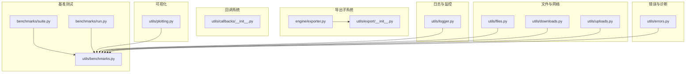
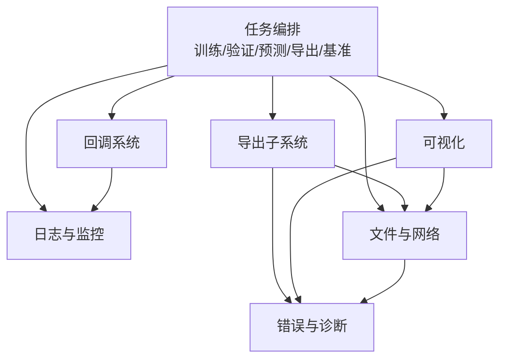
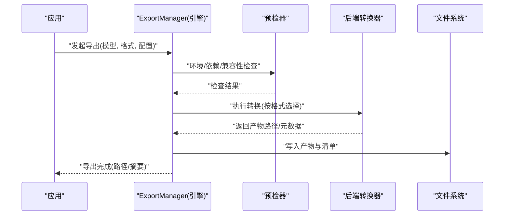
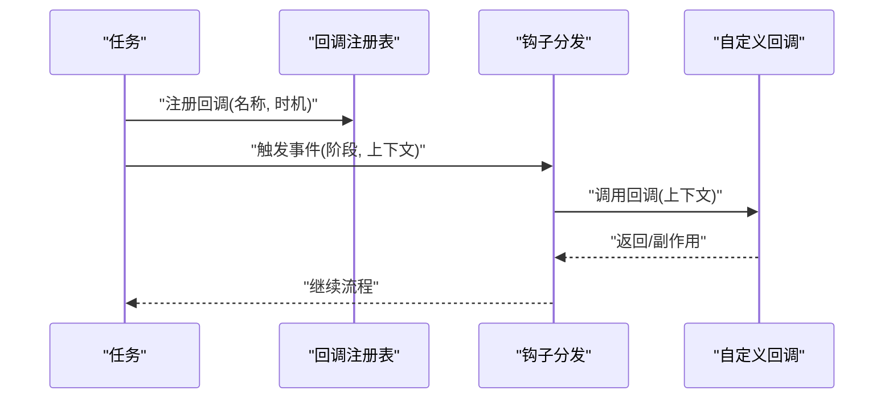
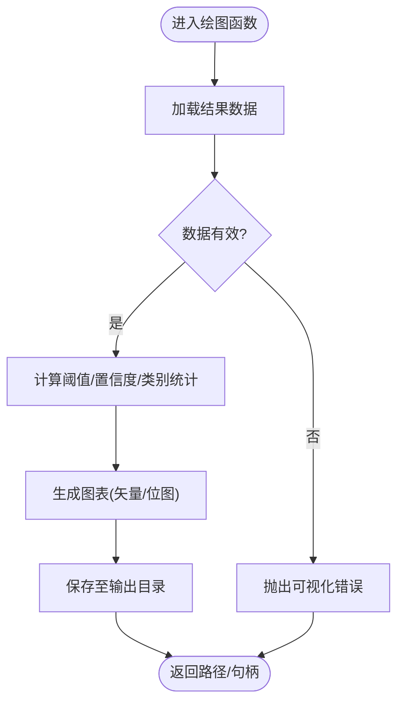
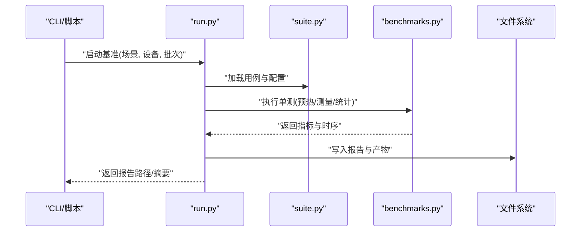
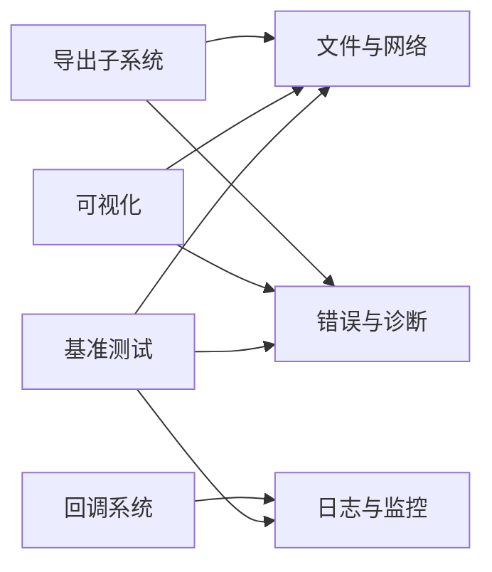

# 工具API

<cite>
**本文引用的文件**
- [ultralytics/utils/callbacks/__init__.py](file://ultralytics/utils/callbacks/__init__.py)
- [ultralytics/utils/export/__init__.py](file://ultralytics/utils/export/__init__.py)
- [ultralytics/engine/exporter.py](file://ultralytics/engine/exporter.py)
- [ultralytics/utils/benchmarks.py](file://ultralytics/utils/benchmarks.py)
- [ultralytics/utils/plotting.py](file://ultralytics/utils/plotting.py)
- [ultralytics/utils/logger.py](file://ultralytics/utils/logger.py)
- [ultralytics/utils/files.py](file://ultralytics/utils/files.py)
- [ultralytics/utils/downloads.py](file://ultralytics/utils/downloads.py)
- [ultralytics/utils/uploads.py](file://ultralytics/utils/uploads.py)
- [ultralytics/utils/errors.py](file://ultralytics/utils/errors.py)
- [benchmarks/suite.py](file://benchmarks/suite.py)
- [benchmarks/run.py](file://benchmarks/run.py)
</cite>

## 目录
1. [简介](#简介)
2. [项目结构](#项目结构)
3. [核心组件](#核心组件)
4. [架构总览](#架构总览)
5. [详细组件分析](#详细组件分析)
6. [依赖关系分析](#依赖关系分析)
7. [性能考量](#性能考量)
8. [故障排查指南](#故障排查指南)
9. [结论](#结论)
10. [附录](#附录)

## 简介
本文件为 YOLO-Master 工具 API 的权威参考，聚焦实用工具与辅助函数，覆盖以下主题：
- 导出工具与 ExportManager 的导出格式支持与配置选项
- Callback 系统的注册机制与自定义回调实现方法
- 可视化 API 使用指南（结果图表生成、交互式可视化）
- 基准测试工具的接口与报告生成方法
- 日志记录与监控的配置选项
- 文件操作与网络请求的工具函数
- 错误诊断与调试工具的使用指南

目标读者包括希望扩展 YOLO-Master 工作流、集成第三方系统或构建自动化流水线的工程师。

## 项目结构
工具 API 主要分布在以下模块：
- 导出子系统：engine.exporter 与 utils.export
- 回调系统：utils.callbacks
- 可视化：utils.plotting
- 基准测试：utils.benchmarks 与 benchmarks.suite/run
- 日志与监控：utils.logger
- 文件与网络：utils.files, utils.downloads, utils.uploads
- 错误与诊断：utils.errors

图示来源
- [ultralytics/engine/exporter.py](file://ultralytics/engine/exporter.py)
- [ultralytics/utils/export/__init__.py](file://ultralytics/utils/export/__init__.py)
- [ultralytics/utils/callbacks/__init__.py](file://ultralytics/utils/callbacks/__init__.py)
- [ultralytics/utils/plotting.py](file://ultralytics/utils/plotting.py)
- [ultralytics/utils/benchmarks.py](file://ultralytics/utils/benchmarks.py)
- [benchmarks/suite.py](file://benchmarks/suite.py)
- [benchmarks/run.py](file://benchmarks/run.py)
- [ultralytics/utils/logger.py](file://ultralytics/utils/logger.py)
- [ultralytics/utils/files.py](file://ultralytics/utils/files.py)
- [ultralytics/utils/downloads.py](file://ultralytics/utils/downloads.py)
- [ultralytics/utils/uploads.py](file://ultralytics/utils/uploads.py)
- [ultralytics/utils/errors.py](file://ultralytics/utils/errors.py)

章节来源
- [ultralytics/engine/exporter.py](file://ultralytics/engine/exporter.py)
- [ultralytics/utils/export/__init__.py](file://ultralytics/utils/export/__init__.py)
- [ultralytics/utils/callbacks/__init__.py](file://ultralytics/utils/callbacks/__init__.py)
- [ultralytics/utils/plotting.py](file://ultralytics/utils/plotting.py)
- [ultralytics/utils/benchmarks.py](file://ultralytics/utils/benchmarks.py)
- [benchmarks/suite.py](file://benchmarks/suite.py)
- [benchmarks/run.py](file://benchmarks/run.py)
- [ultralytics/utils/logger.py](file://ultralytics/utils/logger.py)
- [ultralytics/utils/files.py](file://ultralytics/utils/files.py)
- [ultralytics/utils/downloads.py](file://ultralytics/utils/downloads.py)
- [ultralytics/utils/uploads.py](file://ultralytics/utils/uploads.py)
- [ultralytics/utils/errors.py](file://ultralytics/utils/errors.py)

## 核心组件
本节概述各工具子系统的职责与对外暴露的关键能力，便于快速定位文档位置与使用方法。

- 导出子系统
  - 提供统一的模型导出入口与格式支持矩阵，封装 ONNX/TensorRT/OpenVINO/CoreML/TFLite 等后端转换流程，并输出标准化产物与元数据。
  - 关键入口位于 engine.exporter 与 utils.export。

- 回调系统
  - 在训练、验证、预测、导出等阶段触发事件钩子，允许用户注入自定义逻辑（如指标上报、中间快照、告警）。
  - 通过统一注册表管理回调生命周期。

- 可视化
  - 提供 PR/AUC/混淆矩阵/热力图/轨迹图等常用图表绘制能力，支持批量与交互式输出。

- 基准测试
  - 提供端到端基准套件与微基准接口，支持多设备、多精度、多批次的吞吐/延迟统计与报告生成。

- 日志与监控
  - 结构化日志、分级控制、可插拔处理器，便于对接外部监控系统。

- 文件与网络
  - 路径解析、临时目录、下载/上传、断点续传、重试与校验等通用工具。

- 错误与诊断
  - 统一异常层次、诊断信息收集、上下文增强与可观测性字段。

章节来源
- [ultralytics/engine/exporter.py](file://ultralytics/engine/exporter.py)
- [ultralytics/utils/export/__init__.py](file://ultralytics/utils/export/__init__.py)
- [ultralytics/utils/callbacks/__init__.py](file://ultralytics/utils/callbacks/__init__.py)
- [ultralytics/utils/plotting.py](file://ultralytics/utils/plotting.py)
- [ultralytics/utils/benchmarks.py](file://ultralytics/utils/benchmarks.py)
- [benchmarks/suite.py](file://benchmarks/suite.py)
- [benchmarks/run.py](file://benchmarks/run.py)
- [ultralytics/utils/logger.py](file://ultralytics/utils/logger.py)
- [ultralytics/utils/files.py](file://ultralytics/utils/files.py)
- [ultralytics/utils/downloads.py](file://ultralytics/utils/downloads.py)
- [ultralytics/utils/uploads.py](file://ultralytics/utils/uploads.py)
- [ultralytics/utils/errors.py](file://ultralytics/utils/errors.py)

## 架构总览
下图展示工具 API 的整体交互关系：上层任务（训练/验证/预测/导出/基准）通过回调系统与导出子系统协作；可视化与日志贯穿全链路；文件与网络支撑资源获取与产物落地；错误与诊断保障稳定性与可观测性。

图示来源
- [ultralytics/utils/callbacks/__init__.py](file://ultralytics/utils/callbacks/__init__.py)
- [ultralytics/engine/exporter.py](file://ultralytics/engine/exporter.py)
- [ultralytics/utils/plotting.py](file://ultralytics/utils/plotting.py)
- [ultralytics/utils/logger.py](file://ultralytics/utils/logger.py)
- [ultralytics/utils/files.py](file://ultralytics/utils/files.py)
- [ultralytics/utils/downloads.py](file://ultralytics/utils/downloads.py)
- [ultralytics/utils/uploads.py](file://ultralytics/utils/uploads.py)
- [ultralytics/utils/errors.py](file://ultralytics/utils/errors.py)

## 详细组件分析

### 导出子系统与 ExportManager
- 职责
  - 统一管理模型导出流程，屏蔽不同后端的差异，提供一致的参数与产物规范。
  - 维护导出能力矩阵，动态发现可用后端与约束条件。
- 关键能力
  - 导出格式：ONNX、TensorRT、OpenVINO、CoreML、TFLite、TorchScript、PaddlePaddle、MNN、NCNN、RKNN、QNN、Litert、DeepX、Axelera、Hailo 等（以实际实现为准）。
  - 配置项：输入形状、动态轴、优化级别、量化策略、算子白名单、运行时目标平台、产物命名与目录布局。
  - 预检与校验：环境探测、依赖检查、兼容性验证、导出前自检。
  - 产物与元数据：导出模型、配置文件、版本信息与运行说明。
- 典型调用序列

图示来源
- [ultralytics/engine/exporter.py](file://ultralytics/engine/exporter.py)
- [ultralytics/utils/export/__init__.py](file://ultralytics/utils/export/__init__.py)

章节来源
- [ultralytics/engine/exporter.py](file://ultralytics/engine/exporter.py)
- [ultralytics/utils/export/__init__.py](file://ultralytics/utils/export/__init__.py)

### 回调系统（注册与自定义）
- 设计要点
  - 事件驱动：在关键阶段（开始/结束、每步、每轮、异常）触发回调。
  - 注册表：集中管理回调名称到实现的映射，支持优先级与过滤。
  - 上下文：回调可访问当前任务状态、配置、指标与产物路径。
- 自定义回调步骤
  - 定义回调类或函数，遵循回调签名约定。
  - 在注册表中登记回调名与触发时机。
  - 在任务启动时加载并执行。
- 典型调用序列

图示来源
- [ultralytics/utils/callbacks/__init__.py](file://ultralytics/utils/callbacks/__init__.py)

章节来源
- [ultralytics/utils/callbacks/__init__.py](file://ultralytics/utils/callbacks/__init__.py)

### 可视化 API（结果图表与交互式可视化）
- 能力概览
  - 标准图表：PR 曲线、AUC、混淆矩阵、损失/指标曲线、热力图、轨迹图、掩码/关键点叠加。
  - 批量与并行：支持数据集级汇总与对比视图。
  - 交互模式：Jupyter/Notebook 内联渲染、HTML 导出、Web 预览。
- 使用建议
  - 将导出/推理/评估结果对象传入绘图函数，指定输出目录与样式。
  - 对大规模结果采用分块渲染与缓存，避免内存峰值。
- 流程图（生成 PR 曲线示例）

图示来源
- [ultralytics/utils/plotting.py](file://ultralytics/utils/plotting.py)

章节来源
- [ultralytics/utils/plotting.py](file://ultralytics/utils/plotting.py)

### 基准测试工具（接口与报告）
- 套件与运行器
  - suite：定义基准用例、场景、指标与聚合规则。
  - run：调度执行、并发控制、结果收集与报告生成。
- 指标与报告
  - 吞吐（FPS）、延迟（p50/p95/p99）、内存占用、能耗（可选）、复现实验哈希。
  - 输出 JSON/CSV/HTML 报告，包含实验元数据与原始时序。
- 执行序列

图示来源
- [benchmarks/run.py](file://benchmarks/run.py)
- [benchmarks/suite.py](file://benchmarks/suite.py)
- [ultralytics/utils/benchmarks.py](file://ultralytics/utils/benchmarks.py)

章节来源
- [benchmarks/run.py](file://benchmarks/run.py)
- [benchmarks/suite.py](file://benchmarks/suite.py)
- [ultralytics/utils/benchmarks.py](file://ultralytics/utils/benchmarks.py)

### 日志记录与监控
- 功能特性
  - 分级日志（DEBUG/INFO/WARNING/ERROR），结构化字段（任务ID、阶段、指标、路径）。
  - 可插拔处理器（控制台、文件、远程上报），支持异步写入与缓冲。
  - 与回调系统集成，自动附加上下文。
- 配置要点
  - 日志级别、输出路径、滚动策略、采样率、敏感信息脱敏。
  - 与监控系统对接（指标上报、追踪 ID 透传）。

章节来源
- [ultralytics/utils/logger.py](file://ultralytics/utils/logger.py)

### 文件操作与网络请求
- 文件工具
  - 路径规范化、临时目录管理、目录/文件存在性检查、递归遍历、大小与哈希计算。
- 下载工具
  - URL 下载、断点续传、重试与退避、完整性校验、代理与超时设置。
- 上传工具
  - 分片上传、进度回调、失败重试、存储后端抽象。
- 使用建议
  - 所有 I/O 操作应带超时与重试，避免阻塞主流程。
  - 大文件处理优先流式读写，减少内存占用。

章节来源
- [ultralytics/utils/files.py](file://ultralytics/utils/files.py)
- [ultralytics/utils/downloads.py](file://ultralytics/utils/downloads.py)
- [ultralytics/utils/uploads.py](file://ultralytics/utils/uploads.py)

### 错误诊断与调试工具
- 异常层次
  - 统一基类与领域异常，携带上下文（任务、阶段、配置片段、堆栈摘要）。
- 诊断能力
  - 自动收集环境信息、依赖版本、GPU/CPU 状态、磁盘空间、网络连通性。
  - 导出/推理/训练阶段的断点与回溯增强。
- 使用建议
  - 在关键路径捕获并包装异常，附带必要上下文以便定位根因。
  - 结合日志与回调上报，形成闭环诊断。

章节来源
- [ultralytics/utils/errors.py](file://ultralytics/utils/errors.py)

## 依赖关系分析
- 耦合与内聚
  - 导出子系统与后端转换器高内聚，通过预检器与环境探测降低外部耦合。
  - 回调系统作为横切关注点，低耦合接入各子系统。
  - 可视化与基准测试共享日志与文件工具，复用性强。
- 外部依赖
  - 网络与文件系统为基础设施层，被多数模块间接依赖。
  - 错误与诊断贯穿全链路，提升可观测性。

图示来源
- [ultralytics/engine/exporter.py](file://ultralytics/engine/exporter.py)
- [ultralytics/utils/export/__init__.py](file://ultralytics/utils/export/__init__.py)
- [ultralytics/utils/callbacks/__init__.py](file://ultralytics/utils/callbacks/__init__.py)
- [ultralytics/utils/plotting.py](file://ultralytics/utils/plotting.py)
- [ultralytics/utils/benchmarks.py](file://ultralytics/utils/benchmarks.py)
- [ultralytics/utils/logger.py](file://ultralytics/utils/logger.py)
- [ultralytics/utils/files.py](file://ultralytics/utils/files.py)
- [ultralytics/utils/downloads.py](file://ultralytics/utils/downloads.py)
- [ultralytics/utils/uploads.py](file://ultralytics/utils/uploads.py)
- [ultralytics/utils/errors.py](file://ultralytics/utils/errors.py)

章节来源
- [ultralytics/engine/exporter.py](file://ultralytics/engine/exporter.py)
- [ultralytics/utils/export/__init__.py](file://ultralytics/utils/export/__init__.py)
- [ultralytics/utils/callbacks/__init__.py](file://ultralytics/utils/callbacks/__init__.py)
- [ultralytics/utils/plotting.py](file://ultralytics/utils/plotting.py)
- [ultralytics/utils/benchmarks.py](file://ultralytics/utils/benchmarks.py)
- [ultralytics/utils/logger.py](file://ultralytics/utils/logger.py)
- [ultralytics/utils/files.py](file://ultralytics/utils/files.py)
- [ultralytics/utils/downloads.py](file://ultralytics/utils/downloads.py)
- [ultralytics/utils/uploads.py](file://ultralytics/utils/uploads.py)
- [ultralytics/utils/errors.py](file://ultralytics/utils/errors.py)

## 性能考量
- 导出
  - 合理设置输入形状与动态轴，避免不必要的维度膨胀。
  - 启用后端优化开关（如 TensorRT 精度、OpenVINO 压缩），权衡体积与速度。
- 可视化
  - 大数据集分批渲染，使用矢量格式减少重复计算。
- 基准测试
  - 预热阶段充分，避免冷启动偏差；多次采样取稳健统计量。
  - 控制并发度，避免资源争用导致指标失真。
- 日志与监控
  - 调整采样率与缓冲大小，降低 I/O 开销。
- 文件与网络
  - 使用连接池与并发下载，配合校验保证一致性。

[本节为通用指导，不直接分析具体文件]

## 故障排查指南
- 导出失败
  - 检查预检结果与依赖版本；确认目标平台与后端可用性；查看产物路径权限。
- 回调未触发
  - 核对回调注册时机与名称；确认上下文是否满足触发条件。
- 可视化无输出
  - 验证输入数据结构与字段；检查输出目录与磁盘空间。
- 基准结果不稳定
  - 增加预热与采样次数；固定随机种子；隔离系统负载。
- 日志缺失
  - 确认日志级别与处理器配置；检查异步写入队列是否积压。
- 下载/上传失败
  - 检查网络连通性与代理设置；启用重试与断点续传；校验完整性。

章节来源
- [ultralytics/utils/errors.py](file://ultralytics/utils/errors.py)
- [ultralytics/utils/logger.py](file://ultralytics/utils/logger.py)
- [ultralytics/utils/downloads.py](file://ultralytics/utils/downloads.py)
- [ultralytics/utils/uploads.py](file://ultralytics/utils/uploads.py)
- [ultralytics/utils/files.py](file://ultralytics/utils/files.py)
- [ultralytics/utils/callbacks/__init__.py](file://ultralytics/utils/callbacks/__init__.py)
- [ultralytics/utils/plotting.py](file://ultralytics/utils/plotting.py)
- [ultralytics/utils/benchmarks.py](file://ultralytics/utils/benchmarks.py)
- [ultralytics/engine/exporter.py](file://ultralytics/engine/exporter.py)

## 结论
YOLO-Master 工具 API 围绕“导出—回调—可视化—基准—日志—文件/网络—错误诊断”构建了完整的基础设施层。通过统一注册与模块化设计，开发者可以灵活扩展工作流、提升可观测性与稳定性，并在多平台与多后端环境下获得一致体验。建议在生产环境中启用结构化日志与回调上报，结合基准套件持续评估性能回归。

[本节为总结性内容，不直接分析具体文件]

## 附录
- 术语
  - 导出：将训练好的模型转换为部署友好的格式与产物集合。
  - 回调：在特定事件发生时触发的用户自定义逻辑。
  - 基准：用于衡量吞吐、延迟与资源占用的系统性测试。
- 相关文档
  - 导出能力矩阵与宏定义参见 docs/macros 下的导出相关文档。
  - 参考手册与用法示例见 docs/reference 与 examples。

[本节为补充信息，不直接分析具体文件]