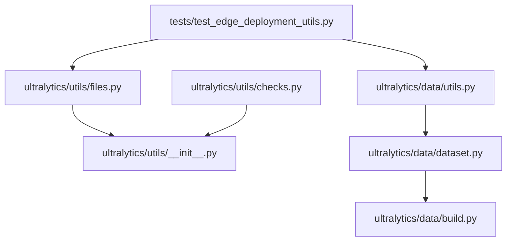
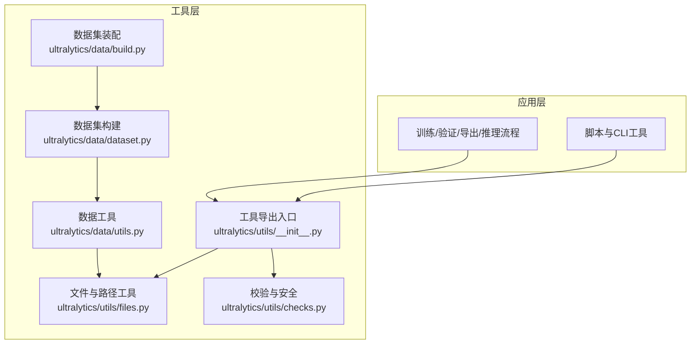
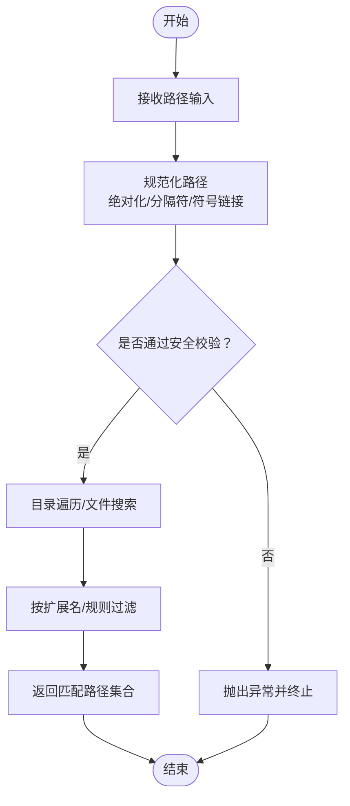
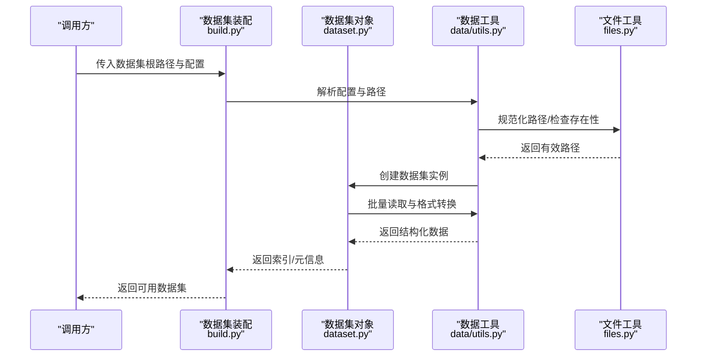
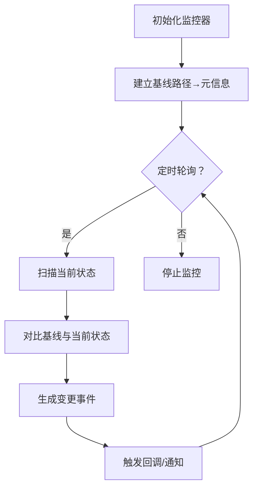
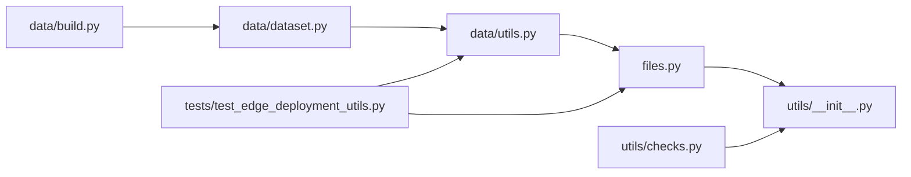

# 文件操作工具

<cite>
**本文引用的文件**
- [ultralytics/utils/files.py](file://ultralytics/utils/files.py)
- [ultralytics/data/utils.py](file://ultralytics/data/utils.py)
- [ultralytics/data/dataset.py](file://ultralytics/data/dataset.py)
- [ultralytics/data/build.py](file://ultralytics/data/build.py)
- [ultralytics/utils/checks.py](file://ultralytics/utils/checks.py)
- [ultralytics/utils/__init__.py](file://ultralytics/utils/__init__.py)
- [tests/test_edge_deployment_utils.py](file://tests/test_edge_deployment_utils.py)
</cite>

## 目录
1. [简介](#简介)
2. [项目结构](#项目结构)
3. [核心组件](#核心组件)
4. [架构总览](#架构总览)
5. [详细组件分析](#详细组件分析)
6. [依赖关系分析](#依赖关系分析)
7. [性能考虑](#性能考虑)
8. [故障排查指南](#故障排查指南)
9. [结论](#结论)
10. [附录](#附录)

## 简介
本文件为 YOLO-Master 中的“文件操作工具”提供系统化文档，聚焦以下能力：
- 路径管理与文件系统操作接口规范（路径解析、目录遍历、文件搜索）
- 文件格式转换与读写（YAML、JSON、CSV）
- 批量文件处理工具的使用方法与性能优化技巧
- 文件权限检查与安全验证函数说明
- 跨平台文件路径处理的兼容性指南
- 文件监控与变更检测的工具函数使用示例

上述能力主要分布在 ultralytics/utils/files.py、ultralytics/data/utils.py、ultralytics/data/dataset.py、ultralytics/data/build.py 等模块中，并在测试用例中覆盖关键行为。

## 项目结构
围绕“文件操作工具”的相关代码组织如下：
- 通用文件与路径工具：位于 ultralytics/utils/files.py
- 数据侧路径/格式工具：位于 ultralytics/data/utils.py、ultralytics/data/dataset.py、ultralytics/data/build.py
- 校验与安全检查：位于 ultralytics/utils/checks.py
- 工具导出入口：位于 ultralytics/utils/__init__.py
- 相关测试：位于 tests/test_edge_deployment_utils.py

图表来源
- [ultralytics/utils/files.py](file://ultralytics/utils/files.py)
- [ultralytics/utils/__init__.py](file://ultralytics/utils/__init__.py)
- [ultralytics/data/utils.py](file://ultralytics/data/utils.py)
- [ultralytics/data/dataset.py](file://ultralytics/data/dataset.py)
- [ultralytics/data/build.py](file://ultralytics/data/build.py)
- [ultralytics/utils/checks.py](file://ultralytics/utils/checks.py)
- [tests/test_edge_deployment_utils.py](file://tests/test_edge_deployment_utils.py)

章节来源
- [ultralytics/utils/files.py](file://ultralytics/utils/files.py)
- [ultralytics/data/utils.py](file://ultralytics/data/utils.py)
- [ultralytics/data/dataset.py](file://ultralytics/data/dataset.py)
- [ultralytics/data/build.py](file://ultralytics/data/build.py)
- [ultralytics/utils/checks.py](file://ultralytics/utils/checks.py)
- [ultralytics/utils/__init__.py](file://ultralytics/utils/__init__.py)
- [tests/test_edge_deployment_utils.py](file://tests/test_edge_deployment_utils.py)

## 核心组件
- 路径与文件系统工具（files.py）
  - 职责：统一路径解析、规范化、存在性判断、扩展名提取、相对/绝对路径转换、目录扫描与过滤、安全路径校验等。
  - 典型用法：在数据集构建、模型权重加载/保存、日志输出等场景中被广泛调用。
- 数据侧工具（data/utils.py, data/dataset.py, data/build.py）
  - 职责：数据集路径解析、标签与图像路径对齐、批量读取与缓存、格式推断与转换（如 YAML/JSON/CSV）。
  - 典型用法：训练/验证前对数据集目录进行一致性检查、自动发现子集、生成索引。
- 校验与安全（utils/checks.py）
  - 职责：环境/配置/路径合法性校验、权限与可写性检查、输入参数约束。
  - 典型用法：在启动训练/导出/推理前进行前置检查，避免运行时错误。
- 工具导出（utils/__init__.py）
  - 职责：对外暴露常用文件与路径工具函数，供上层模块便捷导入。
- 测试覆盖（tests/test_edge_deployment_utils.py）
  - 职责：验证边缘部署相关的文件与路径工具行为，确保跨平台兼容性与健壮性。

章节来源
- [ultralytics/utils/files.py](file://ultralytics/utils/files.py)
- [ultralytics/data/utils.py](file://ultralytics/data/utils.py)
- [ultralytics/data/dataset.py](file://ultralytics/data/dataset.py)
- [ultralytics/data/build.py](file://ultralytics/data/build.py)
- [ultralytics/utils/checks.py](file://ultralytics/utils/checks.py)
- [ultralytics/utils/__init__.py](file://ultralytics/utils/__init__.py)
- [tests/test_edge_deployment_utils.py](file://tests/test_edge_deployment_utils.py)

## 架构总览
下图展示了“文件操作工具”在整体系统中的位置与交互关系：上层模块通过 utils 的导出入口访问文件与路径工具；数据侧模块在构建数据集时依赖这些工具完成路径解析、格式转换与批量处理；校验模块在关键路径上提供前置检查。

图表来源
- [ultralytics/utils/files.py](file://ultralytics/utils/files.py)
- [ultralytics/data/utils.py](file://ultralytics/data/utils.py)
- [ultralytics/data/dataset.py](file://ultralytics/data/dataset.py)
- [ultralytics/data/build.py](file://ultralytics/data/build.py)
- [ultralytics/utils/checks.py](file://ultralytics/utils/checks.py)
- [ultralytics/utils/__init__.py](file://ultralytics/utils/__init__.py)

## 详细组件分析

### 路径管理与文件系统操作（files.py）
- 路径解析与规范化
  - 支持将用户输入的路径转换为系统一致表示（绝对路径、分隔符标准化、符号链接展开等）。
  - 提供路径片段拼接、父目录获取、文件名与扩展名分离等基础操作。
- 目录遍历与文件搜索
  - 提供递归/非递归遍历目录的能力，支持按扩展名或正则表达式过滤。
  - 返回结果通常以列表形式呈现，便于后续批量处理。
- 安全路径校验
  - 防止路径穿越（例如 .. 滥用）、非法字符注入、指向敏感目录等风险。
  - 结合 checks 模块进行权限与可写性检查。
- 跨平台兼容性
  - 基于标准库实现，自动适配 Windows/macOS/Linux 的路径分隔符与大小写敏感性差异。
  - 建议始终使用工具提供的路径函数，避免直接使用字符串拼接。

图表来源
- [ultralytics/utils/files.py](file://ultralytics/utils/files.py)
- [ultralytics/utils/checks.py](file://ultralytics/utils/checks.py)

章节来源
- [ultralytics/utils/files.py](file://ultralytics/utils/files.py)
- [ultralytics/utils/checks.py](file://ultralytics/utils/checks.py)

### 数据侧路径与格式转换（data/utils.py, data/dataset.py, data/build.py）
- 路径与格式推断
  - 根据文件扩展名自动推断数据类型（图像、标注、配置文件等），并进行必要转换。
  - 支持 YAML/JSON/CSV 等常见格式的读写与校验。
- 数据集构建流程
  - 从根目录出发，递归发现子集（train/val/test），对齐图像与标签路径，生成索引。
  - 在构建过程中执行一致性检查（缺失文件、重复项、格式不匹配等）。
- 批量处理
  - 采用惰性迭代与缓存策略，减少内存占用，提升大规模数据集的处理效率。
  - 支持分块读取与并行预处理（视具体实现而定）。

图表来源
- [ultralytics/data/build.py](file://ultralytics/data/build.py)
- [ultralytics/data/dataset.py](file://ultralytics/data/dataset.py)
- [ultralytics/data/utils.py](file://ultralytics/data/utils.py)
- [ultralytics/utils/files.py](file://ultralytics/utils/files.py)

章节来源
- [ultralytics/data/utils.py](file://ultralytics/data/utils.py)
- [ultralytics/data/dataset.py](file://ultralytics/data/dataset.py)
- [ultralytics/data/build.py](file://ultralytics/data/build.py)

### 文件格式转换与读写（YAML、JSON、CSV）
- YAML
  - 用于模型与数据集配置，支持嵌套结构与注释。
  - 读写时需保证键名与默认配置一致，避免运行时解析失败。
- JSON
  - 常用于标注与中间结果交换，需遵循严格语法。
  - 大文件写入建议使用流式或分块写入以降低内存峰值。
- CSV
  - 适合表格型数据，注意编码与分隔符设置。
  - 对于数值列，建议在读取后进行类型转换与缺失值处理。

章节来源
- [ultralytics/data/utils.py](file://ultralytics/data/utils.py)
- [ultralytics/data/dataset.py](file://ultralytics/data/dataset.py)

### 批量文件处理工具与性能优化
- 推荐实践
  - 优先使用惰性迭代器与生成器，避免一次性加载全部路径到内存。
  - 对重复计算的结果进行缓存（例如路径规范化、扩展名提取）。
  - 合理设置并发度，避免 IO 瓶颈与上下文切换开销过大。
- 优化技巧
  - 使用预分配缓冲区与批处理 IO，减少系统调用次数。
  - 对大型数据集采用分片处理与断点续传机制。
  - 利用磁盘顺序读写与 SSD 特性，降低随机 IO 带来的延迟。

章节来源
- [ultralytics/data/utils.py](file://ultralytics/data/utils.py)
- [ultralytics/data/dataset.py](file://ultralytics/data/dataset.py)

### 文件权限检查与安全验证
- 权限检查
  - 检查目标路径是否存在、是否为目录/文件、是否可读/可写。
  - 在写入前进行可写性校验，避免中途失败导致数据不一致。
- 安全验证
  - 防止路径穿越与注入攻击，限制允许的文件扩展名与目录白名单。
  - 对用户上传或外部输入的路径进行严格校验后再参与业务逻辑。

章节来源
- [ultralytics/utils/checks.py](file://ultralytics/utils/checks.py)
- [ultralytics/utils/files.py](file://ultralytics/utils/files.py)

### 跨平台文件路径处理兼容性指南
- 分隔符与大小写
  - Windows 使用反斜杠且大小写不敏感；macOS/Linux 使用正斜杠且大小写敏感。
  - 统一使用工具提供的路径函数，避免手动拼接字符串。
- 符号链接与相对路径
  - 在不同平台上符号链接解析行为可能不同，建议显式展开符号链接以获得稳定路径。
  - 相对路径应相对于工作目录或固定基准目录解析，避免歧义。
- 测试覆盖
  - 通过测试用例验证跨平台行为，确保在不同操作系统下表现一致。

章节来源
- [tests/test_edge_deployment_utils.py](file://tests/test_edge_deployment_utils.py)
- [ultralytics/utils/files.py](file://ultralytics/utils/files.py)

### 文件监控与变更检测工具函数使用示例
- 基本思路
  - 记录文件或目录的元信息（大小、修改时间、哈希等），定期比对以检测变更。
  - 针对大量文件可采用增量扫描与指纹缓存策略。
- 使用示例（概念流程）
  - 初始化监控器，指定监控路径与采样间隔。
  - 首次扫描建立基线（路径→元信息映射）。
  - 周期性对比当前状态与基线，输出新增/删除/修改的文件列表。
  - 触发回调或事件通知上层模块进行处理。

[此图为概念流程图，无需图表来源]

## 依赖关系分析
- 内部依赖
  - files.py 被 data 侧工具与测试用例引用，作为底层路径与 IO 能力的提供者。
  - data/utils.py 与 dataset.py/build.py 形成数据装配链路，依赖 files.py 完成路径与格式处理。
  - checks.py 为各模块提供前置校验，增强鲁棒性。
  - utils/__init__.py 作为统一导出入口，简化上层导入。
- 外部依赖
  - 主要依赖 Python 标准库（os、pathlib、json、yaml、csv 等），无重型第三方依赖。

图表来源
- [ultralytics/utils/files.py](file://ultralytics/utils/files.py)
- [ultralytics/utils/__init__.py](file://ultralytics/utils/__init__.py)
- [ultralytics/data/utils.py](file://ultralytics/data/utils.py)
- [ultralytics/data/dataset.py](file://ultralytics/data/dataset.py)
- [ultralytics/data/build.py](file://ultralytics/data/build.py)
- [ultralytics/utils/checks.py](file://ultralytics/utils/checks.py)
- [tests/test_edge_deployment_utils.py](file://tests/test_edge_deployment_utils.py)

章节来源
- [ultralytics/utils/files.py](file://ultralytics/utils/files.py)
- [ultralytics/utils/__init__.py](file://ultralytics/utils/__init__.py)
- [ultralytics/data/utils.py](file://ultralytics/data/utils.py)
- [ultralytics/data/dataset.py](file://ultralytics/data/dataset.py)
- [ultralytics/data/build.py](file://ultralytics/data/build.py)
- [ultralytics/utils/checks.py](file://ultralytics/utils/checks.py)
- [tests/test_edge_deployment_utils.py](file://tests/test_edge_deployment_utils.py)

## 性能考虑
- IO 密集型任务应避免阻塞主线程，必要时使用异步或进程池。
- 对频繁调用的路径函数进行轻量级缓存，减少重复计算。
- 大批量数据处理时，优先使用流式读取与分块写入，控制内存峰值。
- 在 SSD 环境下尽量顺序读写，减少随机 IO。
- 合理设置并发度，平衡 CPU 与 IO 资源利用率。

[本节为通用指导，无需章节来源]

## 故障排查指南
- 常见问题
  - 路径不存在或不可访问：检查路径是否正确、权限是否足够、符号链接是否有效。
  - 格式解析失败：确认 YAML/JSON/CSV 语法正确、编码一致、字段完整。
  - 跨平台差异：注意大小写敏感性与分隔符差异，统一使用工具函数。
- 定位方法
  - 启用详细日志，记录关键路径与异常堆栈。
  - 使用最小复现用例隔离问题，逐步缩小范围。
  - 借助测试用例验证预期行为，快速回归修复。

章节来源
- [ultralytics/utils/checks.py](file://ultralytics/utils/checks.py)
- [tests/test_edge_deployment_utils.py](file://tests/test_edge_deployment_utils.py)

## 结论
YOLO-Master 的文件操作工具以 files.py 为核心，配合 data 侧工具与 checks 模块，提供了稳健的路径管理、格式转换与批量处理能力。通过统一的导出入口与完善的测试覆盖，确保了跨平台兼容性与工程可用性。在实际使用中，遵循本文的最佳实践与性能建议，可显著提升系统的稳定性与吞吐能力。

[本节为总结，无需章节来源]

## 附录
- 参考路径
  - 路径与文件系统工具：[ultralytics/utils/files.py](file://ultralytics/utils/files.py)
  - 数据侧工具与构建：[ultralytics/data/utils.py](file://ultralytics/data/utils.py)、[ultralytics/data/dataset.py](file://ultralytics/data/dataset.py)、[ultralytics/data/build.py](file://ultralytics/data/build.py)
  - 校验与安全：[ultralytics/utils/checks.py](file://ultralytics/utils/checks.py)
  - 工具导出入口：[ultralytics/utils/__init__.py](file://ultralytics/utils/__init__.py)
  - 测试覆盖：[tests/test_edge_deployment_utils.py](file://tests/test_edge_deployment_utils.py)