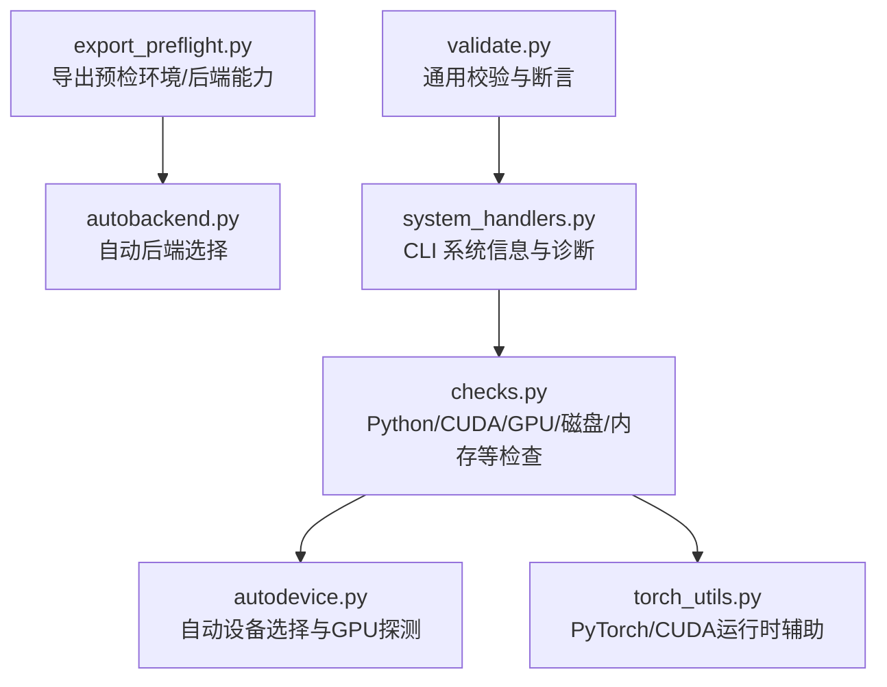
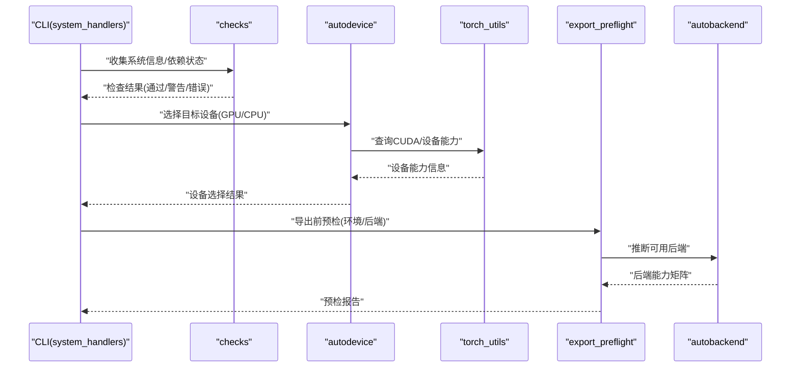
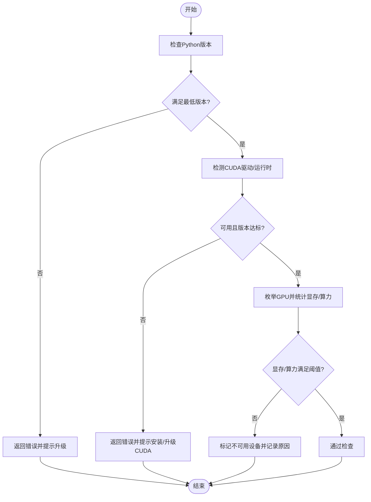
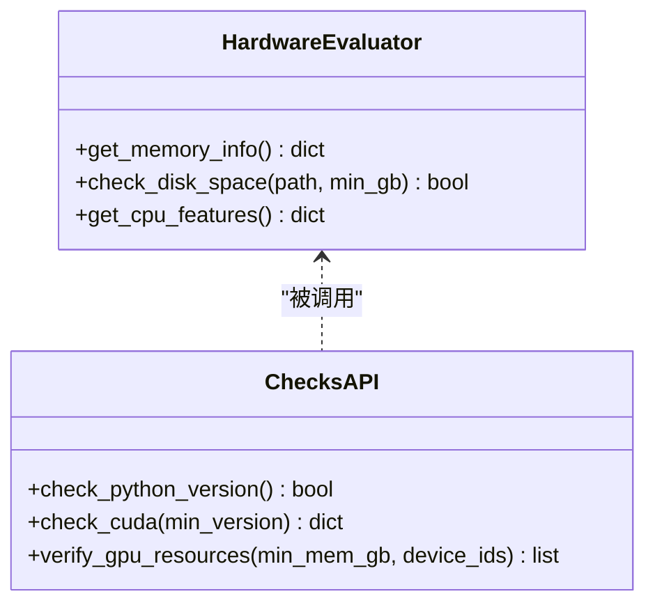
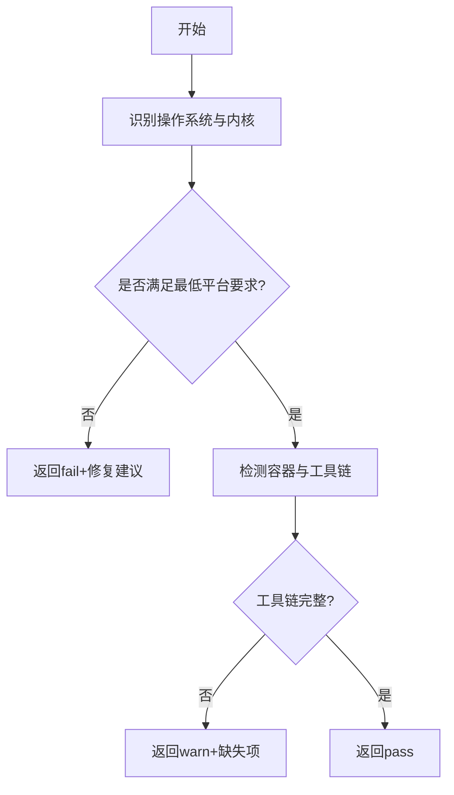
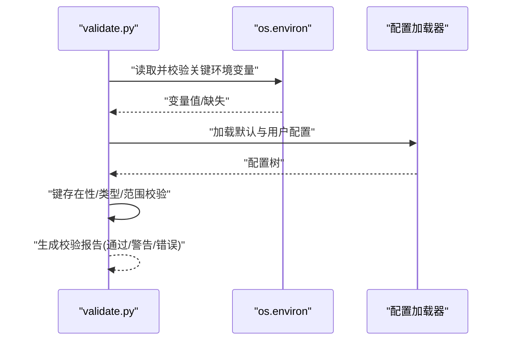
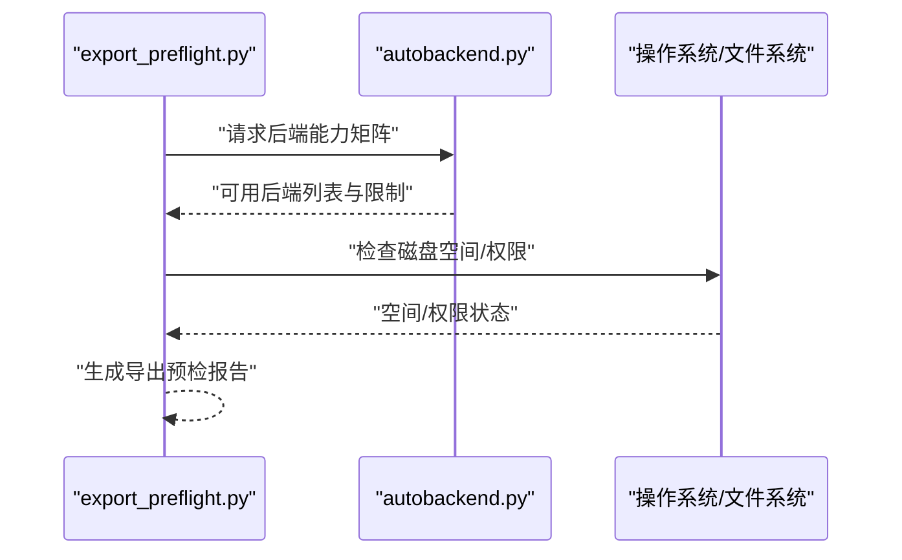
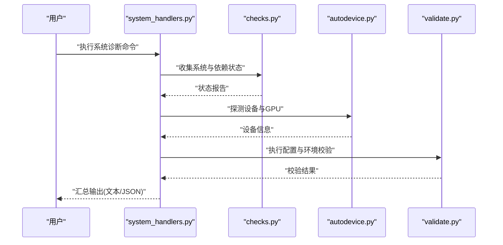
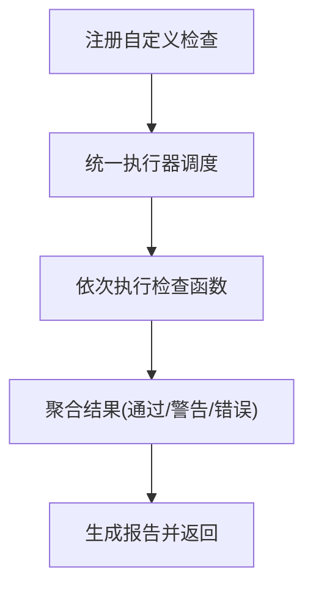
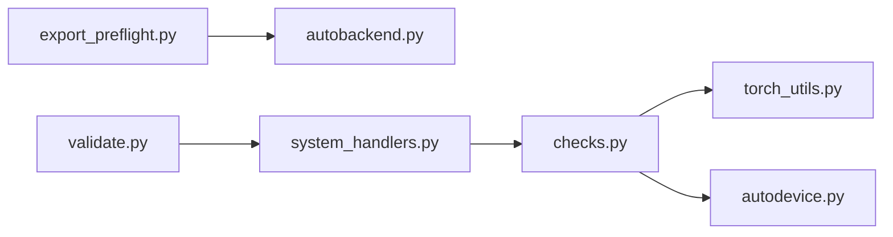

# 环境检查工具

<cite>
**本文引用的文件**
- [checks.py](file://ultralytics/utils/checks.py)
- [autodevice.py](file://ultralytics/utils/autodevice.py)
- [torch_utils.py](file://ultralytics/utils/torch_utils.py)
- [export_preflight.py](file://ultralytics/utils/export_preflight.py)
- [autobackend.py](file://ultralytics/nn/autobackend.py)
- [system_handlers.py](file://agent/runtime/cli/system_handlers.py)
- [validate.py](file://agent/runtime/cli/validate.py)
</cite>

## 目录
1. [简介](#简介)
2. [项目结构](#项目结构)
3. [核心组件](#核心组件)
4. [架构总览](#架构总览)
5. [详细组件分析](#详细组件分析)
6. [依赖关系分析](#依赖关系分析)
7. [性能考虑](#性能考虑)
8. [故障排除指南](#故障排除指南)
9. [结论](#结论)
10. [附录](#附录)

## 简介
本文件为 YOLO-Master 环境检查工具的权威文档，聚焦于系统依赖验证、硬件能力评估、平台兼容性检查、环境变量与配置文件完整性校验，以及自定义检查规则的开发与集成方法。内容覆盖 Python 版本检查、CUDA 可用性检测、GPU 资源验证、内存/磁盘/CPU 特性检测、导出预检流程与环境诊断工具函数使用示例，帮助开发者快速定位环境问题并保障训练、推理与导出流程的稳定性。

## 项目结构
环境检查相关代码主要分布在以下模块：
- 通用检查与系统信息：ultralytics/utils/checks.py
- 自动设备选择与 GPU 探测：ultralytics/utils/autodedevice.py
- PyTorch 与 CUDA 运行时辅助：ultralytics/utils/torch_utils.py
- 导出前预检（含环境/后端能力）：ultralytics/utils/export_preflight.py
- 自动后端选择（包含设备与后端能力判定）：ultralytics/nn/autobackend.py
- CLI 系统信息与诊断入口：agent/runtime/cli/system_handlers.py
- 通用校验与断言工具：agent/runtime/cli/validate.py

图表来源
- [checks.py](file://ultralytics/utils/checks.py)
- [autodevice.py](file://ultralytics/utils/autodevice.py)
- [torch_utils.py](file://ultralytics/utils/torch_utils.py)
- [export_preflight.py](file://ultralytics/utils/export_preflight.py)
- [autobackend.py](file://ultralytics/nn/autobackend.py)
- [system_handlers.py](file://agent/runtime/cli/system_handlers.py)
- [validate.py](file://agent/runtime/cli/validate.py)

章节来源
- [checks.py](file://ultralytics/utils/checks.py)
- [autodevice.py](file://ultralytics/utils/autodevice.py)
- [torch_utils.py](file://ultralytics/utils/torch_utils.py)
- [export_preflight.py](file://ultralytics/utils/export_preflight.py)
- [autobackend.py](file://ultralytics/nn/autobackend.py)
- [system_handlers.py](file://agent/runtime/cli/system_handlers.py)
- [validate.py](file://agent/runtime/cli/validate.py)

## 核心组件
- 系统依赖验证接口
  - Python 版本检查：确保运行环境与框架要求一致。
  - CUDA 可用性检测：判断是否安装 CUDA 驱动与运行时，并获取可用 GPU 数量。
  - GPU 资源验证：显存大小、计算能力、多卡枚举与亲和性设置。
- 硬件能力评估工具
  - 内存大小：系统总内存与可用内存。
  - 磁盘空间：工作目录与模型权重下载路径的剩余空间。
  - 处理器特性：CPU 指令集、线程数、NUMA 拓扑等。
- 平台兼容性检查
  - 操作系统与内核版本、容器化环境、编译器/构建工具链。
  - 返回结构化结果，便于上层决策与告警。
- 环境变量与配置文件完整性
  - 关键环境变量存在性与有效性（如代理、日志、缓存路径）。
  - 默认配置与用户配置的键存在性、类型与取值范围校验。
- 自定义检查规则
  - 提供注册机制与统一执行器，支持按优先级与严重级别分类。
  - 支持失败时阻断或仅告警的策略。

章节来源
- [checks.py](file://ultralytics/utils/checks.py)
- [autodevice.py](file://ultralytics/utils/autodevice.py)
- [torch_utils.py](file://ultralytics/utils/torch_utils.py)
- [export_preflight.py](file://ultralytics/utils/export_preflight.py)
- [autobackend.py](file://ultralytics/nn/autobackend.py)
- [system_handlers.py](file://agent/runtime/cli/system_handlers.py)
- [validate.py](file://agent/runtime/cli/validate.py)

## 架构总览
下图展示了环境检查在整体系统中的位置与交互关系：CLI 层调用系统信息与诊断入口，后者组合 checks 与 autodevice 完成基础环境探测；导出预检在模型导出前再次确认后端与设备能力；自动后端根据检测结果选择合适的执行后端。

图表来源
- [system_handlers.py](file://agent/runtime/cli/system_handlers.py)
- [checks.py](file://ultralytics/utils/checks.py)
- [autodevice.py](file://ultralytics/utils/autodevice.py)
- [torch_utils.py](file://ultralytics/utils/torch_utils.py)
- [export_preflight.py](file://ultralytics/utils/export_preflight.py)
- [autobackend.py](file://ultralytics/nn/autobackend.py)

## 详细组件分析

### 系统依赖验证接口（Python/CUDA/GPU）
- Python 版本检查
  - 输入：无（内部读取解释器版本）
  - 输出：布尔值或结构化状态（通过/不满足）
  - 行为：若低于最低要求则抛出明确异常或返回错误码，供上层中断流程。
- CUDA 可用性检测
  - 输入：可选的最小 CUDA 版本阈值
  - 输出：布尔值 + 可用 GPU 计数 + 驱动/运行时版本信息
  - 行为：当未检测到 CUDA 或版本过低时给出可操作的修复建议。
- GPU 资源验证
  - 输入：最小显存阈值、期望设备索引列表
  - 输出：设备清单、显存大小、计算能力、是否满足阈值
  - 行为：对不满足阈值的设备标记为不可用，并记录原因。

图表来源
- [checks.py](file://ultralytics/utils/checks.py)
- [autodevice.py](file://ultralytics/utils/autodevice.py)
- [torch_utils.py](file://ultralytics/utils/torch_utils.py)

章节来源
- [checks.py](file://ultralytics/utils/checks.py)
- [autodevice.py](file://ultralytics/utils/autodevice.py)
- [torch_utils.py](file://ultralytics/utils/torch_utils.py)

### 硬件能力评估工具（内存/磁盘/CPU）
- 内存大小
  - 功能：读取系统总内存与当前可用内存，用于估算批大小与并发度。
  - 返回值：字典或对象，包含 total、available、unit 等字段。
- 磁盘空间
  - 功能：检查指定路径的剩余空间，常用于权重下载与中间产物目录。
  - 返回值：布尔值 + 剩余空间数值 + 单位。
- 处理器特性
  - 功能：获取 CPU 型号、核心/线程数、SIMD 指令集、NUMA 节点等。
  - 返回值：结构化信息，便于上层进行策略选择（如线程池大小）。

图表来源
- [checks.py](file://ultralytics/utils/checks.py)
- [autodevice.py](file://ultralytics/utils/autodevice.py)

章节来源
- [checks.py](file://ultralytics/utils/checks.py)
- [autodevice.py](file://ultralytics/utils/autodevice.py)

### 平台兼容性检查函数（配置选项与返回值）
- 配置选项
  - 目标平台：Linux/Windows/macOS 及发行版/内核版本。
  - 容器环境：是否运行在 Docker/Kubernetes 中。
  - 构建工具链：编译器、链接器、CMake 等必要工具是否存在。
- 返回值含义
  - 状态：pass/warn/fail
  - 详情：具体不满足项与修复建议
  - 影响范围：仅影响导出/训练/推理中的某类任务

图表来源
- [checks.py](file://ultralytics/utils/checks.py)

章节来源
- [checks.py](file://ultralytics/utils/checks.py)

### 环境变量验证与配置文件完整性检查
- 环境变量验证
  - 常见变量：代理、日志目录、缓存目录、分布式通信端口范围等。
  - 行为：检查存在性、格式合法性与可达性（如网络代理连通性）。
- 配置文件完整性
  - 默认配置与用户配置合并后，校验关键字段存在性与取值范围。
  - 对缺失或非法字段给出修正建议，避免运行时崩溃。

图表来源
- [validate.py](file://agent/runtime/cli/validate.py)

章节来源
- [validate.py](file://agent/runtime/cli/validate.py)

### 导出预检与自动后端选择
- 导出预检
  - 目的：在导出前确认环境、后端与设备能力是否满足目标格式要求。
  - 内容：检查后端库可用性、算子支持、量化/编译工具链、磁盘空间等。
- 自动后端选择
  - 依据：设备能力、后端库、导出目标格式，选择最优后端（如 ONNX/TensorRT/OpenVINO 等）。
  - 输出：推荐后端与降级策略。

图表来源
- [export_preflight.py](file://ultralytics/utils/export_preflight.py)
- [autobackend.py](file://ultralytics/nn/autobackend.py)

章节来源
- [export_preflight.py](file://ultralytics/utils/export_preflight.py)
- [autobackend.py](file://ultralytics/nn/autobackend.py)

### CLI 系统信息与诊断入口
- system_handlers
  - 提供命令行入口，汇总系统信息、设备状态、环境健康度。
  - 支持以 JSON/表格形式输出，便于自动化处理。
- validate
  - 提供通用断言与校验逻辑，被 system_handlers 复用。

图表来源
- [system_handlers.py](file://agent/runtime/cli/system_handlers.py)
- [checks.py](file://ultralytics/utils/checks.py)
- [autodevice.py](file://ultralytics/utils/autodevice.py)
- [validate.py](file://agent/runtime/cli/validate.py)

章节来源
- [system_handlers.py](file://agent/runtime/cli/system_handlers.py)
- [validate.py](file://agent/runtime/cli/validate.py)

### 自定义检查规则开发与集成
- 开发步骤
  - 定义检查函数：输入参数、返回值（通过/警告/错误）、描述与建议。
  - 注册检查：将检查函数加入全局注册表，指定优先级与严重级别。
  - 编排执行：由统一执行器按顺序调用，聚合结果并生成报告。
- 集成方式
  - 在启动阶段或导出预检前注入自定义检查。
  - 支持条件启用（如仅在特定平台或后端启用）。
- 最佳实践
  - 保持幂等与轻量，避免阻塞主流程。
  - 提供清晰的错误信息与修复指引。
  - 对可能失败的检查采用“软失败”策略，允许继续但告警。

[本节为概念性说明，无需源码引用]

## 依赖关系分析
- 低耦合高内聚
  - checks 专注于系统与环境信息收集，不直接依赖具体后端实现。
  - autodevice 与 torch_utils 负责设备与运行时细节，向 checks 暴露稳定接口。
  - export_preflight 与 autobackend 协同完成导出前的能力评估与后端选择。
- 外部依赖
  - PyTorch/CUDA 运行时、系统 API（内存/磁盘/CPU 信息）、第三方后端库（ONNX/TensorRT/OpenVINO 等）。

图表来源
- [checks.py](file://ultralytics/utils/checks.py)
- [autodevice.py](file://ultralytics/utils/autodevice.py)
- [torch_utils.py](file://ultralytics/utils/torch_utils.py)
- [export_preflight.py](file://ultralytics/utils/export_preflight.py)
- [autobackend.py](file://ultralytics/nn/autobackend.py)
- [system_handlers.py](file://agent/runtime/cli/system_handlers.py)
- [validate.py](file://agent/runtime/cli/validate.py)

章节来源
- [checks.py](file://ultralytics/utils/checks.py)
- [autodevice.py](file://ultralytics/utils/autodevice.py)
- [torch_utils.py](file://ultralytics/utils/torch_utils.py)
- [export_preflight.py](file://ultralytics/utils/export_preflight.py)
- [autobackend.py](file://ultralytics/nn/autobackend.py)
- [system_handlers.py](file://agent/runtime/cli/system_handlers.py)
- [validate.py](file://agent/runtime/cli/validate.py)

## 性能考虑
- 检查函数的开销应尽量小，避免在高频路径中重复执行。
- 对 GPU 枚举与显存查询应缓存结果，减少多次调用带来的额外开销。
- 磁盘空间检查可限定扫描深度与路径范围，避免全量遍历。
- 对于大型数据集或模型，建议在导出预检阶段提前发现潜在瓶颈（如显存不足、磁盘空间不够）。

[本节为一般性指导，无需源码引用]

## 故障排除指南
- Python 版本不满足
  - 现象：导入失败或早期报错。
  - 处理：升级至支持的最低版本，或使用虚拟环境隔离。
- CUDA 不可用或版本过低
  - 现象：无法使用 GPU，或导出时报算子不支持。
  - 处理：安装匹配的 CUDA 驱动与运行时，重启进程使环境变量生效。
- GPU 显存不足
  - 现象：OOM 或导出失败。
  - 处理：降低批大小、关闭不必要的服务、释放其他进程占用显存。
- 磁盘空间不足
  - 现象：权重下载失败或导出中途报错。
  - 处理：清理缓存与临时文件，扩展磁盘容量。
- 环境变量配置错误
  - 现象：代理不可达、日志写入失败、分布式通信端口冲突。
  - 处理：修正环境变量，确保网络与端口可用。
- 配置文件缺失或非法
  - 现象：启动即崩溃或行为异常。
  - 处理：对照默认配置补齐缺失键，修正取值范围。

章节来源
- [checks.py](file://ultralytics/utils/checks.py)
- [autodevice.py](file://ultralytics/utils/autodevice.py)
- [export_preflight.py](file://ultralytics/utils/export_preflight.py)
- [validate.py](file://agent/runtime/cli/validate.py)

## 结论
YOLO-Master 的环境检查工具提供了从系统依赖到硬件能力、从平台兼容到导出预检的全链路保障。通过统一的检查接口与可扩展的自定义规则，能够在不同平台上稳定地识别问题并给出修复建议，显著提升训练、推理与导出的成功率与可维护性。

## 附录
- 常用命令与用法
  - 系统信息诊断：通过 CLI 入口输出系统、设备与环境健康度。
  - 导出预检：在执行导出前运行预检，获取后端与设备能力报告。
  - 自定义检查：注册新检查并在启动或预检阶段自动执行。

[本节为概览性说明，无需源码引用]