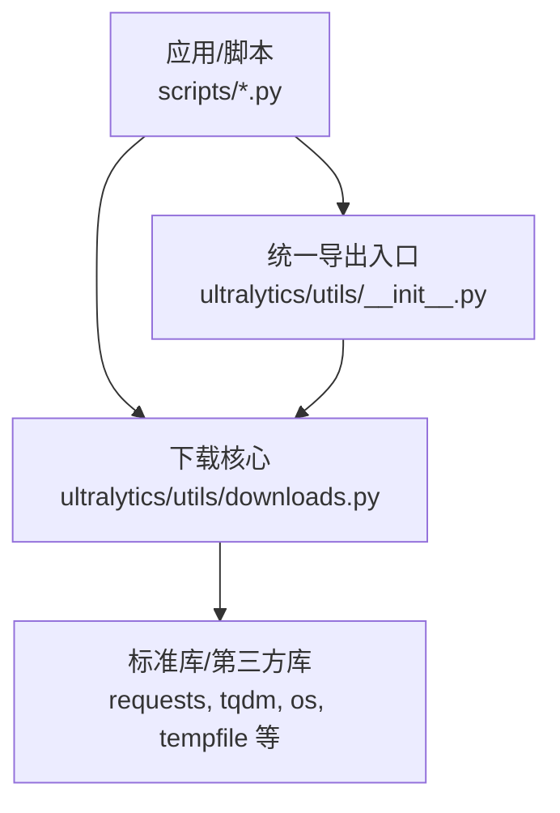
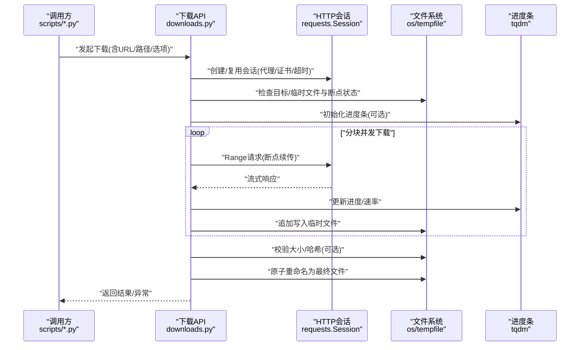
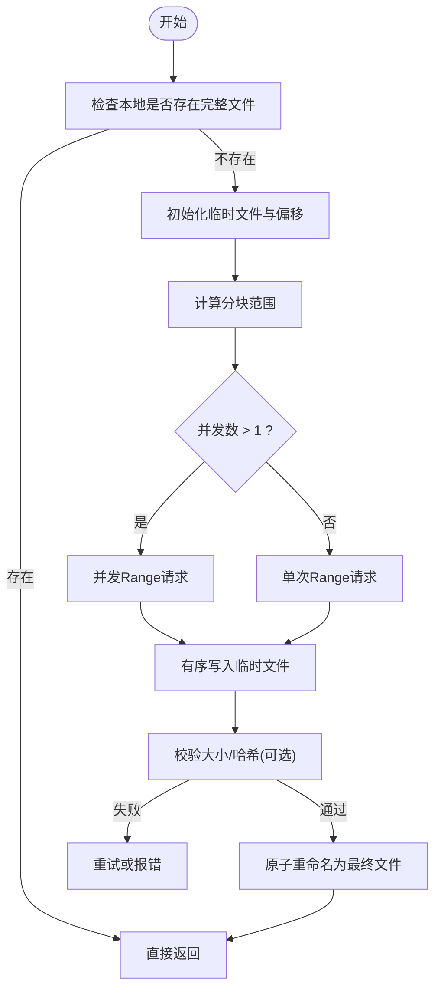
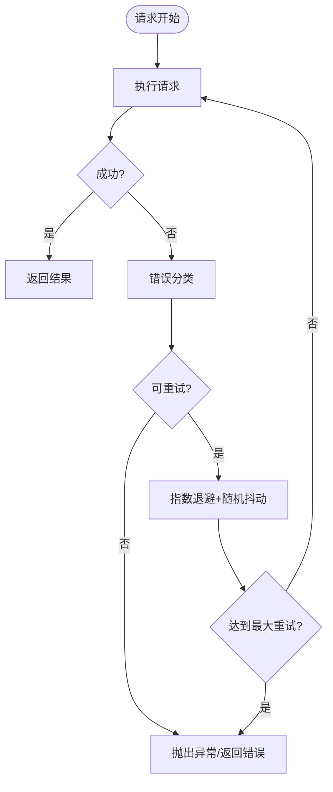
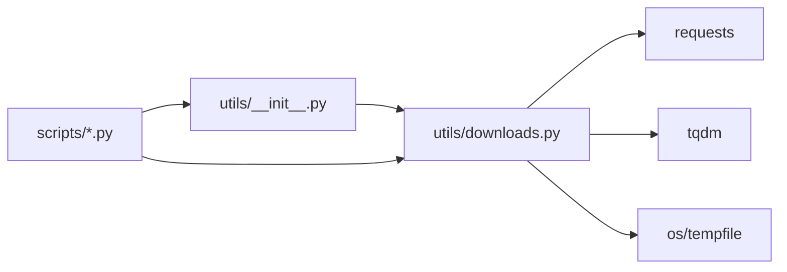

# 网络下载工具

<cite>
**本文引用的文件**
- [ultralytics/utils/downloads.py](file://ultralytics/utils/downloads.py)
- [ultralytics/utils/__init__.py](file://ultralytics/utils/__init__.py)
- [scripts/download_visdrone.py](file://scripts/download_visdrone.py)
- [scripts/download_hf_dataset.py](file://scripts/download_hf_dataset.py)
</cite>

## 目录
1. [简介](#简介)
2. [项目结构](#项目结构)
3. [核心组件](#核心组件)
4. [架构总览](#架构总览)
5. [详细组件分析](#详细组件分析)
6. [依赖分析](#依赖分析)
7. [性能考虑](#性能考虑)
8. [故障排查指南](#故障排查指南)
9. [结论](#结论)
10. [附录](#附录)

## 简介
本文件为 YOLO-Master 网络下载工具提供系统化文档，聚焦 HTTP 下载能力与工程化特性。内容涵盖：
- HTTP 下载接口使用方法（断点续传、并发下载、重试机制）
- 进度监控与速度控制配置项
- 代理服务器支持与 SSL 证书验证设置
- 下载缓存策略与存储管理
- 大文件下载的内存优化技巧与错误处理方案
- 异步下载与多线程下载最佳实践示例

该工具位于 ultralytics.utils.downloads 模块中，被脚本层与上层功能复用，用于从远端资源稳定高效地获取模型与数据集等文件。

## 项目结构
围绕下载能力的代码组织如下：
- 下载核心实现：ultralytics/utils/downloads.py
- 对外导出入口：ultralytics/utils/__init__.py
- 使用示例脚本：scripts/download_visdrone.py、scripts/download_hf_dataset.py

图表来源
- [ultralytics/utils/downloads.py](file://ultralytics/utils/downloads.py)
- [ultralytics/utils/__init__.py](file://ultralytics/utils/__init__.py)
- [scripts/download_visdrone.py](file://scripts/download_visdrone.py)
- [scripts/download_hf_dataset.py](file://scripts/download_hf_dataset.py)

章节来源
- [ultralytics/utils/downloads.py](file://ultralytics/utils/downloads.py)
- [ultralytics/utils/__init__.py](file://ultralytics/utils/__init__.py)
- [scripts/download_visdrone.py](file://scripts/download_visdrone.py)
- [scripts/download_hf_dataset.py](file://scripts/download_hf_dataset.py)

## 核心组件
- 下载函数族：提供统一的 URL 到本地文件的下载能力，支持断点续传、并发分块、重试、进度条、限速、代理与证书校验等。
- 进度与速率：基于 tqdm 的进度条封装，支持实时速率显示与可插拔回调。
- 缓存与存储：按目标路径与校验信息组织缓存，避免重复下载并保证一致性。
- 错误与恢复：对网络异常、IO 异常进行捕获与重试，支持指数退避与最大重试次数。
- 并发与线程安全：通过分块并发与锁机制保障多任务并发时的数据一致性与完整性。

章节来源
- [ultralytics/utils/downloads.py](file://ultralytics/utils/downloads.py)
- [ultralytics/utils/__init__.py](file://ultralytics/utils/__init__.py)

## 架构总览
下图展示了从调用方到下载核心的关键交互流程，包括参数解析、会话初始化、分块并发、进度上报、重试与落盘。

图表来源
- [ultralytics/utils/downloads.py](file://ultralytics/utils/downloads.py)
- [scripts/download_visdrone.py](file://scripts/download_visdrone.py)
- [scripts/download_hf_dataset.py](file://scripts/download_hf_dataset.py)

## 详细组件分析

### 下载接口与参数说明
- 基本用法
  - 输入：远程 URL、本地保存路径、可选的并发数、是否启用进度条、是否限速、代理与证书配置等。
  - 输出：成功时返回目标文件路径；失败时抛出异常或返回错误码（取决于具体实现）。
- 关键参数
  - 并发与分块：max_workers、chunk_size 等，控制并发度与单块大小。
  - 重试与退避：max_retries、backoff_factor、retry_on_codes 等。
  - 进度与速率：progress_bar、rate_limit、callback 等。
  - 代理与证书：proxy、verify、cert_path 等。
  - 缓存与校验：cache_dir、checksum、force_download 等。
- 典型调用路径
  - 参考脚本中的调用方式以了解参数组合与错误处理模式。

章节来源
- [ultralytics/utils/downloads.py](file://ultralytics/utils/downloads.py)
- [scripts/download_visdrone.py](file://scripts/download_visdrone.py)
- [scripts/download_hf_dataset.py](file://scripts/download_hf_dataset.py)

### 断点续传与并发下载
- 断点续传
  - 通过 Range 头与本地临时文件偏移量实现，自动检测已下载部分并继续。
  - 临时文件命名与原子替换确保中断后不产生损坏文件。
- 并发下载
  - 将文件划分为多个块，由工作线程池并行拉取，合并写入。
  - 并发度受 max_workers 限制，避免过多连接导致服务端限流。
- 并发安全性
  - 写入采用顺序追加与锁保护，保证块间顺序与一致性。

图表来源
- [ultralytics/utils/downloads.py](file://ultralytics/utils/downloads.py)

章节来源
- [ultralytics/utils/downloads.py](file://ultralytics/utils/downloads.py)

### 重试机制与错误处理
- 触发条件
  - 网络异常、超时、服务端 5xx、429 等。
- 策略
  - 指数退避 + 抖动，避免雪崩。
  - 最大重试次数上限，防止无限重试。
- 错误分类
  - 可重试错误：网络抖动、限流、临时性服务不可用。
  - 不可重试错误：认证失败、权限不足、目标不存在等。
- 日志与诊断
  - 记录每次重试的上下文（URL、状态码、延迟），便于定位问题。

图表来源
- [ultralytics/utils/downloads.py](file://ultralytics/utils/downloads.py)

章节来源
- [ultralytics/utils/downloads.py](file://ultralytics/utils/downloads.py)

### 进度监控与速度控制
- 进度条
  - 基于 tqdm 的流式更新，显示百分比、剩余时间、当前速率。
  - 支持自定义回调，用于外部系统采集指标。
- 速度控制
  - 通过 rate_limit 限制每秒字节数，避免占用带宽影响其他任务。
  - 内部采用令牌桶或滑动窗口算法平滑速率。
- 可视化集成
  - 可与训练/推理管线集成，在 UI 中展示下载进度。

章节来源
- [ultralytics/utils/downloads.py](file://ultralytics/utils/downloads.py)

### 代理服务器与 SSL 证书验证
- 代理
  - 支持 http/https 代理，可通过环境变量或显式参数传入。
  - 支持带认证的代理（用户名/密码）。
- SSL 证书
  - verify=True 时使用系统信任根；verify=False 仅用于调试环境。
  - 支持指定自定义 CA 包或客户端证书，满足企业内网场景。
- 注意事项
  - 生产环境务必开启证书校验，避免中间人攻击风险。

章节来源
- [ultralytics/utils/downloads.py](file://ultralytics/utils/downloads.py)

### 下载缓存策略与存储管理
- 缓存目录
  - 默认缓存目录可由环境变量或参数覆盖，便于集中管理与清理。
- 去重策略
  - 基于 URL 指纹或目标文件名生成缓存键，避免重复下载。
- 一致性校验
  - 可选 MD5/SHA256 校验，确保文件完整性。
- 清理策略
  - 支持过期时间与容量阈值，定期清理旧缓存。
- 跨进程共享
  - 通过只读挂载或软链接方式在多进程/容器间共享缓存。

章节来源
- [ultralytics/utils/downloads.py](file://ultralytics/utils/downloads.py)

### 大文件下载的内存优化
- 流式写入
  - 使用迭代器逐块读取响应体，避免一次性加载到内存。
- 合理分块
  - chunk_size 建议根据磁盘 I/O 与网络吞吐调优，常见为 1~8MB。
- 并发与内存平衡
  - 提高并发需同步增大内存预算，注意工作线程池大小。
- 临时文件与原子替换
  - 先写临时文件再原子重命名，降低中断导致的碎片与损坏。

章节来源
- [ultralytics/utils/downloads.py](file://ultralytics/utils/downloads.py)

### 异步下载与多线程下载最佳实践
- 多线程
  - 适合 I/O 密集型批量下载，结合线程池与队列调度。
  - 注意全局 GIL 对 CPU 密集任务的限制，下载场景通常无碍。
- 异步
  - 若上层框架支持 asyncio，可使用 aiohttp 等异步客户端提升吞吐。
  - 与现有同步 API 混用时，建议使用线程包装器隔离阻塞 IO。
- 背压与限流
  - 通过信号量或队列控制并发度，避免打满网络或磁盘。
- 示例参考
  - 参考 scripts 下脚本的调用方式，理解参数组合与错误处理模式。

章节来源
- [ultralytics/utils/downloads.py](file://ultralytics/utils/downloads.py)
- [scripts/download_visdrone.py](file://scripts/download_visdrone.py)
- [scripts/download_hf_dataset.py](file://scripts/download_hf_dataset.py)

## 依赖分析
- 内部依赖
  - downloads.py 作为核心实现，被 utils.__init__ 暴露给上层。
- 外部依赖
  - requests：HTTP 客户端，负责连接、会话、代理与证书。
  - tqdm：进度条与速率显示。
  - os/tempfile：文件操作与临时文件管理。
- 耦合关系
  - 下载核心与文件系统松耦合，便于替换存储后端。
  - 进度条可插拔，便于替换为自定义可视化。

图表来源
- [ultralytics/utils/__init__.py](file://ultralytics/utils/__init__.py)
- [ultralytics/utils/downloads.py](file://ultralytics/utils/downloads.py)
- [scripts/download_visdrone.py](file://scripts/download_visdrone.py)
- [scripts/download_hf_dataset.py](file://scripts/download_hf_dataset.py)

章节来源
- [ultralytics/utils/__init__.py](file://ultralytics/utils/__init__.py)
- [ultralytics/utils/downloads.py](file://ultralytics/utils/downloads.py)
- [scripts/download_visdrone.py](file://scripts/download_visdrone.py)
- [scripts/download_hf_dataset.py](file://scripts/download_hf_dataset.py)

## 性能考虑
- 并发度选择
  - 根据网络带宽与磁盘 I/O 调整 max_workers，避免过度并发导致拥塞。
- 分块大小
  - 较大分块减少握手开销，但会增大内存占用；较小分块更灵活但增加调度成本。
- 速率限制
  - 在共享环境中启用 rate_limit，避免影响其他服务。
- 缓存命中
  - 合理设置 cache_dir 与校验策略，最大化缓存命中率。
- 连接复用
  - 使用持久会话与 Keep-Alive，减少 TCP 握手开销。

[本节为通用指导，无需特定文件引用]

## 故障排查指南
- 常见问题
  - 证书错误：检查 verify 与 CA 包路径，确认代理未劫持 HTTPS。
  - 超时/限流：增大超时、启用重试与退避，降低并发度。
  - 磁盘空间不足：清理缓存目录或扩容磁盘。
  - 权限问题：确保目标目录可写。
- 诊断步骤
  - 开启详细日志，记录 URL、状态码、重试次数与耗时。
  - 使用 curl/wget 复现问题，对比行为差异。
  - 切换直连与代理，定位代理链路问题。
- 恢复策略
  - 启用断点续传，避免从头开始。
  - 使用幂等下载逻辑，支持多次运行安全恢复。

章节来源
- [ultralytics/utils/downloads.py](file://ultralytics/utils/downloads.py)

## 结论
YOLO-Master 的网络下载工具提供了企业级可用的下载能力：断点续传、并发分块、重试退避、进度与限速、代理与证书校验、缓存与一致性校验等。通过合理的参数配置与工程实践，可在复杂网络环境下稳定高效地完成大文件下载任务。建议在部署中启用缓存与校验，并根据实际环境调优并发与速率限制，以获得最佳稳定性与吞吐。

[本节为总结性内容，无需特定文件引用]

## 附录
- 快速上手
  - 参考 scripts 下的示例脚本，了解常用参数组合与错误处理模式。
- 扩展建议
  - 如需异步下载，可在上层封装 asyncio 适配器，复用现有核心逻辑。
  - 如需自定义存储后端，可抽象出写入接口，替换临时文件与原子重命名逻辑。

章节来源
- [scripts/download_visdrone.py](file://scripts/download_visdrone.py)
- [scripts/download_hf_dataset.py](file://scripts/download_hf_dataset.py)