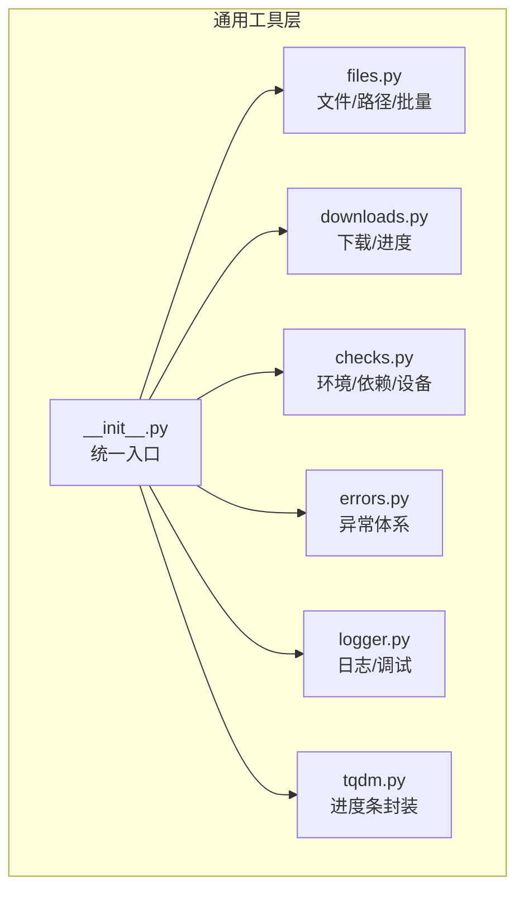
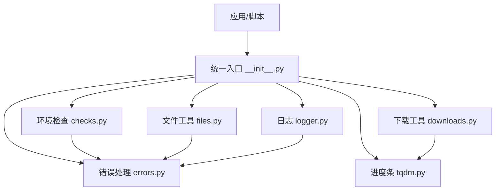
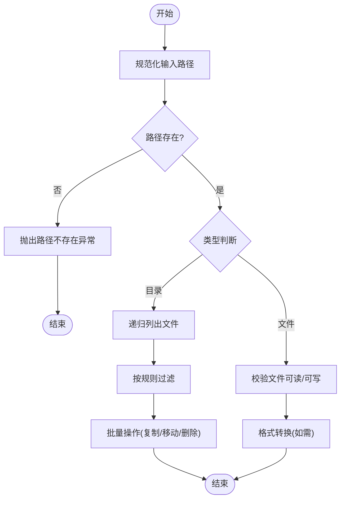
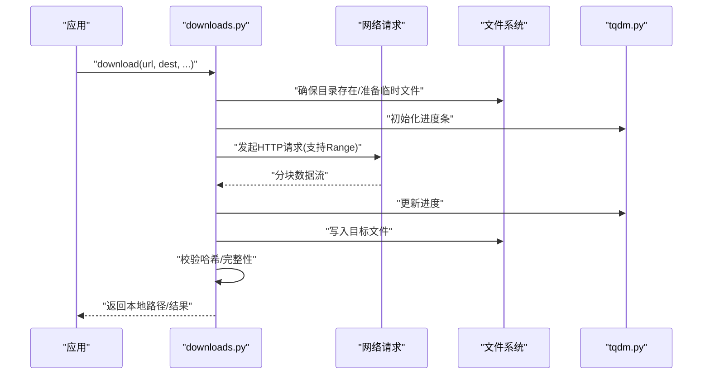
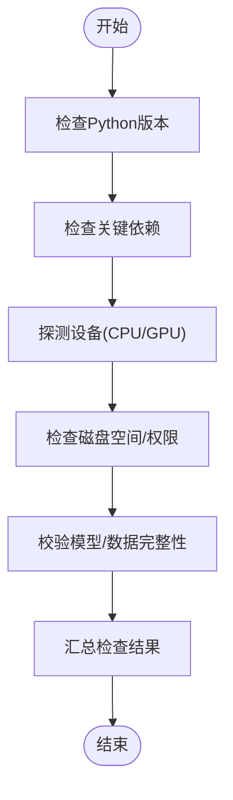
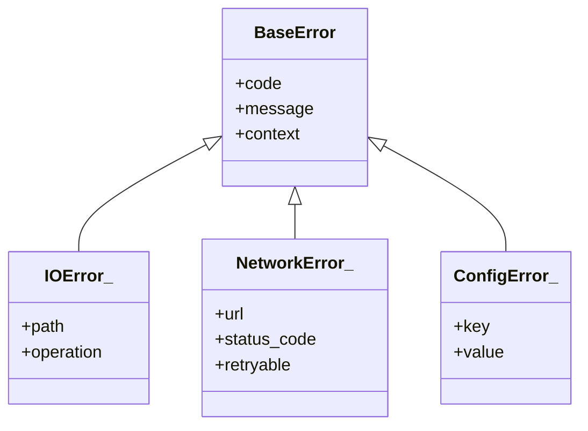
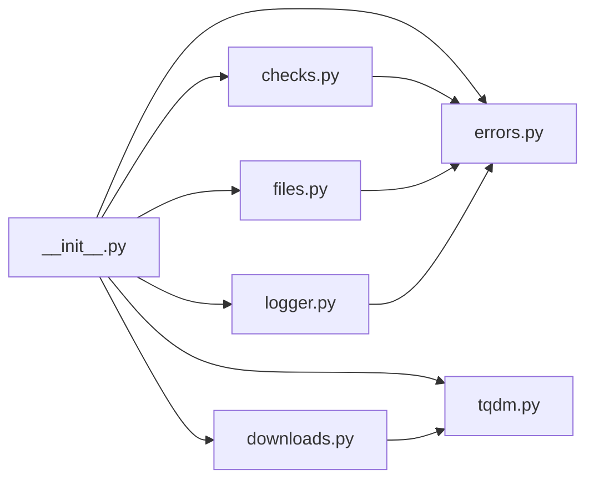

# 通用工具函数

<cite>
**本文引用的文件**
- [ultralytics/utils/files.py](file://ultralytics/utils/files.py)
- [ultralytics/utils/downloads.py](file://ultralytics/utils/downloads.py)
- [ultralytics/utils/checks.py](file://ultralytics/utils/checks.py)
- [ultralytics/utils/errors.py](file://ultralytics/utils/errors.py)
- [ultralytics/utils/logger.py](file://ultralytics/utils/logger.py)
- [ultralytics/utils/tqdm.py](file://ultralytics/utils/tqdm.py)
- [ultralytics/utils/__init__.py](file://ultralytics/utils/__init__.py)
</cite>

## 目录
1. [简介](#简介)
2. [项目结构](#项目结构)
3. [核心组件](#核心组件)
4. [架构总览](#架构总览)
5. [详细组件分析](#详细组件分析)
6. [依赖分析](#依赖分析)
7. [性能考虑](#性能考虑)
8. [故障排查指南](#故障排查指南)
9. [结论](#结论)
10. [附录](#附录)

## 简介
本文件为 YOLO-Master 通用工具函数的权威文档，聚焦以下能力：
- 文件操作工具：路径管理、格式转换与批量处理
- 网络下载工具：方法与进度监控
- 环境检查与依赖验证
- 错误处理与异常管理最佳实践
- 配置管理与环境变量处理
- 日志记录与调试辅助
- 安全相关工具与权限检查
- 跨平台兼容性使用指南

本说明面向不同技术背景的读者，提供从高层概览到代码级细节的渐进式内容，并辅以图示帮助理解。

## 项目结构
通用工具函数主要位于 ultralytics/utils 目录下，按职责拆分为多个模块：
- files.py：文件系统与路径工具、批量处理、格式转换
- downloads.py：网络下载、断点续传、进度条集成
- checks.py：环境检查、依赖校验、设备探测
- errors.py：统一异常体系与错误码
- logger.py：日志初始化、级别控制、输出目标
- tqdm.py：进度条封装与回调适配
- __init__.py：对外暴露的统一入口与便捷方法

图表来源
- [ultralytics/utils/files.py](file://ultralytics/utils/files.py)
- [ultralytics/utils/downloads.py](file://ultralytics/utils/downloads.py)
- [ultralytics/utils/checks.py](file://ultralytics/utils/checks.py)
- [ultralytics/utils/errors.py](file://ultralytics/utils/errors.py)
- [ultralytics/utils/logger.py](file://ultralytics/utils/logger.py)
- [ultralytics/utils/tqdm.py](file://ultralytics/utils/tqdm.py)
- [ultralytics/utils/__init__.py](file://ultralytics/utils/__init__.py)

章节来源
- [ultralytics/utils/files.py](file://ultralytics/utils/files.py)
- [ultralytics/utils/downloads.py](file://ultralytics/utils/downloads.py)
- [ultralytics/utils/checks.py](file://ultralytics/utils/checks.py)
- [ultralytics/utils/errors.py](file://ultralytics/utils/errors.py)
- [ultralytics/utils/logger.py](file://ultralytics/utils/logger.py)
- [ultralytics/utils/tqdm.py](file://ultralytics/utils/tqdm.py)
- [ultralytics/utils/__init__.py](file://ultralytics/utils/__init__.py)

## 核心组件
- 文件与路径（files.py）
  - 路径解析与规范化、相对/绝对路径转换、路径存在性与类型判断
  - 批量扫描、过滤、复制、移动、删除等常用批处理
  - 常见数据集格式与 YOLO 格式的互转接口
- 下载（downloads.py）
  - 支持 HTTP/HTTPS 下载、断点续传、重试策略
  - 进度条集成与回调钩子，便于 UI 或 CLI 展示
- 环境检查（checks.py）
  - Python 版本、关键库可用性、GPU/CPU 设备探测
  - 磁盘空间、目录权限、模型权重完整性校验
- 错误处理（errors.py）
  - 统一异常基类、业务异常分类、错误码与消息规范
- 日志（logger.py）
  - 全局日志器初始化、级别设置、控制台/文件输出
  - 结构化字段注入与上下文追踪
- 进度条（tqdm.py）
  - 对 tqdm 的轻量封装，屏蔽平台差异，提供统一 API
- 统一入口（__init__.py）
  - 聚合导出常用函数，简化上层调用

章节来源
- [ultralytics/utils/files.py](file://ultralytics/utils/files.py)
- [ultralytics/utils/downloads.py](file://ultralytics/utils/downloads.py)
- [ultralytics/utils/checks.py](file://ultralytics/utils/checks.py)
- [ultralytics/utils/errors.py](file://ultralytics/utils/errors.py)
- [ultralytics/utils/logger.py](file://ultralytics/utils/logger.py)
- [ultralytics/utils/tqdm.py](file://ultralytics/utils/tqdm.py)
- [ultralytics/utils/__init__.py](file://ultralytics/utils/__init__.py)

## 架构总览
下图展示了通用工具层的内部关系与外部交互方式：

图表来源
- [ultralytics/utils/__init__.py](file://ultralytics/utils/__init__.py)
- [ultralytics/utils/files.py](file://ultralytics/utils/files.py)
- [ultralytics/utils/downloads.py](file://ultralytics/utils/downloads.py)
- [ultralytics/utils/checks.py](file://ultralytics/utils/checks.py)
- [ultralytics/utils/errors.py](file://ultralytics/utils/errors.py)
- [ultralytics/utils/logger.py](file://ultralytics/utils/logger.py)
- [ultralytics/utils/tqdm.py](file://ultralytics/utils/tqdm.py)

## 详细组件分析

### 文件与路径工具（files.py）
- 路径管理
  - 路径规范化、拼接、去重分隔符、大小写敏感处理
  - 相对路径与绝对路径互转、工作目录感知
  - 路径存在性、是否为目录/文件、是否可读写判断
- 批量处理
  - 递归遍历、按后缀/正则过滤、并行化选项
  - 批量复制/移动/删除、冲突策略（覆盖/跳过/重命名）
- 格式转换
  - 标注格式与 YOLO 格式互转（如 COCO/YAML/JSON 到 YOLO TXT）
  - 图像/视频路径列表生成、数据清单构建
- 错误与边界
  - 非法路径、权限不足、IO 错误的统一包装
  - 大目录遍历时的内存与性能保护（分批/限制深度）

图表来源
- [ultralytics/utils/files.py](file://ultralytics/utils/files.py)

章节来源
- [ultralytics/utils/files.py](file://ultralytics/utils/files.py)

### 网络下载工具（downloads.py）
- 下载方法
  - 支持 URL 直链与 Hub 资源地址
  - 自动创建目标目录、文件名推断、哈希校验
  - 并发下载、限速、代理与超时配置
- 进度监控
  - 基于 tqdm 的进度条显示
  - 回调接口用于自定义 UI 更新或持久化状态
- 可靠性
  - 断点续传、失败重试、指数退避
  - 网络异常与证书问题的降级策略

图表来源
- [ultralytics/utils/downloads.py](file://ultralytics/utils/downloads.py)
- [ultralytics/utils/tqdm.py](file://ultralytics/utils/tqdm.py)

章节来源
- [ultralytics/utils/downloads.py](file://ultralytics/utils/downloads.py)
- [ultralytics/utils/tqdm.py](file://ultralytics/utils/tqdm.py)

### 环境检查与依赖验证（checks.py）
- 运行时环境
  - Python 版本、关键包导入检测、CUDA/ROCm/MPS 可用性与版本
  - GPU 数量、显存大小、CPU 特性探测
- 系统资源
  - 磁盘剩余空间、目录读写权限、临时目录有效性
- 模型与数据
  - 权重文件完整性校验、数据集路径与标签一致性检查
- 兼容性与回退
  - 功能开关、可选依赖缺失时的优雅降级提示

图表来源
- [ultralytics/utils/checks.py](file://ultralytics/utils/checks.py)

章节来源
- [ultralytics/utils/checks.py](file://ultralytics/utils/checks.py)

### 错误处理与异常管理（errors.py）
- 设计原则
  - 统一异常基类，分层细化（IO、网络、配置、校验等）
  - 错误码与人类可读消息分离，便于国际化与自动化处理
- 最佳实践
  - 在边界处捕获底层异常，转换为领域异常
  - 携带上下文信息（路径、URL、参数快照），避免丢失诊断线索
  - 对幂等操作进行重试前校验，避免重复副作用

图表来源
- [ultralytics/utils/errors.py](file://ultralytics/utils/errors.py)

章节来源
- [ultralytics/utils/errors.py](file://ultralytics/utils/errors.py)

### 配置管理与环境变量（结合 logger.py 与 checks.py）
- 配置加载
  - YAML/JSON 配置文件合并、默认值覆盖、键存在性校验
- 环境变量
  - 读取与校验必要变量（如代理、缓存目录、日志级别）
  - 敏感信息脱敏与最小权限原则
- 与日志联动
  - 根据配置动态调整日志级别与输出目标
  - 将关键配置项写入运行元数据，便于复现

章节来源
- [ultralytics/utils/logger.py](file://ultralytics/utils/logger.py)
- [ultralytics/utils/checks.py](file://ultralytics/utils/checks.py)

### 日志记录与调试辅助（logger.py）
- 初始化与级别
  - 全局日志器、控制台/文件双输出、滚动/大小限制
- 结构化字段
  - 任务ID、步骤、耗时、指标等上下文字段注入
- 调试辅助
  - 快速打印、堆栈跟踪、性能打点、可视化事件上报

章节来源
- [ultralytics/utils/logger.py](file://ultralytics/utils/logger.py)

### 进度条封装（tqdm.py）
- 统一 API
  - 跨平台一致的进度条行为，禁用模式与环境变量控制
- 回调与集成
  - 与下载、训练、评估流程无缝对接
  - 支持嵌套与多进程场景下的正确显示

章节来源
- [ultralytics/utils/tqdm.py](file://ultralytics/utils/tqdm.py)

### 安全相关与权限检查
- 路径与文件
  - 禁止符号链接逃逸、白名单后缀、不可信输入清洗
- 网络
  - 证书校验、超时与最大重定向限制、代理安全
- 权限
  - 读写权限预检、最小权限原则、临时目录隔离

章节来源
- [ultralytics/utils/files.py](file://ultralytics/utils/files.py)
- [ultralytics/utils/downloads.py](file://ultralytics/utils/downloads.py)
- [ultralytics/utils/checks.py](file://ultralytics/utils/checks.py)

### 跨平台兼容性指南
- 路径分隔符与大小写敏感性处理
- 终端颜色与进度条在不同平台的自适应
- CUDA/MPS/CPU 设备探测与回退逻辑
- 编码与换行符标准化（Windows/Linux/macOS）

章节来源
- [ultralytics/utils/files.py](file://ultralytics/utils/files.py)
- [ultralytics/utils/tqdm.py](file://ultralytics/utils/tqdm.py)
- [ultralytics/utils/checks.py](file://ultralytics/utils/checks.py)

## 依赖分析
通用工具层之间的耦合关系如下：

图表来源
- [ultralytics/utils/__init__.py](file://ultralytics/utils/__init__.py)
- [ultralytics/utils/files.py](file://ultralytics/utils/files.py)
- [ultralytics/utils/downloads.py](file://ultralytics/utils/downloads.py)
- [ultralytics/utils/checks.py](file://ultralytics/utils/checks.py)
- [ultralytics/utils/errors.py](file://ultralytics/utils/errors.py)
- [ultralytics/utils/logger.py](file://ultralytics/utils/logger.py)
- [ultralytics/utils/tqdm.py](file://ultralytics/utils/tqdm.py)

章节来源
- [ultralytics/utils/__init__.py](file://ultralytics/utils/__init__.py)

## 性能考虑
- 文件批量操作
  - 优先使用迭代器与生成器减少内存占用
  - 合理设置并发度，避免 IO 争用
- 下载优化
  - 启用 Range 请求实现断点续传
  - 连接复用与合理的超时/重试策略
- 日志与进度
  - 在高吞吐场景下降低日志频率或使用异步写入
  - 进度条更新节流，避免频繁刷新影响性能

## 故障排查指南
- 常见问题定位
  - 路径不存在/权限不足：检查路径规范化与用户权限
  - 下载失败：确认网络连通、代理设置、证书与超时
  - 环境不满足：查看设备探测与依赖检测结果
- 日志与调试
  - 提升日志级别，关注错误码与上下文字段
  - 使用进度回调保存中间状态，便于断点恢复
- 建议的排查步骤
  - 先运行环境检查，再执行下载与文件操作
  - 在小样本上复现问题，逐步扩大范围
  - 收集完整日志与配置快照，提交问题报告

章节来源
- [ultralytics/utils/logger.py](file://ultralytics/utils/logger.py)
- [ultralytics/utils/checks.py](file://ultralytics/utils/checks.py)
- [ultralytics/utils/errors.py](file://ultralytics/utils/errors.py)

## 结论
YOLO-Master 通用工具函数围绕“稳健、可观测、可移植”的目标，提供了完善的文件与路径管理、可靠的网络下载与进度监控、全面的环境检查与依赖验证、统一的错误处理体系、灵活的日志与调试能力，以及良好的跨平台兼容性。遵循本文档的最佳实践，可在复杂工程环境中稳定高效地复用这些工具。

## 附录
- 统一入口参考
  - 通过统一入口导入各模块常用函数，简化上层调用与维护

章节来源
- [ultralytics/utils/__init__.py](file://ultralytics/utils/__init__.py)