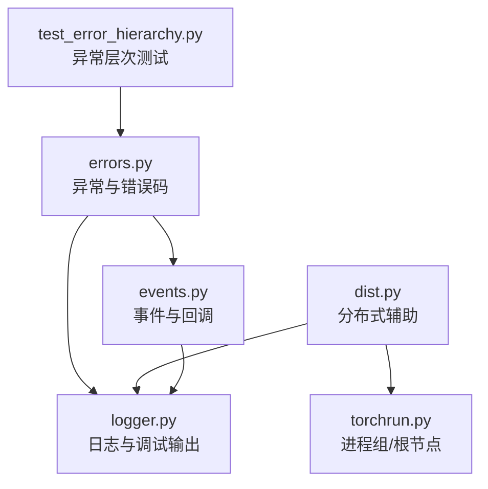
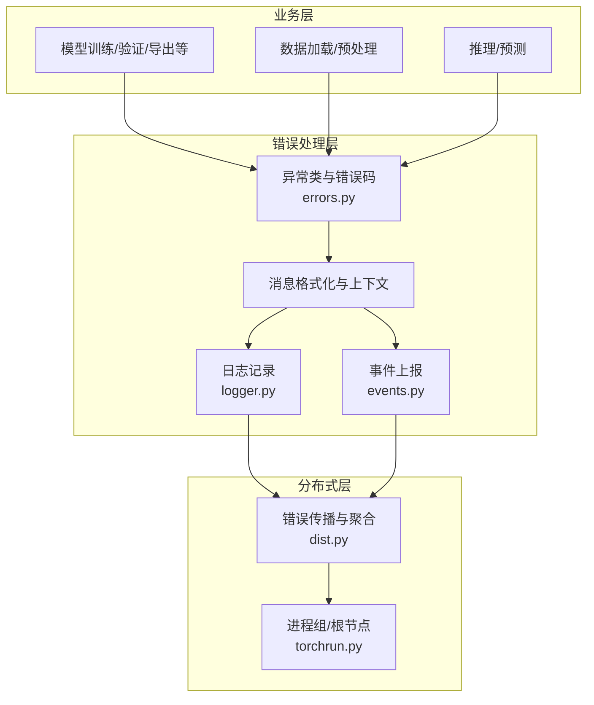
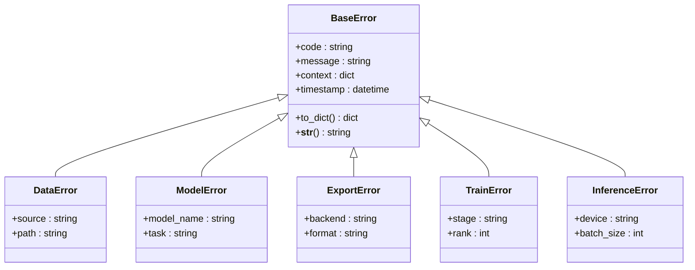
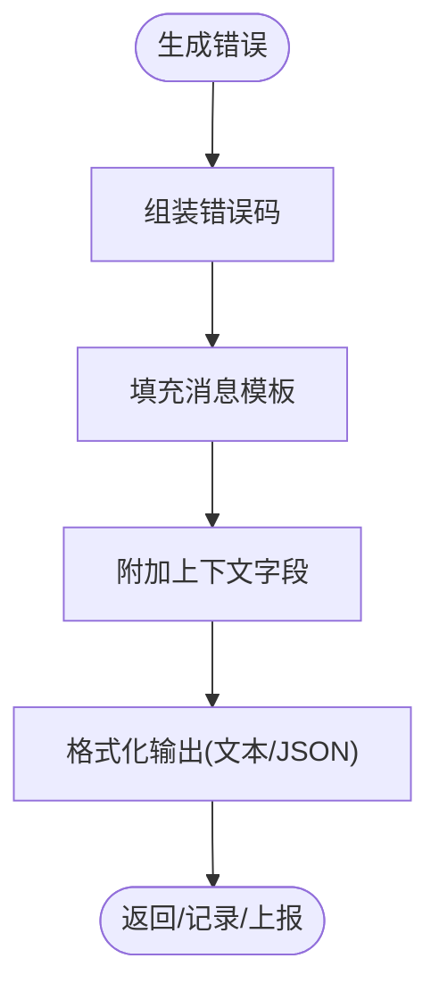
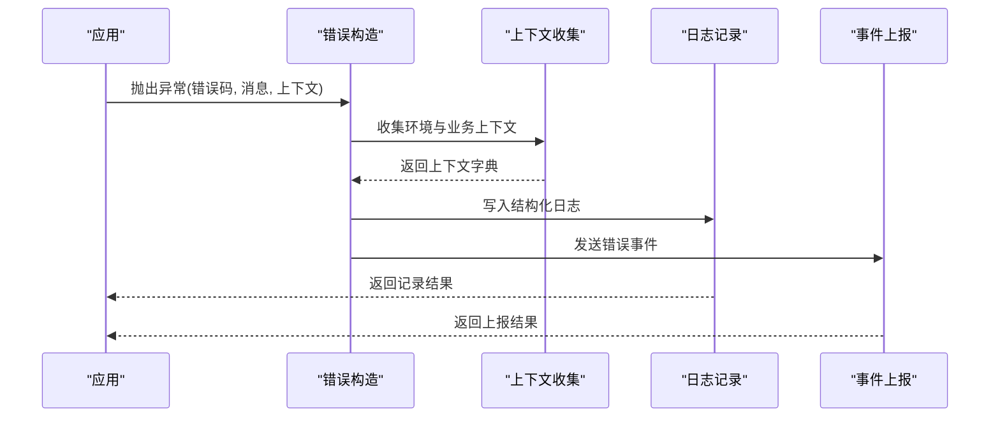
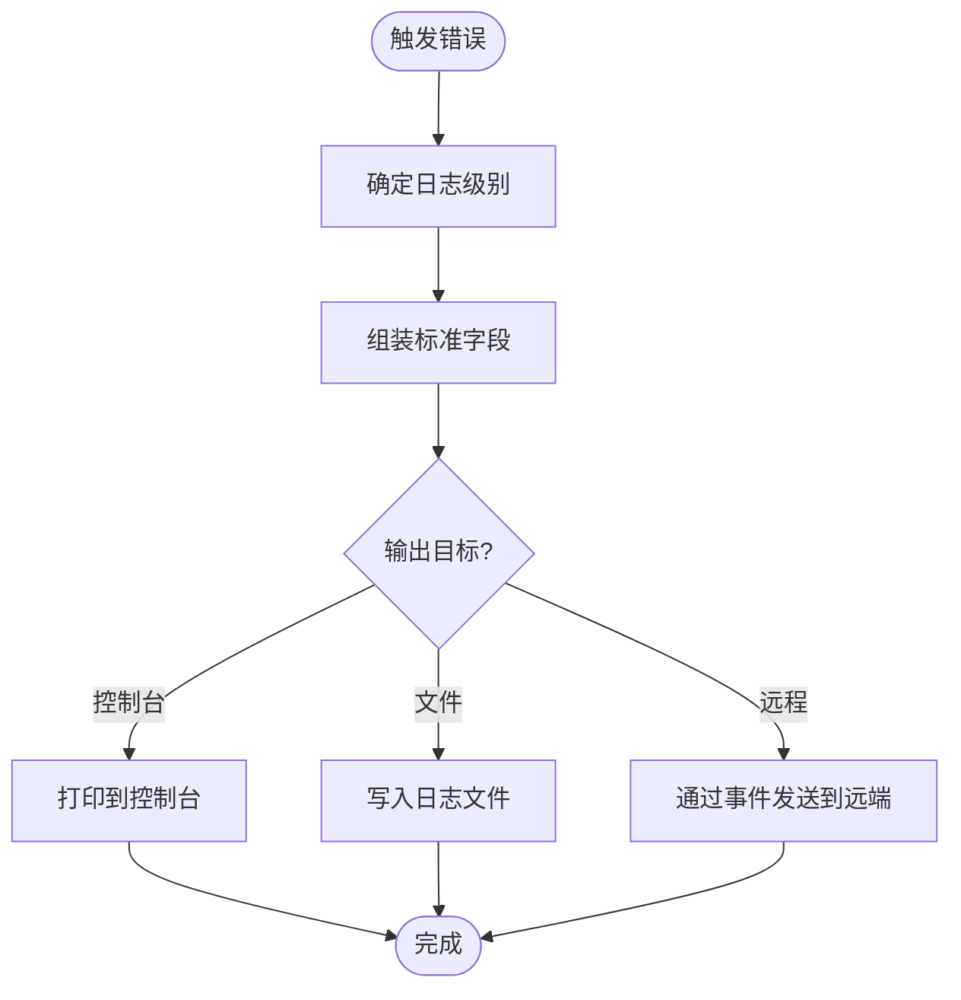
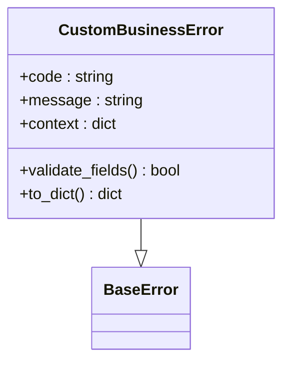
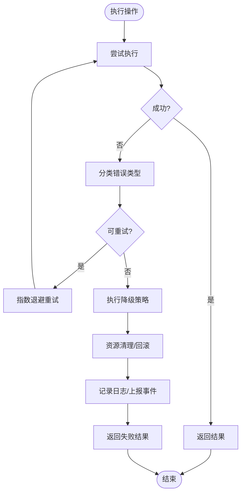
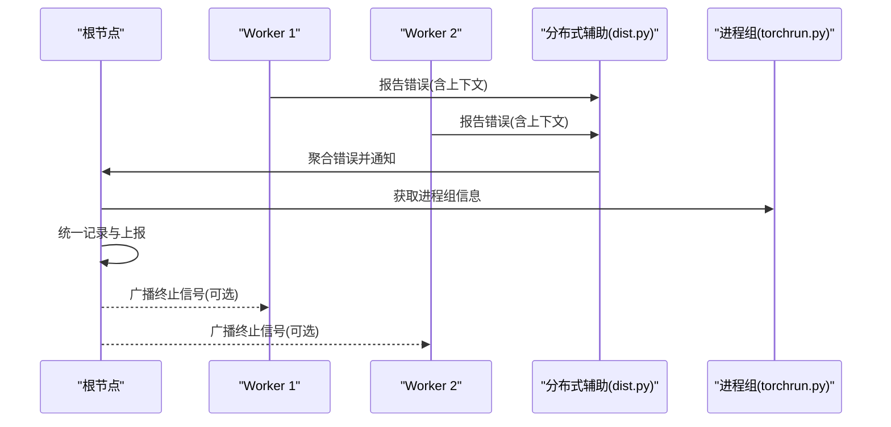
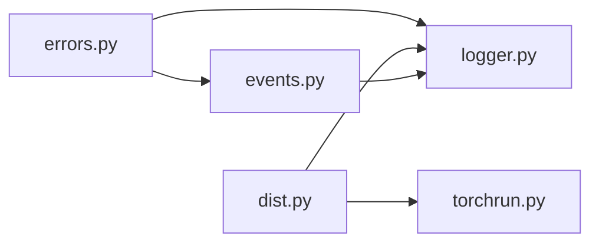

# 错误处理工具

<cite>
**本文引用的文件**
- [errors.py](file://ultralytics/utils/errors.py)
- [test_error_hierarchy.py](file://tests/test_error_hierarchy.py)
- [logger.py](file://ultralytics/utils/logger.py)
- [events.py](file://ultralytics/utils/events.py)
- [dist.py](file://ultralytics/utils/dist.py)
- [torchrun.py](file://ultralytics/utils/torchrun.py)
</cite>

## 目录
1. [简介](#简介)
2. [项目结构](#项目结构)
3. [核心组件](#核心组件)
4. [架构总览](#架构总览)
5. [详细组件分析](#详细组件分析)
6. [依赖关系分析](#依赖关系分析)
7. [性能考虑](#性能考虑)
8. [故障排查指南](#故障排查指南)
9. [结论](#结论)
10. [附录](#附录)

## 简介
本文件为 YOLO-Master 的错误处理工具提供系统化文档，聚焦以下目标：
- 异常类的层次结构与继承关系（基础异常与业务异常）
- 错误码定义与错误消息格式规范
- 上下文信息收集与堆栈跟踪配置
- 错误日志记录与调试输出格式
- 自定义异常类的开发指南与最佳实践
- 错误恢复与容错处理的实现示例
- 分布式环境下的错误传播与处理策略

## 项目结构
错误处理相关代码主要位于 utils 模块中，关键文件如下：
- ultralytics/utils/errors.py：异常类、错误码与消息格式化
- ultralytics/utils/logger.py：结构化日志与调试输出
- ultralytics/utils/events.py：事件总线/回调机制（用于错误上报与追踪）
- ultralytics/utils/dist.py：分布式通信与错误传播辅助
- ultralytics/utils/torchrun.py：进程组初始化与根节点判定（影响错误聚合）
- tests/test_error_hierarchy.py：异常层次与行为测试用例

图表来源
- [errors.py](file://ultralytics/utils/errors.py)
- [logger.py](file://ultralytics/utils/logger.py)
- [events.py](file://ultralytics/utils/events.py)
- [dist.py](file://ultralytics/utils/dist.py)
- [torchrun.py](file://ultralytics/utils/torchrun.py)
- [test_error_hierarchy.py](file://tests/test_error_hierarchy.py)

章节来源
- [errors.py](file://ultralytics/utils/errors.py)
- [logger.py](file://ultralytics/utils/logger.py)
- [events.py](file://ultralytics/utils/events.py)
- [dist.py](file://ultralytics/utils/dist.py)
- [torchrun.py](file://ultralytics/utils/torchrun.py)
- [test_error_hierarchy.py](file://tests/test_error_hierarchy.py)

## 核心组件
- 异常基类与业务异常族：统一继承自基础异常，便于捕获与分类；业务异常按领域细分，携带结构化上下文。
- 错误码体系：集中定义错误码常量，保证跨模块一致性与可观测性。
- 消息格式化：统一的错误消息模板与字段填充，确保可读性与机器可解析性。
- 日志与调试：通过 logger 输出结构化日志，支持不同级别与字段扩展。
- 事件上报：通过 events 将错误事件广播到监听器（如监控、告警）。
- 分布式支持：在 dist 与 torchrun 基础上，实现根节点聚合与跨进程错误传播。

章节来源
- [errors.py](file://ultralytics/utils/errors.py)
- [logger.py](file://ultralytics/utils/logger.py)
- [events.py](file://ultralytics/utils/events.py)
- [dist.py](file://ultralytics/utils/dist.py)
- [torchrun.py](file://ultralytics/utils/torchrun.py)

## 架构总览
下图展示了错误处理在系统中的位置与交互：业务层抛出异常，错误处理层进行格式化、日志记录与事件上报，并在分布式环境下由根节点汇总与转发。

图表来源
- [errors.py](file://ultralytics/utils/errors.py)
- [logger.py](file://ultralytics/utils/logger.py)
- [events.py](file://ultralytics/utils/events.py)
- [dist.py](file://ultralytics/utils/dist.py)
- [torchrun.py](file://ultralytics/utils/torchrun.py)

## 详细组件分析

### 异常类层次与继承关系
- 基础异常类：作为所有异常的根，提供统一的属性（如错误码、消息、上下文字典、时间戳等），并支持字符串化输出。
- 业务异常子类：按功能域划分（例如数据、模型、导出、训练、推理等），每个子类可附加特定字段与校验逻辑。
- 异常链与包装：允许在捕获后包装为更高层异常，保留原始堆栈与上下文，便于根因定位。

图表来源
- [errors.py](file://ultralytics/utils/errors.py)

章节来源
- [errors.py](file://ultralytics/utils/errors.py)
- [test_error_hierarchy.py](file://tests/test_error_hierarchy.py)

### 错误码定义与消息格式规范
- 错误码命名：采用“模块_子域_具体错误”的分段式命名，保证唯一性与可读性。
- 错误码范围：建议按模块划分区间，避免冲突。
- 消息模板：包含固定字段（错误码、时间、进程ID、设备信息等）与可变字段（用户输入、路径、参数等）。
- 结构化输出：推荐 JSON 或键值对形式，便于下游系统解析与检索。

图表来源
- [errors.py](file://ultralytics/utils/errors.py)
- [logger.py](file://ultralytics/utils/logger.py)

章节来源
- [errors.py](file://ultralytics/utils/errors.py)
- [logger.py](file://ultralytics/utils/logger.py)

### 上下文信息收集与堆栈跟踪配置
- 上下文收集：自动采集运行环境信息（进程ID、线程ID、GPU/CPU、版本、工作目录等），并可追加业务上下文（输入路径、任务名、批次大小等）。
- 堆栈跟踪：默认启用完整堆栈；可按需裁剪以控制日志体积。
- 配置项：可通过全局配置开关控制是否收集敏感信息、是否压缩堆栈、是否附带环境变量白名单等。

图表来源
- [errors.py](file://ultralytics/utils/errors.py)
- [logger.py](file://ultralytics/utils/logger.py)
- [events.py](file://ultralytics/utils/events.py)

章节来源
- [errors.py](file://ultralytics/utils/errors.py)
- [logger.py](file://ultralytics/utils/logger.py)
- [events.py](file://ultralytics/utils/events.py)

### 错误日志记录与调试输出格式
- 日志级别：ERROR、WARN、INFO、DEBUG 分级输出，便于过滤与降噪。
- 字段规范：至少包含 timestamp、level、error_code、message、process_id、thread_id、device、stack_trace。
- 输出目标：控制台、文件、远程收集器（通过事件订阅接入）。
- 调试模式：开启后可输出额外诊断信息（如张量形状、内存占用、设备状态摘要）。

图表来源
- [logger.py](file://ultralytics/utils/logger.py)
- [events.py](file://ultralytics/utils/events.py)

章节来源
- [logger.py](file://ultralytics/utils/logger.py)
- [events.py](file://ultralytics/utils/events.py)

### 自定义异常类的开发指南与最佳实践
- 继承基础异常：新建业务异常时继承基础异常类，确保兼容现有捕获与处理逻辑。
- 明确错误码：为新异常分配唯一错误码，避免与已有码冲突。
- 结构化上下文：仅添加必要且非敏感的上下文字段，保持日志体积可控。
- 异常包装：在高层捕获底层异常时，使用包装方式保留原始堆栈与上下文。
- 测试覆盖：为自定义异常编写单元测试，验证消息格式、上下文完整性与序列化行为。

图表来源
- [errors.py](file://ultralytics/utils/errors.py)
- [test_error_hierarchy.py](file://tests/test_error_hierarchy.py)

章节来源
- [errors.py](file://ultralytics/utils/errors.py)
- [test_error_hierarchy.py](file://tests/test_error_hierarchy.py)

### 错误恢复与容错处理示例
- 重试策略：针对瞬时错误（如网络抖动、I/O 锁竞争）实施指数退避重试。
- 降级策略：当关键服务不可用时，切换到备用路径或返回保守结果。
- 资源清理：在异常分支中确保临时文件、句柄、锁等资源被正确释放。
- 事务回滚：在训练或导出流程中，失败时回滚中间状态，保证一致性。

[本节为通用指导，不直接分析具体文件]

### 分布式环境下的错误传播与处理策略
- 根节点聚合：由主进程（根节点）收集各 worker 的错误信息，合并后统一上报与记录。
- 错误广播：在需要时向所有进程广播致命错误，以便快速终止与清理。
- 进程隔离：确保单个 worker 的异常不会导致整个集群崩溃，必要时隔离重启。
- 诊断增强：在分布式场景下附加 rank、world_size、node_id 等信息，便于定位问题。

图表来源
- [dist.py](file://ultralytics/utils/dist.py)
- [torchrun.py](file://ultralytics/utils/torchrun.py)

章节来源
- [dist.py](file://ultralytics/utils/dist.py)
- [torchrun.py](file://ultralytics/utils/torchrun.py)

## 依赖关系分析
- errors.py 为其他模块提供异常与错误码基础能力，被 logger.py、events.py 广泛使用。
- logger.py 与 events.py 共同构成错误输出的两条通道：本地持久化与远端上报。
- dist.py 与 torchrun.py 提供分布式上下文与进程组管理，支撑错误聚合与广播。

图表来源
- [errors.py](file://ultralytics/utils/errors.py)
- [logger.py](file://ultralytics/utils/logger.py)
- [events.py](file://ultralytics/utils/events.py)
- [dist.py](file://ultralytics/utils/dist.py)
- [torchrun.py](file://ultralytics/utils/torchrun.py)

章节来源
- [errors.py](file://ultralytics/utils/errors.py)
- [logger.py](file://ultralytics/utils/logger.py)
- [events.py](file://ultralytics/utils/events.py)
- [dist.py](file://ultralytics/utils/dist.py)
- [torchrun.py](file://ultralytics/utils/torchrun.py)

## 性能考虑
- 日志开销：在高吞吐场景下，避免在热路径频繁创建大型上下文对象；按需采样或降采样日志。
- 堆栈裁剪：生产环境建议裁剪深层堆栈，减少 I/O 与序列化成本。
- 事件去重：对重复错误进行去重与限流，防止告警风暴。
- 异步上报：将远端上报改为异步队列，降低主流程延迟。

[本节为通用指导，不直接分析具体文件]

## 故障排查指南
- 快速定位：根据错误码与消息模板中的关键字段（如 source、path、model_name、task）缩小范围。
- 上下文核对：检查附加的上下文字段是否完整，确认输入路径、设备、版本等是否符合预期。
- 日志分析：结合时间戳与进程/线程 ID，关联上下游日志，还原调用链。
- 分布式问题：关注 rank、world_size、node_id 等字段，判断是否为单点或全局限制。
- 复现步骤：利用最小化上下文与固定随机种子，尽量稳定复现问题。

章节来源
- [errors.py](file://ultralytics/utils/errors.py)
- [logger.py](file://ultralytics/utils/logger.py)
- [events.py](file://ultralytics/utils/events.py)
- [dist.py](file://ultralytics/utils/dist.py)
- [torchrun.py](file://ultralytics/utils/torchrun.py)

## 结论
YOLO-Master 的错误处理工具通过统一的异常层次、错误码与消息格式，配合结构化日志与事件上报，实现了从单机到分布式的端到端错误可观测性。遵循本文的开发指南与最佳实践，可在保障性能的同时提升排障效率与系统韧性。

[本节为总结性内容，不直接分析具体文件]

## 附录
- 术语表
  - 错误码：用于标识错误类型的唯一编码
  - 上下文：与错误相关的运行时与业务信息集合
  - 根节点：分布式环境中负责聚合与协调的主进程
- 参考文件
  - 异常与错误码定义：[errors.py](file://ultralytics/utils/errors.py)
  - 日志与调试输出：[logger.py](file://ultralytics/utils/logger.py)
  - 事件上报机制：[events.py](file://ultralytics/utils/events.py)
  - 分布式辅助：[dist.py](file://ultralytics/utils/dist.py)、[torchrun.py](file://ultralytics/utils/torchrun.py)
  - 异常层次测试：[test_error_hierarchy.py](file://tests/test_error_hierarchy.py)