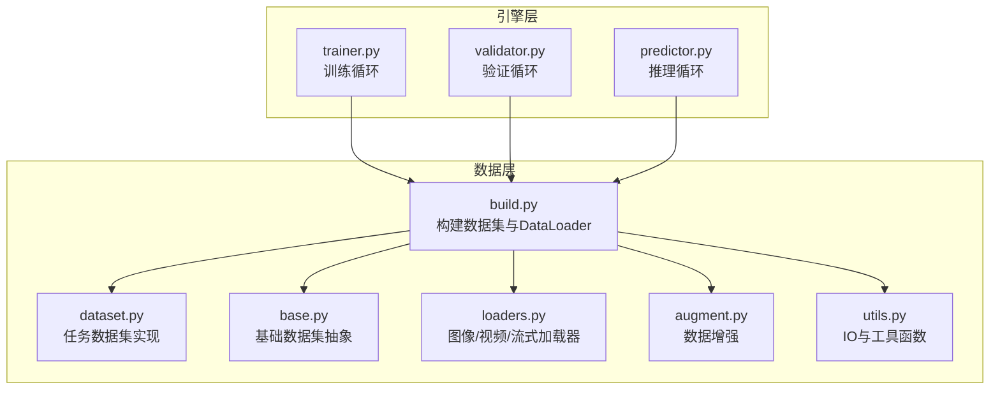
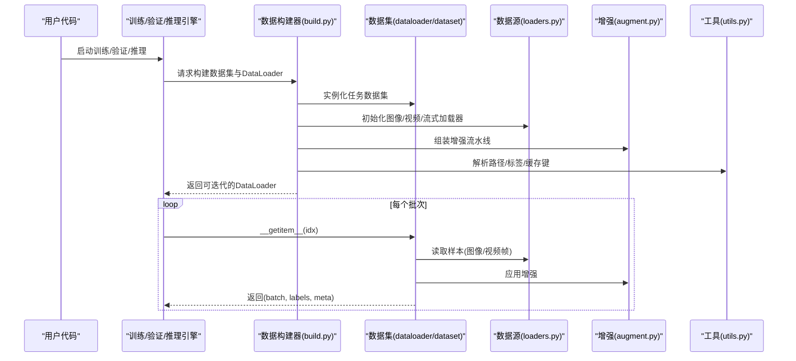
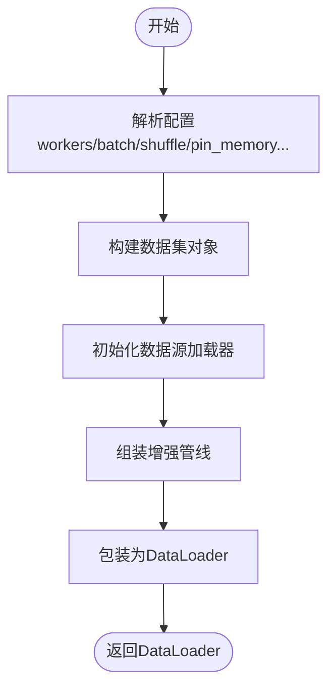
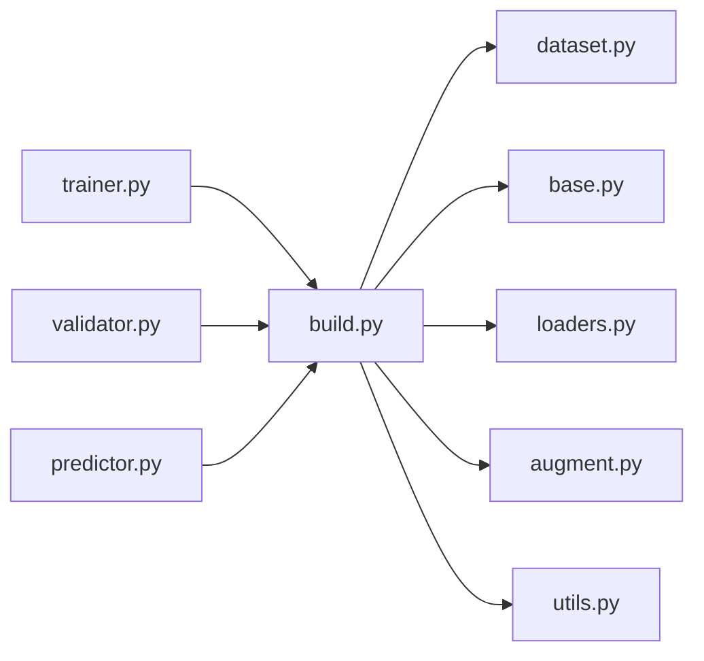

# 数据加载器API

<cite>
**本文引用的文件**
- [ultralytics/data/__init__.py](file://ultralytics/data/__init__.py)
- [ultralytics/data/build.py](file://ultralytics/data/build.py)
- [ultralytics/data/base.py](file://ultralytics/data/base.py)
- [ultralytics/data/dataset.py](file://ultralytics/data/dataset.py)
- [ultralytics/data/loaders.py](file://ultralytics/data/loaders.py)
- [ultralytics/data/augment.py](file://ultralytics/data/augment.py)
- [ultralytics/data/utils.py](file://ultralytics/data/utils.py)
- [ultralytics/engine/trainer.py](file://ultralytics/engine/trainer.py)
- [ultralytics/engine/validator.py](file://ultralytics/engine/validator.py)
- [ultralytics/engine/predictor.py](file://ultralytics/engine/predictor.py)
- [ultralytics/utils/benchmarks.py](file://ultralytics/utils/benchmarks.py)
- [ultralytics/utils/torch_utils.py](file://ultralytics/utils/torch_utils.py)
</cite>

## 目录
1. [简介](#简介)
2. [项目结构](#项目结构)
3. [核心组件](#核心组件)
4. [架构总览](#架构总览)
5. [详细组件分析](#详细组件分析)
6. [依赖关系分析](#依赖关系分析)
7. [性能考虑](#性能考虑)
8. [故障排查指南](#故障排查指南)
9. [结论](#结论)
10. [附录](#附录)

## 简介
本文件为 YOLO-Master 的数据加载器 API 提供系统化文档，覆盖以下主题：
- DataLoader 的实现类与配置选项
- 图像、视频、流式数据的加载方法与优化策略
- 多进程数据加载的配置与性能调优
- 自定义数据源的集成接口与适配器模式
- 数据预取、缓存与内存管理最佳实践
- GPU 数据加载与 CUDA 优化使用指南
- 错误处理与重试机制
- 数据加载性能的监控与分析工具

## 项目结构
数据加载相关代码集中在 ultralytics/data 包中，并通过 engine 层在训练、验证与推理流程中被消费。关键入口与职责如下：
- data/build.py：负责构建数据集与 DataLoader（包括多进程、批处理、打乱等）
- data/base.py：定义基础数据集抽象与通用能力
- data/dataset.py：具体数据集实现（如检测、分割、姿态等任务的数据集）
- data/loaders.py：图像、视频、流式数据源加载器
- data/augment.py：数据增强管线
- data/utils.py：IO、路径解析、标签格式转换等工具
- engine/trainer.py、engine/validator.py、engine/predictor.py：训练/验证/推理对数据加载器的调用点

图表来源
- [ultralytics/data/build.py](file://ultralytics/data/build.py)
- [ultralytics/data/dataset.py](file://ultralytics/data/dataset.py)
- [ultralytics/data/base.py](file://ultralytics/data/base.py)
- [ultralytics/data/loaders.py](file://ultralytics/data/loaders.py)
- [ultralytics/data/augment.py](file://ultralytics/data/augment.py)
- [ultralytics/data/utils.py](file://ultralytics/data/utils.py)
- [ultralytics/engine/trainer.py](file://ultralytics/engine/trainer.py)
- [ultralytics/engine/validator.py](file://ultralytics/engine/validator.py)
- [ultralytics/engine/predictor.py](file://ultralytics/engine/predictor.py)

章节来源
- [ultralytics/data/build.py](file://ultralytics/data/build.py)
- [ultralytics/data/dataset.py](file://ultralytics/data/dataset.py)
- [ultralytics/data/base.py](file://ultralytics/data/base.py)
- [ultralytics/data/loaders.py](file://ultralytics/data/loaders.py)
- [ultralytics/data/augment.py](file://ultralytics/data/augment.py)
- [ultralytics/data/utils.py](file://ultralytics/data/utils.py)
- [ultralytics/engine/trainer.py](file://ultralytics/engine/trainer.py)
- [ultralytics/engine/validator.py](file://ultralytics/engine/validator.py)
- [ultralytics/engine/predictor.py](file://ultralytics/engine/predictor.py)

## 核心组件
- 数据集构建器（data/build.py）
  - 负责根据任务类型与配置创建数据集对象与 DataLoader
  - 支持多进程 worker、批大小、采样策略、数据增强、缓存等
- 基础数据集抽象（data/base.py）
  - 定义统一的数据访问协议（索引、长度、getitem 等）
  - 提供通用元数据处理与校验逻辑
- 任务数据集实现（data/dataset.py）
  - 面向检测、分割、姿态、跟踪等任务的专用数据集
  - 封装标签解析、坐标归一化、类别映射等
- 数据源加载器（data/loaders.py）
  - 图像文件夹、视频文件、摄像头/网络流等数据源
  - 提供统一的迭代接口与帧级处理钩子
- 数据增强（data/augment.py）
  - 几何变换、色彩扰动、Mosaic/Copy-Paste 等
  - 与 DataLoader 的 worker 并行执行
- 工具函数（data/utils.py）
  - 路径解析、格式转换、批量 IO 优化、缓存键生成等

章节来源
- [ultralytics/data/build.py](file://ultralytics/data/build.py)
- [ultralytics/data/base.py](file://ultralytics/data/base.py)
- [ultralytics/data/dataset.py](file://ultralytics/data/dataset.py)
- [ultralytics/data/loaders.py](file://ultralytics/data/loaders.py)
- [ultralytics/data/augment.py](file://ultralytics/data/augment.py)
- [ultralytics/data/utils.py](file://ultralytics/data/utils.py)

## 架构总览
下图展示了从引擎到数据层的调用链路与数据流向。

图表来源
- [ultralytics/engine/trainer.py](file://ultralytics/engine/trainer.py)
- [ultralytics/engine/validator.py](file://ultralytics/engine/validator.py)
- [ultralytics/engine/predictor.py](file://ultralytics/engine/predictor.py)
- [ultralytics/data/build.py](file://ultralytics/data/build.py)
- [ultralytics/data/dataset.py](file://ultralytics/data/dataset.py)
- [ultralytics/data/loaders.py](file://ultralytics/data/loaders.py)
- [ultralytics/data/augment.py](file://ultralytics/data/augment.py)
- [ultralytics/data/utils.py](file://ultralytics/data/utils.py)

## 详细组件分析

### 数据构建器（data/build.py）
- 职责
  - 根据任务与配置创建数据集与 DataLoader
  - 配置多进程 worker、batch size、shuffle、drop_last、pin_memory、prefetch_factor 等
  - 将数据增强与数据源加载器组合进迭代器
- 关键配置项（示例）
  - workers：数据加载进程数
  - batch_size：每批次样本数
  - shuffle：是否打乱顺序
  - pin_memory：是否固定内存以加速GPU传输
  - prefetch_factor：每个worker预取批次数量
  - persistent_workers：持久化worker以减少开销
  - cache_dir：缓存目录（用于图像/标签缓存）
  - augment：是否启用增强及增强参数
- 典型调用位置
  - 训练/验证/推理引擎在初始化阶段调用构建器获取 DataLoader

图表来源
- [ultralytics/data/build.py](file://ultralytics/data/build.py)

章节来源
- [ultralytics/data/build.py](file://ultralytics/data/build.py)

### 基础数据集抽象（data/base.py）
- 职责
  - 定义数据集协议：__len__、__getitem__、索引映射、元数据访问
  - 提供通用校验、异常捕获与日志记录
- 设计要点
  - 子类需实现样本读取与标注解析
  - 建议实现缓存键生成以复用已处理样本

章节来源
- [ultralytics/data/base.py](file://ultralytics/data/base.py)

### 任务数据集实现（data/dataset.py）
- 职责
  - 针对检测、分割、姿态等任务实现具体的样本读取与标注解析
  - 处理坐标格式转换、类别映射、边界框有效性检查
- 与增强管线协作
  - 在 __getitem__ 中按需应用增强，保证标签同步变换

章节来源
- [ultralytics/data/dataset.py](file://ultralytics/data/dataset.py)

### 数据源加载器（data/loaders.py）
- 支持的源类型
  - 图像文件夹：按路径或清单遍历
  - 视频文件：逐帧读取并可选抽帧
  - 流式数据：摄像头或网络流，支持断线重连与缓冲
- 关键特性
  - 统一迭代接口，便于被数据集封装
  - 可选帧级预处理（缩放、裁剪、格式转换）
  - 流式场景下的丢帧策略与时间戳对齐

章节来源
- [ultralytics/data/loaders.py](file://ultralytics/data/loaders.py)

### 数据增强（data/augment.py）
- 常见增强
  - 几何：随机仿射、旋转、翻转、缩放
  - 色彩：亮度、对比度、饱和度、色调
  - 高级：Mosaic、Copy-Paste、MixUp 等
- 与 DataLoader 的关系
  - 在 worker 进程中执行，避免阻塞主线程
  - 可通过配置开关与参数控制强度与概率

章节来源
- [ultralytics/data/augment.py](file://ultralytics/data/augment.py)

### 工具函数（data/utils.py）
- 功能
  - 路径解析、文件存在性检查、扩展名识别
  - 标签格式转换（COCO/YOLO/VOC 等）
  - 缓存键生成与清理策略
- 性能相关
  - 批量 IO 与异步读取建议
  - 大文件分块读取与内存映射

章节来源
- [ultralytics/data/utils.py](file://ultralytics/data/utils.py)

### 引擎集成点（trainer/validator/predictor）
- 训练（trainer.py）
  - 构建训练 DataLoader，开启 shuffle 与增强
  - 结合多卡/分布式时的数据切分与同步
- 验证（validator.py）
  - 构建验证 DataLoader，通常关闭增强，确保确定性
- 推理（predictor.py）
  - 构建推理 DataLoader，可能针对单图/视频/流式输入进行优化

章节来源
- [ultralytics/engine/trainer.py](file://ultralytics/engine/trainer.py)
- [ultralytics/engine/validator.py](file://ultralytics/engine/validator.py)
- [ultralytics/engine/predictor.py](file://ultralytics/engine/predictor.py)

## 依赖关系分析
- 耦合关系
  - build.py 强依赖 dataset.py、loaders.py、augment.py、utils.py
  - trainer/validator/predictor 通过 build.py 间接依赖数据层
- 外部依赖
  - PyTorch DataLoader 及其多进程机制
  - OpenCV/PIL 用于图像/视频解码
  - 可能的第三方库（如 DALI）用于 GPU 加速（见下文“GPU 数据加载与 CUDA 优化”）

图表来源
- [ultralytics/engine/trainer.py](file://ultralytics/engine/trainer.py)
- [ultralytics/engine/validator.py](file://ultralytics/engine/validator.py)
- [ultralytics/engine/predictor.py](file://ultralytics/engine/predictor.py)
- [ultralytics/data/build.py](file://ultralytics/data/build.py)
- [ultralytics/data/dataset.py](file://ultralytics/data/dataset.py)
- [ultralytics/data/base.py](file://ultralytics/data/base.py)
- [ultralytics/data/loaders.py](file://ultralytics/data/loaders.py)
- [ultralytics/data/augment.py](file://ultralytics/data/augment.py)
- [ultralytics/data/utils.py](file://ultralytics/data/utils.py)

章节来源
- [ultralytics/data/build.py](file://ultralytics/data/build.py)
- [ultralytics/data/dataset.py](file://ultralytics/data/dataset.py)
- [ultralytics/data/base.py](file://ultralytics/data/base.py)
- [ultralytics/data/loaders.py](file://ultralytics/data/loaders.py)
- [ultralytics/data/augment.py](file://ultralytics/data/augment.py)
- [ultralytics/data/utils.py](file://ultralytics/data/utils.py)
- [ultralytics/engine/trainer.py](file://ultralytics/engine/trainer.py)
- [ultralytics/engine/validator.py](file://ultralytics/engine/validator.py)
- [ultralytics/engine/predictor.py](file://ultralytics/engine/predictor.py)

## 性能考虑
- 多进程数据加载
  - 合理设置 workers 数量（通常为 CPU 核心数的 1/2~1）
  - 使用 persistent_workers 减少进程重启开销
  - 对于小数据集，适当降低 workers 以避免进程间通信瓶颈
- 预取与批处理
  - 调整 prefetch_factor 平衡内存与吞吐
  - 增大 batch_size 提升 GPU 利用率，但需关注显存占用
- 内存与缓存
  - 启用图像/标签缓存（cache_dir），减少重复 IO
  - 使用 pin_memory=True 加速主机到设备数据传输
- 数据增强
  - 在 worker 中执行增强，避免阻塞主线程
  - 对高分辨率图像采用渐进式增强或先缩放再增强
- GPU 数据加载与 CUDA 优化
  - 优先使用 pin_memory 与非阻塞拷贝
  - 若环境支持，可考虑使用 NVIDIA DALI 进行 GPU 端解码与增强（参考文档中的 nvidia-dali 指南）
- 监控与分析
  - 使用内置基准工具评估数据加载吞吐与延迟
  - 结合系统监控（CPU/GPU/IO）定位瓶颈

章节来源
- [ultralytics/utils/benchmarks.py](file://ultralytics/utils/benchmarks.py)
- [ultralytics/utils/torch_utils.py](file://ultralytics/utils/torch_utils.py)

## 故障排查指南
- 常见问题
  - 数据缺失或路径错误：检查 utils 的路径解析与存在性校验
  - 标签格式不一致：确认标签转换逻辑与类别映射
  - 多进程崩溃：查看 worker 日志与异常堆栈，必要时降低 workers
  - 流式数据中断：实现断线重连与缓冲策略
- 错误处理与重试
  - 在数据源加载器中捕获 IO 异常并实施指数退避重试
  - 对损坏样本进行跳过与计数统计，避免中断训练
- 调试技巧
  - 启用详细日志输出，记录样本索引与元数据
  - 使用最小复现数据集快速定位问题

章节来源
- [ultralytics/data/utils.py](file://ultralytics/data/utils.py)
- [ultralytics/data/loaders.py](file://ultralytics/data/loaders.py)

## 结论
YOLO-Master 的数据加载体系以 build.py 为核心，围绕 base.py 的抽象协议，结合 dataset.py 的任务实现与 loaders.py 的多源加载能力，形成可扩展、高性能的数据管道。通过合理的多进程配置、预取与缓存策略，以及 GPU 优化手段，可在不同硬件环境下获得稳定高效的吞吐表现。建议在工程实践中结合监控工具持续评估与调优。

## 附录
- 自定义数据源集成接口（适配器模式）
  - 目标：在不修改核心数据层的前提下接入新的数据源（如数据库、云存储、专有格式）
  - 步骤
    - 实现统一迭代协议（__iter__、__next__、__len__）
    - 提供样本标准化方法（图像张量、标注格式、元数据）
    - 在 build.py 中注册新加载器，并在数据集构造时选择
  - 注意事项
    - 保持线程安全与进程安全
    - 实现错误恢复与重试
    - 提供缓存键以复用已处理样本
- GPU 数据加载与 CUDA 优化使用指南
  - 启用 pin_memory 与非阻塞传输
  - 在 worker 中完成 CPU 侧预处理，减少主线程压力
  - 若条件允许，使用 DALI 在 GPU 上执行解码与增强
- 数据预取、缓存与内存管理最佳实践
  - 合理设置 prefetch_factor 与 batch_size
  - 使用 cache_dir 缓存图像与标签，定期清理过期缓存
  - 监控内存峰值，避免 OOM
- 数据加载性能监控与分析工具
  - 使用 benchmarks.py 提供的基准脚本测量吞吐与延迟
  - 结合 torch_utils.py 的工具函数进行设备与内存状态检查