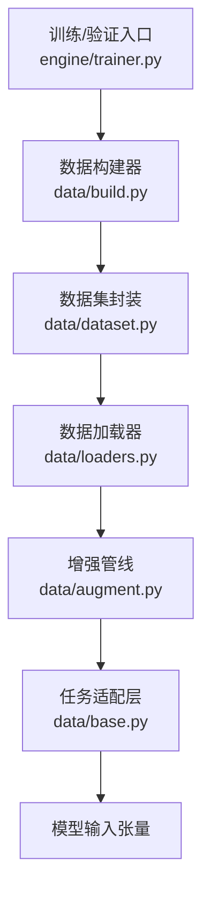
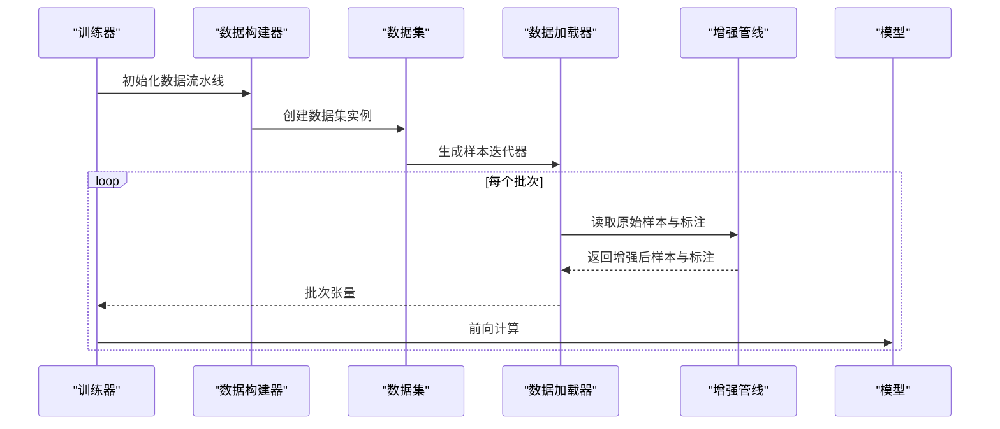
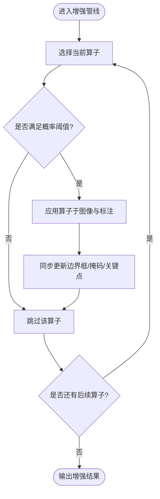
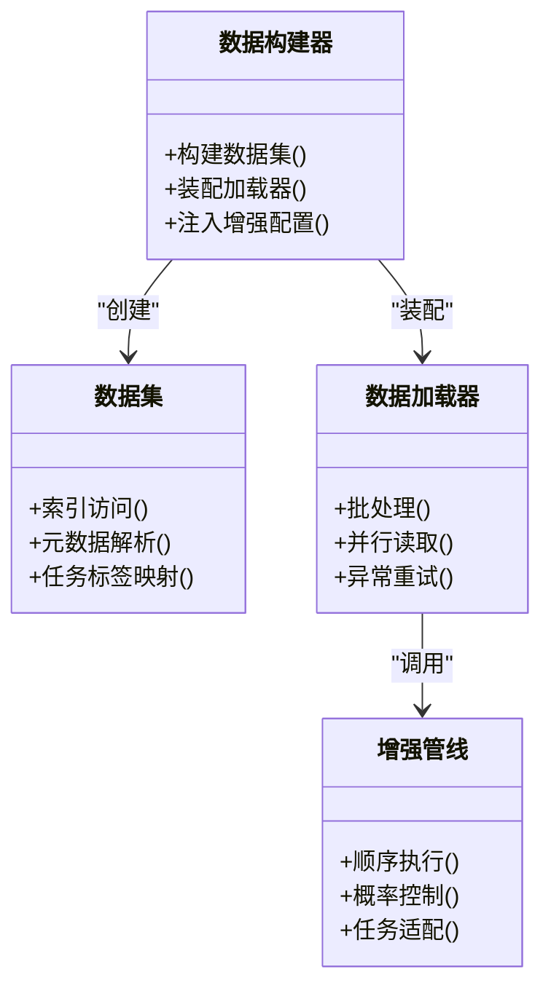
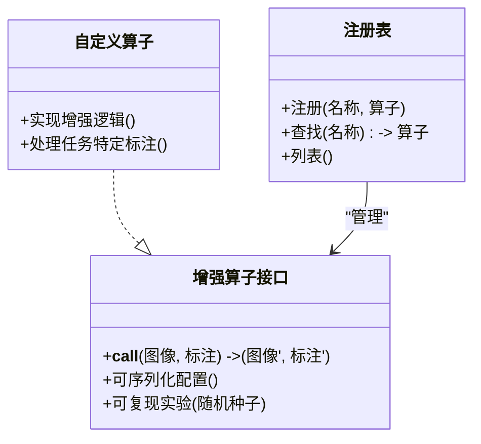
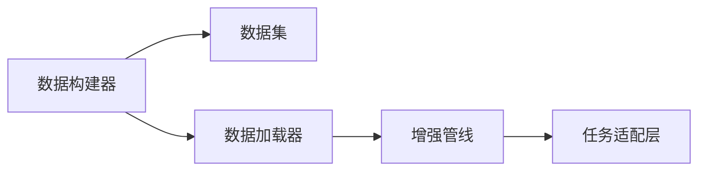

# 数据增强API

<cite>
**本文引用的文件**
- [augment.py](file://ultralytics/data/augment.py)
- [base.py](file://ultralytics/data/base.py)
- [build.py](file://ultralytics/data/build.py)
- [dataset.py](file://ultralytics/data/dataset.py)
- [loaders.py](file://ultralytics/data/loaders.py)
- [yolo_data_augmentation.md](file://docs/en/guides/yolo-data-augmentation.md)
- [augmentation-args.md](file://docs/macros/augmentation-args.md)
</cite>

## 目录
1. [简介](#简介)
2. [项目结构](#项目结构)
3. [核心组件](#核心组件)
4. [架构总览](#架构总览)
5. [详细组件分析](#详细组件分析)
6. [依赖关系分析](#依赖关系分析)
7. [性能考虑](#性能考虑)
8. [故障排查指南](#故障排查指南)
9. [结论](#结论)
10. [附录](#附录)

## 简介
本文件面向YOLO-Master的数据增强API，系统性梳理内置增强算子、增强管道构建与配置方法、自定义增强算子的实现与注册机制，以及检测、分割、姿态估计等任务的专用增强策略。同时提供参数调优指南、实时增强的性能优化与内存管理建议，并给出可视化与调试工具的使用要点。

## 项目结构
数据增强相关代码主要位于 ultralytics/data 目录，配合文档与宏定义形成“实现—配置—使用”的完整链路：
- 增强算子与组合逻辑：ultralytics/data/augment.py
- 数据集基类与通用接口：ultralytics/data/base.py
- 数据加载与流水线装配：ultralytics/data/build.py, ultralytics/data/dataset.py, ultralytics/data/loaders.py
- 用户文档与参数宏：docs/en/guides/yolo-data-augmentation.md, docs/macros/augmentation-args.md

图表来源
- [build.py](file://ultralytics/data/build.py)
- [dataset.py](file://ultralytics/data/dataset.py)
- [loaders.py](file://ultralytics/data/loaders.py)
- [augment.py](file://ultralytics/data/augment.py)
- [base.py](file://ultralytics/data/base.py)

章节来源
- [augment.py](file://ultralytics/data/augment.py)
- [base.py](file://ultralytics/data/base.py)
- [build.py](file://ultralytics/data/build.py)
- [dataset.py](file://ultralytics/data/dataset.py)
- [loaders.py](file://ultralytics/data/loaders.py)

## 核心组件
- 增强算子集合：几何变换（仿射、裁剪、翻转、马赛克、MixUp/CutMix等）、颜色增强（亮度、对比度、饱和度、色调、噪声等）、混合增强（多图融合）等。
- 增强管线：将多个算子按顺序或概率组合，支持条件执行、随机采样与可复现实验。
- 任务适配：针对检测、分割、姿态估计等不同标注类型，确保坐标、掩码、关键点等一致更新。
- 配置系统：通过YAML或宏参数驱动增强强度、概率、比例等超参，便于跨实验复用与搜索。

章节来源
- [augment.py](file://ultralytics/data/augment.py)
- [augmentation-args.md](file://docs/macros/augmentation-args.md)
- [yolo_data_augmentation.md](file://docs/en/guides/yolo-data-augmentation.md)

## 架构总览
下图展示从训练入口到最终模型输入的增强流程，强调数据流与控制流的关键节点。

图表来源
- [build.py](file://ultralytics/data/build.py)
- [dataset.py](file://ultralytics/data/dataset.py)
- [loaders.py](file://ultralytics/data/loaders.py)
- [augment.py](file://ultralytics/data/augment.py)

## 详细组件分析

### 增强算子与组合
- 几何变换：仿射（平移、缩放、旋转、剪切）、随机裁剪、边界框对齐、图像重排等。
- 颜色增强：HSV空间调整、伽马校正、随机噪声、模糊等。
- 混合增强：Mosaic、MixUp、CutMix等，提升小目标与类别不平衡鲁棒性。
- 组合策略：顺序链式、概率分支、条件触发（如仅训练阶段启用）。

图表来源
- [augment.py](file://ultralytics/data/augment.py)

章节来源
- [augment.py](file://ultralytics/data/augment.py)

### 增强管道的构建与配置
- 构建方式：通过数据构建器组装数据集与加载器，并在加载阶段注入增强管线。
- 配置项：由宏参数与YAML共同驱动，包括增强强度、概率、比例、随机种子等。
- 任务感知：不同任务在加载时自动绑定对应的标注处理逻辑，保证一致性。

图表来源
- [build.py](file://ultralytics/data/build.py)
- [dataset.py](file://ultralytics/data/dataset.py)
- [loaders.py](file://ultralytics/data/loaders.py)
- [augment.py](file://ultralytics/data/augment.py)

章节来源
- [build.py](file://ultralytics/data/build.py)
- [dataset.py](file://ultralytics/data/dataset.py)
- [loaders.py](file://ultralytics/data/loaders.py)
- [augmentation-args.md](file://docs/macros/augmentation-args.md)

### 自定义增强算子：实现接口与注册机制
- 实现接口：遵循统一的输入输出契约，接收图像与标注，返回增强后的图像与标注；保持维度与数据类型稳定。
- 注册机制：通过注册表或工厂模式将自定义算子纳入增强管线，支持动态加载与优先级控制。
- 兼容性：需兼容检测、分割、姿态估计等多任务标注格式，确保坐标、掩码、关键点同步更新。

图表来源
- [augment.py](file://ultralytics/data/augment.py)
- [base.py](file://ultralytics/data/base.py)

章节来源
- [augment.py](file://ultralytics/data/augment.py)
- [base.py](file://ultralytics/data/base.py)

### 任务专用增强策略
- 检测：优先保证边界框完整性与重叠合理性，避免过度裁剪导致目标丢失；结合Mosaic/MixUp提升小目标召回。
- 分割：掩码需与几何变换严格对齐，注意插值策略与边界像素处理；对薄结构目标谨慎使用强模糊。
- 姿态估计：关键点需随仿射变换精确更新，避免超出图像范围；对遮挡与密集姿态场景采用适度增强。

章节来源
- [yolo_data_augmentation.md](file://docs/en/guides/yolo-data-augmentation.md)
- [augment.py](file://ultralytics/data/augment.py)

### 参数调优指南与最佳实践
- 强度与概率：以验证集指标为基准，逐步提高增强强度与概率，观察过拟合与欠拟合变化。
- 任务差异：分割与姿态估计对几何一致性更敏感，建议降低强几何扰动，增加颜色与混合增强。
- 数据规模：小数据集倾向更强增强；大数据集适度增强即可，避免破坏真实分布。
- 随机性与复现：固定随机种子，记录增强配置快照，便于回溯与对比。

章节来源
- [augmentation-args.md](file://docs/macros/augmentation-args.md)
- [yolo_data_augmentation.md](file://docs/en/guides/yolo-data-augmentation.md)

### 实时增强的性能优化与内存管理
- 并行与缓冲：利用多进程/多线程预取与批内并行，减少I/O瓶颈；合理设置缓冲区大小，避免内存峰值。
- 算子选择：优先使用向量化与GPU友好的算子，避免频繁CPU-GPU拷贝；必要时进行算子融合。
- 动态调度：根据硬件能力与延迟目标动态调整增强强度与数量，保障吞吐与稳定性。
- 资源回收：及时释放中间张量与缓存，避免长时运行导致的内存泄漏。

章节来源
- [loaders.py](file://ultralytics/data/loaders.py)
- [augment.py](file://ultralytics/data/augment.py)

### 增强效果的可视化与调试工具
- 可视化：绘制增强前后图像、边界框、掩码、关键点叠加图，直观评估增强质量。
- 统计监控：跟踪关键指标（如目标尺寸分布、遮挡率、关键点可见率），辅助定位问题。
- 日志与回放：记录每次增强的参数与随机种子，支持回放与回归测试。

章节来源
- [yolo_data_augmentation.md](file://docs/en/guides/yolo-data-augmentation.md)
- [augment.py](file://ultralytics/data/augment.py)

## 依赖关系分析
- 模块耦合：数据构建器依赖数据集与加载器，加载器依赖增强管线；增强管线依赖任务适配层。
- 外部依赖：可能引入第三方库（如OpenCV、NumPy、TorchVision等）以实现高效图像处理。
- 潜在循环：应避免增强管线反向引用数据集或加载器，防止循环依赖。

图表来源
- [build.py](file://ultralytics/data/build.py)
- [dataset.py](file://ultralytics/data/dataset.py)
- [loaders.py](file://ultralytics/data/loaders.py)
- [augment.py](file://ultralytics/data/augment.py)
- [base.py](file://ultralytics/data/base.py)

章节来源
- [build.py](file://ultralytics/data/build.py)
- [dataset.py](file://ultralytics/data/dataset.py)
- [loaders.py](file://ultralytics/data/loaders.py)
- [augment.py](file://ultralytics/data/augment.py)
- [base.py](file://ultralytics/data/base.py)

## 性能考虑
- I/O与预处理分离：将磁盘读取与增强解耦，使用独立线程池提升吞吐。
- 算子成本评估：对高开销算子进行选择性启用，结合早停与降级策略。
- 批内并行：在GPU上批量执行增强，减少内核启动开销。
- 内存水位监控：设置上限与告警，避免OOM；对大分辨率图像进行分块或降采样预处理。

[本节为通用指导，不直接分析具体文件]

## 故障排查指南
- 标注不一致：检查任务适配层是否正确更新边界框、掩码、关键点；确认仿射矩阵与插值策略。
- 性能抖动：排查数据加载瓶颈与算子热点，必要时替换为更高效实现或关闭部分增强。
- 随机不可复现：确认随机种子传播路径，确保所有随机源均被固定。
- 内存泄漏：定位未释放的中间对象，检查缓存清理与上下文退出逻辑。

章节来源
- [augment.py](file://ultralytics/data/augment.py)
- [loaders.py](file://ultralytics/data/loaders.py)
- [base.py](file://ultralytics/data/base.py)

## 结论
YOLO-Master的数据增强API提供了丰富的内置算子与灵活的管道编排能力，并通过任务适配层确保多任务标注的一致性。通过合理的参数调优、性能优化与可视化工具，可在不同任务与硬件环境下获得稳定且高效的增强效果。建议在生产环境中建立增强配置的版本化管理与回归测试，持续监控指标与资源占用，确保模型训练的稳健性与可复现性。

## 附录
- 快速上手：参考增强指南文档，了解常用增强策略与推荐配置。
- 参数参考：查阅宏参数文档，获取完整的增强参数清单与默认值说明。
- 示例脚本：结合训练与验证脚本，快速集成自定义增强与可视化流程。

章节来源
- [yolo_data_augmentation.md](file://docs/en/guides/yolo-data-augmentation.md)
- [augmentation-args.md](file://docs/macros/augmentation-args.md)