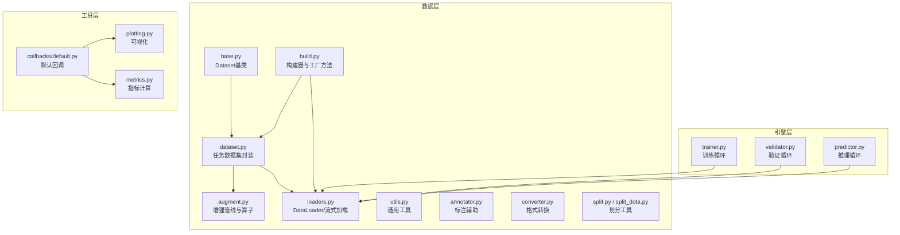
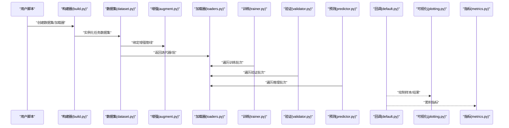
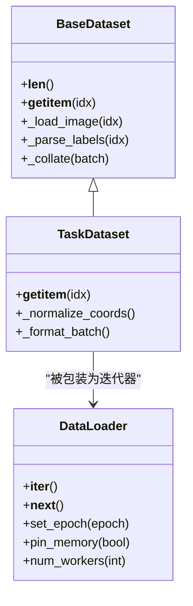
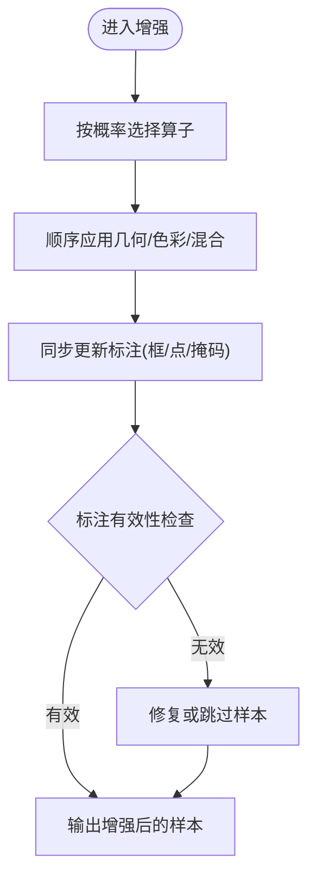
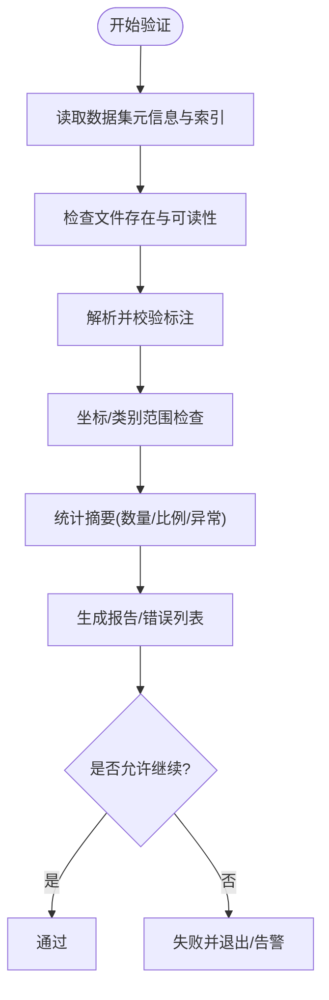
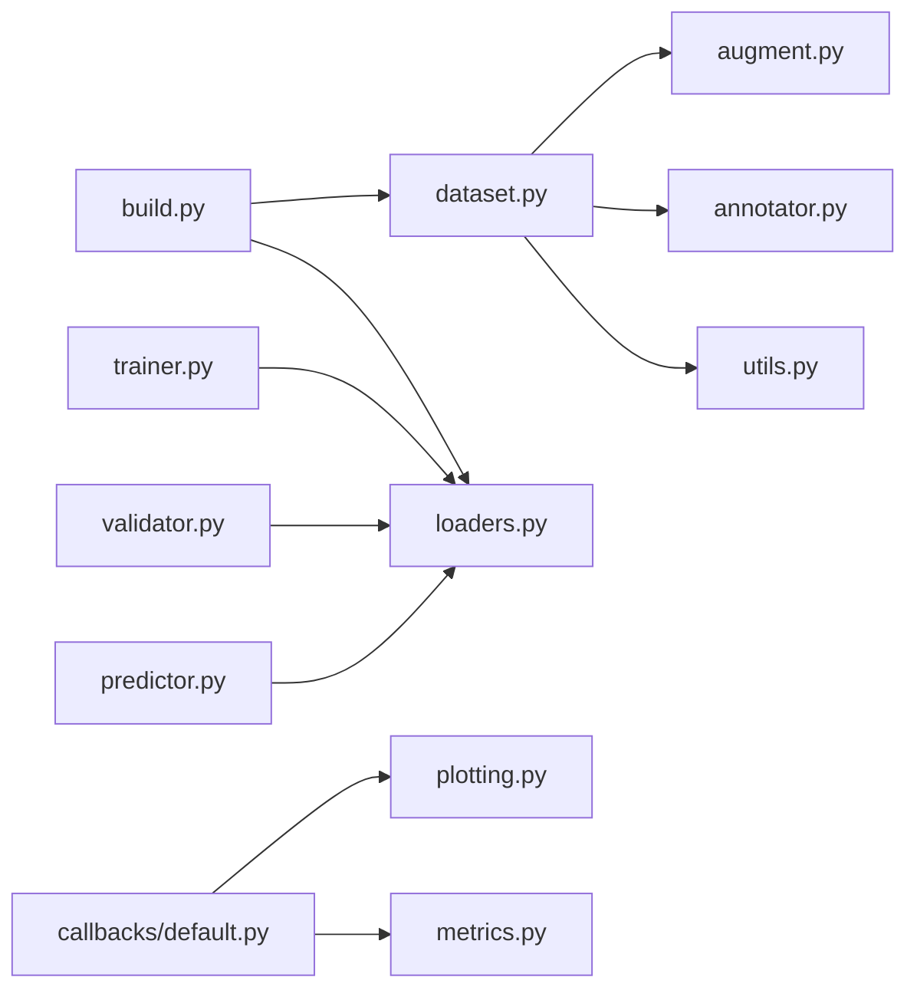

# 数据处理API

<cite>
**本文引用的文件**
- [ultralytics/data/__init__.py](file://ultralytics/data/__init__.py)
- [ultralytics/data/base.py](file://ultralytics/data/base.py)
- [ultralytics/data/dataset.py](file://ultralytics/data/dataset.py)
- [ultralytics/data/build.py](file://ultralytics/data/build.py)
- [ultralytics/data/loaders.py](file://ultralytics/data/loaders.py)
- [ultralytics/data/augment.py](file://ultralytics/data/augment.py)
- [ultralytics/data/annotator.py](file://ultralytics/data/annotator.py)
- [ultralytics/data/utils.py](file://ultralytics/data/utils.py)
- [ultralytics/data/converter.py](file://ultralytics/data/converter.py)
- [ultralytics/data/split.py](file://ultralytics/data/split.py)
- [ultralytics/data/split_dota.py](file://ultralytics/data/split_dota.py)
- [ultralytics/engine/trainer.py](file://ultralytics/engine/trainer.py)
- [ultralytics/engine/validator.py](file://ultralytics/engine/validator.py)
- [ultralytics/engine/predictor.py](file://ultralytics/engine/predictor.py)
- [ultralytics/utils/callbacks/default.py](file://ultralytics/utils/callbacks/default.py)
- [ultralytics/utils/plotting.py](file://ultralytics/utils/plotting.py)
- [ultralytics/utils/metrics.py](file://ultralytics/utils/metrics.py)
</cite>

## 目录
1. [简介](#简介)
2. [项目结构](#项目结构)
3. [核心组件](#核心组件)
4. [架构总览](#架构总览)
5. [详细组件分析](#详细组件分析)
6. [依赖关系分析](#依赖关系分析)
7. [性能考虑](#性能考虑)
8. [故障排查指南](#故障排查指南)
9. [结论](#结论)
10. [附录](#附录)

## 简介
本文件面向YOLO-Master的数据处理API，系统化梳理数据集加载与管理、数据增强管道构建与自定义增强算子、数据验证与质量检查、多模态数据处理接口规范、缓存与预处理优化、分布式数据加载与并行配置、自定义数据格式集成以及可视化与探索工具等关键主题。文档以代码级实现为依据，提供架构图、流程图与调用序列图，帮助读者快速定位并正确使用相关接口。

## 项目结构
数据处理子系统位于 ultralytics/data 下，围绕“数据源抽象—数据集封装—增强流水线—构建器—加载器”的层次组织；训练/验证/预测流程通过 engine 层消费 DataLoader；可视化与指标在 utils 中提供支撑。

图表来源
- [ultralytics/data/base.py](file://ultralytics/data/base.py)
- [ultralytics/data/dataset.py](file://ultralytics/data/dataset.py)
- [ultralytics/data/augment.py](file://ultralytics/data/augment.py)
- [ultralytics/data/loaders.py](file://ultralytics/data/loaders.py)
- [ultralytics/data/build.py](file://ultralytics/data/build.py)
- [ultralytics/engine/trainer.py](file://ultralytics/engine/trainer.py)
- [ultralytics/engine/validator.py](file://ultralytics/engine/validator.py)
- [ultralytics/engine/predictor.py](file://ultralytics/engine/predictor.py)
- [ultralytics/utils/callbacks/default.py](file://ultralytics/utils/callbacks/default.py)
- [ultralytics/utils/plotting.py](file://ultralytics/utils/plotting.py)
- [ultralytics/utils/metrics.py](file://ultralytics/utils/metrics.py)

章节来源
- [ultralytics/data/__init__.py](file://ultralytics/data/__init__.py)
- [ultralytics/data/base.py](file://ultralytics/data/base.py)
- [ultralytics/data/dataset.py](file://ultralytics/data/dataset.py)
- [ultralytics/data/build.py](file://ultralytics/data/build.py)
- [ultralytics/data/loaders.py](file://ultralytics/data/loaders.py)
- [ultralytics/data/augment.py](file://ultralytics/data/augment.py)
- [ultralytics/data/annotator.py](file://ultralytics/data/annotator.py)
- [ultralytics/data/utils.py](file://ultralytics/data/utils.py)
- [ultralytics/data/converter.py](file://ultralytics/data/converter.py)
- [ultralytics/data/split.py](file://ultralytics/data/split.py)
- [ultralytics/data/split_dota.py](file://ultralytics/data/split_dota.py)
- [ultralytics/engine/trainer.py](file://ultralytics/engine/trainer.py)
- [ultralytics/engine/validator.py](file://ultralytics/engine/validator.py)
- [ultralytics/engine/predictor.py](file://ultralytics/engine/predictor.py)
- [ultralytics/utils/callbacks/default.py](file://ultralytics/utils/callbacks/default.py)
- [ultralytics/utils/plotting.py](file://ultralytics/utils/plotting.py)
- [ultralytics/utils/metrics.py](file://ultralytics/utils/metrics.py)

## 核心组件
- 数据集基类与任务封装：定义统一的数据访问协议与任务相关的索引、标签解析与批组装逻辑。
- 增强管线：组合多种图像与标注变换，支持随机化、概率控制与可插拔扩展。
- 构建器与工厂：根据配置或路径自动选择合适的数据集类型与加载策略。
- 加载器：提供多线程/多进程、内存映射、预取与批处理的 DataLoader 能力。
- 工具与转换器：标注校验、格式转换、数据集划分、统计与诊断。
- 引擎集成：训练/验证/预测循环通过构建器获取数据流，并在回调中触发可视化与日志。

章节来源
- [ultralytics/data/base.py](file://ultralytics/data/base.py)
- [ultralytics/data/dataset.py](file://ultralytics/data/dataset.py)
- [ultralytics/data/augment.py](file://ultralytics/data/augment.py)
- [ultralytics/data/build.py](file://ultralytics/data/build.py)
- [ultralytics/data/loaders.py](file://ultralytics/data/loaders.py)
- [ultralytics/data/utils.py](file://ultralytics/data/utils.py)
- [ultralytics/data/converter.py](file://ultralytics/data/converter.py)
- [ultralytics/data/split.py](file://ultralytics/data/split.py)
- [ultralytics/data/split_dota.py](file://ultralytics/data/split_dota.py)

## 架构总览
下图展示从高层入口到数据加载与增强的端到端调用链，以及可视化与指标的接入点。

图表来源
- [ultralytics/data/build.py](file://ultralytics/data/build.py)
- [ultralytics/data/dataset.py](file://ultralytics/data/dataset.py)
- [ultralytics/data/augment.py](file://ultralytics/data/augment.py)
- [ultralytics/data/loaders.py](file://ultralytics/data/loaders.py)
- [ultralytics/engine/trainer.py](file://ultralytics/engine/trainer.py)
- [ultralytics/engine/validator.py](file://ultralytics/engine/validator.py)
- [ultralytics/engine/predictor.py](file://ultralytics/engine/predictor.py)
- [ultralytics/utils/callbacks/default.py](file://ultralytics/utils/callbacks/default.py)
- [ultralytics/utils/plotting.py](file://ultralytics/utils/plotting.py)
- [ultralytics/utils/metrics.py](file://ultralytics/utils/metrics.py)

## 详细组件分析

### 数据集与加载器（Dataset/DataLoader）
- 职责分工
  - base.py：定义数据集基类与通用协议（索引、长度、元信息、批组装钩子）。
  - dataset.py：面向具体任务的封装（如检测、分割、姿态等），负责标签解析、坐标归一化、类别映射与批内对齐。
  - loaders.py：实现高效迭代器，支持多进程、预取、内存映射与动态批大小策略。
  - build.py：根据路径/配置推断任务类型与数据格式，返回合适的 Dataset/DataLoader 实例。
- 典型用法
  - 通过构建器传入数据根目录或配置文件，获得可直接用于训练/验证/预测的可迭代对象。
  - 在训练/验证/预测循环中按批次消费数据，内部完成增强、填充与堆叠。
- 关键特性
  - 多进程安全与锁粒度控制。
  - 可选的缓存与懒加载策略。
  - 对异常样本的容错与跳过机制。

图表来源
- [ultralytics/data/base.py](file://ultralytics/data/base.py)
- [ultralytics/data/dataset.py](file://ultralytics/data/dataset.py)
- [ultralytics/data/loaders.py](file://ultralytics/data/loaders.py)

章节来源
- [ultralytics/data/base.py](file://ultralytics/data/base.py)
- [ultralytics/data/dataset.py](file://ultralytics/data/dataset.py)
- [ultralytics/data/loaders.py](file://ultralytics/data/loaders.py)
- [ultralytics/data/build.py](file://ultralytics/data/build.py)

### 数据增强管线与自定义增强
- 管线组成
  - 基础几何变换（缩放、裁剪、翻转、仿射等）。
  - 色彩与噪声增强（亮度、对比度、模糊、马赛克、MixUp/CutMix等）。
  - 标注一致性维护：所有变换需同步更新边界框、关键点、掩码等多模态标注。
- 构建方式
  - 通过配置或函数式API组合多个算子，支持概率、强度参数与条件分支。
  - 可在训练阶段启用，在验证/推理阶段关闭或降级。
- 自定义增强算子
  - 遵循统一的输入输出契约（图像张量+标注字典），保证可组合性。
  - 建议实现确定性版本以便调试，并提供随机种子控制。
  - 在增强注册表中声明，便于构建器发现与序列化。

图表来源
- [ultralytics/data/augment.py](file://ultralytics/data/augment.py)
- [ultralytics/data/annotator.py](file://ultralytics/data/annotator.py)
- [ultralytics/data/utils.py](file://ultralytics/data/utils.py)

章节来源
- [ultralytics/data/augment.py](file://ultralytics/data/augment.py)
- [ultralytics/data/annotator.py](file://ultralytics/data/annotator.py)
- [ultralytics/data/utils.py](file://ultralytics/data/utils.py)

### 数据验证与质量检查
- 目标
  - 在加载前/后对图像完整性、标注格式、坐标范围、类别ID合法性进行检查。
  - 统计分布与异常值检测，生成报告供后续清洗。
- 主要能力
  - 标注解析与校验（含DOTA等旋转框场景）。
  - 图像可读性与尺寸一致性检查。
  - 类别映射与缺失类别提示。
  - 导出问题清单与修复建议。
- 集成点
  - 在构建数据集时可选择开启严格模式。
  - 在训练/验证前执行一次全量扫描，失败则中止或告警。

图表来源
- [ultralytics/data/utils.py](file://ultralytics/data/utils.py)
- [ultralytics/data/annotator.py](file://ultralytics/data/annotator.py)
- [ultralytics/data/split.py](file://ultralytics/data/split.py)
- [ultralytics/data/split_dota.py](file://ultralytics/data/split_dota.py)

章节来源
- [ultralytics/data/utils.py](file://ultralytics/data/utils.py)
- [ultralytics/data/annotator.py](file://ultralytics/data/annotator.py)
- [ultralytics/data/split.py](file://ultralytics/data/split.py)
- [ultralytics/data/split_dota.py](file://ultralytics/data/split_dota.py)

### 多模态数据处理接口规范
- 支持内容
  - 图像与文本联合（例如开放词汇/描述型标注）、图像与关键点/掩码/旋转框等多标注并存。
  - 不同模态的坐标/语义空间对齐与批内对齐策略。
- 设计要点
  - 在数据集 __getitem__ 中返回统一的结构化样本（包含图像与各模态标注字段）。
  - 增强管线需具备多模态同步更新能力。
  - 构建器根据任务类型自动装配对应处理器。
- 集成方式
  - 通过配置声明多模态字段与对齐规则。
  - 在增强与批组装阶段保持各模态的一致性。

章节来源
- [ultralytics/data/dataset.py](file://ultralytics/data/dataset.py)
- [ultralytics/data/augment.py](file://ultralytics/data/augment.py)
- [ultralytics/data/build.py](file://ultralytics/data/build.py)

### 数据缓存与预处理优化
- 缓存策略
  - 图像解码缓存、标注解析缓存、增强结果缓存（可选）。
  - 基于路径哈希的键空间，避免重复IO与计算。
- 预取与并行
  - 多进程数据加载、线程池解码、GPU pin_memory。
  - 动态批大小与形状自适应以减少填充开销。
- 存储介质
  - 本地SSD优先；大样本可考虑内存映射或分块读取。
- 监控与调优
  - 通过回调记录I/O耗时、CPU/GPU利用率、队列长度。
  - 针对瓶颈调整 num_workers、prefetch_factor、cache_size 等参数。

章节来源
- [ultralytics/data/loaders.py](file://ultralytics/data/loaders.py)
- [ultralytics/data/build.py](file://ultralytics/data/build.py)
- [ultralytics/utils/callbacks/default.py](file://ultralytics/utils/callbacks/default.py)

### 分布式数据加载与并行处理
- 并行模型
  - 多进程 DataLoader 配合多卡训练，每进程独立数据子集。
  - 使用全局随机种子与 epoch 感知采样，确保跨进程一致性与无偏覆盖。
- 通信与同步
  - 训练侧由引擎负责梯度同步；数据侧仅做分发与聚合。
  - 注意共享内存与锁的使用，避免进程间竞争。
- 配置项
  - 进程数、预取深度、内存锁定、采样策略（有放回/无放回）。
  - 断点续训时的数据状态恢复与一致性保证。

章节来源
- [ultralytics/data/loaders.py](file://ultralytics/data/loaders.py)
- [ultralytics/engine/trainer.py](file://ultralytics/engine/trainer.py)

### 自定义数据格式集成指南
- 步骤概览
  - 继承数据集基类，实现索引与样本加载逻辑。
  - 实现标注解析与坐标/类别规范化。
  - 将新格式注册到构建器，使其能自动识别与实例化。
  - 若涉及特殊增强，需在增强管线中提供对应的同步更新逻辑。
- 注意事项
  - 保持与现有契约一致的输入输出结构。
  - 提供最小可用示例与测试用例。
  - 在质量检查中增加对新格式的校验规则。

章节来源
- [ultralytics/data/base.py](file://ultralytics/data/base.py)
- [ultralytics/data/dataset.py](file://ultralytics/data/dataset.py)
- [ultralytics/data/build.py](file://ultralytics/data/build.py)
- [ultralytics/data/augment.py](file://ultralytics/data/augment.py)
- [ultralytics/data/utils.py](file://ultralytics/data/utils.py)

### 数据可视化与探索工具
- 可视化
  - 样本绘制（图像叠加框/关键点/掩码/旋转框）。
  - 训练/验证过程中的中间结果与统计图。
- 探索
  - 类别分布、尺寸分布、长尾分析。
  - 异常样本定位与导出。
- 集成点
  - 通过回调在训练/验证阶段触发可视化。
  - 提供离线探索脚本与Jupyter友好接口。

章节来源
- [ultralytics/utils/plotting.py](file://ultralytics/utils/plotting.py)
- [ultralytics/utils/callbacks/default.py](file://ultralytics/utils/callbacks/default.py)
- [ultralytics/utils/metrics.py](file://ultralytics/utils/metrics.py)

## 依赖关系分析
- 模块耦合
  - 构建器依赖数据集与加载器，解耦了上层引擎与底层数据细节。
  - 增强管线与标注工具强耦合，需保持一致的坐标/类别约定。
  - 引擎层仅依赖构建器暴露的迭代器，降低耦合度。
- 外部依赖
  - 图像处理库、数值计算库、可视化工具等。
- 潜在风险
  - 多进程共享大对象导致的内存膨胀。
  - 自定义增强未正确同步标注引发的训练不稳定。

图表来源
- [ultralytics/data/build.py](file://ultralytics/data/build.py)
- [ultralytics/data/dataset.py](file://ultralytics/data/dataset.py)
- [ultralytics/data/loaders.py](file://ultralytics/data/loaders.py)
- [ultralytics/data/augment.py](file://ultralytics/data/augment.py)
- [ultralytics/data/annotator.py](file://ultralytics/data/annotator.py)
- [ultralytics/data/utils.py](file://ultralytics/data/utils.py)
- [ultralytics/engine/trainer.py](file://ultralytics/engine/trainer.py)
- [ultralytics/engine/validator.py](file://ultralytics/engine/validator.py)
- [ultralytics/engine/predictor.py](file://ultralytics/engine/predictor.py)
- [ultralytics/utils/callbacks/default.py](file://ultralytics/utils/callbacks/default.py)
- [ultralytics/utils/plotting.py](file://ultralytics/utils/plotting.py)
- [ultralytics/utils/metrics.py](file://ultralytics/utils/metrics.py)

## 性能考虑
- I/O瓶颈
  - 提高磁盘吞吐（SSD/NVMe），合理设置 num_workers 与 prefetch_factor。
  - 使用 pin_memory 减少主机-GPU拷贝时间。
- CPU瓶颈
  - 将昂贵增强移至GPU或使用更快的近似算法。
  - 批量解码与向量化操作。
- GPU瓶颈
  - 减少不必要的转置与复制，尽量在连续内存上操作。
  - 使用半精度与混合精度（与数据无关但影响整体吞吐）。
- 监控
  - 利用回调收集I/O、CPU、GPU、队列长度等指标，定位热点。

[本节为通用指导，不直接分析具体文件]

## 故障排查指南
- 常见问题
  - 数据损坏或路径错误：检查文件存在性与权限。
  - 标注越界或类别非法：运行质量检查并修复。
  - 多进程崩溃：检查共享内存与锁，减少进程数或禁用部分增强。
  - 显存不足：减小 batch size、关闭部分增强或启用梯度累积。
- 定位手段
  - 开启严格模式与详细日志。
  - 使用可视化导出问题样本。
  - 逐步关闭增强以定位问题算子。

章节来源
- [ultralytics/data/utils.py](file://ultralytics/data/utils.py)
- [ultralytics/data/annotator.py](file://ultralytics/data/annotator.py)
- [ultralytics/utils/callbacks/default.py](file://ultralytics/utils/callbacks/default.py)

## 结论
YOLO-Master的数据处理API以清晰的层次与可扩展的设计，覆盖了从数据加载、增强、验证到可视化与优化的完整链路。通过构建器与标准契约，用户可以快速集成自定义数据格式与增强算子，并在分布式环境下获得稳定高效的训练体验。建议在工程实践中结合质量检查与可视化，持续监控数据健康度与系统性能。

[本节为总结性内容，不直接分析具体文件]

## 附录
- 术语
  - 数据集：对原始样本与标注的统一抽象。
  - 增强：对图像与标注进行随机或确定性变换以提升鲁棒性。
  - 构建器：根据配置或路径自动装配数据集与加载器的工厂。
  - 加载器：提供高效迭代与批处理的迭代器。
- 参考入口
  - 构建与加载：见构建器与加载器文件。
  - 增强与标注：见增强与标注工具文件。
  - 验证与可视化：见工具与回调文件。

[本节为补充说明，不直接分析具体文件]