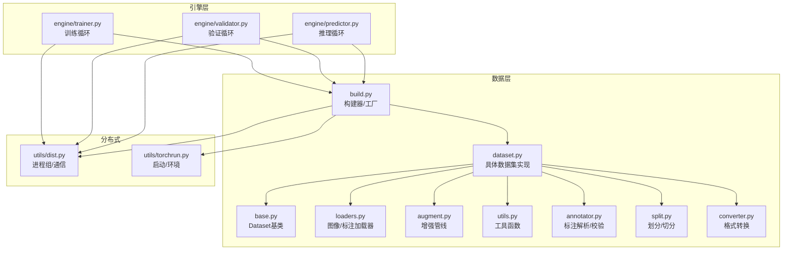
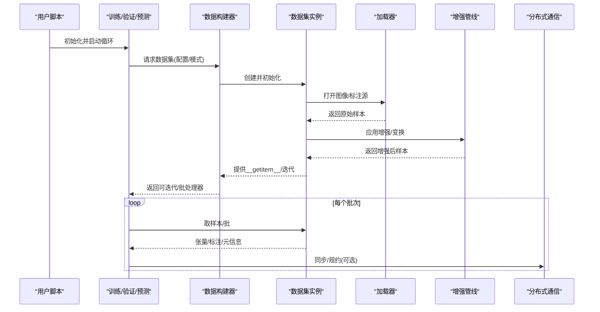
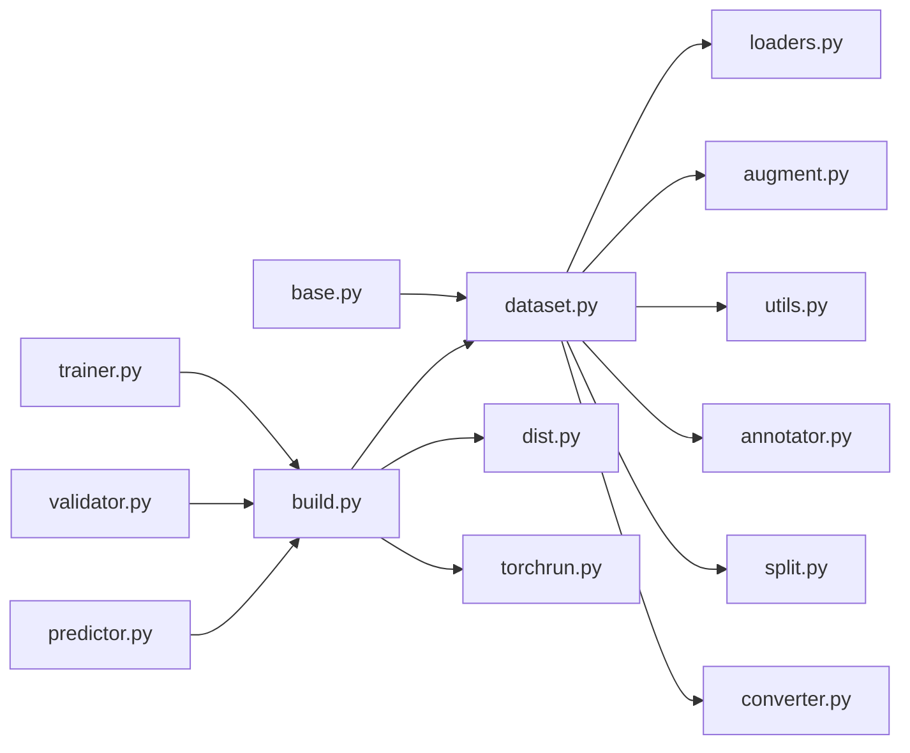

# 数据集API

<cite>
**本文引用的文件**
- [ultralytics/data/base.py](file://ultralytics/data/base.py)
- [ultralytics/data/dataset.py](file://ultralytics/data/dataset.py)
- [ultralytics/data/build.py](file://ultralytics/data/build.py)
- [ultralytics/data/loaders.py](file://ultralytics/data/loaders.py)
- [ultralytics/data/augment.py](file://ultralytics/data/augment.py)
- [ultralytics/data/utils.py](file://ultralytics/data/utils.py)
- [ultralytics/data/annotator.py](file://ultralytics/data/annotator.py)
- [ultralytics/data/split.py](file://ultralytics/data/split.py)
- [ultralytics/data/converter.py](file://ultralytics/data/converter.py)
- [ultralytics/engine/trainer.py](file://ultralytics/engine/trainer.py)
- [ultralytics/engine/validator.py](file://ultralytics/engine/validator.py)
- [ultralytics/engine/predictor.py](file://ultralytics/engine/predictor.py)
- [ultralytics/utils/dist.py](file://ultralytics/utils/dist.py)
- [ultralytics/utils/torchrun.py](file://ultralytics/utils/torchrun.py)
</cite>

## 目录
1. [简介](#简介)
2. [项目结构](#项目结构)
3. [核心组件](#核心组件)
4. [架构总览](#架构总览)
5. [详细组件分析](#详细组件分析)
6. [依赖关系分析](#依赖关系分析)
7. [性能考虑](#性能考虑)
8. [故障排查指南](#故障排查指南)
9. [结论](#结论)
10. [附录](#附录)

## 简介
本文件面向YOLO-Master的数据集API，系统性梳理Dataset基类与具体实现、数据加载与索引管理、批处理机制、支持的数据格式（COCO/YOLO/VOC等）及自定义格式集成方法、数据验证与质量检查接口、多模态数据处理与配置、缓存策略与性能优化、分布式数据加载配置与示例，以及预处理/后处理的扩展点。文档以代码级事实为依据，辅以可视化图示帮助理解。

## 项目结构
数据集相关代码集中在 ultralytics/data 模块，配合 engine 层在训练/验证/预测流程中消费数据；分布式能力由 utils/dist 与 torchrun 提供支撑。

图表来源
- [ultralytics/data/base.py](file://ultralytics/data/base.py)
- [ultralytics/data/dataset.py](file://ultralytics/data/dataset.py)
- [ultralytics/data/build.py](file://ultralytics/data/build.py)
- [ultralytics/data/loaders.py](file://ultralytics/data/loaders.py)
- [ultralytics/data/augment.py](file://ultralytics/data/augment.py)
- [ultralytics/data/utils.py](file://ultralytics/data/utils.py)
- [ultralytics/data/annotator.py](file://ultralytics/data/annotator.py)
- [ultralytics/data/split.py](file://ultralytics/data/split.py)
- [ultralytics/data/converter.py](file://ultralytics/data/converter.py)
- [ultralytics/engine/trainer.py](file://ultralytics/engine/trainer.py)
- [ultralytics/engine/validator.py](file://ultralytics/engine/validator.py)
- [ultralytics/engine/predictor.py](file://ultralytics/engine/predictor.py)
- [ultralytics/utils/dist.py](file://ultralytics/utils/dist.py)
- [ultralytics/utils/torchrun.py](file://ultralytics/utils/torchrun.py)

章节来源
- [ultralytics/data/base.py](file://ultralytics/data/base.py)
- [ultralytics/data/dataset.py](file://ultralytics/data/dataset.py)
- [ultralytics/data/build.py](file://ultralytics/data/build.py)
- [ultralytics/data/loaders.py](file://ultralytics/data/loaders.py)
- [ultralytics/data/augment.py](file://ultralytics/data/augment.py)
- [ultralytics/data/utils.py](file://ultralytics/data/utils.py)
- [ultralytics/data/annotator.py](file://ultralytics/data/annotator.py)
- [ultralytics/data/split.py](file://ultralytics/data/split.py)
- [ultralytics/data/converter.py](file://ultralytics/data/converter.py)
- [ultralytics/engine/trainer.py](file://ultralytics/engine/trainer.py)
- [ultralytics/engine/validator.py](file://ultralytics/engine/validator.py)
- [ultralytics/engine/predictor.py](file://ultralytics/engine/predictor.py)
- [ultralytics/utils/dist.py](file://ultralytics/utils/dist.py)
- [ultralytics/utils/torchrun.py](file://ultralytics/utils/torchrun.py)

## 核心组件
- Dataset基类：定义统一的数据访问契约（索引、长度、单样本获取、迭代协议），并封装通用逻辑如路径解析、元信息暴露、可选的缓存与打乱策略。
- 具体数据集实现：针对检测/分割/姿态/分类/语义/跟踪等任务的具体实现，负责解析不同标注格式、构建索引、组织批次输出。
- 构建器/工厂：根据配置或参数选择合适的数据集类型与加载器，组装增强、采样、批处理流水线。
- 加载器：负责从磁盘/内存/流式源读取图像与标注，进行解码、归一化、尺寸变换等基础操作。
- 增强管线：提供几何/色彩/遮挡/混合等增强算子，支持按任务定制。
- 工具与注解：提供路径/标签解析、格式校验、统计、切分、转换等辅助能力。
- 引擎集成：训练/验证/预测在各自的循环中调用构建器与数据集，驱动数据供给。

章节来源
- [ultralytics/data/base.py](file://ultralytics/data/base.py)
- [ultralytics/data/dataset.py](file://ultralytics/data/dataset.py)
- [ultralytics/data/build.py](file://ultralytics/data/build.py)
- [ultralytics/data/loaders.py](file://ultralytics/data/loaders.py)
- [ultralytics/data/augment.py](file://ultralytics/data/augment.py)
- [ultralytics/data/utils.py](file://ultralytics/data/utils.py)
- [ultralytics/data/annotator.py](file://ultralytics/data/annotator.py)
- [ultralytics/engine/trainer.py](file://ultralytics/engine/trainer.py)
- [ultralytics/engine/validator.py](file://ultralytics/engine/validator.py)
- [ultralytics/engine/predictor.py](file://ultralytics/engine/predictor.py)

## 架构总览
下图展示从引擎到数据层的端到端数据流，包括分布式环境下的进程角色与数据供给路径。

图表来源
- [ultralytics/engine/trainer.py](file://ultralytics/engine/trainer.py)
- [ultralytics/engine/validator.py](file://ultralytics/engine/validator.py)
- [ultralytics/engine/predictor.py](file://ultralytics/engine/predictor.py)
- [ultralytics/data/build.py](file://ultralytics/data/build.py)
- [ultralytics/data/dataset.py](file://ultralytics/data/dataset.py)
- [ultralytics/data/loaders.py](file://ultralytics/data/loaders.py)
- [ultralytics/data/augment.py](file://ultralytics/data/augment.py)
- [ultralytics/utils/dist.py](file://ultralytics/utils/dist.py)

## 详细组件分析

### Dataset基类与契约
- 职责
  - 定义统一的索引访问与迭代协议，暴露长度、键空间、元信息。
  - 封装路径解析、类别映射、标注解析入口、可选缓存与打乱。
  - 为子类提供通用的错误处理、日志与调试钩子。
- 关键接口
  - 索引访问：通过整数索引或键获取单条样本。
  - 迭代协议：支持for遍历与切片。
  - 元信息：类别表、任务类型、统计信息等只读属性。
  - 生命周期：初始化、关闭资源、清理缓存。
- 设计要点
  - 延迟加载：按需读取图像与标注，避免一次性载入大集合。
  - 线程安全：在多线程DataLoader场景下保证并发安全。
  - 可扩展：预留增强、过滤、重采样、多模态融合等扩展点。

章节来源
- [ultralytics/data/base.py](file://ultralytics/data/base.py)

### 具体数据集实现
- 职责
  - 解析特定任务与格式的标注（COCO/YOLO/VOC等）。
  - 构建内部索引（图像-标注映射、类别ID映射、边界框/掩码/关键点等）。
  - 组织批次数据结构，确保与模型输入契约一致。
- 典型能力
  - 多格式解析：自动识别或显式指定格式，统一转换为内部表示。
  - 索引管理：维护高效查找结构，支持快速随机访问与范围查询。
  - 批处理：按任务需求打包图像、目标、掩码、关键点、轨迹ID等。
  - 过滤与裁剪：依据尺寸、缺失标注、类别阈值等进行预过滤。
- 扩展点
  - 新增任务：继承基类并实现任务特定的__getitem__与批打包。
  - 新增格式：注册新的解析器并在构建阶段路由。

章节来源
- [ultralytics/data/dataset.py](file://ultralytics/data/dataset.py)

### 构建器与工厂
- 职责
  - 根据配置/命令行参数选择数据集类型、加载器、增强策略与批处理策略。
  - 组合数据管道：加载→增强→批处理→分发。
  - 注入分布式上下文（进程数、每进程样本数、洗牌策略）。
- 关键流程
  - 解析配置：任务类型、数据路径、类别表、增强参数、批大小、工作进程数。
  - 实例化：创建数据集对象与加载器，必要时包装为可迭代器。
  - 校验：对路径、类别、标注一致性进行预检。

章节来源
- [ultralytics/data/build.py](file://ultralytics/data/build.py)

### 加载器与数据源
- 职责
  - 从文件系统/内存/网络源读取图像与标注文件。
  - 解码图像、读取文本/JSON/XML标注、坐标归一化、通道顺序调整。
  - 提供统一的样本接口供上层使用。
- 特性
  - 懒加载与缓存：可按需缓存图像/标注以减少IO压力。
  - 错误恢复：跳过损坏文件并记录告警。
  - 多源聚合：支持合并多个目录或清单文件。

章节来源
- [ultralytics/data/loaders.py](file://ultralytics/data/loaders.py)

### 增强管线
- 职责
  - 提供几何变换、色彩扰动、遮挡、MixUp/CutMix、Mosaic等增强。
  - 按任务选择性启用（例如分割需要同时变换掩码，姿态需同步关键点）。
- 设计
  - 可组合：将多个算子串成Pipeline，支持概率控制与参数调度。
  - 可插拔：新增增强算子只需遵循统一接口。

章节来源
- [ultralytics/data/augment.py](file://ultralytics/data/augment.py)

### 工具、注解与校验
- 工具函数
  - 路径解析、类别映射、坐标格式转换、尺寸对齐、统计摘要。
- 注解解析
  - 解析COCO JSON、YOLO txt、VOC XML等格式，生成内部统一结构。
- 质量检查
  - 标注完整性（缺失文件、越界坐标、重复类别）、统计分布、异常值检测。
- 切分与转换
  - 数据集划分（train/val/test）、格式互转（COCO↔YOLO↔VOC）。

章节来源
- [ultralytics/data/utils.py](file://ultralytics/data/utils.py)
- [ultralytics/data/annotator.py](file://ultralytics/data/annotator.py)
- [ultralytics/data/split.py](file://ultralytics/data/split.py)
- [ultralytics/data/converter.py](file://ultralytics/data/converter.py)

### 引擎集成与数据消费
- 训练/验证/预测循环
  - 通过构建器获取数据集与迭代器，在epoch内批量拉取数据。
  - 在验证/评估阶段可能触发额外的质量检查与指标计算。
- 分布式
  - 在多进程环境下，各进程独立持有数据集副本，按全局批大小与进程数分配样本。
  - 通过分布式通信进行梯度规约或结果汇总。

章节来源
- [ultralytics/engine/trainer.py](file://ultralytics/engine/trainer.py)
- [ultralytics/engine/validator.py](file://ultralytics/engine/validator.py)
- [ultralytics/engine/predictor.py](file://ultralytics/engine/predictor.py)
- [ultralytics/utils/dist.py](file://ultralytics/utils/dist.py)

## 依赖关系分析
- 耦合与内聚
  - dataset.py 强依赖 base.py 的契约；build.py 作为装配中心，低耦合地组合各组件。
  - loaders.py 与 annotator.py 专注I/O与解析，utils.py 提供跨模块复用能力。
- 外部依赖
  - 分布式依赖 utils/dist 与 torchrun 提供的进程组与环境变量。
- 潜在循环
  - 当前分层清晰，未见直接循环导入；若新增功能需注意保持单向依赖。

图表来源
- [ultralytics/data/base.py](file://ultralytics/data/base.py)
- [ultralytics/data/dataset.py](file://ultralytics/data/dataset.py)
- [ultralytics/data/build.py](file://ultralytics/data/build.py)
- [ultralytics/data/loaders.py](file://ultralytics/data/loaders.py)
- [ultralytics/data/augment.py](file://ultralytics/data/augment.py)
- [ultralytics/data/utils.py](file://ultralytics/data/utils.py)
- [ultralytics/data/annotator.py](file://ultralytics/data/annotator.py)
- [ultralytics/data/split.py](file://ultralytics/data/split.py)
- [ultralytics/data/converter.py](file://ultralytics/data/converter.py)
- [ultralytics/engine/trainer.py](file://ultralytics/engine/trainer.py)
- [ultralytics/engine/validator.py](file://ultralytics/engine/validator.py)
- [ultralytics/engine/predictor.py](file://ultralytics/engine/predictor.py)
- [ultralytics/utils/dist.py](file://ultralytics/utils/dist.py)
- [ultralytics/utils/torchrun.py](file://ultralytics/utils/torchrun.py)

## 性能考虑
- IO与缓存
  - 优先使用懒加载与本地缓存，减少重复解码与磁盘访问。
  - 合理设置工作进程数，平衡CPU核数与磁盘吞吐。
- 批处理与内存
  - 动态批大小与变长序列时注意填充策略，避免过多无效计算。
  - 及时释放中间张量，避免峰值内存过高。
- 增强开销
  - 将昂贵增强置于训练阶段，验证/推理禁用或降级。
  - 使用向量化/并行化增强算子，减少Python循环。
- 分布式
  - 合理设置每进程样本数，避免负载不均。
  - 利用共享内存或预取降低主进程瓶颈。

[本节为通用指导，不直接分析具体文件]

## 故障排查指南
- 常见错误
  - 路径不存在或权限不足：检查数据根目录与子目录结构。
  - 标注格式不一致：使用转换器或校验工具统一格式。
  - 类别映射错误：确认类别表与配置文件一致。
  - 损坏图像/文件：启用跳过与告警，定位并修复。
- 诊断步骤
  - 最小复现：用极小子集运行训练/验证，逐步扩大范围。
  - 打印元信息：查看数据集长度、类别分布、样本尺寸。
  - 隔离增强：关闭增强以判断是否由增强引起。
  - 分布式隔离：单进程验证后再扩展到多进程。

章节来源
- [ultralytics/data/utils.py](file://ultralytics/data/utils.py)
- [ultralytics/data/annotator.py](file://ultralytics/data/annotator.py)
- [ultralytics/data/converter.py](file://ultralytics/data/converter.py)
- [ultralytics/data/split.py](file://ultralytics/data/split.py)

## 结论
YOLO-Master的数据集API以清晰的基类契约为核心，结合构建器与加载器实现了高内聚、低耦合的数据管线。其支持主流标注格式并提供丰富的扩展点，便于接入自定义格式与多模态数据。通过合理的缓存、增强与分布式配置，可在大规模数据场景下获得稳定高效的训练与推理体验。

[本节为总结性内容，不直接分析具体文件]

## 附录

### 支持的数据格式与集成方法
- 内置支持
  - COCO：JSON标注，包含图像、类别、目标、分割/关键点等字段。
  - YOLO：txt标注，每行一个目标，含类别与归一化坐标。
  - VOC：XML标注，包含边界框与类别信息。
- 自定义格式集成
  - 新增解析器：在annotator或converter中实现新格式的读取与内部结构转换。
  - 注册路由：在构建器中根据配置或文件后缀选择对应解析器。
  - 单元测试：覆盖边界情况与异常路径，确保鲁棒性。

章节来源
- [ultralytics/data/annotator.py](file://ultralytics/data/annotator.py)
- [ultralytics/data/converter.py](file://ultralytics/data/converter.py)
- [ultralytics/data/build.py](file://ultralytics/data/build.py)

### 数据验证与质量检查API
- 验证项
  - 文件存在性与可读性、标注完整性、坐标合法性、类别有效性、重复/冲突检测。
- 统计与报告
  - 类别分布、尺寸分布、缺失率、异常值比例。
- 自动化修复建议
  - 自动剔除无效样本、补全缺失字段、修正越界坐标。

章节来源
- [ultralytics/data/utils.py](file://ultralytics/data/utils.py)
- [ultralytics/data/annotator.py](file://ultralytics/data/annotator.py)

### 多模态数据集处理与配置
- 处理思路
  - 在__getitem__中并行加载图像与文本/音频/视频帧等多模态数据。
  - 在增强阶段仅对相应模态应用变换，保持模态间对齐。
  - 在批打包中将多模态张量与元信息一起返回，供模型融合模块消费。
- 配置选项
  - 模态开关、对齐策略、缺失模态处理、缓存粒度。

章节来源
- [ultralytics/data/dataset.py](file://ultralytics/data/dataset.py)
- [ultralytics/data/augment.py](file://ultralytics/data/augment.py)

### 数据缓存策略与性能优化
- 缓存层级
  - 图像缓存：解码后的图像矩阵缓存。
  - 标注缓存：解析后的结构化标注缓存。
  - 增强缓存：对确定性增强结果进行缓存（谨慎使用）。
- 优化技巧
  - 预取与异步IO：提前准备下一批数据。
  - 内存映射：超大文件采用mmap减少拷贝。
  - 批内排序：按尺寸分组减少填充浪费。

章节来源
- [ultralytics/data/loaders.py](file://ultralytics/data/loaders.py)
- [ultralytics/data/utils.py](file://ultralytics/data/utils.py)

### 分布式数据加载配置与示例
- 配置要点
  - 进程总数、每进程样本数、洗牌策略、种子固定。
  - 数据分区：按样本索引均匀划分，避免跨进程重复。
- 使用示例（概念流程）
  - 初始化分布式环境 → 构建数据集（传入分布式参数） → 进入训练/验证循环 → 收集结果并规约。

章节来源
- [ultralytics/utils/dist.py](file://ultralytics/utils/dist.py)
- [ultralytics/utils/torchrun.py](file://ultralytics/utils/torchrun.py)
- [ultralytics/data/build.py](file://ultralytics/data/build.py)

### 数据预处理与后处理扩展点
- 预处理扩展点
  - 自定义增强算子：实现统一接口并注册到增强管线。
  - 自定义加载器：对接云存储、数据库或流式数据源。
- 后处理扩展点
  - 自定义批打包：适配特殊模型输入要求。
  - 自定义校验器：在验证阶段插入额外检查或导出中间产物。

章节来源
- [ultralytics/data/augment.py](file://ultralytics/data/augment.py)
- [ultralytics/data/loaders.py](file://ultralytics/data/loaders.py)
- [ultralytics/data/dataset.py](file://ultralytics/data/dataset.py)