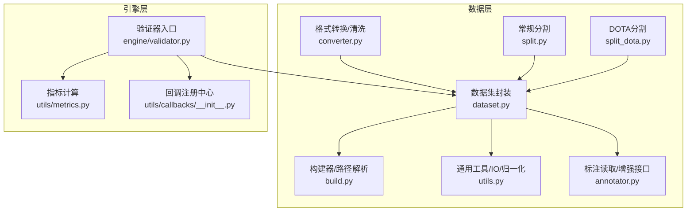
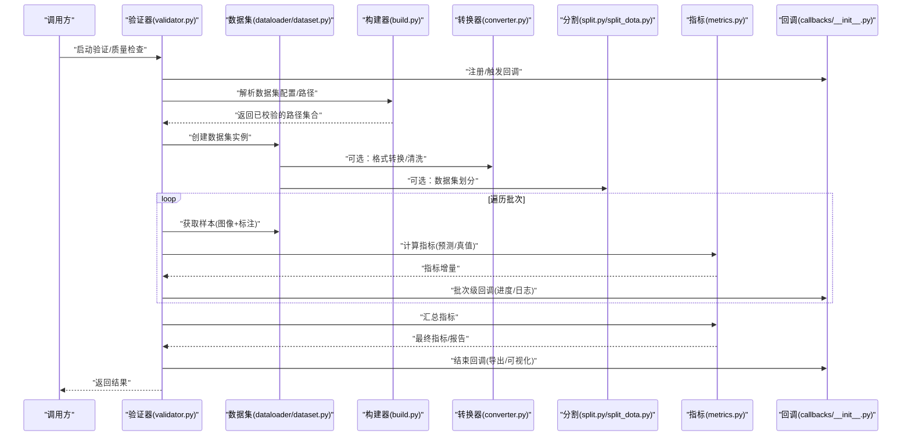
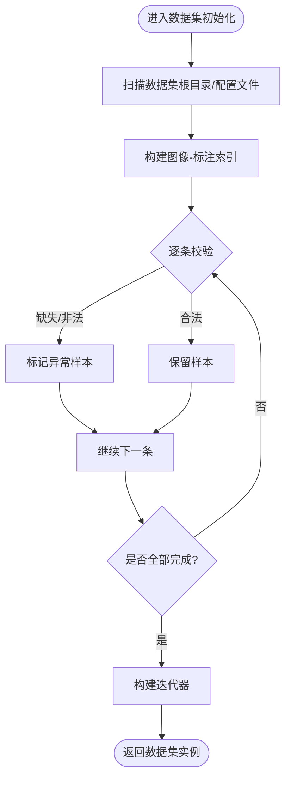
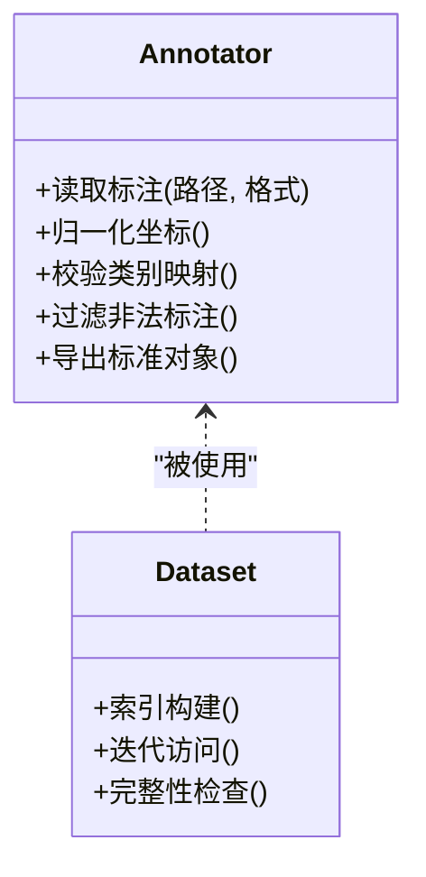
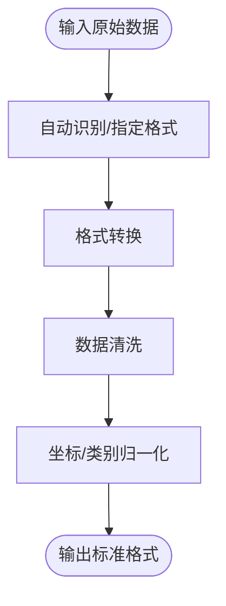
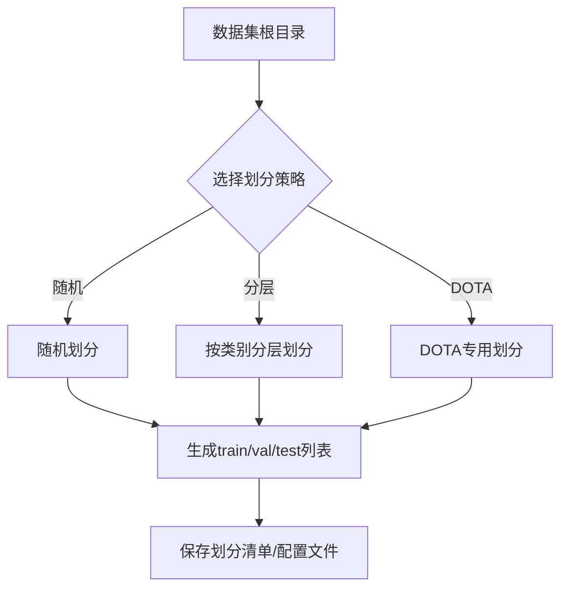
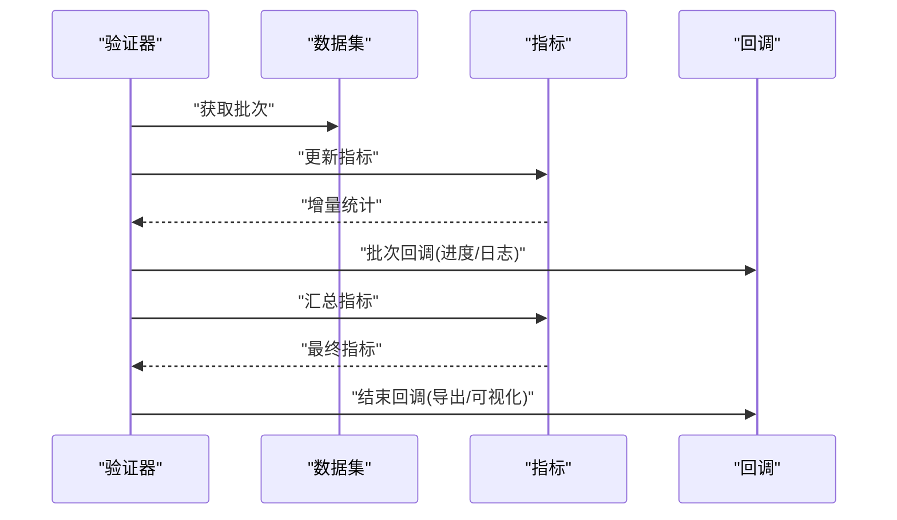
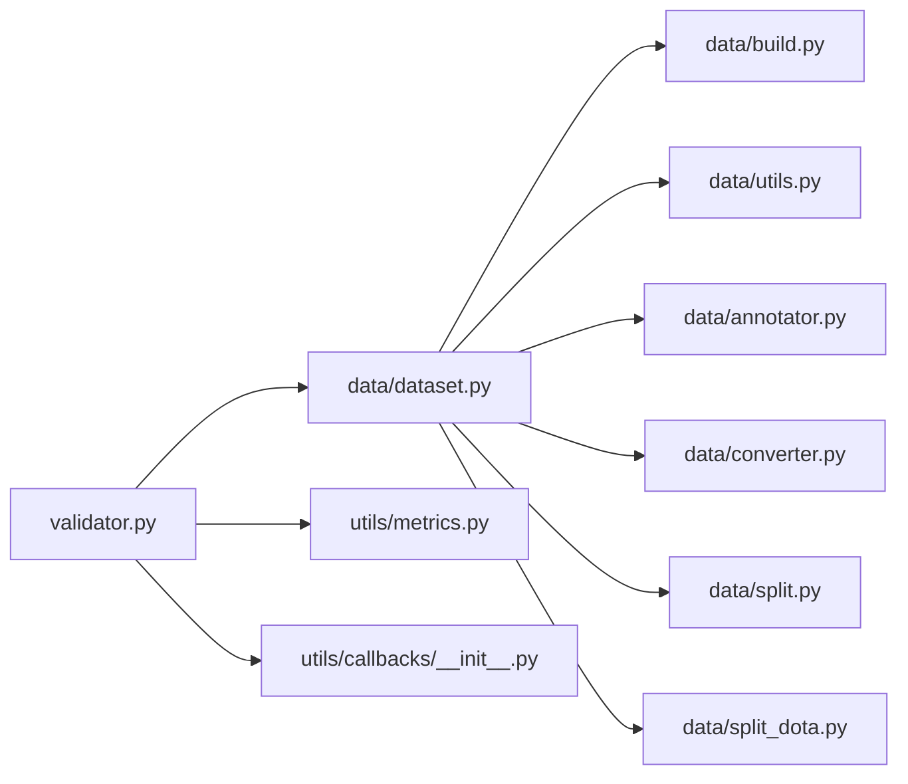

# 数据验证API

<cite>
**本文引用的文件**
- [ultralytics/data/dataset.py](file://ultralytics/data/dataset.py)
- [ultralytics/data/build.py](file://ultralytics/data/build.py)
- [ultralytics/data/utils.py](file://ultralytics/data/utils.py)
- [ultralytics/data/annotator.py](file://ultralytics/data/annotator.py)
- [ultralytics/data/split.py](file://ultralytics/data/split.py)
- [ultralytics/data/split_dota.py](file://ultralytics/data/split_dota.py)
- [ultralytics/data/converter.py](file://ultralytics/data/converter.py)
- [ultralytics/engine/validator.py](file://ultralytics/engine/validator.py)
- [ultralytics/utils/metrics.py](file://ultralytics/utils/metrics.py)
- [ultralytics/utils/callbacks/__init__.py](file://ultralytics/utils/callbacks/__init__.py)
- [tests/test_validator_helpers.py](file://tests/test_validator_helpers.py)
</cite>

## 目录
1. [简介](#简介)
2. [项目结构](#项目结构)
3. [核心组件](#核心组件)
4. [架构总览](#架构总览)
5. [详细组件分析](#详细组件分析)
6. [依赖关系分析](#依赖关系分析)
7. [性能考虑](#性能考虑)
8. [故障排查指南](#故障排查指南)
9. [结论](#结论)
10. [附录](#附录)

## 简介
本文件为 YOLO-Master 数据验证 API 的权威文档，聚焦于标注数据的完整性检查、一致性校验、格式转换与清洗、数据集分割与划分、质量评估指标与报告生成、批量并行处理配置、版本管理与变更追踪，以及结果可视化与导出。内容基于仓库中数据加载、验证、度量与工具模块的实现进行系统化梳理，帮助使用者构建稳定可靠的数据流水线。

## 项目结构
围绕数据验证相关能力，代码主要分布在以下模块：
- 数据加载与校验：ultralytics/data/*
- 引擎验证流程：ultralytics/engine/validator.py
- 指标计算与统计：ultralytics/utils/metrics.py
- 回调与事件：ultralytics/utils/callbacks/*
- 测试用例（辅助理解行为）：tests/test_validator_helpers.py

图表来源
- [ultralytics/data/dataset.py](file://ultralytics/data/dataset.py)
- [ultralytics/data/build.py](file://ultralytics/data/build.py)
- [ultralytics/data/utils.py](file://ultralytics/data/utils.py)
- [ultralytics/data/annotator.py](file://ultralytics/data/annotator.py)
- [ultralytics/data/converter.py](file://ultralytics/data/converter.py)
- [ultralytics/data/split.py](file://ultralytics/data/split.py)
- [ultralytics/data/split_dota.py](file://ultralytics/data/split_dota.py)
- [ultralytics/engine/validator.py](file://ultralytics/engine/validator.py)
- [ultralytics/utils/metrics.py](file://ultralytics/utils/metrics.py)
- [ultralytics/utils/callbacks/__init__.py](file://ultralytics/utils/callbacks/__init__.py)

章节来源
- [ultralytics/data/dataset.py](file://ultralytics/data/dataset.py)
- [ultralytics/data/build.py](file://ultralytics/data/build.py)
- [ultralytics/data/utils.py](file://ultralytics/data/utils.py)
- [ultralytics/data/annotator.py](file://ultralytics/data/annotator.py)
- [ultralytics/data/converter.py](file://ultralytics/data/converter.py)
- [ultralytics/data/split.py](file://ultralytics/data/split.py)
- [ultralytics/data/split_dota.py](file://ultralytics/data/split_dota.py)
- [ultralytics/engine/validator.py](file://ultralytics/engine/validator.py)
- [ultralytics/utils/metrics.py](file://ultralytics/utils/metrics.py)
- [ultralytics/utils/callbacks/__init__.py](file://ultralytics/utils/callbacks/__init__.py)

## 核心组件
- 数据集封装与校验
  - 负责解析数据集描述、索引图像与标注、执行基础完整性检查（如文件存在性、类别映射一致性、边界框范围等）。
  - 提供迭代接口供验证器消费，支持按需加载与缓存策略。
- 构建器与路径解析
  - 统一解析数据集配置文件或目录结构，将相对路径转换为绝对路径，并做预检。
- 标注读取与增强接口
  - 抽象不同格式的标注读取逻辑，提供统一的标注对象模型；同时暴露增强管线接口。
- 格式转换与清洗
  - 提供常见格式（如 COCO/YOLO/VOC 等）之间的转换与清洗能力，包括坐标归一化、重复项去重、非法值过滤等。
- 数据集分割与划分
  - 提供随机/分层/空间感知的训练/验证/测试集划分，支持 DOTA 等特殊任务。
- 验证器入口
  - 编排数据加载、推理/评估、指标汇总与报告输出；通过回调机制扩展日志、可视化与告警。
- 指标计算
  - 实现精度、召回、mAP、混淆矩阵、PR曲线等常用检测指标的计算与聚合。
- 回调系统
  - 在关键阶段触发事件（如开始/结束、批次完成、错误发生），便于记录、监控与导出。

章节来源
- [ultralytics/data/dataset.py](file://ultralytics/data/dataset.py)
- [ultralytics/data/build.py](file://ultralytics/data/build.py)
- [ultralytics/data/utils.py](file://ultralytics/data/utils.py)
- [ultralytics/data/annotator.py](file://ultralytics/data/annotator.py)
- [ultralytics/data/converter.py](file://ultralytics/data/converter.py)
- [ultralytics/data/split.py](file://ultralytics/data/split.py)
- [ultralytics/data/split_dota.py](file://ultralytics/data/split_dota.py)
- [ultralytics/engine/validator.py](file://ultralytics/engine/validator.py)
- [ultralytics/utils/metrics.py](file://ultralytics/utils/metrics.py)
- [ultralytics/utils/callbacks/__init__.py](file://ultralytics/utils/callbacks/__init__.py)

## 架构总览
下图展示了数据验证端到端流程：从数据准备（转换/清洗/分割）到验证执行（加载/评估/指标）再到报告与可视化输出。

图表来源
- [ultralytics/engine/validator.py](file://ultralytics/engine/validator.py)
- [ultralytics/data/dataset.py](file://ultralytics/data/dataset.py)
- [ultralytics/data/build.py](file://ultralytics/data/build.py)
- [ultralytics/data/converter.py](file://ultralytics/data/converter.py)
- [ultralytics/data/split.py](file://ultralytics/data/split.py)
- [ultralytics/data/split_dota.py](file://ultralytics/data/split_dota.py)
- [ultralytics/utils/metrics.py](file://ultralytics/utils/metrics.py)
- [ultralytics/utils/callbacks/__init__.py](file://ultralytics/utils/callbacks/__init__.py)

## 详细组件分析

### 数据加载与完整性检查
- 职责
  - 解析数据集描述，建立图像与标注的索引关系。
  - 执行完整性检查：文件存在性、尺寸有效性、标注格式合法性、类别ID与名称映射一致性、边界框越界/退化检测等。
- 关键流程
  - 初始化时扫描目录/配置文件，收集候选样本。
  - 对每个样本进行元数据校验与异常标记。
  - 对外暴露迭代器，按批次返回标准化后的样本。
- 典型问题定位
  - 缺失文件、标注为空、类别不在字典中、坐标越界、重复标注等。

图表来源
- [ultralytics/data/dataset.py](file://ultralytics/data/dataset.py)
- [ultralytics/data/build.py](file://ultralytics/data/build.py)
- [ultralytics/data/utils.py](file://ultralytics/data/utils.py)

章节来源
- [ultralytics/data/dataset.py](file://ultralytics/data/dataset.py)
- [ultralytics/data/build.py](file://ultralytics/data/build.py)
- [ultralytics/data/utils.py](file://ultralytics/data/utils.py)

### 标注读取与一致性验证
- 职责
  - 统一读取多种标注格式，转换为内部一致表示。
  - 执行一致性验证：类别ID与名称映射、坐标归一化、多边形/关键点数量校验、重叠/包含关系检查等。
- 关键点
  - 标注读取器与增强接口解耦，便于扩展新格式。
  - 一致性规则可配置，支持严格/宽松模式。

图表来源
- [ultralytics/data/annotator.py](file://ultralytics/data/annotator.py)
- [ultralytics/data/dataset.py](file://ultralytics/data/dataset.py)

章节来源
- [ultralytics/data/annotator.py](file://ultralytics/data/annotator.py)
- [ultralytics/data/dataset.py](file://ultralytics/data/dataset.py)

### 格式转换与数据清洗
- 职责
  - 提供跨格式转换（如 COCO/YOLO/VOC 等）与清洗能力。
  - 清洗规则包括：去重、空框移除、越界裁剪、类别合并/别名替换、坐标归一化、冗余字段清理等。
- 适用场景
  - 数据迁移、历史数据治理、跨团队协作时的格式对齐。

图表来源
- [ultralytics/data/converter.py](file://ultralytics/data/converter.py)
- [ultralytics/data/utils.py](file://ultralytics/data/utils.py)

章节来源
- [ultralytics/data/converter.py](file://ultralytics/data/converter.py)
- [ultralytics/data/utils.py](file://ultralytics/data/utils.py)

### 数据集分割与划分
- 职责
  - 提供训练/验证/测试集的自动化划分，支持随机、分层、按目录结构等多种策略。
  - 针对 DOTA 等旋转框任务提供专用分割逻辑。
- 注意事项
  - 保证类别分布均衡（分层策略）。
  - 控制随机种子以保证可复现性。
  - 大目标/小目标比例可控。

图表来源
- [ultralytics/data/split.py](file://ultralytics/data/split.py)
- [ultralytics/data/split_dota.py](file://ultralytics/data/split_dota.py)

章节来源
- [ultralytics/data/split.py](file://ultralytics/data/split.py)
- [ultralytics/data/split_dota.py](file://ultralytics/data/split_dota.py)

### 验证器入口与指标汇总
- 职责
  - 编排数据加载、模型推理（若涉及）、指标计算、结果汇总与报告输出。
  - 通过回调机制在关键节点触发日志、可视化与告警。
- 指标
  - 精度、召回、mAP、混淆矩阵、PR曲线等。
- 报告
  - 结构化指标、分类型统计、阈值敏感分析、可视化图导出。

图表来源
- [ultralytics/engine/validator.py](file://ultralytics/engine/validator.py)
- [ultralytics/utils/metrics.py](file://ultralytics/utils/metrics.py)
- [ultralytics/utils/callbacks/__init__.py](file://ultralytics/utils/callbacks/__init__.py)

章节来源
- [ultralytics/engine/validator.py](file://ultralytics/engine/validator.py)
- [ultralytics/utils/metrics.py](file://ultralytics/utils/metrics.py)
- [ultralytics/utils/callbacks/__init__.py](file://ultralytics/utils/callbacks/__init__.py)

### 批量数据处理与并行化配置
- 要点
  - 利用数据加载器的批大小、线程数、进程数等参数提升吞吐。
  - 结合回调进行进度跟踪与错误隔离，避免单点失败影响整体。
  - 对于大规模数据，建议开启缓存与预取，减少I/O瓶颈。
- 建议
  - 根据硬件资源调整并发度，避免内存溢出。
  - 对异常样本进行快速失败与重试策略。

章节来源
- [ultralytics/data/dataset.py](file://ultralytics/data/dataset.py)
- [ultralytics/data/build.py](file://ultralytics/data/build.py)
- [ultralytics/utils/callbacks/__init__.py](file://ultralytics/utils/callbacks/__init__.py)

### 数据版本管理与变更追踪
- 思路
  - 以不可变方式保存每次转换/清洗/划分的产物，附带元数据（时间戳、操作者、参数、哈希）。
  - 使用轻量级清单文件或版本标签管理数据集快照。
  - 在回调中记录关键步骤的审计信息，便于回溯。
- 实践
  - 为每次运行生成唯一ID，关联所有中间产物与最终报告。
  - 对比不同版本的指标差异，形成变更影响评估。

章节来源
- [ultralytics/utils/callbacks/__init__.py](file://ultralytics/utils/callbacks/__init__.py)
- [ultralytics/data/build.py](file://ultralytics/data/build.py)

### 结果可视化与导出
- 能力
  - 指标表格、PR曲线、混淆矩阵、分类型统计图。
  - 导出为 JSON/CSV/HTML 等格式，便于归档与分享。
- 集成
  - 通过回调在验证结束时触发导出流程。
  - 支持自定义导出模板与主题。

章节来源
- [ultralytics/utils/metrics.py](file://ultralytics/utils/metrics.py)
- [ultralytics/utils/callbacks/__init__.py](file://ultralytics/utils/callbacks/__init__.py)

## 依赖关系分析
- 耦合与内聚
  - 数据集模块高内聚，封装了路径解析、索引构建、完整性检查。
  - 验证器低耦合地依赖数据集与指标，通过回调扩展功能。
- 外部依赖
  - I/O、数值计算、绘图库由底层工具与指标模块统一管理。
- 潜在循环依赖
  - 当前设计避免循环导入，各模块职责清晰。

图表来源
- [ultralytics/engine/validator.py](file://ultralytics/engine/validator.py)
- [ultralytics/data/dataset.py](file://ultralytics/data/dataset.py)
- [ultralytics/data/build.py](file://ultralytics/data/build.py)
- [ultralytics/data/utils.py](file://ultralytics/data/utils.py)
- [ultralytics/data/annotator.py](file://ultralytics/data/annotator.py)
- [ultralytics/data/converter.py](file://ultralytics/data/converter.py)
- [ultralytics/data/split.py](file://ultralytics/data/split.py)
- [ultralytics/data/split_dota.py](file://ultralytics/data/split_dota.py)
- [ultralytics/utils/metrics.py](file://ultralytics/utils/metrics.py)
- [ultralytics/utils/callbacks/__init__.py](file://ultralytics/utils/callbacks/__init__.py)

章节来源
- [ultralytics/engine/validator.py](file://ultralytics/engine/validator.py)
- [ultralytics/data/dataset.py](file://ultralytics/data/dataset.py)
- [ultralytics/utils/metrics.py](file://ultralytics/utils/metrics.py)
- [ultralytics/utils/callbacks/__init__.py](file://ultralytics/utils/callbacks/__init__.py)

## 性能考虑
- I/O优化
  - 启用数据缓存、预取与多线程/多进程加载。
  - 合理设置批大小，平衡吞吐与内存占用。
- 计算优化
  - 指标增量计算避免全量重算。
  - 对大图/高分辨率图像采用缩放与分块策略。
- 稳定性
  - 异常样本快速失败与重试，避免阻塞整体流程。
  - 使用确定性随机种子保证可复现性。

[本节为通用指导，不直接分析具体文件]

## 故障排查指南
- 常见问题
  - 标注缺失或格式错误：检查 annotator 读取逻辑与 converter 清洗规则。
  - 类别不一致：核对类别映射与别名表。
  - 坐标越界/退化：启用严格校验并输出异常清单。
  - 划分不均：调整分层策略或增加采样权重。
- 调试手段
  - 使用回调打印关键路径与统计信息。
  - 借助测试用例理解预期行为与边界条件。

章节来源
- [ultralytics/data/annotator.py](file://ultralytics/data/annotator.py)
- [ultralytics/data/converter.py](file://ultralytics/data/converter.py)
- [ultralytics/data/split.py](file://ultralytics/data/split.py)
- [tests/test_validator_helpers.py](file://tests/test_validator_helpers.py)

## 结论
YOLO-Master 的数据验证体系以数据集封装为核心，配合构建器、标注读取、转换清洗、分割划分、验证器与指标计算，形成了完整的数据质量保障闭环。通过回调机制可扩展日志、可视化与导出能力，满足生产环境对稳定性、可追溯性与可观测性的要求。建议在工程实践中引入版本化管理与变更追踪，确保数据演进的透明与可控。

[本节为总结，不直接分析具体文件]

## 附录
- 术语
  - 完整性检查：确保数据文件与标注存在且格式正确。
  - 一致性验证：确保类别映射、坐标范围、标注语义一致。
  - 格式转换：在不同标注格式之间进行等价转换。
  - 数据清洗：去除噪声、修复错误、规范化字段。
  - 数据集划分：按策略生成训练/验证/测试子集。
  - 指标汇总：计算并聚合各类评估指标。
  - 回调：在关键阶段触发的扩展点，用于记录、告警与导出。

[本节为概念说明，不直接分析具体文件]