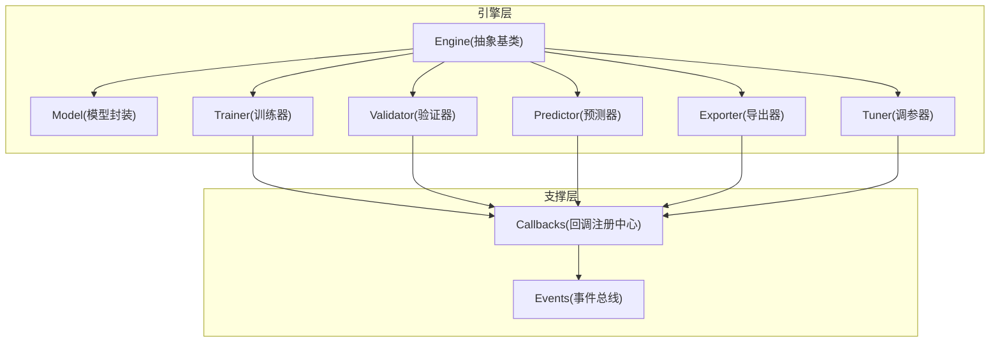
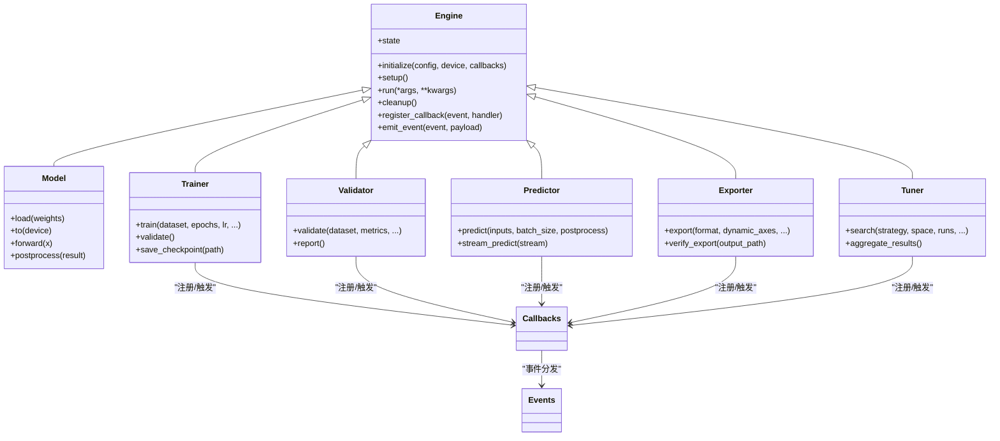
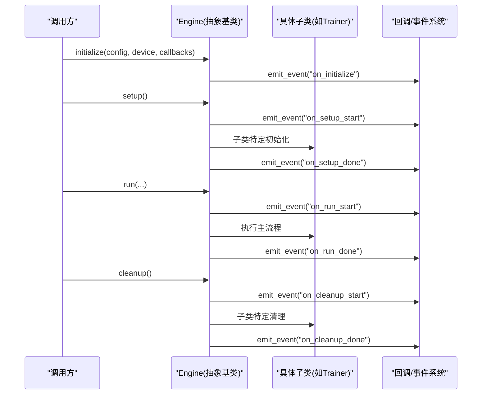
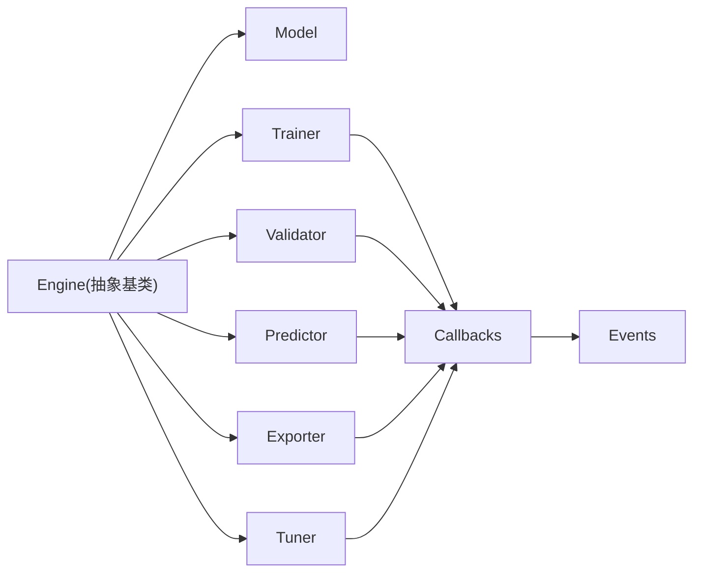

# Engine基类接口

<cite>
**本文引用的文件**
- [engine/__init__.py](file://ultralytics/engine/__init__.py)
- [engine/model.py](file://ultralytics/engine/model.py)
- [engine/trainer.py](file://ultralytics/engine/trainer.py)
- [engine/validator.py](file://ultralytics/engine/validator.py)
- [engine/predictor.py](file://ultralytics/engine/predictor.py)
- [engine/exporter.py](file://ultralytics/engine/exporter.py)
- [engine/tuner.py](file://ultralytics/engine/tuner.py)
- [utils/callbacks/__init__.py](file://ultralytics/utils/callbacks/__init__.py)
- [utils/events.py](file://ultralytics/utils/events.py)
- [tests/test_engine.py](file://tests/test_engine.py)
</cite>

## 目录
1. [简介](#简介)
2. [项目结构](#项目结构)
3. [核心组件](#核心组件)
4. [架构总览](#架构总览)
5. [详细组件分析](#详细组件分析)
6. [依赖关系分析](#依赖关系分析)
7. [性能考量](#性能考量)
8. [故障排查指南](#故障排查指南)
9. [结论](#结论)
10. [附录](#附录)

## 简介
本文件为YOLO-Master中Engine抽象基类的权威API文档，聚焦于：
- 设计模式与抽象接口定义（初始化参数、配置管理、状态管理）
- 生命周期方法（如setup()、cleanup()等）的调用时机与扩展点
- 回调机制与事件处理系统的注册与使用方式
- 自定义Engine子类的开发指南（必须实现与可选重写的方法）
- 错误处理与异常管理的最佳实践
- 如何扩展Engine以支持新的任务类型与算法实现

## 项目结构
Engine相关代码位于ultralytics/engine包内，包含模型封装、训练器、验证器、预测器、导出器与调参器等。关键入口与职责如下：
- engine/__init__.py：对外暴露Engine抽象基类及常用子类
- engine/model.py：模型封装与统一推理入口
- engine/trainer.py：训练流程编排与生命周期钩子
- engine/validator.py：验证流程编排与指标收集
- engine/predictor.py：推理流程编排与批处理
- engine/exporter.py：模型导出流程编排
- engine/tuner.py：超参搜索与优化流程编排
- utils/callbacks/__init__.py：回调注册中心
- utils/events.py：事件总线与事件分发

图表来源
- [engine/__init__.py](file://ultralytics/engine/__init__.py)
- [engine/model.py](file://ultralytics/engine/model.py)
- [engine/trainer.py](file://ultralytics/engine/trainer.py)
- [engine/validator.py](file://ultralytics/engine/validator.py)
- [engine/predictor.py](file://ultralytics/engine/predictor.py)
- [engine/exporter.py](file://ultralytics/engine/exporter.py)
- [engine/tuner.py](file://ultralytics/engine/tuner.py)
- [utils/callbacks/__init__.py](file://ultralytics/utils/callbacks/__init__.py)
- [utils/events.py](file://ultralytics/utils/events.py)

章节来源
- [engine/__init__.py](file://ultralytics/engine/__init__.py)
- [engine/model.py](file://ultralytics/engine/model.py)
- [engine/trainer.py](file://ultralytics/engine/trainer.py)
- [engine/validator.py](file://ultralytics/engine/validator.py)
- [engine/predictor.py](file://ultralytics/engine/predictor.py)
- [engine/exporter.py](file://ultralytics/engine/exporter.py)
- [engine/tuner.py](file://ultralytics/engine/tuner.py)
- [utils/callbacks/__init__.py](file://ultralytics/utils/callbacks/__init__.py)
- [utils/events.py](file://ultralytics/utils/events.py)

## 核心组件
本节概述Engine抽象基类及其主要子类的职责边界与协作关系。

- Engine抽象基类
  - 提供统一的初始化参数解析、配置加载与校验、设备与后端选择、日志与进度条、回调与事件系统接入、资源清理等通用能力
  - 定义生命周期钩子（如setup、run、cleanup），供具体任务子类覆盖
  - 维护内部状态机（未初始化、已准备、运行中、已完成、已清理等），确保可重入与幂等性

- Model（模型封装）
  - 负责模型权重加载、设备迁移、前向计算封装、结果后处理
  - 与Engine解耦，通过统一接口被Trainer/Validator/Predictor/Exporter/Tuner复用

- Trainer（训练器）
  - 编排数据加载、优化器、损失、评估、检查点保存、分布式训练等
  - 在epoch/batch级触发回调与事件

- Validator（验证器）
  - 编排验证集遍历、指标计算、可视化输出、结果汇总
  - 在step/epoch级触发回调与事件

- Predictor（预测器）
  - 编排输入预处理、批量推理、NMS/后处理、结果序列化
  - 支持流式与批处理两种模式

- Exporter（导出器）
  - 编排模型导出到多种格式（ONNX/TensorRT/OpenVINO等）
  - 执行导出前检查、动态轴设置、导出后验证

- Tuner（调参器）
  - 编排超参搜索策略、并行/串行执行、结果聚合与报告生成

章节来源
- [engine/model.py](file://ultralytics/engine/model.py)
- [engine/trainer.py](file://ultralytics/engine/trainer.py)
- [engine/validator.py](file://ultralytics/engine/validator.py)
- [engine/predictor.py](file://ultralytics/engine/predictor.py)
- [engine/exporter.py](file://ultralytics/engine/exporter.py)
- [engine/tuner.py](file://ultralytics/engine/tuner.py)

## 架构总览
下图展示Engine抽象基类与其子类的继承关系以及它们对回调与事件系统的依赖。

图表来源
- [engine/__init__.py](file://ultralytics/engine/__init__.py)
- [engine/model.py](file://ultralytics/engine/model.py)
- [engine/trainer.py](file://ultralytics/engine/trainer.py)
- [engine/validator.py](file://ultralytics/engine/validator.py)
- [engine/predictor.py](file://ultralytics/engine/predictor.py)
- [engine/exporter.py](file://ultralytics/engine/exporter.py)
- [engine/tuner.py](file://ultralytics/engine/tuner.py)
- [utils/callbacks/__init__.py](file://ultralytics/utils/callbacks/__init__.py)
- [utils/events.py](file://ultralytics/utils/events.py)

## 详细组件分析

### Engine抽象基类API
- 初始化参数
  - config：配置对象或路径，用于加载默认配置并合并用户覆盖项
  - device：目标设备（CPU/GPU/多卡），由自动设备选择逻辑决定
  - callbacks：回调字典或列表，按事件名映射处理器
  - logger：日志记录器实例，支持控制台/文件/远程上报
  - progress：进度条/可视化工具实例
- 配置管理
  - 提供配置合并、校验、默认值填充、版本兼容性检查
  - 支持运行时覆盖部分配置键
- 状态管理
  - 内部状态机：未初始化→已准备→运行中→已完成→已清理
  - 提供状态查询与转换方法，保证幂等与可重入
- 生命周期方法
  - setup()：完成资源分配、模型加载、设备迁移、缓存预热、回调注册
  - run()：执行主流程（训练/验证/预测/导出/调参），由子类实现具体编排
  - cleanup()：释放显存、关闭文件句柄、清理临时目录、重置状态
- 回调与事件
  - register_callback(event, handler)：注册事件处理器
  - emit_event(event, payload)：分发事件，支持同步/异步处理器
  - 内置事件包括：on_setup_start、on_setup_done、on_run_start、on_step、on_epoch、on_cleanup_start、on_cleanup_done等

章节来源
- [engine/__init__.py](file://ultralytics/engine/__init__.py)
- [utils/callbacks/__init__.py](file://ultralytics/utils/callbacks/__init__.py)
- [utils/events.py](file://ultralytics/utils/events.py)

### 生命周期方法详解
- setup()
  - 作用：初始化阶段，加载配置、创建/恢复状态、准备IO与设备、注册回调
  - 典型顺序：校验配置→选择设备→加载模型→构建数据管道→注册回调→预热缓存
  - 幂等性：重复调用应安全，避免重复分配资源
- run()
  - 作用：执行具体任务的主循环，由子类实现
  - 建议：在run前后分别emit on_run_start/on_run_done事件，便于监控与统计
- cleanup()
  - 作用：资源回收与状态复位
  - 典型操作：删除临时文件、释放GPU内存、关闭网络/磁盘连接、重置状态机

图表来源
- [engine/__init__.py](file://ultralytics/engine/__init__.py)
- [engine/trainer.py](file://ultralytics/engine/trainer.py)
- [utils/callbacks/__init__.py](file://ultralytics/utils/callbacks/__init__.py)
- [utils/events.py](file://ultralytics/utils/events.py)

### 回调机制与事件处理系统
- 回调注册中心
  - 提供按事件名注册/注销处理器、批量注册、优先级控制
  - 支持同步与异步处理器，允许抛出异常并由调度器捕获
- 事件总线
  - 提供事件发布/订阅、过滤与路由、重试与超时控制
  - 内置事件命名规范：on_<phase>_<event>，payload为结构化字典
- 使用建议
  - 将I/O、日志、监控、可视化等横切关注点放入回调
  - 避免在回调中进行耗时计算，必要时异步化
  - 保持回调幂等，防止重复触发导致副作用

章节来源
- [utils/callbacks/__init__.py](file://ultralytics/utils/callbacks/__init__.py)
- [utils/events.py](file://ultralytics/utils/events.py)

### 自定义Engine子类开发指南
- 必须实现的抽象方法
  - run()：实现具体任务的编排逻辑
  - 若涉及数据/模型/导出等复杂流程，建议拆分私有方法并在run中组合
- 可选重写的方法
  - setup()：自定义初始化流程（如特殊设备准备、外部服务连接）
  - cleanup()：自定义清理流程（如上传中间结果、清理远端资源）
  - _build_dataset()/_build_model()/_build_optimizer()：按需覆盖构建逻辑
  - _step()/_epoch_loop()：细粒度控制训练/验证步级行为
- 推荐实践
  - 在run前后emit on_run_start/on_run_done事件
  - 在关键节点emit on_step/on_epoch事件，便于监控
  - 使用状态机保护关键段，避免并发访问冲突
  - 所有外部资源获取/释放成对出现，确保cleanup能正确回收

章节来源
- [engine/trainer.py](file://ultralytics/engine/trainer.py)
- [engine/validator.py](file://ultralytics/engine/validator.py)
- [engine/predictor.py](file://ultralytics/engine/predictor.py)
- [engine/exporter.py](file://ultralytics/engine/exporter.py)
- [engine/tuner.py](file://ultralytics/engine/tuner.py)

### 错误处理与异常管理最佳实践
- 异常分类
  - 配置错误：参数缺失/类型不匹配/版本不兼容
  - 资源错误：设备不可用/显存不足/磁盘空间不足
  - 数据错误：数据集损坏/标签格式不一致
  - 运行时错误：梯度爆炸/NAN/除零/索引越界
- 处理策略
  - 在initialize/setup阶段进行严格校验，尽早失败
  - 在run主循环捕获可恢复异常，记录上下文并继续或优雅退出
  - 在cleanup中确保资源释放，即使发生异常也要执行
  - 使用事件系统上报错误事件，便于集中监控与告警
- 调试建议
  - 启用详细日志与堆栈跟踪
  - 在关键步骤写入检查点与中间结果，便于断点复现
  - 使用测试用例覆盖常见错误路径

章节来源
- [tests/test_engine.py](file://tests/test_engine.py)

### 扩展Engine以支持新任务类型与算法
- 新增任务类型
  - 新建子类继承Engine，实现run()与必要的构建方法
  - 在initialize中注册该任务类型的配置键与默认值
  - 在事件系统中定义新的事件名称，并在合适位置emit
- 集成新算法
  - 将算法核心封装为独立模块，通过回调或插件机制注入
  - 在setup中根据配置选择算法实现，保持run逻辑稳定
  - 提供导出/验证/调参适配，确保全链路可用

章节来源
- [engine/__init__.py](file://ultralytics/engine/__init__.py)
- [utils/callbacks/__init__.py](file://ultralytics/utils/callbacks/__init__.py)
- [utils/events.py](file://ultralytics/utils/events.py)

## 依赖关系分析
Engine与各子类的依赖关系如下：
- Engine作为抽象基类，被Model/Trainer/Validator/Predictor/Exporter/Tuner继承
- 各子类通过回调注册中心与事件总线进行横切功能扩展
- 配置与设备选择由Engine统一管理，降低子类耦合度

图表来源
- [engine/__init__.py](file://ultralytics/engine/__init__.py)
- [engine/model.py](file://ultralytics/engine/model.py)
- [engine/trainer.py](file://ultralytics/engine/trainer.py)
- [engine/validator.py](file://ultralytics/engine/validator.py)
- [engine/predictor.py](file://ultralytics/engine/predictor.py)
- [engine/exporter.py](file://ultralytics/engine/exporter.py)
- [engine/tuner.py](file://ultralytics/engine/tuner.py)
- [utils/callbacks/__init__.py](file://ultralytics/utils/callbacks/__init__.py)
- [utils/events.py](file://ultralytics/utils/events.py)

章节来源
- [engine/__init__.py](file://ultralytics/engine/__init__.py)
- [utils/callbacks/__init__.py](file://ultralytics/utils/callbacks/__init__.py)
- [utils/events.py](file://ultralytics/utils/events.py)

## 性能考量
- 设备与内存
  - 合理设置batch size与预取线程数，避免显存碎片
  - 在setup中预热模型与数据管道，减少首次延迟
- I/O与存储
  - 使用持久化缓存与增量更新，避免重复下载/解压
  - 在cleanup中及时释放临时文件，避免磁盘膨胀
- 事件与回调
  - 避免在回调中执行阻塞I/O，必要时异步化
  - 对高频事件（如on_step）进行采样或节流
- 分布式与并行
  - 在Trainer中合理使用DDP/FSDP，注意梯度同步与通信开销
  - 在Tuner中控制并行度，避免资源争用

[本节为通用指导，无需列出具体文件来源]

## 故障排查指南
- 常见问题
  - 配置加载失败：检查配置文件路径、键名与类型
  - 设备不可用：确认CUDA驱动、PyTorch后端与权限
  - 显存不足：减小batch size、启用混合精度或梯度累积
  - 数据损坏：校验数据集完整性与标签格式
- 定位手段
  - 启用详细日志，查看事件序列与堆栈信息
  - 在关键步骤写入检查点，断点复现问题
  - 使用最小可复现实例隔离问题范围
- 恢复策略
  - 从最近检查点恢复训练/验证
  - 回滚配置变更，逐步引入新特性
  - 降级到CPU或单卡模式进行诊断

章节来源
- [tests/test_engine.py](file://tests/test_engine.py)

## 结论
Engine抽象基类为YOLO-Master提供了统一的初始化、配置、状态、生命周期与扩展点。通过清晰的职责划分与事件/回调机制，开发者可以便捷地扩展新任务与算法，同时保持系统稳定性与可观测性。遵循本文档的最佳实践，可有效提升开发效率与系统可靠性。

[本节为总结性内容，无需列出具体文件来源]

## 附录
- 术语表
  - 回调：在特定事件发生时执行的函数或方法
  - 事件：系统状态变化或关键步骤的通知消息
  - 生命周期：对象从创建到销毁的关键阶段
- 参考实现
  - Trainer/Validator/Predictor/Exporter/Tuner的具体实现可作为扩展参考

[本节为补充信息，无需列出具体文件来源]