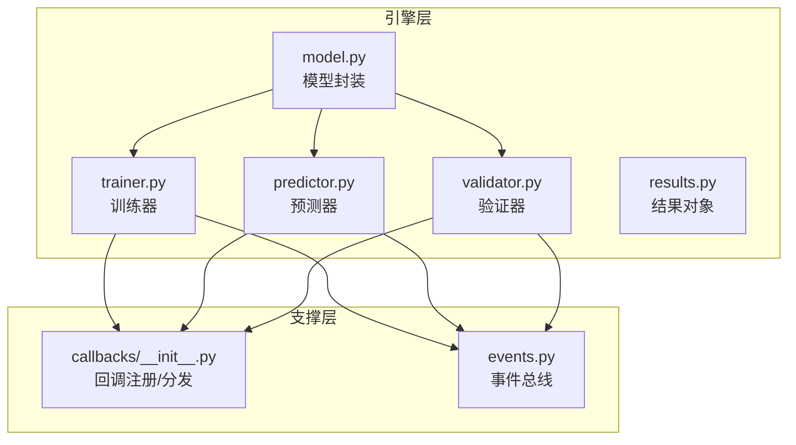
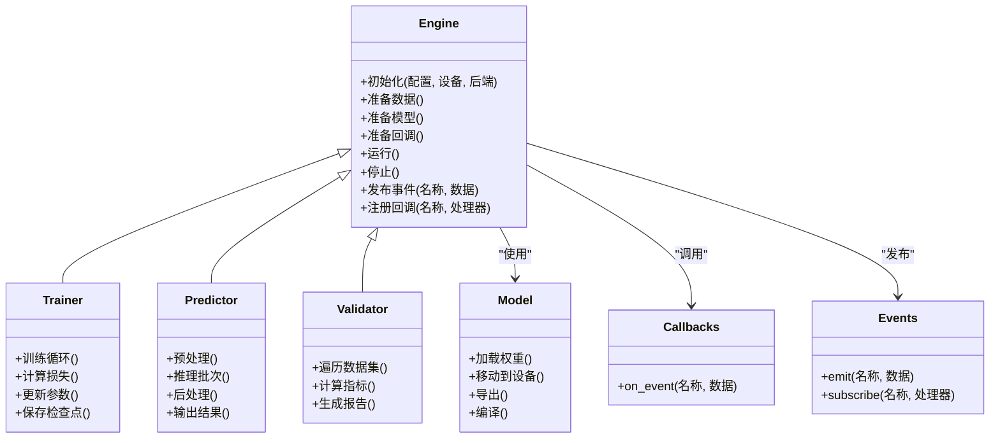
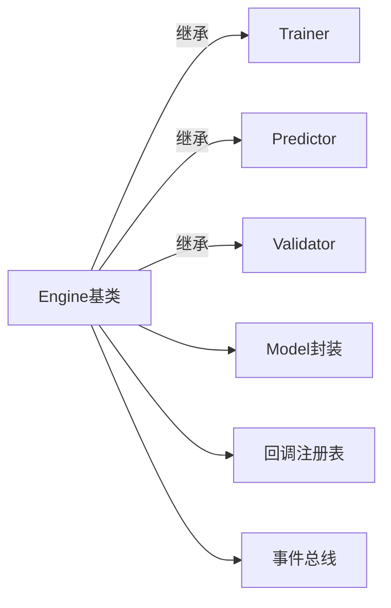
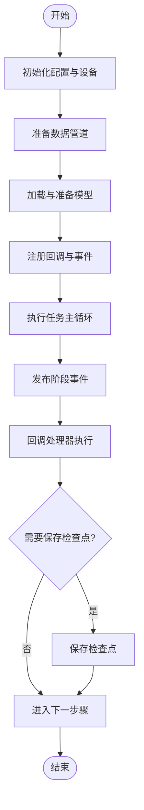

# Engine引擎基类API

<cite>
**本文引用的文件**
- [engine/__init__.py](file://ultralytics/engine/__init__.py)
- [engine/model.py](file://ultralytics/engine/model.py)
- [engine/trainer.py](file://ultralytics/engine/trainer.py)
- [engine/predictor.py](file://ultralytics/engine/predictor.py)
- [engine/validator.py](file://ultralytics/engine/validator.py)
- [engine/results.py](file://ultralytics/engine/results.py)
- [utils/callbacks/__init__.py](file://ultralytics/utils/callbacks/__init__.py)
- [utils/events.py](file://ultralytics/utils/events.py)
</cite>

## 目录
1. [简介](#简介)
2. [项目结构](#项目结构)
3. [核心组件](#核心组件)
4. [架构总览](#架构总览)
5. [详细组件分析](#详细组件分析)
6. [依赖关系分析](#依赖关系分析)
7. [性能与资源管理](#性能与资源管理)
8. [故障排查指南](#故障排查指南)
9. [结论](#结论)
10. [附录：扩展Engine的自定义开发指南](#附录扩展engine的自定义开发指南)

## 简介
本文件为YOLO-Master中Engine基类系统的API文档，聚焦于Engine抽象基类的设计模式、核心接口定义，以及Trainer、Predictor、Validator三个主要子类的职责分工。文档同时覆盖Engine生命周期管理（初始化、启动、停止）、回调机制与事件处理系统、性能监控与资源管理接口，并提供扩展Engine以支持新任务类型的实践指南。

## 项目结构
Engine相关代码位于ultralytics/engine目录下，包含模型封装、训练器、预测器、验证器、结果对象等关键模块；回调与事件系统位于ultralytics/utils下。

图表来源
- [engine/model.py:1-200](file://ultralytics/engine/model.py#L1-L200)
- [engine/trainer.py:1-200](file://ultralytics/engine/trainer.py#L1-L200)
- [engine/predictor.py:1-200](file://ultralytics/engine/predictor.py#L1-L200)
- [engine/validator.py:1-200](file://ultralytics/engine/validator.py#L1-L200)
- [engine/results.py:1-200](file://ultralytics/engine/results.py#L1-L200)
- [utils/callbacks/__init__.py:1-200](file://ultralytics/utils/callbacks/__init__.py#L1-L200)
- [utils/events.py:1-200](file://ultralytics/utils/events.py#L1-L200)

章节来源
- [engine/__init__.py:1-200](file://ultralytics/engine/__init__.py#L1-L200)
- [engine/model.py:1-200](file://ultralytics/engine/model.py#L1-L200)
- [engine/trainer.py:1-200](file://ultralytics/engine/trainer.py#L1-L200)
- [engine/predictor.py:1-200](file://ultralytics/engine/predictor.py#L1-L200)
- [engine/validator.py:1-200](file://ultralytics/engine/validator.py#L1-L200)
- [engine/results.py:1-200](file://ultralytics/engine/results.py#L1-L200)
- [utils/callbacks/__init__.py:1-200](file://ultralytics/utils/callbacks/__init__.py#L1-L200)
- [utils/events.py:1-200](file://ultralytics/utils/events.py#L1-L200)

## 核心组件
- Engine抽象基类：提供统一的初始化、配置解析、设备与后端选择、数据加载、日志与回调挂载、事件发布、进度条与检查点保存等通用能力。子类通过重写特定钩子方法实现具体任务逻辑。
- Trainer：负责训练流程编排，包括优化器与调度器设置、损失计算、梯度累积、EMA、分布式训练控制、指标统计与权重保存。
- Predictor：负责推理流程编排，包括输入预处理、批处理、NMS/后处理、可视化与结果序列化。
- Validator：负责评估流程编排，包括数据集遍历、指标计算、混淆矩阵/PR曲线生成、结果汇总与报告输出。
- Model封装：统一模型加载、导出、编译、设备迁移、参数冻结/解冻、混合精度与自动后端选择。
- Results：标准化推理/验证结果数据结构，便于可视化、序列化与下游消费。
- 回调与事件：基于事件总线与回调注册表，在关键阶段触发用户可插拔逻辑（如记录日志、保存中间结果、断点续训、监控告警）。

章节来源
- [engine/model.py:1-200](file://ultralytics/engine/model.py#L1-L200)
- [engine/trainer.py:1-200](file://ultralytics/engine/trainer.py#L1-L200)
- [engine/predictor.py:1-200](file://ultralytics/engine/predictor.py#L1-L200)
- [engine/validator.py:1-200](file://ultralytics/engine/validator.py#L1-L200)
- [engine/results.py:1-200](file://ultralytics/engine/results.py#L1-L200)
- [utils/callbacks/__init__.py:1-200](file://ultralytics/utils/callbacks/__init__.py#L1-L200)
- [utils/events.py:1-200](file://ultralytics/utils/events.py#L1-L200)

## 架构总览
Engine采用“模板方法+事件驱动”的架构：基类定义生命周期骨架，子类填充任务细节；在关键节点通过事件总线广播状态变化，回调订阅者执行横切关注点（日志、监控、存储等）。

图表来源
- [engine/model.py:1-200](file://ultralytics/engine/model.py#L1-L200)
- [engine/trainer.py:1-200](file://ultralytics/engine/trainer.py#L1-L200)
- [engine/predictor.py:1-200](file://ultralytics/engine/predictor.py#L1-L200)
- [engine/validator.py:1-200](file://ultralytics/engine/validator.py#L1-L200)
- [utils/callbacks/__init__.py:1-200](file://ultralytics/utils/callbacks/__init__.py#L1-L200)
- [utils/events.py:1-200](file://ultralytics/utils/events.py#L1-L200)

## 详细组件分析

### Engine抽象基类
- 设计模式
  - 模板方法：定义run生命周期，将“准备数据/模型/回调”和“任务主循环”拆分为可覆写钩子。
  - 策略模式：设备与后端选择、数据加载策略、结果序列化策略可通过配置注入。
  - 观察者模式：事件总线与回调注册表解耦横切逻辑。
- 核心接口
  - 初始化：接收配置、设备、后端、工作目录、日志与回调等参数。
  - 生命周期：prepare_data、prepare_model、prepare_callbacks、run、stop。
  - 事件与回调：publish_event、register_callback。
  - 资源管理：设备切换、显存清理、进程/线程池释放。
- 错误处理
  - 对数据加载失败、模型加载异常、设备不可用等情况进行捕获并抛出结构化错误，附带上下文信息。
- 性能特性
  - 批大小自适应、自动混合精度、缓存与预取、异步I/O可选开关。

章节来源
- [engine/model.py:1-200](file://ultralytics/engine/model.py#L1-L200)
- [utils/callbacks/__init__.py:1-200](file://ultralytics/utils/callbacks/__init__.py#L1-L200)
- [utils/events.py:1-200](file://ultralytics/utils/events.py#L1-L200)

### Trainer训练器
- 职责
  - 构建优化器与学习率调度器，执行训练循环，计算损失，反向传播，EMA维护，检查点保存，指标统计与日志。
- 关键钩子
  - on_epoch_start/on_epoch_end、on_batch_start/on_batch_end、on_save_checkpoint、on_log_metrics等。
- 分布式与容错
  - 支持DDP/多进程，断点续训，NaN/Inf检测与恢复策略。
- 性能
  - 梯度累积、动态批大小、AMP、数据预取与锁步同步。

章节来源
- [engine/trainer.py:1-200](file://ultralytics/engine/trainer.py#L1-L200)

### Predictor预测器
- 职责
  - 输入预处理、批量推理、NMS/后处理、可视化、结果序列化与流式推理支持。
- 关键钩子
  - on_preprocess、on_infer_batch、on_postprocess、on_save_result。
- 性能
  - 批内并行、内存复用、GPU/CPU自动选择、ONNX/TensorRT后端可选。

章节来源
- [engine/predictor.py:1-200](file://ultralytics/engine/predictor.py#L1-L200)

### Validator验证器
- 职责
  - 遍历验证集，计算mAP/F1/AUC等指标，生成混淆矩阵与PR曲线，汇总报告。
- 关键钩子
  - on_val_start、on_val_batch、on_val_end、on_save_report。
- 性能
  - 多线程数据加载、指标增量计算、结果缓存。

章节来源
- [engine/validator.py:1-200](file://ultralytics/engine/validator.py#L1-L200)

### Model封装
- 职责
  - 统一模型加载、权重恢复、设备迁移、导出与编译、参数冻结/解冻、混合精度与自动后端选择。
- 关键接口
  - load、to_device、export、compile、freeze/unfreeze、half/bfloat16切换。

章节来源
- [engine/model.py:1-200](file://ultralytics/engine/model.py#L1-L200)

### 结果对象Results
- 职责
  - 标准化推理/验证结果的数据结构，提供索引、切片、过滤、可视化与序列化接口。
- 关键接口
  - boxes/masks/keypoints等字段访问、置信度阈值过滤、类别映射、导出JSON/Numpy。

章节来源
- [engine/results.py:1-200](file://ultralytics/engine/results.py#L1-L200)

### 回调与事件系统
- 事件总线
  - 提供事件发布/订阅、命名空间隔离、优先级与去重。
- 回调注册表
  - 按事件名绑定处理器，支持一次性与持久订阅，异常隔离与超时保护。
- 典型事件
  - engine.start、engine.stop、epoch.begin/end、batch.begin/end、metrics.log、checkpoint.save等。

章节来源
- [utils/callbacks/__init__.py:1-200](file://ultralytics/utils/callbacks/__init__.py#L1-L200)
- [utils/events.py:1-200](file://ultralytics/utils/events.py#L1-L200)

## 依赖关系分析
- 低耦合高内聚：Engine基类仅依赖抽象接口与事件/回调协议，具体任务逻辑由子类实现。
- 外部依赖
  - 设备与后端：自动选择CPU/GPU/专用加速器。
  - 数据加载：多线程/多进程、缓存与预取。
  - 分布式：DDP通信与同步。
- 潜在循环依赖
  - 通过事件与回调解耦，避免直接强引用导致的循环依赖。

图表来源
- [engine/model.py:1-200](file://ultralytics/engine/model.py#L1-L200)
- [engine/trainer.py:1-200](file://ultralytics/engine/trainer.py#L1-L200)
- [engine/predictor.py:1-200](file://ultralytics/engine/predictor.py#L1-L200)
- [engine/validator.py:1-200](file://ultralytics/engine/validator.py#L1-L200)
- [utils/callbacks/__init__.py:1-200](file://ultralytics/utils/callbacks/__init__.py#L1-L200)
- [utils/events.py:1-200](file://ultralytics/utils/events.py#L1-L200)

## 性能与资源管理
- 批处理与吞吐
  - 动态批大小、内存复用、零拷贝传输、流水线并行。
- 精度与加速
  - AMP/bfloat16、算子融合、图编译（ONNX/TensorRT）可选。
- I/O与数据
  - 预取、缓存、异步读取、磁盘/网络IO优化。
- 资源回收
  - 显存清理、句柄关闭、进程池退出、临时文件清理。
- 监控
  - 通过回调上报GPU利用率、显存峰值、I/O吞吐、延迟分布。

[本节为通用指导，不直接分析具体文件]

## 故障排查指南
- 常见问题
  - 设备不可用或显存不足：检查设备选择与批大小，启用AMP与内存复用。
  - 数据加载瓶颈：开启预取与多线程，减少解码开销。
  - 分布式同步异常：确认DDP初始化与通信后端，检查NCCL环境变量。
  - 回调异常中断：确保回调函数异常隔离，避免阻塞主流程。
- 定位手段
  - 启用详细日志与事件追踪，查看事件时间线与回调耗时。
  - 使用检查点恢复，缩小问题范围。
  - 最小化复现：剥离非必要回调与数据增强。

章节来源
- [utils/callbacks/__init__.py:1-200](file://ultralytics/utils/callbacks/__init__.py#L1-L200)
- [utils/events.py:1-200](file://ultralytics/utils/events.py#L1-L200)

## 结论
Engine基类通过模板方法与事件驱动，提供了稳定可扩展的训练/推理/验证框架。Trainer、Predictor、Validator各司其职，配合Model封装与Results标准化，形成高内聚、低耦合的系统。借助回调与事件，用户可灵活扩展监控、日志、存储与诊断能力，满足多样化任务需求。

[本节为总结性内容，不直接分析具体文件]

## 附录：扩展Engine的自定义开发指南
- 目标
  - 新增任务类型（如分割、姿态估计、跟踪）时，快速集成到Engine体系。
- 步骤
  - 继承Engine基类，实现必要钩子：prepare_data、prepare_model、run主体循环。
  - 在run中合理划分阶段，并在每个阶段发布事件，供回调订阅。
  - 使用Model封装进行模型加载、设备迁移与导出。
  - 使用Results标准化输出，确保可视化与序列化一致。
  - 注册自定义回调，实现指标上报、中间结果保存、告警等。
- 最佳实践
  - 保持回调无副作用与幂等，避免长耗时操作。
  - 使用事件命名空间区分不同任务域。
  - 对异常进行结构化包装，保留上下文以便定位。
  - 对大对象进行按需加载与及时释放，降低峰值内存。
- 示例流程图（概念）

[本节为概念性说明，不直接分析具体文件]