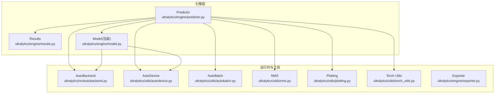
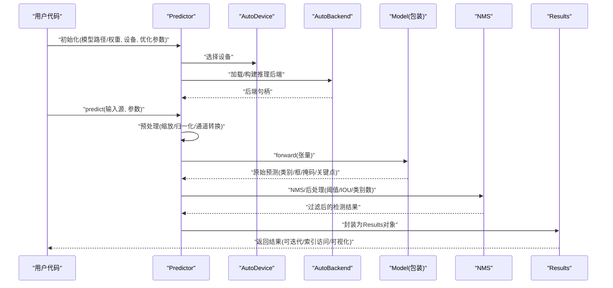
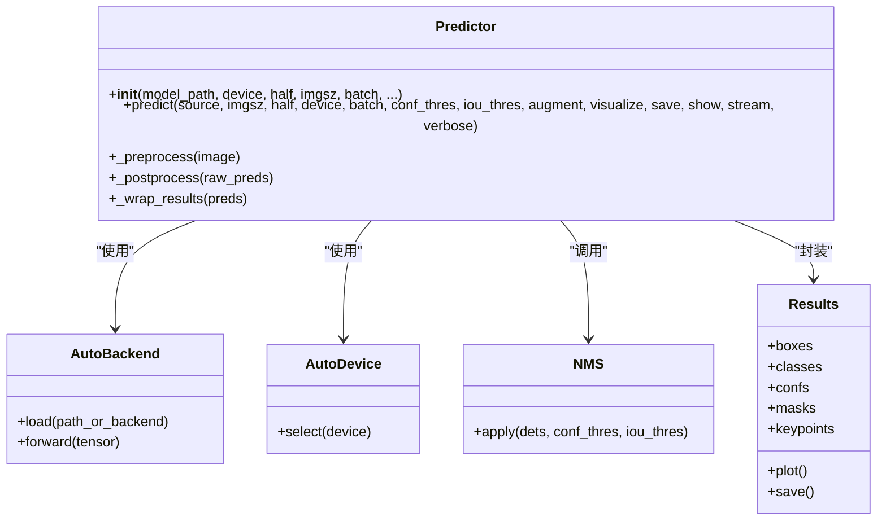
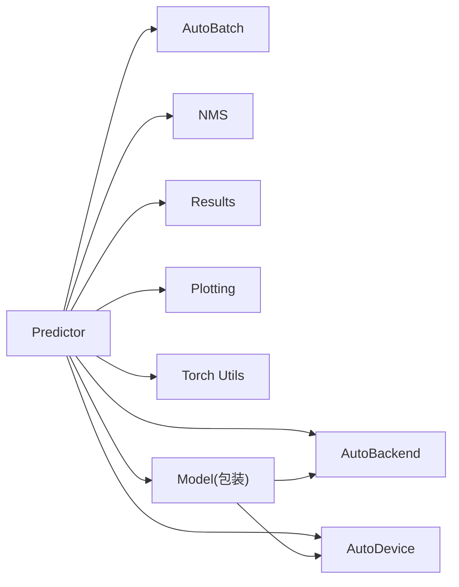

# Predictor推理器API

<cite>
**本文引用的文件**
- [predictor.py](file://ultralytics/engine/predictor.py)
- [results.py](file://ultralytics/engine/results.py)
- [model.py](file://ultralytics/engine/model.py)
- [autobackend.py](file://ultralytics/nn/autobackend.py)
- [autobatch.py](file://ultralytics/utils/autobatch.py)
- [autodevice.py](file://ultralytics/utils/autodevice.py)
- [exporter.py](file://ultralytics/engine/exporter.py)
- [torch_utils.py](file://ultralytics/utils/torch_utils.py)
- [nms.py](file://ultralytics/utils/nms.py)
- [plotting.py](file://ultralytics/utils/plotting.py)
</cite>

## 目录
1. [简介](#简介)
2. [项目结构](#项目结构)
3. [核心组件](#核心组件)
4. [架构总览](#架构总览)
5. [详细组件分析](#详细组件分析)
6. [依赖关系分析](#依赖关系分析)
7. [性能考虑](#性能考虑)
8. [故障排查指南](#故障排查指南)
9. [结论](#结论)
10. [附录](#附录)

## 简介
本文件为 YOLO-Master 的 Predictor 推理器的 API 文档，聚焦于 Predictor 类的推理执行接口与使用方式。内容涵盖：
- predict() 方法的输入格式支持与输出结果处理
- 模型加载、预热与优化配置
- 批量推理与流式推理的实现接口
- 推理结果的封装格式与后处理选项
- 内存管理与资源优化配置
- 实时推理的性能调优技巧与最佳实践
- 自定义推理流程与预处理/后处理扩展方法

## 项目结构
Predictor 位于引擎层，负责将用户输入（图像、视频、摄像头等）转换为张量、执行推理并返回结构化结果。其关键依赖包括自动后端选择、设备管理、自动批大小、NMS 和后处理可视化等模块。

图表来源
- [predictor.py](file://ultralytics/engine/predictor.py)
- [results.py](file://ultralytics/engine/results.py)
- [model.py](file://ultralytics/engine/model.py)
- [autobackend.py](file://ultralytics/nn/autobackend.py)
- [autobatch.py](file://ultralytics/utils/autobatch.py)
- [autodevice.py](file://ultralytics/utils/autodedevice.py)
- [nms.py](file://ultralytics/utils/nms.py)
- [plotting.py](file://ultralytics/utils/plotting.py)
- [torch_utils.py](file://ultralytics/utils/torch_utils.py)
- [exporter.py](file://ultralytics/engine/exporter.py)

章节来源
- [predictor.py](file://ultralytics/engine/predictor.py)
- [results.py](file://ultralytics/engine/results.py)
- [model.py](file://ultralytics/engine/model.py)
- [autobackend.py](file://ultralytics/nn/autobackend.py)
- [autobatch.py](file://ultralytics/utils/autobatch.py)
- [autodevice.py](file://ultralytics/utils/autodedevice.py)
- [nms.py](file://ultralytics/utils/nms.py)
- [plotting.py](file://ultralytics/utils/plotting.py)
- [torch_utils.py](file://ultralytics/utils/torch_utils.py)
- [exporter.py](file://ultralytics/engine/exporter.py)

## 核心组件
- Predictor：统一推理入口，负责数据加载、预处理、模型调用、后处理与结果封装。
- Results：推理结果的数据容器，提供统一的访问接口与可视化能力。
- AutoBackend：根据导出格式和设备自动选择最优推理后端（如 ONNXRuntime、TensorRT、OpenVINO、TorchScript 等）。
- AutoDevice：设备选择与切换（CPU/GPU/CUDA/MPS 等）。
- AutoBatch：动态批大小计算与调度，提升吞吐。
- NMS：非极大值抑制，过滤冗余框。
- Plotting：结果可视化辅助。
- Exporter：模型导出与优化（用于离线优化与部署）。

章节来源
- [predictor.py](file://ultralytics/engine/predictor.py)
- [results.py](file://ultralytics/engine/results.py)
- [autobackend.py](file://ultralytics/nn/autobackend.py)
- [autobatch.py](file://ultralytics/utils/autobatch.py)
- [autodevice.py](file://ultralytics/utils/autodedevice.py)
- [nms.py](file://ultralytics/utils/nms.py)
- [plotting.py](file://ultralytics/utils/plotting.py)
- [exporter.py](file://ultralytics/engine/exporter.py)

## 架构总览
下图展示了从用户调用到结果输出的端到端流程，以及各组件之间的交互关系。

图表来源
- [predictor.py](file://ultralytics/engine/predictor.py)
- [results.py](file://ultralytics/engine/results.py)
- [autobackend.py](file://ultralytics/nn/autobackend.py)
- [autodevice.py](file://ultralytics/utils/autodedevice.py)
- [nms.py](file://ultralytics/utils/nms.py)
- [model.py](file://ultralytics/engine/model.py)

## 详细组件分析

### Predictor 类与 predict() 接口
- 初始化与生命周期
  - 支持传入模型权重或已导出的推理后端文件；自动检测设备与后端。
  - 可配置是否启用半精度、固定输入尺寸、动态形状、线程并行等。
- predict() 输入格式
  - 单张图像：支持 PIL.Image、OpenCV 矩阵、numpy 数组、文件路径、URL。
  - 批量输入：列表/生成器形式的多张图像或路径。
  - 视频/摄像头：通过迭代帧实现流式推理。
  - 其他：支持字典/命名元组等结构化输入（若框架暴露相应 loader）。
- predict() 输出
  - 返回 Results 对象的迭代器或列表；每个元素对应一个输入样本。
  - Results 提供 box、class、conf、mask、keypoints 等属性访问与可视化方法。
- 关键参数（示例说明，具体以源码为准）
  - imgsz：输入尺寸或尺寸列表（支持动态形状）。
  - half：是否使用半精度推理。
  - device：指定运行设备。
  - batch：批大小；None 时由 AutoBatch 自动计算。
  - conf_thres / iou_thres：NMS 阈值。
  - augment：是否开启测试时增强（TTA）。
  - visualize：是否保存中间特征图用于调试。
  - save / show：是否保存/显示可视化结果。
  - stream：是否以流式模式返回结果。
  - verbose：日志级别。
- 典型用法要点
  - 单图/多图：直接传入图像或路径列表。
  - 视频/摄像头：逐帧调用 predict() 或在循环中迭代。
  - 批量：设置 batch > 1 或使用 DataLoader 风格的输入。

章节来源
- [predictor.py](file://ultralytics/engine/predictor.py)
- [results.py](file://ultralytics/engine/results.py)

#### 类与方法关系图

图表来源
- [predictor.py](file://ultralytics/engine/predictor.py)
- [results.py](file://ultralytics/engine/results.py)
- [autobackend.py](file://ultralytics/nn/autobackend.py)
- [autodevice.py](file://ultralytics/utils/autodedevice.py)
- [nms.py](file://ultralytics/utils/nms.py)

### 模型加载、预热与优化配置
- 模型加载
  - 支持 .pt/.onnx/.engine/.openvino/.tflite 等格式；AutoBackend 自动选择最优后端。
  - 可通过 exporter 提前导出为特定后端以获得更好性能。
- 预热（Warmup）
  - 首次推理通常较慢，建议进行若干次空跑预热以稳定延迟。
  - 可在初始化后调用一次 dummy predict 完成预热。
- 优化配置
  - half：启用半精度（需后端支持）。
  - imgsz：固定尺寸可减少动态形状开销；必要时使用动态形状列表。
  - device：优先 GPU/CUDA；在 Apple Silicon 上可使用 MPS。
  - export：使用 Exporter 生成优化版本（如 TensorRT、ONNXRuntime、OpenVINO）。

章节来源
- [autobackend.py](file://ultralytics/nn/autobackend.py)
- [exporter.py](file://ultralytics/engine/exporter.py)
- [torch_utils.py](file://ultralytics/utils/torch_utils.py)

### 批量推理与流式推理
- 批量推理
  - 设置 batch > 1 或将多张图像打包为列表/生成器传入。
  - AutoBatch 可根据显存/内存自动调整批大小。
- 流式推理
  - 对视频/摄像头逐帧调用 predict()，或使用 stream=True 获取迭代器。
  - 适合低延迟场景，注意控制预处理/后处理耗时。

章节来源
- [autobatch.py](file://ultralytics/utils/autobatch.py)
- [predictor.py](file://ultralytics/engine/predictor.py)

### 推理结果封装与后处理
- 结果封装
  - Results 对象包含 boxes、classes、confs、masks、keypoints 等字段。
  - 提供 plot()/save()/show() 等便捷方法。
- 后处理选项
  - NMS 阈值 conf_thres/iou_thres。
  - 类别数量限制、置信度裁剪、掩码/关键点过滤。
  - 可选 TTA（测试时增强）以提升鲁棒性但增加延迟。

章节来源
- [results.py](file://ultralytics/engine/results.py)
- [nms.py](file://ultralytics/utils/nms.py)
- [predictor.py](file://ultralytics/engine/predictor.py)

### 内存管理与资源优化
- 设备与精度
  - 合理选择 device 与 half，避免不必要的跨设备拷贝。
- 批大小与输入尺寸
  - 使用 AutoBatch 自动选择；固定 imgsz 减少动态分配。
- 缓存与复用
  - 重用 Predictor 实例，避免重复加载模型。
  - 复用输入缓冲区（在流式场景中）。
- 清理与释放
  - 及时释放不再使用的张量与中间结果；必要时显式清空缓存。

章节来源
- [autobatch.py](file://ultralytics/utils/autobatch.py)
- [autodevice.py](file://ultralytics/utils/autodedevice.py)
- [torch_utils.py](file://ultralytics/utils/torch_utils.py)

### 实时推理性能调优与最佳实践
- 降低预处理/后处理开销：向量化操作、减少 Python 循环。
- 固定输入尺寸与批大小：减少动态形状带来的额外开销。
- 使用半精度与专用后端：如 TensorRT/OpenVINO/ONNXRuntime。
- 预热与预分配：启动阶段进行若干次 warmup。
- 流水线并行：预处理、推理、后处理异步化（生产者-消费者队列）。
- 监控与诊断：记录每帧耗时，定位瓶颈。

[本节为通用指导，不直接分析具体文件]

### 自定义推理流程与扩展点
- 自定义预处理
  - 在预处理阶段插入自定义变换（如 ROI 裁剪、颜色校正）。
- 自定义后处理
  - 替换 NMS 策略或添加业务规则（如区域计数、轨迹关联）。
- 自定义可视化
  - 基于 Results.plot() 扩展标注样式或叠加业务信息。
- 集成第三方后端
  - 通过 AutoBackend 适配新后端或自定义推理引擎。

章节来源
- [predictor.py](file://ultralytics/engine/predictor.py)
- [results.py](file://ultralytics/engine/results.py)
- [autobackend.py](file://ultralytics/nn/autobackend.py)
- [plotting.py](file://ultralytics/utils/plotting.py)

## 依赖关系分析
Predictor 与多个运行时与工具模块存在强耦合，确保高内聚与低耦合的关键在于清晰的接口契约与稳定的数据结构（Results）。

图表来源
- [predictor.py](file://ultralytics/engine/predictor.py)
- [results.py](file://ultralytics/engine/results.py)
- [autobackend.py](file://ultralytics/nn/autobackend.py)
- [autobatch.py](file://ultralytics/utils/autobatch.py)
- [autodevice.py](file://ultralytics/utils/autodedevice.py)
- [nms.py](file://ultralytics/utils/nms.py)
- [plotting.py](file://ultralytics/utils/plotting.py)
- [torch_utils.py](file://ultralytics/utils/torch_utils.py)
- [model.py](file://ultralytics/engine/model.py)

章节来源
- [predictor.py](file://ultralytics/engine/predictor.py)
- [results.py](file://ultralytics/engine/results.py)
- [autobackend.py](file://ultralytics/nn/autobackend.py)
- [autobatch.py](file://ultralytics/utils/autobatch.py)
- [autodevice.py](file://ultralytics/utils/autodedevice.py)
- [nms.py](file://ultralytics/utils/nms.py)
- [plotting.py](file://ultralytics/utils/plotting.py)
- [torch_utils.py](file://ultralytics/utils/torch_utils.py)
- [model.py](file://ultralytics/engine/model.py)

## 性能考虑
- 选择合适的后端与导出格式，优先使用硬件加速。
- 固定输入尺寸与批大小，减少动态分配与内核编译开销。
- 预热模型与预分配缓冲区，降低首帧延迟。
- 使用半精度与内存池，提高吞吐。
- 采用异步流水线与零拷贝策略，降低 CPU-GPU 同步成本。
- 监控指标：FPS、P95/P99 延迟、GPU 利用率、内存峰值。

[本节为通用指导，不直接分析具体文件]

## 故障排查指南
- 设备不可用或显存不足
  - 检查 device 选择与 half 配置；降低 batch 或 imgsz。
- 后端加载失败
  - 确认导出文件完整且与目标平台兼容；重新导出。
- 结果异常或漏检
  - 调整 conf_thres/iou_thres；检查预处理是否正确；尝试 TTA。
- 延迟抖动
  - 进行预热；固定输入尺寸；避免频繁创建/销毁 Predictor。
- 可视化问题
  - 检查图像维度与通道顺序；确认 Results 字段有效。

章节来源
- [autodevice.py](file://ultralytics/utils/autodedevice.py)
- [autobackend.py](file://ultralytics/nn/autobackend.py)
- [results.py](file://ultralytics/engine/results.py)
- [predictor.py](file://ultralytics/engine/predictor.py)

## 结论
Predictor 提供了统一、灵活且高性能的推理接口，结合 AutoBackend、AutoBatch、NMS 与 Results 等组件，能够覆盖从单图到视频流的多场景需求。通过合理的模型加载、预热与优化配置，可实现低延迟与高吞吐的实时推理。同时，预留的扩展点便于接入自定义预处理/后处理逻辑与第三方后端。

[本节为总结性内容，不直接分析具体文件]

## 附录
- 快速上手
  - 初始化 Predictor，传入模型路径与设备。
  - 调用 predict() 传入图像或路径列表。
  - 遍历 Results 对象获取检测结果并进行可视化或持久化。
- 参考路径
  - 初始化与 predict 主流程：[predictor.py](file://ultralytics/engine/predictor.py)
  - 结果结构与可视化：[results.py](file://ultralytics/engine/results.py)
  - 后端选择与加载：[autobackend.py](file://ultralytics/nn/autobackend.py)
  - 设备选择：[autodevice.py](file://ultralytics/utils/autodedevice.py)
  - 批大小自适应：[autobatch.py](file://ultralytics/utils/autobatch.py)
  - NMS 实现：[nms.py](file://ultralytics/utils/nms.py)
  - 可视化辅助：[plotting.py](file://ultralytics/utils/plotting.py)
  - 模型包装与调用：[model.py](file://ultralytics/engine/model.py)
  - 导出与优化：[exporter.py](file://ultralytics/engine/exporter.py)
  - 张量与工具函数：[torch_utils.py](file://ultralytics/utils/torch_utils.py)