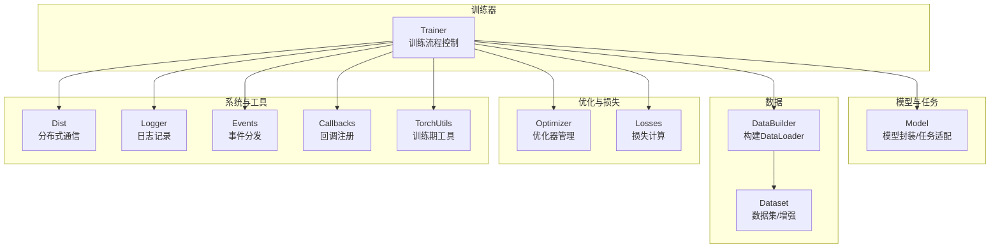
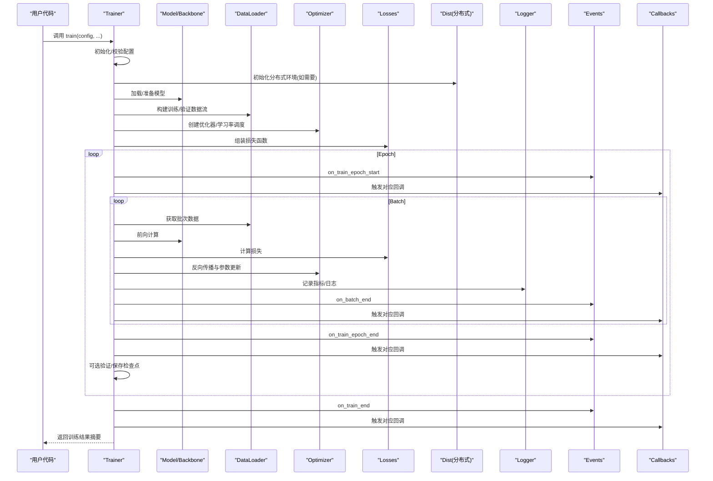
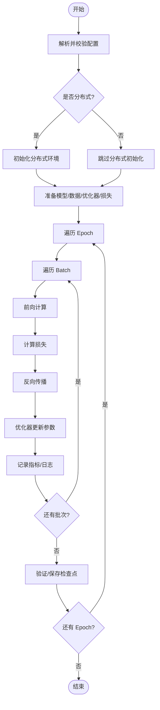
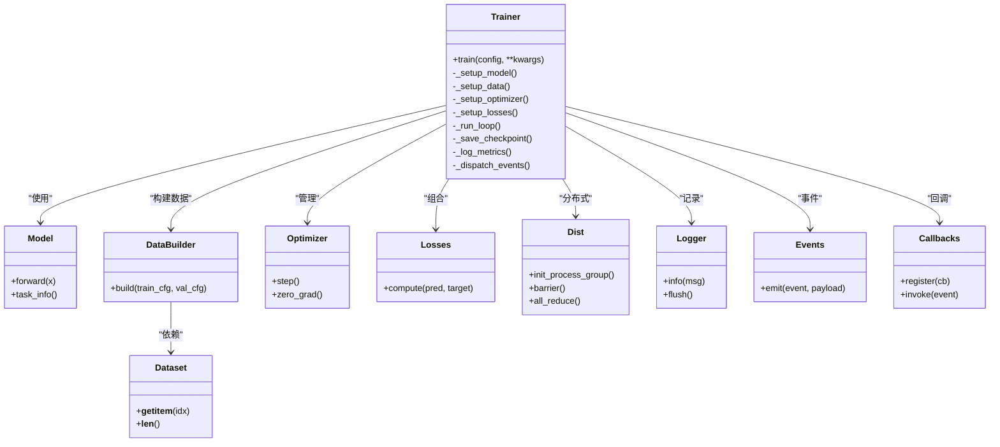

# Trainer训练器API

<cite>
**本文引用的文件**
- [trainer.py](file://ultralytics/engine/trainer.py)
- [model.py](file://ultralytics/engine/model.py)
- [build.py](file://ultralytics/data/build.py)
- [dataset.py](file://ultralytics/data/dataset.py)
- [loss.py](file://ultralytics/utils/loss.py)
- [dist.py](file://ultralytics/utils/dist.py)
- [logger.py](file://ultralytics/utils/logger.py)
- [events.py](file://ultralytics/utils/events.py)
- [callbacks/__init__.py](file://ultralytics/utils/callbacks/__init__.py)
- [torch_utils.py](file://ultralytics/utils/torch_utils.py)
</cite>

## 目录
1. [简介](#简介)
2. [项目结构](#项目结构)
3. [核心组件](#核心组件)
4. [架构总览](#架构总览)
5. [详细组件分析](#详细组件分析)
6. [依赖关系分析](#依赖关系分析)
7. [性能考量](#性能考量)
8. [故障排查指南](#故障排查指南)
9. [结论](#结论)
10. [附录](#附录)

## 简介
本文件为 YOLO-Master 的 Trainer 训练器 API 文档，聚焦于训练流程控制、配置对象、损失与优化、数据加载、分布式训练、监控日志与检查点保存、以及自定义训练流程与回调扩展。读者可通过本文快速掌握如何调用训练接口、如何配置训练参数、以及如何扩展和定制训练行为。

## 项目结构
Trainer 位于引擎层，负责编排模型、数据、优化器、损失、日志、检查点与分布式通信等子系统。其关键依赖包括：
- 模型封装与任务适配（engine/model）
- 数据构建与数据集（data/build, data/dataset）
- 损失函数与指标（utils/loss, utils/metrics）
- 分布式工具（utils/dist）
- 日志与事件系统（utils/logger, utils/events）
- 回调注册中心（utils/callbacks）
- 训练期常用工具（utils/torch_utils）

图表来源
- [trainer.py](file://ultralytics/engine/trainer.py)
- [model.py](file://ultralytics/engine/model.py)
- [build.py](file://ultralytics/data/build.py)
- [dataset.py](file://ultralytics/data/dataset.py)
- [loss.py](file://ultralytics/utils/loss.py)
- [dist.py](file://ultralytics/utils/dist.py)
- [logger.py](file://ultralytics/utils/logger.py)
- [events.py](file://ultralytics/utils/events.py)
- [callbacks/__init__.py](file://ultralytics/utils/callbacks/__init__.py)
- [torch_utils.py](file://ultralytics/utils/torch_utils.py)

章节来源
- [trainer.py](file://ultralytics/engine/trainer.py)
- [model.py](file://ultralytics/engine/model.py)
- [build.py](file://ultralytics/data/build.py)
- [dataset.py](file://ultralytics/data/dataset.py)
- [loss.py](file://ultralytics/utils/loss.py)
- [dist.py](file://ultralytics/utils/dist.py)
- [logger.py](file://ultralytics/utils/logger.py)
- [events.py](file://ultralytics/utils/events.py)
- [callbacks/__init__.py](file://ultralytics/utils/callbacks/__init__.py)
- [torch_utils.py](file://ultralytics/utils/torch_utils.py)

## 核心组件
- Trainer 类
  - 职责：训练生命周期管理、循环控制、进度条与日志、检查点保存、分布式协调、回调调度。
  - 入口方法：train()，用于启动一次完整的训练过程。
- TrainingConfig 配置对象
  - 职责：集中管理训练超参、路径、设备、分布式、日志与检查点策略等。
  - 使用方式：通过构造或从配置文件解析得到，传入 Trainer 初始化或 train() 调用。
- 数据加载器集成
  - 职责：根据配置构建 DataLoader，支持多进程、缓存、批处理与动态尺寸等。
- 损失与优化
  - 职责：组合多任务损失、按权重聚合；管理优化器、学习率调度与梯度更新。
- 分布式训练
  - 职责：DDP/多进程环境下的同步、广播、归约与错误传播。
- 监控与日志
  - 职责：训练指标记录、可视化后端对接、事件分发与回调触发。
- 检查点与恢复
  - 职责：周期性保存/加载权重、优化器状态、训练进度与随机种子。

章节来源
- [trainer.py](file://ultralytics/engine/trainer.py)
- [model.py](file://ultralytics/engine/model.py)
- [build.py](file://ultralytics/data/build.py)
- [dataset.py](file://ultralytics/data/dataset.py)
- [loss.py](file://ultralytics/utils/loss.py)
- [dist.py](file://ultralytics/utils/dist.py)
- [logger.py](file://ultralytics/utils/logger.py)
- [events.py](file://ultralytics/utils/events.py)
- [callbacks/__init__.py](file://ultralytics/utils/callbacks/__init__.py)
- [torch_utils.py](file://ultralytics/utils/torch_utils.py)

## 架构总览
下图展示了 Trainer 在训练过程中的主要交互：用户调用 train()，Trainer 初始化并装配模型、数据、优化器与损失，进入 epoch/batch 循环，执行前向、损失计算、反向与优化步骤，并在每个阶段触发回调与日志记录。

图表来源
- [trainer.py](file://ultralytics/engine/trainer.py)
- [model.py](file://ultralytics/engine/model.py)
- [build.py](file://ultralytics/data/build.py)
- [loss.py](file://ultralytics/utils/loss.py)
- [dist.py](file://ultralytics/utils/dist.py)
- [logger.py](file://ultralytics/utils/logger.py)
- [events.py](file://ultralytics/utils/events.py)
- [callbacks/__init__.py](file://ultralytics/utils/callbacks/__init__.py)

## 详细组件分析

### Trainer.train() 方法与训练循环控制
- 功能概述
  - 接收训练配置与可选覆盖参数，完成环境初始化、资源准备、训练循环与收尾工作。
  - 支持断点续训、早停、验证周期、检查点策略与进度展示。
- 关键参数类别（以配置对象为主）
  - 数据相关：数据集路径、批大小、数据增强、多进程数、缓存策略等。
  - 模型相关：预训练权重、冻结策略、混合精度、编译选项等。
  - 优化相关：优化器类型、初始学习率、权重衰减、动量、学习率调度器等。
  - 训练控制：总轮次、每轮步数、验证间隔、保存间隔、早停阈值等。
  - 分布式相关：进程数、节点信息、端口、后端选择等。
  - 日志与监控：日志目录、可视化后端、指标导出格式等。
- 训练循环要点
  - Epoch/Batch 双层循环，内部包含数据拉取、前向、损失、反向、优化、指标统计与日志。
  - 在每个阶段前后触发事件与回调，便于外部扩展。
  - 支持中断恢复与异常保护，确保检查点一致性。
- 返回值
  - 通常返回训练摘要（含最终指标、最佳权重路径、日志位置等）。

章节来源
- [trainer.py](file://ultralytics/engine/trainer.py)
- [events.py](file://ultralytics/utils/events.py)
- [callbacks/__init__.py](file://ultralytics/utils/callbacks/__init__.py)

### TrainingConfig 配置对象
- 作用
  - 统一承载训练所需的所有可配置项，提供默认值、校验与合并逻辑。
- 常见字段分组
  - 路径与输出：数据根目录、权重保存目录、日志目录、实验名等。
  - 设备与并行：目标设备、批大小、数据并行线程、内存限制等。
  - 模型与任务：任务类型、模型配置、预训练权重、冻结层等。
  - 优化与正则：优化器、学习率、权重衰减、梯度裁剪、EMA 等。
  - 分布式：后端、进程数、节点索引、端口等。
  - 监控与检查点：日志频率、验证频率、保存策略、自动清理等。
- 使用建议
  - 优先通过 YAML/JSON 配置加载，再在代码中按需覆盖。
  - 对敏感或易变参数进行严格校验，避免运行时错误。

章节来源
- [trainer.py](file://ultralytics/engine/trainer.py)

### 数据加载器集成与批处理管理
- 构建流程
  - 依据配置解析数据集路径与任务类型，实例化数据集与增强管线。
  - 构建 DataLoader，设置批大小、多进程、缓存、打乱与持久化 worker。
- 批处理机制
  - 支持动态尺寸与填充策略，保证 GPU 利用率与显存稳定。
  - 可选混合精度与梯度累积，提升吞吐与稳定性。
- 性能优化
  - 数据预取、I/O 缓存、NUMA 亲和性、磁盘 IO 调优等。

章节来源
- [build.py](file://ultralytics/data/build.py)
- [dataset.py](file://ultralytics/data/dataset.py)
- [trainer.py](file://ultralytics/engine/trainer.py)

### 损失函数计算与梯度更新
- 损失组合
  - 根据任务类型与配置组装多任务损失，支持权重调节与条件启用。
- 反向与优化
  - 执行 loss.backward()，由优化器执行 step()，必要时进行梯度裁剪与缩放。
  - 支持 EMA 平滑、梯度累积与混合精度加速。
- 数值稳定性
  - 针对 NaN/Inf 检测与回退策略，保障训练鲁棒性。

章节来源
- [loss.py](file://ultralytics/utils/loss.py)
- [trainer.py](file://ultralytics/engine/trainer.py)
- [torch_utils.py](file://ultralytics/utils/torch_utils.py)

### 优化器管理与学习率调度
- 优化器
  - 根据配置选择优化器，绑定模型参数组，支持不同参数组的差异化学习率。
- 学习率调度
  - 支持多种调度策略（余弦、阶梯、多项式等），可按 epoch 或 step 更新。
- 状态管理
  - 将优化器状态纳入检查点，支持断点续训与迁移。

章节来源
- [trainer.py](file://ultralytics/engine/trainer.py)

### 分布式训练与多GPU配置
- 模式
  - 支持单机多卡（DDP）与多机多卡，自动发现设备与进程拓扑。
- 初始化与同步
  - 初始化后端、设置本地 rank/world_size，广播模型与状态。
- 数据并行
  - 数据分片与跨进程归约，保证指标一致性与负载均衡。
- 容错与诊断
  - 进程崩溃捕获、错误上报与堆栈收集，便于定位问题。

章节来源
- [dist.py](file://ultralytics/utils/dist.py)
- [trainer.py](file://ultralytics/engine/trainer.py)

### 训练监控、日志记录与检查点保存
- 监控与日志
  - 训练/验证指标记录、曲线绘制、结构化日志导出。
  - 事件驱动：在关键阶段触发事件，供外部系统订阅。
- 检查点
  - 周期性保存权重、优化器状态、训练进度与随机种子。
  - 支持最佳模型标记、自动清理旧检查点与版本兼容。
- 可视化后端
  - 对接 TensorBoard、Weights & Biases 等第三方平台。

章节来源
- [logger.py](file://ultralytics/utils/logger.py)
- [events.py](file://ultralytics/utils/events.py)
- [trainer.py](file://ultralytics/engine/trainer.py)

### 自定义训练流程与回调扩展
- 回调体系
  - 基于事件分发，提供丰富的钩子（epoch/batch 开始/结束、验证、保存等）。
  - 可在不修改核心训练逻辑的前提下注入自定义行为。
- 典型用法
  - 自定义指标计算、动态调整超参、在线可视化、告警与通知。
- 注册方式
  - 通过回调注册中心添加自定义回调函数或类。

章节来源
- [callbacks/__init__.py](file://ultralytics/utils/callbacks/__init__.py)
- [events.py](file://ultralytics/utils/events.py)
- [trainer.py](file://ultralytics/engine/trainer.py)

### 训练流程图（算法视角）

图表来源
- [trainer.py](file://ultralytics/engine/trainer.py)
- [dist.py](file://ultralytics/utils/dist.py)
- [logger.py](file://ultralytics/utils/logger.py)

## 依赖关系分析
- Trainer 与 Model
  - Trainer 依赖 Model 封装以适配不同任务的前向与后处理。
- Trainer 与 Data
  - Trainer 通过 DataBuilder 构建 DataLoader，并消费 Dataset 提供的样本与标注。
- Trainer 与 Loss/Optimizer
  - Trainer 组合损失、管理优化器与学习率调度，执行反向与更新。
- Trainer 与 Dist
  - Trainer 在分布式模式下协调进程间通信与状态同步。
- Trainer 与 Logger/Events/Callbacks
  - Trainer 通过事件系统触发回调，统一记录日志与指标。

图表来源
- [trainer.py](file://ultralytics/engine/trainer.py)
- [model.py](file://ultralytics/engine/model.py)
- [build.py](file://ultralytics/data/build.py)
- [dataset.py](file://ultralytics/data/dataset.py)
- [loss.py](file://ultralytics/utils/loss.py)
- [dist.py](file://ultralytics/utils/dist.py)
- [logger.py](file://ultralytics/utils/logger.py)
- [events.py](file://ultralytics/utils/events.py)
- [callbacks/__init__.py](file://ultralytics/utils/callbacks/__init__.py)

章节来源
- [trainer.py](file://ultralytics/engine/trainer.py)
- [model.py](file://ultralytics/engine/model.py)
- [build.py](file://ultralytics/data/build.py)
- [dataset.py](file://ultralytics/data/dataset.py)
- [loss.py](file://ultralytics/utils/loss.py)
- [dist.py](file://ultralytics/utils/dist.py)
- [logger.py](file://ultralytics/utils/logger.py)
- [events.py](file://ultralytics/utils/events.py)
- [callbacks/__init__.py](file://ultralytics/utils/callbacks/__init__.py)

## 性能考量
- 数据 I/O
  - 合理设置多进程数与缓存，避免磁盘瓶颈；使用持久化 worker 减少重复开销。
- 批大小与显存
  - 结合动态尺寸与梯度累积平衡吞吐与显存占用。
- 混合精度与编译
  - 开启 AMP 与 torch.compile（若可用）以提升速度。
- 分布式效率
  - 均衡数据分片，避免 straggler；选择合适的后端与通信参数。
- 日志与检查点
  - 降低高频写入频率，采用异步落盘与增量保存。

[本节为通用指导，无需源码引用]

## 故障排查指南
- 常见问题
  - 分布式初始化失败：检查端口占用、网络连通性与进程数配置。
  - 显存溢出：减小批大小、关闭不必要的数据增强或启用梯度累积。
  - 训练不稳定：检查损失数值范围、学习率过大、NaN/Inf 检测与回退。
  - 日志缺失：确认日志目录权限与后端配置。
- 定位手段
  - 启用详细日志与事件追踪，查看最近一次检查点状态。
  - 使用最小复现脚本隔离问题，逐步注释模块定位。

章节来源
- [logger.py](file://ultralytics/utils/logger.py)
- [events.py](file://ultralytics/utils/events.py)
- [trainer.py](file://ultralytics/engine/trainer.py)

## 结论
Trainer 提供了完整且可扩展的训练框架，涵盖从配置到执行、从监控到保存的全链路能力。通过 TrainingConfig 统一管理超参与路径，借助事件与回调实现灵活扩展，配合分布式与性能优化策略，可满足从单卡到多机多卡的多样化训练需求。

[本节为总结，无需源码引用]

## 附录
- 快速上手建议
  - 先使用默认配置运行基线训练，再逐步替换数据与模型配置。
  - 通过回调与事件接入可视化与告警，形成闭环反馈。
- 参考示例
  - 参考仓库中的训练脚本与案例，对照本文档理解各参数的影响与组合效果。

[本节为补充说明，无需源码引用]