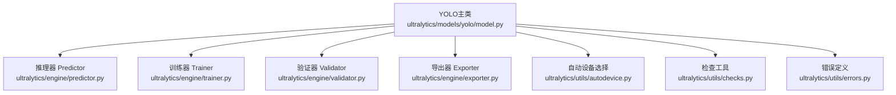
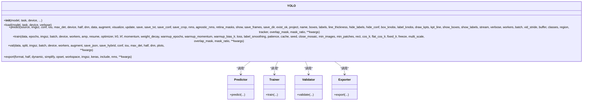
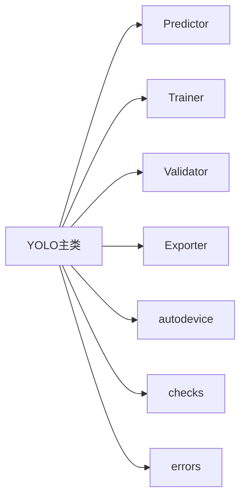

# YOLO主类API

<cite>
**本文引用的文件**
- [ultralytics/models/yolo/model.py](file://ultralytics/models/yolo/model.py)
- [ultralytics/engine/predictor.py](file://ultralytics/engine/predictor.py)
- [ultralytics/engine/trainer.py](file://ultralytics/engine/trainer.py)
- [ultralytics/engine/validator.py](file://ultralytics/engine/validator.py)
- [ultralytics/engine/exporter.py](file://ultralytics/engine/exporter.py)
- [ultralytics/utils/errors.py](file://ultralytics/utils/errors.py)
- [ultralytics/utils/autodevice.py](file://ultralytics/utils/autodevice.py)
- [ultralytics/utils/checks.py](file://ultralytics/utils/checks.py)
- [ultralytics/utils/__init__.py](file://ultralytics/utils/__init__.py)
</cite>

## 目录
1. [简介](#简介)
2. [项目结构](#项目结构)
3. [核心组件](#核心组件)
4. [架构总览](#架构总览)
5. [详细组件分析](#详细组件分析)
6. [依赖分析](#依赖分析)
7. [性能考虑](#性能考虑)
8. [故障排查指南](#故障排查指南)
9. [结论](#结论)
10. [附录](#附录)

## 简介
本文件为YOLO-Master中YOLO主类的API文档，聚焦于：
- 构造函数参数与初始化选项（模型路径、任务类型、设备配置等）
- 模型加载方法load()的参数与返回值格式
- 核心方法接口：predict()推理预测、train()训练、val()验证评估、export()导出
- 每个方法的参数说明、返回值结构与使用示例
- 错误处理机制与异常类型
- 常见使用模式：快速推理、自定义训练、批量处理等

## 项目结构
YOLO主类位于models/yolo目录，统一对外暴露高层API；其内部通过engine层的Predictor、Trainer、Validator、Exporter完成具体工作。

图表来源
- [ultralytics/models/yolo/model.py](file://ultralytics/models/yolo/model.py)
- [ultralytics/engine/predictor.py](file://ultralytics/engine/predictor.py)
- [ultralytics/engine/trainer.py](file://ultralytics/engine/trainer.py)
- [ultralytics/engine/validator.py](file://ultralytics/engine/validator.py)
- [ultralytics/engine/exporter.py](file://ultralytics/engine/exporter.py)
- [ultralytics/utils/autodevice.py](file://ultralytics/utils/autodevice.py)
- [ultralytics/utils/checks.py](file://ultralytics/utils/checks.py)
- [ultralytics/utils/errors.py](file://ultralytics/utils/errors.py)

章节来源
- [ultralytics/models/yolo/model.py](file://ultralytics/models/yolo/model.py)
- [ultralytics/engine/predictor.py](file://ultralytics/engine/predictor.py)
- [ultralytics/engine/trainer.py](file://ultralytics/engine/trainer.py)
- [ultralytics/engine/validator.py](file://ultralytics/engine/validator.py)
- [ultralytics/engine/exporter.py](file://ultralytics/engine/exporter.py)
- [ultralytics/utils/autodevice.py](file://ultralytics/utils/autodevice.py)
- [ultralytics/utils/checks.py](file://ultralytics/utils/checks.py)
- [ultralytics/utils/errors.py](file://ultralytics/utils/errors.py)

## 核心组件
- YOLO主类：提供统一的入口，封装模型加载、推理、训练、验证与导出能力
- Predictor：负责图像/视频/流式数据的推理与后处理
- Trainer：负责训练流程、优化器、回调、日志与保存
- Validator：负责在验证集上计算指标与可视化
- Exporter：负责将模型导出为多种部署格式
- 工具模块：设备选择、参数校验、错误类型定义

章节来源
- [ultralytics/models/yolo/model.py](file://ultralytics/models/yolo/model.py)
- [ultralytics/engine/predictor.py](file://ultralytics/engine/predictor.py)
- [ultralytics/engine/trainer.py](file://ultralytics/engine/trainer.py)
- [ultralytics/engine/validator.py](file://ultralytics/engine/validator.py)
- [ultralytics/engine/exporter.py](file://ultralytics/engine/exporter.py)
- [ultralytics/utils/autodevice.py](file://ultralytics/utils/autodevice.py)
- [ultralytics/utils/checks.py](file://ultralytics/utils/checks.py)
- [ultralytics/utils/errors.py](file://ultralytics/utils/errors.py)

## 架构总览
下图展示了YOLO主类与其内部引擎组件的交互关系。

图表来源
- [ultralytics/models/yolo/model.py](file://ultralytics/models/yolo/model.py)
- [ultralytics/engine/predictor.py](file://ultralytics/engine/predictor.py)
- [ultralytics/engine/trainer.py](file://ultralytics/engine/trainer.py)
- [ultralytics/engine/validator.py](file://ultralytics/engine/validator.py)
- [ultralytics/engine/exporter.py](file://ultralytics/engine/exporter.py)

## 详细组件分析

### YOLO类构造与初始化
- 作用：创建YOLO实例并准备模型上下文（任务类型、设备、权重路径等）
- 关键参数（示例）：
  - model：模型权重路径或预训练名称
  - task：任务类型（如检测、分割、姿态估计等）
  - device：运行设备（CPU/GPU），支持字符串或设备对象
  - verbose：是否输出详细信息
  - 其他：根据版本可能包含缓存、精度、后端等开关
- 行为：
  - 解析并校验输入参数
  - 自动选择设备（若未指定）
  - 延迟加载模型权重（可在首次调用时触发）

章节来源
- [ultralytics/models/yolo/model.py](file://ultralytics/models/yolo/model.py)
- [ultralytics/utils/autodevice.py](file://ultralytics/utils/autodevice.py)
- [ultralytics/utils/checks.py](file://ultralytics/utils/checks.py)

### 模型加载 load()
- 作用：显式加载或切换模型权重，支持动态任务与设备
- 典型参数：
  - model：权重路径或模型标识
  - task：任务类型（可覆盖构造时的设置）
  - device：目标设备
  - verbose：是否打印加载信息
- 返回值：
  - 返回当前YOLO实例自身，便于链式调用
- 注意事项：
  - 若传入新task或device，会进行必要的重初始化
  - 对不存在的权重路径或非法task会抛出异常

章节来源
- [ultralytics/models/yolo/model.py](file://ultralytics/models/yolo/model.py)
- [ultralytics/utils/checks.py](file://ultralytics/utils/checks.py)
- [ultralytics/utils/errors.py](file://ultralytics/utils/errors.py)

### 推理 predict()
- 作用：对单张或多张图像、视频、摄像头流等进行推理
- 常用参数（节选）：
  - source：输入源（图片路径、目录、视频、URL、摄像头索引等）
  - imgsz：推理尺寸（整数或[高,宽]）
  - conf：置信度阈值
  - iou：NMS IoU阈值
  - max_det：最大检测数
  - device：推理设备
  - half：半精度推理
  - dnn：是否使用OpenCV DNN后端
  - augment：数据增强推理
  - visualize：可视化中间特征
  - save：是否保存结果图/视频
  - save_txt/save_conf：是否保存文本结果与置信度
  - save_crop：是否裁剪目标区域
  - nms/agnostic_nms：是否启用NMS及类别无关NMS
  - retina_masks：高分辨率掩码（分割任务）
  - show：是否在窗口显示
  - save_dir/exist_ok/project/name：结果保存目录策略
  - stream：是否以流式方式处理
  - batch/workers：批大小与数据加载线程
  - classes：仅保留指定类别
  - region：感兴趣区域
  - tracker：跟踪器配置
  - 其他：可视化相关参数（线宽、标签、关键点等）
- 返回值：
  - 返回Results对象或Results列表（取决于输入source类型）
  - Results包含检测结果（框、类别、置信度、掩码、关键点等）、元信息与可视化辅助方法
- 使用示例（描述性）：
  - 快速推理：指定source与imgsz，设置conf与iou阈值，save=True保存结果图
  - 批量处理：传入图片目录或列表，设置batch与workers提升吞吐
  - 流式推理：video或摄像头输入，开启stream与buffer控制内存占用

章节来源
- [ultralytics/models/yolo/model.py](file://ultralytics/models/yolo/model.py)
- [ultralytics/engine/predictor.py](file://ultralytics/engine/predictor.py)

### 训练 train()
- 作用：启动训练流程，支持多任务与分布式
- 常用参数（节选）：
  - data：数据集配置文件路径或字典
  - epochs：训练轮数
  - imgsz：训练输入尺寸
  - batch：每卡批大小
  - device：训练设备
  - workers：数据加载线程数
  - amp：自动混合精度
  - resume：从断点恢复
  - optimizer：优化器配置
  - lr0/lrf/momentum/weight_decay/warmup_*：学习率与预热策略
  - patience：早停耐心值
  - cache：是否缓存数据集到内存
  - rect/cos_lr/flat_cos_lr/fixed_lr：矩形训练与余弦退火策略
  - freeze：冻结部分层
  - multi_scale：多尺度训练
  - overlap_mask/mask_ratio：掩码相关超参（分割）
  - 其他：回调、日志、保存策略等
- 返回值：
  - 返回训练结果摘要（含指标、损失曲线、最佳权重路径等）
- 使用示例（描述性）：
  - 从头训练：提供data与epochs，设置imgsz与batch，开启amp加速
  - 微调：resume=上次训练结果路径，freeze部分骨干层
  - 分布式：通过外部脚本或框架设置多进程/多卡

章节来源
- [ultralytics/models/yolo/model.py](file://ultralytics/models/yolo/model.py)
- [ultralytics/engine/trainer.py](file://ultralytics/engine/trainer.py)

### 验证 val()
- 作用：在验证集上评估模型性能，输出mAP等指标
- 常用参数（节选）：
  - data：数据集配置文件
  - split：数据划分（如val/test）
  - imgsz/batch/device/workers/augment：与训练一致
  - save_json/save_hybrid：导出JSON或混合结果
  - conf/iou/max_det/half/dnn：与推理一致
  - plots：是否生成可视化图表
- 返回值：
  - 返回验证指标字典或对象（含各类别与总体指标）
- 使用示例（描述性）：
  - 标准验证：指定data与split，设置imgsz与batch，plots=True生成图表
  - 严格评测：降低conf与iou阈值，统计更全面的指标

章节来源
- [ultralytics/models/yolo/model.py](file://ultralytics/models/yolo/model.py)
- [ultralytics/engine/validator.py](file://ultralytics/engine/validator.py)

### 导出 export()
- 作用：将模型导出为不同部署格式（ONNX、TensorRT、TFLite等）
- 常用参数（节选）：
  - format：目标格式（如onnx、torchscript、tflite、coreml等）
  - half：半精度导出
  - dynamic：动态形状支持
  - simplify：简化模型图
  - opset：ONNX opset版本
  - workspace：特定后端工作空间（如TensorRT）
  - imgsz：导出输入尺寸
  - keras/include/nms：后端特定选项
- 返回值：
  - 返回导出文件路径或路径列表
- 使用示例（描述性）：
  - ONNX导出：format="onnx", half=True, dynamic=False
  - TensorRT导出：format="engine", workspace较大，imgsz固定
  - TFLite导出：format="tflite", int8量化可选

章节来源
- [ultralytics/models/yolo/model.py](file://ultralytics/models/yolo/model.py)
- [ultralytics/engine/exporter.py](file://ultralytics/engine/exporter.py)

### 错误处理与异常类型
- 主要异常来源：
  - 参数校验失败（路径不存在、task不支持、设备不可用等）
  - 模型加载失败（权重损坏、格式不匹配）
  - 导出失败（后端缺失、环境不满足）
- 建议捕获：
  - 通用异常基类用于兜底
  - 业务异常类型（由utils.errors定义）用于精准定位
- 处理建议：
  - 记录详细日志（输入参数、设备状态、磁盘空间）
  - 提供降级策略（如回退CPU、关闭half）
  - 用户友好提示（修复指引与参考链接）

章节来源
- [ultralytics/utils/errors.py](file://ultralytics/utils/errors.py)
- [ultralytics/utils/checks.py](file://ultralytics/utils/checks.py)

## 依赖分析
YOLO主类依赖engine层各组件与工具模块，形成清晰的分层与职责分离。

图表来源
- [ultralytics/models/yolo/model.py](file://ultralytics/models/yolo/model.py)
- [ultralytics/engine/predictor.py](file://ultralytics/engine/predictor.py)
- [ultralytics/engine/trainer.py](file://ultralytics/engine/trainer.py)
- [ultralytics/engine/validator.py](file://ultralytics/engine/validator.py)
- [ultralytics/engine/exporter.py](file://ultralytics/engine/exporter.py)
- [ultralytics/utils/autodevice.py](file://ultralytics/utils/autodevice.py)
- [ultralytics/utils/checks.py](file://ultralytics/utils/checks.py)
- [ultralytics/utils/errors.py](file://ultralytics/utils/errors.py)

章节来源
- [ultralytics/models/yolo/model.py](file://ultralytics/models/yolo/model.py)
- [ultralytics/engine/predictor.py](file://ultralytics/engine/predictor.py)
- [ultralytics/engine/trainer.py](file://ultralytics/engine/trainer.py)
- [ultralytics/engine/validator.py](file://ultralytics/engine/validator.py)
- [ultralytics/engine/exporter.py](file://ultralytics/engine/exporter.py)
- [ultralytics/utils/autodevice.py](file://ultralytics/utils/autodevice.py)
- [ultralytics/utils/checks.py](file://ultralytics/utils/checks.py)
- [ultralytics/utils/errors.py](file://ultralytics/utils/errors.py)

## 性能考虑
- 设备选择：优先GPU，必要时回退CPU；合理设置half与dnn后端
- 批处理：增大batch与workers提高吞吐，注意显存限制
- 输入尺寸：imgsz越大精度越高但速度越慢，需权衡
- NMS与阈值：conf与iou影响速度与召回，按场景调优
- 导出优化：选择合适的backend与opset，启用动态形状按需
- 缓存：cache=True可显著减少IO开销，适合小数据集

## 故障排查指南
- 常见问题
  - 找不到模型权重：检查路径与网络权限，确认文件名与后缀
  - 设备不可用：确认CUDA驱动与PyTorch安装，查看可用设备
  - 导出失败：检查目标后端依赖与环境变量
  - 内存不足：减小batch、imgsz或关闭half/dnn
- 诊断步骤
  - 启用verbose输出，定位失败阶段
  - 最小复现：缩小imgsz与batch，逐步增加复杂度
  - 日志收集：保存控制台输出与错误堆栈
- 恢复策略
  - 降级到CPU或关闭半精度
  - 更换导出格式或关闭简化
  - 清理临时文件与缓存目录

章节来源
- [ultralytics/utils/errors.py](file://ultralytics/utils/errors.py)
- [ultralytics/utils/checks.py](file://ultralytics/utils/checks.py)

## 结论
YOLO主类提供了统一的API入口，屏蔽底层实现细节，使开发者可以便捷地完成推理、训练、验证与导出。通过合理的参数配置与错误处理，可以在不同硬件与部署环境下获得稳定高效的体验。

## 附录
- 快速推理示例（描述性）
  - 加载模型后，直接调用predict，传入图片路径与必要阈值，保存结果图
- 自定义训练示例（描述性）
  - 准备数据集配置文件，设置epochs、imgsz、batch与amp，启动train并监控指标
- 批量处理示例（描述性）
  - 传入图片目录或列表，设置较大的batch与workers，结合save与save_dir管理输出
- 导出示例（描述性）
  - 选择目标格式与后端参数，执行export并验证导出产物