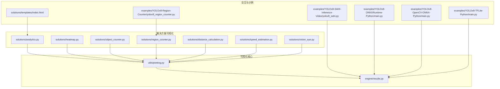
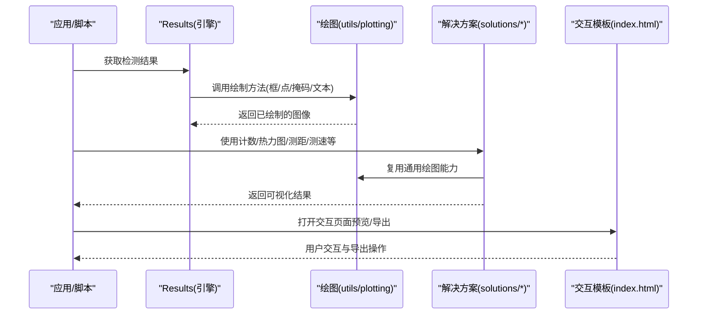
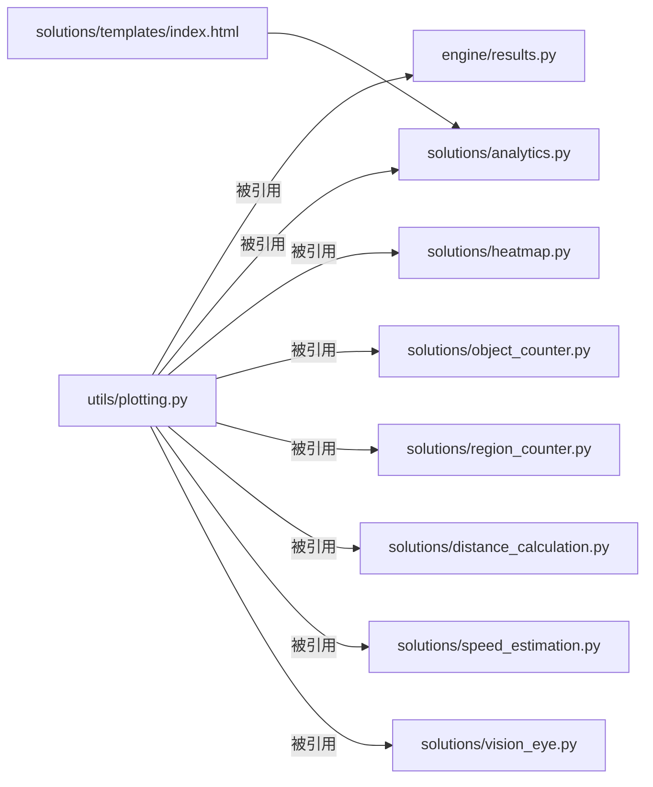

# 可视化工具API

<cite>
**本文引用的文件**
- [ultralytics/utils/plotting.py](file://ultralytics/utils/plotting.py)
- [ultralytics/engine/results.py](file://ultralytics/engine/results.py)
- [ultralytics/solutions/analytics.py](file://ultralytics/solutions/analytics.py)
- [ultralytics/solutions/heatmap.py](file://ultralytics/solutions/heatmap.py)
- [ultralytics/solutions/object_counter.py](file://ultralytics/solutions/object_counter.py)
- [ultralytics/solutions/region_counter.py](file://ultralytics/solutions/region_counter.py)
- [ultralytics/solutions/distance_calculation.py](file://ultralytics/solutions/distance_calculation.py)
- [ultralytics/solutions/speed_estimation.py](file://ultralytics/solutions/speed_estimation.py)
- [ultralytics/solutions/vision_eye.py](file://ultralytics/solutions/vision_eye.py)
- [ultralytics/solutions/templates/index.html](file://ultralytics/solutions/templates/index.html)
- [examples/YOLOv8-SAHI-Inference-Video/yolov8_sahi.py](file://examples/YOLOv8-SAHI-Inference-Video/yolov8_sahi.py)
- [examples/YOLOv8-ONNXRuntime-Python/main.py](file://examples/YOLOv8-ONNXRuntime-Python/main.py)
- [examples/YOLOv8-OpenCV-ONNX-Python/main.py](file://examples/YOLOv8-OpenCV-ONNX-Python/main.py)
- [examples/YOLOv8-TFLite-Python/main.py](file://examples/YOLOv8-TFLite-Python/main.py)
- [examples/YOLOv8-Region-Counter/yolov8_region_counter.py](file://examples/YOLOv8-Region-Counter/yolov8_region_counter.py)
</cite>

## 目录
1. [简介](#简介)
2. [项目结构](#项目结构)
3. [核心组件](#核心组件)
4. [架构总览](#架构总览)
5. [详细组件分析](#详细组件分析)
6. [依赖关系分析](#依赖关系分析)
7. [性能考虑](#性能考虑)
8. [故障排查指南](#故障排查指南)
9. [结论](#结论)
10. [附录](#附录)

## 简介
本文件面向YOLO-Master的可视化能力，聚焦结果绘制与图表生成API：检测结果可视化、训练曲线绘制、混淆矩阵生成、图像标注（边界框、关键点、掩码叠加）、颜色配置与样式定制、输出格式选项，以及交互式可视化与静态图片导出。文档同时提供扩展自定义样式的最佳实践与示例路径，帮助读者快速上手并高效集成到生产流程中。

## 项目结构
可视化相关代码主要分布在以下模块：
- 通用绘图与工具：ultralytics/utils/plotting.py
- 推理结果对象与内建绘制：ultralytics/engine/results.py
- 解决方案级可视化：ultralytics/solutions/*（热力图、计数、测距、测速、视觉之眼等）
- 模板与交互页面：ultralytics/solutions/templates/index.html
- 示例脚本：examples/*（展示如何调用可视化接口进行导出与展示）

图示来源
- [ultralytics/utils/plotting.py](file://ultralytics/utils/plotting.py)
- [ultralytics/engine/results.py](file://ultralytics/engine/results.py)
- [ultralytics/solutions/analytics.py](file://ultralytics/solutions/analytics.py)
- [ultralytics/solutions/heatmap.py](file://ultralytics/solutions/heatmap.py)
- [ultralytics/solutions/object_counter.py](file://ultralytics/solutions/object_counter.py)
- [ultralytics/solutions/region_counter.py](file://ultralytics/solutions/region_counter.py)
- [ultralytics/solutions/distance_calculation.py](file://ultralytics/solutions/distance_calculation.py)
- [ultralytics/solutions/speed_estimation.py](file://ultralytics/solutions/speed_estimation.py)
- [ultralytics/solutions/vision_eye.py](file://ultralytics/solutions/vision_eye.py)
- [ultralytics/solutions/templates/index.html](file://ultralytics/solutions/templates/index.html)
- [examples/YOLOv8-SAHI-Inference-Video/yolov8_sahi.py](file://examples/YOLOv8-SAHI-Inference-Video/yolov8_sahi.py)
- [examples/YOLOv8-ONNXRuntime-Python/main.py](file://examples/YOLOv8-ONNXRuntime-Python/main.py)
- [examples/YOLOv8-OpenCV-ONNX-Python/main.py](file://examples/YOLOv8-OpenCV-ONNX-Python/main.py)
- [examples/YOLOv8-TFLite-Python/main.py](file://examples/YOLOv8-TFLite-Python/main.py)
- [examples/YOLOv8-Region-Counter/yolov8_region_counter.py](file://examples/YOLOv8-Region-Counter/yolov8_region_counter.py)

章节来源
- [ultralytics/utils/plotting.py](file://ultralytics/utils/plotting.py)
- [ultralytics/engine/results.py](file://ultralytics/engine/results.py)
- [ultralytics/solutions/analytics.py](file://ultralytics/solutions/analytics.py)
- [ultralytics/solutions/heatmap.py](file://ultralytics/solutions/heatmap.py)
- [ultralytics/solutions/object_counter.py](file://ultralytics/solutions/object_counter.py)
- [ultralytics/solutions/region_counter.py](file://ultralytics/solutions/region_counter.py)
- [ultralytics/solutions/distance_calculation.py](file://ultralytics/solutions/distance_calculation.py)
- [ultralytics/solutions/speed_estimation.py](file://ultralytics/solutions/speed_estimation.py)
- [ultralytics/solutions/vision_eye.py](file://ultralytics/solutions/vision_eye.py)
- [ultralytics/solutions/templates/index.html](file://ultralytics/solutions/templates/index.html)
- [examples/YOLOv8-SAHI-Inference-Video/yolov8_sahi.py](file://examples/YOLOv8-SAHI-Inference-Video/yolov8_sahi.py)
- [examples/YOLOv8-ONNXRuntime-Python/main.py](file://examples/YOLOv8-ONNXRuntime-Python/main.py)
- [examples/YOLOv8-OpenCV-ONNX-Python/main.py](file://examples/YOLOv8-OpenCV-ONNX-Python/main.py)
- [examples/YOLOv8-TFLite-Python/main.py](file://examples/YOLOv8-TFLite-Python/main.py)
- [examples/YOLOv8-Region-Counter/yolov8_region_counter.py](file://examples/YOLOv8-Region-Counter/yolov8_region_counter.py)

## 核心组件
- 通用绘图与标注（utils/plotting.py）
  - 负责基础图形绘制、颜色映射、字体与样式、坐标变换、边界框/多边形/关键点/掩码叠加等通用能力。
  - 提供训练曲线绘制、混淆矩阵生成、指标图表等数据可视化函数。
- 推理结果可视化（engine/results.py）
  - 在Results对象上封装了便捷绘制方法，支持将检测结果直接渲染到图像或导出为可视化结果。
- 解决方案可视化（solutions/*）
  - 面向业务场景的可视化组件：热力图、目标计数、区域计数、距离计算、速度估计、视觉之眼等，内部复用通用绘图能力。
- 交互模板（solutions/templates/index.html）
  - 提供轻量Web界面用于交互式查看与导出，便于在Notebook或本地服务中预览。

章节来源
- [ultralytics/utils/plotting.py](file://ultralytics/utils/plotting.py)
- [ultralytics/engine/results.py](file://ultralytics/engine/results.py)
- [ultralytics/solutions/analytics.py](file://ultralytics/solutions/analytics.py)
- [ultralytics/solutions/heatmap.py](file://ultralytics/solutions/heatmap.py)
- [ultralytics/solutions/object_counter.py](file://ultralytics/solutions/object_counter.py)
- [ultralytics/solutions/region_counter.py](file://ultralytics/solutions/region_counter.py)
- [ultralytics/solutions/distance_calculation.py](file://ultralytics/solutions/distance_calculation.py)
- [ultralytics/solutions/speed_estimation.py](file://ultralytics/solutions/speed_estimation.py)
- [ultralytics/solutions/vision_eye.py](file://ultralytics/solutions/vision_eye.py)
- [ultralytics/solutions/templates/index.html](file://ultralytics/solutions/templates/index.html)

## 架构总览
下图展示了从“推理结果”到“可视化输出”的整体流程，包括通用绘图、结果对象绘制、解决方案组件与交互模板之间的协作关系。

图示来源
- [ultralytics/engine/results.py](file://ultralytics/engine/results.py)
- [ultralytics/utils/plotting.py](file://ultralytics/utils/plotting.py)
- [ultralytics/solutions/analytics.py](file://ultralytics/solutions/analytics.py)
- [ultralytics/solutions/heatmap.py](file://ultralytics/solutions/heatmap.py)
- [ultralytics/solutions/object_counter.py](file://ultralytics/solutions/object_counter.py)
- [ultralytics/solutions/region_counter.py](file://ultralytics/solutions/region_counter.py)
- [ultralytics/solutions/distance_calculation.py](file://ultralytics/solutions/distance_calculation.py)
- [ultralytics/solutions/speed_estimation.py](file://ultralytics/solutions/speed_estimation.py)
- [ultralytics/solutions/vision_eye.py](file://ultralytics/solutions/vision_eye.py)
- [ultralytics/solutions/templates/index.html](file://ultralytics/solutions/templates/index.html)

## 详细组件分析

### 通用绘图与标注（utils/plotting.py）
- 功能要点
  - 图像标注：边界框绘制、多边形/掩码叠加、关键点标记、文本标签、箭头与连线。
  - 颜色与样式：类别颜色映射、透明度控制、线宽与字体大小、背景色与网格开关。
  - 图表绘制：训练曲线、混淆矩阵、指标折线/柱状图等。
  - 输出格式：支持PNG/JPG/PDF/SVG等常见格式，可指定分辨率与质量参数。
- 典型用法
  - 在Results对象上调用绘制方法，或直接传入图像与检测数据进行标注。
  - 通过样式参数统一调整外观，如颜色主题、透明度、边框粗细等。
  - 批量导出时建议关闭交互显示以提升性能。
- 扩展建议
  - 自定义颜色表：基于类别数量动态生成或加载外部配色方案。
  - 自定义字体与字号：适配不同语言与屏幕密度。
  - 新增视觉元素：如置信度阈值过滤、ID轨迹线、ROI高亮等。

章节来源
- [ultralytics/utils/plotting.py](file://ultralytics/utils/plotting.py)

### 推理结果可视化（engine/results.py）
- 功能要点
  - Results对象封装了检测结果，并提供便捷的绘制接口，可直接渲染到图像或保存为文件。
  - 支持多种任务类型的可视化：检测、分割、姿态、跟踪等。
- 典型用法
  - 在推理后对Results调用绘制方法，设置是否显示、是否保存、样式参数等。
  - 结合解决方案组件进行增强可视化（如叠加热力图或计数信息）。
- 注意事项
  - 大批量处理时建议关闭实时显示，优先写入磁盘。
  - 注意输入图像通道顺序与尺寸一致性。

章节来源
- [ultralytics/engine/results.py](file://ultralytics/engine/results.py)

### 解决方案可视化（solutions/*）
- analytics.py
  - 聚合分析与统计类可视化，常用于汇总指标与趋势展示。
- heatmap.py
  - 将密集事件或注意力分布以热力图形式叠加到原图上，适合人群密度、关注区域分析。
- object_counter.py
  - 跨线计数、进出统计，适用于人流/车流监控场景。
- region_counter.py
  - 区域命中计数，支持多边形ROI与动态更新。
- distance_calculation.py
  - 基于关键点或中心点的距离估算，辅助行为分析。
- speed_estimation.py
  - 基于连续帧位移的速度估计，结合时间戳与像素尺度换算。
- vision_eye.py
  - 提供“视觉之眼”效果，聚焦关键区域或异常检测结果的局部放大视图。
- 交互模板 index.html
  - 提供轻量Web界面，支持选择视频/图片、切换可视化层、导出当前帧或片段。

章节来源
- [ultralytics/solutions/analytics.py](file://ultralytics/solutions/analytics.py)
- [ultralytics/solutions/heatmap.py](file://ultralytics/solutions/heatmap.py)
- [ultralytics/solutions/object_counter.py](file://ultralytics/solutions/object_counter.py)
- [ultralytics/solutions/region_counter.py](file://ultralytics/solutions/region_counter.py)
- [ultralytics/solutions/distance_calculation.py](file://ultralytics/solutions/distance_calculation.py)
- [ultralytics/solutions/speed_estimation.py](file://ultralytics/solutions/speed_estimation.py)
- [ultralytics/solutions/vision_eye.py](file://ultralytics/solutions/vision_eye.py)
- [ultralytics/solutions/templates/index.html](file://ultralytics/solutions/templates/index.html)

### 示例与集成路径
- SAHI切片推理可视化
  - 参考路径：[examples/YOLOv8-SAHI-Inference-Video/yolov8_sahi.py](file://examples/YOLOv8-SAHI-Inference-Video/yolov8_sahi.py)
  - 说明：演示大图切片推理后的可视化拼接与导出。
- ONNX Runtime推理可视化
  - 参考路径：[examples/YOLOv8-ONNXRuntime-Python/main.py](file://examples/YOLOv8-ONNXRuntime-Python/main.py)
  - 说明：展示模型推理后调用可视化接口的标准流程。
- OpenCV后端可视化
  - 参考路径：[examples/YOLOv8-OpenCV-ONNX-Python/main.py](file://examples/YOLOv8-OpenCV-ONNX-Python/main.py)
  - 说明：利用OpenCV进行图像读取与可视化输出。
- TFLite端侧推理可视化
  - 参考路径：[examples/YOLOv8-TFLite-Python/main.py](file://examples/YOLOv8-TFLite-Python/main.py)
  - 说明：端侧部署下的可视化与导出策略。
- 区域计数示例
  - 参考路径：[examples/YOLOv8-Region-Counter/yolov8_region_counter.py](file://examples/YOLOv8-Region-Counter/yolov8_region_counter.py)
  - 说明：结合region_counter进行ROI计数与可视化。

章节来源
- [examples/YOLOv8-SAHI-Inference-Video/yolov8_sahi.py](file://examples/YOLOv8-SAHI-Inference-Video/yolov8_sahi.py)
- [examples/YOLOv8-ONNXRuntime-Python/main.py](file://examples/YOLOv8-ONNXRuntime-Python/main.py)
- [examples/YOLOv8-OpenCV-ONNX-Python/main.py](file://examples/YOLOv8-OpenCV-ONNX-Python/main.py)
- [examples/YOLOv8-TFLite-Python/main.py](file://examples/YOLOv8-TFLite-Python/main.py)
- [examples/YOLOv8-Region-Counter/yolov8_region_counter.py](file://examples/YOLOv8-Region-Counter/yolov8_region_counter.py)

## 依赖关系分析
- 耦合与内聚
  - solutions/* 高度依赖 utils/plotting.py 的基础绘制能力，保持低耦合、高内聚。
  - engine/results.py 作为结果载体，向上暴露简洁的绘制接口，向下复用通用绘图。
- 外部依赖
  - 图像处理与IO：OpenCV、Pillow、matplotlib等（由底层实现决定）。
  - 交互展示：HTML模板与浏览器渲染。
- 潜在循环依赖
  - 当前分层清晰，未见明显循环依赖；建议在新增可视化组件时遵循“先通用后专用”的原则。

图示来源
- [ultralytics/utils/plotting.py](file://ultralytics/utils/plotting.py)
- [ultralytics/engine/results.py](file://ultralytics/engine/results.py)
- [ultralytics/solutions/analytics.py](file://ultralytics/solutions/analytics.py)
- [ultralytics/solutions/heatmap.py](file://ultralytics/solutions/heatmap.py)
- [ultralytics/solutions/object_counter.py](file://ultralytics/solutions/object_counter.py)
- [ultralytics/solutions/region_counter.py](file://ultralytics/solutions/region_counter.py)
- [ultralytics/solutions/distance_calculation.py](file://ultralytics/solutions/distance_calculation.py)
- [ultralytics/solutions/speed_estimation.py](file://ultralytics/solutions/speed_estimation.py)
- [ultralytics/solutions/vision_eye.py](file://ultralytics/solutions/vision_eye.py)
- [ultralytics/solutions/templates/index.html](file://ultralytics/solutions/templates/index.html)

## 性能考虑
- 批量导出
  - 关闭实时显示，优先写入磁盘；合并I/O操作减少频繁刷新。
- 分辨率与质量
  - 根据用途选择合适的输出分辨率与压缩质量，避免过大文件影响传输与存储。
- 内存与缓存
  - 大图像与长视频流处理时，采用分块/滑动窗口策略，及时释放中间变量。
- 并行与线程安全
  - 多线程并发绘制时需确保共享资源（如字体、颜色表）初始化一次且线程安全。

## 故障排查指南
- 常见问题
  - 中文乱码：检查系统字体与绘图库字体配置。
  - 颜色异常：确认颜色空间与通道顺序一致（BGR/RGB）。
  - 导出失败：检查目标路径权限与磁盘空间。
  - 性能瓶颈：关闭实时显示、降低分辨率、减少不必要的图层叠加。
- 定位建议
  - 逐步缩小范围：先验证通用绘图函数，再引入解决方案组件。
  - 打印关键参数：如图像尺寸、类别数、透明度、线宽等。
  - 使用最小复现：构造单帧小图与少量检测项进行回归测试。

## 结论
YOLO-Master的可视化体系以通用绘图为核心，向上提供统一的Results绘制接口，向下支撑丰富的解决方案可视化组件。通过合理的样式配置与输出策略，可在保证可读性的前提下获得高性能的可视化体验。建议在生产环境中优先采用批量导出与离线渲染，并结合交互模板进行快速验证与调试。

## 附录

### API概览与使用要点
- 检测结果可视化
  - 入口：Results对象的绘制方法（见引擎结果模块）
  - 要点：支持框/点/掩码/文本叠加，可配置透明度、线宽、字体大小
  - 参考：[ultralytics/engine/results.py](file://ultralytics/engine/results.py)
- 训练曲线与混淆矩阵
  - 入口：通用绘图模块中的图表函数（见绘图模块）
  - 要点：支持多指标对比、样式定制、导出为PNG/PDF/SVG
  - 参考：[ultralytics/utils/plotting.py](file://ultralytics/utils/plotting.py)
- 图像标注函数
  - 边界框绘制、关键点标记、掩码叠加、连线与箭头
  - 参考：[ultralytics/utils/plotting.py](file://ultralytics/utils/plotting.py)
- 颜色配置与样式定制
  - 类别颜色映射、透明度、线宽、字体、背景与网格
  - 参考：[ultralytics/utils/plotting.py](file://ultralytics/utils/plotting.py)
- 输出格式选项
  - PNG/JPG/PDF/SVG，分辨率与质量可调
  - 参考：[ultralytics/utils/plotting.py](file://ultralytics/utils/plotting.py)
- 交互式可视化与静态导出
  - 交互模板：[ultralytics/solutions/templates/index.html](file://ultralytics/solutions/templates/index.html)
  - 示例脚本：参见各examples路径
- 扩展方法与最佳实践
  - 自定义颜色表与字体
  - 新增视觉元素（ID轨迹、ROI高亮、置信度阈值过滤）
  - 批量导出与异步渲染
  - 参考：[ultralytics/utils/plotting.py](file://ultralytics/utils/plotting.py)、[ultralytics/solutions/templates/index.html](file://ultralytics/solutions/templates/index.html)