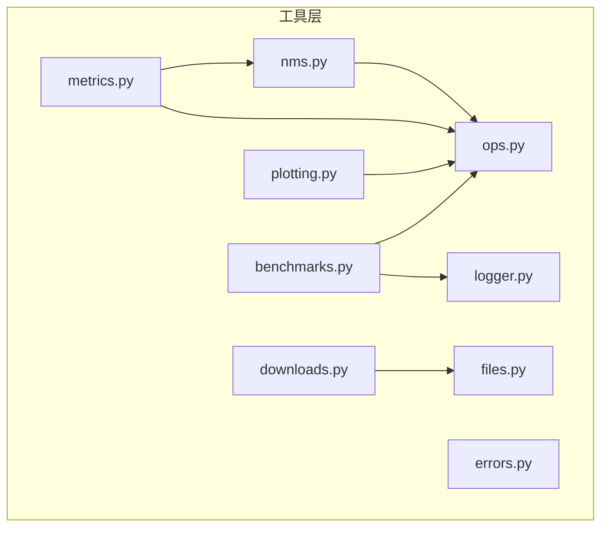
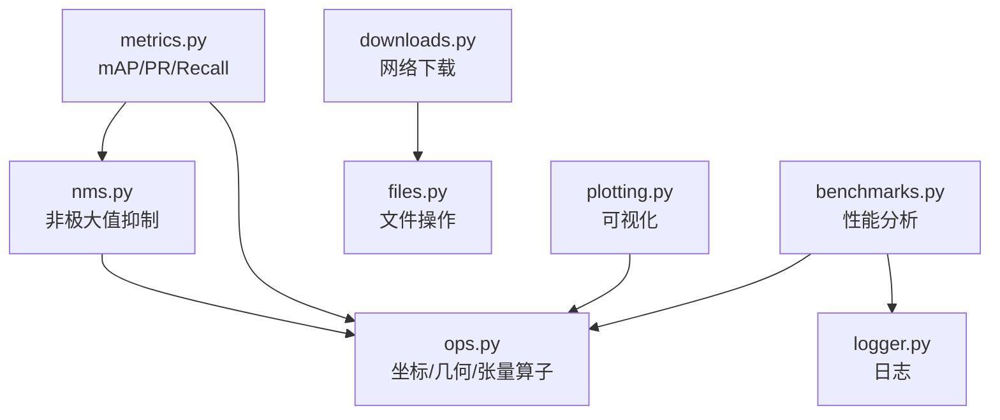
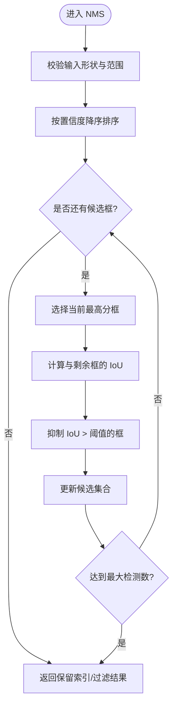
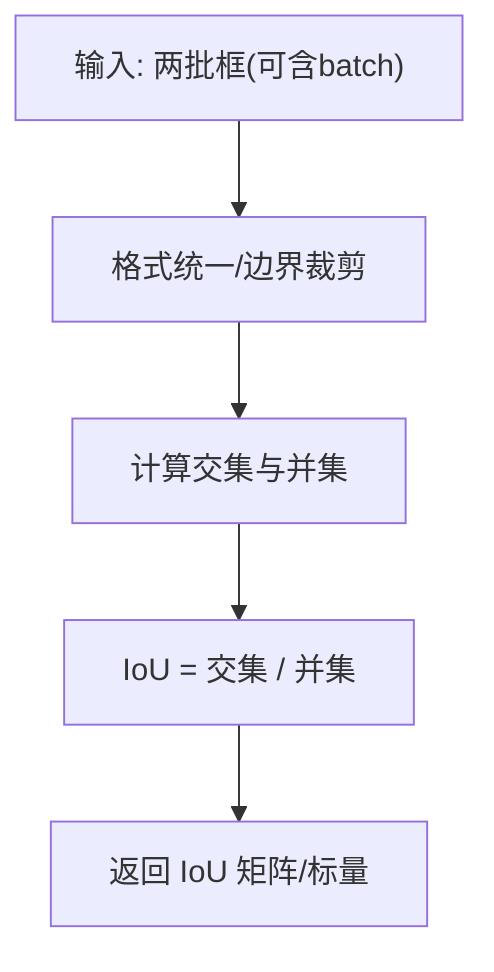
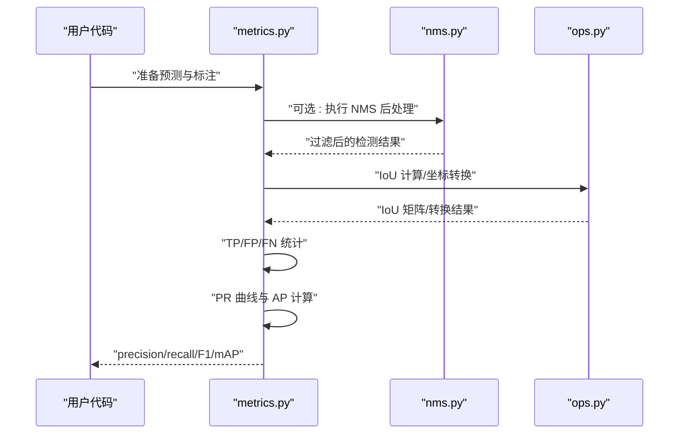
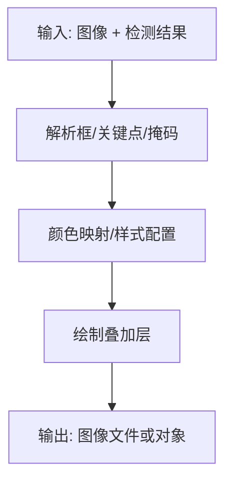
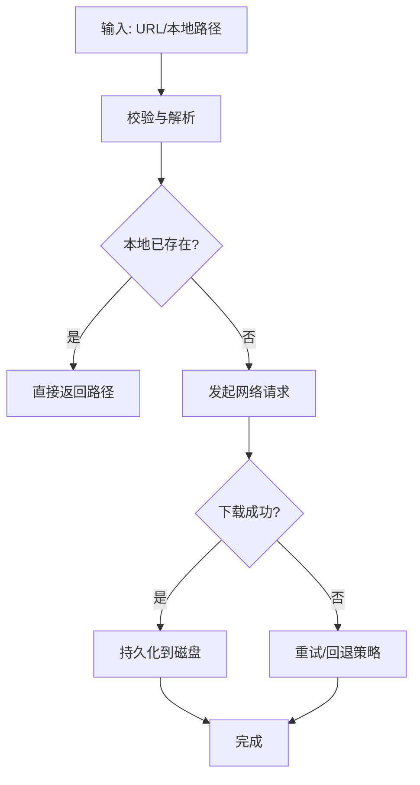
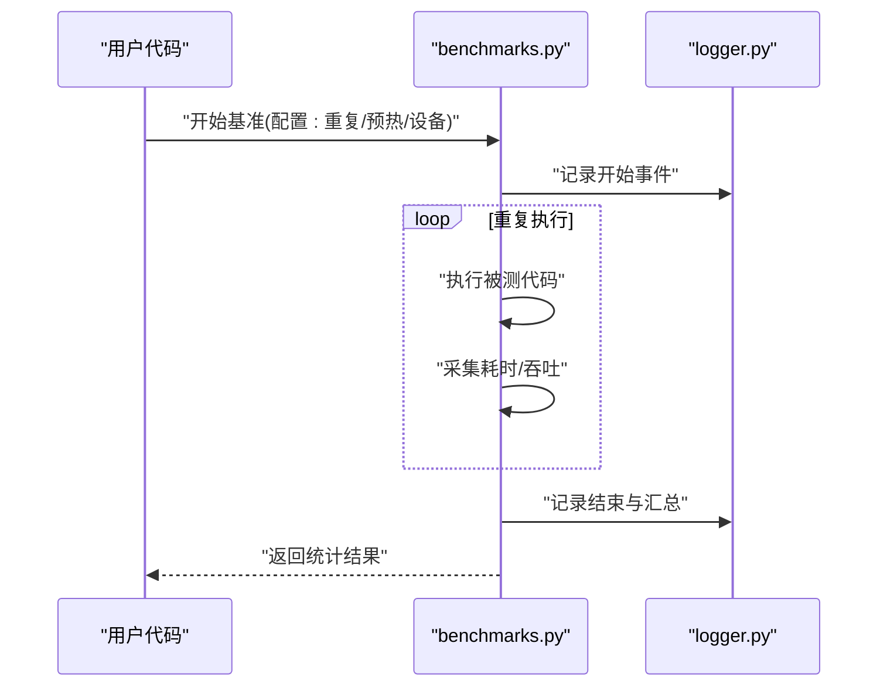
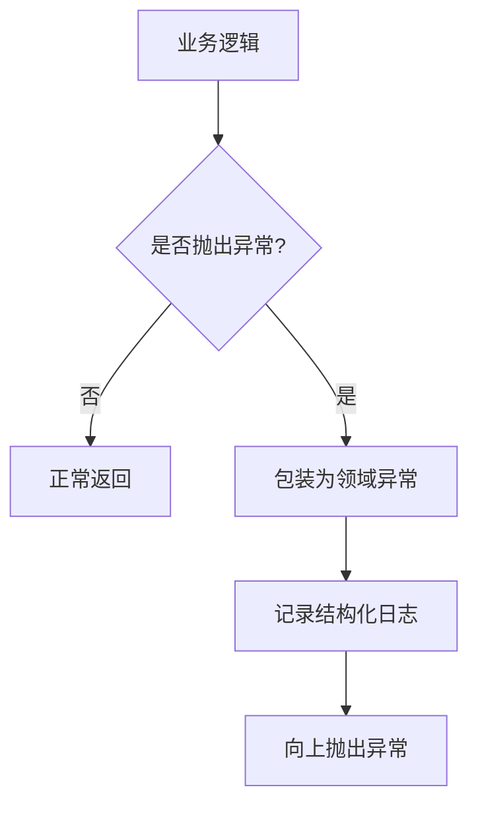
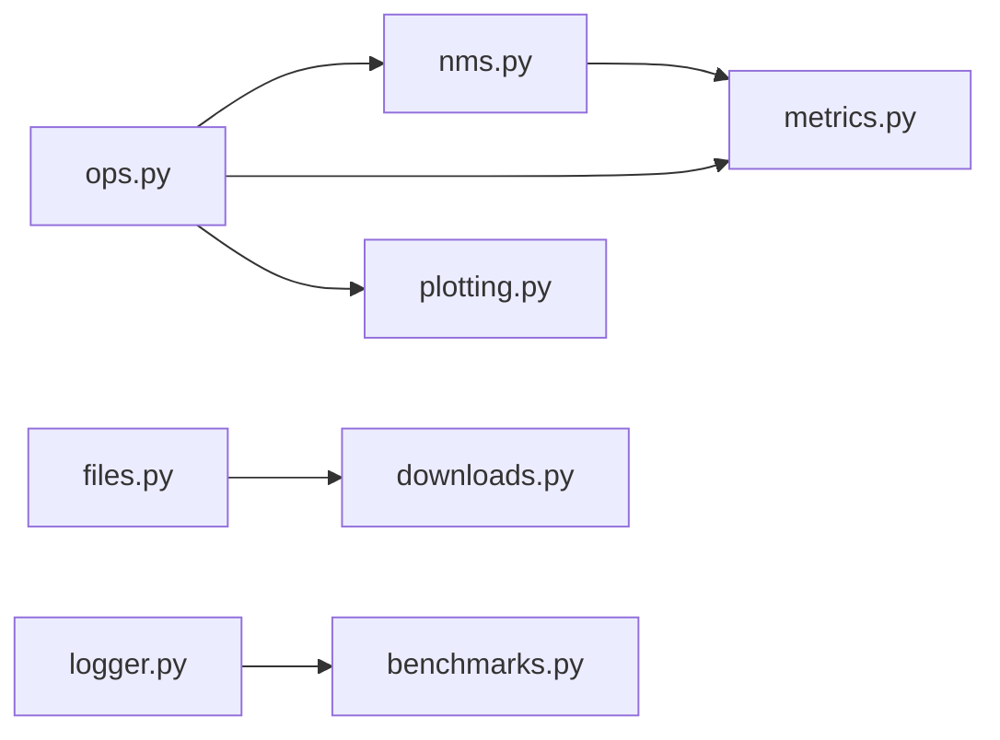

# 工具函数API

<cite>
**本文引用的文件**
- [ultralytics/utils/nms.py](file://ultralytics/utils/nms.py)
- [ultralytics/utils/metrics.py](file://ultralytics/utils/metrics.py)
- [ultralytics/utils/ops.py](file://ultralytics/utils/ops.py)
- [ultralytics/utils/plotting.py](file://ultralytics/utils/plotting.py)
- [ultralytics/utils/files.py](file://ultralytics/utils/files.py)
- [ultralytics/utils/downloads.py](file://ultralytics/utils/downloads.py)
- [ultralytics/utils/logger.py](file://ultralytics/utils/logger.py)
- [ultralytics/utils/benchmarks.py](file://ultralytics/utils/benchmarks.py)
- [ultralytics/utils/errors.py](file://ultralytics/utils/errors.py)
</cite>

## 目录
1. [简介](#简介)
2. [项目结构](#项目结构)
3. [核心组件](#核心组件)
4. [架构总览](#架构总览)
5. [详细组件分析](#详细组件分析)
6. [依赖分析](#依赖分析)
7. [性能考虑](#性能考虑)
8. [故障排查指南](#故障排查指南)
9. [结论](#结论)
10. [附录](#附录)

## 简介
本文件为 YOLO-Master 的工具函数 API 文档，聚焦于以下能力：
- 核心数学与图像处理：NMS、IoU、坐标变换等
- 评估指标：mAP、precision、recall 等计算方法与接口
- 可视化工具：结果绘制、图表生成
- 文件操作与网络请求辅助
- 性能分析工具接口
- 错误处理与日志记录实用函数
- 常用组合使用模式（以流程图和调用序列说明）

## 项目结构
工具函数主要分布在 ultralytics/utils 下，按职责划分：
- nms.py：非极大值抑制相关实现
- metrics.py：检测/分割等任务评估指标计算
- ops.py：通用张量运算与几何变换
- plotting.py：可视化与绘图
- files.py / downloads.py：文件与下载辅助
- logger.py：日志记录
- benchmarks.py：性能基准与分析
- errors.py：错误类型与异常处理

图示来源
- [ultralytics/utils/nms.py](file://ultralytics/utils/nms.py)
- [ultralytics/utils/metrics.py](file://ultralytics/utils/metrics.py)
- [ultralytics/utils/ops.py](file://ultralytics/utils/ops.py)
- [ultralytics/utils/plotting.py](file://ultralytics/utils/plotting.py)
- [ultralytics/utils/files.py](file://ultralytics/utils/files.py)
- [ultralytics/utils/downloads.py](file://ultralytics/utils/downloads.py)
- [ultralytics/utils/logger.py](file://ultralytics/utils/logger.py)
- [ultralytics/utils/benchmarks.py](file://ultralytics/utils/benchmarks.py)
- [ultralytics/utils/errors.py](file://ultralytics/utils/errors.py)

章节来源
- [ultralytics/utils/nms.py](file://ultralytics/utils/nms.py)
- [ultralytics/utils/metrics.py](file://ultralytics/utils/metrics.py)
- [ultralytics/utils/ops.py](file://ultralytics/utils/ops.py)
- [ultralytics/utils/plotting.py](file://ultralytics/utils/plotting.py)
- [ultralytics/utils/files.py](file://ultralytics/utils/files.py)
- [ultralytics/utils/downloads.py](file://ultralytics/utils/downloads.py)
- [ultralytics/utils/logger.py](file://ultralytics/utils/logger.py)
- [ultralytics/utils/benchmarks.py](file://ultralytics/utils/benchmarks.py)
- [ultralytics/utils/errors.py](file://ultralytics/utils/errors.py)

## 核心组件
本节概述各模块的职责与对外暴露的常见接口类别（具体函数名以源码为准）：
- NMS（非极大值抑制）
  - 目标：对候选框进行去重，保留高置信度且互不重叠的框
  - 典型输入：boxes、scores、iou_threshold、max_det
  - 典型输出：保留索引或过滤后的 boxes/scores
  - 参考路径：[ultralytics/utils/nms.py](file://ultralytics/utils/nms.py)
- IoU 计算
  - 目标：计算预测框与真实框的重叠率
  - 典型输入：两批框坐标（xyxy/xywh 等）
  - 典型输出：IoU 矩阵或标量
  - 参考路径：[ultralytics/utils/ops.py](file://ultralytics/utils/ops.py)
- 坐标变换
  - 目标：在 xyxy、xywh、中心+宽高、角点等不同表示间转换
  - 典型输入：坐标数组、格式标识
  - 典型输出：转换后的坐标数组
  - 参考路径：[ultralytics/utils/ops.py](file://ultralytics/utils/ops.py)
- 评估指标（mAP、precision、recall）
  - 目标：根据预测与标注计算精度、召回、PR 曲线与 mAP
  - 典型输入：预测框/掩码、标签、类别映射、阈值列表
  - 典型输出：各类别与总体 precision/recall/F1/mAP
  - 参考路径：[ultralytics/utils/metrics.py](file://ultralytics/utils/metrics.py)
- 可视化工具
  - 目标：将检测结果绘制到图像上，生成统计图
  - 典型输入：图像、检测结果、类别名、颜色表
  - 典型输出：带标注的图像或图表文件
  - 参考路径：[ultralytics/utils/plotting.py](file://ultralytics/utils/plotting.py)
- 文件与下载
  - 目标：路径解析、存在性检查、批量下载、断点续传等
  - 典型输入：URL/本地路径、保存目录、并发数
  - 典型输出：本地文件路径或下载状态
  - 参考路径：[ultralytics/utils/files.py](file://ultralytics/utils/files.py)、[ultralytics/utils/downloads.py](file://ultralytics/utils/downloads.py)
- 性能分析
  - 目标：计时、吞吐统计、内存/GPU 占用采样
  - 典型输入：待测代码块、重复次数、设备信息
  - 典型输出：耗时分布、吞吐、资源使用摘要
  - 参考路径：[ultralytics/utils/benchmarks.py](file://ultralytics/utils/benchmarks.py)
- 错误处理与日志
  - 目标：统一异常类型、结构化日志、上下文追踪
  - 典型输入：错误码、消息、堆栈信息
  - 典型输出：异常对象、日志条目
  - 参考路径：[ultralytics/utils/errors.py](file://ultralytics/utils/errors.py)、[ultralytics/utils/logger.py](file://ultralytics/utils/logger.py)

章节来源
- [ultralytics/utils/nms.py](file://ultralytics/utils/nms.py)
- [ultralytics/utils/metrics.py](file://ultralytics/utils/metrics.py)
- [ultralytics/utils/ops.py](file://ultralytics/utils/ops.py)
- [ultralytics/utils/plotting.py](file://ultralytics/utils/plotting.py)
- [ultralytics/utils/files.py](file://ultralytics/utils/files.py)
- [ultralytics/utils/downloads.py](file://ultralytics/utils/downloads.py)
- [ultralytics/utils/benchmarks.py](file://ultralytics/utils/benchmarks.py)
- [ultralytics/utils/logger.py](file://ultralytics/utils/logger.py)
- [ultralytics/utils/errors.py](file://ultralytics/utils/errors.py)

## 架构总览
下图展示工具层之间的依赖关系与数据流向。NMS 与指标计算依赖底层算子；指标计算可能调用 NMS；可视化依赖算子；基准测试依赖日志与算子；下载依赖文件操作。

图示来源
- [ultralytics/utils/ops.py](file://ultralytics/utils/ops.py)
- [ultralytics/utils/nms.py](file://ultralytics/utils/nms.py)
- [ultralytics/utils/metrics.py](file://ultralytics/utils/metrics.py)
- [ultralytics/utils/plotting.py](file://ultralytics/utils/plotting.py)
- [ultralytics/utils/files.py](file://ultralytics/utils/files.py)
- [ultralytics/utils/downloads.py](file://ultralytics/utils/downloads.py)
- [ultralytics/utils/logger.py](file://ultralytics/utils/logger.py)
- [ultralytics/utils/benchmarks.py](file://ultralytics/utils/benchmarks.py)

## 详细组件分析

### NMS（非极大值抑制）
- 功能要点
  - 输入通常为 boxes、scores、iou_threshold、max_det 等
  - 内部通过 IoU 计算与排序筛选，返回保留索引或过滤后结果
  - 支持不同框格式（需先转换为统一格式）
- 关键流程
  - 校验输入维度与范围
  - 按分数降序排序
  - 迭代选择高分框并抑制与其 IoU 超过阈值的其余框
  - 达到最大检测数时提前终止
- 复杂度
  - 时间 O(N^2)（朴素实现），可通过分桶/树结构优化
  - 空间 O(N)
- 使用建议
  - 预处理阶段统一坐标格式
  - 合理设置 iou_threshold 与 max_det 平衡速度与质量
- 参考路径
  - [ultralytics/utils/nms.py](file://ultralytics/utils/nms.py)
  - [ultralytics/utils/ops.py](file://ultralytics/utils/ops.py)

图示来源
- [ultralytics/utils/nms.py](file://ultralytics/utils/nms.py)
- [ultralytics/utils/ops.py](file://ultralytics/utils/ops.py)

章节来源
- [ultralytics/utils/nms.py](file://ultralytics/utils/nms.py)
- [ultralytics/utils/ops.py](file://ultralytics/utils/ops.py)

### IoU 计算与坐标变换
- 功能要点
  - 提供多种框格式间的相互转换（如 xyxy、xywh、中心+宽高）
  - 计算两批框之间的 IoU 矩阵，支持 batch 维度
- 关键流程
  - 坐标归一化与边界裁剪
  - 面积计算与交集/并集推导
  - 数值稳定性处理（避免除零）
- 复杂度
  - 坐标转换 O(N)
  - IoU 矩阵 O(N^2)
- 使用建议
  - 在 NMS 前统一坐标格式
  - 注意浮点误差与越界裁剪
- 参考路径
  - [ultralytics/utils/ops.py](file://ultralytics/utils/ops.py)

图示来源
- [ultralytics/utils/ops.py](file://ultralytics/utils/ops.py)

章节来源
- [ultralytics/utils/ops.py](file://ultralytics/utils/ops.py)

### 评估指标（mAP、precision、recall）
- 功能要点
  - 基于预测与标注计算 per-class 与 overall 的 precision、recall、F1、mAP
  - 支持多阈值扫描与 PR 曲线构建
  - 可与 NMS 配合用于后处理后再评估
- 关键流程
  - 匹配策略：按类别与 IoU 阈值判定 TP/FP/FN
  - 累积统计：逐样本累计命中与误检
  - 曲线与积分：插值 PR 曲线并计算 AP，再平均得 mAP
- 复杂度
  - 匹配阶段 O(N^2)（与候选数量相关）
  - 曲线与积分近似线性于阈值数量
- 使用建议
  - 合理设置 IoU 阈值与置信度阈值
  - 类别不平衡场景关注 per-class 指标
- 参考路径
  - [ultralytics/utils/metrics.py](file://ultralytics/utils/metrics.py)
  - [ultralytics/utils/nms.py](file://ultralytics/utils/nms.py)
  - [ultralytics/utils/ops.py](file://ultralytics/utils/ops.py)

图示来源
- [ultralytics/utils/metrics.py](file://ultralytics/utils/metrics.py)
- [ultralytics/utils/nms.py](file://ultralytics/utils/nms.py)
- [ultralytics/utils/ops.py](file://ultralytics/utils/ops.py)

章节来源
- [ultralytics/utils/metrics.py](file://ultralytics/utils/metrics.py)
- [ultralytics/utils/nms.py](file://ultralytics/utils/nms.py)
- [ultralytics/utils/ops.py](file://ultralytics/utils/ops.py)

### 可视化工具（结果绘制与图表生成）
- 功能要点
  - 将检测结果（框、关键点、掩码等）叠加绘制到图像
  - 生成统计图（如 PR 曲线、损失曲线等）
- 关键流程
  - 读取图像与检测结果
  - 颜色映射与字体渲染
  - 写入文件或返回图像对象
- 使用建议
  - 控制绘制密度与透明度，避免遮挡
  - 批量导出时复用颜色表与字体缓存
- 参考路径
  - [ultralytics/utils/plotting.py](file://ultralytics/utils/plotting.py)
  - [ultralytics/utils/ops.py](file://ultralytics/utils/ops.py)

图示来源
- [ultralytics/utils/plotting.py](file://ultralytics/utils/plotting.py)
- [ultralytics/utils/ops.py](file://ultralytics/utils/ops.py)

章节来源
- [ultralytics/utils/plotting.py](file://ultralytics/utils/plotting.py)
- [ultralytics/utils/ops.py](file://ultralytics/utils/ops.py)

### 文件操作与网络请求辅助
- 功能要点
  - 路径解析、存在性检查、创建目录、遍历与清理
  - 下载远程权重/数据集，支持并发、重试与断点续传
- 关键流程
  - 校验 URL/路径合法性
  - 建立连接与流式写入
  - 失败重试与异常上报
- 使用建议
  - 设置合理的超时与并发上限
  - 对敏感路径做权限校验
- 参考路径
  - [ultralytics/utils/files.py](file://ultralytics/utils/files.py)
  - [ultralytics/utils/downloads.py](file://ultralytics/utils/downloads.py)

图示来源
- [ultralytics/utils/files.py](file://ultralytics/utils/files.py)
- [ultralytics/utils/downloads.py](file://ultralytics/utils/downloads.py)

章节来源
- [ultralytics/utils/files.py](file://ultralytics/utils/files.py)
- [ultralytics/utils/downloads.py](file://ultralytics/utils/downloads.py)

### 性能分析工具
- 功能要点
  - 计时器、吞吐统计、GPU/CPU 资源采样
  - 可配置 warmup、重复次数、设备切换
- 关键流程
  - 启动计时与预热
  - 循环执行被测代码
  - 收集耗时、吞吐与资源指标
- 使用建议
  - 多次运行取中位数/分位数更稳健
  - 避免在 I/O 密集路径中进行纯算力基准
- 参考路径
  - [ultralytics/utils/benchmarks.py](file://ultralytics/utils/benchmarks.py)
  - [ultralytics/utils/logger.py](file://ultralytics/utils/logger.py)

图示来源
- [ultralytics/utils/benchmarks.py](file://ultralytics/utils/benchmarks.py)
- [ultralytics/utils/logger.py](file://ultralytics/utils/logger.py)

章节来源
- [ultralytics/utils/benchmarks.py](file://ultralytics/utils/benchmarks.py)
- [ultralytics/utils/logger.py](file://ultralytics/utils/logger.py)

### 错误处理与日志记录
- 功能要点
  - 定义统一的异常层次与错误码
  - 结构化日志输出（级别、上下文、追踪 ID）
- 关键流程
  - 捕获异常并包装为领域异常
  - 记录必要上下文以便定位问题
- 使用建议
  - 在关键路径添加 try/catch 与日志
  - 区分警告与错误，避免日志风暴
- 参考路径
  - [ultralytics/utils/errors.py](file://ultralytics/utils/errors.py)
  - [ultralytics/utils/logger.py](file://ultralytics/utils/logger.py)

图示来源
- [ultralytics/utils/errors.py](file://ultralytics/utils/errors.py)
- [ultralytics/utils/logger.py](file://ultralytics/utils/logger.py)

章节来源
- [ultralytics/utils/errors.py](file://ultralytics/utils/errors.py)
- [ultralytics/utils/logger.py](file://ultralytics/utils/logger.py)

## 依赖分析
- 耦合关系
  - metrics 强依赖 ops（IoU/坐标）与可选 nms（后处理）
  - plotting 依赖 ops（几何/张量）
  - benchmarks 依赖 ops 与 logger
  - downloads 依赖 files
- 潜在环依赖
  - 当前设计无直接环依赖；若新增跨模块回调需谨慎
- 外部依赖
  - 网络库（下载）、文件系统、图形库（绘图）、硬件驱动（GPU/CPU）

图示来源
- [ultralytics/utils/ops.py](file://ultralytics/utils/ops.py)
- [ultralytics/utils/nms.py](file://ultralytics/utils/nms.py)
- [ultralytics/utils/metrics.py](file://ultralytics/utils/metrics.py)
- [ultralytics/utils/plotting.py](file://ultralytics/utils/plotting.py)
- [ultralytics/utils/files.py](file://ultralytics/utils/files.py)
- [ultralytics/utils/downloads.py](file://ultralytics/utils/downloads.py)
- [ultralytics/utils/logger.py](file://ultralytics/utils/logger.py)
- [ultralytics/utils/benchmarks.py](file://ultralytics/utils/benchmarks.py)

章节来源
- [ultralytics/utils/ops.py](file://ultralytics/utils/ops.py)
- [ultralytics/utils/nms.py](file://ultralytics/utils/nms.py)
- [ultralytics/utils/metrics.py](file://ultralytics/utils/metrics.py)
- [ultralytics/utils/plotting.py](file://ultralytics/utils/plotting.py)
- [ultralytics/utils/files.py](file://ultralytics/utils/files.py)
- [ultralytics/utils/downloads.py](file://ultralytics/utils/downloads.py)
- [ultralytics/utils/logger.py](file://ultralytics/utils/logger.py)
- [ultralytics/utils/benchmarks.py](file://ultralytics/utils/benchmarks.py)

## 性能考虑
- NMS
  - 优先使用向量化实现；必要时采用分桶或近似方法降低 O(N^2)
  - 合理设置 iou_threshold 与 max_det 减少无效计算
- IoU 与坐标变换
  - 批量计算优于逐样本循环；注意内存布局与数据类型
- 指标计算
  - 预分配数组、避免频繁复制；对大规模数据分片处理
- 可视化
  - 批量绘制时复用画布与颜色表；关闭不必要的调试信息
- 下载与文件
  - 并发下载限制线程数；启用断点续传提升鲁棒性
- 基准测试
  - 预热模型与设备；多次运行取稳健统计；隔离 I/O 影响

## 故障排查指南
- 常见问题
  - 坐标格式不一致导致 IoU/NMS 异常：确保统一 xyxy/xywh 等格式
  - 空输入或越界框：增加边界裁剪与空集合分支
  - 下载失败：检查网络、代理、证书与重试策略
  - 绘图乱码：确认字体与编码设置
  - 基准不稳定：增加预热与重复次数，固定随机种子
- 定位手段
  - 使用 logger 输出关键中间变量与形状
  - 使用 benchmarks 对比前后改动差异
  - 针对指标异常，打印 per-class 的 TP/FP/FN 分布

章节来源
- [ultralytics/utils/logger.py](file://ultralytics/utils/logger.py)
- [ultralytics/utils/benchmarks.py](file://ultralytics/utils/benchmarks.py)
- [ultralytics/utils/errors.py](file://ultralytics/utils/errors.py)

## 结论
YOLO-Master 的工具函数 API 围绕“算子—算法—可视化—基础设施”分层组织，具备清晰的职责边界与良好的可扩展性。通过合理组合 NMS、IoU、坐标变换、指标计算与可视化工具，可快速搭建从推理后处理到评测与展示的完整流水线。建议在工程实践中结合错误处理与日志记录，并使用性能分析工具持续优化关键路径。

## 附录
- 常用组合模式
  - 推理后处理：坐标转换 → NMS → 可视化
  - 评测流水线：NMS → IoU 匹配 → 指标统计 → 图表输出
  - 数据准备：下载 → 文件校验 → 格式转换 → 可视化抽样
- 参考路径
  - [ultralytics/utils/ops.py](file://ultralytics/utils/ops.py)
  - [ultralytics/utils/nms.py](file://ultralytics/utils/nms.py)
  - [ultralytics/utils/metrics.py](file://ultralytics/utils/metrics.py)
  - [ultralytics/utils/plotting.py](file://ultralytics/utils/plotting.py)
  - [ultralytics/utils/files.py](file://ultralytics/utils/files.py)
  - [ultralytics/utils/downloads.py](file://ultralytics/utils/downloads.py)
  - [ultralytics/utils/benchmarks.py](file://ultralytics/utils/benchmarks.py)
  - [ultralytics/utils/logger.py](file://ultralytics/utils/logger.py)
  - [ultralytics/utils/errors.py](file://ultralytics/utils/errors.py)