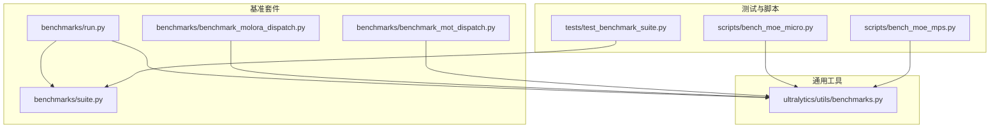
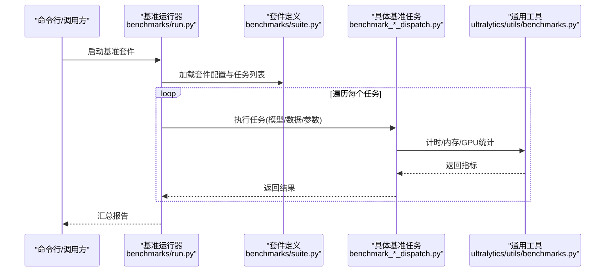
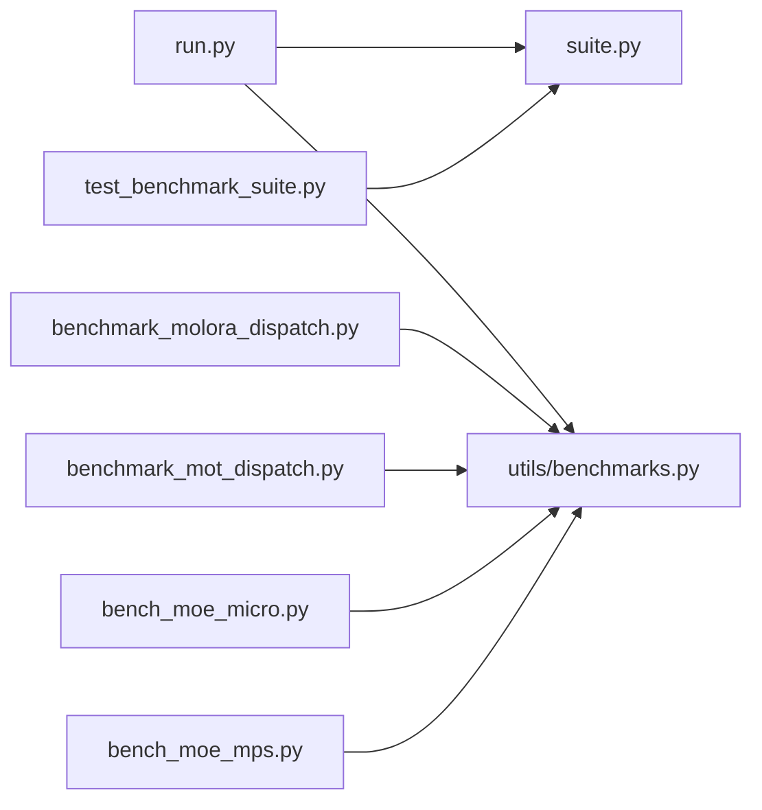

# 性能分析API

<cite>
**本文引用的文件**
- [benchmarks/run.py](file://benchmarks/run.py)
- [benchmarks/suite.py](file://benchmarks/suite.py)
- [benchmarks/benchmark_molora_dispatch.py](file://benchmarks/benchmark_molora_dispatch.py)
- [benchmarks/benchmark_mot_dispatch.py](file://benchmarks/benchmark_mot_dispatch.py)
- [ultralytics/utils/benchmarks.py](file://ultralytics/utils/benchmarks.py)
- [tests/test_benchmark_suite.py](file://tests/test_benchmark_suite.py)
- [scripts/bench_moe_micro.py](file://scripts/bench_moe_micro.py)
- [scripts/bench_moe_mps.py](file://scripts/bench_moe_mps.py)
</cite>

## 目录
1. [简介](#简介)
2. [项目结构](#项目结构)
3. [核心组件](#核心组件)
4. [架构总览](#架构总览)
5. [详细组件分析](#详细组件分析)
6. [依赖关系分析](#依赖关系分析)
7. [性能考量](#性能考量)
8. [故障排查指南](#故障排查指南)
9. [结论](#结论)
10. [附录](#附录)

## 简介
本文件面向YOLO-Master的性能分析与基准测试工具，聚焦以下目标：
- 记录推理速度、内存使用与GPU利用率等关键指标的测量方法
- 说明如何集成PyTorch Profiler与CUDA Profiler进行深度剖析
- 解释瓶颈识别与优化建议的生成机制
- 提供批量性能测试与结果对比的分析工具用法
- 给出性能回归检测与自动化测试集成的最佳实践
- 展示在生产环境中进行持续性能监控的实现方案

## 项目结构
仓库中与性能分析相关的代码主要分布在以下位置：
- benchmarks：基准套件定义与运行入口
- ultralytics/utils/benchmarks.py：通用基准与指标采集工具
- tests/test_benchmark_suite.py：基准套件的单元测试
- scripts：脚本化微基准（含MPS/MoE场景）

图表来源
- [benchmarks/run.py](file://benchmarks/run.py)
- [benchmarks/suite.py](file://benchmarks/suite.py)
- [benchmarks/benchmark_molora_dispatch.py](file://benchmarks/benchmark_molora_dispatch.py)
- [benchmarks/benchmark_mot_dispatch.py](file://benchmarks/benchmark_mot_dispatch.py)
- [ultralytics/utils/benchmarks.py](file://ultralytics/utils/benchmarks.py)
- [tests/test_benchmark_suite.py](file://tests/test_benchmark_suite.py)
- [scripts/bench_moe_micro.py](file://scripts/bench_moe_micro.py)
- [scripts/bench_moe_mps.py](file://scripts/bench_moe_mps.py)

章节来源
- [benchmarks/run.py](file://benchmarks/run.py)
- [benchmarks/suite.py](file://benchmarks/suite.py)
- [ultralytics/utils/benchmarks.py](file://ultralytics/utils/benchmarks.py)
- [tests/test_benchmark_suite.py](file://tests/test_benchmark_suite.py)
- [scripts/bench_moe_micro.py](file://scripts/bench_moe_micro.py)
- [scripts/bench_moe_mps.py](file://scripts/bench_moe_mps.py)

## 核心组件
- 基准运行器：负责加载套件、调度任务、汇总输出
- 套件定义：声明不同任务（如MolOrA路由、MoT路由）的输入、参数与指标
- 通用工具：封装时间/内存/GPU统计、预热、重复采样、异常处理等
- 测试与脚本：验证套件行为、覆盖特定平台或模块的微基准

章节来源
- [benchmarks/run.py](file://benchmarks/run.py)
- [benchmarks/suite.py](file://benchmarks/suite.py)
- [ultralytics/utils/benchmarks.py](file://ultralytics/utils/benchmarks.py)

## 架构总览
下图展示了从“运行入口”到“具体基准实现”再到“通用工具”的调用链。

图表来源
- [benchmarks/run.py](file://benchmarks/run.py)
- [benchmarks/suite.py](file://benchmarks/suite.py)
- [benchmarks/benchmark_molora_dispatch.py](file://benchmarks/benchmark_molora_dispatch.py)
- [benchmarks/benchmark_mot_dispatch.py](file://benchmarks/benchmark_mot_dispatch.py)
- [ultralytics/utils/benchmarks.py](file://ultralytics/utils/benchmarks.py)

## 详细组件分析

### 基准运行器（benchmarks/run.py）
职责
- 解析命令行参数与配置文件
- 初始化并驱动套件执行
- 聚合各任务的指标并输出报告

关键点
- 支持多任务并行或串行执行策略
- 统一的结果序列化与日志记录
- 对异常进行捕获与上报，保证批跑稳定性

章节来源
- [benchmarks/run.py](file://benchmarks/run.py)

### 套件定义（benchmarks/suite.py）
职责
- 声明基准任务清单、默认参数与数据集路径
- 为不同任务提供统一的接口契约

关键点
- 通过配置项控制是否启用某类任务
- 提供可复用的输入构造与预处理流程
- 便于扩展新任务而无需改动运行器

章节来源
- [benchmarks/suite.py](file://benchmarks/suite.py)

### 通用工具（ultralytics/utils/benchmarks.py）
职责
- 提供跨平台的性能采集能力：时间、内存、GPU占用
- 封装预热、重复采样、统计摘要（均值/方差/分位数）
- 兼容CPU/GPU/CUDA环境，自动选择最优设备

关键点
- 时间测量：包含同步点以避免异步误差
- 内存统计：区分峰值与常驻内存
- GPU统计：在可用时采集利用率与显存占用
- 错误边界：对不可用资源降级处理

章节来源
- [ultralytics/utils/benchmarks.py](file://ultralytics/utils/benchmarks.py)

### 具体基准任务
- Molora路由基准（benchmarks/benchmark_molora_dispatch.py）
  - 关注路由分发开销、专家激活比例、通信成本
  - 典型指标：每步延迟、吞吐、路由熵、专家负载不均衡度
- MoT路由基准（benchmarks/benchmark_mot_dispatch.py）
  - 关注跟踪场景下的路由与特征复用效率
  - 典型指标：帧级延迟、轨迹重建耗时、内存峰值

章节来源
- [benchmarks/benchmark_molora_dispatch.py](file://benchmarks/benchmark_molora_dispatch.py)
- [benchmarks/benchmark_mot_dispatch.py](file://benchmarks/benchmark_mot_dispatch.py)

### 测试与脚本
- 套件测试（tests/test_benchmark_suite.py）
  - 校验套件加载、任务枚举、指标字段完整性
  - 断言关键阈值，保障基准回归稳定
- 微基准脚本
  - scripts/bench_moe_micro.py：针对MoE子模块的细粒度基准
  - scripts/bench_moe_mps.py：在Apple MPS后端上的兼容性基准

章节来源
- [tests/test_benchmark_suite.py](file://tests/test_benchmark_suite.py)
- [scripts/bench_moe_micro.py](file://scripts/bench_moe_micro.py)
- [scripts/bench_moe_mps.py](file://scripts/bench_moe_mps.py)

## 依赖关系分析
- 运行器依赖套件定义与通用工具
- 具体任务依赖通用工具进行指标采集
- 测试覆盖套件与运行器的契约
- 脚本用于快速验证特定平台/模块

图表来源
- [benchmarks/run.py](file://benchmarks/run.py)
- [benchmarks/suite.py](file://benchmarks/suite.py)
- [benchmarks/benchmark_molora_dispatch.py](file://benchmarks/benchmark_molora_dispatch.py)
- [benchmarks/benchmark_mot_dispatch.py](file://benchmarks/benchmark_mot_dispatch.py)
- [ultralytics/utils/benchmarks.py](file://ultralytics/utils/benchmarks.py)
- [tests/test_benchmark_suite.py](file://tests/test_benchmark_suite.py)
- [scripts/bench_moe_micro.py](file://scripts/bench_moe_micro.py)
- [scripts/bench_moe_mps.py](file://scripts/bench_moe_mps.py)

章节来源
- [benchmarks/run.py](file://benchmarks/run.py)
- [benchmarks/suite.py](file://benchmarks/suite.py)
- [ultralytics/utils/benchmarks.py](file://ultralytics/utils/benchmarks.py)
- [tests/test_benchmark_suite.py](file://tests/test_benchmark_suite.py)
- [scripts/bench_moe_micro.py](file://scripts/bench_moe_micro.py)
- [scripts/bench_moe_mps.py](file://scripts/bench_moe_mps.py)

## 性能考量
- 预热与冷启动
  - 首次加载模型与算子编译会带来较大开销，应在正式采样前进行充分预热
- 重复采样与统计稳健性
  - 多次重复采样可降低抖动影响，建议使用中位数或分位数作为主指标
- 设备与并发
  - 确保GPU空闲且无其他进程干扰；合理设置批次大小与线程数
- 指标口径一致性
  - 明确端到端与内核级指标的区别，避免误读
- 资源限制
  - 在容器或受限环境中，注意显存上限与I/O带宽对吞吐的影响

[本节为通用指导，不涉及具体文件]

## 故障排查指南
常见问题与定位思路
- 指标缺失或为NaN
  - 检查设备可用性、CUDA驱动与PyTorch版本匹配
  - 确认预热阶段是否成功完成
- 结果不稳定
  - 增加重复次数，剔除首尾异常样本
  - 固定随机种子与数据顺序
- 内存泄漏迹象
  - 观察峰值与常驻内存差异，必要时释放中间张量
- 平台差异（如MPS）
  - 使用专用脚本验证后端兼容性，回退到CPU或CUDA以隔离问题

章节来源
- [tests/test_benchmark_suite.py](file://tests/test_benchmark_suite.py)
- [scripts/bench_moe_mps.py](file://scripts/bench_moe_mps.py)

## 结论
本性能分析体系通过“运行器+套件+通用工具”的分层设计，提供了可扩展、可复现的基准能力。结合测试与脚本，可在CI与生产环境中持续评估推理速度、内存与GPU利用情况，并为瓶颈识别与优化提供可靠依据。

[本节为总结性内容，不涉及具体文件]

## 附录

### API与用法要点
- 运行基准套件
  - 通过运行器加载套件并执行所有任务，输出汇总报告
- 新增自定义任务
  - 在套件中注册任务，实现统一接口，复用通用工具进行指标采集
- 批量对比与回归检测
  - 将每次运行的结果持久化，比较关键指标变化，触发告警或阻断

章节来源
- [benchmarks/run.py](file://benchmarks/run.py)
- [benchmarks/suite.py](file://benchmarks/suite.py)
- [tests/test_benchmark_suite.py](file://tests/test_benchmark_suite.py)

### 集成PyTorch Profiler与CUDA Profiler的建议
- PyTorch Profiler
  - 在关键推理循环前后开启/关闭Profiler，导出事件追踪文件供后续分析
- CUDA Profiler
  - 在GPU环境下使用系统级工具采集内核时序与内存访问模式
- 注意事项
  - Profiling会引入额外开销，建议在独立环境与代表性数据上进行
  - 将Profiling结果与常规指标关联，避免仅凭单一视图下结论

[本节为概念性指导，不涉及具体文件]

### 生产环境持续监控方案
- 定期执行轻量基准任务，记录延迟、吞吐与资源占用
- 建立基线与阈值，当指标偏离时触发告警
- 将结果纳入可视化看板，辅助容量规划与扩容决策

[本节为概念性指导，不涉及具体文件]