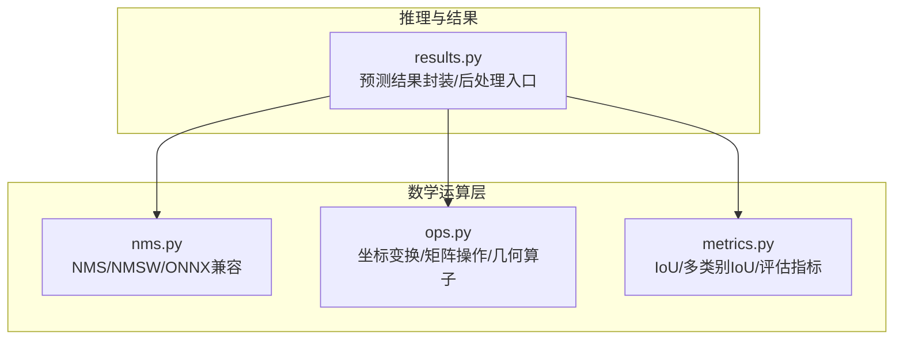
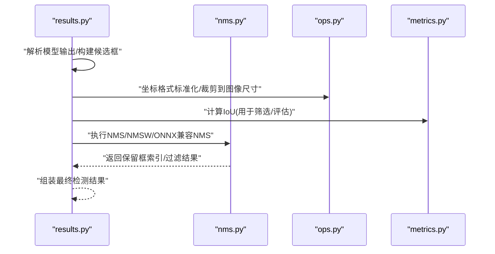
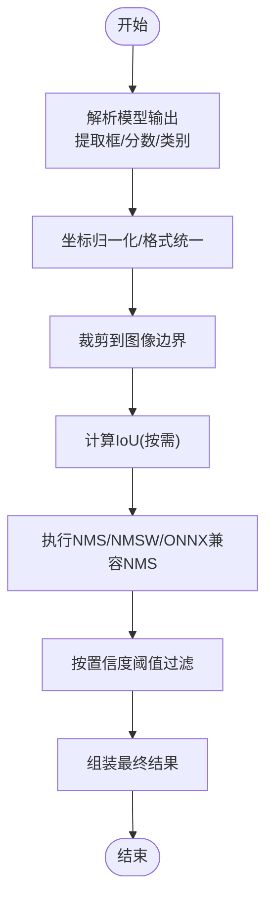
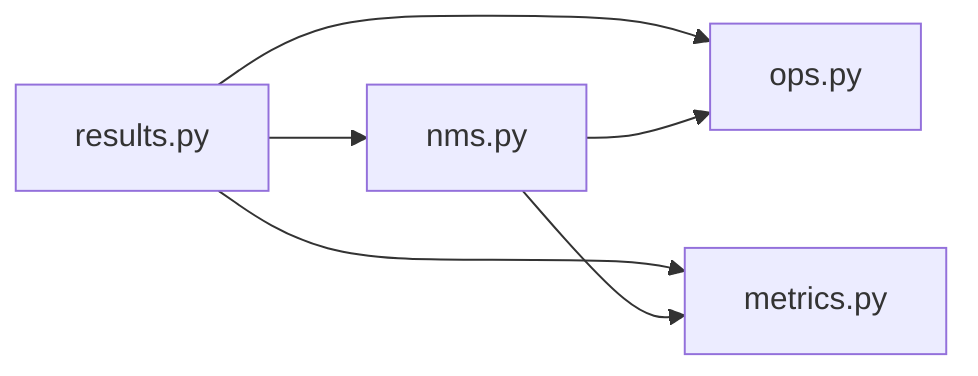

# 数学运算API

<cite>
**本文引用的文件**
- [ultralytics/utils/nms.py](file://ultralytics/utils/nms.py)
- [ultralytics/utils/ops.py](file://ultralytics/utils/ops.py)
- [ultralytics/utils/metrics.py](file://ultralytics/utils/metrics.py)
- [ultralytics/engine/results.py](file://ultralytics/engine/results.py)
</cite>

## 目录
1. [简介](#简介)
2. [项目结构](#项目结构)
3. [核心组件](#核心组件)
4. [架构总览](#架构总览)
5. [详细组件分析](#详细组件分析)
6. [依赖关系分析](#依赖关系分析)
7. [性能考虑](#性能考虑)
8. [故障排查指南](#故障排查指南)
9. [结论](#结论)
10. [附录](#附录)

## 简介
本文件为 YOLO-Master 的数学运算工具函数提供系统化文档，聚焦目标检测中的关键算法与实现：非极大值抑制（NMS）、交并比（IoU）计算、坐标变换以及常用矩阵操作。文档面向不同技术背景的读者，既给出接口说明、参数与返回值约定、使用示例路径，也解释算法原理、边界条件与错误处理策略，并提供性能优化建议。

## 项目结构
数学运算相关代码主要分布在以下模块：
- NMS 实现与变体：ultralytics/utils/nms.py
- 通用几何与张量操作：ultralytics/utils/ops.py
- 指标与 IoU 计算：ultralytics/utils/metrics.py
- 推理结果封装与后处理调用：ultralytics/engine/results.py

图表来源
- [ultralytics/utils/nms.py](file://ultralytics/utils/nms.py)
- [ultralytics/utils/ops.py](file://ultralytics/utils/ops.py)
- [ultralytics/utils/metrics.py](file://ultralytics/utils/metrics.py)
- [ultralytics/engine/results.py](file://ultralytics/engine/results.py)

章节来源
- [ultralytics/utils/nms.py](file://ultralytics/utils/nms.py)
- [ultralytics/utils/ops.py](file://ultralytics/utils/ops.py)
- [ultralytics/utils/metrics.py](file://ultralytics/utils/metrics.py)
- [ultralytics/engine/results.py](file://ultralytics/engine/results.py)

## 核心组件
本节概述各组件职责与典型输入输出约定，便于快速定位与集成。

- NMS（非极大值抑制）
  - 作用：在候选框集合中按置信度排序，抑制重叠度过高的冗余框，保留高质量检测结果。
  - 常见变体：标准NMS、带权重融合的NMS（NMSW）、对导出格式友好的ONNX兼容版本。
  - 典型输入：框坐标、置信度分数、可选类别索引；支持批量与单图两种模式。
  - 典型输出：保留框的索引或过滤后的框集。

- IoU（交并比）计算
  - 作用：衡量两个或多个边界框之间的重叠程度，是NMS与评估的核心度量。
  - 支持形式：两两IoU、一对多IoU、多类别IoU、旋转框IoU等。
  - 典型输入：两组或多组框坐标；可指定坐标格式（如xyxy、ltwh等）。
  - 典型输出：IoU矩阵或标量。

- 坐标变换
  - 作用：在不同表示之间转换，如中心宽高与左上右下、归一化与像素坐标、旋转角编码等。
  - 典型输入：源坐标数组与目标格式标识。
  - 典型输出：目标格式的坐标数组。

- 矩阵与几何操作
  - 作用：批量向量化的几何计算、广播对齐、数值稳定化处理等。
  - 典型输入：形状规整的张量或NumPy数组。
  - 典型输出：计算结果张量或布尔掩码。

章节来源
- [ultralytics/utils/nms.py](file://ultralytics/utils/nms.py)
- [ultralytics/utils/ops.py](file://ultralytics/utils/ops.py)
- [ultralytics/utils/metrics.py](file://ultralytics/utils/metrics.py)

## 架构总览
下图展示从推理结果到后处理的调用关系，以及数学运算模块如何被统一调度。

图表来源
- [ultralytics/engine/results.py](file://ultralytics/engine/results.py)
- [ultralytics/utils/nms.py](file://ultralytics/utils/nms.py)
- [ultralytics/utils/ops.py](file://ultralytics/utils/ops.py)
- [ultralytics/utils/metrics.py](file://ultralytics/utils/metrics.py)

## 详细组件分析

### NMS（非极大值抑制）
- 功能要点
  - 按类别分别进行抑制，避免跨类误抑制。
  - 支持多种框格式与批量维度，适配不同后端与导出需求。
  - 提供ONNX友好实现，便于部署到不支持复杂控制流的运行时。
- 典型接口约定
  - 输入：框坐标张量、置信度张量、可选类别索引、阈值（IoU阈值、置信度阈值）、最大输出框数。
  - 输出：保留框的索引或过滤后的框集（含类别与置信度）。
- 算法流程（概念性）
  - 按置信度降序排序
  - 选择最高分框作为当前最佳
  - 计算其与剩余框的IoU，剔除超过阈值的框
  - 重复直至无剩余框或达到最大输出数
- 边界条件与错误处理
  - 空输入或零个候选框：直接返回空结果。
  - 非法坐标（负面积、NaN/Inf）：需提前校验或裁剪，必要时跳过异常样本。
  - 阈值越界：将阈值限制在合理范围（如[0,1]），并对异常值给出警告或回退策略。
- 性能优化
  - 向量化IoU计算，减少Python循环。
  - 分批处理大场景，降低峰值内存。
  - ONNX兼容版采用图内算子替代分支，利于静态图优化。
- 使用示例（路径）
  - 参考：[ultralytics/engine/results.py](file://ultralytics/engine/results.py) 中对NMS的调用位置与参数传递方式。

章节来源
- [ultralytics/utils/nms.py](file://ultralytics/utils/nms.py)
- [ultralytics/engine/results.py](file://ultralytics/engine/results.py)

### IoU 计算
- 功能要点
  - 支持多种框格式与批量维度，提供高效的两两/一对多/多类别IoU计算。
  - 可用于NMS内部、训练损失、验证评估等场景。
- 典型接口约定
  - 输入：两组或多组框坐标、可选类别维度、坐标格式标识。
  - 输出：IoU矩阵（形状通常为[N×M]或[N×M×C]）。
- 算法流程（概念性）
  - 计算交集区域面积与并集区域面积
  - 比值即为IoU；对退化情况（面积为0）做数值稳定处理
- 边界条件与错误处理
  - 退化框（宽或高为0）：IoU定义为0或根据任务约定处理。
  - NaN/Inf：通过裁剪与掩码保证输出有效。
- 性能优化
  - 广播机制与向量化实现，避免显式循环。
  - 针对大批量场景的分块计算以降低内存占用。
- 使用示例（路径）
  - 参考：[ultralytics/utils/metrics.py](file://ultralytics/utils/metrics.py) 中的IoU计算函数及调用点。

章节来源
- [ultralytics/utils/metrics.py](file://ultralytics/utils/metrics.py)

### 坐标变换
- 功能要点
  - 在中心-宽高与左上-右下等格式间互转；支持归一化与像素坐标互转；支持旋转角编码。
  - 常与NMS/IoU配合，确保前后端一致。
- 典型接口约定
  - 输入：源坐标数组、目标格式标识、可选缩放因子或图像尺寸。
  - 输出：目标格式的坐标数组。
- 边界条件与错误处理
  - 越界坐标：裁剪至图像范围内。
  - 非法尺寸（<=0）：记录日志并跳过或置无效标记。
- 性能优化
  - 全向量化实现，利用广播与类型提升减少精度损失。
- 使用示例（路径）
  - 参考：[ultralytics/utils/ops.py](file://ultralytics/utils/ops.py) 中的坐标转换函数与调用点。

章节来源
- [ultralytics/utils/ops.py](file://ultralytics/utils/ops.py)

### 矩阵与几何操作
- 功能要点
  - 提供批量几何计算、掩码生成、形状对齐、数值稳定化等基础能力。
  - 支撑NMS与IoU的高效实现。
- 典型接口约定
  - 输入：形状规整的张量、掩码、阈值等。
  - 输出：计算结果张量或布尔掩码。
- 边界条件与错误处理
  - 形状不匹配：抛出明确错误或自动广播提示。
  - 数值溢出/下溢：引入epsilon或安全裁剪。
- 性能优化
  - 优先使用底层库的向量化算子；减少中间拷贝；复用缓冲区。
- 使用示例（路径）
  - 参考：[ultralytics/utils/ops.py](file://ultralytics/utils/ops.py) 中的几何与矩阵辅助函数。

章节来源
- [ultralytics/utils/ops.py](file://ultralytics/utils/ops.py)

### 端到端使用流程（目标检测后处理）

图表来源
- [ultralytics/engine/results.py](file://ultralytics/engine/results.py)
- [ultralytics/utils/nms.py](file://ultralytics/utils/nms.py)
- [ultralytics/utils/ops.py](file://ultralytics/utils/ops.py)
- [ultralytics/utils/metrics.py](file://ultralytics/utils/metrics.py)

## 依赖关系分析
- 耦合关系
  - results.py 作为后处理编排者，依赖 nms.py、ops.py、metrics.py 提供的原子能力。
  - nms.py 内部可能复用 ops.py 的几何与矩阵操作，并使用 metrics.py 的IoU计算。
- 外部依赖
  - 张量框架（如PyTorch/TensorRT/ONNXRuntime）的底层算子，影响性能与兼容性。
- 潜在风险
  - 形状广播不一致导致的隐式错误。
  - 不同后端对浮点精度的差异导致IoU/NMS稳定性波动。

图表来源
- [ultralytics/engine/results.py](file://ultralytics/engine/results.py)
- [ultralytics/utils/nms.py](file://ultralytics/utils/nms.py)
- [ultralytics/utils/ops.py](file://ultralytics/utils/ops.py)
- [ultralytics/utils/metrics.py](file://ultralytics/utils/metrics.py)

章节来源
- [ultralytics/engine/results.py](file://ultralytics/engine/results.py)
- [ultralytics/utils/nms.py](file://ultralytics/utils/nms.py)
- [ultralytics/utils/ops.py](file://ultralytics/utils/ops.py)
- [ultralytics/utils/metrics.py](file://ultralytics/utils/metrics.py)

## 性能考虑
- 向量化优先：尽量使用批量与广播，避免逐元素Python循环。
- 内存管理：对大图/高分辨率场景采用分块计算与就地操作，降低峰值内存。
- 数值稳定：在IoU与NMS中加入小常数epsilon，防止除零与NaN传播。
- 后端适配：ONNX/TensorRT环境下优先使用图内算子，减少动态控制流。
- 缓存与复用：对重复计算的中间结果进行缓存或重用，减少冗余。

## 故障排查指南
- 症状：NMS未过滤任何框
  - 检查IoU阈值是否过小或置信度阈值设置不当。
  - 确认框格式与坐标范围是否正确。
- 症状：出现NaN/Inf或崩溃
  - 检查输入数据合法性（负面积、越界坐标）。
  - 增加数值稳定项与安全裁剪。
- 症状：不同后端结果不一致
  - 核对数据类型与精度（float32 vs float16）。
  - 对比ONNX导出与原生实现的等价性。
- 症状：性能瓶颈
  - 定位热点函数（IoU/NMS），尝试分块或批大小调整。
  - 启用后端加速（如CUDA/TensorRT）并预热。

章节来源
- [ultralytics/utils/nms.py](file://ultralytics/utils/nms.py)
- [ultralytics/utils/ops.py](file://ultralytics/utils/ops.py)
- [ultralytics/utils/metrics.py](file://ultralytics/utils/metrics.py)
- [ultralytics/engine/results.py](file://ultralytics/engine/results.py)

## 结论
YOLO-Master 的数学运算工具以模块化方式组织，围绕NMS、IoU、坐标变换与矩阵操作形成稳定的后处理基座。通过向量化实现、数值稳定与后端适配，兼顾了准确性与性能。建议在集成时严格遵循接口约定，关注边界条件与错误处理，并结合具体部署环境进行性能调优。

## 附录
- 使用示例路径
  - NMS调用与参数传递：[ultralytics/engine/results.py](file://ultralytics/engine/results.py)
  - IoU计算与多类别IoU：[ultralytics/utils/metrics.py](file://ultralytics/utils/metrics.py)
  - 坐标变换与几何操作：[ultralytics/utils/ops.py](file://ultralytics/utils/ops.py)
  - NMS实现与ONNX兼容版本：[ultralytics/utils/nms.py](file://ultralytics/utils/nms.py)