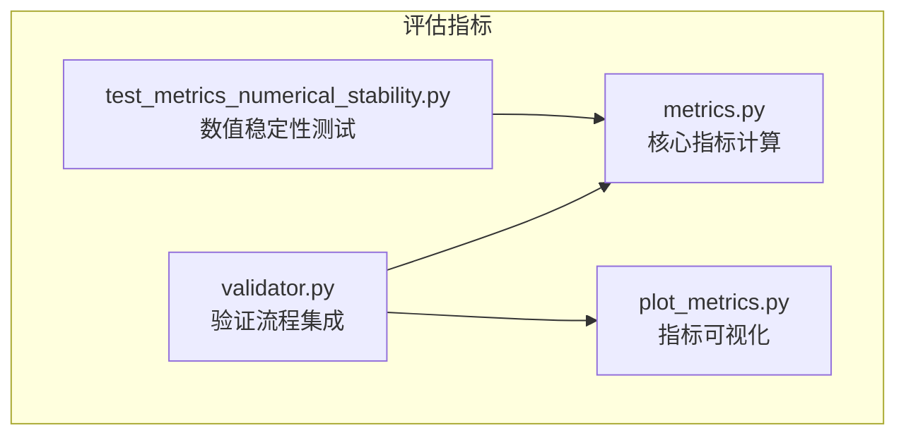
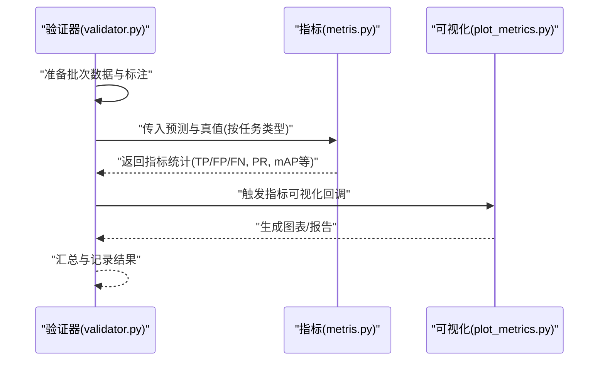
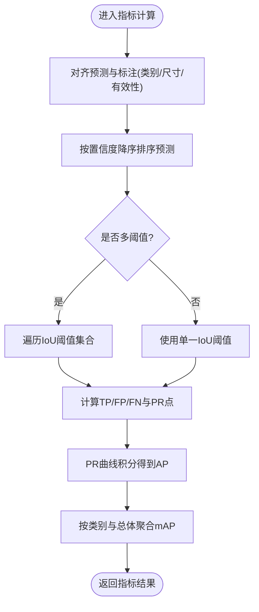
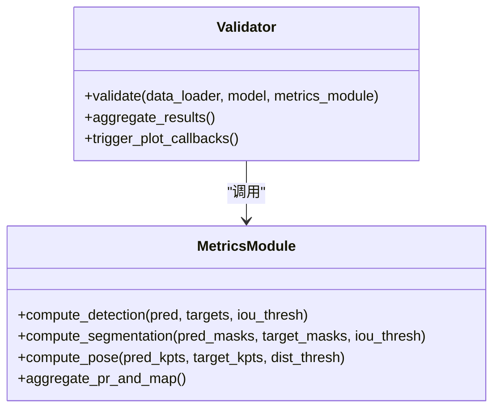
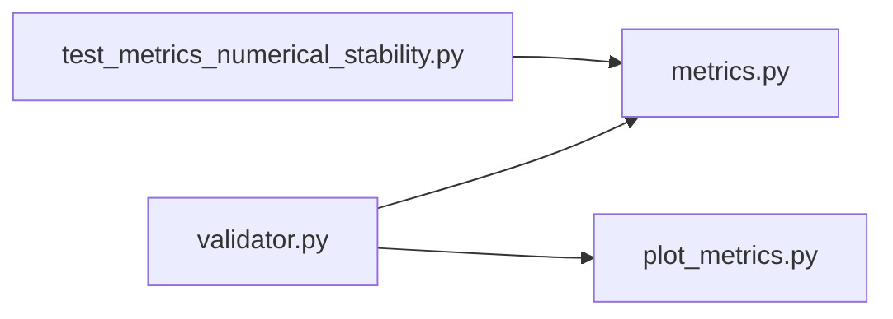

# 评估指标API

<cite>
**本文引用的文件**
- [ultralytics/utils/metrics.py](file://ultralytics/utils/metrics.py)
- [ultralytics/engine/validator.py](file://ultralytics/engine/validator.py)
- [ultralytics/utils/callbacks/plot_metrics.py](file://ultralytics/utils/callbacks/plot_metrics.py)
- [tests/test_metrics_numerical_stability.py](file://tests/test_metrics_numerical_stability.py)
</cite>

## 目录
1. [简介](#简介)
2. [项目结构](#项目结构)
3. [核心组件](#核心组件)
4. [架构总览](#架构总览)
5. [详细组件分析](#详细组件分析)
6. [依赖分析](#依赖分析)
7. [性能考虑](#性能考虑)
8. [故障排查指南](#故障排查指南)
9. [结论](#结论)
10. [附录](#附录)

## 简介
本文件面向YOLO-Master的模型评估指标工具函数，系统性梳理mAP（平均精度均值）、precision（精确率）、recall（召回率）、F1分数等核心指标的API接口与实现要点。文档覆盖目标检测、实例分割、姿态估计等不同任务的指标差异，解释关键数学原理与工程实现细节，并提供批量数据处理与内存优化的最佳实践，以及可视化指标结果的辅助函数使用说明。

## 项目结构
评估指标相关代码主要位于以下位置：
- 指标计算核心：ultralytics/utils/metrics.py
- 验证流程集成：ultralytics/engine/validator.py
- 指标可视化：ultralytics/utils/callbacks/plot_metrics.py
- 数值稳定性测试：tests/test_metrics_numerical_stability.py

图表来源
- [ultralytics/utils/metrics.py](file://ultralytics/utils/metrics.py)
- [ultralytics/engine/validator.py](file://ultralytics/engine/validator.py)
- [ultralytics/utils/callbacks/plot_metrics.py](file://ultralytics/utils/callbacks/plot_metrics.py)
- [tests/test_metrics_numerical_stability.py](file://tests/test_metrics_numerical_stability.py)

章节来源
- [ultralytics/utils/metrics.py](file://ultralytics/utils/metrics.py)
- [ultralytics/engine/validator.py](file://ultralytics/engine/validator.py)
- [ultralytics/utils/callbacks/plot_metrics.py](file://ultralytics/utils/callbacks/plot_metrics.py)
- [tests/test_metrics_numerical_stability.py](file://tests/test_metrics_numerical_stability.py)

## 核心组件
- 指标计算核心（metrics.py）
  - 提供各类任务的核心指标计算函数，包括：
    - 目标检测：mAP@IoU阈值、precision、recall、F1、混淆矩阵、PR曲线等
    - 实例分割：基于掩码IoU的mAP、像素级指标（如mIoU）等
    - 姿态估计：关键点匹配与距离阈值下的PCK/AP等
  - 支持多类别、多阈值、多尺度（不同IoU阈值集合）的聚合统计
  - 内部维护TP/FP/FN计数、置信度排序、类别对齐、重复预测去重等逻辑
- 验证流程集成（validator.py）
  - 在验证循环中调用指标模块，汇总每个batch的结果并累积全局统计
  - 负责将模型输出与标注进行对齐、过滤无效样本、触发可视化回调
- 指标可视化（plot_metrics.py）
  - 生成PR曲线、混淆矩阵图、每类指标表格等
  - 支持导出图片与HTML报告，便于离线分析与归档
- 数值稳定性测试（test_metrics_numerical_stability.py）
  - 针对边界条件与极端分布进行回归测试，确保指标计算的鲁棒性

章节来源
- [ultralytics/utils/metrics.py](file://ultralytics/utils/metrics.py)
- [ultralytics/engine/validator.py](file://ultralytics/engine/validator.py)
- [ultralytics/utils/callbacks/plot_metrics.py](file://ultralytics/utils/callbacks/plot_metrics.py)
- [tests/test_metrics_numerical_stability.py](file://tests/test_metrics_numerical_stability.py)

## 架构总览
下图展示了从验证器到指标计算再到可视化的整体数据流与控制流。

图表来源
- [ultralytics/engine/validator.py](file://ultralytics/engine/validator.py)
- [ultralytics/utils/metrics.py](file://ultralytics/utils/metrics.py)
- [ultralytics/utils/callbacks/plot_metrics.py](file://ultralytics/utils/callbacks/plot_metrics.py)

## 详细组件分析

### 指标计算核心（metrics.py）
- 设计要点
  - 统一接口：针对不同任务提供一致的输入约定（预测框/掩码/关键点、置信度、类别ID），内部根据任务类型选择对应匹配策略
  - 阈值与聚合：支持单阈值与多阈值（如COCO的[0.50:0.05:0.95]）；按类别与总体两类维度聚合
  - 去重与排序：对同一目标的多次命中采用贪心匹配或匈牙利匹配，依据置信度降序优先保留高置信度预测
- 关键指标与数学原理
  - precision/recall/F1
    - precision = TP / (TP + FP)
    - recall = TP / (TP + FN)
    - F1 = 2 * precision * recall / (precision + recall)
  - AP与mAP
    - AP为PR曲线下面积（常用插值法或COCO式严格积分）
    - mAP为各类AP的平均，或在多IoU阈值下再平均
  - 实例分割
    - 使用掩码IoU替代框IoU，其余流程与检测类似
  - 姿态估计
    - 以关键点距离阈值判定匹配成功，计算每类AP/PCK等
- 数据结构与复杂度
  - 典型输入规模：N个预测、G个真值、C个类别
  - 匹配阶段复杂度近似O(N·G)，在多类别与多阈值场景下需控制批大小与阈值数量
  - 内存占用与N、G、C成正比，建议分块处理与增量聚合
- 错误处理与边界条件
  - 空预测/空真值：返回NaN或零值，避免除零
  - 类别缺失：跳过未出现类别或填充零行
  - 数值稳定性：对极小概率与接近0/1的置信度做裁剪与平滑

图表来源
- [ultralytics/utils/metrics.py](file://ultralytics/utils/metrics.py)

章节来源
- [ultralytics/utils/metrics.py](file://ultralytics/utils/metrics.py)

### 验证流程集成（validator.py）
- 职责
  - 组织数据加载与预处理
  - 调用指标模块进行逐批统计，并在验证结束时汇总全局指标
  - 触发可视化回调，保存图表与日志
- 与指标模块的交互
  - 通过任务类型参数选择对应的指标函数
  - 将预测张量与标注张量按约定格式传递
  - 接收指标字典并写入日志/回调系统

图表来源
- [ultralytics/engine/validator.py](file://ultralytics/engine/validator.py)
- [ultralytics/utils/metrics.py](file://ultralytics/utils/metrics.py)

章节来源
- [ultralytics/engine/validator.py](file://ultralytics/engine/validator.py)
- [ultralytics/utils/metrics.py](file://ultralytics/utils/metrics.py)

### 指标可视化（plot_metrics.py）
- 功能
  - 绘制PR曲线、混淆矩阵热力图、每类指标条形图
  - 生成可复用的HTML报告，包含关键指标摘要与图表
- 使用方式
  - 在验证回调中传入指标字典与类别名列表
  - 指定输出路径与分辨率，支持批量导出
- 注意事项
  - 大量类别时建议分页或采样展示
  - 高分辨率大图可能占用较多内存，建议在CPU环境或限制并发

章节来源
- [ultralytics/utils/callbacks/plot_metrics.py](file://ultralytics/utils/callbacks/plot_metrics.py)

### 数值稳定性测试（test_metrics_numerical_stability.py）
- 目的
  - 验证在极端分布、空集、全负样本、重叠严重等场景下的指标行为
- 方法
  - 构造边界用例，断言返回值范围与一致性
  - 对比不同阈值集合与类别顺序对最终mAP的影响
- 价值
  - 保障指标模块在不同数据集与训练阶段的鲁棒性

章节来源
- [tests/test_metrics_numerical_stability.py](file://tests/test_metrics_numerical_stability.py)

## 依赖分析
- 组件耦合
  - validator.py依赖metrics.py完成指标计算，并通过回调机制与plot_metrics.py协作
  - 测试用例直接依赖metrics.py，确保核心算法正确性与稳定性
- 外部依赖
  - 数值计算依赖底层张量库（如NumPy/Torch），注意dtype与设备一致性
  - 可视化依赖绘图库（如Matplotlib），注意字体与后端兼容性

图表来源
- [ultralytics/engine/validator.py](file://ultralytics/engine/validator.py)
- [ultralytics/utils/metrics.py](file://ultralytics/utils/metrics.py)
- [ultralytics/utils/callbacks/plot_metrics.py](file://ultralytics/utils/callbacks/plot_metrics.py)
- [tests/test_metrics_numerical_stability.py](file://tests/test_metrics_numerical_stability.py)

章节来源
- [ultralytics/engine/validator.py](file://ultralytics/engine/validator.py)
- [ultralytics/utils/metrics.py](file://ultralytics/utils/metrics.py)
- [ultralytics/utils/callbacks/plot_metrics.py](file://ultralytics/utils/callbacks/plot_metrics.py)
- [tests/test_metrics_numerical_stability.py](file://tests/test_metrics_numerical_stability.py)

## 性能考虑
- 批量处理
  - 合理设置batch size，避免单次处理过多样本导致内存峰值过高
  - 对超大类别数或长尾分布，可采用分桶或分层聚合策略
- 内存优化
  - 使用增量聚合：每批计算后释放中间张量，仅保留必要统计
  - 避免复制大对象，尽量原地操作与视图引用
- 计算加速
  - 利用向量化运算与GPU并行，减少Python层循环
  - 对多IoU阈值场景，合并阈值维度以减少重复匹配
- I/O与可视化
  - 延迟生成大图，仅在需要时渲染
  - 使用异步回调与队列化输出，降低主流程阻塞

## 故障排查指南
- 常见问题
  - 指标为NaN或异常值：检查空预测/空真值分支与除零保护
  - mAP偏低：确认类别映射一致、标签格式正确、IoU阈值设置合理
  - 可视化空白：检查类别名列表长度与指标字典键是否匹配
- 定位步骤
  - 打印每批TP/FP/FN与置信度分布，观察匹配质量
  - 缩小阈值集合与类别子集，逐步复现问题
  - 运行数值稳定性测试用例，确认边界条件通过
- 修复建议
  - 增加输入校验与断言，提前捕获非法状态
  - 对极端分布启用平滑与裁剪策略，提升数值稳定性

章节来源
- [tests/test_metrics_numerical_stability.py](file://tests/test_metrics_numerical_stability.py)
- [ultralytics/utils/metrics.py](file://ultralytics/utils/metrics.py)

## 结论
YOLO-Master的评估指标体系围绕统一的指标计算核心构建，结合验证流程与可视化模块形成完整的评估闭环。通过合理的批量与内存策略、严格的数值稳定性测试，可在多种任务（检测、分割、姿态）上获得稳定可靠的评估结果。建议在实际工程中遵循本文的最佳实践，并结合具体数据集特性调整阈值与聚合策略。

## 附录
- API参考（概念性说明）
  - compute_detection(pred_boxes, confidences, labels, targets, iou_thresholds)
    - 输入：预测框、置信度、类别标签、真值框、IoU阈值集合
    - 输出：PR曲线、AP、mAP、混淆矩阵等
  - compute_segmentation(pred_masks, target_masks, iou_thresholds)
    - 输入：预测掩码、真值掩码、IoU阈值集合
    - 输出：掩码IoU驱动的AP、mAP、像素级指标
  - compute_pose(pred_kpts, target_kpts, distance_thresholds)
    - 输入：预测关键点、真值关键点、距离阈值集合
    - 输出：关键点匹配AP/PCK等
  - aggregate_pr_and_map(pr_points, classes, thresholds)
    - 输入：PR点序列、类别列表、阈值集合
    - 输出：各类AP与总体mAP
- 可视化辅助
  - plot_pr_curve(pr_data, class_names, save_path)
  - plot_confusion_matrix(cm, class_names, save_path)
  - generate_report(metrics_dict, output_dir)