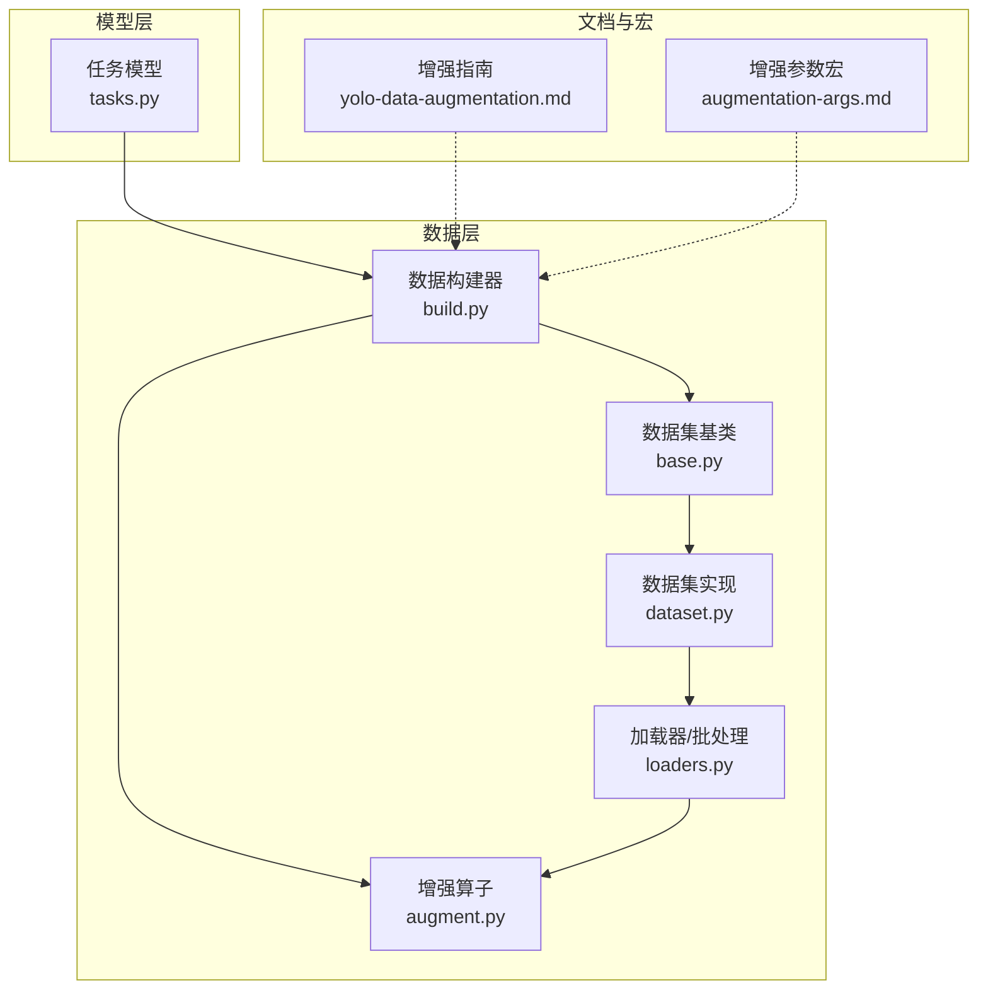
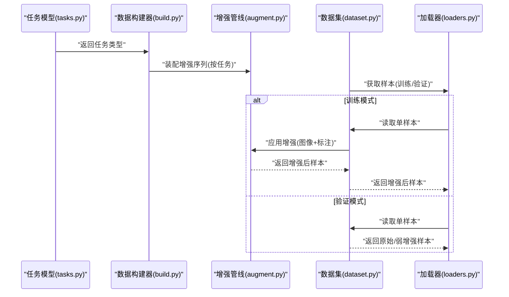
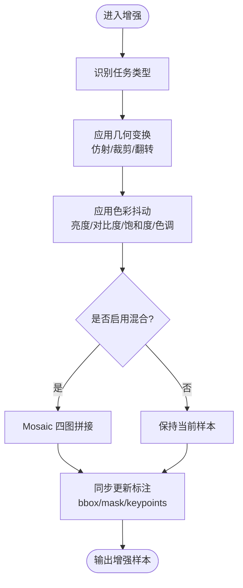
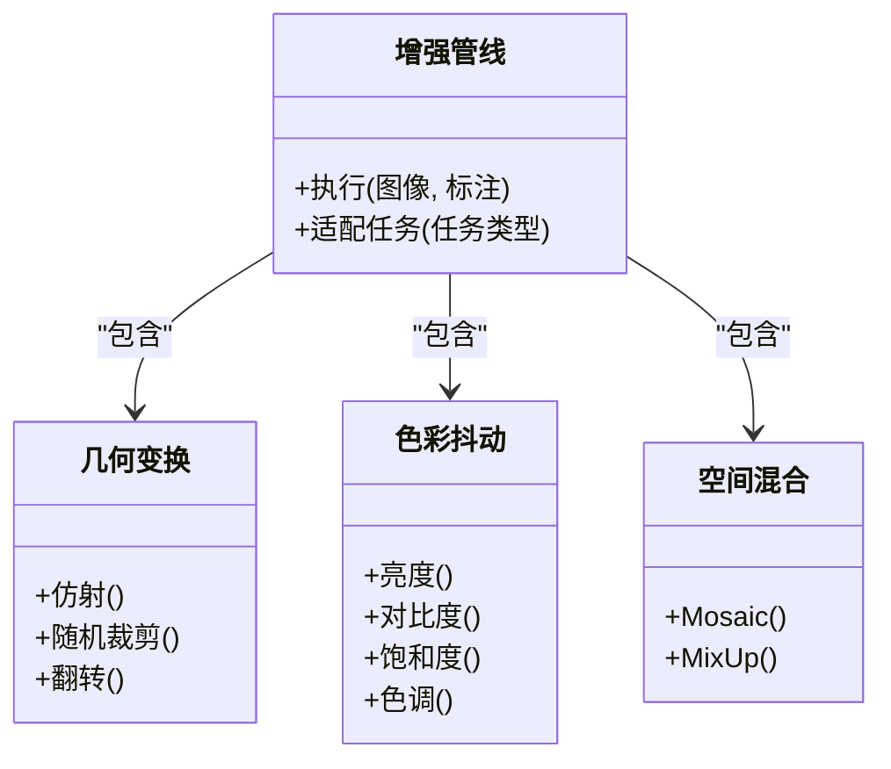
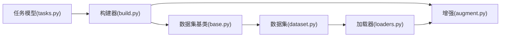

# 数据增强

<cite>
**本文引用的文件**
- [ultralytics/data/augment.py](file://ultralytics/data/augment.py)
- [ultralytics/data/base.py](file://ultralytics/data/base.py)
- [ultralytics/data/build.py](file://ultralytics/data/build.py)
- [ultralytics/data/dataset.py](file://ultralytics/data/dataset.py)
- [ultralytics/data/loaders.py](file://ultralytics/data/loaders.py)
- [ultralytics/data/utils.py](file://ultralytics/data/utils.py)
- [ultralytics/nn/tasks.py](file://ultralytics/nn/tasks.py)
- [docs/en/guides/yolo-data-augmentation.md](file://docs/en/guides/yolo-data-augmentation.md)
- [docs/macros/augmentation-args.md](file://docs/macros/augmentation-args.md)
</cite>

## 目录
1. [简介](#简介)
2. [项目结构](#项目结构)
3. [核心组件](#核心组件)
4. [架构总览](#架构总览)
5. [详细组件分析](#详细组件分析)
6. [依赖关系分析](#依赖关系分析)
7. [性能考量](#性能考量)
8. [故障排查指南](#故障排查指南)
9. [结论](#结论)
10. [附录](#附录)

## 简介
本文件面向YOLO-Master的数据增强API，系统性梳理图像增强的实现与使用方式，覆盖Mosaic、MixUp、随机裁剪、颜色抖动、几何变换等常用策略；说明参数配置与组合方法；解释针对检测、分割、姿态估计等任务的专用增强技术；提供自定义增强算法的开发接口与集成路径；并给出可视化验证工具与性能评估方法，以及基于数据集特点的增强策略选择与参数调优建议。

## 项目结构
数据增强相关代码主要位于数据加载与预处理模块中，围绕“任务感知”的增强流水线组织：
- 增强算子定义与组合：在增强模块中集中实现各类变换（如Mosaic、MixUp、仿射、色彩、随机裁剪等），并提供统一的调用接口。
- 构建与装配：数据构建器根据任务类型装配增强管线，将基础变换与任务特定增强串联。
- 数据集与加载器：数据集类负责读取样本与标注，并在训练阶段按批次触发增强；加载器负责批处理、多进程与缓存。
- 任务模型：任务模型提供任务类型信息，用于驱动任务特定的增强分支。

图表来源
- [ultralytics/data/augment.py](file://ultralytics/data/augment.py)
- [ultralytics/data/build.py](file://ultralytics/data/build.py)
- [ultralytics/data/base.py](file://ultralytics/data/base.py)
- [ultralytics/data/dataset.py](file://ultralytics/data/dataset.py)
- [ultralytics/data/loaders.py](file://ultralytics/data/loaders.py)
- [ultralytics/nn/tasks.py](file://ultralytics/nn/tasks.py)
- [docs/en/guides/yolo-data-augmentation.md](file://docs/en/guides/yolo-data-augmentation.md)
- [docs/macros/augmentation-args.md](file://docs/macros/augmentation-args.md)

章节来源
- [ultralytics/data/augment.py](file://ultralytics/data/augment.py)
- [ultralytics/data/build.py](file://ultralytics/data/build.py)
- [ultralytics/data/base.py](file://ultralytics/data/base.py)
- [ultralytics/data/dataset.py](file://ultralytics/data/dataset.py)
- [ultralytics/data/loaders.py](file://ultralytics/data/loaders.py)
- [ultralytics/nn/tasks.py](file://ultralytics/nn/tasks.py)
- [docs/en/guides/yolo-data-augmentation.md](file://docs/en/guides/yolo-data-augmentation.md)
- [docs/macros/augmentation-args.md](file://docs/macros/augmentation-args.md)

## 核心组件
- 增强算子库：封装常见图像与标注同步变换，包括几何（仿射、旋转、缩放、翻转）、色彩（亮度、对比度、饱和度、色调）、空间（随机裁剪、马赛克、混合）等。
- 任务感知装配：依据任务类型（检测、分割、姿态估计等）动态装配增强序列，确保对边界框、掩码、关键点等标注的一致性变换。
- 数据构建器：负责解析配置、实例化增强管线、绑定到数据集与加载器，支持训练/验证模式切换。
- 数据集与加载器：在训练阶段按需启用增强，保证批内并行与多进程安全；验证阶段禁用或弱化增强以保证评测一致性。

章节来源
- [ultralytics/data/augment.py](file://ultralytics/data/augment.py)
- [ultralytics/data/build.py](file://ultralytics/data/build.py)
- [ultralytics/data/base.py](file://ultralytics/data/base.py)
- [ultralytics/data/dataset.py](file://ultralytics/data/dataset.py)
- [ultralytics/data/loaders.py](file://ultralytics/data/loaders.py)

## 架构总览
下图展示从任务模型到数据增强的端到端流程：任务模型提供任务类型，构建器据此装配增强管线，数据集在训练时调用增强，加载器完成批处理与并发。

图表来源
- [ultralytics/nn/tasks.py](file://ultralytics/nn/tasks.py)
- [ultralytics/data/build.py](file://ultralytics/data/build.py)
- [ultralytics/data/augment.py](file://ultralytics/data/augment.py)
- [ultralytics/data/dataset.py](file://ultralytics/data/dataset.py)
- [ultralytics/data/loaders.py](file://ultralytics/data/loaders.py)

## 详细组件分析

### 通用增强算子
- 几何变换：仿射（平移、缩放、旋转、剪切）、随机裁剪、随机翻转。这些变换需同步更新边界框、掩码与关键点坐标。
- 色彩抖动：亮度、对比度、饱和度、色调扰动，提升模型对光照与色偏的鲁棒性。
- 空间混合：Mosaic（四图拼接）、MixUp（线性插值混合），用于丰富场景多样性与类别分布。

图表来源
- [ultralytics/data/augment.py](file://ultralytics/data/augment.py)
- [ultralytics/data/build.py](file://ultralytics/data/build.py)

章节来源
- [ultralytics/data/augment.py](file://ultralytics/data/augment.py)

### 任务特定增强
- 检测任务：重点在于边界框的完整性与合理性。Mosaic常用于小目标增强；仿射与随机裁剪需避免过度裁剪导致目标丢失。
- 分割任务：掩码需与图像同步变换，注意插值方式（最近邻）以保持标签离散性；Mosaic与MixUp同样适用但需严格对齐掩码。
- 姿态估计：关键点坐标随几何变换一致更新；旋转与缩放时需考虑人体关节拓扑约束，避免产生不合理姿态。

图表来源
- [ultralytics/data/augment.py](file://ultralytics/data/augment.py)
- [ultralytics/data/build.py](file://ultralytics/data/build.py)

章节来源
- [ultralytics/data/augment.py](file://ultralytics/data/augment.py)
- [ultralytics/data/build.py](file://ultralytics/data/build.py)

### 参数配置与组合
- 参数来源：增强参数可通过配置文件或宏定义进行集中管理，便于在不同任务与数据集间复用。
- 组合策略：通常先进行几何变换，再进行色彩抖动，最后视情况启用空间混合；不同任务可调整概率与强度以平衡多样性和标注一致性。
- 推荐实践：
  - 检测：适度提高Mosaic概率，控制裁剪比例以避免小目标被裁掉。
  - 分割：保持掩码插值为最近邻，降低过强色彩抖动对精细边界的干扰。
  - 姿态估计：限制大角度旋转与大幅缩放，确保关键点合理性与可见性。

章节来源
- [docs/macros/augmentation-args.md](file://docs/macros/augmentation-args.md)
- [docs/en/guides/yolo-data-augmentation.md](file://docs/en/guides/yolo-data-augmentation.md)

### 自定义增强开发接口与集成
- 扩展点：在增强管线中注册新的变换算子，并确保其对图像与标注（bbox/mask/keypoints）的同步更新逻辑正确。
- 集成步骤：
  1) 在增强模块中实现新算子，遵循统一输入输出契约。
  2) 在构建器中将该算子加入任务特定的增强序列。
  3) 通过配置开关控制启用与否及参数范围。
- 注意事项：
  - 保持数值稳定性与数据类型一致性。
  - 在多进程环境下确保随机种子与状态隔离。
  - 对标注的变换需满足几何一致性（例如仿射矩阵应用于所有标注）。

章节来源
- [ultralytics/data/augment.py](file://ultralytics/data/augment.py)
- [ultralytics/data/build.py](file://ultralytics/data/build.py)

### 可视化验证工具
- 快速验证：在训练脚本或独立脚本中抽取少量样本，依次应用各增强并保存结果图，人工检查标注一致性。
- 批量统计：记录增强前后关键指标（如目标数量、平均尺寸、关键点可见率），辅助定位异常增强。
- 建议流程：
  - 固定随机种子，复现实验结果。
  - 分别对检测、分割、姿态样本进行验证。
  - 结合可视化叠加显示（如绘制bbox、mask、关键点）确认变换正确性。

章节来源
- [docs/en/guides/yolo-data-augmentation.md](file://docs/en/guides/yolo-data-augmentation.md)

### 性能评估方法
- 训练效率：监控每步耗时、GPU利用率与内存峰值，评估增强对吞吐的影响。
- 泛化效果：在验证集上对比开启/关闭特定增强的指标变化（如mAP、mIoU、PCK），量化收益。
- 消融实验：逐项替换或关闭增强，观察对收敛速度与最终性能的贡献。

章节来源
- [docs/en/guides/yolo-data-augmentation.md](file://docs/en/guides/yolo-data-augmentation.md)

## 依赖关系分析
- 组件耦合：
  - 构建器依赖任务模型的任务类型，决定增强序列。
  - 数据集与加载器在训练阶段调用增强管线，验证阶段可能禁用或弱化增强。
  - 增强管线内部模块相互独立，通过统一接口组合。
- 外部依赖：
  - 图像处理与数值计算库（如NumPy、OpenCV、TorchVision等）为底层实现提供支持。
  - 多进程与线程池用于加速数据加载与增强。

图表来源
- [ultralytics/nn/tasks.py](file://ultralytics/nn/tasks.py)
- [ultralytics/data/build.py](file://ultralytics/data/build.py)
- [ultralytics/data/augment.py](file://ultralytics/data/augment.py)
- [ultralytics/data/base.py](file://ultralytics/data/base.py)
- [ultralytics/data/dataset.py](file://ultralytics/data/dataset.py)
- [ultralytics/data/loaders.py](file://ultralytics/data/loaders.py)

章节来源
- [ultralytics/nn/tasks.py](file://ultralytics/nn/tasks.py)
- [ultralytics/data/build.py](file://ultralytics/data/build.py)
- [ultralytics/data/augment.py](file://ultralytics/data/augment.py)
- [ultralytics/data/base.py](file://ultralytics/data/base.py)
- [ultralytics/data/dataset.py](file://ultralytics/data/dataset.py)
- [ultralytics/data/loaders.py](file://ultralytics/data/loaders.py)

## 性能考量
- 计算开销：Mosaic与MixUp会引入额外CPU/GPU负载，建议在数据加载阶段并行执行，避免阻塞训练主循环。
- I/O瓶颈：多进程加载与缓存可减少磁盘I/O压力，配合合理的batch size与workers数。
- 精度权衡：过强的增强可能导致标注噪声增加，需通过消融实验找到最佳平衡点。
- 设备差异：在CPU与GPU环境下的性能表现不同，应分别调参以获得稳定吞吐。

[本节为通用指导，不直接分析具体文件]

## 故障排查指南
- 标注不一致：检查几何变换对bbox/mask/keypoints的同步更新逻辑，确保仿射矩阵应用正确。
- 目标丢失：调整裁剪比例与Mosaic拼接策略，避免小目标被裁切或遮挡。
- 掩码失真：确认掩码插值方式为最近邻，避免双线性插值破坏标签离散性。
- 关键点异常：限制旋转与缩放幅度，检查关键点可见性过滤逻辑。
- 性能退化：减少增强强度或关闭部分增强，观察吞吐与指标变化，定位瓶颈。

章节来源
- [ultralytics/data/augment.py](file://ultralytics/data/augment.py)
- [ultralytics/data/build.py](file://ultralytics/data/build.py)

## 结论
YOLO-Master的数据增强体系以任务感知为核心，通过模块化增强算子与灵活装配机制，实现对检测、分割、姿态估计等多任务的统一支持。合理配置与组合增强参数，结合可视化验证与性能评估，可在保证标注一致性的前提下显著提升模型泛化能力。对于自定义增强，遵循统一接口与同步更新原则即可无缝集成。

[本节为总结性内容，不直接分析具体文件]

## 附录
- 参考文档：
  - 增强指南：[docs/en/guides/yolo-data-augmentation.md](file://docs/en/guides/yolo-data-augmentation.md)
  - 增强参数宏：[docs/macros/augmentation-args.md](file://docs/macros/augmentation-args.md)
- 核心实现：
  - 增强算子与管线：[ultralytics/data/augment.py](file://ultralytics/data/augment.py)
  - 数据构建器：[ultralytics/data/build.py](file://ultralytics/data/build.py)
  - 数据集与加载器：[ultralytics/data/base.py](file://ultralytics/data/base.py), [ultralytics/data/dataset.py](file://ultralytics/data/dataset.py), [ultralytics/data/loaders.py](file://ultralytics/data/loaders.py)
  - 任务模型：[ultralytics/nn/tasks.py](file://ultralytics/nn/tasks.py)