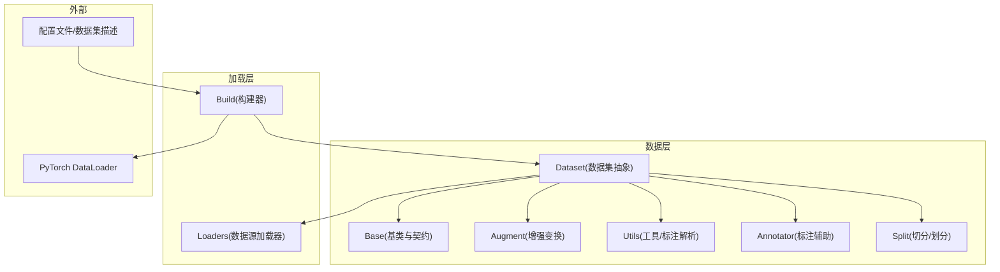
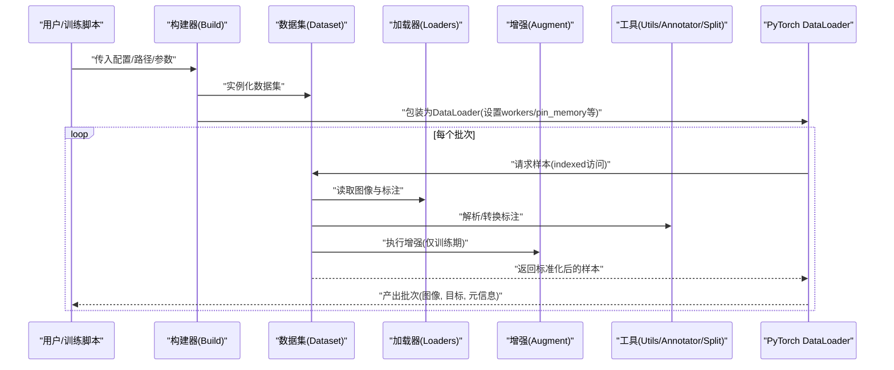
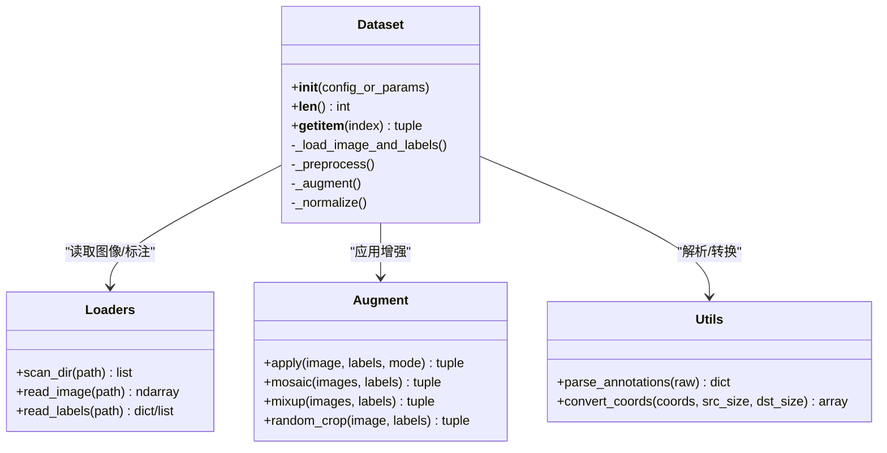
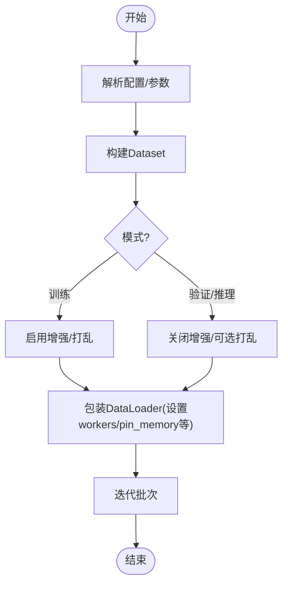
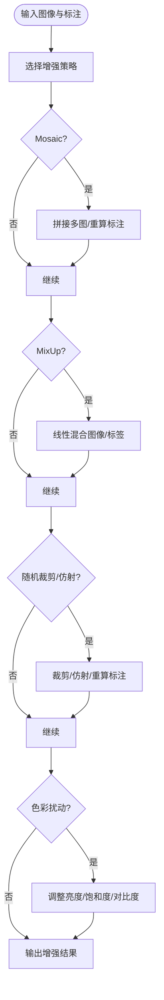
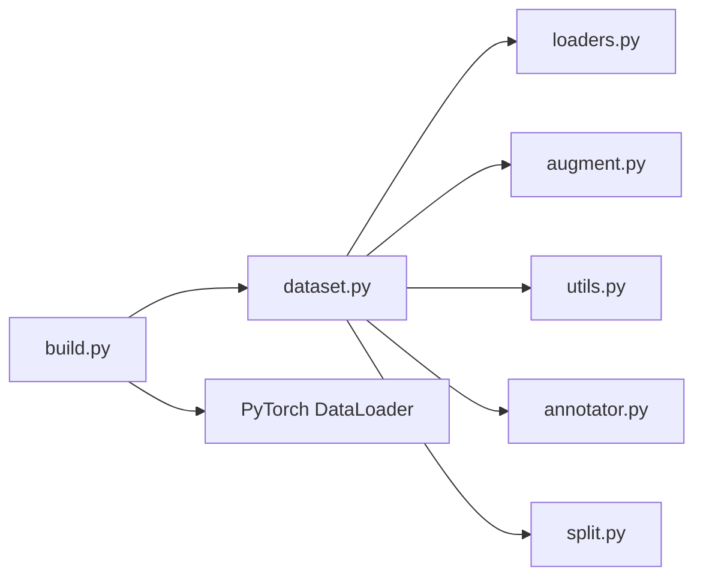

# 数据处理API

<cite>
**本文引用的文件**
- [ultralytics/data/dataset.py](file://ultralytics/data/dataset.py)
- [ultralytics/data/build.py](file://ultralytics/data/build.py)
- [ultralytics/data/loaders.py](file://ultralytics/data/loaders.py)
- [ultralytics/data/augment.py](file://ultralytics/data/augment.py)
- [ultralytics/data/base.py](file://ultralytics/data/base.py)
- [ultralytics/data/utils.py](file://ultralytics/data/utils.py)
- [ultralytics/data/annotator.py](file://ultralytics/data/annotator.py)
- [ultralytics/data/split.py](file://ultralytics/data/split.py)
- [ultralytics/data/scripts/coco8.yaml](file://ultralytics/cfg/datasets/coco8.yaml)
</cite>

## 目录
1. [简介](#简介)
2. [项目结构](#项目结构)
3. [核心组件](#核心组件)
4. [架构总览](#架构总览)
5. [详细组件分析](#详细组件分析)
6. [依赖关系分析](#依赖关系分析)
7. [性能考虑](#性能考虑)
8. [故障排查指南](#故障排查指南)
9. [结论](#结论)
10. [附录](#附录)

## 简介
本文件面向YOLO-Master的数据处理API，聚焦于数据加载、预处理与增强、DataLoader构建与管理、自定义数据集开发接口、多进程数据管道配置与调优、以及大规模数据集与内存管理实践。文档以代码级分析为基础，提供可视化图示与最佳实践建议，帮助读者快速搭建高效稳定的训练数据流水线。

## 项目结构
数据处理相关代码集中在 ultralytics/data 目录下，围绕“数据集抽象—加载器—增强—工具”分层组织：
- dataset.py：定义统一的数据集类与索引访问语义，封装图像与标注的读取、归一化、任务适配等逻辑。
- build.py：负责从配置或路径构建数据集对象与DataLoader实例，协调多进程、批处理、打乱策略等。
- loaders.py：提供多种数据源加载器（如按目录扫描、按列表迭代、按流式输入等），并实现统一的迭代协议。
- augment.py：集中实现各类数据增强变换（Mosaic、MixUp、随机裁剪、色彩抖动、仿射变换等）。
- base.py：定义数据集基类与通用接口契约，便于扩展新任务或新格式。
- utils.py / annotator.py / split.py：提供标注解析、坐标转换、分割切分等辅助能力。

图表来源
- [ultralytics/data/dataset.py](file://ultralytics/data/dataset.py)
- [ultralytics/data/build.py](file://ultralytics/data/build.py)
- [ultralytics/data/loaders.py](file://ultralytics/data/loaders.py)
- [ultralytics/data/augment.py](file://ultralytics/data/augment.py)
- [ultralytics/data/base.py](file://ultralytics/data/base.py)
- [ultralytics/data/utils.py](file://ultralytics/data/utils.py)
- [ultralytics/data/annotator.py](file://ultralytics/data/annotator.py)
- [ultralytics/data/split.py](file://ultralytics/data/split.py)

章节来源
- [ultralytics/data/dataset.py](file://ultralytics/data/dataset.py)
- [ultralytics/data/build.py](file://ultralytics/data/build.py)
- [ultralytics/data/loaders.py](file://ultralytics/data/loaders.py)
- [ultralytics/data/augment.py](file://ultralytics/data/augment.py)
- [ultralytics/data/base.py](file://ultralytics/data/base.py)
- [ultralytics/data/utils.py](file://ultralytics/data/utils.py)
- [ultralytics/data/annotator.py](file://ultralytics/data/annotator.py)
- [ultralytics/data/split.py](file://ultralytics/data/split.py)

## 核心组件
- Dataset类
  - 职责：统一封装图像与标注的读取、预处理、增强、任务适配（检测/分割/姿态等）、索引访问与长度协议。
  - 关键能力：
    - 构造与配置：支持从配置文件、目录结构或显式参数初始化；可指定任务类型、尺寸、归一化方式等。
    - 数据加载：通过底层Loaders按需读取图像与标注，支持懒加载与缓存策略。
    - 预处理：缩放、填充、边界框与掩码对齐、类别映射、标签格式化。
    - 增强：集成Mosaic、MixUp、随机裁剪、仿射、色彩扰动等，可按阶段启用/禁用。
    - 输出：返回模型所需的张量批次或样本元组（图像、目标、路径、形状等）。
- DataLoaders构建与管理
  - 职责：将Dataset包装为PyTorch DataLoader，协调多进程、批大小、打乱、持久化工作进程、pin_memory等。
  - 关键能力：
    - 构建入口：根据配置或参数创建Dataset与DataLoader实例。
    - 多进程：workers、prefetch_factor、persistent_workers等参数控制I/O吞吐。
    - 批处理：collate_fn定制、动态padding、mask打包等。
    - 生命周期：训练/验证/推理模式下的差异化行为（是否打乱、是否增强等）。
- 增强模块
  - 职责：提供丰富的几何与外观变换，组合成训练期增强流水线。
  - 典型变换：Mosaic、MixUp、随机裁剪、仿射变换、颜色空间扰动、随机翻转、尺度变化等。
- 基础与工具
  - Base：定义数据集契约与通用方法，便于扩展新任务。
  - Utils/Annotator/Split：标注格式解析、坐标/掩码转换、数据集切分与子集生成。

章节来源
- [ultralytics/data/dataset.py](file://ultralytics/data/dataset.py)
- [ultralytics/data/build.py](file://ultralytics/data/build.py)
- [ultralytics/data/loaders.py](file://ultralytics/data/loaders.py)
- [ultralytics/data/augment.py](file://ultralytics/data/augment.py)
- [ultralytics/data/base.py](file://ultralytics/data/base.py)
- [ultralytics/data/utils.py](file://ultralytics/data/utils.py)
- [ultralytics/data/annotator.py](file://ultralytics/data/annotator.py)
- [ultralytics/data/split.py](file://ultralytics/data/split.py)

## 架构总览
下图展示从配置到数据产出的端到端流程：配置驱动构建器，构建器组装数据集与加载器，数据集在迭代时调用增强与工具函数，最终由DataLoader进行批处理与多进程调度。

图表来源
- [ultralytics/data/build.py](file://ultralytics/data/build.py)
- [ultralytics/data/dataset.py](file://ultralytics/data/dataset.py)
- [ultralytics/data/loaders.py](file://ultralytics/data/loaders.py)
- [ultralytics/data/augment.py](file://ultralytics/data/augment.py)
- [ultralytics/data/utils.py](file://ultralytics/data/utils.py)
- [ultralytics/data/annotator.py](file://ultralytics/data/annotator.py)
- [ultralytics/data/split.py](file://ultralytics/data/split.py)

## 详细组件分析

### Dataset类：构造、配置与数据流
- 构造与配置
  - 支持从YAML/字典配置或显式参数初始化，包含任务类型、图像根目录、标注路径、尺寸、归一化、增强开关等。
  - 内部维护索引集合、类别映射、尺寸策略与增强管线。
- 数据加载
  - 通过Loaders按需读取图像与标注，避免一次性载入全部数据。
  - 支持懒加载与可选缓存（例如路径缓存、索引缓存）以降低重复IO开销。
- 预处理
  - 图像缩放与填充、边界框与掩码同步变换、类别ID重映射、标签规范化。
- 增强
  - 训练期启用Mosaic、MixUp、随机裁剪、仿射、色彩扰动等；验证/推理期关闭或降级增强。
- 输出
  - 返回标准样本元组（图像张量、目标张量、图像路径、原始尺寸等），供下游任务使用。

图表来源
- [ultralytics/data/dataset.py](file://ultralytics/data/dataset.py)
- [ultralytics/data/loaders.py](file://ultralytics/data/loaders.py)
- [ultralytics/data/augment.py](file://ultralytics/data/augment.py)
- [ultralytics/data/utils.py](file://ultralytics/data/utils.py)

章节来源
- [ultralytics/data/dataset.py](file://ultralytics/data/dataset.py)
- [ultralytics/data/loaders.py](file://ultralytics/data/loaders.py)
- [ultralytics/data/augment.py](file://ultralytics/data/augment.py)
- [ultralytics/data/utils.py](file://ultralytics/data/utils.py)

### DataLoaders构建与管理接口
- 构建入口
  - 通过构建器接收配置与参数，创建Dataset实例，再包装为DataLoader。
- 多进程与批处理
  - workers：并行数据加载线程数；prefetch_factor：每进程预取批次数量；persistent_workers：保持工作进程存活以减少启动开销。
  - pin_memory：加速GPU传输；drop_last：丢弃不足批次；shuffle：训练期打乱。
- 模式差异
  - 训练：开启增强与打乱；验证/推理：关闭增强，可能关闭打乱以提升稳定性。
- 自定义Collate
  - 可通过collate_fn对批次进行后处理（如动态padding、掩码打包、目标过滤）。

图表来源
- [ultralytics/data/build.py](file://ultralytics/data/build.py)
- [ultralytics/data/dataset.py](file://ultralytics/data/dataset.py)

章节来源
- [ultralytics/data/build.py](file://ultralytics/data/build.py)
- [ultralytics/data/dataset.py](file://ultralytics/data/dataset.py)

### 数据增强详解
- Mosaic
  - 将多张图像拼接为一张大图，提升小目标检测鲁棒性与上下文多样性。
  - 适用：训练期；注意边界框与掩码的同步变换与裁剪。
- MixUp
  - 线性混合两张图像及其标签，平滑决策边界，提高泛化。
  - 适用：训练期；需按比例混合目标分布。
- 随机裁剪与仿射变换
  - 随机区域裁剪、旋转、平移、缩放，增强位置与尺度不变性。
  - 适用：训练期；需确保标注随之变换。
- 色彩与对比度扰动
  - 亮度、饱和度、色调、对比度随机调整，提升光照鲁棒性。
- 组合策略
  - 训练期按概率启用若干增强；验证/推理期通常关闭或仅保留轻量变换。

图表来源
- [ultralytics/data/augment.py](file://ultralytics/data/augment.py)

章节来源
- [ultralytics/data/augment.py](file://ultralytics/data/augment.py)

### 自定义数据集开发接口与数据格式要求
- 开发接口
  - 继承基类或遵循统一契约：实现索引访问、长度协议、任务特定的标签格式转换。
  - 复用Loaders与Utils：通过现有加载器与工具函数完成图像/标注读取与坐标转换。
  - 注册与配置：在配置中声明数据路径、类别映射、任务类型，以便构建器正确装配。
- 数据格式要求
  - 图像：常见格式（JPEG/PNG等），路径可由配置或扫描得到。
  - 标注：支持多种格式（如YOLO文本、COCO JSON等），需能被解析为统一的目标结构（类别、边界框、掩码等）。
  - 切分：支持train/val/test划分，可通过split工具或配置文件指定比例/路径。
- 示例参考
  - 可参考内置数据集配置（如coco8.yaml）了解最小可用配置结构与字段含义。

章节来源
- [ultralytics/data/base.py](file://ultralytics/data/base.py)
- [ultralytics/data/utils.py](file://ultralytics/data/utils.py)
- [ultralytics/data/annotator.py](file://ultralytics/data/annotator.py)
- [ultralytics/data/split.py](file://ultralytics/data/split.py)
- [ultralytics/cfg/datasets/coco8.yaml](file://ultralytics/cfg/datasets/coco8.yaml)

## 依赖关系分析
- 组件耦合
  - Dataset强依赖Loaders与Augment，弱依赖Utils/Annotator/Split。
  - Build作为编排者，聚合Dataset与DataLoader，屏蔽多进程细节。
- 外部依赖
  - PyTorch DataLoader：批处理、多进程、pin_memory等。
  - 图像处理库（如OpenCV/PIL）：用于图像读取与变换（由Loaders/Augment内部使用）。
- 潜在循环依赖
  - 当前分层清晰，未见直接循环导入；若扩展时需保持“上层编排、下层被依赖”的单向依赖。

图表来源
- [ultralytics/data/build.py](file://ultralytics/data/build.py)
- [ultralytics/data/dataset.py](file://ultralytics/data/dataset.py)
- [ultralytics/data/loaders.py](file://ultralytics/data/loaders.py)
- [ultralytics/data/augment.py](file://ultralytics/data/augment.py)
- [ultralytics/data/utils.py](file://ultralytics/data/utils.py)
- [ultralytics/data/annotator.py](file://ultralytics/data/annotator.py)
- [ultralytics/data/split.py](file://ultralytics/data/split.py)

章节来源
- [ultralytics/data/build.py](file://ultralytics/data/build.py)
- [ultralytics/data/dataset.py](file://ultralytics/data/dataset.py)
- [ultralytics/data/loaders.py](file://ultralytics/data/loaders.py)
- [ultralytics/data/augment.py](file://ultralytics/data/augment.py)
- [ultralytics/data/utils.py](file://ultralytics/data/utils.py)
- [ultralytics/data/annotator.py](file://ultralytics/data/annotator.py)
- [ultralytics/data/split.py](file://ultralytics/data/split.py)

## 性能考虑
- 多进程数据加载
  - workers：根据CPU核数与磁盘I/O能力调节；SSD/NVMe可更高；HDD需保守。
  - prefetch_factor：增大可减少GPU等待，但会占用更多内存。
  - persistent_workers：长训练任务建议开启，减少进程重启开销。
  - pin_memory：配合GPU训练显著提升数据传输速度。
- 批处理与内存
  - batch_size：受限于GPU显存与CPU内存；过大可能导致OOM或频繁GC。
  - collate_fn：避免在批处理中进行昂贵操作；尽量在Dataset内完成。
- 增强成本
  - Mosaic/MixUp计算密集，建议在训练初期或中等epoch启用；验证期关闭。
  - 合理设置增强概率与强度，平衡效果与耗时。
- I/O优化
  - 使用高速存储；必要时启用索引缓存或路径缓存。
  - 图像压缩与分辨率权衡：高分辨率提升精度但增加I/O与计算压力。
- 监控与诊断
  - 记录数据加载耗时、GPU利用率、内存峰值；定位瓶颈后进行针对性调优。

[本节为通用指导，不直接分析具体文件]

## 故障排查指南
- 常见问题
  - 多进程崩溃：检查workers与prefetch_factor是否过高；确认数据路径权限与可读性。
  - OOM（内存溢出）：降低batch_size、workers或prefetch_factor；关闭部分增强。
  - 标注不一致：校验标注格式与类别映射；使用工具函数进行坐标/掩码一致性检查。
  - 性能低下：评估磁盘I/O与CPU负载；尝试开启pin_memory与persistent_workers。
- 定位步骤
  - 逐步缩小范围：先单进程无增强验证；再逐步引入增强与多进程。
  - 打印中间状态：记录图像尺寸、标注数量、异常样本路径。
  - 使用最小复现：基于小型数据集（如coco8）验证配置与代码路径。

章节来源
- [ultralytics/data/utils.py](file://ultralytics/data/utils.py)
- [ultralytics/data/annotator.py](file://ultralytics/data/annotator.py)
- [ultralytics/data/split.py](file://ultralytics/data/split.py)

## 结论
YOLO-Master的数据处理API通过清晰的层次划分与可扩展的接口设计，提供了从配置到批处理的完整数据流水线。Dataset负责数据与增强的核心逻辑，Build负责编排与多进程管理，Loaders与Utils提供灵活的读取与解析能力。结合合理的多进程与增强策略，可在保证精度的同时获得良好的训练吞吐。对于大规模数据集，建议优先优化I/O与内存管理，并采用渐进式增强与监控手段持续调优。

[本节为总结性内容，不直接分析具体文件]

## 附录
- 常用配置参考
  - 可参考内置数据集配置文件（如coco8.yaml）了解字段含义与最小可用结构。
- 最佳实践清单
  - 训练期启用Mosaic/MixUp，验证期关闭；合理设置workers与prefetch_factor；开启pin_memory与persistent_workers；定期监控I/O与GPU利用率；对异常样本进行专项修复与回归测试。

章节来源
- [ultralytics/cfg/datasets/coco8.yaml](file://ultralytics/cfg/datasets/coco8.yaml)