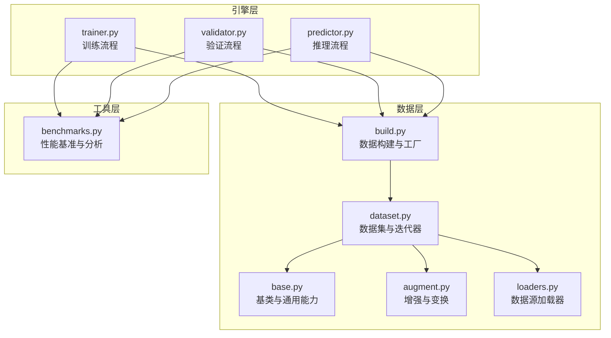
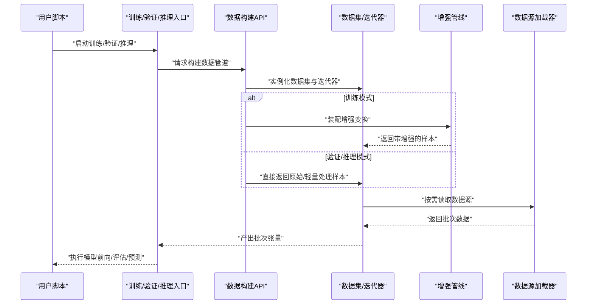
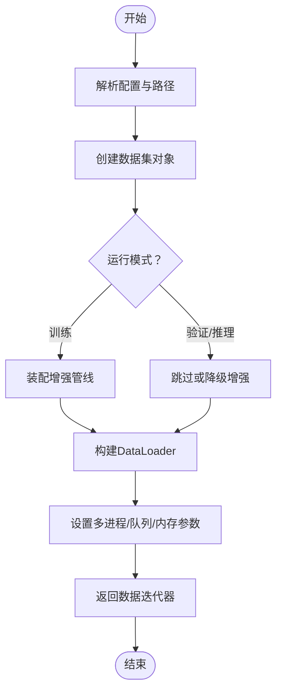
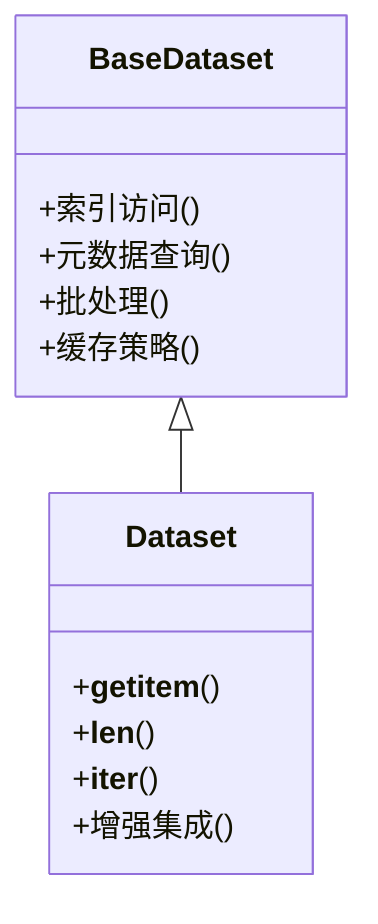
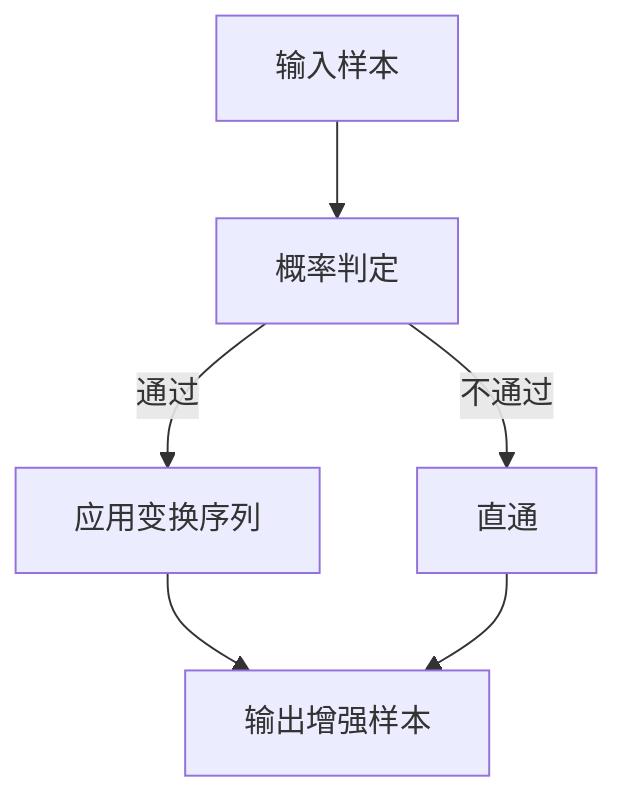
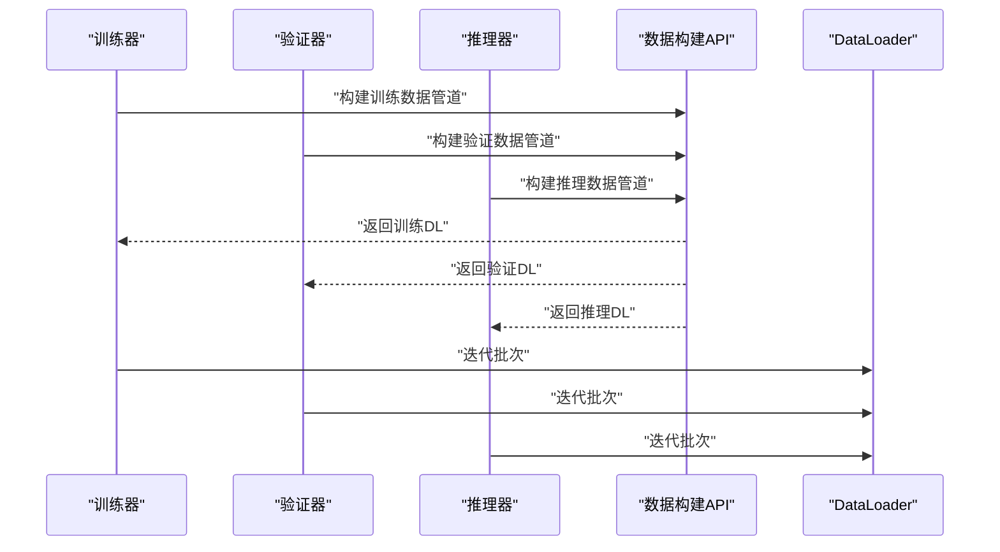
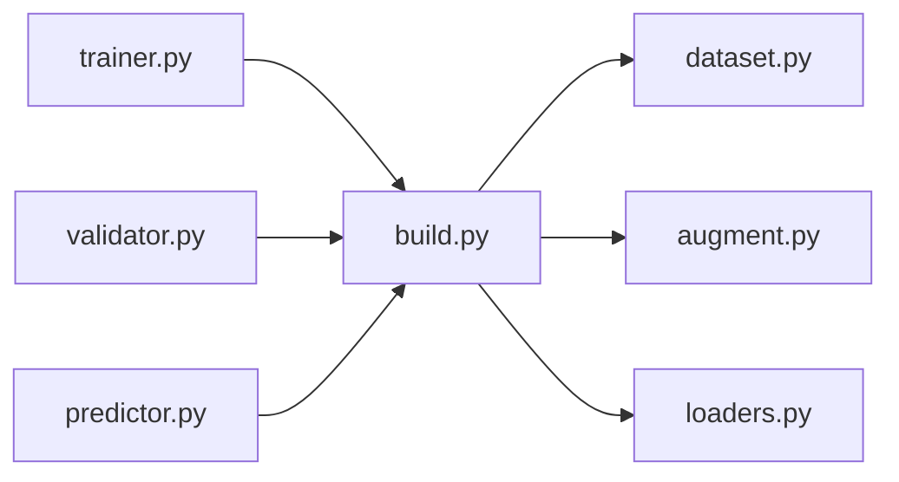

# 数据管道构建

<cite>
**本文引用的文件**
- [ultralytics/data/build.py](file://ultralytics/data/build.py)
- [ultralytics/data/dataset.py](file://ultralytics/data/dataset.py)
- [ultralytics/data/base.py](file://ultralytics/data/base.py)
- [ultralytics/data/augment.py](file://ultralytics/data/augment.py)
- [ultralytics/data/loaders.py](file://ultralytics/data/loaders.py)
- [ultralytics/engine/trainer.py](file://ultralytics/engine/trainer.py)
- [ultralytics/engine/validator.py](file://ultralytics/engine/validator.py)
- [ultralytics/engine/predictor.py](file://ultralytics/engine/predictor.py)
- [ultralytics/utils/benchmarks.py](file://ultralytics/utils/benchmarks.py)
</cite>

## 目录
1. [简介](#简介)
2. [项目结构](#项目结构)
3. [核心组件](#核心组件)
4. [架构总览](#架构总览)
5. [详细组件分析](#详细组件分析)
6. [依赖关系分析](#依赖关系分析)
7. [性能考虑](#性能考虑)
8. [故障排查指南](#故障排查指南)
9. [结论](#结论)
10. [附录](#附录)

## 简介
本文件面向YOLO-Master的数据管道构建API，系统性说明训练、验证与推理场景下的数据加载与预处理流水线设计，涵盖多进程数据加载配置、队列与内存管理、自定义处理函数集成、监控与调试工具使用、大数据集分块与流式处理策略，以及性能分析与瓶颈识别方法。文档以代码级实现为依据，提供可视化图示与可操作建议，帮助读者快速搭建高效稳定的数据管道。

## 项目结构
数据管道相关代码主要位于 ultralytics/data 与 ultralytics/engine 模块中：
- 数据构建与工厂：ultralytics/data/build.py
- 数据集抽象与迭代器：ultralytics/data/dataset.py、ultralytics/data/base.py
- 增强与变换：ultralytics/data/augment.py
- 数据源加载器：ultralytics/data/loaders.py
- 训练/验证/推理入口：ultralytics/engine/trainer.py、ultralytics/engine/validator.py、ultralytics/engine/predictor.py
- 基准与性能分析：ultralytics/utils/benchmarks.py

图表来源
- [ultralytics/data/build.py](file://ultralytics/data/build.py)
- [ultralytics/data/dataset.py](file://ultralytics/data/dataset.py)
- [ultralytics/data/base.py](file://ultralytics/data/base.py)
- [ultralytics/data/augment.py](file://ultralytics/data/augment.py)
- [ultralytics/data/loaders.py](file://ultralytics/data/loaders.py)
- [ultralytics/engine/trainer.py](file://ultralytics/engine/trainer.py)
- [ultralytics/engine/validator.py](file://ultralytics/engine/validator.py)
- [ultralytics/engine/predictor.py](file://ultralytics/engine/predictor.py)
- [ultralytics/utils/benchmarks.py](file://ultralytics/utils/benchmarks.py)

章节来源
- [ultralytics/data/build.py](file://ultralytics/data/build.py)
- [ultralytics/data/dataset.py](file://ultralytics/data/dataset.py)
- [ultralytics/data/base.py](file://ultralytics/data/base.py)
- [ultralytics/data/augment.py](file://ultralytics/data/augment.py)
- [ultralytics/data/loaders.py](file://ultralytics/data/loaders.py)
- [ultralytics/engine/trainer.py](file://ultralytics/engine/trainer.py)
- [ultralytics/engine/validator.py](file://ultralytics/engine/validator.py)
- [ultralytics/engine/predictor.py](file://ultralytics/engine/predictor.py)
- [ultralytics/utils/benchmarks.py](file://ultralytics/utils/benchmarks.py)

## 核心组件
- 数据构建与工厂（build）
  - 负责根据任务类型与配置创建数据集对象，统一封装训练/验证/推理所需的数据迭代器。
  - 暴露高层API，屏蔽底层加载细节，便于在不同场景下复用。
- 数据集与迭代器（dataset/base）
  - 定义数据集抽象与通用行为，包括索引、元数据访问、批处理、缓存等。
  - 提供可复用的迭代协议，支持随机访问与顺序遍历。
- 增强与变换（augment）
  - 提供图像与标注的增强管线，支持组合式变换、概率控制、参数化配置。
  - 在训练阶段启用，验证/推理阶段可按需关闭或降级。
- 数据源加载器（loaders）
  - 对接多种数据源（本地文件、目录结构、外部格式），完成路径解析、校验与读取。
- 引擎集成（trainer/validator/predictor）
  - 训练/验证/推理入口通过数据构建API获取DataLoader，驱动模型前向与指标计算。
- 性能基准（benchmarks）
  - 提供吞吐、延迟、I/O与CPU/GPU利用率等指标采集与分析能力。

章节来源
- [ultralytics/data/build.py](file://ultralytics/data/build.py)
- [ultralytics/data/dataset.py](file://ultralytics/data/dataset.py)
- [ultralytics/data/base.py](file://ultralytics/data/base.py)
- [ultralytics/data/augment.py](file://ultralytics/data/augment.py)
- [ultralytics/data/loaders.py](file://ultralytics/data/loaders.py)
- [ultralytics/engine/trainer.py](file://ultralytics/engine/trainer.py)
- [ultralytics/engine/validator.py](file://ultralytics/engine/validator.py)
- [ultralytics/engine/predictor.py](file://ultralytics/engine/predictor.py)
- [ultralytics/utils/benchmarks.py](file://ultralytics/utils/benchmarks.py)

## 架构总览
下图展示从引擎到数据管道的调用链路与职责划分。训练/验证/推理均通过统一的构建接口获取数据迭代器，内部再按场景选择是否启用增强与多进程加载。

图表来源
- [ultralytics/engine/trainer.py](file://ultralytics/engine/trainer.py)
- [ultralytics/engine/validator.py](file://ultralytics/engine/validator.py)
- [ultralytics/engine/predictor.py](file://ultralytics/engine/predictor.py)
- [ultralytics/data/build.py](file://ultralytics/data/build.py)
- [ultralytics/data/dataset.py](file://ultralytics/data/dataset.py)
- [ultralytics/data/augment.py](file://ultralytics/data/augment.py)
- [ultralytics/data/loaders.py](file://ultralytics/data/loaders.py)

## 详细组件分析

### 数据构建API（build）
- 职责
  - 根据任务类型（检测、分割、姿态等）与运行模式（train/val/predict）组装数据管道。
  - 统一暴露构建接口，隐藏多进程、缓存、增强等细节。
- 关键流程
  - 解析配置与路径，确定数据源与标签格式。
  - 创建数据集对象并装配增强（训练时）。
  - 生成DataLoader，设置工作进程、队列大小、持久化等参数。
- 典型参数
  - 工作进程数量、批大小、是否打乱、是否持久化worker、prefetch因子、pin_memory等。
- 扩展点
  - 可通过配置注入自定义增强或后处理逻辑。

图表来源
- [ultralytics/data/build.py](file://ultralytics/data/build.py)
- [ultralytics/data/dataset.py](file://ultralytics/data/dataset.py)
- [ultralytics/data/augment.py](file://ultralytics/data/augment.py)

章节来源
- [ultralytics/data/build.py](file://ultralytics/data/build.py)
- [ultralytics/data/dataset.py](file://ultralytics/data/dataset.py)
- [ultralytics/data/augment.py](file://ultralytics/data/augment.py)

### 数据集与迭代器（dataset/base）
- 职责
  - 定义数据集抽象，提供索引、元数据访问、批处理、缓存机制。
  - 实现标准迭代协议，支持随机访问与顺序遍历。
- 关键能力
  - 索引映射与批量采样。
  - 可选的内存缓存与磁盘缓存。
  - 与增强管线的解耦集成。
- 复杂度与优化
  - 索引访问通常为O(1)，批处理聚合为O(B)。
  - 缓存命中可显著降低I/O开销。

图表来源
- [ultralytics/data/base.py](file://ultralytics/data/base.py)
- [ultralytics/data/dataset.py](file://ultralytics/data/dataset.py)

章节来源
- [ultralytics/data/base.py](file://ultralytics/data/base.py)
- [ultralytics/data/dataset.py](file://ultralytics/data/dataset.py)

### 增强与变换（augment）
- 职责
  - 提供图像与标注的增强组合，支持概率、强度、随机种子等控制。
  - 在训练阶段启用，验证/推理阶段可关闭或仅保留必要变换。
- 设计要点
  - 变换可组合、可序列化，便于实验对比与复现。
  - 与数据集解耦，通过回调或中间层接入。

图表来源
- [ultralytics/data/augment.py](file://ultralytics/data/augment.py)

章节来源
- [ultralytics/data/augment.py](file://ultralytics/data/augment.py)

### 数据源加载器（loaders）
- 职责
  - 对接多种数据源格式与目录结构，完成路径解析、校验与读取。
  - 提供统一的读取接口，屏蔽差异。
- 关键点
  - 支持批量预取与懒加载。
  - 错误处理与重试策略。

章节来源
- [ultralytics/data/loaders.py](file://ultralytics/data/loaders.py)

### 引擎集成（trainer/validator/predictor）
- 训练（trainer）
  - 通过数据构建API获取训练数据管道，开启增强与多进程。
  - 结合优化器、损失与日志记录进行训练循环。
- 验证（validator）
  - 使用验证数据管道，通常关闭增强，确保评估一致性。
- 推理（predictor）
  - 使用推理数据管道，优先低延迟与高吞吐，必要时禁用增强。

图表来源
- [ultralytics/engine/trainer.py](file://ultralytics/engine/trainer.py)
- [ultralytics/engine/validator.py](file://ultralytics/engine/validator.py)
- [ultralytics/engine/predictor.py](file://ultralytics/engine/predictor.py)
- [ultralytics/data/build.py](file://ultralytics/data/build.py)

章节来源
- [ultralytics/engine/trainer.py](file://ultralytics/engine/trainer.py)
- [ultralytics/engine/validator.py](file://ultralytics/engine/validator.py)
- [ultralytics/engine/predictor.py](file://ultralytics/engine/predictor.py)

## 依赖关系分析
- 耦合与内聚
  - build对dataset/augment/loaders有强依赖；engine对build有强依赖。
  - dataset与base保持良好内聚，增强与加载器解耦清晰。
- 外部依赖
  - 多进程与队列由框架提供的DataLoader实现。
  - I/O与缓存可能依赖文件系统与内存管理。
- 潜在循环依赖
  - 当前分层清晰，未见明显循环依赖风险。

图表来源
- [ultralytics/data/build.py](file://ultralytics/data/build.py)
- [ultralytics/data/dataset.py](file://ultralytics/data/dataset.py)
- [ultralytics/data/augment.py](file://ultralytics/data/augment.py)
- [ultralytics/data/loaders.py](file://ultralytics/data/loaders.py)
- [ultralytics/engine/trainer.py](file://ultralytics/engine/trainer.py)
- [ultralytics/engine/validator.py](file://ultralytics/engine/validator.py)
- [ultralytics/engine/predictor.py](file://ultralytics/engine/predictor.py)

章节来源
- [ultralytics/data/build.py](file://ultralytics/data/build.py)
- [ultralytics/data/dataset.py](file://ultralytics/data/dataset.py)
- [ultralytics/data/augment.py](file://ultralytics/data/augment.py)
- [ultralytics/data/loaders.py](file://ultralytics/data/loaders.py)
- [ultralytics/engine/trainer.py](file://ultralytics/engine/trainer.py)
- [ultralytics/engine/validator.py](file://ultralytics/engine/validator.py)
- [ultralytics/engine/predictor.py](file://ultralytics/engine/predictor.py)

## 性能考虑
- 多进程数据加载
  - 工作进程数量：建议设置为CPU物理核数或略少，避免上下文切换开销过大。
  - 队列大小：适当增大可减少GPU空闲等待，但会增加内存占用。
  - 持久化worker：长生命周期训练可启用以减少启动开销。
  - pin_memory：将数据预分配到固定内存，提升GPU传输效率。
- 内存管理
  - 合理设置批大小与prefetch因子，避免OOM。
  - 使用缓存策略（内存/磁盘）减少重复I/O。
- 增强成本
  - 训练阶段增强会引入CPU负载，建议与多进程协同调优。
  - 验证/推理阶段尽量关闭或简化增强以降低延迟。
- 监控与诊断
  - 使用基准工具采集吞吐、延迟、I/O与CPU/GPU利用率。
  - 关注数据饥饿、队列阻塞、GC抖动等瓶颈信号。

章节来源
- [ultralytics/utils/benchmarks.py](file://ultralytics/utils/benchmarks.py)

## 故障排查指南
- 常见问题
  - 数据饥饿：GPU等待数据，检查多进程与队列大小、增强耗时。
  - OOM：批大小或prefetch过大，降低批大小或队列容量。
  - 数据不一致：验证/推理误开增强，确认模式开关。
  - 路径错误：数据源路径或标签格式不正确，检查加载器配置。
- 定位步骤
  - 启用日志与监控，观察I/O与CPU/GPU曲线。
  - 逐步关闭增强与多进程，隔离问题来源。
  - 使用小样本子集验证管道正确性。
- 恢复策略
  - 调整工作进程、队列、批大小与缓存策略。
  - 更换数据源格式或预转换至更快介质（如SSD）。

章节来源
- [ultralytics/data/loaders.py](file://ultralytics/data/loaders.py)
- [ultralytics/data/augment.py](file://ultralytics/data/augment.py)
- [ultralytics/utils/benchmarks.py](file://ultralytics/utils/benchmarks.py)

## 结论
YOLO-Master的数据管道通过统一的构建API将数据集、增强与加载器有机整合，并在训练、验证与推理场景中提供差异化配置。通过合理设置多进程、队列与内存参数，结合增强策略与缓存机制，可实现高吞吐、低延迟的稳定数据供给。借助基准与监控工具，可快速识别瓶颈并进行针对性优化。

## 附录

### 场景化配置建议
- 训练
  - 启用增强，设置较高工作进程与适度队列大小，开启pin_memory与持久化worker。
  - 批大小受显存限制，配合梯度累积达到目标吞吐。
- 验证
  - 关闭增强，降低工作进程与队列大小，保证评估一致性与稳定性。
- 推理
  - 最小化增强，优先低延迟；可适当提高批大小以提升吞吐。

### 自定义处理函数集成
- 在增强管线中插入自定义变换，遵循统一输入输出契约。
- 在数据集的__getitem__前后钩入预处理/后处理逻辑。
- 通过配置注册自定义增强，便于实验管理与复现实验。

### 大数据集分块与流式处理
- 分块加载：按目录或文件列表分批构建数据集，避免一次性载入全部索引。
- 流式处理：使用惰性读取与游标迭代，按需拉取数据，降低峰值内存。
- 缓存策略：对热点数据进行内存或磁盘缓存，平衡速度与资源。

### 监控与调试工具
- 使用基准工具采集吞吐、延迟、I/O与CPU/GPU利用率。
- 结合系统监控（如nvidia-smi、top、iotop）定位瓶颈。
- 打印关键统计（队列长度、worker存活、异常计数）辅助排障。