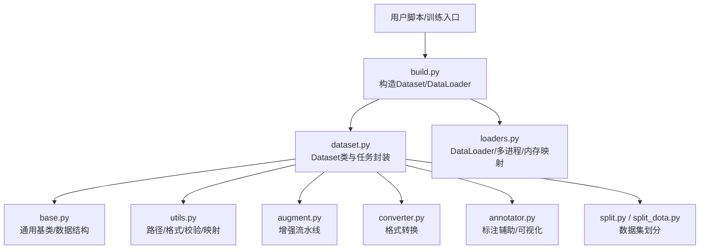
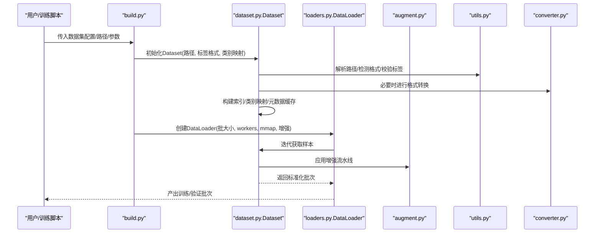
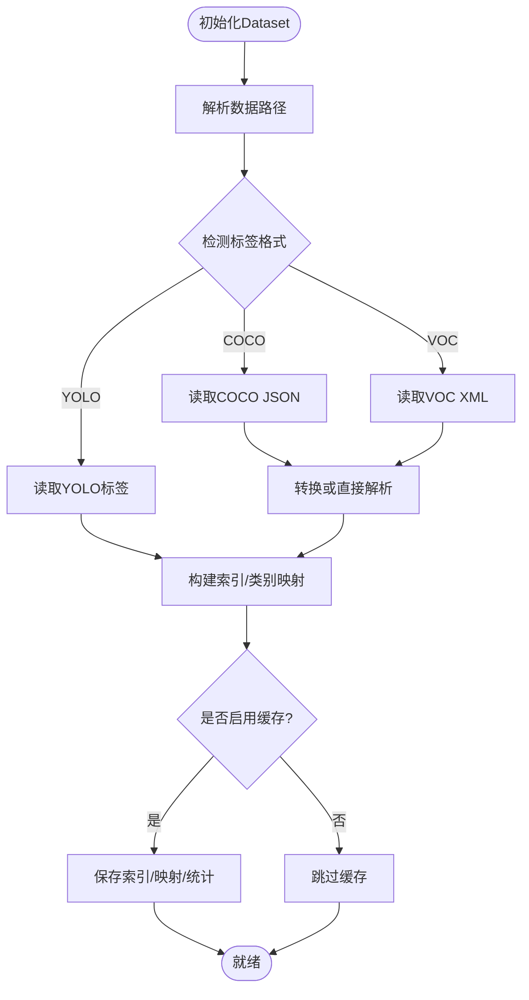
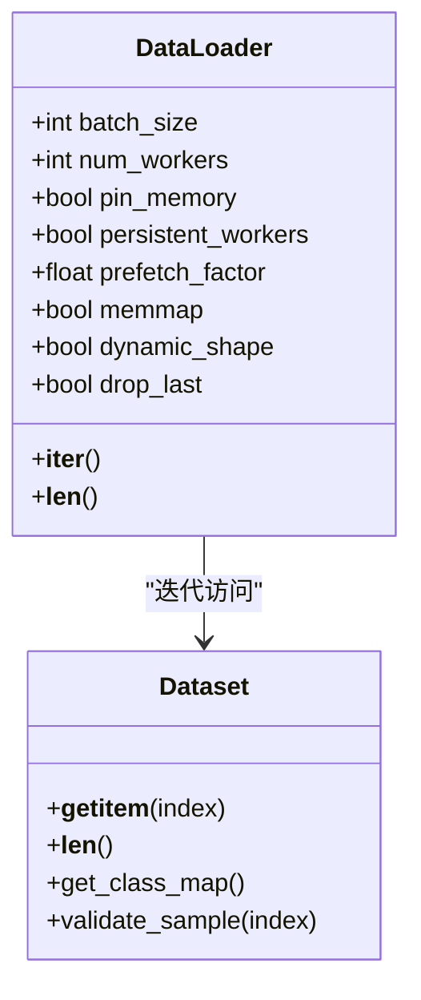
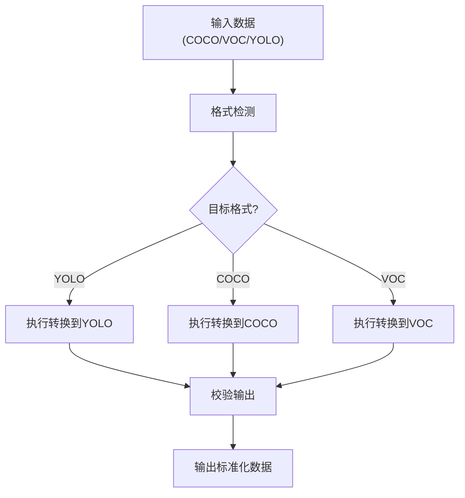
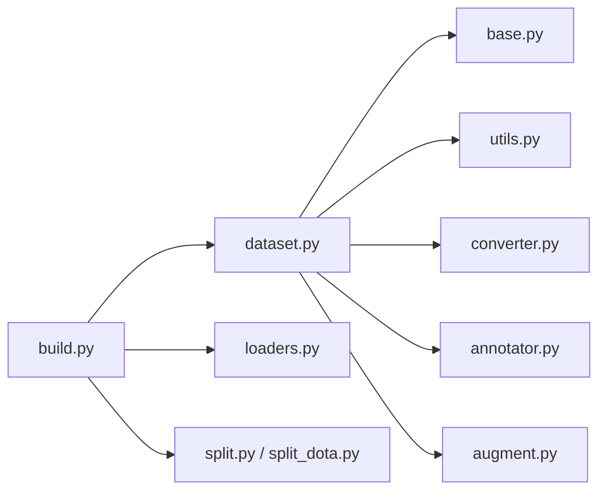

# 数据集管理

<cite>
**本文引用的文件**
- [ultralytics/data/dataset.py](file://ultralytics/data/dataset.py)
- [ultralytics/data/build.py](file://ultralytics/data/build.py)
- [ultralytics/data/loaders.py](file://ultralytics/data/loaders.py)
- [ultralytics/data/base.py](file://ultralytics/data/base.py)
- [ultralytics/data/utils.py](file://ultralytics/data/utils.py)
- [ultralytics/data/annotator.py](file://ultralytics/data/annotator.py)
- [ultralytics/data/augment.py](file://ultralytics/data/augment.py)
- [ultralytics/data/converter.py](file://ultralytics/data/converter.py)
- [ultralytics/data/split.py](file://ultralytics/data/split.py)
- [ultralytics/data/split_dota.py](file://ultralytics/data/split_dota.py)
- [ultralytics/cfg/datasets/index.md](file://ultralytics/cfg/datasets/index.md)
</cite>

## 目录
1. [简介](#简介)
2. [项目结构](#项目结构)
3. [核心组件](#核心组件)
4. [架构总览](#架构总览)
5. [详细组件分析](#详细组件分析)
6. [依赖关系分析](#依赖关系分析)
7. [性能考虑](#性能考虑)
8. [故障排查指南](#故障排查指南)
9. [结论](#结论)
10. [附录](#附录)

## 简介
本文件面向YOLO-Master的数据集管理API，聚焦于Dataset类与DataLoaders的创建与管理、数据格式支持（YOLO、COCO、Pascal VOC等）、自定义数据集开发接口、数据验证工具、缓存机制与性能优化策略，以及大规模与分布式环境下的数据加载实践。文档以代码级实现为依据，提供可视化图示与可操作的配置建议，帮助读者快速构建高效、稳定的训练与推理数据管线。

## 项目结构
数据集相关代码集中在ultralytics/data目录下，围绕“数据装载—解析—增强—批处理—迭代”的主线组织：
- dataset.py：定义Dataset基类与任务型数据集封装，负责路径解析、标签读取、类别映射、索引构建等。
- build.py：高层入口，根据配置或参数构造Dataset与DataLoader实例，统一调度多进程、内存映射、缓存等选项。
- loaders.py：封装PyTorch DataLoader及自定义采样器、分片、内存映射等能力。
- base.py：通用基类与公共数据结构，供不同任务继承复用。
- utils.py：路径、格式检测、标签校验、类别映射等工具函数。
- annotator.py：标注辅助与可视化、格式转换辅助。
- augment.py：数据增强流水线（几何、色彩、MixUp/Mosaic等）。
- converter.py：跨格式转换（如COCO↔YOLO、VOC→YOLO等）。
- split.py / split_dota.py：数据集划分与DOTA专用切分逻辑。
- cfg/datasets/index.md：内置数据集清单与示例配置说明。

图表来源
- [ultralytics/data/build.py](file://ultralytics/data/build.py)
- [ultralytics/data/dataset.py](file://ultralytics/data/dataset.py)
- [ultralytics/data/loaders.py](file://ultralytics/data/loaders.py)
- [ultralytics/data/base.py](file://ultralytics/data/base.py)
- [ultralytics/data/utils.py](file://ultralytics/data/utils.py)
- [ultralytics/data/augment.py](file://ultralytics/data/augment.py)
- [ultralytics/data/converter.py](file://ultralytics/data/converter.py)
- [ultralytics/data/annotator.py](file://ultralytics/data/annotator.py)
- [ultralytics/data/split.py](file://ultralytics/data/split.py)
- [ultralytics/data/split_dota.py](file://ultralytics/data/split_dota.py)

章节来源
- [ultralytics/data/dataset.py](file://ultralytics/data/dataset.py)
- [ultralytics/data/build.py](file://ultralytics/data/build.py)
- [ultralytics/data/loaders.py](file://ultralytics/data/loaders.py)
- [ultralytics/data/base.py](file://ultralytics/data/base.py)
- [ultralytics/data/utils.py](file://ultralytics/data/utils.py)
- [ultralytics/data/augment.py](file://ultralytics/data/augment.py)
- [ultralytics/data/converter.py](file://ultralytics/data/converter.py)
- [ultralytics/data/annotator.py](file://ultralytics/data/annotator.py)
- [ultralytics/data/split.py](file://ultralytics/data/split.py)
- [ultralytics/data/split_dota.py](file://ultralytics/data/split_dota.py)
- [ultralytics/cfg/datasets/index.md](file://ultralytics/cfg/datasets/index.md)

## 核心组件
- Dataset类
  - 职责：统一数据访问接口；解析数据路径与标签；维护类别映射；构建样本索引；对接增强与批处理。
  - 关键能力：
    - 数据路径设置：支持绝对/相对路径、子目录扫描、图像与标签配对。
    - 标签格式解析：自动识别YOLO文本、COCO JSON、Pascal VOC XML等，并归一化内部表示。
    - 类别映射：从配置文件或自动推断生成id↔name映射，保证训练/推理一致性。
    - 索引构建：建立图像到标注的倒排索引，加速随机访问与过滤。
    - 元数据缓存：可选持久化索引与统计信息，减少重复IO。
- DataLoaders
  - 职责：基于PyTorch DataLoader封装，提供多进程加载、内存映射、动态尺寸、缓存批等能力。
  - 关键能力：
    - 批处理大小与堆叠策略：支持固定尺寸与按最大边对齐的动态尺寸。
    - 多进程加载：workers数量、进程间通信开销控制、种子隔离。
    - 内存映射：对超大标签或中间缓存使用mmap降低内存峰值。
    - 采样与打乱：全局打乱、分层采样、重加权等。
    - 错误恢复：单样本异常跳过、重试计数、失败日志。
- 工具与扩展
  - 格式转换：converter.py提供COCO↔YOLO、VOC→YOLO等转换流程。
  - 数据增强：augment.py提供几何、色彩、混合增强，支持可插拔组合。
  - 标注辅助：annotator.py提供可视化、批量检查、导出辅助。
  - 数据集划分：split.py与split_dota.py提供标准划分与DOTA旋转框切分。

章节来源
- [ultralytics/data/dataset.py](file://ultralytics/data/dataset.py)
- [ultralytics/data/build.py](file://ultralytics/data/build.py)
- [ultralytics/data/loaders.py](file://ultralytics/data/loaders.py)
- [ultralytics/data/utils.py](file://ultralytics/data/utils.py)
- [ultralytics/data/converter.py](file://ultralytics/data/converter.py)
- [ultralytics/data/augment.py](file://ultralytics/data/augment.py)
- [ultralytics/data/annotator.py](file://ultralytics/data/annotator.py)
- [ultralytics/data/split.py](file://ultralytics/data/split.py)
- [ultralytics/data/split_dota.py](file://ultralytics/data/split_dota.py)

## 架构总览
下图展示从配置到数据流水线的端到端调用关系：

图表来源
- [ultralytics/data/build.py](file://ultralytics/data/build.py)
- [ultralytics/data/dataset.py](file://ultralytics/data/dataset.py)
- [ultralytics/data/loaders.py](file://ultralytics/data/loaders.py)
- [ultralytics/data/augment.py](file://ultralytics/data/augment.py)
- [ultralytics/data/utils.py](file://ultralytics/data/utils.py)
- [ultralytics/data/converter.py](file://ultralytics/data/converter.py)

## 详细组件分析

### Dataset类：构造与配置
- 构造要点
  - 数据路径设置：支持根目录、images/labels子目录约定；允许自定义路径前缀与后缀规则。
  - 标签格式解析：优先依据文件后缀与内容特征判断格式；若为COCO/VOC则按需转换为YOLO内部格式或直接解析。
  - 类别映射：可从外部yaml/json导入，或从标签中自动推断；支持别名合并与去重。
  - 索引构建：将图像与标注建立双向索引，便于按ID/名称检索与过滤。
  - 元数据缓存：可选将索引、类别映射、统计信息写入本地缓存目录，避免重复计算。
- 常用配置项（概念性）
  - data_root：数据集根路径
  - img_dir / label_dir：图像与标签目录
  - format：标签格式（yolo/coco/voc）
  - class_mapping：类别映射文件或字典
  - cache_index：是否缓存索引
  - validate_on_load：是否在加载时执行基本校验
- 典型流程
  - 初始化→路径解析→格式检测→标签读取→类别映射→索引构建→缓存落盘

图表来源
- [ultralytics/data/dataset.py](file://ultralytics/data/dataset.py)
- [ultralytics/data/utils.py](file://ultralytics/data/utils.py)
- [ultralytics/data/converter.py](file://ultralytics/data/converter.py)

章节来源
- [ultralytics/data/dataset.py](file://ultralytics/data/dataset.py)
- [ultralytics/data/utils.py](file://ultralytics/data/utils.py)
- [ultralytics/data/converter.py](file://ultralytics/data/converter.py)

### DataLoaders：创建与管理
- 创建入口
  - 通过高层接口传入Dataset实例与训练/验证参数，自动选择合适的数据加载策略。
- 关键配置项（概念性）
  - batch_size：每批样本数
  - num_workers：多进程工作线程数
  - pin_memory：是否使用锁页内存
  - persistent_workers：是否保持worker常驻
  - prefetch_factor：预取因子
  - memmap：是否对大数组使用内存映射
  - dynamic_shape：是否启用动态尺寸堆叠
  - drop_last：是否丢弃最后不足一批的样本
- 多进程与内存映射
  - 多进程并行读取与预处理，注意进程间序列化成本与共享内存限制。
  - 内存映射用于超大标签或中间缓存，显著降低内存峰值，但可能增加磁盘IO压力。
- 错误处理与健壮性
  - 单样本异常捕获与跳过，记录失败样本ID，支持重试与断点续跑。
  - 进度反馈与超时保护，防止个别样本拖慢整体吞吐。

图表来源
- [ultralytics/data/loaders.py](file://ultralytics/data/loaders.py)
- [ultralytics/data/dataset.py](file://ultralytics/data/dataset.py)

章节来源
- [ultralytics/data/loaders.py](file://ultralytics/data/loaders.py)
- [ultralytics/data/dataset.py](file://ultralytics/data/dataset.py)

### 数据格式支持与转换
- 支持格式
  - YOLO：txt行级标注，包含类别与归一化坐标。
  - COCO：JSON结构，包含images、annotations、categories等字段。
  - Pascal VOC：XML标注，包含bndbox等边界框信息。
- 转换方法
  - converter.py提供统一的转换接口，支持COCO→YOLO、VOC→YOLO等。
  - 转换过程包括：类别对齐、坐标归一化、缺失值处理、冗余去除。
- 自动检测与回退
  - 当format未显式指定时，utils.py会尝试根据文件结构与内容推断格式。
  - 若检测到不兼容或缺失字段，给出明确错误提示与修复建议。

图表来源
- [ultralytics/data/converter.py](file://ultralytics/data/converter.py)
- [ultralytics/data/utils.py](file://ultralytics/data/utils.py)

章节来源
- [ultralytics/data/converter.py](file://ultralytics/data/converter.py)
- [ultralytics/data/utils.py](file://ultralytics/data/utils.py)

### 自定义数据集开发接口
- 继承与重写
  - 基于base.py提供的通用基类，重写__getitem__与__len__即可接入现有训练/验证流程。
  - 可在__getitem__中集成特定增强或后处理逻辑。
- 数据验证工具
  - 提供批量校验接口，检查图像存在性、标签完整性、类别一致性、坐标范围合法性等。
  - 支持生成报告与可视化样例，便于定位问题样本。
- 最佳实践
  - 尽量在__getitem__中只做轻量操作，复杂预处理放在__init__或离线阶段完成。
  - 使用缓存机制存储中间结果，避免重复计算。

章节来源
- [ultralytics/data/base.py](file://ultralytics/data/base.py)
- [ultralytics/data/dataset.py](file://ultralytics/data/dataset.py)
- [ultralytics/data/annotator.py](file://ultralytics/data/annotator.py)

### 数据增强流水线
- 增强类型
  - 几何变换：缩放、裁剪、翻转、仿射等。
  - 色彩变换：亮度、对比度、饱和度、色调等。
  - 混合增强：Mosaic、MixUp、Copy-Paste等。
- 配置与组合
  - 通过配置对象声明增强步骤与概率，支持条件增强与任务差异化。
  - 增强顺序影响最终效果，建议先几何后色彩再混合。
- 性能优化
  - 向量化操作与NumPy/CPU并行结合，减少Python循环开销。
  - 对大图采用分块增强或降采样预处理。

章节来源
- [ultralytics/data/augment.py](file://ultralytics/data/augment.py)

### 数据集划分与DOTA支持
- 标准划分
  - split.py提供train/val/test比例划分，支持分层抽样与交叉验证。
- DOTA旋转框
  - split_dota.py针对DOTA的旋转框与瓦片切分提供专用逻辑，确保小目标与密集场景的覆盖。

章节来源
- [ultralytics/data/split.py](file://ultralytics/data/split.py)
- [ultralytics/data/split_dota.py](file://ultralytics/data/split_dota.py)

## 依赖关系分析
- 模块耦合
  - build.py作为编排层，依赖dataset.py与loaders.py，间接使用utils.py、converter.py、augment.py。
  - dataset.py强依赖utils.py与base.py，弱依赖converter.py与annotator.py。
  - loaders.py依赖dataset.py与系统级多线程/多进程库。
- 潜在循环依赖
  - 当前设计通过清晰的层次划分避免循环依赖；新增功能时应遵循“上层编排、下层实现”的原则。
- 外部依赖
  - PyTorch DataLoader、NumPy、PIL/OpenCV、json/xml解析库等。

图表来源
- [ultralytics/data/build.py](file://ultralytics/data/build.py)
- [ultralytics/data/dataset.py](file://ultralytics/data/dataset.py)
- [ultralytics/data/loaders.py](file://ultralytics/data/loaders.py)
- [ultralytics/data/base.py](file://ultralytics/data/base.py)
- [ultralytics/data/utils.py](file://ultralytics/data/utils.py)
- [ultralytics/data/converter.py](file://ultralytics/data/converter.py)
- [ultralytics/data/annotator.py](file://ultralytics/data/annotator.py)
- [ultralytics/data/augment.py](file://ultralytics/data/augment.py)
- [ultralytics/data/split.py](file://ultralytics/data/split.py)
- [ultralytics/data/split_dota.py](file://ultralytics/data/split_dota.py)

章节来源
- [ultralytics/data/build.py](file://ultralytics/data/build.py)
- [ultralytics/data/dataset.py](file://ultralytics/data/dataset.py)
- [ultralytics/data/loaders.py](file://ultralytics/data/loaders.py)
- [ultralytics/data/base.py](file://ultralytics/data/base.py)
- [ultralytics/data/utils.py](file://ultralytics/data/utils.py)
- [ultralytics/data/converter.py](file://ultralytics/data/converter.py)
- [ultralytics/data/annotator.py](file://ultralytics/data/annotator.py)
- [ultralytics/data/augment.py](file://ultralytics/data/augment.py)
- [ultralytics/data/split.py](file://ultralytics/data/split.py)
- [ultralytics/data/split_dota.py](file://ultralytics/data/split_dota.py)

## 性能考虑
- 多进程加载
  - 合理设置num_workers，避免过多导致上下文切换开销过大；建议从CPU核数的一半开始调优。
  - 使用persistent_workers减少worker重建成本。
- 内存映射
  - 对超大标签或中间缓存启用memmap，降低内存峰值；注意SSD/NVMe磁盘IO瓶颈。
- 动态尺寸与堆叠
  - 动态尺寸可减少填充浪费，但会增加堆叠复杂度；建议在GPU显存充足时开启。
- 缓存机制
  - 启用索引与统计缓存，避免重复扫描与解析；定期清理过期缓存。
- 增强开销
  - 将昂贵增强移至离线阶段或降低概率；使用向量化与并行化提升吞吐。
- 分布式环境
  - 在多卡训练中，确保每个进程的Dataset独立且seed隔离，避免重复样本。
  - 使用分布式采样器或分片策略，保证各进程数据分布均衡。

[本节为通用指导，无需列出具体文件来源]

## 故障排查指南
- 常见问题
  - 路径不存在或权限不足：检查data_root与子目录权限，确认符号链接有效。
  - 标签格式不匹配：确认format参数与实际格式一致，或使用自动检测。
  - 类别不一致：确保class_mapping在所有进程中一致，避免训练/推理漂移。
  - 多进程崩溃：查看worker日志，定位异常样本ID，启用异常跳过与重试。
  - 内存溢出：降低batch_size或num_workers，启用memmap或关闭动态尺寸。
- 诊断工具
  - 使用annotator.py的批量校验与可视化功能，快速定位问题样本。
  - 利用utils.py的格式检测与校验接口，生成诊断报告。
- 恢复策略
  - 启用断点续跑与失败队列，记录失败样本并单独处理。
  - 对损坏样本进行修复或剔除，更新索引与缓存。

章节来源
- [ultralytics/data/annotator.py](file://ultralytics/data/annotator.py)
- [ultralytics/data/utils.py](file://ultralytics/data/utils.py)
- [ultralytics/data/dataset.py](file://ultralytics/data/dataset.py)
- [ultralytics/data/loaders.py](file://ultralytics/data/loaders.py)

## 结论
YOLO-Master的数据集管理API通过清晰的模块化设计与丰富的配置选项，提供了从数据解析、格式转换、增强到批处理的全链路能力。借助缓存、内存映射与多进程加载，能够在大规模与分布式环境下实现高吞吐、低延迟的数据供给。建议在实际项目中结合业务特点调优workers、batch_size、memmap与增强策略，并充分利用验证与可视化工具保障数据质量。

[本节为总结性内容，无需列出具体文件来源]

## 附录
- 内置数据集与示例配置
  - 参考cfg/datasets/index.md了解官方数据集清单与配置模板。
- 快速上手
  - 使用build.py的高层接口，传入数据路径与基本参数即可快速启动训练/验证。
- 扩展建议
  - 自定义数据集时优先继承base.py，并在__getitem__中保持轻量；复杂预处理离线完成。
  - 新增格式支持时，优先在converter.py中添加转换逻辑，并在utils.py中补充格式检测。

章节来源
- [ultralytics/cfg/datasets/index.md](file://ultralytics/cfg/datasets/index.md)
- [ultralytics/data/build.py](file://ultralytics/data/build.py)
- [ultralytics/data/base.py](file://ultralytics/data/base.py)
- [ultralytics/data/converter.py](file://ultralytics/data/converter.py)
- [ultralytics/data/utils.py](file://ultralytics/data/utils.py)