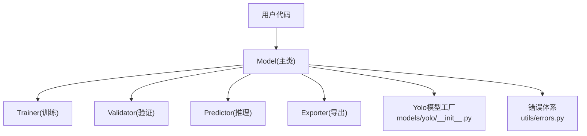
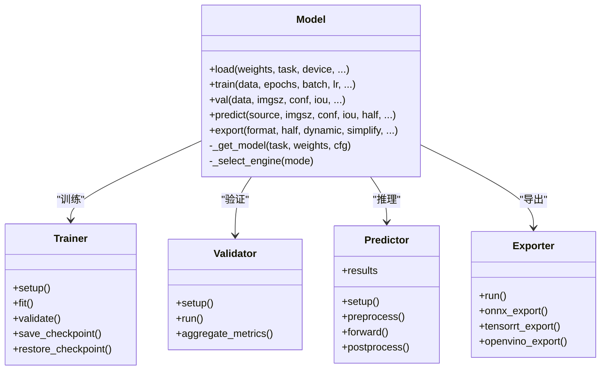
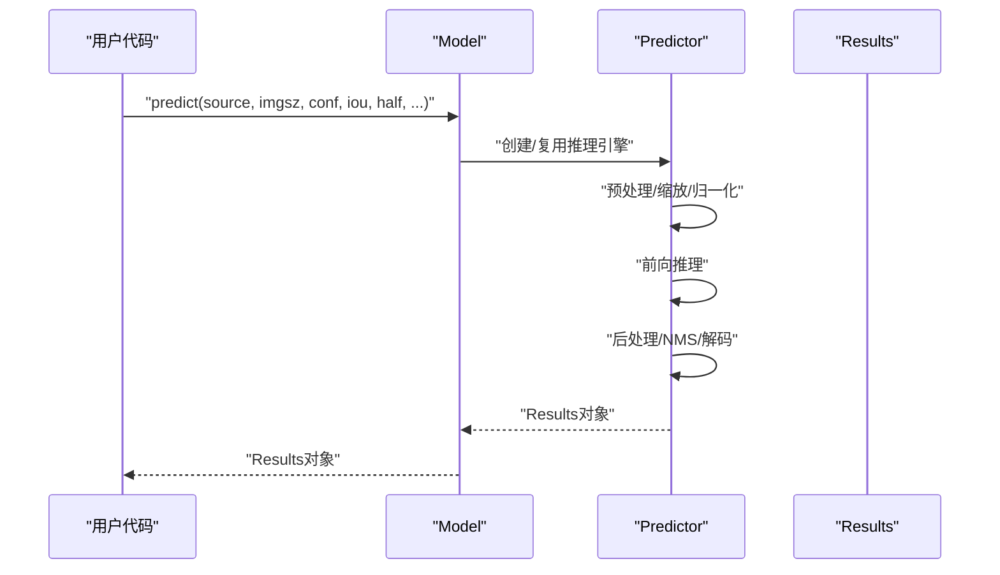
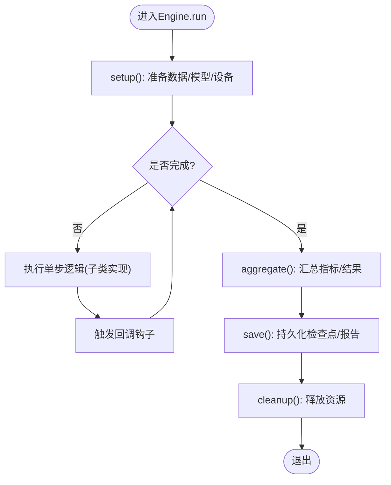
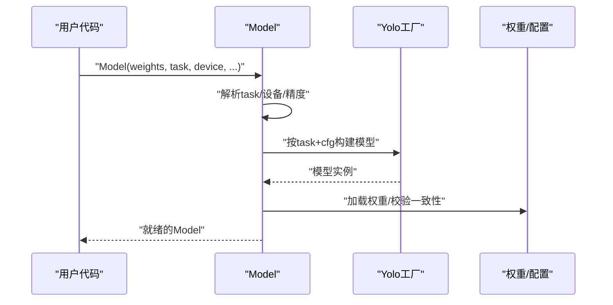
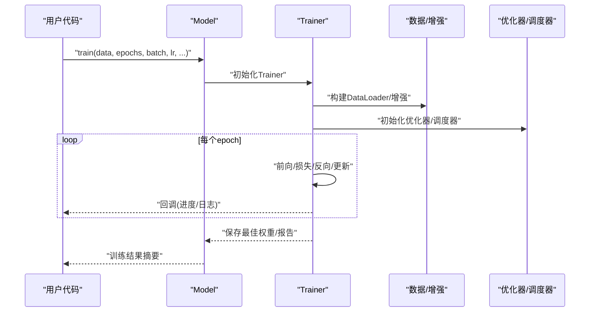
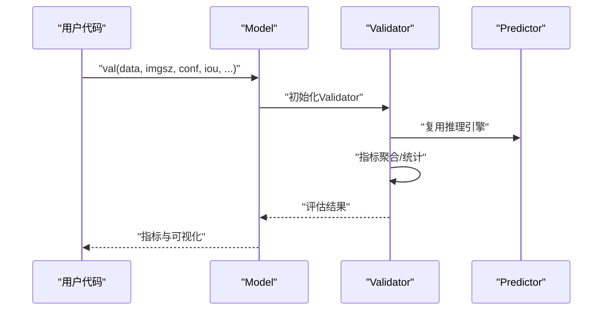
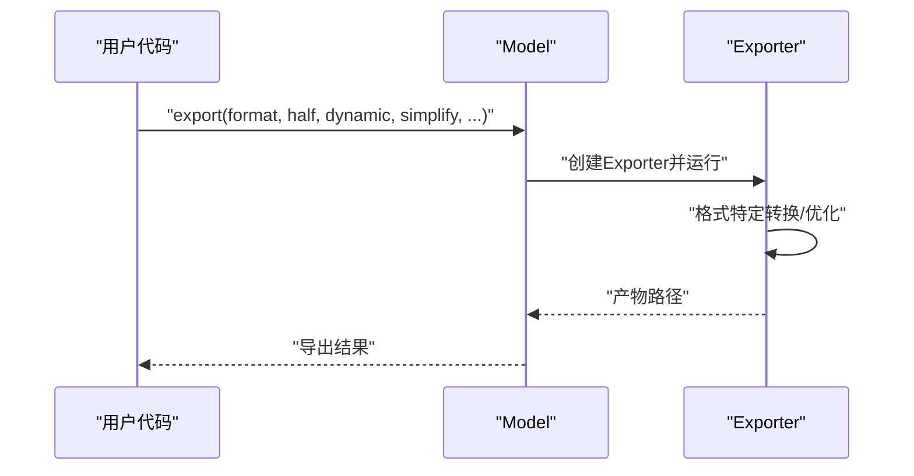
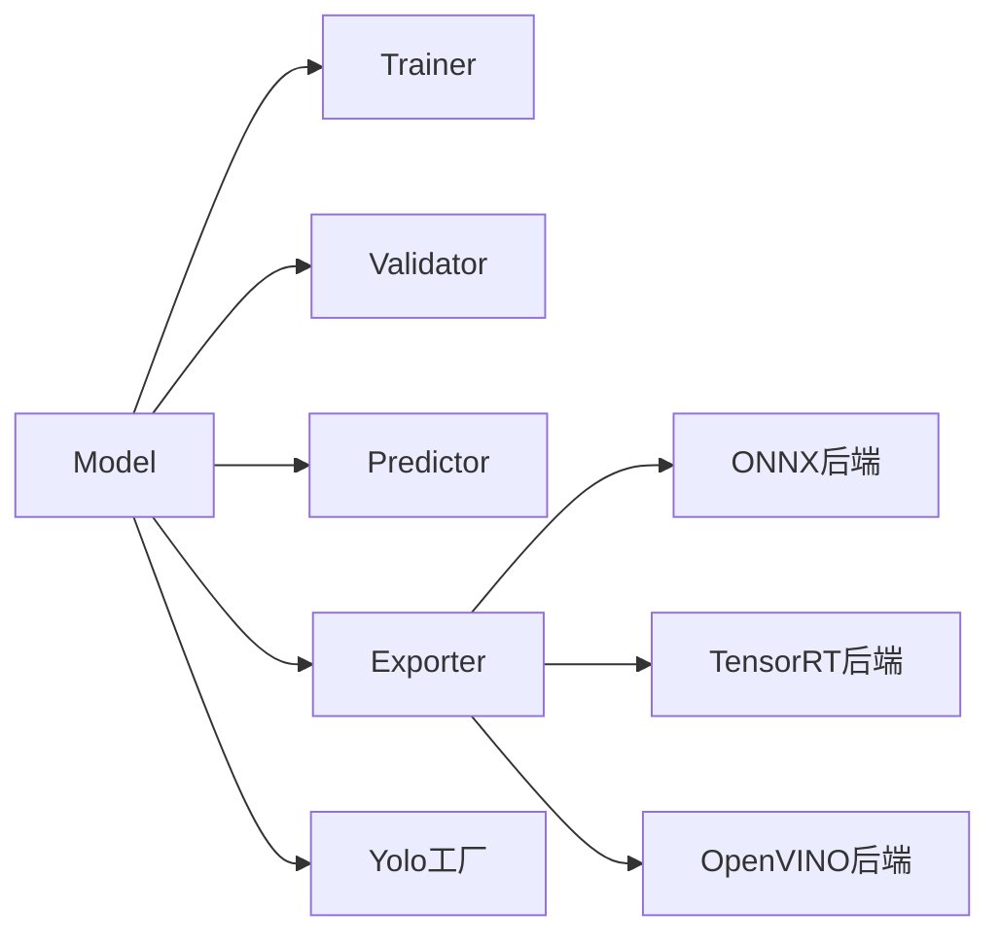

# 核心API

<cite>
**本文引用的文件**
- [ultralytics/engine/model.py](file://ultralytics/engine/model.py)
- [ultralytics/engine/trainer.py](file://ultralytics/engine/trainer.py)
- [ultralytics/engine/validator.py](file://ultralytics/engine/validator.py)
- [ultralytics/engine/predictor.py](file://ultralytics/engine/predictor.py)
- [ultralytics/engine/exporter.py](file://ultralytics/engine/exporter.py)
- [ultralytics/models/yolo/__init__.py](file://ultralytics/models/yolo/__init__.py)
- [ultralytics/utils/errors.py](file://ultralytics/utils/errors.py)
- [examples/tutorial.ipynb](file://examples/tutorial.ipynb)
</cite>

## 目录
1. [简介](#简介)
2. [项目结构](#项目结构)
3. [核心组件](#核心组件)
4. [架构总览](#架构总览)
5. [详细组件分析](#详细组件分析)
6. [依赖分析](#依赖分析)
7. [性能考虑](#性能考虑)
8. [故障排查指南](#故障排查指南)
9. [结论](#结论)
10. [附录](#附录)

## 简介
本文件面向YOLO-Master的核心Python API，聚焦于Model主类及其与Engine基类的关系，系统梳理模型加载、训练、验证、推理与导出等关键接口。文档同时给出常见使用模式、错误处理策略、并发与异步建议以及性能优化实践，帮助读者快速上手并高效集成到生产环境。

## 项目结构
围绕核心API的关键代码位于engine与models两个子包中：
- engine/model.py：对外暴露的Model主类，封装加载、训练、验证、推理与导出能力。
- engine/trainer.py：训练流程编排与回调钩子。
- engine/validator.py：验证流程编排与指标计算。
- engine/predictor.py：推理流程编排与结果后处理。
- engine/exporter.py：多后端导出（ONNX/TensorRT/OpenVINO等）统一入口。
- models/yolo/__init__.py：任务级模型注册与工厂方法，供Model内部按需实例化具体网络。
- utils/errors.py：统一的异常类型定义与错误传播约定。
- examples/tutorial.ipynb：官方示例，展示典型调用路径。

图表来源
- [ultralytics/engine/model.py](file://ultralytics/engine/model.py)
- [ultralytics/engine/trainer.py](file://ultralytics/engine/trainer.py)
- [ultralytics/engine/validator.py](file://ultralytics/engine/validator.py)
- [ultralytics/engine/predictor.py](file://ultralytics/engine/predictor.py)
- [ultralytics/engine/exporter.py](file://ultralytics/engine/exporter.py)
- [ultralytics/models/yolo/__init__.py](file://ultralytics/models/yolo/__init__.py)
- [ultralytics/utils/errors.py](file://ultralytics/utils/errors.py)

章节来源
- [ultralytics/engine/model.py](file://ultralytics/engine/model.py)
- [ultralytics/models/yolo/__init__.py](file://ultralytics/models/yolo/__init__.py)

## 核心组件
- Model主类
  - 职责：统一入口，负责权重加载、设备管理、任务识别、训练/验证/推理/导出的调度与参数校验。
  - 关键能力：
    - 构造与初始化：支持从权重文件或配置名加载；自动推断任务类型；选择设备与精度。
    - 训练：train()，对接Trainer，支持超参覆盖、日志、检查点保存与恢复。
    - 验证：val()，对接Validator，输出常用检测/分割/姿态等指标。
    - 推理：predict()，对接Predictor，返回带可视化与结构化信息的Results对象。
    - 导出：export()，对接Exporter，生成目标格式模型文件。
- Engine基类（Trainer/Validator/Predictor/Exporter）
  - 设计模式：模板方法与策略组合。各子类实现特定流程步骤，共享通用生命周期（准备数据、构建模型、执行循环、记录指标、清理资源）。
  - 扩展机制：通过回调钩子、配置字典与插件式后端（如不同导出器）进行行为定制。

章节来源
- [ultralytics/engine/model.py](file://ultralytics/engine/model.py)
- [ultralytics/engine/trainer.py](file://ultralytics/engine/trainer.py)
- [ultralytics/engine/validator.py](file://ultralytics/engine/validator.py)
- [ultralytics/engine/predictor.py](file://ultralytics/engine/predictor.py)
- [ultralytics/engine/exporter.py](file://ultralytics/engine/exporter.py)

## 架构总览
下图展示了Model与各Engine子类的交互关系及数据流向。

图表来源
- [ultralytics/engine/model.py](file://ultralytics/engine/model.py)
- [ultralytics/engine/trainer.py](file://ultralytics/engine/trainer.py)
- [ultralytics/engine/validator.py](file://ultralytics/engine/validator.py)
- [ultralytics/engine/predictor.py](file://ultralytics/engine/predictor.py)
- [ultralytics/engine/exporter.py](file://ultralytics/engine/exporter.py)

## 详细组件分析

### Model主类接口
- 构造函数与初始化
  - 输入：权重路径或预训练名称、任务类型、设备、精度、缓存策略等。
  - 行为：解析任务、加载权重、构建模型图、分配设备、预热引擎。
  - 属性：device、task、model、cfg、weights、half、dynamic等。
- 训练接口 train()
  - 主要参数：数据集配置、轮数、批次大小、学习率、优化器、增强、混合精度、分布式设置、回调等。
  - 返回值：训练历史摘要（损失、指标、最佳权重路径等）。
- 验证接口 val()
  - 主要参数：数据集、图像尺寸、置信度阈值、IoU阈值、半精度、可视化开关等。
  - 返回值：评估指标汇总（mAP、precision、recall等）与可选可视化结果。
- 推理接口 predict()
  - 主要参数：输入源（图片/视频/流）、图像尺寸、NMS相关阈值、半精度、动态形状、批大小、跟踪器等。
  - 返回值：Results对象集合，包含边界框、类别、掩码、关键点、轨迹等结构化信息。
- 导出接口 export()
  - 主要参数：目标格式（ONNX/TensorRT/OpenVINO等）、半精度、动态轴、简化、算子兼容、I/O绑定等。
  - 返回值：导出产物路径列表与元信息。

图表来源
- [ultralytics/engine/model.py](file://ultralytics/engine/model.py)
- [ultralytics/engine/predictor.py](file://ultralytics/engine/predictor.py)

章节来源
- [ultralytics/engine/model.py](file://ultralytics/engine/model.py)
- [ultralytics/engine/predictor.py](file://ultralytics/engine/predictor.py)

### Engine基类设计与扩展机制
- 模板方法模式
  - 公共流程：setup → run/fit → aggregate/save → cleanup。
  - 子类差异：训练的损失计算与优化器更新、验证的指标聚合、推理的前后处理、导出的后端适配。
- 回调与钩子
  - 在关键阶段触发回调（开始/结束、每步、每轮、保存/恢复），便于自定义日志、监控与断点续训。
- 配置驱动
  - 通过配置字典注入超参与行为开关，避免硬编码分支。
- 后端可插拔
  - 导出器按目标格式拆分实现，Model仅持有统一接口。

图表来源
- [ultralytics/engine/trainer.py](file://ultralytics/engine/trainer.py)
- [ultralytics/engine/validator.py](file://ultralytics/engine/validator.py)
- [ultralytics/engine/predictor.py](file://ultralytics/engine/predictor.py)
- [ultralytics/engine/exporter.py](file://ultralytics/engine/exporter.py)

章节来源
- [ultralytics/engine/trainer.py](file://ultralytics/engine/trainer.py)
- [ultralytics/engine/validator.py](file://ultralytics/engine/validator.py)
- [ultralytics/engine/predictor.py](file://ultralytics/engine/predictor.py)
- [ultralytics/engine/exporter.py](file://ultralytics/engine/exporter.py)

### 模型加载与任务识别
- 任务识别
  - 根据权重后缀或显式task参数确定任务（检测/分割/姿态/分类/回归等）。
- 模型构建
  - 通过models/yolo工厂方法按任务与配置构建网络，支持权重回退与兼容性处理。
- 设备与精度
  - 自动选择GPU/CPU/MPS，支持半精度与动态形状。

图表来源
- [ultralytics/engine/model.py](file://ultralytics/engine/model.py)
- [ultralytics/models/yolo/__init__.py](file://ultralytics/models/yolo/__init__.py)

章节来源
- [ultralytics/engine/model.py](file://ultralytics/engine/model.py)
- [ultralytics/models/yolo/__init__.py](file://ultralytics/models/yolo/__init__.py)

### 训练流程与回调
- 关键步骤
  - 数据构建与增强、优化器与调度器初始化、混合精度、分布式同步、检查点保存与恢复。
- 回调点
  - 每步/每轮/结束/保存/恢复等，便于接入TensorBoard、Weights&Biases、MLflow等。
- 返回值
  - 训练历史、最佳权重路径、指标曲线等。

图表来源
- [ultralytics/engine/model.py](file://ultralytics/engine/model.py)
- [ultralytics/engine/trainer.py](file://ultralytics/engine/trainer.py)

章节来源
- [ultralytics/engine/model.py](file://ultralytics/engine/model.py)
- [ultralytics/engine/trainer.py](file://ultralytics/engine/trainer.py)

### 验证流程与指标
- 关键步骤
  - 构建验证集、批量推理、解码与NMS、指标聚合（mAP、PR曲线等）。
- 返回值
  - 指标字典、可视化结果（可选）。

图表来源
- [ultralytics/engine/model.py](file://ultralytics/engine/model.py)
- [ultralytics/engine/validator.py](file://ultralytics/engine/validator.py)
- [ultralytics/engine/predictor.py](file://ultralytics/engine/predictor.py)

章节来源
- [ultralytics/engine/model.py](file://ultralytics/engine/model.py)
- [ultralytics/engine/validator.py](file://ultralytics/engine/validator.py)

### 导出流程与后端
- 关键步骤
  - 选择目标格式、构建导出器、转换图结构、优化与验证导出产物。
- 返回值
  - 导出文件路径与元信息。

图表来源
- [ultralytics/engine/model.py](file://ultralytics/engine/model.py)
- [ultralytics/engine/exporter.py](file://ultralytics/engine/exporter.py)

章节来源
- [ultralytics/engine/model.py](file://ultralytics/engine/model.py)
- [ultralytics/engine/exporter.py](file://ultralytics/engine/exporter.py)

### 常见使用模式与示例
- 快速推理
  - 加载预训练权重，对图片或视频进行推理，获取Results并进行可视化。
- 微调训练
  - 指定数据集与超参，启动训练，观察指标并保存最佳权重。
- 导出部署
  - 将PyTorch模型导出为ONNX/TensorRT/OpenVINO等，用于服务端或边缘端部署。
- 参考示例
  - 参见notebook示例以了解端到端调用方式与参数组织。

章节来源
- [examples/tutorial.ipynb](file://examples/tutorial.ipynb)

## 依赖分析
- 模块耦合
  - Model作为门面，低耦合地依赖Trainer/Validator/Predictor/Exporter。
  - Yolo工厂解耦任务与网络实现，便于新增任务。
- 外部依赖
  - 导出器依赖对应运行时（ONNXRuntime、TensorRT、OpenVINO等）。
  - 分布式训练依赖torch.distributed。
- 潜在循环依赖
  - 当前分层清晰，未见直接循环导入；建议在新增模块时保持单向依赖。

图表来源
- [ultralytics/engine/model.py](file://ultralytics/engine/model.py)
- [ultralytics/engine/exporter.py](file://ultralytics/engine/exporter.py)
- [ultralytics/models/yolo/__init__.py](file://ultralytics/models/yolo/__init__.py)

章节来源
- [ultralytics/engine/model.py](file://ultralytics/engine/model.py)
- [ultralytics/engine/exporter.py](file://ultralytics/engine/exporter.py)
- [ultralytics/models/yolo/__init__.py](file://ultralytics/models/yolo/__init__.py)

## 性能考虑
- 设备与精度
  - 优先使用GPU；开启半精度（FP16/BF16）以降低显存与提升吞吐。
- 批大小与图像尺寸
  - 合理增大batch与imgsz以提升吞吐，注意显存上限与延迟要求。
- 动态形状
  - 导出时启用动态轴以适应多变输入，但可能牺牲部分优化收益。
- NMS与后处理
  - 调整conf与iou阈值平衡召回与速度；必要时使用后端加速NMS。
- 缓存与预热
  - 复用Model实例与Predictor，减少重复初始化；首次推理前进行预热。
- 分布式训练
  - 使用DDP或多进程数据加载，结合梯度累积与混合精度。

[本节为通用指导，不直接分析具体文件]

## 故障排查指南
- 常见异常类型
  - 权重/配置不一致、设备不可用、导出后端缺失、数据路径错误等。
- 定位建议
  - 查看异常堆栈与错误消息；确认路径与权限；检查后端库安装。
- 重试与降级
  - 对网络下载失败进行重试；在缺少某后端时回退到其他格式。
- 参考位置
  - 统一错误类型定义与传播约定位于错误模块。

章节来源
- [ultralytics/utils/errors.py](file://ultralytics/utils/errors.py)

## 结论
Model主类提供了统一、可扩展的YOLO-Master核心API，配合Engine基类的模板方法与回调机制，实现了训练、验证、推理与导出的一体化体验。遵循本文的性能与并发建议，可在多种硬件与部署场景下获得稳定高效的性能表现。

## 附录
- 术语
  - Results：推理输出的结构化对象，包含检测结果、掩码、关键点、轨迹等。
  - 任务：检测、分割、姿态、分类、回归等。
- 参考示例
  - notebook示例提供端到端调用范式与参数组织方式。

章节来源
- [examples/tutorial.ipynb](file://examples/tutorial.ipynb)