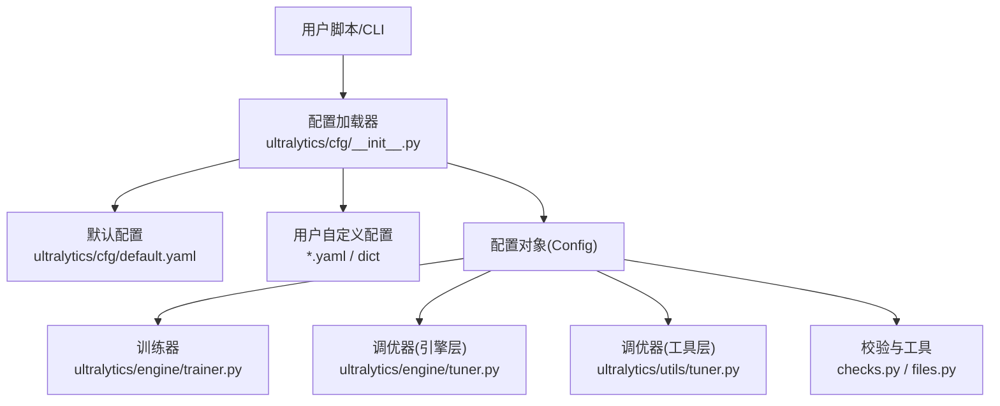
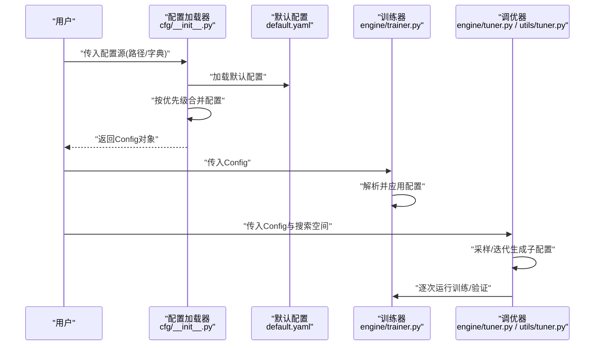
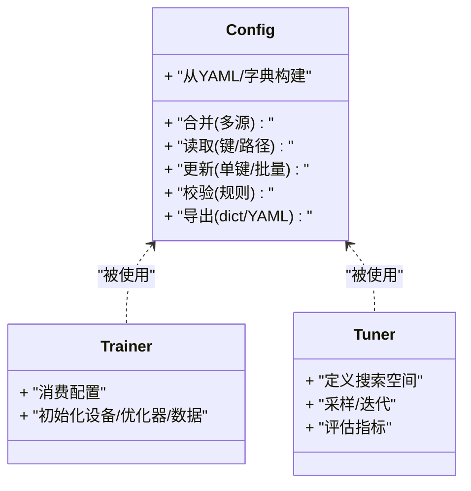
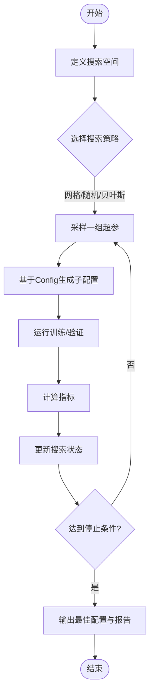
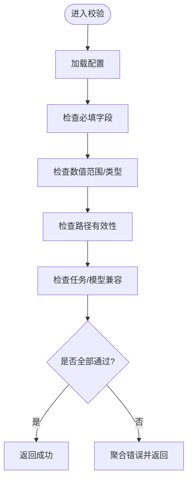
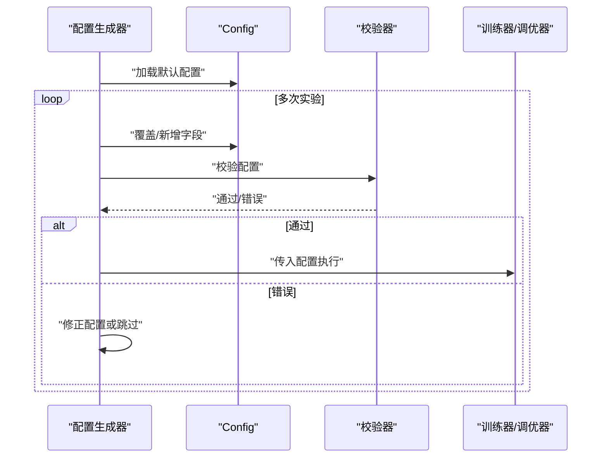
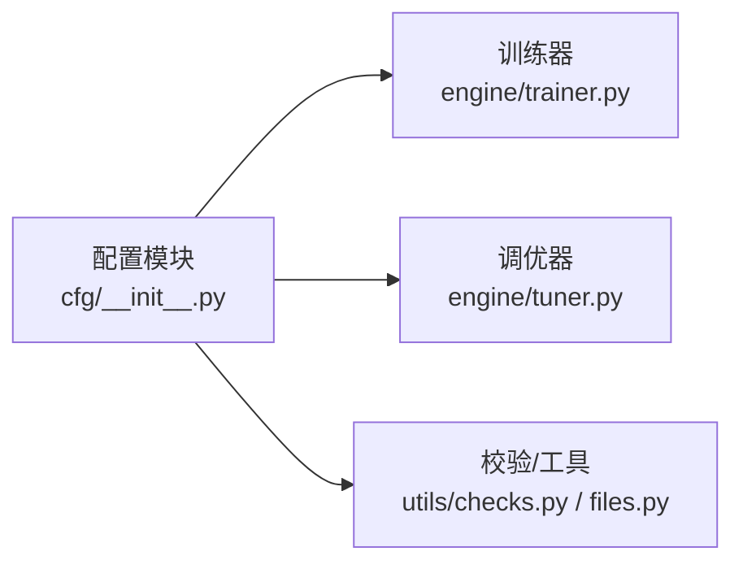

# 配置管理API

<cite>
**本文引用的文件**
- [ultralytics/cfg/__init__.py](file://ultralytics/cfg/__init__.py)
- [ultralytics/cfg/default.yaml](file://ultralytics/cfg/default.yaml)
- [ultralytics/engine/trainer.py](file://ultralytics/engine/trainer.py)
- [ultralytics/engine/tuner.py](file://ultralytics/engine/tuner.py)
- [ultralytics/utils/tuner.py](file://ultralytics/utils/tuner.py)
- [ultralytics/utils/checks.py](file://ultralytics/utils/checks.py)
- [ultralytics/utils/files.py](file://ultralytics/utils/files.py)
- [examples/lora_examples/yolo_master_lora_README.md](file://examples/lora_examples/yolo_master_lora_README.md)
</cite>

## 目录
1. [简介](#简介)
2. [项目结构](#项目结构)
3. [核心组件](#核心组件)
4. [架构总览](#架构总览)
5. [详细组件分析](#详细组件分析)
6. [依赖关系分析](#依赖关系分析)
7. [性能考量](#性能考量)
8. [故障排查指南](#故障排查指南)
9. [结论](#结论)
10. [附录](#附录)

## 简介
本文件面向YOLO-Master的配置管理系统，聚焦以下目标：
- 说明配置文件结构与层次关系（模型、训练、数据等）
- 记录Config类的主要操作方法（读取、修改、验证、保存）
- 解释超参数调优的API接口（搜索策略与参数空间定义）
- 明确默认配置的覆盖机制与优先级规则
- 提供配置文件模板与最佳实践
- 给出配置验证与错误检查的接口说明
- 展示如何通过编程方式动态生成配置

## 项目结构
配置相关代码主要分布在以下模块：
- 配置加载与合并：ultralytics/cfg/__init__.py
- 默认配置：ultralytics/cfg/default.yaml
- 训练流程对配置的解析与使用：ultralytics/engine/trainer.py
- 超参搜索与优化：ultralytics/engine/tuner.py、ultralytics/utils/tuner.py
- 配置校验与工具：ultralytics/utils/checks.py、ultralytics/utils/files.py
- 示例与模板参考：examples/lora_examples/yolo_master_lora_README.md

图示来源
- [ultralytics/cfg/__init__.py](file://ultralytics/cfg/__init__.py)
- [ultralytics/cfg/default.yaml](file://ultralytics/cfg/default.yaml)
- [ultralytics/engine/trainer.py](file://ultralytics/engine/trainer.py)
- [ultralytics/engine/tuner.py](file://ultralytics/engine/tuner.py)
- [ultralytics/utils/tuner.py](file://ultralytics/utils/tuner.py)
- [ultralytics/utils/checks.py](file://ultralytics/utils/checks.py)
- [ultralytics/utils/files.py](file://ultralytics/utils/files.py)

章节来源
- [ultralytics/cfg/__init__.py](file://ultralytics/cfg/__init__.py)
- [ultralytics/cfg/default.yaml](file://ultralytics/cfg/default.yaml)
- [ultralytics/engine/trainer.py](file://ultralytics/engine/trainer.py)
- [ultralytics/engine/tuner.py](file://ultralytics/engine/tuner.py)
- [ultralytics/utils/tuner.py](file://ultralytics/utils/tuner.py)
- [ultralytics/utils/checks.py](file://ultralytics/utils/checks.py)
- [ultralytics/utils/files.py](file://ultralytics/utils/files.py)

## 核心组件
- Config类（配置对象）
  - 职责：统一表示配置，支持从YAML或字典构建、深度合并、访问与修改、校验与持久化。
  - 典型能力：
    - 读取：从路径或内存字典加载配置
    - 合并：将多个配置源按优先级合并
    - 访问：通过点号路径或键名获取字段值
    - 修改：就地更新配置项
    - 校验：基于内置规则进行完整性与一致性检查
    - 保存：导出为YAML或字典
- 默认配置（default.yaml）
  - 作用：提供系统级默认值，作为所有任务的基线
- 训练器集成（trainer.py）
  - 在初始化时消费配置，用于设备、批大小、优化器、数据加载等关键设置
- 调优器（engine/tuner.py, utils/tuner.py）
  - 提供搜索策略与参数空间定义，驱动多组配置执行与结果评估

章节来源
- [ultralytics/cfg/__init__.py](file://ultralytics/cfg/__init__.py)
- [ultralytics/cfg/default.yaml](file://ultralytics/cfg/default.yaml)
- [ultralytics/engine/trainer.py](file://ultralytics/engine/trainer.py)
- [ultralytics/engine/tuner.py](file://ultralytics/engine/tuner.py)
- [ultralytics/utils/tuner.py](file://ultralytics/utils/tuner.py)

## 架构总览
下图展示了配置从加载到被训练与调优使用的整体流程。

图示来源
- [ultralytics/cfg/__init__.py](file://ultralytics/cfg/__init__.py)
- [ultralytics/cfg/default.yaml](file://ultralytics/cfg/default.yaml)
- [ultralytics/engine/trainer.py](file://ultralytics/engine/trainer.py)
- [ultralytics/engine/tuner.py](file://ultralytics/engine/tuner.py)
- [ultralytics/utils/tuner.py](file://ultralytics/utils/tuner.py)

## 详细组件分析

### 配置对象（Config）API
- 构造与读取
  - 从YAML文件或字典创建配置对象
  - 支持相对路径解析与资源定位
- 合并与覆盖
  - 支持多源合并，遵循“后覆盖前”的优先级
  - 默认配置优先于空值，用户配置覆盖默认值
- 访问与修改
  - 支持键名访问与层级访问
  - 支持就地更新与批量更新
- 校验与诊断
  - 提供基础校验入口，可结合外部校验逻辑
- 序列化
  - 导出为字典或写入YAML文件

图示来源
- [ultralytics/cfg/__init__.py](file://ultralytics/cfg/__init__.py)
- [ultralytics/engine/trainer.py](file://ultralytics/engine/trainer.py)
- [ultralytics/engine/tuner.py](file://ultralytics/engine/tuner.py)

章节来源
- [ultralytics/cfg/__init__.py](file://ultralytics/cfg/__init__.py)

### 配置文件结构与层次关系
- 顶层字段
  - 任务类型、模型选择、输出目录、日志与可视化开关等
- 模型配置
  - 网络结构、预训练权重、通道数、类别数、头配置等
- 训练参数
  - 学习率、优化器、调度器、批次大小、轮数、早停、混合精度等
- 数据设置
  - 数据集路径、标签格式、增强策略、分片与并行加载等
- 跟踪/导出/部署
  - 跟踪器选择、导出格式与后端、推理参数等

建议以分层组织配置，便于复用与覆盖。

章节来源
- [ultralytics/cfg/default.yaml](file://ultralytics/cfg/default.yaml)

### 超参数调优API
- 搜索空间定义
  - 支持连续、离散、分类等参数域
  - 支持条件参数与约束表达
- 搜索策略
  - 网格/随机/贝叶斯/启发式等策略可选
  - 支持并行与早停
- 评估与回传
  - 每轮训练结束后计算指标，反馈给搜索器
- 结果汇总
  - 记录每次运行的配置与指标，支持排序与导出

图示来源
- [ultralytics/engine/tuner.py](file://ultralytics/engine/tuner.py)
- [ultralytics/utils/tuner.py](file://ultralytics/utils/tuner.py)
- [ultralytics/cfg/__init__.py](file://ultralytics/cfg/__init__.py)

章节来源
- [ultralytics/engine/tuner.py](file://ultralytics/engine/tuner.py)
- [ultralytics/utils/tuner.py](file://ultralytics/utils/tuner.py)

### 默认配置覆盖机制与优先级
- 优先级顺序（由低到高）
  - 系统默认配置（default.yaml）
  - 任务/模型预设配置
  - 用户命令行/环境变量注入
  - 用户本地配置文件
  - 运行时动态更新（程序内调用更新接口）
- 合并策略
  - 同名字段高优先级覆盖低优先级
  - 嵌套字典按键递归合并
  - 列表通常整体替换而非逐项拼接（具体行为以实现为准）

章节来源
- [ultralytics/cfg/default.yaml](file://ultralytics/cfg/default.yaml)
- [ultralytics/cfg/__init__.py](file://ultralytics/cfg/__init__.py)

### 配置模板与最佳实践
- 模板来源
  - 参考LoRA示例文档中的配置样例与说明
- 最佳实践
  - 将通用部分放入默认配置，业务差异通过覆盖文件注入
  - 使用命名约定区分环境（dev/prod）与任务（train/val/export）
  - 对敏感信息（路径、密钥）采用环境变量注入
  - 保持配置版本化与可追溯

章节来源
- [examples/lora_examples/yolo_master_lora_README.md](file://examples/lora_examples/yolo_master_lora_README.md)

### 配置验证与错误检查
- 校验入口
  - 提供统一的校验方法，可在训练/导出前触发
- 常见检查项
  - 必填字段存在性
  - 数值范围与单位一致性
  - 路径有效性（数据集/权重/输出目录）
  - 任务与模型兼容性
- 错误处理
  - 抛出结构化异常，包含字段名、期望类型/范围、上下文提示
  - 支持收集多条错误一次性返回

图示来源
- [ultralytics/utils/checks.py](file://ultralytics/utils/checks.py)
- [ultralytics/utils/files.py](file://ultralytics/utils/files.py)
- [ultralytics/cfg/__init__.py](file://ultralytics/cfg/__init__.py)

章节来源
- [ultralytics/utils/checks.py](file://ultralytics/utils/checks.py)
- [ultralytics/utils/files.py](file://ultralytics/utils/files.py)

### 编程方式动态生成配置
- 思路
  - 以默认配置为基底，按需覆盖字段
  - 根据实验设计循环生成不同配置实例
  - 将生成的配置传递给训练器或调优器
- 步骤
  - 加载默认配置
  - 依据策略更新字段（如学习率、批次大小、增强强度）
  - 校验配置
  - 保存或提交至训练/调优流程

图示来源
- [ultralytics/cfg/__init__.py](file://ultralytics/cfg/__init__.py)
- [ultralytics/utils/checks.py](file://ultralytics/utils/checks.py)
- [ultralytics/engine/trainer.py](file://ultralytics/engine/trainer.py)
- [ultralytics/engine/tuner.py](file://ultralytics/engine/tuner.py)

章节来源
- [ultralytics/cfg/__init__.py](file://ultralytics/cfg/__init__.py)
- [ultralytics/utils/checks.py](file://ultralytics/utils/checks.py)
- [ultralytics/engine/trainer.py](file://ultralytics/engine/trainer.py)
- [ultralytics/engine/tuner.py](file://ultralytics/engine/tuner.py)

## 依赖关系分析
- 耦合关系
  - trainer.py依赖Config提供的训练期参数
  - tuner.py依赖Config进行配置派生与传递
  - checks.py与files.py为配置生命周期提供辅助能力
- 外部依赖
  - YAML解析、文件系统访问、日志与事件记录

图示来源
- [ultralytics/cfg/__init__.py](file://ultralytics/cfg/__init__.py)
- [ultralytics/engine/trainer.py](file://ultralytics/engine/trainer.py)
- [ultralytics/engine/tuner.py](file://ultralytics/engine/tuner.py)
- [ultralytics/utils/checks.py](file://ultralytics/utils/checks.py)
- [ultralytics/utils/files.py](file://ultralytics/utils/files.py)

章节来源
- [ultralytics/cfg/__init__.py](file://ultralytics/cfg/__init__.py)
- [ultralytics/engine/trainer.py](file://ultralytics/engine/trainer.py)
- [ultralytics/engine/tuner.py](file://ultralytics/engine/tuner.py)
- [ultralytics/utils/checks.py](file://ultralytics/utils/checks.py)
- [ultralytics/utils/files.py](file://ultralytics/utils/files.py)

## 性能考量
- 配置加载与合并应尽量在进程启动阶段完成，避免热路径重复解析
- 大配置文件的读写建议使用流式或懒加载策略
- 调优过程中减少不必要的配置拷贝，尽量原地更新
- 校验逻辑应轻量且可缓存，避免重复检查相同配置

[本节为通用指导，不直接分析具体文件]

## 故障排查指南
- 常见问题
  - 字段缺失或类型不符：检查必填项与类型约束
  - 路径无效：确认数据集/权重/输出目录是否存在且可读
  - 任务与模型不兼容：核对任务类型与模型头配置
  - 覆盖未生效：确认优先级顺序与合并策略
- 定位手段
  - 启用详细日志，打印最终合并后的配置
  - 逐步缩小覆盖范围，定位冲突字段
  - 使用校验器输出错误清单，逐一修复

章节来源
- [ultralytics/utils/checks.py](file://ultralytics/utils/checks.py)
- [ultralytics/utils/files.py](file://ultralytics/utils/files.py)

## 结论
本API围绕Config对象构建了完整的配置生命周期：从默认配置出发，经多源合并与严格校验，稳定地供给训练与调优流程。通过清晰的优先级规则与可扩展的校验/调优接口，用户能够以声明式与编程式两种方式高效管理复杂实验配置。

[本节为总结，不直接分析具体文件]

## 附录
- 术语
  - 配置源：YAML文件或字典形式的配置输入
  - 覆盖：高优先级配置替换低优先级同名字段
  - 搜索空间：超参数的取值集合与分布定义
- 参考
  - LoRA示例文档中提供了配置模板与实践要点

章节来源
- [examples/lora_examples/yolo_master_lora_README.md](file://examples/lora_examples/yolo_master_lora_README.md)