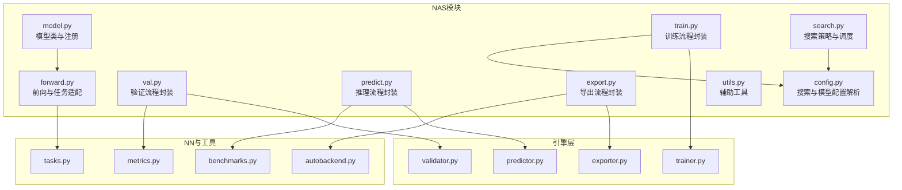
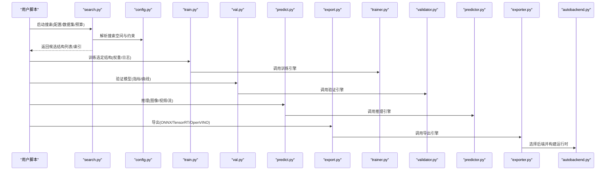
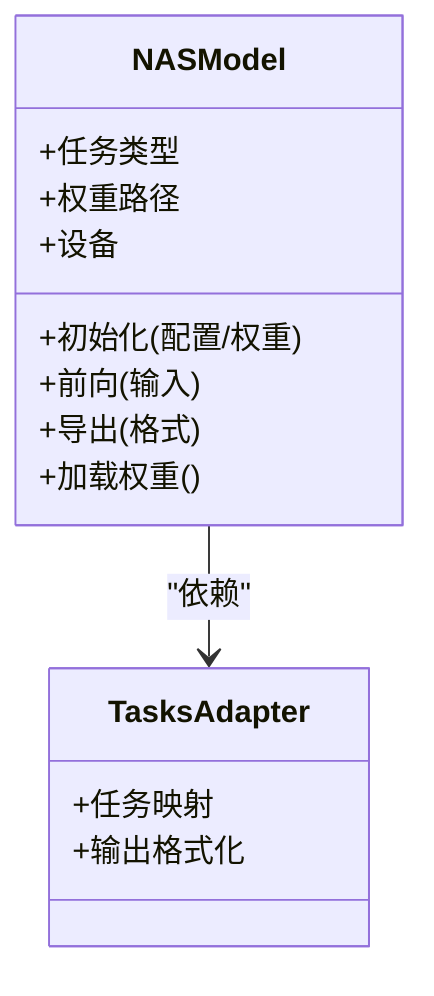
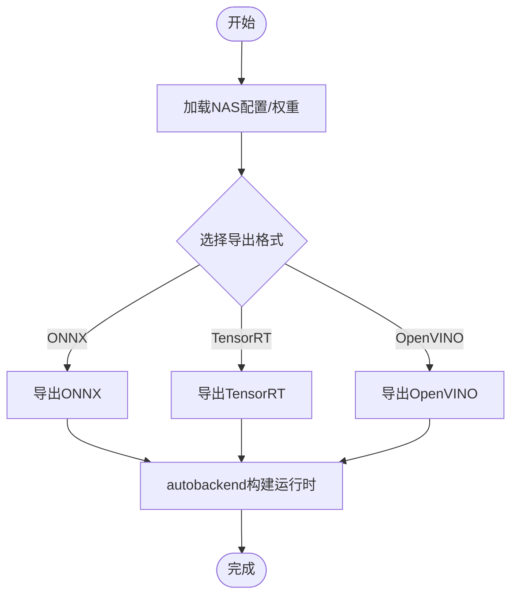
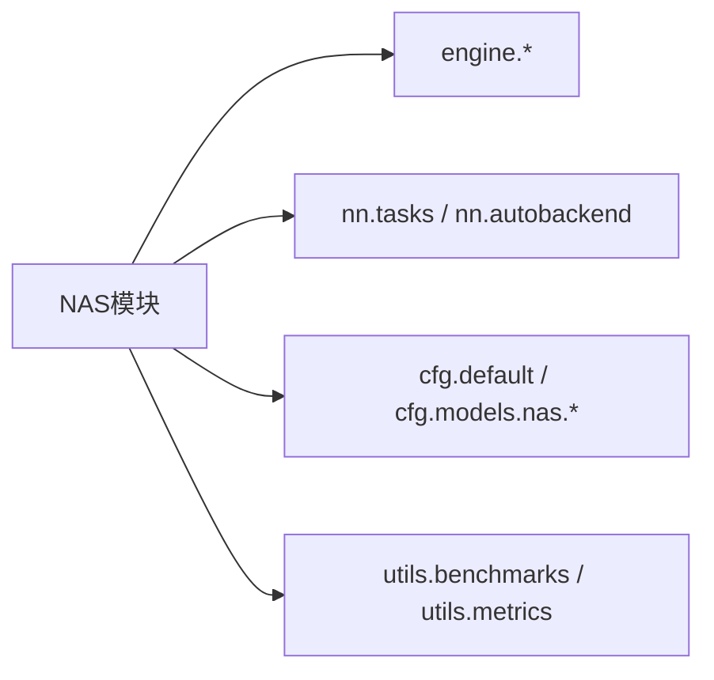

# NAS模型API

<cite>
**本文引用的文件**
- [ultralytics/models/nas/__init__.py](file://ultralytics/models/nas/__init__.py)
- [ultralytics/models/nas/model.py](file://ultralytics/models/nas/model.py)
- [ultralytics/models/nas/forward.py](file://ultralytics/models/nas/forward.py)
- [ultralytics/models/nas/export.py](file://ultralytics/models/nas/export.py)
- [ultralytics/models/nas/train.py](file://ultralytics/models/nas/train.py)
- [ultralytics/models/nas/val.py](file://ultralytics/models/nas/val.py)
- [ultralytics/models/nas/predict.py](file://ultralytics/models/nas/predict.py)
- [ultralytics/models/nas/search.py](file://ultralytics/models/nas/search.py)
- [ultralytics/models/nas/config.py](file://ultralytics/models/nas/config.py)
- [ultralytics/models/nas/utils.py](file://ultralytics/models/nas/utils.py)
- [ultralytics/engine/trainer.py](file://ultralytics/engine/trainer.py)
- [ultralytics/engine/validator.py](file://ultralytics/engine/validator.py)
- [ultralytics/engine/predictor.py](file://ultralytics/engine/predictor.py)
- [ultralytics/engine/exporter.py](file://ultralytics/engine/exporter.py)
- [ultralytics/nn/tasks.py](file://ultralytics/nn/tasks.py)
- [ultralytics/nn/autobackend.py](file://ultralytics/nn/autobackend.py)
- [ultralytics/utils/benchmarks.py](file://ultralytics/utils/benchmarks.py)
- [ultralytics/utils/metrics.py](file://ultralytics/utils/metrics.py)
- [ultralytics/cfg/default.yaml](file://ultralytics/cfg/default.yaml)
- [ultralytics/cfg/models/nas/yolo_nas_s.yaml](file://ultralytics/cfg/models/nas/yolo_nas_s.yaml)
- [ultralytics/cfg/models/nas/yolo_nas_m.yaml](file://ultralytics/cfg/models/nas/yolo_nas_m.yaml)
- [ultralytics/cfg/models/nas/yolo_nas_l.yaml](file://ultralytics/cfg/models/nas/yolo_nas_l.yaml)
- [examples/YOLOv8-ONNXRuntime-Python/main.py](file://examples/YOLOv8-ONNXRuntime-Python/main.py)
</cite>

## 目录
1. [简介](#简介)
2. [项目结构](#项目结构)
3. [核心组件](#核心组件)
4. [架构总览](#架构总览)
5. [详细组件分析](#详细组件分析)
6. [依赖关系分析](#依赖关系分析)
7. [性能考量](#性能考量)
8. [故障排查指南](#故障排查指南)
9. [结论](#结论)
10. [附录](#附录)

## 简介
本文件面向NAS（神经架构搜索）模型在YOLO-Master中的API与使用方式，聚焦以下目标：
- 解释NAS的基本原理及其在YOLO-Master中的实现要点
- 记录NAS模型的训练、推理、导出与部署接口
- 说明搜索结果的管理方法与最佳实践
- 对比NAS与传统YOLO的差异与优势
- 提供性能评估与优化建议

## 项目结构
NAS模块位于ultralytics/models/nas下，围绕“搜索—训练—验证—预测—导出”的完整链路组织。关键入口包括：
- 模型定义与注册：model.py、__init__.py
- 前向与任务适配：forward.py、tasks.py
- 训练/验证/预测：train.py、val.py、predict.py
- 导出与后端兼容：export.py、autobackend.py
- 搜索策略与配置：search.py、config.py、默认配置与NAS YAML
- 工具与基准：utils.py、benchmarks.py、metrics.py

图表来源
- [ultralytics/models/nas/model.py](file://ultralytics/models/nas/model.py)
- [ultralytics/models/nas/forward.py](file://ultralytics/models/nas/forward.py)
- [ultralytics/models/nas/train.py](file://ultralytics/models/nas/train.py)
- [ultralytics/models/nas/val.py](file://ultralytics/models/nas/val.py)
- [ultralytics/models/nas/predict.py](file://ultralytics/models/nas/predict.py)
- [ultralytics/models/nas/export.py](file://ultralytics/models/nas/export.py)
- [ultralytics/models/nas/search.py](file://ultralytics/models/nas/search.py)
- [ultralytics/models/nas/config.py](file://ultralytics/models/nas/config.py)
- [ultralytics/models/nas/utils.py](file://ultralytics/models/nas/utils.py)
- [ultralytics/engine/trainer.py](file://ultralytics/engine/trainer.py)
- [ultralytics/engine/validator.py](file://ultralytics/engine/validator.py)
- [ultralytics/engine/predictor.py](file://ultralytics/engine/predictor.py)
- [ultralytics/engine/exporter.py](file://ultralytics/engine/exporter.py)
- [ultralytics/nn/tasks.py](file://ultralytics/nn/tasks.py)
- [ultralytics/nn/autobackend.py](file://ultralytics/nn/autobackend.py)
- [ultralytics/utils/benchmarks.py](file://ultralytics/utils/benchmarks.py)
- [ultralytics/utils/metrics.py](file://ultralytics/utils/metrics.py)

章节来源
- [ultralytics/models/nas/__init__.py](file://ultralytics/models/nas/__init__.py)
- [ultralytics/models/nas/model.py](file://ultralytics/models/nas/model.py)
- [ultralytics/models/nas/forward.py](file://ultralytics/models/nas/forward.py)
- [ultralytics/models/nas/train.py](file://ultralytics/models/nas/train.py)
- [ultralytics/models/nas/val.py](file://ultralytics/models/nas/val.py)
- [ultralytics/models/nas/predict.py](file://ultralytics/models/nas/predict.py)
- [ultralytics/models/nas/export.py](file://ultralytics/models/nas/export.py)
- [ultralytics/models/nas/search.py](file://ultralytics/models/nas/search.py)
- [ultralytics/models/nas/config.py](file://ultralytics/models/nas/config.py)
- [ultralytics/models/nas/utils.py](file://ultralytics/models/nas/utils.py)

## 核心组件
- 模型类与注册：负责NAS模型实例化、权重加载、任务类型识别与统一接口暴露
- 前向与任务适配：将NAS结构与通用检测/分割等任务对齐，输出标准格式
- 训练/验证/预测/导出：分别封装对应生命周期，对接引擎层trainer/validator/predictor/exporter
- 搜索策略与配置：管理搜索空间、候选结构、评估指标与结果归档
- 工具与基准：提供常用算子、指标计算与性能基准能力

章节来源
- [ultralytics/models/nas/model.py](file://ultralytics/models/nas/model.py)
- [ultralytics/models/nas/forward.py](file://ultralytics/models/nas/forward.py)
- [ultralytics/models/nas/train.py](file://ultralytics/models/nas/train.py)
- [ultralytics/models/nas/val.py](file://ultralytics/models/nas/val.py)
- [ultralytics/models/nas/predict.py](file://ultralytics/models/nas/predict.py)
- [ultralytics/models/nas/export.py](file://ultralytics/models/nas/export.py)
- [ultralytics/models/nas/search.py](file://ultralytics/models/nas/search.py)
- [ultralytics/models/nas/config.py](file://ultralytics/models/nas/config.py)
- [ultralytics/models/nas/utils.py](file://ultralytics/models/nas/utils.py)

## 架构总览
NAS在YOLO-Master中通过“配置驱动+引擎集成”的方式工作：
- 用户通过NAS YAML或默认配置指定搜索空间与任务
- 搜索阶段生成候选结构并保存为中间权重/配置
- 训练/验证/预测/导出复用引擎层，保证与常规YOLO一致的使用体验
- 导出后由autobackend自动选择最优后端（如ONNX/TensorRT/OpenVINO等）

图表来源
- [ultralytics/models/nas/search.py](file://ultralytics/models/nas/search.py)
- [ultralytics/models/nas/config.py](file://ultralytics/models/nas/config.py)
- [ultralytics/models/nas/train.py](file://ultralytics/models/nas/train.py)
- [ultralytics/models/nas/val.py](file://ultralytics/models/nas/val.py)
- [ultralytics/models/nas/predict.py](file://ultralytics/models/nas/predict.py)
- [ultralytics/models/nas/export.py](file://ultralytics/models/nas/export.py)
- [ultralytics/engine/trainer.py](file://ultralytics/engine/trainer.py)
- [ultralytics/engine/validator.py](file://ultralytics/engine/validator.py)
- [ultralytics/engine/predictor.py](file://ultralytics/engine/predictor.py)
- [ultralytics/engine/exporter.py](file://ultralytics/engine/exporter.py)
- [ultralytics/nn/autobackend.py](file://ultralytics/nn/autobackend.py)

## 详细组件分析

### 模型类与注册（model.py）
- 职责：提供NAS模型的统一构造接口、权重加载、设备放置、任务类型推断
- 关键点：
  - 支持从YAML或预训练权重初始化
  - 与nn.tasks对齐，确保输出符合YOLO系列规范
  - 暴露与常规YOLO一致的load/predict/val/train方法

图表来源
- [ultralytics/models/nas/model.py](file://ultralytics/models/nas/model.py)
- [ultralytics/nn/tasks.py](file://ultralytics/nn/tasks.py)

章节来源
- [ultralytics/models/nas/model.py](file://ultralytics/models/nas/model.py)
- [ultralytics/nn/tasks.py](file://ultralytics/nn/tasks.py)

### 前向与任务适配（forward.py）
- 职责：将NAS内部表示转换为标准检测/分割等任务的张量输出
- 关键点：
  - 处理多尺度特征融合与解码
  - 与NMS、后处理逻辑解耦，便于不同后端优化

章节来源
- [ultralytics/models/nas/forward.py](file://ultralytics/models/nas/forward.py)
- [ultralytics/nn/tasks.py](file://ultralytics/nn/tasks.py)

### 训练流程（train.py）
- 职责：封装NAS模型的训练过程，对接engine.trainer
- 关键点：
  - 支持从搜索得到的候选结构继续微调
  - 可结合默认配置与自定义超参
  - 训练日志与检查点遵循YOLO标准路径

章节来源
- [ultralytics/models/nas/train.py](file://ultralytics/models/nas/train.py)
- [ultralytics/engine/trainer.py](file://ultralytics/engine/trainer.py)
- [ultralytics/cfg/default.yaml](file://ultralytics/cfg/default.yaml)

### 验证流程（val.py）
- 职责：执行验证，计算mAP、精度、召回等指标
- 关键点：
  - 与engine.validator对接
  - 输出与可视化遵循YOLO标准

章节来源
- [ultralytics/models/nas/val.py](file://ultralytics/models/nas/val.py)
- [ultralytics/engine/validator.py](file://ultralytics/engine/validator.py)
- [ultralytics/utils/metrics.py](file://ultralytics/utils/metrics.py)

### 推理流程（predict.py）
- 职责：提供端到端推理接口，支持图像/视频/流
- 关键点：
  - 与engine.predictor对接
  - 自动设备选择与批处理
  - 可选后处理与可视化

章节来源
- [ultralytics/models/nas/predict.py](file://ultralytics/models/nas/predict.py)
- [ultralytics/engine/predictor.py](file://ultralytics/engine/predictor.py)
- [ultralytics/utils/benchmarks.py](file://ultralytics/utils/benchmarks.py)

### 导出流程（export.py）
- 职责：将NAS模型导出为ONNX/TensorRT/OpenVINO等格式
- 关键点：
  - 与engine.exporter对接
  - 自动选择最优后端（autobackend）
  - 支持动态形状与静态形状导出

图表来源
- [ultralytics/models/nas/export.py](file://ultralytics/models/nas/export.py)
- [ultralytics/engine/exporter.py](file://ultralytics/engine/exporter.py)
- [ultralytics/nn/autobackend.py](file://ultralytics/nn/autobackend.py)

章节来源
- [ultralytics/models/nas/export.py](file://ultralytics/models/nas/export.py)
- [ultralytics/engine/exporter.py](file://ultralytics/engine/exporter.py)
- [ultralytics/nn/autobackend.py](file://ultralytics/nn/autobackend.py)

### 搜索策略与配置（search.py, config.py）
- 职责：定义搜索空间、评估指标、预算控制与结果归档
- 关键点：
  - 支持基于性能的早期停止与剪枝
  - 结果以结构化形式保存，便于后续比较与复现
  - 与默认配置和NAS YAML联动

章节来源
- [ultralytics/models/nas/search.py](file://ultralytics/models/nas/search.py)
- [ultralytics/models/nas/config.py](file://ultralytics/models/nas/config.py)

### 工具与基准（utils.py, benchmarks.py, metrics.py）
- 职责：提供常用工具函数、性能基准与指标计算
- 关键点：
  - 统一的指标口径，便于跨模型比较
  - 基准测试覆盖延迟、吞吐与资源占用

章节来源
- [ultralytics/models/nas/utils.py](file://ultralytics/models/nas/utils.py)
- [ultralytics/utils/benchmarks.py](file://ultralytics/utils/benchmarks.py)
- [ultralytics/utils/metrics.py](file://ultralytics/utils/metrics.py)

## 依赖关系分析
NAS模块对引擎层与NN层的依赖清晰且单向，避免循环依赖：
- NAS模块依赖engine（trainer/validator/predictor/exporter）
- forward与tasks耦合紧密，但通过接口隔离
- export与autobackend协作，形成稳定的导出链路

图表来源
- [ultralytics/models/nas/model.py](file://ultralytics/models/nas/model.py)
- [ultralytics/models/nas/forward.py](file://ultralytics/models/nas/forward.py)
- [ultralytics/models/nas/export.py](file://ultralytics/models/nas/export.py)
- [ultralytics/engine/trainer.py](file://ultralytics/engine/trainer.py)
- [ultralytics/engine/validator.py](file://ultralytics/engine/validator.py)
- [ultralytics/engine/predictor.py](file://ultralytics/engine/predictor.py)
- [ultralytics/engine/exporter.py](file://ultralytics/engine/exporter.py)
- [ultralytics/nn/tasks.py](file://ultralytics/nn/tasks.py)
- [ultralytics/nn/autobackend.py](file://ultralytics/nn/autobackend.py)
- [ultralytics/cfg/default.yaml](file://ultralytics/cfg/default.yaml)
- [ultralytics/cfg/models/nas/yolo_nas_s.yaml](file://ultralytics/cfg/models/nas/yolo_nas_s.yaml)
- [ultralytics/cfg/models/nas/yolo_nas_m.yaml](file://ultralytics/cfg/models/nas/yolo_nas_m.yaml)
- [ultralytics/cfg/models/nas/yolo_nas_l.yaml](file://ultralytics/cfg/models/nas/yolo_nas_l.yaml)
- [ultralytics/utils/benchmarks.py](file://ultralytics/utils/benchmarks.py)
- [ultralytics/utils/metrics.py](file://ultralytics/utils/metrics.py)

章节来源
- [ultralytics/models/nas/model.py](file://ultralytics/models/nas/model.py)
- [ultralytics/models/nas/forward.py](file://ultralytics/models/nas/forward.py)
- [ultralytics/models/nas/export.py](file://ultralytics/models/nas/export.py)
- [ultralytics/engine/trainer.py](file://ultralytics/engine/trainer.py)
- [ultralytics/engine/validator.py](file://ultralytics/engine/validator.py)
- [ultralytics/engine/predictor.py](file://ultralytics/engine/predictor.py)
- [ultralytics/engine/exporter.py](file://ultralytics/engine/exporter.py)
- [ultralytics/nn/tasks.py](file://ultralytics/nn/tasks.py)
- [ultralytics/nn/autobackend.py](file://ultralytics/nn/autobackend.py)
- [ultralytics/cfg/default.yaml](file://ultralytics/cfg/default.yaml)
- [ultralytics/cfg/models/nas/yolo_nas_s.yaml](file://ultralytics/cfg/models/nas/yolo_nas_s.yaml)
- [ultralytics/cfg/models/nas/yolo_nas_m.yaml](file://ultralytics/cfg/models/nas/yolo_nas_m.yaml)
- [ultralytics/cfg/models/nas/yolo_nas_l.yaml](file://ultralytics/cfg/models/nas/yolo_nas_l.yaml)
- [ultralytics/utils/benchmarks.py](file://ultralytics/utils/benchmarks.py)
- [ultralytics/utils/metrics.py](file://ultralytics/utils/metrics.py)

## 性能考量
- 导出后端选择：优先使用autobackend自动选择最优后端，减少手动调优成本
- 动态/静态形状：根据部署场景选择合适的导出模式，平衡灵活性与性能
- 指标口径：统一使用metrics与benchmarks，确保可比性
- 资源监控：关注GPU/CPU内存占用与显存峰值，必要时调整batch size与输入分辨率

[本节为通用指导，不直接分析具体文件]

## 故障排查指南
- 权重加载失败：确认权重路径与任务类型匹配；检查NAS YAML与默认配置一致性
- 导出报错：核对导出格式与后端版本兼容性；查看autobackend日志定位问题
- 推理异常：检查输入尺寸与动态范围；确认NMS与后处理参数设置
- 训练不稳定：调整学习率与数据增强；观察损失曲线与梯度范数

章节来源
- [ultralytics/models/nas/model.py](file://ultralytics/models/nas/model.py)
- [ultralytics/models/nas/export.py](file://ultralytics/models/nas/export.py)
- [ultralytics/nn/autobackend.py](file://ultralytics/nn/autobackend.py)
- [ultralytics/engine/trainer.py](file://ultralytics/engine/trainer.py)
- [ultralytics/engine/predictor.py](file://ultralytics/engine/predictor.py)

## 结论
NAS在YOLO-Master中以“配置驱动+引擎集成”的方式无缝融入现有工作流。通过统一的训练/验证/预测/导出接口，用户可以快速完成从搜索到部署的全流程。推荐优先使用autobackend与标准指标体系，以获得稳定且可复现的性能表现。

[本节为总结性内容，不直接分析具体文件]

## 附录

### NAS基本原理与在YOLO-Master中的实现要点
- 搜索空间：包含骨干网络宽度、深度、分支结构、融合方式等维度
- 评估指标：以验证集mAP为核心，辅以延迟与资源占用
- 结果管理：按结构索引保存权重与配置，便于回溯与对比
- 与YOLO集成：通过tasks与engine层保持接口一致，降低迁移成本

[本节为概念性内容，不直接分析具体文件]

### 使用指南（训练与推理）
- 训练：
  - 准备数据集与NAS YAML配置
  - 运行训练流程，产出权重与日志
  - 参考示例脚本了解命令行与参数
- 推理：
  - 加载权重与配置
  - 调用推理接口进行图像/视频/流处理
  - 参考示例脚本了解基本用法

章节来源
- [ultralytics/models/nas/train.py](file://ultralytics/models/nas/train.py)
- [ultralytics/models/nas/predict.py](file://ultralytics/models/nas/predict.py)
- [examples/YOLOv8-ONNXRuntime-Python/main.py](file://examples/YOLOv8-ONNXRuntime-Python/main.py)

### 搜索结果管理与部署
- 结果归档：按结构ID/索引组织权重与配置，附带验证指标与元数据
- 部署流程：导出为ONNX/TensorRT/OpenVINO，使用autobackend构建运行时
- 版本管理：保留历史版本与对比报告，便于回滚与审计

章节来源
- [ultralytics/models/nas/search.py](file://ultralytics/models/nas/search.py)
- [ultralytics/models/nas/export.py](file://ultralytics/models/nas/export.py)
- [ultralytics/nn/autobackend.py](file://ultralytics/nn/autobackend.py)

### NAS与传统YOLO的差异与优势
- 差异：
  - NAS强调结构搜索与自动化设计，传统YOLO侧重固定结构的工程优化
  - NAS需要额外的搜索与评估阶段，传统YOLO可直接训练与部署
- 优势：
  - 针对特定任务/数据分布可能获得更优的结构
  - 在精度与效率之间提供更灵活的权衡

[本节为概念性内容，不直接分析具体文件]

### 性能评估与优化建议
- 评估：
  - 使用统一指标体系（mAP、延迟、吞吐）
  - 在不同硬件上重复测试，确保稳定性
- 优化：
  - 调整导出模式（动态/静态形状）
  - 利用autobackend选择最优后端
  - 结合数据增强与正则化提升泛化

章节来源
- [ultralytics/utils/benchmarks.py](file://ultralytics/utils/benchmarks.py)
- [ultralytics/utils/metrics.py](file://ultralytics/utils/metrics.py)
- [ultralytics/nn/autobackend.py](file://ultralytics/nn/autobackend.py)