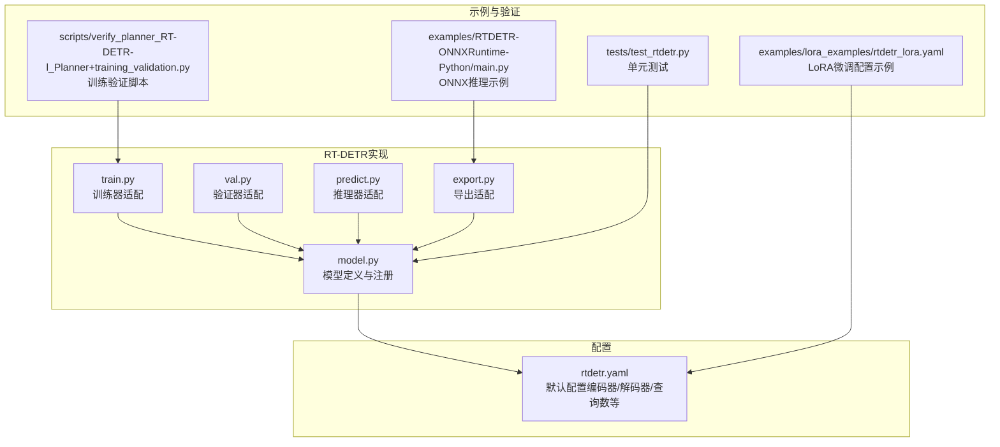
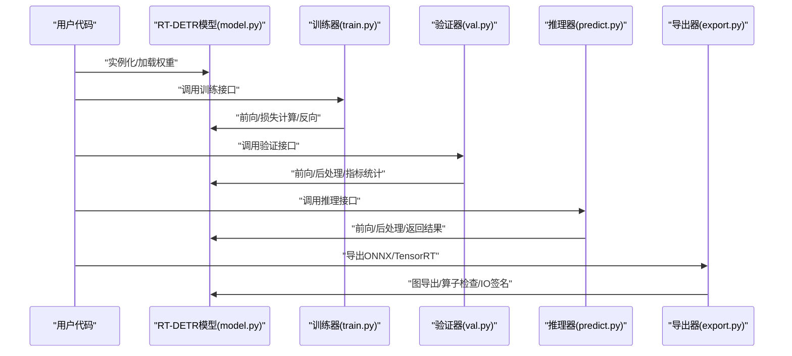
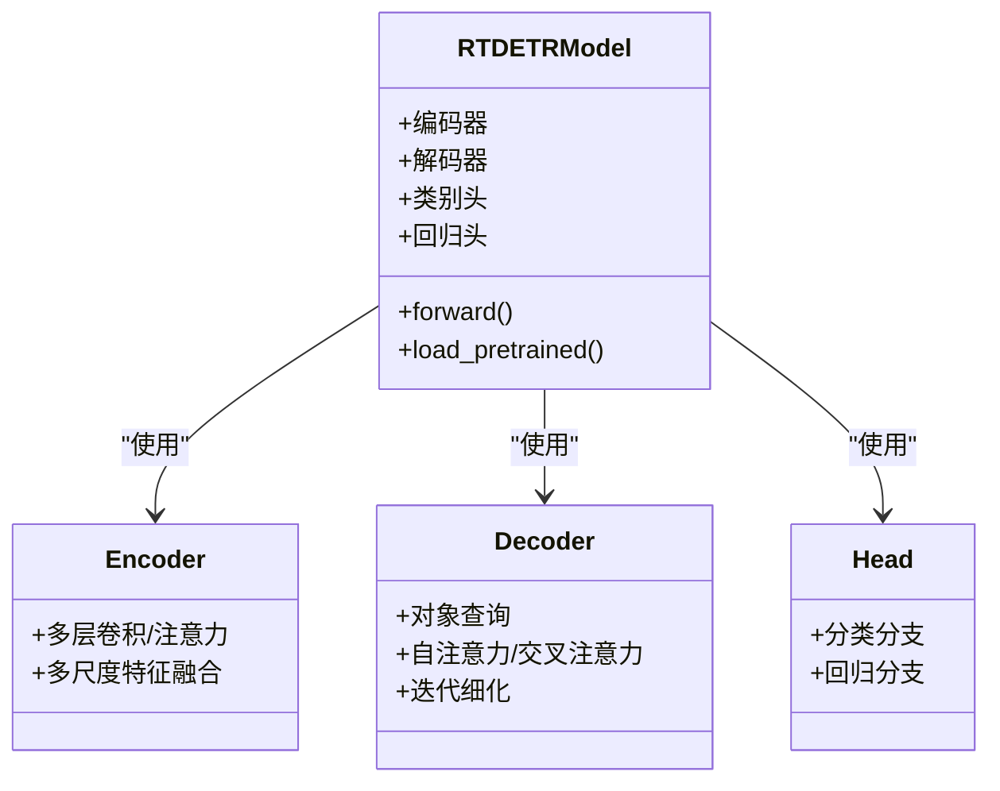
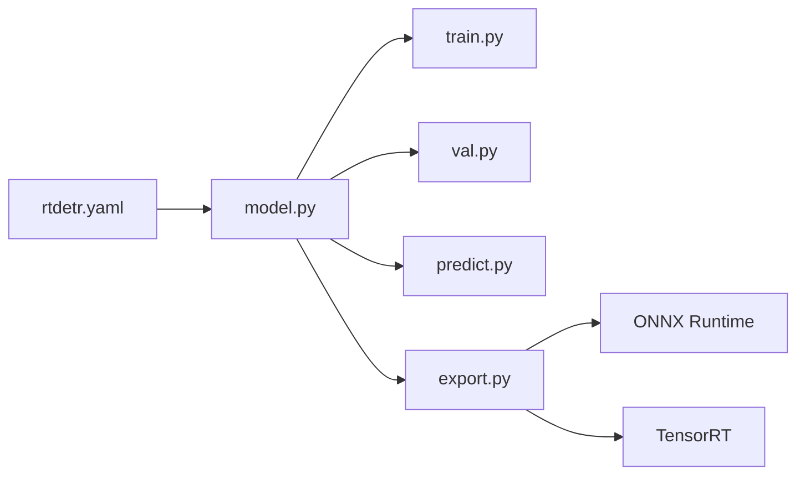

# RT-DETR模型API

<cite>
**本文引用的文件**
- [ultralytics/models/rtdetr/model.py](file://ultralytics/models/rtdetr/model.py)
- [ultralytics/models/rtdetr/train.py](file://ultralytics/models/rtdetr/train.py)
- [ultralytics/models/rtdetr/val.py](file://ultralytics/models/rtdetr/val.py)
- [ultralytics/models/rtdetr/predict.py](file://ultralytics/models/rtdetr/predict.py)
- [ultralytics/models/rtdetr/export.py](file://ultralytics/models/rtdetr/export.py)
- [ultralytics/cfg/models/rtdetr/rtdetr.yaml](file://ultralytics/cfg/models/rtdetr/rtdetr.yaml)
- [examples/RTDETR-ONNXRuntime-Python/main.py](file://examples/RTDETR-ONNXRuntime-Python/main.py)
- [examples/lora_examples/rtdetr_lora.yaml](file://examples/lora_examples/rtdetr_lora.yaml)
- [scripts/verify_planner_RT-DETR-l_Planner+training_validation.py](file://scripts/verify_planner_RT-DETR-l_Planner+training_validation.py)
- [tests/test_rtdetr.py](file://tests/test_rtdetr.py)
</cite>

## 目录
1. [简介](#简介)
2. [项目结构](#项目结构)
3. [核心组件](#核心组件)
4. [架构总览](#架构总览)
5. [详细组件分析](#详细组件分析)
6. [依赖关系分析](#依赖关系分析)
7. [性能考量](#性能考量)
8. [故障排查指南](#故障排查指南)
9. [结论](#结论)
10. [附录](#附录)

## 简介
本文件面向使用与扩展RT-DETR（基于Transformer的目标检测）的开发者，提供从模型构造、训练、推理到导出的完整API文档。内容涵盖：
- Transformer目标检测原理与配置要点（编码器、解码器、查询数量等）
- 预训练权重加载与使用
- 在不同数据集上的训练流程与超参数调优建议
- 与YOLO系列模型的差异与选择指南
- 导出至ONNX、TensorRT等格式的接口说明
- 性能基准测试与对比分析方法

## 项目结构
RT-DETR在仓库中的实现位于ultralytics/models/rtdetr目录，配套配置文件位于ultralytics/cfg/models/rtdetr。示例与验证脚本分别位于examples和scripts/tests目录。

图表来源
- [ultralytics/models/rtdetr/model.py](file://ultralytics/models/rtdetr/model.py)
- [ultralytics/models/rtdetr/train.py](file://ultralytics/models/rtdetr/train.py)
- [ultralytics/models/rtdetr/val.py](file://ultralytics/models/rtdetr/val.py)
- [ultralytics/models/rtdetr/predict.py](file://ultralytics/models/rtdetr/predict.py)
- [ultralytics/models/rtdetr/export.py](file://ultralytics/models/rtdetr/export.py)
- [ultralytics/cfg/models/rtdetr/rtdetr.yaml](file://ultralytics/cfg/models/rtdetr/rtdetr.yaml)
- [examples/RTDETR-ONNXRuntime-Python/main.py](file://examples/RTDETR-ONNXRuntime-Python/main.py)
- [examples/lora_examples/rtdetr_lora.yaml](file://examples/lora_examples/rtdetr_lora.yaml)
- [scripts/verify_planner_RT-DETR-l_Planner+training_validation.py](file://scripts/verify_planner_RT-DETR-l_Planner+training_validation.py)
- [tests/test_rtdetr.py](file://tests/test_rtdetr.py)

章节来源
- [ultralytics/models/rtdetr/model.py](file://ultralytics/models/rtdetr/model.py)
- [ultralytics/cfg/models/rtdetr/rtdetr.yaml](file://ultralytics/cfg/models/rtdetr/rtdetr.yaml)

## 核心组件
- 模型定义与注册：负责构建RT-DETR网络、初始化编码器/解码器、设置类别数与查询数量等关键参数。
- 训练器适配：将RT-DETR接入统一训练框架，支持数据加载、损失计算、优化器与调度器、EMA等。
- 验证器适配：提供mAP等指标评估、阈值扫描、NMS后处理与可视化输出。
- 推理器适配：封装预测流程，包括预处理、前向传播、后处理与结果解析。
- 导出适配：对接导出管线，生成ONNX/TensorRT等格式并校验输入输出契约。

章节来源
- [ultralytics/models/rtdetr/model.py](file://ultralytics/models/rtdetr/model.py)
- [ultralytics/models/rtdetr/train.py](file://ultralytics/models/rtdetr/train.py)
- [ultralytics/models/rtdetr/val.py](file://ultralytics/models/rtdetr/val.py)
- [ultralytics/models/rtdetr/predict.py](file://ultralytics/models/rtdetr/predict.py)
- [ultralytics/models/rtdetr/export.py](file://ultralytics/models/rtdetr/export.py)

## 架构总览
RT-DETR采用“编码器-解码器”的Transformer架构进行端到端目标检测。编码器对图像特征进行多尺度编码；解码器通过可学习的对象查询与自注意力/交叉注意力机制迭代细化候选框与类别概率，最终经去重与阈值筛选得到检测结果。

图表来源
- [ultralytics/models/rtdetr/model.py](file://ultralytics/models/rtdetr/model.py)
- [ultralytics/models/rtdetr/train.py](file://ultralytics/models/rtdetr/train.py)
- [ultralytics/models/rtdetr/val.py](file://ultralytics/models/rtdetr/val.py)
- [ultralytics/models/rtdetr/predict.py](file://ultralytics/models/rtdetr/predict.py)
- [ultralytics/models/rtdetr/export.py](file://ultralytics/models/rtdetr/export.py)

## 详细组件分析

### 模型构造与配置（model.py + rtdetr.yaml）
- 关键配置项（来自配置文件）：
  - 编码器/解码器层数、隐藏维度、注意力头数
  - 对象查询数量（影响候选框上限与计算量）
  - 类别数、分类与回归分支结构
  - 位置编码、归一化策略、激活函数
- 构造流程：
  - 读取配置并实例化编码器/解码器
  - 初始化类别头与边界框回归头
  - 可选：加载预训练权重或冻结部分模块
- 复杂度与容量：
  - 查询数量线性影响解码器计算与显存占用
  - 编码器深度与通道数决定特征表达能力与速度权衡

章节来源
- [ultralytics/models/rtdetr/model.py](file://ultralytics/models/rtdetr/model.py)
- [ultralytics/cfg/models/rtdetr/rtdetr.yaml](file://ultralytics/cfg/models/rtdetr/rtdetr.yaml)

#### 类关系图（概念映射）

图表来源
- [ultralytics/models/rtdetr/model.py](file://ultralytics/models/rtdetr/model.py)

### 训练接口（train.py）
- 训练入口：
  - 接收数据集路径、批次大小、学习率、轮次等参数
  - 自动构建数据管道、损失函数、优化器与学习率调度器
- 训练循环：
  - 前向计算、损失分解（分类/回归/匹配）、反向传播
  - EMA权重更新、日志记录、检查点保存
- 分布式与混合精度：
  - 支持DDP/AMP等加速特性（由上层引擎注入）

章节来源
- [ultralytics/models/rtdetr/train.py](file://ultralytics/models/rtdetr/train.py)

### 验证接口（val.py）
- 验证流程：
  - 批量推理、NMS后处理、置信度阈值扫描
  - 计算mAP、precision、recall等指标
- 输出：
  - 指标汇总、混淆矩阵、PR曲线、可视化结果

章节来源
- [ultralytics/models/rtdetr/val.py](file://ultralytics/models/rtdetr/val.py)

### 推理接口（predict.py）
- 推理流程：
  - 图像预处理（缩放、归一化）
  - 模型前向、解码器输出解析、NMS过滤
  - 返回边界框、类别、置信度及可选掩码/关键点
- 集成方式：
  - 可直接调用预测方法或在服务中封装为REST/gRPC接口

章节来源
- [ultralytics/models/rtdetr/predict.py](file://ultralytics/models/rtdetr/predict.py)

### 导出接口（export.py）
- 支持的导出格式：
  - ONNX（静态/动态形状）
  - TensorRT（FP16/INT8校准）
  - 其他后端（如OpenVINO/TFLite，视平台能力）
- 导出步骤：
  - 图追踪/符号执行、算子兼容性检查
  - 生成模型文件与输入输出签名
  - 可选：量化与优化选项

章节来源
- [ultralytics/models/rtdetr/export.py](file://ultralytics/models/rtdetr/export.py)

### 预训练权重加载与使用
- 加载方式：
  - 通过模型构造函数传入权重路径或名称
  - 支持部分权重加载与冻结策略
- 使用建议：
  - 小数据集优先微调高层模块
  - 大任务可全参微调并结合数据增强

章节来源
- [ultralytics/models/rtdetr/model.py](file://ultralytics/models/rtdetr/model.py)

### LoRA微调示例（rtdetr_lora.yaml）
- 用途：
  - 针对特定领域数据快速适配，降低全参微调成本
- 关键设置：
  - LoRA秩、目标模块选择、学习率与正则化
- 参考示例：
  - 配置文件与运行脚本见示例目录

章节来源
- [examples/lora_examples/rtdetr_lora.yaml](file://examples/lora_examples/rtdetr_lora.yaml)

### ONNX推理示例（main.py）
- 流程：
  - 加载ONNX模型、准备输入张量、执行推理
  - 解析输出并进行可视化
- 适用场景：
  - 跨语言部署、服务端推理、边缘设备

章节来源
- [examples/RTDETR-ONNXRuntime-Python/main.py](file://examples/RTDETR-ONNXRuntime-Python/main.py)

### 训练验证脚本（verify_planner_RT-DETR-l_Planner+training_validation.py）
- 作用：
  - 复现实验、验证训练流程与配置一致性
- 关注点：
  - 数据路径、超参数、随机种子、结果收敛性

章节来源
- [scripts/verify_planner_RT-DETR-l_Planner+training_validation.py](file://scripts/verify_planner_RT-DETR-l_Planner+training_validation.py)

### 单元测试（test_rtdetr.py）
- 覆盖范围：
  - 模型构造、前向形状、导出契约、数值稳定性
- 目的：
  - 保障版本升级与重构时的行为一致

章节来源
- [tests/test_rtdetr.py](file://tests/test_rtdetr.py)

## 依赖关系分析
- 内部依赖：
  - model.py为核心，被train/val/predict/export复用
  - rtdetr.yaml提供默认超参与结构定义
- 外部依赖：
  - 深度学习框架（PyTorch）
  - 导出工具链（ONNX Runtime、TensorRT等）
  - 数据处理与可视化工具

图表来源
- [ultralytics/models/rtdetr/model.py](file://ultralytics/models/rtdetr/model.py)
- [ultralytics/models/rtdetr/train.py](file://ultralytics/models/rtdetr/train.py)
- [ultralytics/models/rtdetr/val.py](file://ultralytics/models/rtdetr/val.py)
- [ultralytics/models/rtdetr/predict.py](file://ultralytics/models/rtdetr/predict.py)
- [ultralytics/models/rtdetr/export.py](file://ultralytics/models/rtdetr/export.py)
- [ultralytics/cfg/models/rtdetr/rtdetr.yaml](file://ultralytics/cfg/models/rtdetr/rtdetr.yaml)

## 性能考量
- 查询数量：
  - 增大可提高召回但增加延迟与显存；需结合数据集密度调整
- 编码器深度与通道：
  - 更深的编码器提升小目标检测，但训练/推理时间增长
- 批大小与混合精度：
  - 提高吞吐，注意梯度累积与数值稳定
- NMS与阈值：
  - 阈值过高会漏检，过低会增加误检；建议按任务做阈值扫描
- 导出优化：
  - TensorRT FP16/INT8可显著降延迟；需确保算子兼容与校准集质量

[本节为通用指导，不直接分析具体文件]

## 故障排查指南
- 常见错误：
  - 形状不匹配：检查输入尺寸与动态形状设置
  - 算子不支持：导出时查看警告，必要时降级或替换算子
  - 内存溢出：减小批大小、查询数量或启用混合精度
- 定位方法：
  - 打印中间张量形状与数值范围
  - 使用最小可复现脚本与固定随机种子
  - 对比验证器与推理器的输出一致性

章节来源
- [tests/test_rtdetr.py](file://tests/test_rtdetr.py)
- [ultralytics/models/rtdetr/export.py](file://ultralytics/models/rtdetr/export.py)

## 结论
RT-DETR在本仓库中以模块化方式集成于统一训练/推理/导出框架，具备清晰的API与可扩展的配置体系。通过合理调节查询数量、编码器规模与导出优化，可在精度与效率间取得良好平衡。配合LoRA微调与标准化验证流程，可高效落地到多样化业务场景。

[本节为总结，不直接分析具体文件]

## 附录

### Transformer目标检测原理与配置要点
- 原理要点：
  - 编码器提取多尺度特征
  - 解码器以对象查询为中心，通过注意力交互逐步细化
  - 二分匹配损失将预测与真实框对齐
- 配置要点：
  - 查询数量、编码器/解码器层数、隐藏维、注意力头数
  - 类别数、分类/回归分支结构、位置编码策略

章节来源
- [ultralytics/cfg/models/rtdetr/rtdetr.yaml](file://ultralytics/cfg/models/rtdetr/rtdetr.yaml)
- [ultralytics/models/rtdetr/model.py](file://ultralytics/models/rtdetr/model.py)

### 预训练权重加载与使用
- 加载接口：
  - 通过模型构造参数指定权重路径或名称
- 使用建议：
  - 冻结底层编码器进行轻量微调
  - 全参微调时降低初始学习率并使用余弦退火

章节来源
- [ultralytics/models/rtdetr/model.py](file://ultralytics/models/rtdetr/model.py)

### 不同数据集的训练流程与超参数调优建议
- 流程：
  - 准备数据集与标签格式
  - 配置数据路径、类别数、输入尺寸
  - 启动训练、监控指标、保存最佳权重
- 调优建议：
  - 小目标密集场景：增大查询数量、加深编码器
  - 实时场景：减少查询数量、使用更浅编码器与导出优化
  - 数据不平衡：调整损失权重与采样策略

章节来源
- [ultralytics/models/rtdetr/train.py](file://ultralytics/models/rtdetr/train.py)
- [ultralytics/models/rtdetr/val.py](file://ultralytics/models/rtdetr/val.py)

### 与YOLO系列模型的差异与选择指南
- 差异：
  - RT-DETR为端到端Transformer架构，无需锚框与复杂后处理
  - YOLO系列多为单阶段Anchor-Free/Anchor-Based检测，强调速度与工程优化
- 选择：
  - 需要更强泛化与小目标能力：优先考虑RT-DETR
  - 极致延迟与资源受限：优先考虑YOLO系列

[本节为概念性对比，不直接分析具体文件]

### 导出到ONNX、TensorRT等格式
- ONNX：
  - 静态/动态形状、算子兼容性检查、输入输出签名
- TensorRT：
  - FP16/INT8量化、校准集准备、引擎构建与缓存
- 验证：
  - 导出前后数值一致性、形状与类型契约

章节来源
- [ultralytics/models/rtdetr/export.py](file://ultralytics/models/rtdetr/export.py)
- [examples/RTDETR-ONNXRuntime-Python/main.py](file://examples/RTDETR-ONNXRuntime-Python/main.py)

### 性能基准测试与对比分析方法
- 方法：
  - 固定输入尺寸与批大小，测量吞吐与延迟
  - 在不同硬件上重复实验，记录能耗与温度
  - 对比不同导出格式与量化策略的效果
- 指标：
  - mAP、FPS、显存占用、CPU/GPU利用率

[本节为通用指导，不直接分析具体文件]