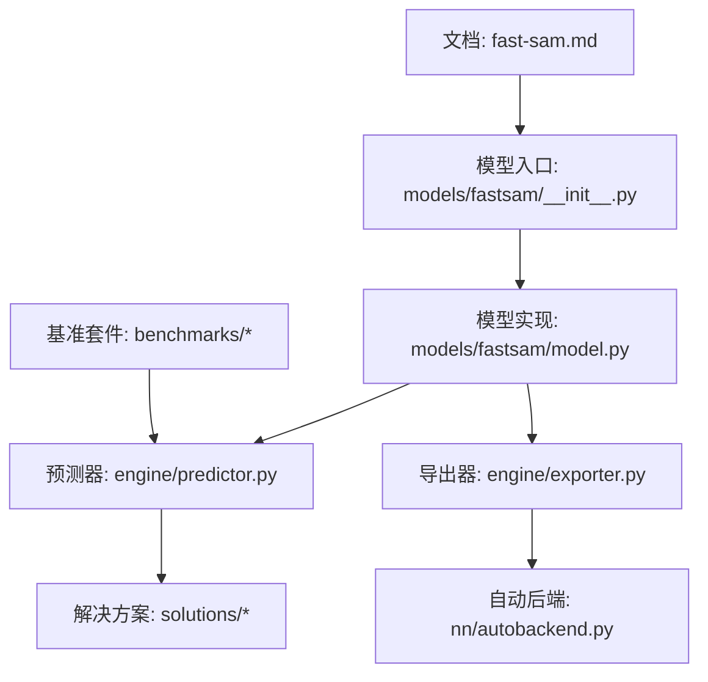
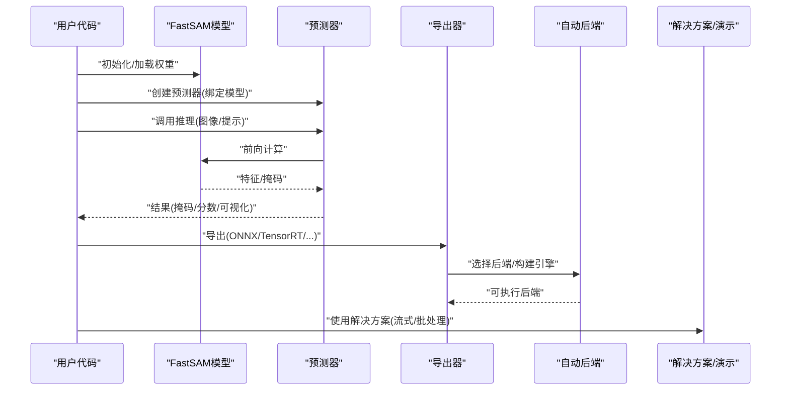
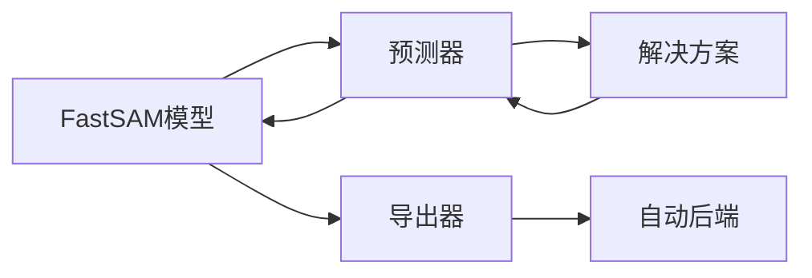

# FastSAM轻量级API

<cite>
**本文引用的文件**
- [fastsam.md](file://docs/en/models/fast-sam.md)
- [__init__.py](file://ultralytics/models/fastsam/__init__.py)
- [model.py](file://ultralytics/models/fastsam/model.py)
- [predictor.py](file://ultralytics/engine/predictor.py)
- [exporter.py](file://ultralytics/engine/exporter.py)
- [autobackend.py](file://ultralytics/nn/autobackend.py)
- [benchmark_molora_dispatch.py](file://benchmarks/benchmark_molora_dispatch.py)
- [run.py](file://benchmarks/run.py)
- [suite.py](file://benchmarks/suite.py)
- [solutions.py](file://ultralytics/solutions/solutions.py)
- [streamlit_inference.py](file://ultralytics/solutions/streamlit_inference.py)
</cite>

## 目录
1. [简介](#简介)
2. [项目结构](#项目结构)
3. [核心组件](#核心组件)
4. [架构总览](#架构总览)
5. [详细组件分析](#详细组件分析)
6. [依赖关系分析](#依赖关系分析)
7. [性能与轻量化优化](#性能与轻量化优化)
8. [部署与适配指南](#部署与适配指南)
9. [快速开始](#快速开始)
10. [基准测试与结果](#基准测试与结果)
11. [故障排查](#故障排查)
12. [结论](#结论)

## 简介
FastSAM是面向实时分割的轻量化方案，在保持与标准SAM API风格一致的前提下，通过更轻量的模型结构与推理路径优化，显著降低延迟并提升吞吐。其设计理念强调：
- 轻量化优先：更小参数、更低计算量，适配移动端与边缘设备
- 兼容易用：尽量复用标准SAM的使用习惯与接口风格
- 可部署性：提供多后端导出与自动后端选择能力，便于跨平台部署
- 可扩展性：与工程化流水线（预测器、导出器、解决方案）无缝集成

本文件聚焦于FastSAM的初始化、加载、推理接口，以及与标准SAM的兼容性差异；同时给出实时分割的性能优化技巧、部署方案、移动端/边缘适配方法、精度与速度权衡策略和模型选择指南，并提供快速开始示例与基准测试说明。

## 项目结构
FastSAM相关代码主要位于以下位置：
- 模型定义与入口：ultralytics/models/fastsam
- 引擎层：ultralytics/engine（预测器、导出器）
- 自动后端：ultralytics/nn/autobackend.py
- 文档与参考：docs/en/models/fast-sam.md
- 基准套件：benchmarks（用于统一评测流程）
- 解决方案与演示：ultralytics/solutions（含流式推理等）

图表来源
- [fastsam.md](file://docs/en/models/fast-sam.md)
- [__init__.py](file://ultralytics/models/fastsam/__init__.py)
- [model.py](file://ultralytics/models/fastsam/model.py)
- [predictor.py](file://ultralytics/engine/predictor.py)
- [exporter.py](file://ultralytics/engine/exporter.py)
- [autobackend.py](file://ultralytics/nn/autobackend.py)
- [solutions.py](file://ultralytics/solutions/solutions.py)
- [benchmark_molora_dispatch.py](file://benchmarks/benchmark_molora_dispatch.py)
- [run.py](file://benchmarks/run.py)
- [suite.py](file://benchmarks/suite.py)

章节来源
- [fastsam.md](file://docs/en/models/fast-sam.md)
- [__init__.py](file://ultralytics/models/fastsam/__init__.py)
- [model.py](file://ultralytics/models/fastsam/model.py)
- [predictor.py](file://ultralytics/engine/predictor.py)
- [exporter.py](file://ultralytics/engine/exporter.py)
- [autobackend.py](file://ultralytics/nn/autobackend.py)
- [solutions.py](file://ultralytics/solutions/solutions.py)
- [benchmark_molora_dispatch.py](file://benchmarks/benchmark_molora_dispatch.py)
- [run.py](file://benchmarks/run.py)
- [suite.py](file://benchmarks/suite.py)

## 核心组件
- 模型入口与注册：负责暴露FastSAM的类名、默认权重与配置解析，便于统一加载
- 模型实现：封装FastSAM的前向逻辑、提示处理与掩码生成
- 预测器：将模型接入统一的推理管线，支持批量、设备选择、后处理与可视化
- 导出器：将PyTorch模型导出为ONNX/TensorRT/TFLite等格式，配合自动后端进行加速
- 自动后端：根据目标环境与可用库自动选择最优执行后端
- 解决方案：提供开箱即用的实时分割应用模板（如流式推理）

章节来源
- [__init__.py](file://ultralytics/models/fastsam/__init__.py)
- [model.py](file://ultralytics/models/fastsam/model.py)
- [predictor.py](file://ultralytics/engine/predictor.py)
- [exporter.py](file://ultralytics/engine/exporter.py)
- [autobackend.py](file://ultralytics/nn/autobackend.py)
- [solutions.py](file://ultralytics/solutions/solutions.py)

## 架构总览
FastSAM在工程上遵循“模型-预测器-导出器-自动后端”的分层设计，上层以统一接口对外提供服务，底层通过自动后端适配不同硬件与运行时。

图表来源
- [model.py](file://ultralytics/models/fastsam/model.py)
- [predictor.py](file://ultralytics/engine/predictor.py)
- [exporter.py](file://ultralytics/engine/exporter.py)
- [autobackend.py](file://ultralytics/nn/autobackend.py)
- [solutions.py](file://ultralytics/solutions/solutions.py)

## 详细组件分析

### 模型入口与注册
- 职责：提供FastSAM的统一访问点，包含类名、默认权重路径、配置键等元信息，便于高层模块按名称加载
- 关键点：
  - 与模型注册表集成，确保可通过通用接口实例化
  - 暴露默认权重与配置，简化上手体验
  - 与预测器/导出器约定一致的输入输出契约

章节来源
- [__init__.py](file://ultralytics/models/fastsam/__init__.py)

### 模型实现
- 职责：实现FastSAM的核心前向逻辑，包括图像编码、提示融合、掩码解码与后处理
- 关键点：
  - 轻量化设计：减少冗余计算、精简通道/分辨率、优化注意力或卷积结构
  - 提示接口：支持点/框/文本等提示类型（具体以模型实现为准）
  - 输出规范：返回掩码、置信度、边界框等结构化结果，便于下游使用

章节来源
- [model.py](file://ultralytics/models/fastsam/model.py)

### 预测器与推理管线
- 职责：将模型接入统一推理框架，负责预处理、设备管理、批处理、后处理与可视化
- 关键点：
  - 设备与精度：自动选择CPU/GPU/混合精度，支持动态形状与批大小
  - 后处理：NMS、阈值过滤、掩码细化
  - 可视化：绘制掩码、边界框、关键点等

章节来源
- [predictor.py](file://ultralytics/engine/predictor.py)

### 导出器与自动后端
- 职责：将训练好的PyTorch模型导出为目标格式，并在运行时自动选择最优后端
- 关键点：
  - 导出格式：ONNX、TensorRT、TFLite等（以实际支持为准）
  - 自动后端：根据环境检测可用库与硬件特性，选择最佳执行路径
  - 兼容性：保证导出前后数值一致性，提供校验工具

章节来源
- [exporter.py](file://ultralytics/engine/exporter.py)
- [autobackend.py](file://ultralytics/nn/autobackend.py)

### 解决方案与演示
- 职责：提供开箱即用的实时分割应用模板，如流式视频推理、交互式标注辅助等
- 关键点：
  - 流式推理：低延迟处理连续帧
  - 可视化：叠加掩码、统计指标
  - 可扩展：易于替换模型与后端

章节来源
- [solutions.py](file://ultralytics/solutions/solutions.py)
- [streamlit_inference.py](file://ultralytics/solutions/streamlit_inference.py)

## 依赖关系分析
FastSAM对上层依赖预测器与导出器，对下层依赖自动后端与具体算子实现。整体耦合度适中，模块化清晰。

图表来源
- [model.py](file://ultralytics/models/fastsam/model.py)
- [predictor.py](file://ultralytics/engine/predictor.py)
- [exporter.py](file://ultralytics/engine/exporter.py)
- [autobackend.py](file://ultralytics/nn/autobackend.py)
- [solutions.py](file://ultralytics/solutions/solutions.py)

章节来源
- [model.py](file://ultralytics/models/fastsam/model.py)
- [predictor.py](file://ultralytics/engine/predictor.py)
- [exporter.py](file://ultralytics/engine/exporter.py)
- [autobackend.py](file://ultralytics/nn/autobackend.py)
- [solutions.py](file://ultralytics/solutions/solutions.py)

## 性能与轻量化优化
- 模型层面
  - 减小网络深度/宽度，采用高效卷积/注意力替代
  - 降低特征图分辨率或使用多尺度融合策略
  - 量化感知训练或后训练量化（INT8）
- 推理层面
  - 使用自动后端选择最优执行路径（TensorRT/ONNX Runtime/TFLite）
  - 批处理与内存池复用，避免频繁分配
  - 预取与异步I/O，减少数据准备开销
- 后处理优化
  - 阈值自适应与早停策略
  - 掩码细化仅在高分区域执行
- 精度-速度权衡
  - 小模型+高阈值：更快但可能漏检
  - 大模型+低阈值：更准但更慢
  - 建议基于业务场景做网格搜索，平衡mAP与FPS

[本节为通用指导，不直接分析具体文件]

## 部署与适配指南
- 服务器端
  - 推荐TensorRT/ONNX Runtime，结合自动后端选择
  - 容器化部署，固定依赖版本，启用CUDA/cuDNN优化
- 移动端
  - TFLite/NCNN/MNN等后端，注意输入尺寸与量化
  - 控制内存占用，避免大图高分辨率
- 边缘设备
  - Jetson/树莓派/EdgeTPU等，需针对设备特性调参
  - 使用专用导出链路与校准数据集
- 云端服务
  - 微服务化，GPU/CPU混部，弹性扩缩容
  - 监控延迟与吞吐，设置超时与重试

[本节为通用指导，不直接分析具体文件]

## 快速开始
以下为典型使用步骤（概念性描述，不包含具体代码）：
- 安装与导入：安装依赖并导入FastSAM模型与预测器
- 初始化模型：指定权重路径或从仓库拉取默认权重
- 创建预测器：绑定模型与设备（CPU/GPU），可选精度与批大小
- 推理：传入图像与提示（点/框/文本），获取掩码与分数
- 可视化：绘制掩码与边界框，保存或展示结果
- 导出：导出为ONNX/TensorRT/TFLite，并在目标设备上运行

章节来源
- [fastsam.md](file://docs/en/models/fast-sam.md)
- [__init__.py](file://ultralytics/models/fastsam/__init__.py)
- [model.py](file://ultralytics/models/fastsam/model.py)
- [predictor.py](file://ultralytics/engine/predictor.py)
- [exporter.py](file://ultralytics/engine/exporter.py)
- [autobackend.py](file://ultralytics/nn/autobackend.py)

## 基准测试与结果
- 基准套件：使用统一基准脚本与套件定义，覆盖不同设备与后端
- 关键指标：延迟（ms）、吞吐（FPS）、显存/内存占用、精度（mAP/mIoU）
- 运行方式：通过基准运行脚本与套件配置文件执行端到端评测
- 结果解读：对比不同模型尺寸、后端与量化策略的效果

章节来源
- [benchmark_molora_dispatch.py](file://benchmarks/benchmark_molora_dispatch.py)
- [run.py](file://benchmarks/run.py)
- [suite.py](file://benchmarks/suite.py)

## 故障排查
- 常见问题
  - 权重加载失败：检查路径与权限，确认权重完整性
  - 后端不可用：确认已安装对应库（如TensorRT/ONNX Runtime/TFLite）
  - 显存不足：降低输入尺寸、批大小或启用半精度
  - 导出失败：检查算子支持情况，必要时降级到ONNX
- 调试建议
  - 打印设备与后端信息，验证自动后端选择是否符合预期
  - 逐步关闭优化（如量化/编译）定位瓶颈
  - 使用基准套件复现实验条件，确保可比性

章节来源
- [autobackend.py](file://ultralytics/nn/autobackend.py)
- [exporter.py](file://ultralytics/engine/exporter.py)
- [predictor.py](file://ultralytics/engine/predictor.py)

## 结论
FastSAM以轻量化为核心目标，在保持与标准SAM相近的使用体验的同时，显著提升了实时分割的效率与可部署性。通过模型结构优化、自动后端选择与工程化集成，FastSAM能够灵活适配服务器、移动端与边缘设备。建议在具体项目中依据业务需求进行精度-速度权衡与模型选型，并结合基准测试持续评估与迭代。