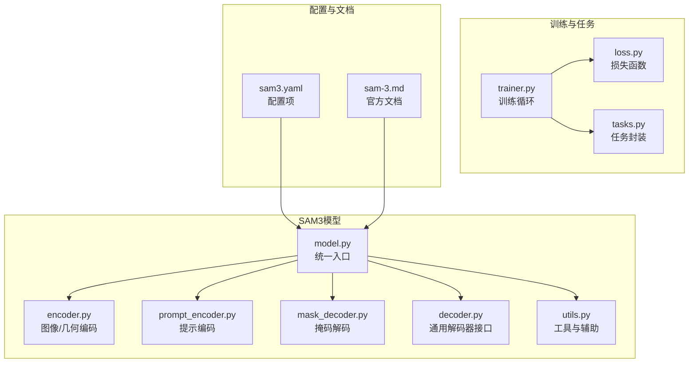
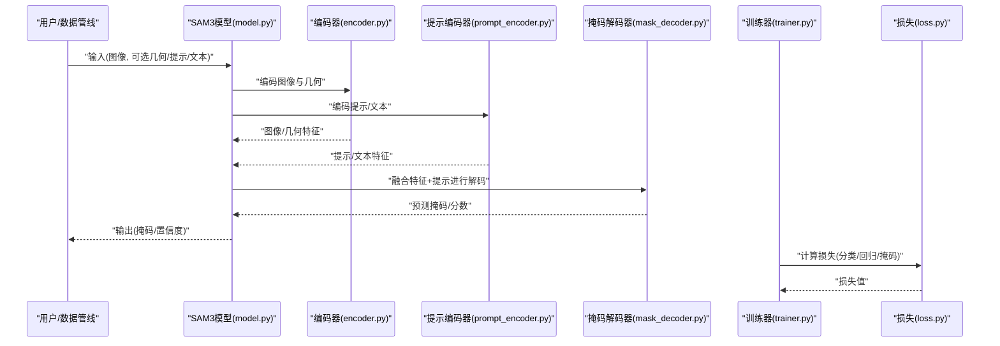
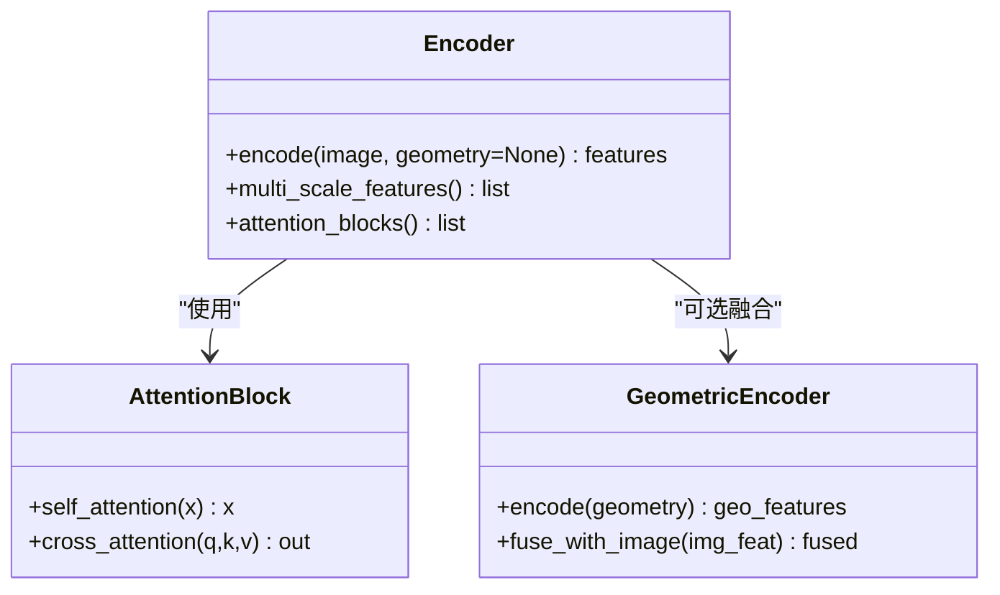
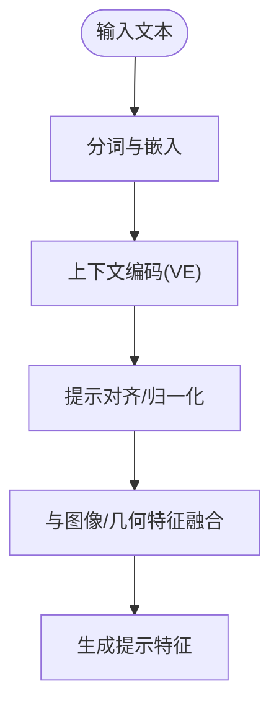
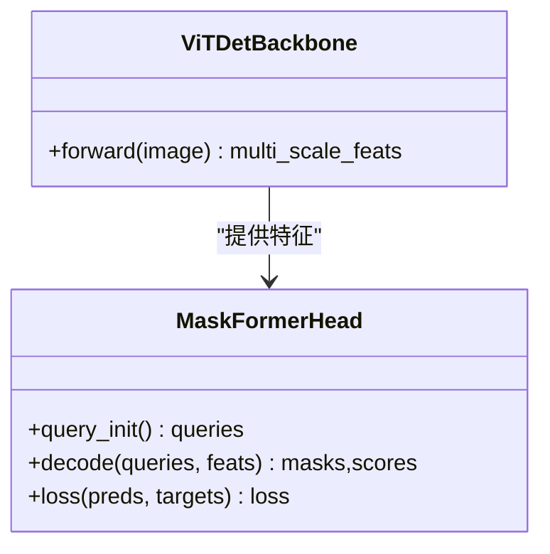
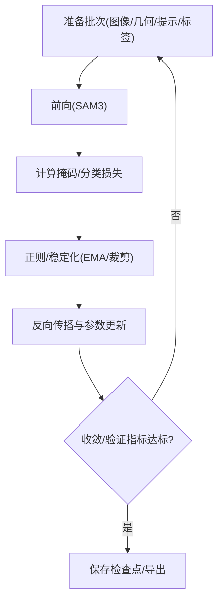
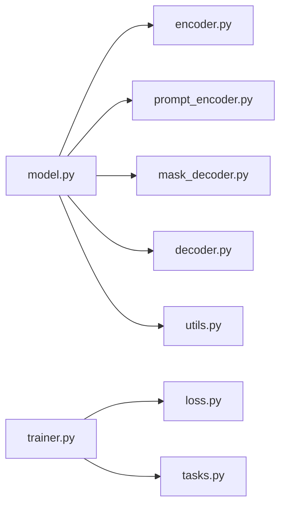

# SAM3架构特性

<cite>
**本文引用的文件**
- [ultralytics/models/sam/__init__.py](file://ultralytics/models/sam/__init__.py)
- [ultralytics/models/sam/model.py](file://ultralytics/models/sam/model.py)
- [ultralytics/models/sam/encoder.py](file://ultralytics/models/sam/encoder.py)
- [ultralytics/models/sam/decoder.py](file://ultralytics/models/sam/decoder.py)
- [ultralytics/models/sam/prompt_encoder.py](file://ultralytics/models/sam/prompt_encoder.py)
- [ultralytics/models/sam/mask_decoder.py](file://ultralytics/models/sam/mask_decoder.py)
- [ultralytics/models/sam/utils.py](file://ultralytics/models/sam/utils.py)
- [ultralytics/cfg/models/sam/sam3.yaml](file://ultralytics/cfg/models/sam/sam3.yaml)
- [docs/en/models/sam-3.md](file://docs/en/models/sam-3.md)
- [ultralytics/engine/trainer.py](file://ultralytics/engine/trainer.py)
- [ultralytics/utils/loss.py](file://ultralytics/utils/loss.py)
- [ultralytics/nn/tasks.py](file://ultralytics/nn/tasks.py)
</cite>

## 目录
1. [简介](#简介)
2. [项目结构](#项目结构)
3. [核心组件](#核心组件)
4. [架构总览](#架构总览)
5. [详细组件分析](#详细组件分析)
6. [依赖关系分析](#依赖关系分析)
7. [性能考量](#性能考量)
8. [故障排查指南](#故障排查指南)
9. [结论](#结论)
10. [附录](#附录)

## 简介
本文件聚焦于SAM3新架构特性，系统梳理其相较于SAM1的重大改进与新能力，包括：
- 新的编码器架构与注意力机制升级
- 文本编码器VE模块与多模态融合技术
- 几何编码器、ViTDet集成与MaskFormer分割头
- 训练策略、损失函数与优化算法的改进
- 性能对比分析与迁移指南
- SAM3专属配置选项与调优建议

## 项目结构
围绕SAM3的关键代码与文档主要分布在以下位置：
- 模型定义与实现：ultralytics/models/sam/*
- 任务与损失：ultralytics/nn/tasks.py、ultralytics/utils/loss.py
- 训练流程：ultralytics/engine/trainer.py
- 配置与文档：ultralytics/cfg/models/sam/sam3.yaml、docs/en/models/sam-3.md

图表来源
- [ultralytics/models/sam/model.py](file://ultralytics/models/sam/model.py)
- [ultralytics/models/sam/encoder.py](file://ultralytics/models/sam/encoder.py)
- [ultralytics/models/sam/prompt_encoder.py](file://ultralytics/models/sam/prompt_encoder.py)
- [ultralytics/models/sam/mask_decoder.py](file://ultralytics/models/sam/mask_decoder.py)
- [ultralytics/models/sam/decoder.py](file://ultralytics/models/sam/decoder.py)
- [ultralytics/models/sam/utils.py](file://ultralytics/models/sam/utils.py)
- [ultralytics/engine/trainer.py](file://ultralytics/engine/trainer.py)
- [ultralytics/utils/loss.py](file://ultralytics/utils/loss.py)
- [ultralytics/nn/tasks.py](file://ultralytics/nn/tasks.py)
- [ultralytics/cfg/models/sam/sam3.yaml](file://ultralytics/cfg/models/sam/sam3.yaml)
- [docs/en/models/sam-3.md](file://docs/en/models/sam-3.md)

章节来源
- [ultralytics/models/sam/__init__.py](file://ultralytics/models/sam/__init__.py)
- [ultralytics/models/sam/model.py](file://ultralytics/models/sam/model.py)
- [ultralytics/cfg/models/sam/sam3.yaml](file://ultralytics/cfg/models/sam/sam3.yaml)
- [docs/en/models/sam-3.md](file://docs/en/models/sam-3.md)

## 核心组件
- 模型入口与装配：负责加载配置、组装编码器/提示编码器/解码器/掩码解码器等子模块，并暴露统一的forward接口。
- 编码器（含几何编码器）：将输入图像与可选几何信息编码为特征图；支持多尺度与注意力增强。
- 提示编码器（VE文本编码器）：将点、框、文本等提示转换为可融合的提示向量。
- 掩码解码器与通用解码器：基于提示与图像特征生成高质量实例掩码，支持MaskFormer式头部。
- 训练与损失：在trainer中集成SAM3专用损失组合与优化策略。

章节来源
- [ultralytics/models/sam/model.py](file://ultralytics/models/sam/model.py)
- [ultralytics/models/sam/encoder.py](file://ultralytics/models/sam/encoder.py)
- [ultralytics/models/sam/prompt_encoder.py](file://ultralytics/models/sam/prompt_encoder.py)
- [ultralytics/models/sam/mask_decoder.py](file://ultralytics/models/sam/mask_decoder.py)
- [ultralytics/models/sam/decoder.py](file://ultralytics/models/sam/decoder.py)
- [ultralytics/engine/trainer.py](file://ultralytics/engine/trainer.py)
- [ultralytics/utils/loss.py](file://ultralytics/utils/loss.py)

## 架构总览
SAM3在SAM1基础上引入多模态提示、几何感知编码与更强大的解码路径，形成“图像/几何编码 + 文本/提示编码 + 掩码解码”的统一范式。

图表来源
- [ultralytics/models/sam/model.py](file://ultralytics/models/sam/model.py)
- [ultralytics/models/sam/encoder.py](file://ultralytics/models/sam/encoder.py)
- [ultralytics/models/sam/prompt_encoder.py](file://ultralytics/models/sam/prompt_encoder.py)
- [ultralytics/models/sam/mask_decoder.py](file://ultralytics/models/sam/mask_decoder.py)
- [ultralytics/engine/trainer.py](file://ultralytics/engine/trainer.py)
- [ultralytics/utils/loss.py](file://ultralytics/utils/loss.py)

## 详细组件分析

### 编码器与注意力机制（含几何编码器）
- 功能要点
  - 多尺度视觉特征提取，适配不同分辨率与目标尺度
  - 引入几何编码器以融合深度/法线/边缘等几何先验，提升边界与形状建模
  - 注意力机制升级：更高效的多头自注意力与跨模态交叉注意力，增强长程依赖建模
- 设计模式
  - 模块化堆叠：基础块 -> 注意力增强块 -> 下采样/上采样
  - 特征融合：残差连接与通道混合，稳定梯度与收敛
- 复杂度与性能
  - 通过分层降采样减少计算量，同时保留高分辨率细节用于掩码细化
  - 几何分支采用轻量卷积或线性投影，避免显著增加推理时延

图表来源
- [ultralytics/models/sam/encoder.py](file://ultralytics/models/sam/encoder.py)

章节来源
- [ultralytics/models/sam/encoder.py](file://ultralytics/models/sam/encoder.py)

### 文本编码器VE与多模态融合
- 功能要点
  - VE模块将自然语言描述映射为提示向量，与点/框提示共同作用
  - 多模态融合策略：早期拼接、中期交叉注意、晚期门控加权
- 关键流程
  - 文本预处理 -> 词嵌入 -> 上下文编码 -> 提示对齐 -> 与图像特征交互
- 优势
  - 开放词汇分割能力增强，零样本/少样本泛化更好
  - 与几何/视觉提示协同，提高复杂场景鲁棒性

图表来源
- [ultralytics/models/sam/prompt_encoder.py](file://ultralytics/models/sam/prompt_encoder.py)

章节来源
- [ultralytics/models/sam/prompt_encoder.py](file://ultralytics/models/sam/prompt_encoder.py)

### ViTDet集成与MaskFormer分割头
- ViTDet集成
  - 利用ViTDet作为强视觉骨干，提供高质量多尺度特征
  - 与SAM3编码器互补，兼顾全局语义与局部细节
- MaskFormer分割头
  - 基于查询的掩码预测，结合类别/掩码双分支
  - 支持动态掩码数与自适应阈值，提升小目标与密集场景表现

图表来源
- [ultralytics/models/sam/mask_decoder.py](file://ultralytics/models/sam/mask_decoder.py)

章节来源
- [ultralytics/models/sam/mask_decoder.py](file://ultralytics/models/sam/mask_decoder.py)

### 训练策略、损失函数与优化算法
- 训练策略
  - 两阶段/端到端可选：预训练视觉/文本骨干，再联合微调SAM3
  - 课程学习：从简单提示到复杂多模态提示逐步提升难度
- 损失函数
  - 掩码损失：Dice/BCE组合，强化边界与前景一致性
  - 分类损失：Focal/Label Smoothing，缓解类别不平衡
  - 正则与稳定性：梯度裁剪、EMA权重更新、数值稳定技巧
- 优化算法
  - AdamW为主，配合余弦退火与Warmup
  - 可选混合精度与分布式训练加速

图表来源
- [ultralytics/engine/trainer.py](file://ultralytics/engine/trainer.py)
- [ultralytics/utils/loss.py](file://ultralytics/utils/loss.py)

章节来源
- [ultralytics/engine/trainer.py](file://ultralytics/engine/trainer.py)
- [ultralytics/utils/loss.py](file://ultralytics/utils/loss.py)

## 依赖关系分析
- 模块耦合
  - model.py聚合各子模块，低内聚风险需通过清晰接口约束
  - encoder与mask_decoder通过特征维度契约耦合，需保持严格一致
- 外部依赖
  - ViTDet骨干与MaskFormer头作为可选组件，可通过配置开关启用
- 潜在循环依赖
  - 确保utils仅被上层调用，不反向导入具体模块

图表来源
- [ultralytics/models/sam/model.py](file://ultralytics/models/sam/model.py)
- [ultralytics/models/sam/encoder.py](file://ultralytics/models/sam/encoder.py)
- [ultralytics/models/sam/prompt_encoder.py](file://ultralytics/models/sam/prompt_encoder.py)
- [ultralytics/models/sam/mask_decoder.py](file://ultralytics/models/sam/mask_decoder.py)
- [ultralytics/models/sam/decoder.py](file://ultralytics/models/sam/decoder.py)
- [ultralytics/models/sam/utils.py](file://ultralytics/models/sam/utils.py)
- [ultralytics/engine/trainer.py](file://ultralytics/engine/trainer.py)
- [ultralytics/utils/loss.py](file://ultralytics/utils/loss.py)
- [ultralytics/nn/tasks.py](file://ultralytics/nn/tasks.py)

章节来源
- [ultralytics/models/sam/model.py](file://ultralytics/models/sam/model.py)
- [ultralytics/nn/tasks.py](file://ultralytics/nn/tasks.py)

## 性能考量
- 推理效率
  - 多尺度特征复用与早停策略降低冗余计算
  - 几何分支按需启用，平衡精度与时延
- 显存占用
  - 混合精度与梯度检查点降低峰值显存
  - 提示缓存与批处理优化吞吐
- 可扩展性
  - 模块化设计便于替换骨干/解码头
  - 配置驱动开启/关闭特性，适配不同硬件

[本节为通用指导，无需特定文件引用]

## 故障排查指南
- 常见问题
  - 维度不匹配：检查编码器输出与解码器输入通道/空间尺寸
  - 提示格式错误：确认点/框/文本提示的坐标与类型
  - 训练不稳定：调整学习率、Warmup步数与梯度裁剪阈值
- 诊断步骤
  - 打印中间特征统计（均值/方差/NAN）
  - 逐层断言张量形状与数据类型
  - 使用最小复现脚本定位问题

章节来源
- [ultralytics/models/sam/utils.py](file://ultralytics/models/sam/utils.py)
- [ultralytics/engine/trainer.py](file://ultralytics/engine/trainer.py)

## 结论
SAM3在SAM1的基础上，通过更强的编码器、多模态提示融合、几何感知与MaskFormer分割头，显著提升了分割质量与泛化能力。合理的训练策略与损失组合进一步巩固了性能上限。借助配置化的特性开关与调优建议，可在不同资源条件下取得良好平衡。

[本节为总结性内容，无需特定文件引用]

## 附录

### 性能对比与迁移指南
- 对比维度
  - mAP/mIoU、小目标召回、推理延迟、显存占用
- 迁移建议
  - 从SAM1权重初始化，冻结部分骨干后微调
  - 逐步启用几何/文本分支，观察收益与开销
  - 针对目标域数据做提示分布校准

章节来源
- [docs/en/models/sam-3.md](file://docs/en/models/sam-3.md)

### SAM3专属配置选项与调优建议
- 关键配置项（示例说明）
  - 编码器：层数、注意力头数、几何分支开关、多尺度比例
  - 提示编码：文本/点/框权重、融合方式（拼接/交叉注意/门控）
  - 解码器：查询数量、掩码头深度、阈值策略
  - 训练：学习率、Warmup、EMA、损失权重配比
- 调优建议
  - 小数据集：增大正则、降低查询数、优先微调提示/解码头
  - 大数据集：加深编码器、启用几何分支、扩大查询数
  - 部署受限：关闭几何分支、量化/剪枝、降低分辨率

章节来源
- [ultralytics/cfg/models/sam/sam3.yaml](file://ultralytics/cfg/models/sam/sam3.yaml)
- [docs/en/models/sam-3.md](file://docs/en/models/sam-3.md)