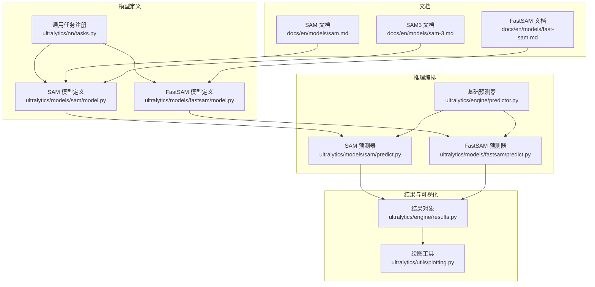
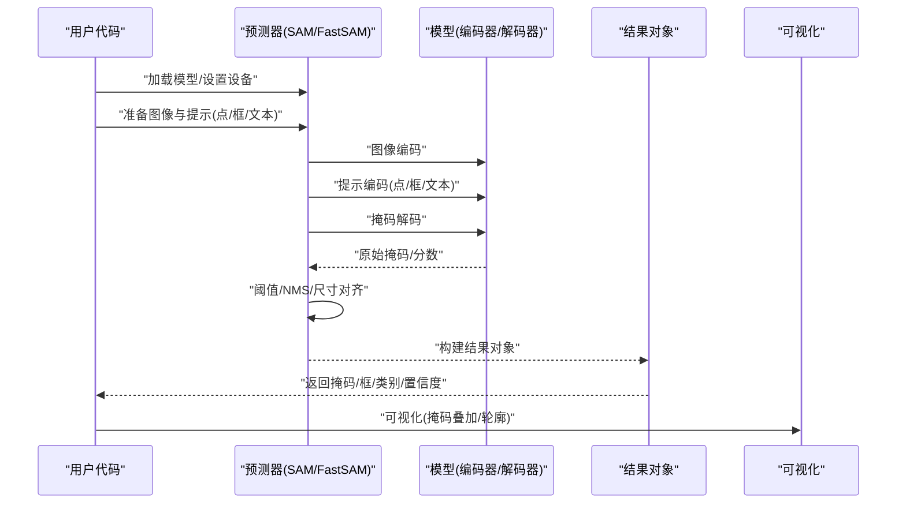
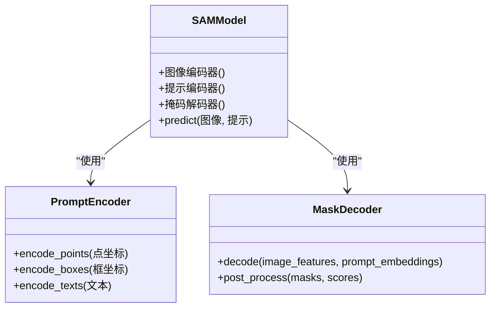
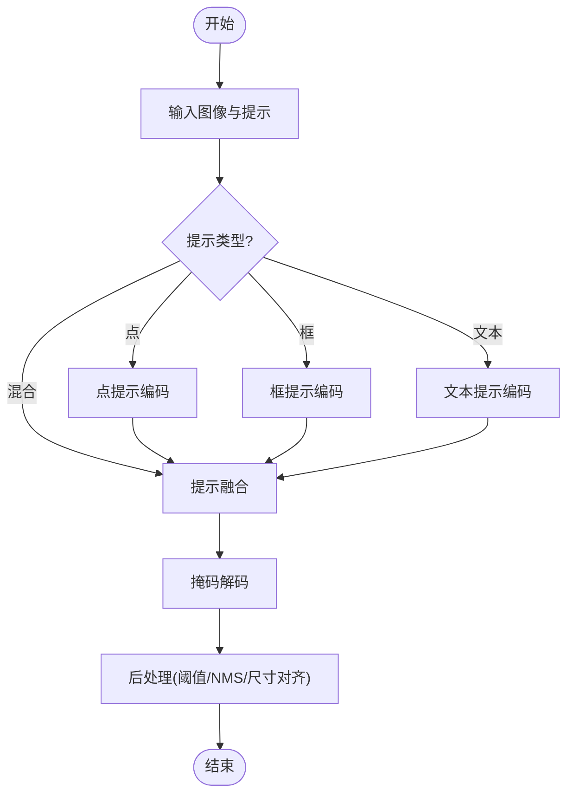
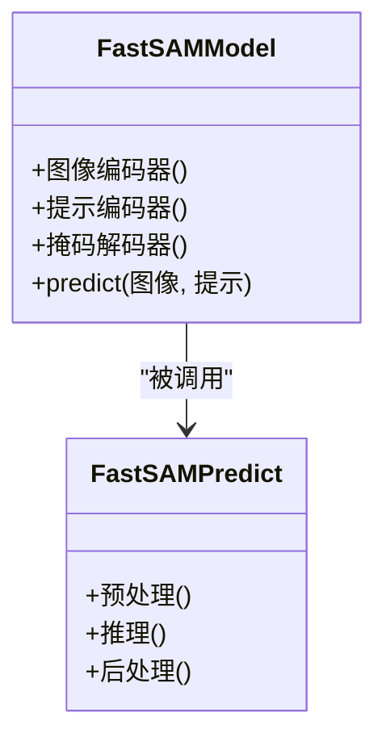
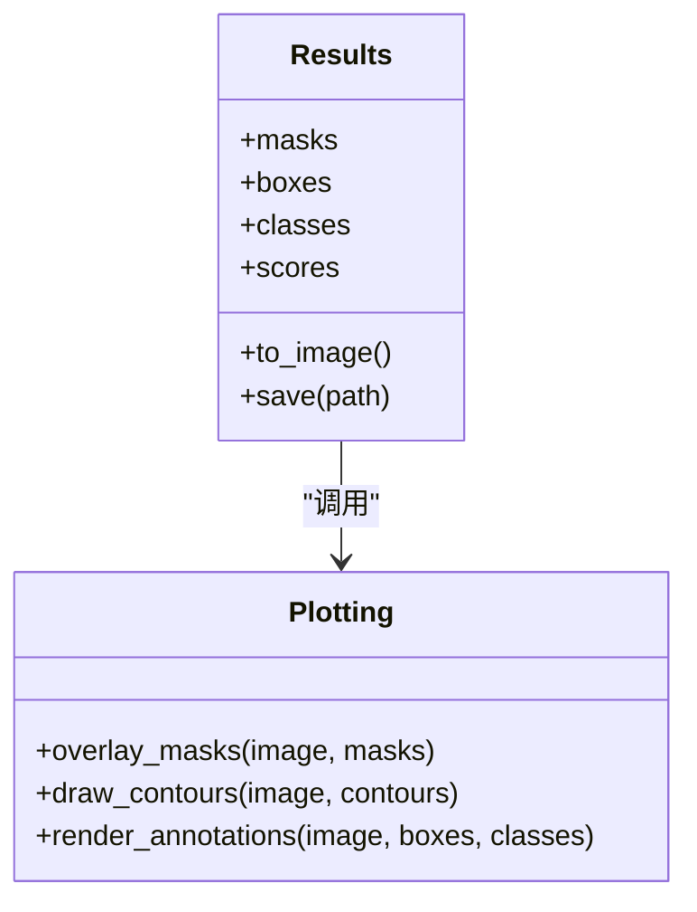
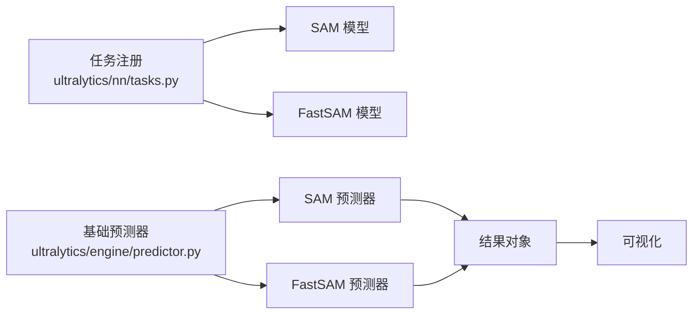

# SAM分割模型API

<cite>
**本文引用的文件**
- [ultralytics/models/sam/model.py](file://ultralytics/models/sam/model.py)
- [ultralytics/models/sam/predict.py](file://ultralytics/models/sam/predict.py)
- [ultralytics/models/sam/__init__.py](file://ultralytics/models/sam/__init__.py)
- [ultralytics/models/fastsam/model.py](file://ultralytics/models/fastsam/model.py)
- [ultralytics/models/fastsam/predict.py](file://ultralytics/models/fastsam/predict.py)
- [ultralytics/models/fastsam/__init__.py](file://ultralytics/models/fastsam/__init__.py)
- [ultralytics/nn/tasks.py](file://ultralytics/nn/tasks.py)
- [ultralytics/engine/predictor.py](file://ultralytics/engine/predictor.py)
- [ultralytics/engine/results.py](file://ultralytics/engine/results.py)
- [ultralytics/utils/plotting.py](file://ultralytics/utils/plotting.py)
- [docs/en/models/sam.md](file://docs/en/models/sam.md)
- [docs/en/models/fast-sam.md](file://docs/en/models/fast-sam.md)
- [docs/en/models/sam-3.md](file://docs/en/models/sam-3.md)
</cite>

## 目录
1. [简介](#简介)
2. [项目结构](#项目结构)
3. [核心组件](#核心组件)
4. [架构总览](#架构总览)
5. [详细组件分析](#详细组件分析)
6. [依赖关系分析](#依赖关系分析)
7. [性能与部署建议](#性能与部署建议)
8. [故障排查指南](#故障排查指南)
9. [结论](#结论)
10. [附录：常用场景与接口速查](#附录常用场景与接口速查)

## 简介
本文件面向使用 Segment Anything Model（SAM）与 FastSAM 的开发者，提供统一的 API 文档与实践指南。内容覆盖：
- SAM 的图像编码器、提示编码器、掩码解码器的调用方式
- 点提示、框提示、文本提示等交互方式的编程接口
- SAM3 新架构特性与改进要点
- FastSAM 轻量级版本的 API 使用说明
- 实例分割、交互式分割、零样本分割等典型场景用法
- 模型权重管理与多语言支持
- 分割结果可视化与后处理操作
- 自定义提示生成与模型微调接口说明

## 项目结构
本项目将 SAM 与 FastSAM 作为独立模型族集成在统一推理框架中，遵循“模型定义 + 预测器 + 结果对象”的分层组织方式：
- 模型定义：封装网络结构与任务头
- 预测器：负责预处理、推理流程编排、后处理
- 结果对象：统一封装预测输出（掩码、边界框、类别、置信度等）
- 文档：提供各模型的官方说明与示例

图表来源
- [ultralytics/models/sam/model.py](file://ultralytics/models/sam/model.py)
- [ultralytics/models/fastsam/model.py](file://ultralytics/models/fastsam/model.py)
- [ultralytics/nn/tasks.py](file://ultralytics/nn/tasks.py)
- [ultralytics/engine/predictor.py](file://ultralytics/engine/predictor.py)
- [ultralytics/models/sam/predict.py](file://ultralytics/models/sam/predict.py)
- [ultralytics/models/fastsam/predict.py](file://ultralytics/models/fastsam/predict.py)
- [ultralytics/engine/results.py](file://ultralytics/engine/results.py)
- [ultralytics/utils/plotting.py](file://ultralytics/utils/plotting.py)
- [docs/en/models/sam.md](file://docs/en/models/sam.md)
- [docs/en/models/fast-sam.md](file://docs/en/models/fast-sam.md)
- [docs/en/models/sam-3.md](file://docs/en/models/sam-3.md)

章节来源
- [ultralytics/models/sam/model.py](file://ultralytics/models/sam/model.py)
- [ultralytics/models/fastsam/model.py](file://ultralytics/models/fastsam/model.py)
- [ultralytics/nn/tasks.py](file://ultralytics/nn/tasks.py)
- [ultralytics/engine/predictor.py](file://ultralytics/engine/predictor.py)
- [ultralytics/models/sam/predict.py](file://ultralytics/models/sam/predict.py)
- [ultralytics/models/fastsam/predict.py](file://ultralytics/models/fastsam/predict.py)
- [ultralytics/engine/results.py](file://ultralytics/engine/results.py)
- [ultralytics/utils/plotting.py](file://ultralytics/utils/plotting.py)
- [docs/en/models/sam.md](file://docs/en/models/sam.md)
- [docs/en/models/fast-sam.md](file://docs/en/models/fast-sam.md)
- [docs/en/models/sam-3.md](file://docs/en/models/sam-3.md)

## 核心组件
- SAM 模型定义：封装图像编码器、提示编码器、掩码解码器以及任务头；对外暴露统一的预测接口。
- FastSAM 模型定义：轻量化版本，侧重速度与资源占用平衡，保留点/框提示能力。
- 预测器：负责输入预处理、提示编码、解码器推理、NMS/阈值过滤、结果组装。
- 结果对象：统一封装掩码、边界框、类别、置信度、元数据，并提供可视化方法。
- 绘图工具：提供掩码叠加、轮廓绘制、标注渲染等实用函数。

章节来源
- [ultralytics/models/sam/model.py](file://ultralytics/models/sam/model.py)
- [ultralytics/models/fastsam/model.py](file://ultralytics/models/fastsam/model.py)
- [ultralytics/models/sam/predict.py](file://ultralytics/models/sam/predict.py)
- [ultralytics/models/fastsam/predict.py](file://ultralytics/models/fastsam/predict.py)
- [ultralytics/engine/results.py](file://ultralytics/engine/results.py)
- [ultralytics/utils/plotting.py](file://ultralytics/utils/plotting.py)

## 架构总览
下图展示从用户输入到最终可视化的端到端流程，包括提示类型与关键模块交互。

图表来源
- [ultralytics/models/sam/predict.py](file://ultralytics/models/sam/predict.py)
- [ultralytics/models/fastsam/predict.py](file://ultralytics/models/fastsam/predict.py)
- [ultralytics/models/sam/model.py](file://ultralytics/models/sam/model.py)
- [ultralytics/models/fastsam/model.py](file://ultralytics/models/fastsam/model.py)
- [ultralytics/engine/results.py](file://ultralytics/engine/results.py)
- [ultralytics/utils/plotting.py](file://ultralytics/utils/plotting.py)

## 详细组件分析

### SAM 模型与接口规范
- 图像编码器：接收高分辨率图像，提取全局特征图，用于后续提示融合与掩码生成。
- 提示编码器：支持点提示、框提示、文本提示等多种交互形式，将提示映射为可融合的提示向量。
- 掩码解码器：结合图像特征与提示向量，生成高质量实例掩码及对应置信度。
- 预测接口：统一封装上述三个子模块，提供批处理、设备管理、内存优化等能力。

图表来源
- [ultralytics/models/sam/model.py](file://ultralytics/models/sam/model.py)

章节来源
- [ultralytics/models/sam/model.py](file://ultralytics/models/sam/model.py)
- [docs/en/models/sam.md](file://docs/en/models/sam.md)

#### 交互提示编程接口
- 点提示：传入二维点坐标列表，支持单点或多点组合，常用于交互式选择目标区域。
- 框提示：传入矩形框坐标，适合快速定位目标范围。
- 文本提示：传入自然语言描述，由文本编码器转换为提示向量，实现零样本分割。
- 混合提示：可同时传入多种提示类型，模型内部进行融合后再解码掩码。

图表来源
- [ultralytics/models/sam/predict.py](file://ultralytics/models/sam/predict.py)
- [ultralytics/models/sam/model.py](file://ultralytics/models/sam/model.py)

章节来源
- [ultralytics/models/sam/predict.py](file://ultralytics/models/sam/predict.py)
- [ultralytics/models/sam/model.py](file://ultralytics/models/sam/model.py)

### FastSAM 轻量级版本 API
- 设计目标：在保证质量的前提下降低计算量与显存占用，提升推理速度。
- 能力范围：支持点提示、框提示；文本提示能力视具体实现而定。
- 适用场景：边缘设备、实时应用、大规模批量推理。

图表来源
- [ultralytics/models/fastsam/model.py](file://ultralytics/models/fastsam/model.py)
- [ultralytics/models/fastsam/predict.py](file://ultralytics/models/fastsam/predict.py)

章节来源
- [ultralytics/models/fastsam/model.py](file://ultralytics/models/fastsam/model.py)
- [ultralytics/models/fastsam/predict.py](file://ultralytics/models/fastsam/predict.py)
- [docs/en/models/fast-sam.md](file://docs/en/models/fast-sam.md)

### SAM3 新架构特性与改进
- 架构升级：针对编码器/解码器效率与精度进行优化，增强提示融合策略。
- 多模态提示：强化文本提示能力，提供更稳定的零样本分割效果。
- 推理优化：引入更高效的特征复用与缓存机制，减少重复计算。
- 兼容性：保持与现有 SAM/FastSAM 接口一致，便于平滑迁移。

章节来源
- [docs/en/models/sam-3.md](file://docs/en/models/sam-3.md)
- [ultralytics/models/sam/model.py](file://ultralytics/models/sam/model.py)

### 结果对象与可视化
- 结果对象：统一封装掩码、边界框、类别、置信度、元数据，并提供访问与导出方法。
- 可视化：支持掩码叠加、轮廓绘制、标注渲染，便于调试与展示。

图表来源
- [ultralytics/engine/results.py](file://ultralytics/engine/results.py)
- [ultralytics/utils/plotting.py](file://ultralytics/utils/plotting.py)

章节来源
- [ultralytics/engine/results.py](file://ultralytics/engine/results.py)
- [ultralytics/utils/plotting.py](file://ultralytics/utils/plotting.py)

## 依赖关系分析
- 模型定义依赖任务注册表，确保不同模型在统一框架下运行。
- 预测器依赖基础预测器，继承通用预处理、设备管理、批处理逻辑。
- 结果对象与可视化模块解耦，便于扩展新的可视化样式或导出格式。

图表来源
- [ultralytics/nn/tasks.py](file://ultralytics/nn/tasks.py)
- [ultralytics/engine/predictor.py](file://ultralytics/engine/predictor.py)
- [ultralytics/models/sam/predict.py](file://ultralytics/models/sam/predict.py)
- [ultralytics/models/fastsam/predict.py](file://ultralytics/models/fastsam/predict.py)
- [ultralytics/engine/results.py](file://ultralytics/engine/results.py)
- [ultralytics/utils/plotting.py](file://ultralytics/utils/plotting.py)

章节来源
- [ultralytics/nn/tasks.py](file://ultralytics/nn/tasks.py)
- [ultralytics/engine/predictor.py](file://ultralytics/engine/predictor.py)
- [ultralytics/models/sam/predict.py](file://ultralytics/models/sam/predict.py)
- [ultralytics/models/fastsam/predict.py](file://ultralytics/models/fastsam/predict.py)
- [ultralytics/engine/results.py](file://ultralytics/engine/results.py)
- [ultralytics/utils/plotting.py](file://ultralytics/utils/plotting.py)

## 性能与部署建议
- 设备选择：优先使用 GPU 加速，CPU 模式下适当降低分辨率与批次大小。
- 批处理：对静态数据集采用批处理以提升吞吐；交互式场景建议单张推理以降低延迟。
- 提示优化：合理选择提示数量与类型，避免过多点提示导致解码器负担增加。
- 后处理参数：根据应用场景调整阈值与 NMS 参数，平衡召回与误检。
- 导出与部署：结合 ONNX/TensorRT/OpenVINO 等后端进行部署优化，参考平台文档。

[本节为通用指导，不直接分析具体文件]

## 故障排查指南
- 加载失败：检查模型路径与权重完整性，确认设备可用性与内存充足。
- 提示格式错误：核对点/框/文本提示的维度与顺序，确保与模型期望一致。
- 结果异常：检查阈值与 NMS 参数，必要时调整以改善分割质量。
- 可视化问题：确认图像尺寸与掩码尺寸对齐，避免叠加错位。

章节来源
- [ultralytics/models/sam/predict.py](file://ultralytics/models/sam/predict.py)
- [ultralytics/models/fastsam/predict.py](file://ultralytics/models/fastsam/predict.py)
- [ultralytics/engine/results.py](file://ultralytics/engine/results.py)
- [ultralytics/utils/plotting.py](file://ultralytics/utils/plotting.py)

## 结论
通过统一的模型定义与预测器架构，SAM 与 FastSAM 在本项目中提供了稳定且易用的分割 API。结合点/框/文本提示与强大的可视化能力，可满足实例分割、交互式分割、零样本分割等多类场景需求。SAM3 的架构改进进一步提升了效率与精度，而 FastSAM 则为资源受限环境提供了高效替代方案。

[本节为总结性内容，不直接分析具体文件]

## 附录：常用场景与接口速查
- 实例分割：使用框提示或自动检测后的框作为输入，配合阈值与 NMS 得到实例掩码。
- 交互式分割：逐步添加点提示，动态更新掩码，适用于精细标注与编辑。
- 零样本分割：使用文本提示描述目标类别，无需训练即可分割未知类别。
- 权重管理：集中管理预训练权重与本地缓存，支持多模型切换与版本控制。
- 多语言支持：文本提示支持多语言输入，需确保文本编码器的语言覆盖范围。
- 自定义提示生成：基于领域知识或外部模型生成高质量提示，提升分割稳定性。
- 模型微调：利用 PEFT/LoRA 等技术对特定任务进行微调，注意提示分布与数据配比。

章节来源
- [docs/en/models/sam.md](file://docs/en/models/sam.md)
- [docs/en/models/fast-sam.md](file://docs/en/models/fast-sam.md)
- [docs/en/models/sam-3.md](file://docs/en/models/sam-3.md)
- [ultralytics/models/sam/model.py](file://ultralytics/models/sam/model.py)
- [ultralytics/models/fastsam/model.py](file://ultralytics/models/fastsam/model.py)
- [ultralytics/models/sam/predict.py](file://ultralytics/models/sam/predict.py)
- [ultralytics/models/fastsam/predict.py](file://ultralytics/models/fastsam/predict.py)
- [ultralytics/engine/results.py](file://ultralytics/engine/results.py)
- [ultralytics/utils/plotting.py](file://ultralytics/utils/plotting.py)