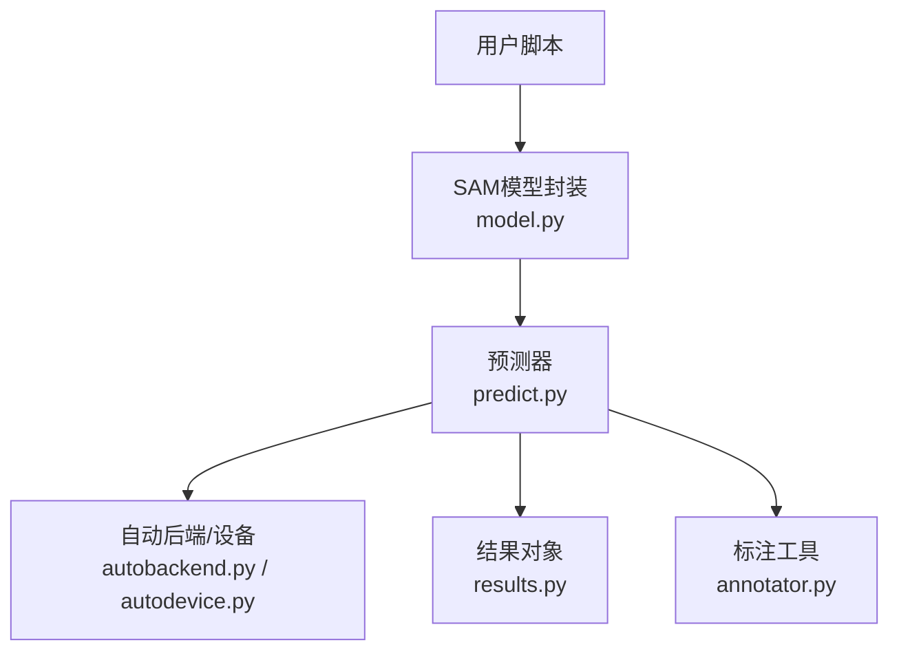
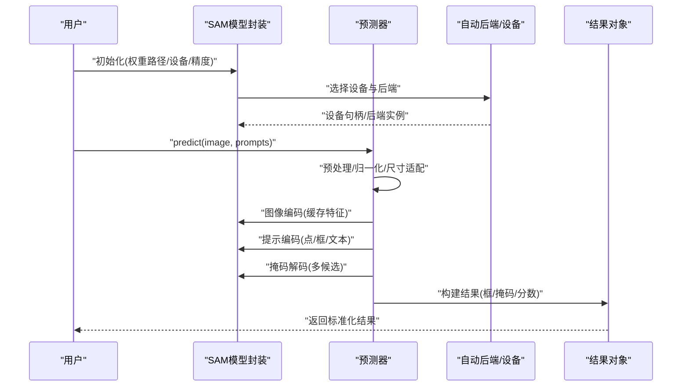
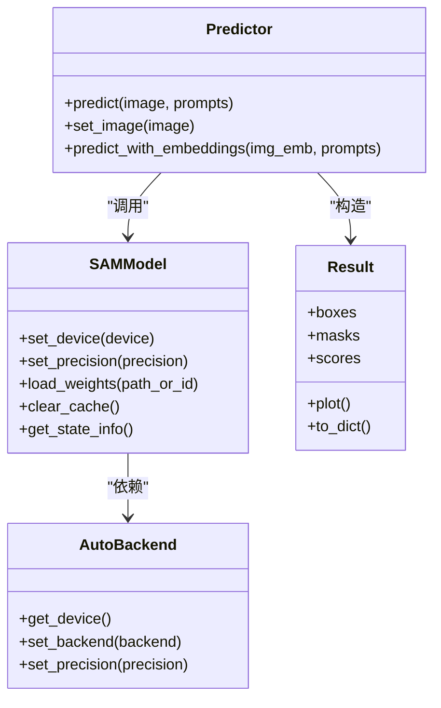
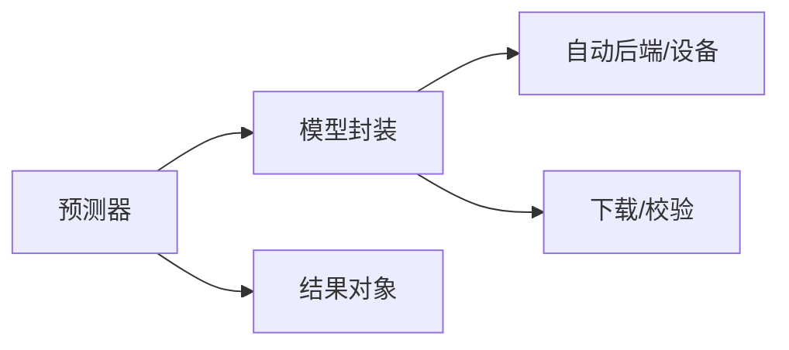

# SAM核心API接口

<cite>
**本文引用的文件**
- [ultralytics/models/sam/model.py](file://ultralytics/models/sam/model.py)
- [ultralytics/models/sam/predict.py](file://ultralytics/models/sam/predict.py)
- [ultralytics/models/sam/__init__.py](file://ultralytics/models/sam/__init__.py)
- [ultralytics/nn/autobackend.py](file://ultralytics/nn/autobackend.py)
- [ultralytics/utils/autodevice.py](file://ultralytics/utils/autodevice.py)
- [ultralytics/utils/checks.py](file://ultralytics/utils/checks.py)
- [ultralytics/utils/downloads.py](file://ultralytics/utils/downloads.py)
- [ultralytics/engine/predictor.py](file://ultralytics/engine/predictor.py)
- [ultralytics/engine/results.py](file://ultralytics/engine/results.py)
- [ultralytics/models/sam/annotator.py](file://ultralytics/models/sam/annotator.py)
</cite>

## 目录
1. [简介](#简介)
2. [项目结构](#项目结构)
3. [核心组件](#核心组件)
4. [架构总览](#架构总览)
5. [详细组件分析](#详细组件分析)
6. [依赖关系分析](#依赖关系分析)
7. [性能与内存优化](#性能与内存优化)
8. [故障排查指南](#故障排查指南)
9. [结论](#结论)
10. [附录：使用示例路径](#附录使用示例路径)

## 简介
本文件面向Segment Anything Model（SAM）在仓库中的核心API，聚焦于模型初始化、权重加载与配置、设备分配与内存优化策略，以及图像编码器、提示编码器与掩码解码器的接口规范。文档同时覆盖基础预测接口的参数与返回值格式、不同分辨率输入的处理方式、错误处理机制，并提供可复用的代码示例路径，帮助读者快速上手并高效部署。

## 项目结构
SAM相关实现位于ultralytics/models/sam目录下，并通过统一引擎进行推理编排。关键入口与职责如下：
- 模型封装与对外暴露：提供统一的模型类与便捷方法
- 预测器：负责预处理、编码、解码与后处理的完整流程
- 自动后端与设备选择：根据环境自动选择最优执行后端与设备
- 结果对象：标准化返回的检测结果与可视化能力
- 标注工具：辅助生成可视化标注

图表来源
- [ultralytics/models/sam/model.py](file://ultralytics/models/sam/model.py)
- [ultralytics/models/sam/predict.py](file://ultralytics/models/sam/predict.py)
- [ultralytics/nn/autobackend.py](file://ultralytics/nn/autobackend.py)
- [ultralytics/utils/autodevice.py](file://ultralytics/utils/autodevice.py)
- [ultralytics/engine/results.py](file://ultralytics/engine/results.py)
- [ultralytics/models/sam/annotator.py](file://ultralytics/models/sam/annotator.py)

章节来源
- [ultralytics/models/sam/model.py](file://ultralytics/models/sam/model.py)
- [ultralytics/models/sam/predict.py](file://ultralytics/models/sam/predict.py)
- [ultralytics/nn/autobackend.py](file://ultralytics/nn/autobackend.py)
- [ultralytics/utils/autodevice.py](file://ultralytics/utils/autodevice.py)
- [ultralytics/engine/results.py](file://ultralytics/engine/results.py)
- [ultralytics/models/sam/annotator.py](file://ultralytics/models/sam/annotator.py)

## 核心组件
- 模型封装类
  - 负责模型权重加载、设备放置、缓存特征图、对外暴露便捷接口（如点/框提示分割）
  - 内部组合图像编码器、提示编码器与掩码解码器
- 预测器
  - 完成输入预处理、图像编码、提示编码、掩码解码、后处理与结果组装
  - 支持批量提示、多尺度输入、动态批处理等高级特性
- 自动后端与设备
  - 自动检测可用设备（CPU/GPU/MPS等），选择合适后端（如ONNX/TensorRT/OpenVINO等）
  - 管理精度、编译选项与内存布局
- 结果对象
  - 标准化输出：边界框、类别、置信度、掩码、关键点等
  - 提供可视化与导出能力
- 标注工具
  - 将预测结果渲染到图像上，便于调试与展示

章节来源
- [ultralytics/models/sam/model.py](file://ultralytics/models/sam/model.py)
- [ultralytics/models/sam/predict.py](file://ultralytics/models/sam/predict.py)
- [ultralytics/nn/autobackend.py](file://ultralytics/nn/autobackend.py)
- [ultralytics/utils/autodevice.py](file://ultralytics/utils/autodevice.py)
- [ultralytics/engine/results.py](file://ultralytics/engine/results.py)
- [ultralytics/models/sam/annotator.py](file://ultralytics/models/sam/annotator.py)

## 架构总览
下图展示了从用户调用到最终输出的端到端流程，包括权重加载、设备分配、编码/解码与结果返回。

图表来源
- [ultralytics/models/sam/model.py](file://ultralytics/models/sam/model.py)
- [ultralytics/models/sam/predict.py](file://ultralytics/models/sam/predict.py)
- [ultralytics/nn/autobackend.py](file://ultralytics/nn/autobackend.py)
- [ultralytics/utils/autodevice.py](file://ultralytics/utils/autodevice.py)
- [ultralytics/engine/results.py](file://ultralytics/engine/results.py)

## 详细组件分析

### 模型封装类（初始化、加载与配置）
- 初始化与配置
  - 支持通过权重路径或预训练标识初始化
  - 可指定设备（自动或手动）、精度（fp32/fp16/bf16）、是否启用缓存
  - 可选加载特定任务头或冻结部分子模块
- 权重管理
  - 优先本地权重；若缺失则触发下载流程
  - 校验权重完整性，失败时回退或抛出明确异常
- 设备分配
  - 基于当前环境自动选择最佳设备；也可强制指定
  - 对大型张量采用按需迁移与复用策略，避免重复拷贝
- 缓存策略
  - 图像特征图缓存：同一图像多次提示共享编码结果
  - 提示缓存：相同提示类型与坐标可复用中间表示
- 典型接口
  - 设置设备与精度
  - 加载/切换权重
  - 清理缓存释放显存
  - 获取模型状态信息（设备、精度、版本等）

章节来源
- [ultralytics/models/sam/model.py](file://ultralytics/models/sam/model.py)
- [ultralytics/utils/downloads.py](file://ultralytics/utils/downloads.py)
- [ultralytics/utils/checks.py](file://ultralytics/utils/checks.py)
- [ultralytics/utils/autodevice.py](file://ultralytics/utils/autodevice.py)

### 预测器（预处理、编码、解码与后处理）
- 输入预处理
  - 支持多种输入源（路径、数组、视频帧）
  - 归一化、尺寸缩放、填充与对齐
- 图像编码
  - 一次性编码整图，输出高分辨率特征图
  - 支持批内共享编码以加速多图场景
- 提示编码
  - 点提示：二维坐标、标签（前景/背景）
  - 框提示：左上/右下坐标
  - 文本提示（若启用）：经文本编码器映射为嵌入
- 掩码解码
  - 结合图像特征与提示嵌入，生成多候选掩码
  - 输出掩码质量评分，按阈值过滤
- 后处理
  - 掩码上采样至原图尺寸
  - 可选NMS/形态学操作
  - 与结果对象对接，统一字段与类型
- 典型接口
  - predict(image, points=None, boxes=None, labels=None, text=None, ...)
  - set_image(image) + predict_with_embeddings(...)

章节来源
- [ultralytics/models/sam/predict.py](file://ultralytics/models/sam/predict.py)
- [ultralytics/engine/results.py](file://ultralytics/engine/results.py)

### 自动后端与设备（设备分配与内存优化）
- 设备选择
  - 自动探测GPU/CPU/MPS可用性，选择最高优先级可用设备
  - 支持多卡环境下的设备绑定与可见性控制
- 后端选择
  - 根据权重格式与目标平台选择最优后端（原生PyTorch/ONNX/TensorRT/OpenVINO等）
  - 支持精度转换与算子融合
- 内存优化
  - 延迟加载、分块计算、梯度关闭（推理模式）
  - 显存碎片整理与缓存回收
- 典型接口
  - get_device()
  - set_backend(backend)
  - set_precision(precision)

章节来源
- [ultralytics/nn/autobackend.py](file://ultralytics/nn/autobackend.py)
- [ultralytics/utils/autodevice.py](file://ultralytics/utils/autodevice.py)

### 结果对象（标准化输出与可视化）
- 字段说明
  - 边界框、类别、置信度、掩码、关键点、轨迹ID（若适用）
- 访问方式
  - 属性访问与索引切片
  - 迭代遍历单个样本或批次
- 可视化与导出
  - 绘制框/掩码/关键点
  - 导出JSON/Numpy/图像叠加

章节来源
- [ultralytics/engine/results.py](file://ultralytics/engine/results.py)
- [ultralytics/models/sam/annotator.py](file://ultralytics/models/sam/annotator.py)

### 类关系图（代码级）

图表来源
- [ultralytics/models/sam/model.py](file://ultralytics/models/sam/model.py)
- [ultralytics/models/sam/predict.py](file://ultralytics/models/sam/predict.py)
- [ultralytics/nn/autobackend.py](file://ultralytics/nn/autobackend.py)
- [ultralytics/engine/results.py](file://ultralytics/engine/results.py)

## 依赖关系分析
- 模块耦合
  - 模型封装依赖自动后端与设备选择，解耦具体执行细节
  - 预测器聚合模型能力，屏蔽底层差异
  - 结果对象独立于模型实现，便于替换与扩展
- 外部依赖
  - 权重下载与校验
  - 设备与后端探测
- 潜在循环依赖
  - 通过分层与接口隔离避免直接循环引用

图表来源
- [ultralytics/models/sam/model.py](file://ultralytics/models/sam/model.py)
- [ultralytics/models/sam/predict.py](file://ultralytics/models/sam/predict.py)
- [ultralytics/nn/autobackend.py](file://ultralytics/nn/autobackend.py)
- [ultralytics/utils/downloads.py](file://ultralytics/utils/downloads.py)
- [ultralytics/utils/checks.py](file://ultralytics/utils/checks.py)
- [ultralytics/engine/results.py](file://ultralytics/engine/results.py)

## 性能与内存优化
- 输入分辨率与批处理
  - 合理选择输入尺寸，平衡精度与速度
  - 使用固定尺寸或最小填充减少重排开销
  - 开启批内共享图像编码，降低重复计算
- 设备与精度
  - 优先使用GPU；在受限设备上使用半精度
  - 选择合适的后端（如TensorRT/OpenVINO）以获得更高吞吐
- 缓存与复用
  - 对静态图像提前编码并缓存
  - 重用提示嵌入，避免重复编码
- 内存管理
  - 推理模式关闭梯度
  - 及时清理大对象与缓存
  - 监控显存占用，必要时分批处理

[本节为通用指导，不直接分析具体文件]

## 故障排查指南
- 常见错误与定位
  - 权重缺失或损坏：检查下载与校验逻辑，确认网络与权限
  - 设备不可用：验证驱动与环境变量，回退到CPU
  - 形状不匹配：核对输入尺寸与提示坐标范围
  - 显存不足：降低分辨率、关闭高精度、减少批大小
- 诊断建议
  - 打印设备与后端信息
  - 记录输入尺寸与提示数量
  - 逐步禁用功能（如文本提示）定位瓶颈
- 日志与断言
  - 关注关键断言与异常堆栈
  - 使用最小可复现示例验证问题

章节来源
- [ultralytics/utils/checks.py](file://ultralytics/utils/checks.py)
- [ultralytics/utils/downloads.py](file://ultralytics/utils/downloads.py)
- [ultralytics/utils/autodevice.py](file://ultralytics/utils/autodevice.py)

## 结论
通过统一的模型封装与预测器抽象，SAM在该仓库中提供了易用的分割能力。借助自动后端与设备选择、缓存与精度优化，可在多平台上获得良好的性能与稳定性。遵循本文档的接口规范与优化建议，可快速集成并稳定运行。

[本节为总结性内容，不直接分析具体文件]

## 附录：使用示例路径
以下为可直接参考的示例文件路径（不含代码片段）：
- 基本初始化与预测
  - [examples/YOLOv8-Segmentation-ONNXRuntime-Python/main.py](file://examples/YOLOv8-Segmentation-ONNXRuntime-Python/main.py)
- 交互式分割/标注
  - [examples/YOLO-Master-Cross-Platform-Edge-Deployment/python/...](file://examples/YOLO-Master-Cross-Platform-Edge-Deployment/python/)
- 可视化与结果导出
  - [ultralytics/models/sam/annotator.py](file://ultralytics/models/sam/annotator.py)
  - [ultralytics/engine/results.py](file://ultralytics/engine/results.py)

[本节仅列出路径，不包含代码内容]