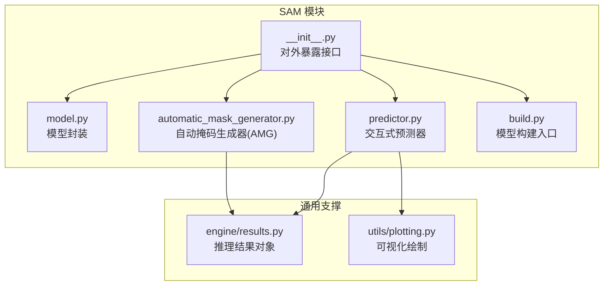
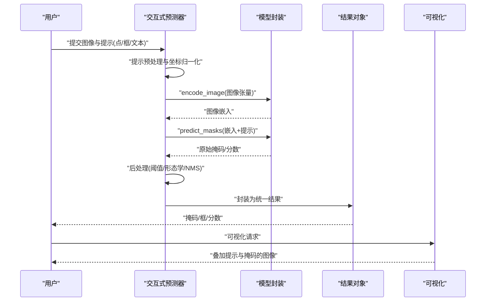
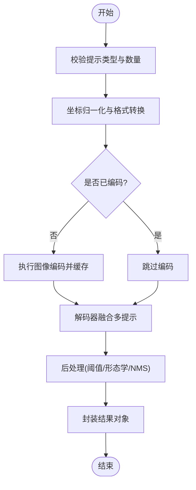
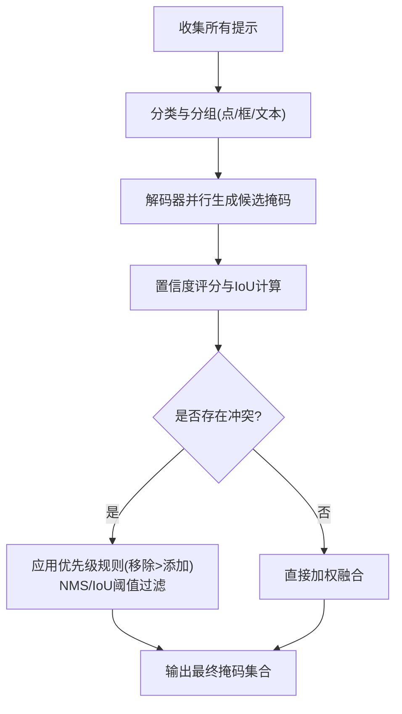
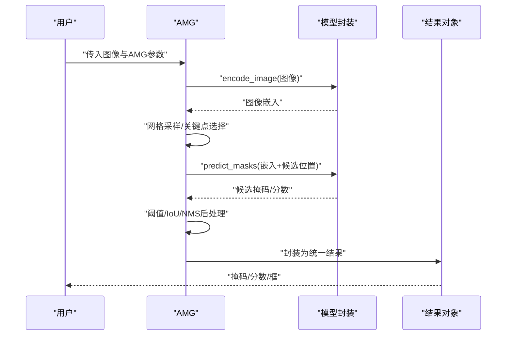
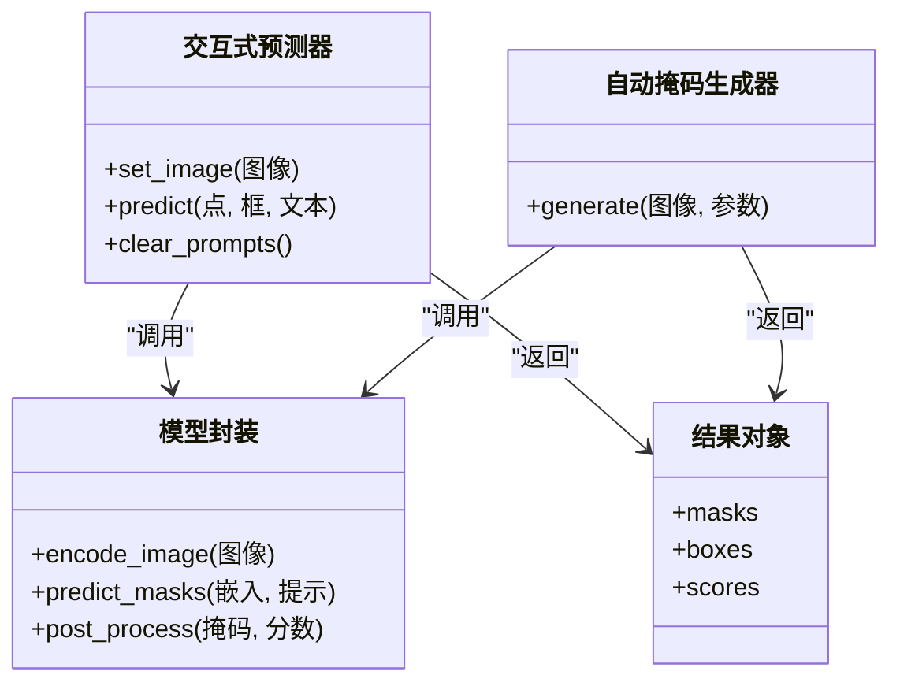
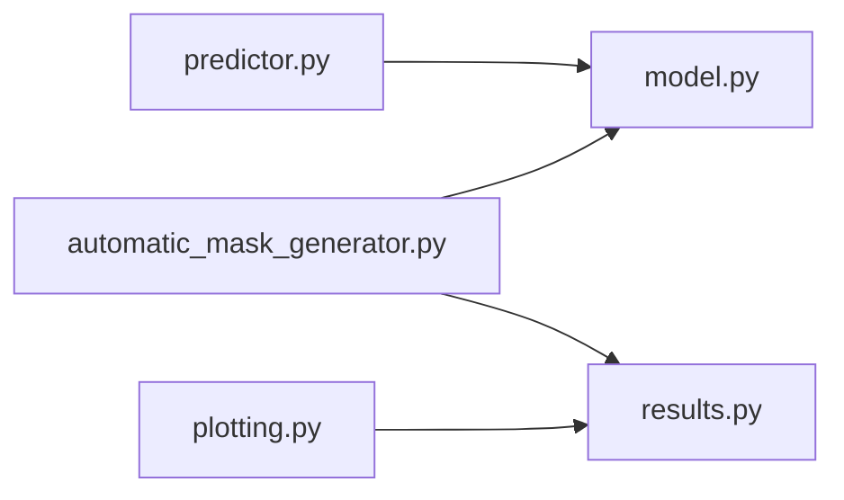

# 交互式提示接口

<cite>
**本文引用的文件**
- [ultralytics/models/sam/model.py](file://ultralytics/models/sam/model.py)
- [ultralytics/models/sam/predictor.py](file://ultralytics/models/sam/predictor.py)
- [ultralytics/models/sam/automatic_mask_generator.py](file://ultralytics/models/sam/automatic_mask_generator.py)
- [ultralytics/models/sam/build.py](file://ultralytics/models/sam/build.py)
- [ultralytics/models/sam/__init__.py](file://ultralytics/models/sam/__init__.py)
- [ultralytics/engine/results.py](file://ultralytics/engine/results.py)
- [ultralytics/utils/plotting.py](file://ultralytics/utils/plotting.py)
</cite>

## 目录
1. [简介](#简介)
2. [项目结构](#项目结构)
3. [核心组件](#核心组件)
4. [架构总览](#架构总览)
5. [详细组件分析](#详细组件分析)
6. [依赖关系分析](#依赖关系分析)
7. [性能考量](#性能考量)
8. [故障排查指南](#故障排查指南)
9. [结论](#结论)
10. [附录](#附录)

## 简介
本文件面向使用 SAM（Segment Anything Model）交互式提示接口的开发者，系统梳理点提示、框提示、文本提示等交互方式，说明坐标系统与格式要求、预处理方法、自动掩码生成器（AMG）的使用与参数配置、多提示融合与冲突解决机制、提示质量评估与结果验证方法，并给出复杂场景下的设计策略与最佳实践。文档同时提供丰富的交互式分割示例与调试技巧，帮助读者快速上手并稳定落地。

## 项目结构
SAM 相关代码位于 models/sam 子模块中，包含模型封装、预测器、自动掩码生成器以及构建入口；推理结果与可视化分别由 engine/results 与 utils/plotting 提供支持。

图示来源
- [ultralytics/models/sam/model.py](file://ultralytics/models/sam/model.py)
- [ultralytics/models/sam/predictor.py](file://ultralytics/models/sam/predictor.py)
- [ultralytics/models/sam/automatic_mask_generator.py](file://ultralytics/models/sam/automatic_mask_generator.py)
- [ultralytics/models/sam/build.py](file://ultralytics/models/sam/build.py)
- [ultralytics/models/sam/__init__.py](file://ultralytics/models/sam/__init__.py)
- [ultralytics/engine/results.py](file://ultralytics/engine/results.py)
- [ultralytics/utils/plotting.py](file://ultralytics/utils/plotting.py)

章节来源
- [ultralytics/models/sam/model.py](file://ultralytics/models/sam/model.py)
- [ultralytics/models/sam/predictor.py](file://ultralytics/models/sam/predictor.py)
- [ultralytics/models/sam/automatic_mask_generator.py](file://ultralytics/models/sam/automatic_mask_generator.py)
- [ultralytics/models/sam/build.py](file://ultralytics/models/sam/build.py)
- [ultralytics/models/sam/__init__.py](file://ultralytics/models/sam/__init__.py)
- [ultralytics/engine/results.py](file://ultralytics/engine/results.py)
- [ultralytics/utils/plotting.py](file://ultralytics/utils/plotting.py)

## 核心组件
- 模型封装：负责加载权重、设备管理、图像编码与解码流程编排。
- 交互式预测器：接收点/框/文本等提示，调用编码器与解码器生成掩码，支持多提示融合与迭代修正。
- 自动掩码生成器（AMG）：基于图像特征自动生成候选掩码，用于批量标注或弱监督场景。
- 构建入口：统一创建模型实例，屏蔽底层实现差异。
- 结果对象：标准化返回的掩码、边界框、分数等信息，便于后续处理与可视化。
- 可视化：将掩码、提示点/框叠加到原图，辅助调试与展示。

章节来源
- [ultralytics/models/sam/model.py](file://ultralytics/models/sam/model.py)
- [ultralytics/models/sam/predictor.py](file://ultralytics/models/sam/predictor.py)
- [ultralytics/models/sam/automatic_mask_generator.py](file://ultralytics/models/sam/automatic_mask_generator.py)
- [ultralytics/models/sam/build.py](file://ultralytics/models/sam/build.py)
- [ultralytics/engine/results.py](file://ultralytics/engine/results.py)
- [ultralytics/utils/plotting.py](file://ultralytics/utils/plotting.py)

## 架构总览
下图展示了从用户输入到最终掩码输出的端到端流程，包括提示预处理、图像编码、解码器融合、后处理与可视化。

图示来源
- [ultralytics/models/sam/predictor.py](file://ultralytics/models/sam/predictor.py)
- [ultralytics/models/sam/model.py](file://ultralytics/models/sam/model.py)
- [ultralytics/engine/results.py](file://ultralytics/engine/results.py)
- [ultralytics/utils/plotting.py](file://ultralytics/utils/plotting.py)

## 详细组件分析

### 交互式预测器（点/框/文本提示）
- 功能要点
  - 支持点提示、框提示、文本提示三类交互方式。
  - 对提示进行预处理：坐标归一化、类型校验、去重与排序。
  - 多提示融合：在解码阶段聚合多个提示信号，提升鲁棒性。
  - 迭代修正：允许追加/删除提示以逐步完善分割。
- 关键流程
  - 输入校验与预处理
  - 图像编码（一次性计算，缓存复用）
  - 解码器融合（按提示类型加权/投票）
  - 后处理（阈值、连通域、NMS）
  - 结果封装与可视化
- 复杂度与性能
  - 图像编码一次计算，多次提示可复用，显著降低延迟。
  - 多提示融合增加少量计算开销，但能显著提升精度。

图示来源
- [ultralytics/models/sam/predictor.py](file://ultralytics/models/sam/predictor.py)
- [ultralytics/models/sam/model.py](file://ultralytics/models/sam/model.py)

章节来源
- [ultralytics/models/sam/predictor.py](file://ultralytics/models/sam/predictor.py)
- [ultralytics/models/sam/model.py](file://ultralytics/models/sam/model.py)

#### 提示坐标系统与格式要求
- 坐标系约定
  - 像素坐标系：原点位于左上角，x 向右递增，y 向下递增。
  - 归一化坐标：范围通常为 [0,1]，对应图像宽高比例。
- 点提示
  - 格式：二维数组，形状 (N, 2)，N 为点数。
  - 值域：若为像素坐标，需确保在图像范围内；若为归一化坐标，需在 [0,1]。
- 框提示
  - 格式：二维数组，形状 (K, 4)。
  - 顺序：常见为 [x_min, y_min, x_max, y_max] 或中心+宽高，具体以接口定义为准。
  - 约束：x_min ≤ x_max，y_min ≤ y_max；建议避免退化框（面积为零）。
- 文本提示
  - 输入：字符串或词表索引序列。
  - 语义：描述目标类别或属性，需与模型训练时的语言空间对齐。
- 预处理方法
  - 越界裁剪：将坐标限制在图像边界内。
  - 重复剔除：去除重复点/框，必要时保留最近一次提示。
  - 排序与分组：按类型分组，便于解码器差异化处理。

章节来源
- [ultralytics/models/sam/predictor.py](file://ultralytics/models/sam/predictor.py)

#### 多提示融合与冲突解决
- 融合策略
  - 解码器级融合：将不同提示映射到同一潜空间，通过注意力/门控机制聚合。
  - 评分融合：对各提示生成的掩码进行置信度加权合并。
- 冲突解决
  - 正负提示互斥：当存在“添加”和“移除”两类提示时，优先满足移除区域。
  - 重叠抑制：对高度重叠的候选掩码执行 NMS 或 IoU 阈值筛选。
  - 一致性检查：对文本提示与几何提示不一致的情况，采用降级策略（如仅用几何提示）。

图示来源
- [ultralytics/models/sam/predictor.py](file://ultralytics/models/sam/predictor.py)

章节来源
- [ultralytics/models/sam/predictor.py](file://ultralytics/models/sam/predictor.py)

### 自动掩码生成器（AMG）
- 适用场景
  - 批量无提示分割、弱监督数据生成、探索性分析。
- 工作流程
  - 图像编码 → 网格采样/关键点检测 → 掩码生成 → 后处理与筛选 → 结果封装。
- 关键参数
  - 网格大小/步长：控制候选区域密度。
  - 掩码阈值：过滤低置信度掩码。
  - IoU 阈值：抑制重复掩码。
  - 最大掩码数：限制输出规模。
- 输出
  - 掩码列表、对应分数、可选边界框。

图示来源
- [ultralytics/models/sam/automatic_mask_generator.py](file://ultralytics/models/sam/automatic_mask_generator.py)
- [ultralytics/models/sam/model.py](file://ultralytics/models/sam/model.py)
- [ultralytics/engine/results.py](file://ultralytics/engine/results.py)

章节来源
- [ultralytics/models/sam/automatic_mask_generator.py](file://ultralytics/models/sam/automatic_mask_generator.py)
- [ultralytics/models/sam/model.py](file://ultralytics/models/sam/model.py)
- [ultralytics/engine/results.py](file://ultralytics/engine/results.py)

### 模型封装与构建入口
- 模型封装
  - 负责图像编码缓存、提示到潜空间的映射、掩码解码与后处理。
- 构建入口
  - 提供统一的模型初始化接口，支持权重路径、设备选择与精度设置。

图示来源
- [ultralytics/models/sam/model.py](file://ultralytics/models/sam/model.py)
- [ultralytics/models/sam/predictor.py](file://ultralytics/models/sam/predictor.py)
- [ultralytics/models/sam/automatic_mask_generator.py](file://ultralytics/models/sam/automatic_mask_generator.py)
- [ultralytics/engine/results.py](file://ultralytics/engine/results.py)

章节来源
- [ultralytics/models/sam/model.py](file://ultralytics/models/sam/model.py)
- [ultralytics/models/sam/predictor.py](file://ultralytics/models/sam/predictor.py)
- [ultralytics/models/sam/automatic_mask_generator.py](file://ultralytics/models/sam/automatic_mask_generator.py)
- [ultralytics/models/sam/build.py](file://ultralytics/models/sam/build.py)
- [ultralytics/models/sam/__init__.py](file://ultralytics/models/sam/__init__.py)
- [ultralytics/engine/results.py](file://ultralytics/engine/results.py)

## 依赖关系分析
- 内部依赖
  - predictor 依赖 model 进行编码/解码。
  - automatic_mask_generator 依赖 model 与 results。
  - plotting 依赖 results 进行可视化。
- 外部依赖
  - 张量运算库（如 PyTorch）、图像处理库（如 OpenCV/PIL）。
- 耦合与内聚
  - predictor 与 model 高内聚，职责清晰。
  - results 作为统一数据结构，降低下游耦合。

图示来源
- [ultralytics/models/sam/predictor.py](file://ultralytics/models/sam/predictor.py)
- [ultralytics/models/sam/model.py](file://ultralytics/models/sam/model.py)
- [ultralytics/models/sam/automatic_mask_generator.py](file://ultralytics/models/sam/automatic_mask_generator.py)
- [ultralytics/engine/results.py](file://ultralytics/engine/results.py)
- [ultralytics/utils/plotting.py](file://ultralytics/utils/plotting.py)

章节来源
- [ultralytics/models/sam/predictor.py](file://ultralytics/models/sam/predictor.py)
- [ultralytics/models/sam/model.py](file://ultralytics/models/sam/model.py)
- [ultralytics/models/sam/automatic_mask_generator.py](file://ultralytics/models/sam/automatic_mask_generator.py)
- [ultralytics/engine/results.py](file://ultralytics/engine/results.py)
- [ultralytics/utils/plotting.py](file://ultralytics/utils/plotting.py)

## 性能考量
- 图像编码缓存：一次编码，多次提示复用，显著降低延迟。
- 批处理与异步：对批量图像可采用批处理策略，结合异步 I/O 提升吞吐。
- 内存优化：及时释放中间张量，避免大图长时间驻留显存。
- 后处理调参：合理设置阈值与 IoU 阈值，减少冗余掩码。
- 设备选择：GPU 加速编码与解码，CPU 仅用于轻量任务。

[本节为通用指导，不直接分析具体文件]

## 故障排查指南
- 常见问题
  - 坐标越界：提示点/框超出图像范围导致异常。
  - 空提示：未提供任何提示导致解码失败。
  - 文本不匹配：文本提示与模型语言空间不一致，导致语义偏差。
  - 掩码过多/过少：阈值或 IoU 参数不当。
- 定位步骤
  - 打印提示预处理后的坐标与类型。
  - 检查图像尺寸与设备状态。
  - 观察中间嵌入与候选掩码分布。
  - 调整阈值与 IoU 阈值，对比前后效果。
- 可视化辅助
  - 使用绘图工具叠加提示点/框与掩码，直观判断问题所在。

章节来源
- [ultralytics/models/sam/predictor.py](file://ultralytics/models/sam/predictor.py)
- [ultralytics/utils/plotting.py](file://ultralytics/utils/plotting.py)

## 结论
SAM 交互式提示接口通过点/框/文本等多模态提示，结合图像编码缓存与解码器融合，实现了高效且灵活的分割体验。配合 AMG 可在无提示场景下快速获得高质量候选掩码。遵循本文的坐标规范、预处理流程与后处理策略，可在复杂场景中稳定落地。建议在实际项目中结合可视化与指标评估持续优化参数与提示策略。

[本节为总结，不直接分析具体文件]

## 附录

### 编程接口速查
- 交互式预测器
  - set_image(image): 设置图像并缓存编码。
  - predict(points=None, boxes=None, text=None): 根据提示生成掩码。
  - clear_prompts(): 清空历史提示，重置状态。
- 自动掩码生成器
  - generate(image, params): 基于参数生成候选掩码。
- 结果对象
  - masks: 二值掩码数组。
  - boxes: 对应边界框。
  - scores: 掩码置信度。

章节来源
- [ultralytics/models/sam/predictor.py](file://ultralytics/models/sam/predictor.py)
- [ultralytics/models/sam/automatic_mask_generator.py](file://ultralytics/models/sam/automatic_mask_generator.py)
- [ultralytics/engine/results.py](file://ultralytics/engine/results.py)

### 提示设计与最佳实践
- 点提示
  - 在目标中心附近放置多点，覆盖主要区域。
  - 对于细长目标，沿轮廓均匀布点。
- 框提示
  - 尽量贴合目标外轮廓，避免过大背景引入噪声。
  - 对遮挡目标，使用多个小框组合。
- 文本提示
  - 使用简洁明确的类别名，避免歧义。
  - 与几何提示联合使用，提高一致性。
- 多提示融合
  - 先粗后精：先用框定位，再用点细化。
  - 冲突优先：移除提示优先于添加提示。
- 结果验证
  - 使用 IoU 与 Dice 系数评估掩码质量。
  - 人工抽检关键样本，关注边缘细节。

[本节为概念性内容，不直接分析具体文件]

### 调试技巧
- 打印中间变量：提示预处理后的坐标、图像嵌入维度、候选掩码数量。
- 可视化叠加：在原图上绘制提示点/框与掩码轮廓，快速定位问题。
- 参数扫描：对阈值与 IoU 阈值进行网格搜索，观察指标变化。
- 日志记录：记录每次交互的提示内容与结果摘要，便于回溯。

章节来源
- [ultralytics/utils/plotting.py](file://ultralytics/utils/plotting.py)
- [ultralytics/models/sam/predictor.py](file://ultralytics/models/sam/predictor.py)