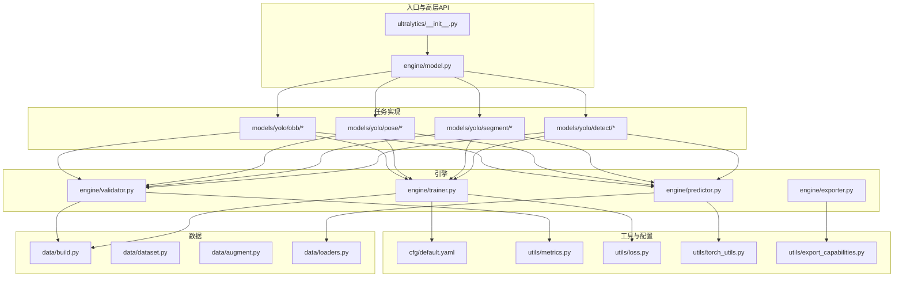
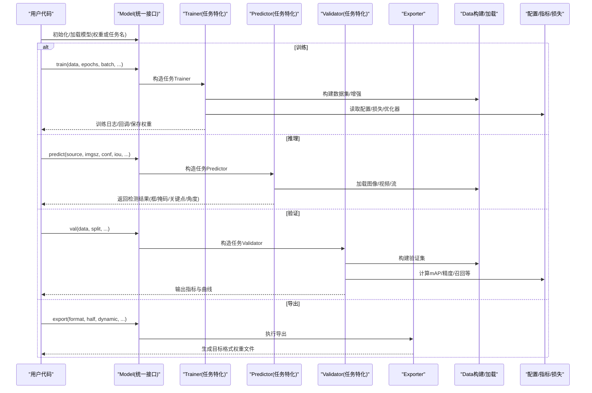
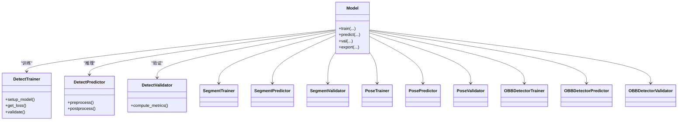
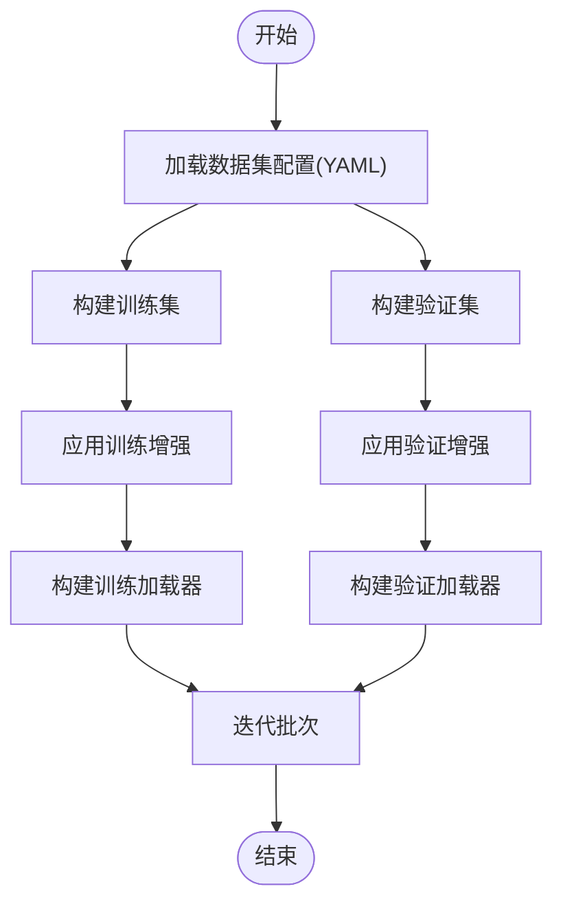
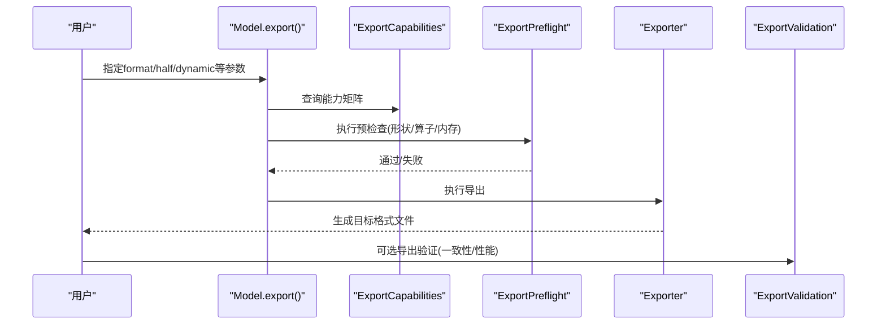
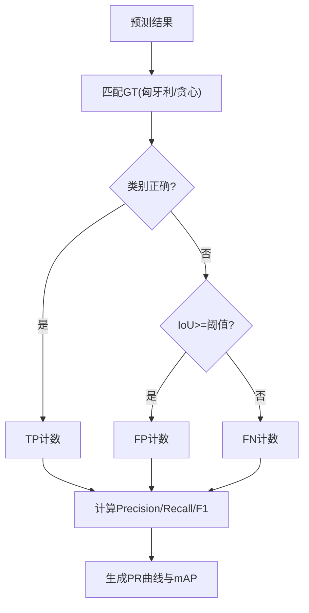
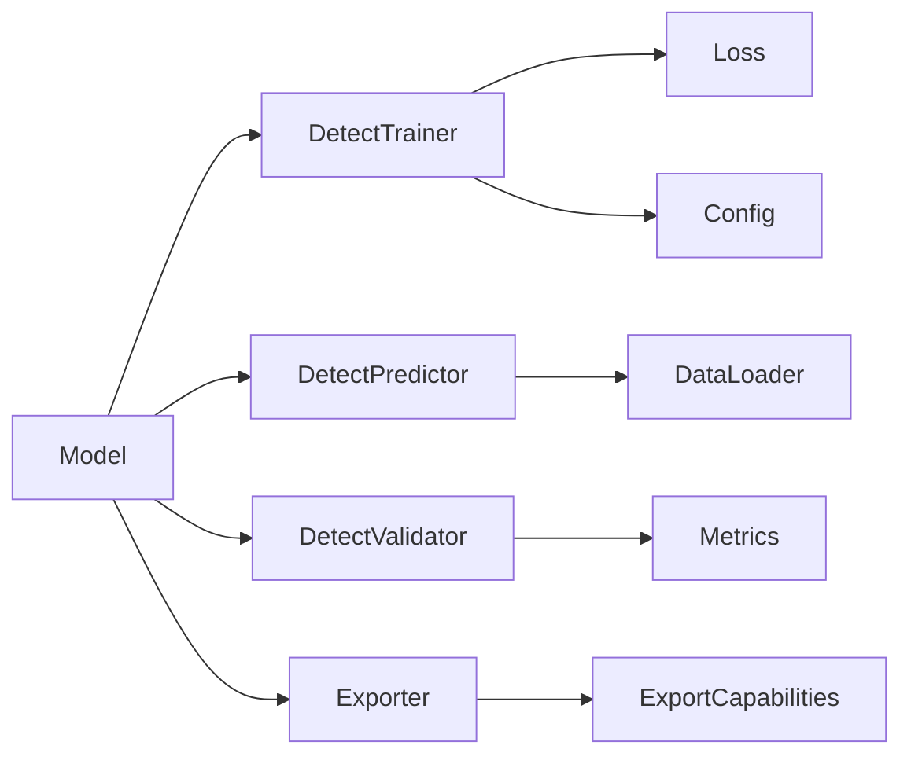

# YOLO模型API

<cite>
**本文引用的文件**
- [ultralytics/__init__.py](file://ultralytics/__init__.py)
- [ultralytics/engine/model.py](file://ultralytics/engine/model.py)
- [ultralytics/engine/trainer.py](file://ultralytics/engine/trainer.py)
- [ultralytics/engine/predictor.py](file://ultralytics/engine/predictor.py)
- [ultralytics/engine/validator.py](file://ultralytics/engine/validator.py)
- [ultralytics/engine/exporter.py](file://ultralytics/engine/exporter.py)
- [ultralytics/models/yolo/model.py](file://ultralytics/models/yolo/model.py)
- [ultralytics/models/yolo/detect/trainer.py](file://ultralytics/models/yolo/detect/trainer.py)
- [ultralytics/models/yolo/detect/predictor.py](file://ultralytics/models/yolo/detect/predictor.py)
- [ultralytics/models/yolo/detect/val.py](file://ultralytics/models/yolo/detect/val.py)
- [ultralytics/models/yolo/segment/trainer.py](file://ultralytics/models/yolo/segment/trainer.py)
- [ultralytics/models/yolo/segment/predictor.py](file://ultralytics/models/yolo/segment/predictor.py)
- [ultralytics/models/yolo/segment/val.py](file://ultralytics/models/yolo/segment/val.py)
- [ultralytics/models/yolo/pose/trainer.py](file://ultralytics/models/yolo/pose/trainer.py)
- [ultralytics/models/yolo/pose/predictor.py](file://ultralytics/models/yolo/pose/predictor.py)
- [ultralytics/models/yolo/pose/val.py](file://ultralytics/models/yolo/pose/val.py)
- [ultralytics/models/yolo/obb/trainer.py](file://ultralytics/models/yolo/obb/trainer.py)
- [ultralytics/models/yolo/obb/predictor.py](file://ultralytics/models/yolo/obb/predictor.py)
- [ultralytics/models/yolo/obb/val.py](file://ultralytics/models/yolo/obb/val.py)
- [ultralytics/cfg/default.yaml](file://ultralytics/cfg/default.yaml)
- [ultralytics/utils/metrics.py](file://ultralytics/utils/metrics.py)
- [ultralytics/utils/loss.py](file://ultralytics/utils/loss.py)
- [ultralytics/utils/torch_utils.py](file://ultralytics/utils/torch_utils.py)
- [ultralytics/utils/checkpoint_compat.py](file://ultralytics/utils/checkpoint_compat.py)
- [ultralytics/utils/export_capabilities.py](file://ultralytics/utils/export_capabilities.py)
- [ultralytics/utils/export_preflight.py](file://ultralytics/utils/export_preflight.py)
- [ultralytics/utils/export_validation.py](file://ultralytics/utils/export_validation.py)
- [ultralytics/data/build.py](file://ultralytics/data/build.py)
- [ultralytics/data/base.py](file://ultralytics/data/base.py)
- [ultralytics/data/augment.py](file://ultralytics/data/augment.py)
- [ultralytics/data/dataset.py](file://ultralytics/data/dataset.py)
- [ultralytics/data/loaders.py](file://ultralytics/data/loaders.py)
- [ultralytics/data/annotator.py](file://ultralytics/data/annotator.py)
- [ultralytics/data/converter.py](file://ultralytics/data/converter.py)
- [ultralytics/data/split.py](file://ultralytics/data/split.py)
- [ultralytics/data/split_dota.py](file://ultralytics/data/split_dota.py)
- [ultralytics/data/utils.py](file://ultralytics/data/utils.py)
- [ultralytics/nn/tasks.py](file://ultralytics/nn/tasks.py)
- [ultralytics/nn/autobackend.py](file://ultralytics/nn/autobackend.py)
- [ultralytics/nn/mixture_loss.py](file://ultralytics/nn/mixture_loss.py)
- [ultralytics/nn/mixture_registry.py](file://ultralytics/nn/mixture_registry.py)
- [ultralytics/nn/text_model.py](file://ultralytics/nn/text_model.py)
- [ultralytics/optim/muon.py](file://ultralytics/optim/muon.py)
- [ultralytics/hub/session.py](file://ultralytics/hub/session.py)
- [ultralytics/hub/auth.py](file://ultralytics/hub/auth.py)
- [ultralytics/hub/utils.py](file://ultralytics/hub/utils.py)
- [examples/tutorial.ipynb](file://examples/tutorial.ipynb)
- [examples/object_counting.ipynb](file://examples/object_counting.ipynb)
- [examples/object_tracking.ipynb](file://examples/object_tracking.ipynb)
- [examples/hub.ipynb](file://examples/hub.ipynb)
- [scripts/smoke_test_coco2017.py](file://scripts/smoke_test_coco2017.py)
- [scripts/quick_train_verify.py](file://scripts/quick_train_verify.py)
</cite>

## 目录
1. [简介](#简介)
2. [项目结构](#项目结构)
3. [核心组件](#核心组件)
4. [架构总览](#架构总览)
5. [详细组件分析](#详细组件分析)
6. [依赖关系分析](#依赖关系分析)
7. [性能与最佳实践](#性能与最佳实践)
8. [故障排查指南](#故障排查指南)
9. [结论](#结论)
10. [附录：任务与配置参考](#附录任务与配置参考)

## 简介
本文件面向使用YOLO系列模型的开发者，系统化梳理YOLOv8、YOLOv10、YOLOv11、YOLOv12等模型的Python接口规范，覆盖模型初始化、训练、推理、导出全流程；详细说明检测、分割、姿态估计、旋转目标检测（OBB）等不同任务的API使用方法；解释模型配置文件结构与参数含义（网络架构、损失函数、优化器设置）；说明权重加载与保存接口；提供批量处理与实时推理的最佳实践；并给出评估指标计算方法与结果解析。文档同时包含自定义数据集的训练流程与配置方法，帮助读者快速上手与深入定制。

## 项目结构
仓库采用模块化分层组织：
- ultralytics：核心库，包含模型定义、引擎（训练/验证/预测/导出）、数据管线、工具集、跟踪器、解决方案等。
- models/yolo：按任务划分的YOLO实现（detect/segment/pose/obb），各自包含trainer/predictor/val。
- engine：通用训练/验证/预测/导出引擎，封装生命周期与设备管理。
- data：数据加载、增强、格式转换、切分等。
- nn：网络模块、任务头、混合专家相关、文本模型等。
- utils：指标、损失、导出能力、预检、验证、Torch工具、分布式、日志等。
- cfg：默认配置与数据集/模型配置。
- examples：教程与示例脚本。
- scripts：复现、验证、基准脚本。

图表来源
- [ultralytics/__init__.py](file://ultralytics/__init__.py)
- [ultralytics/engine/model.py](file://ultralytics/engine/model.py)
- [ultralytics/models/yolo/detect/trainer.py](file://ultralytics/models/yolo/detect/trainer.py)
- [ultralytics/models/yolo/segment/trainer.py](file://ultralytics/models/yolo/segment/trainer.py)
- [ultralytics/models/yolo/pose/trainer.py](file://ultralytics/models/yolo/pose/trainer.py)
- [ultralytics/models/yolo/obb/trainer.py](file://ultralytics/models/yolo/obb/trainer.py)
- [ultralytics/engine/trainer.py](file://ultralytics/engine/trainer.py)
- [ultralytics/engine/predictor.py](file://ultralytics/engine/predictor.py)
- [ultralytics/engine/validator.py](file://ultralytics/engine/validator.py)
- [ultralytics/engine/exporter.py](file://ultralytics/engine/exporter.py)
- [ultralytics/data/build.py](file://ultralytics/data/build.py)
- [ultralytics/data/dataset.py](file://ultralytics/data/dataset.py)
- [ultralytics/data/augment.py](file://ultralytics/data/augment.py)
- [ultralytics/data/loaders.py](file://ultralytics/data/loaders.py)
- [ultralytics/cfg/default.yaml](file://ultralytics/cfg/default.yaml)
- [ultralytics/utils/metrics.py](file://ultralytics/utils/metrics.py)
- [ultralytics/utils/loss.py](file://ultralytics/utils/loss.py)
- [ultralytics/utils/export_capabilities.py](file://ultralytics/utils/export_capabilities.py)

章节来源
- [ultralytics/__init__.py](file://ultralytics/__init__.py)
- [ultralytics/engine/model.py](file://ultralytics/engine/model.py)
- [ultralytics/cfg/default.yaml](file://ultralytics/cfg/default.yaml)

## 核心组件
- 统一模型接口：通过高层API创建/加载模型，自动识别任务类型（检测/分割/姿态/OBB），并提供train/predict/val/export等方法。
- 任务特定Trainer/Predictor/Validator：不同任务继承通用引擎，注入任务特定的损失、指标、后处理逻辑。
- 数据管线：支持多种标注格式与数据集结构，内置增强策略，适配多尺度与批处理。
- 导出系统：将PyTorch模型导出为ONNX/TensorRT/OpenVINO/TFLite等，具备能力矩阵与预检查。
- 工具与配置：默认配置、指标计算、损失函数、Torch工具、权重兼容等。

章节来源
- [ultralytics/engine/model.py](file://ultralytics/engine/model.py)
- [ultralytics/models/yolo/detect/trainer.py](file://ultralytics/models/yolo/detect/trainer.py)
- [ultralytics/models/yolo/segment/trainer.py](file://ultralytics/models/yolo/segment/trainer.py)
- [ultralytics/models/yolo/pose/trainer.py](file://ultralytics/models/yolo/pose/trainer.py)
- [ultralytics/models/yolo/obb/trainer.py](file://ultralytics/models/yolo/obb/trainer.py)
- [ultralytics/engine/trainer.py](file://ultralytics/engine/trainer.py)
- [ultralytics/engine/predictor.py](file://ultralytics/engine/predictor.py)
- [ultralytics/engine/validator.py](file://ultralytics/engine/validator.py)
- [ultralytics/engine/exporter.py](file://ultralytics/engine/exporter.py)
- [ultralytics/data/build.py](file://ultralytics/data/build.py)
- [ultralytics/utils/metrics.py](file://ultralytics/utils/metrics.py)
- [ultralytics/utils/loss.py](file://ultralytics/utils/loss.py)
- [ultralytics/utils/export_capabilities.py](file://ultralytics/utils/export_capabilities.py)

## 架构总览
下图展示从用户调用到具体任务实现的端到端流程，包括训练、推理、验证与导出。

图表来源
- [ultralytics/engine/model.py](file://ultralytics/engine/model.py)
- [ultralytics/engine/trainer.py](file://ultralytics/engine/trainer.py)
- [ultralytics/engine/predictor.py](file://ultralytics/engine/predictor.py)
- [ultralytics/engine/validator.py](file://ultralytics/engine/validator.py)
- [ultralytics/engine/exporter.py](file://ultralytics/engine/exporter.py)
- [ultralytics/data/build.py](file://ultralytics/data/build.py)
- [ultralytics/utils/metrics.py](file://ultralytics/utils/metrics.py)
- [ultralytics/utils/loss.py](file://ultralytics/utils/loss.py)

## 详细组件分析

### 统一模型接口（Model）
- 职责：对外暴露统一的初始化、训练、推理、验证、导出接口；内部根据任务类型路由至对应Trainer/Predictor/Validator。
- 关键能力：
  - 模型初始化与权重加载：支持从本地路径或任务名称加载，自动选择任务与配置。
  - 训练：封装Trainer生命周期，支持断点续训、回调、日志记录。
  - 推理：封装Predictor，支持单图/视频/流、动态尺寸、置信度/NMS阈值控制。
  - 验证：封装Validator，输出mAP、PR曲线、混淆矩阵等。
  - 导出：封装Exporter，结合导出能力矩阵与预检查，生成目标格式。
- 典型调用路径：
  - 初始化/加载：[ultralytics/engine/model.py](file://ultralytics/engine/model.py)
  - 训练入口：[ultralytics/engine/trainer.py](file://ultralytics/engine/trainer.py)
  - 推理入口：[ultralytics/engine/predictor.py](file://ultralytics/engine/predictor.py)
  - 验证入口：[ultralytics/engine/validator.py](file://ultralytics/engine/validator.py)
  - 导出入口：[ultralytics/engine/exporter.py](file://ultralytics/engine/exporter.py)

章节来源
- [ultralytics/engine/model.py](file://ultralytics/engine/model.py)
- [ultralytics/engine/trainer.py](file://ultralytics/engine/trainer.py)
- [ultralytics/engine/predictor.py](file://ultralytics/engine/predictor.py)
- [ultralytics/engine/validator.py](file://ultralytics/engine/validator.py)
- [ultralytics/engine/exporter.py](file://ultralytics/engine/exporter.py)

### 任务特化组件（Detect/Segment/Pose/OBB）
- 检测（Detect）
  - Trainer：定义检测损失、训练循环、指标计算。
  - Predictor：前向+后处理（NMS、置信度过滤）。
  - Validator：计算mAP、PR曲线、混淆矩阵。
- 实例分割（Segment）
  - 在检测基础上增加掩码分支与掩码损失。
- 姿态估计（Pose）
  - 在检测基础上增加关键点分支与关键点损失。
- 旋转目标检测（OBB）
  - 在检测基础上引入角度回归与旋转NMS。

图表来源
- [ultralytics/models/yolo/detect/trainer.py](file://ultralytics/models/yolo/detect/trainer.py)
- [ultralytics/models/yolo/detect/predictor.py](file://ultralytics/models/yolo/detect/predictor.py)
- [ultralytics/models/yolo/detect/val.py](file://ultralytics/models/yolo/detect/val.py)
- [ultralytics/models/yolo/segment/trainer.py](file://ultralytics/models/yolo/segment/trainer.py)
- [ultralytics/models/yolo/segment/predictor.py](file://ultralytics/models/yolo/segment/predictor.py)
- [ultralytics/models/yolo/segment/val.py](file://ultralytics/models/yolo/segment/val.py)
- [ultralytics/models/yolo/pose/trainer.py](file://ultralytics/models/yolo/pose/trainer.py)
- [ultralytics/models/yolo/pose/predictor.py](file://ultralytics/models/yolo/pose/predictor.py)
- [ultralytics/models/yolo/pose/val.py](file://ultralytics/models/yolo/pose/val.py)
- [ultralytics/models/yolo/obb/trainer.py](file://ultralytics/models/yolo/obb/trainer.py)
- [ultralytics/models/yolo/obb/predictor.py](file://ultralytics/models/yolo/obb/predictor.py)
- [ultralytics/models/yolo/obb/val.py](file://ultralytics/models/yolo/obb/val.py)

章节来源
- [ultralytics/models/yolo/detect/trainer.py](file://ultralytics/models/yolo/detect/trainer.py)
- [ultralytics/models/yolo/segment/trainer.py](file://ultralytics/models/yolo/segment/trainer.py)
- [ultralytics/models/yolo/pose/trainer.py](file://ultralytics/models/yolo/pose/trainer.py)
- [ultralytics/models/yolo/obb/trainer.py](file://ultralytics/models/yolo/obb/trainer.py)

### 数据管线（Data Build/Augment/Loaders）
- 数据构建：根据数据集配置文件（如YAML）构建训练/验证/测试集，支持多格式标注。
- 数据增强：内置几何与色彩增强，支持Mosaic、MixUp、随机裁剪、缩放等。
- 数据加载：高效迭代器，支持多进程、缓存、动态尺寸。
- 标注转换：提供常见格式（COCO/VOC/YOLO）之间的转换工具。
- 切分：支持常规切分与DOTA等遥感数据集的瓦片切分。

图表来源
- [ultralytics/data/build.py](file://ultralytics/data/build.py)
- [ultralytics/data/augment.py](file://ultralytics/data/augment.py)
- [ultralytics/data/loaders.py](file://ultralytics/data/loaders.py)
- [ultralytics/data/dataset.py](file://ultralytics/data/dataset.py)
- [ultralytics/data/converter.py](file://ultralytics/data/converter.py)
- [ultralytics/data/split.py](file://ultralytics/data/split.py)
- [ultralytics/data/split_dota.py](file://ultralytics/data/split_dota.py)

章节来源
- [ultralytics/data/build.py](file://ultralytics/data/build.py)
- [ultralytics/data/augment.py](file://ultralytics/data/augment.py)
- [ultralytics/data/loaders.py](file://ultralytics/data/loaders.py)
- [ultralytics/data/dataset.py](file://ultralytics/data/dataset.py)
- [ultralytics/data/converter.py](file://ultralytics/data/converter.py)
- [ultralytics/data/split.py](file://ultralytics/data/split.py)
- [ultralytics/data/split_dota.py](file://ultralytics/data/split_dota.py)

### 导出系统（Exporter与能力矩阵）
- 能力矩阵：声明各模型对导出格式的支持情况（如ONNX/TensorRT/OpenVINO/TFLite）。
- 预检查：在导出前进行兼容性检查（输入形状、算子支持、内存需求）。
- 导出流程：PyTorch -> 中间表示 -> 目标后端优化与序列化。
- 验证：导出后校验数值一致性与时延/吞吐对比。

图表来源
- [ultralytics/engine/exporter.py](file://ultralytics/engine/exporter.py)
- [ultralytics/utils/export_capabilities.py](file://ultralytics/utils/export_capabilities.py)
- [ultralytics/utils/export_preflight.py](file://ultralytics/utils/export_preflight.py)
- [ultralytics/utils/export_validation.py](file://ultralytics/utils/export_validation.py)

章节来源
- [ultralytics/engine/exporter.py](file://ultralytics/engine/exporter.py)
- [ultralytics/utils/export_capabilities.py](file://ultralytics/utils/export_capabilities.py)
- [ultralytics/utils/export_preflight.py](file://ultralytics/utils/export_preflight.py)
- [ultralytics/utils/export_validation.py](file://ultralytics/utils/export_validation.py)

### 指标与损失（Metrics/Loss）
- 指标：mAP@IoU=0.50~0.95、Precision、Recall、F1、混淆矩阵、PR曲线等。
- 损失：分类损失、定位损失、掩码损失、关键点损失、旋转损失等，支持组合与权重调节。
- Torch工具：混合精度、梯度累积、分布式通信等。

图表来源
- [ultralytics/utils/metrics.py](file://ultralytics/utils/metrics.py)
- [ultralytics/utils/loss.py](file://ultralytics/utils/loss.py)
- [ultralytics/utils/torch_utils.py](file://ultralytics/utils/torch_utils.py)

章节来源
- [ultralytics/utils/metrics.py](file://ultralytics/utils/metrics.py)
- [ultralytics/utils/loss.py](file://ultralytics/utils/loss.py)
- [ultralytics/utils/torch_utils.py](file://ultralytics/utils/torch_utils.py)

## 依赖关系分析
- 耦合与内聚：
  - 统一接口与任务特化组件之间松耦合，通过工厂/路由机制解耦。
  - 数据管线与任务组件通过抽象接口交互，便于替换增强策略与加载器。
- 外部依赖：
  - PyTorch生态（TorchScript/ONNX/TensorRT/OpenVINO/TFLite）。
  - 可视化与日志（TensorBoard/CSV/JSON）。
- 潜在循环依赖：
  - 避免在任务组件中直接导入上层统一接口，应通过回调/事件机制解耦。

图表来源
- [ultralytics/engine/model.py](file://ultralytics/engine/model.py)
- [ultralytics/models/yolo/detect/trainer.py](file://ultralytics/models/yolo/detect/trainer.py)
- [ultralytics/models/yolo/detect/predictor.py](file://ultralytics/models/yolo/detect/predictor.py)
- [ultralytics/models/yolo/detect/val.py](file://ultralytics/models/yolo/detect/val.py)
- [ultralytics/utils/loss.py](file://ultralytics/utils/loss.py)
- [ultralytics/cfg/default.yaml](file://ultralytics/cfg/default.yaml)
- [ultralytics/data/loaders.py](file://ultralytics/data/loaders.py)
- [ultralytics/utils/metrics.py](file://ultralytics/utils/metrics.py)
- [ultralytics/engine/exporter.py](file://ultralytics/engine/exporter.py)
- [ultralytics/utils/export_capabilities.py](file://ultralytics/utils/export_capabilities.py)

章节来源
- [ultralytics/engine/model.py](file://ultralytics/engine/model.py)
- [ultralytics/models/yolo/detect/trainer.py](file://ultralytics/models/yolo/detect/trainer.py)
- [ultralytics/models/yolo/detect/predictor.py](file://ultralytics/models/yolo/detect/predictor.py)
- [ultralytics/models/yolo/detect/val.py](file://ultralytics/models/yolo/detect/val.py)
- [ultralytics/utils/loss.py](file://ultralytics/utils/loss.py)
- [ultralytics/cfg/default.yaml](file://ultralytics/cfg/default.yaml)
- [ultralytics/data/loaders.py](file://ultralytics/data/loaders.py)
- [ultralytics/utils/metrics.py](file://ultralytics/utils/metrics.py)
- [ultralytics/engine/exporter.py](file://ultralytics/engine/exporter.py)
- [ultralytics/utils/export_capabilities.py](file://ultralytics/utils/export_capabilities.py)

## 性能与最佳实践
- 批量处理
  - 合理设置batch size以平衡吞吐与显存占用；使用动态尺寸时注意对齐与填充开销。
  - 启用数据预取与多进程加载，减少I/O瓶颈。
- 实时推理
  - 固定输入尺寸以减少重分配；使用半精度与后端优化（TensorRT/OpenVINO）。
  - 调整置信度与NMS阈值，降低后处理耗时。
- 训练加速
  - 混合精度训练、梯度累积、分布式并行（DDP）。
  - 选择合适的优化器与学习率调度策略。
- 导出优化
  - 依据能力矩阵选择合适格式；导出前进行预检查与数值验证。
  - 针对部署平台开启相应优化选项（如INT8量化、静态形状）。

[本节为通用指导，不直接分析具体文件]

## 故障排查指南
- 权重加载与保存
  - 检查权重版本与模型配置是否兼容；必要时使用权重兼容工具进行迁移。
  - 确认保存路径权限与磁盘空间。
- 导出失败
  - 查看导出能力矩阵与预检查结果，确认算子支持与输入形状。
  - 使用导出验证工具进行一致性检查。
- 训练异常
  - 检查数据路径与标注格式；确认数据集配置YAML字段完整。
  - 监控损失发散与梯度爆炸，适当调整学习率与正则化。
- 推理错误
  - 核对输入图像尺寸与预处理步骤；确保设备（CPU/GPU）可用。
  - 调整NMS与置信度阈值，避免漏检/误检。

章节来源
- [ultralytics/utils/checkpoint_compat.py](file://ultralytics/utils/checkpoint_compat.py)
- [ultralytics/utils/export_capabilities.py](file://ultralytics/utils/export_capabilities.py)
- [ultralytics/utils/export_preflight.py](file://ultralytics/utils/export_preflight.py)
- [ultralytics/utils/export_validation.py](file://ultralytics/utils/export_validation.py)
- [ultralytics/data/build.py](file://ultralytics/data/build.py)
- [ultralytics/engine/predictor.py](file://ultralytics/engine/predictor.py)
- [ultralytics/engine/trainer.py](file://ultralytics/engine/trainer.py)

## 结论
本文件系统化梳理了YOLO系列模型的Python接口与工程化实践，涵盖从模型初始化、训练、推理、导出的全链路，以及检测、分割、姿态估计、旋转目标检测的任务差异。通过理解统一接口与任务特化组件的关系、数据管线与导出系统的协作方式，并结合性能与排错建议，读者可高效完成从原型到部署的端到端开发。

[本节为总结性内容，不直接分析具体文件]

## 附录：任务与配置参考

### 模型初始化与权重加载/保存
- 初始化/加载
  - 通过统一接口传入权重路径或任务名称，自动选择任务与配置。
  - 支持从云端Hub加载（需认证与会话管理）。
- 保存
  - 训练过程中定期保存checkpoint；支持断点续训。
  - 导出时将模型转换为目标格式并保存。

章节来源
- [ultralytics/engine/model.py](file://ultralytics/engine/model.py)
- [ultralytics/hub/session.py](file://ultralytics/hub/session.py)
- [ultralytics/hub/auth.py](file://ultralytics/hub/auth.py)
- [ultralytics/hub/utils.py](file://ultralytics/hub/utils.py)

### 训练API与配置
- 训练入口
  - 通过统一接口的train方法启动训练，传入数据集配置、超参、设备、回调等。
- 配置文件
  - 默认配置位于默认YAML；可按任务覆盖网络架构、损失权重、优化器、学习率调度等。
- 自定义数据集
  - 准备YAML配置文件，定义类别、路径、训练/验证集划分；必要时使用数据转换器进行格式转换。
  - 使用数据切分工具进行瓦片切分（如遥感场景）。

章节来源
- [ultralytics/engine/trainer.py](file://ultralytics/engine/trainer.py)
- [ultralytics/cfg/default.yaml](file://ultralytics/cfg/default.yaml)
- [ultralytics/data/build.py](file://ultralytics/data/build.py)
- [ultralytics/data/converter.py](file://ultralytics/data/converter.py)
- [ultralytics/data/split.py](file://ultralytics/data/split.py)
- [ultralytics/data/split_dota.py](file://ultralytics/data/split_dota.py)

### 推理API与后处理
- 推理入口
  - 通过统一接口的predict方法执行推理，支持图像/视频/流输入。
- 后处理
  - 检测：NMS、置信度过滤、类别映射。
  - 分割：掩码解码与合成。
  - 姿态：关键点解码与可视化。
  - OBB：旋转框解码与旋转NMS。

章节来源
- [ultralytics/engine/predictor.py](file://ultralytics/engine/predictor.py)
- [ultralytics/models/yolo/detect/predictor.py](file://ultralytics/models/yolo/detect/predictor.py)
- [ultralytics/models/yolo/segment/predictor.py](file://ultralytics/models/yolo/segment/predictor.py)
- [ultralytics/models/yolo/pose/predictor.py](file://ultralytics/models/yolo/pose/predictor.py)
- [ultralytics/models/yolo/obb/predictor.py](file://ultralytics/models/yolo/obb/predictor.py)

### 验证API与指标解析
- 验证入口
  - 通过统一接口的val方法执行验证，输出mAP、PR曲线、混淆矩阵等。
- 指标计算
  - mAP@IoU范围、Precision/Recall/F1、类别级指标。
- 结果解析
  - 结合可视化与日志分析，定位弱类与难例。

章节来源
- [ultralytics/engine/validator.py](file://ultralytics/engine/validator.py)
- [ultralytics/utils/metrics.py](file://ultralytics/utils/metrics.py)

### 导出API与后端集成
- 导出入口
  - 通过统一接口的export方法指定目标格式与优化选项。
- 能力与预检查
  - 依据能力矩阵与预检查结果选择合适格式。
- 验证与部署
  - 使用导出验证工具进行一致性检查；集成到部署框架（ONNXRuntime/TensorRT/OpenVINO/TFLite）。

章节来源
- [ultralytics/engine/exporter.py](file://ultralytics/engine/exporter.py)
- [ultralytics/utils/export_capabilities.py](file://ultralytics/utils/export_capabilities.py)
- [ultralytics/utils/export_preflight.py](file://ultralytics/utils/export_preflight.py)
- [ultralytics/utils/export_validation.py](file://ultralytics/utils/export_validation.py)

### 示例与脚本参考
- 教程与示例
  - 入门教程、对象计数、对象跟踪、Hub使用等。
- 快速验证
  - COCO2017冒烟测试、快速训练验证脚本。

章节来源
- [examples/tutorial.ipynb](file://examples/tutorial.ipynb)
- [examples/object_counting.ipynb](file://examples/object_counting.ipynb)
- [examples/object_tracking.ipynb](file://examples/object_tracking.ipynb)
- [examples/hub.ipynb](file://examples/hub.ipynb)
- [scripts/smoke_test_coco2017.py](file://scripts/smoke_test_coco2017.py)
- [scripts/quick_train_verify.py](file://scripts/quick_train_verify.py)