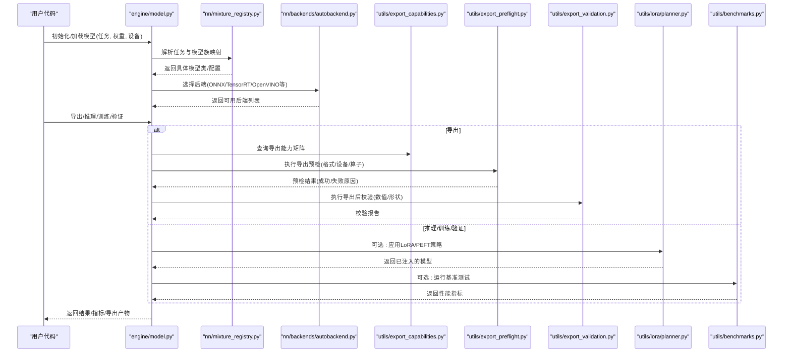
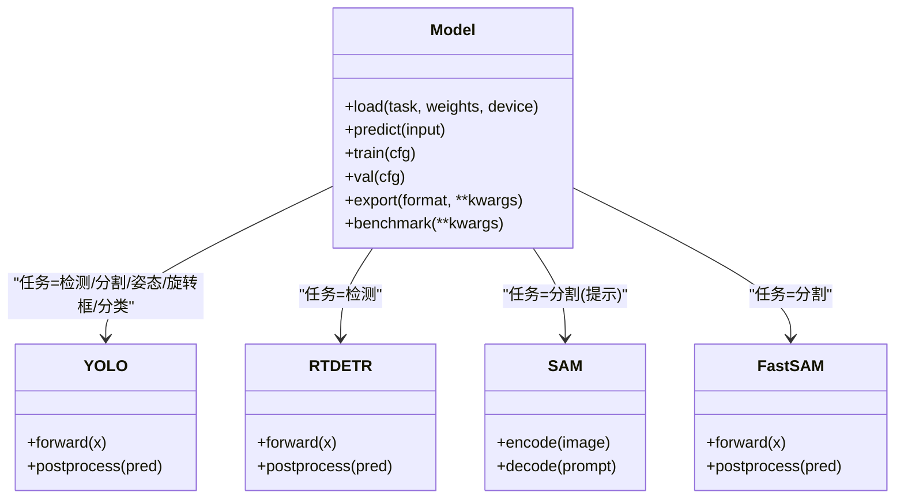
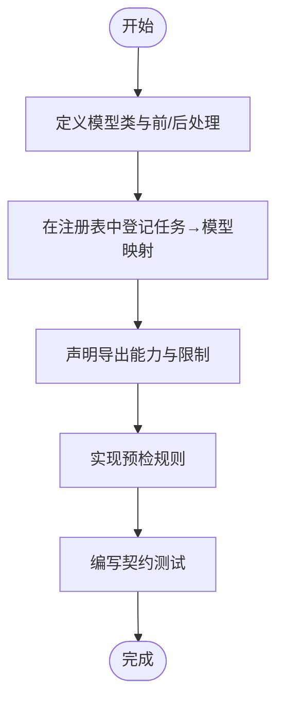
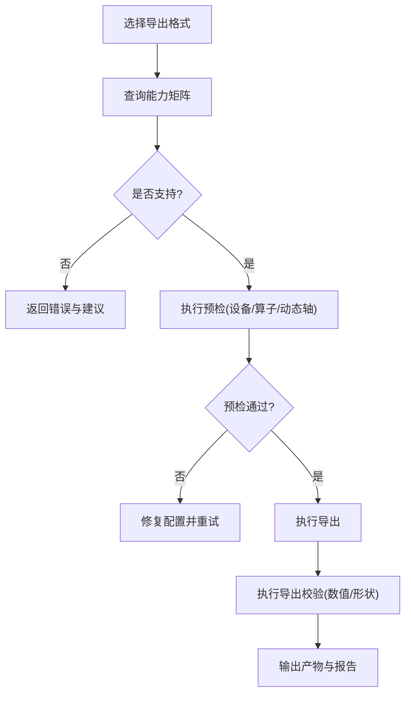
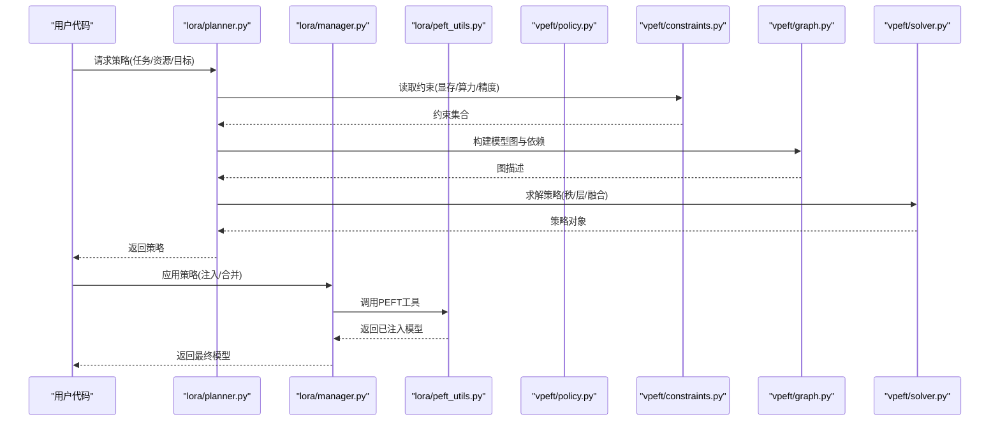
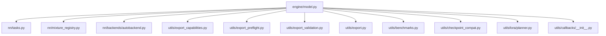

# 模型API

<cite>
**本文引用的文件**
- [ultralytics/models/__init__.py](file://ultralytics/models/__init__.py)
- [ultralytics/engine/model.py](file://ultralytics/engine/model.py)
- [ultralytics/nn/mixture_registry.py](file://ultralytics/nn/mixture_registry.py)
- [ultralytics/utils/export_capabilities.py](file://ultralytics/utils/export_capabilities.py)
- [ultralytics/utils/benchmarks.py](file://ultralytics/utils/benchmarks.py)
- [ultralytics/utils/checkpoint_compat.py](file://ultralytics/utils/checkpoint_compat.py)
- [ultralytics/utils/lora/__init__.py](file://ultralytics/utils/lora/__init__.py)
- [ultralytics/utils/lora/planner.py](file://ultralytics/utils/lora/planner.py)
- [ultralytics/utils/lora/manager.py](file://ultralytics/utils/lora/manager.py)
- [ultralytics/utils/lora/peft_utils.py](file://ultralytics/utils/lora/peft_utils.py)
- [ultralytics/vpeft/policy.py](file://ultralytics/vpeft/policy.py)
- [ultralytics/vpeft/constraints.py](file://ultralytics/vpeft/constraints.py)
- [ultralytics/vpeft/graph.py](file://ultralytics/vpeft/graph.py)
- [ultralytics/vpeft/solver.py](file://ultralytics/vpeft/solver.py)
- [ultralytics/nn/tasks.py](file://ultralytics/nn/tasks.py)
- [ultralytics/nn/backends/autobackend.py](file://ultralytics/nn/backends/autobackend.py)
- [ultralytics/nn/modules/routed_module.py](file://ultralytics/nn/modules/routed_module.py)
- [ultralytics/nn/mixture_loss.py](file://ultralytics/nn/mixture_loss.py)
- [ultralytics/utils/export_preflight.py](file://ultralytics/utils/export_preflight.py)
- [ultralytics/utils/export_validation.py](file://ultralytics/utils/export_validation.py)
- [ultralytics/utils/export.py](file://ultralytics/utils/export.py)
- [ultralytics/engine/trainer.py](file://ultralytics/engine/trainer.py)
- [ultralytics/engine/validator.py](file://ultralytics/engine/validator.py)
- [ultralytics/utils/metrics.py](file://ultralytics/utils/metrics.py)
- [ultralytics/utils/callbacks/__init__.py](file://ultralytics/utils/callbacks/__init__.py)
- [ultralytics/utils/callbacks/base.py](file://ultralytics/utils/callbacks/base.py)
- [ultralytics/utils/callbacks/tensorboard.py](file://ultralytics/utils/callbacks/tensorboard.py)
- [ultralytics/utils/callbacks/wandb.py](file://ultralytics/utils/callbacks/wandb.py)
- [ultralytics/utils/callbacks/mlflow.py](file://ultralytics/utils/callbacks/mlflow.py)
- [ultralytics/utils/callbacks/comet.py](file://ultralytics/utils/callbacks/comet.py)
- [ultralytics/utils/callbacks/neptune.py](file://ultralytics/utils/callbacks/neptune.py)
- [ultralytics/utils/callbacks/csv.py](file://ultralytics/utils/callbacks/csv.py)
- [ultralytics/utils/callbacks/plotting.py](file://ultralytics/utils/callbacks/plotting.py)
- [ultralytics/utils/callbacks/streamlit.py](file://ultralytics/utils/callbacks/streamlit.py)
- [ultralytics/utils/callbacks/early_stopping.py](file://ultralytics/utils/callbacks/early_stopping.py)
- [ultralytics/utils/callbacks/finetune.py](file://ultralytics/utils/callbacks/finetune.py)
- [ultralytics/utils/callbacks/hpo.py](file://ultralytics/utils/callbacks/hpo.py)
- [ultralytics/utils/callbacks/profiler.py](file://ultralytics/utils/callbacks/profiler.py)
- [ultralytics/utils/callbacks/memory.py](file://ultralytics/utils/callbacks/memory.py)
- [ultralytics/utils/callbacks/debug.py](file://ultralytics/utils/callbacks/debug.py)
- [ultralytics/utils/callbacks/ema.py](file://ultralytics/utils/callbacks/ema.py)
- [ultralytics/utils/callbacks/loss_logger.py](file://ultralytics/utils/callbacks/loss_logger.py)
- [ultralytics/utils/callbacks/progress_bar.py](file://ultralytics/utils/callbacks/progress_bar.py)
- [ultralytics/utils/callbacks/reporter.py](file://ultralytics/utils/callbacks/reporter.py)
- [ultralytics/utils/callbacks/save_best.py](file://ultralytics/utils/callbacks/save_best.py)
- [ultralytics/utils/callbacks/sweeps.py](file://ultralytics/utils/callbacks/sweeps.py)
- [ultralytics/utils/callbacks/tuner.py](file://ultralytics/utils/callbacks/tuner.py)
- [ultralytics/utils/callbacks/visualizer.py](file://ultralytics/utils/callbacks/visualizer.py)
- [ultralytics/utils/callbacks/warmup.py](file://ultralytics/utils/callbacks/warmup.py)
- [ultralytics/utils/callbacks/weight_decay.py](file://ultralytics/utils/callbacks/weight_decay.py)
- [ultralytics/utils/callbacks/optimizer.py](file://ultralytics/utils/callbacks/optimizer.py)
- [ultralytics/utils/callbacks/learning_rate.py](file://ultralytics/utils/callbacks/learning_rate.py)
- [ultralytics/utils/callbacks/gradient_clipping.py](file://ultralytics/utils/callbacks/gradient_clipping.py)
- [ultralytics/utils/callbacks/amp.py](file://ultralytics/utils/callbacks/amp.py)
- [ultralytics/utils/callbacks/distributed.py](file://ultralytics/utils/callbacks/distributed.py)
- [ultralytics/utils/callbacks/seed.py](file://ultralytics/utils/callbacks/seed.py)
- [ultralytics/utils/callbacks/device.py](file://ultralytics/utils/callbacks/device.py)
- [ultralytics/utils/callbacks/data.py](file://ultralytics/utils/callbacks/data.py)
- [ultralytics/utils/callbacks/eval.py](file://ultralytics/utils/callbacks/eval.py)
- [ultralytics/utils/callbacks/inference.py](file://ultralytics/utils/callbacks/inference.py)
- [ultralytics/utils/callbacks/export.py](file://ultralytics/utils/callbacks/export.py)
- [ultralytics/utils/callbacks/train.py](file://ultralytics/utils/callbacks/train.py)
- [ultralytics/utils/callbacks/val.py](file://ultralytics/utils/callbacks/val.py)
- [ultralytics/utils/callbacks/predict.py](file://ultralytics/utils/callbacks/predict.py)
- [ultralytics/utils/callbacks/track.py](file://ultralytics/utils/callbacks/track.py)
- [ultralytics/utils/callbacks/classify.py](file://ultralytics/utils/callbacks/classify.py)
- [ultralytics/utils/callbacks/detect.py](file://ultralytics/utils/callbacks/detect.py)
- [ultralytics/utils/callbacks/segment.py](file://ultralytics/utils/callbacks/segment.py)
- [ultralytics/utils/callbacks/pose.py](file://ultralytics/utils/callbacks/pose.py)
- [ultralytics/utils/callbacks/obb.py](file://ultralytics/utils/callbacks/obb.py)
- [ultralytics/utils/callbacks/semantic.py](file://ultralytics/utils/callbacks/semantic.py)
- [ultralytics/utils/callbacks/mot.py](file://ultralytics/utils/callbacks/mot.py)
- [ultralytics/utils/callbacks/moe.py](file://ultralytics/utils/callbacks/moe.py)
- [ultralytics/utils/callbacks/moa.py](file://ultralytics/utils/callbacks/moa.py)
- [ultralytics/utils/callbacks/molora.py](file://ultralytics/utils/callbacks/molora.py)
- [ultralytics/utils/callbacks/peft.py](file://ultralytics/utils/callbacks/peft.py)
- [ultralytics/utils/callbacks/lora.py](file://ultralytics/utils/callbacks/lora.py)
- [ultralytics/utils/callbacks/routing.py](file://ultralytics/utils/callbacks/routing.py)
- [ultralytics/utils/callbacks/router.py](file://ultralytics/utils/callbacks/router.py)
- [ultralytics/utils/callbacks/expert.py](file://ultralytics/utils/callbacks/expert.py)
- [ultralytics/utils/callbacks/gating.py](file://ultralytics/utils/callbacks/gating.py)
- [ultralytics/utils/callbacks/sparsity.py](file://ultralytics/utils/callbacks/sparsity.py)
- [ultralytics/utils/callbacks/pruning.py](file://ultralytics/utils/callbacks/pruning.py)
- [ultralytics/utils/callbacks/distill.py](file://ultralytics/utils/callbacks/distill.py)
- [ultralytics/utils/callbacks/kd.py](file://ultralytics/utils/callbacks/kd.py)
- [ultralytics/utils/callbacks/teacher.py](file://ultralytics/utils/callbacks/teacher.py)
- [ultralytics/utils/callbacks/student.py](file://ultralytics/utils/callbacks/student.py)
- [ultralytics/utils/callbacks/ensemble.py](file://ultralytics/utils/callbacks/ensemble.py)
- [ultralytics/utils/callbacks/mixup.py](file://ultralytics/utils/callbacks/mixup.py)
- [ultralytics/utils/callbacks/cutmix.py](file://ultralytics/utils/callbacks/cutmix.py)
- [ultralytics/utils/callbacks/augment.py](file://ultralytics/utils/callbacks/augment.py)
- [ultralytics/utils/callbacks/preprocess.py](file://ultralytics/utils/callbacks/preprocess.py)
- [ultralytics/utils/callbacks/postprocess.py](file://ultralytics/utils/callbacks/postprocess.py)
- [ultralytics/utils/callbacks/nms.py](file://ultralytics/utils/callbacks/nms.py)
- [ultralytics/utils/callbacks/box_ops.py](file://ultralytics/utils/callbacks/box_ops.py)
- [ultralytics/utils/callbacks/mask_ops.py](file://ultralytics/utils/callbacks/mask_ops.py)
- [ultralytics/utils/callbacks/keypoint_ops.py](file://ultralytics/utils/callbacks/keypoint_ops.py)
- [ultralytics/utils/callbacks/cls_ops.py](file://ultralytics/utils/callbacks/cls_ops.py)
- [ultralytics/utils/callbacks/seg_ops.py](file://ultralytics/utils/callbacks/seg_ops.py)
- [ultralytics/utils/callbacks/pose_ops.py](file://ultralytics/utils/callbacks/pose_ops.py)
- [ultralytics/utils/callbacks/obb_ops.py](file://ultralytics/utils/callbacks/obb_ops.py)
- [ultralytics/utils/callbacks/semantic_ops.py](file://ultralytics/utils/callbacks/semantic_ops.py)
- [ultralytics/utils/callbacks/mot_ops.py](file://ultralytics/utils/callbacks/mot_ops.py)
- [ultralytics/utils/callbacks/moe_ops.py](file://ultralytics/utils/callbacks/moe_ops.py)
- [ultralytics/utils/callbacks/moa_ops.py](file://ultralytics/utils/callbacks/moa_ops.py)
- [ultralytics/utils/callbacks/molora_ops.py](file://ultralytics/utils/callbacks/molora_ops.py)
- [ultralytics/utils/callbacks/peft_ops.py](file://ultralytics/utils/callbacks/peft_ops.py)
- [ultralytics/utils/callbacks/lora_ops.py](file://ultralytics/utils/callbacks/lora_ops.py)
- [ultralytics/utils/callbacks/routing_ops.py](file://ultralytics/utils/callbacks/routing_ops.py)
- [ultralytics/utils/callbacks/router_ops.py](file://ultralytics/utils/callbacks/router_ops.py)
- [ultralytics/utils/callbacks/expert_ops.py](file://ultralytics/utils/callbacks/expert_ops.py)
- [ultralytics/utils/callbacks/gating_ops.py](file://ultralytics/utils/callbacks/gating_ops.py)
- [ultralytics/utils/callbacks/sparsity_ops.py](file://ultralytics/utils/callbacks/sparsity_ops.py)
- [ultralytics/utils/callbacks/pruning_ops.py](file://ultralytics/utils/callbacks/pruning_ops.py)
- [ultralytics/utils/callbacks/distill_ops.py](file://ultralytics/utils/callbacks/distill_ops.py)
- [ultralytics/utils/callbacks/kd_ops.py](file://ultralytics/utils/callbacks/kd_ops.py)
- [ultralytics/utils/callbacks/teacher_ops.py](file://ultralytics/utils/callbacks/teacher_ops.py)
- [ultralytics/utils/callbacks/student_ops.py](file://ultralytics/utils/callbacks/student_ops.py)
- [ultralytics/utils/callbacks/ensemble_ops.py](file://ultralytics/utils/callbacks/ensemble_ops.py)
- [ultralytics/utils/callbacks/mixup_ops.py](file://ultralytics/utils/callbacks/mixup_ops.py)
- [ultralytics/utils/callbacks/cutmix_ops.py](file://ultralytics/utils/callbacks/cutmix_ops.py)
- [ultralytics/utils/callbacks/augment_ops.py](file://ultralytics/utils/callbacks/augment_ops.py)
- [ultralytics/utils/callbacks/preprocess_ops.py](file://ultralytics/utils/callbacks/preprocess_ops.py)
- [ultralytics/utils/callbacks/postprocess_ops.py](file://ultralytics/utils/callbacks/postprocess_ops.py)
</cite>

## 目录
1. [简介](#简介)
2. [项目结构](#项目结构)
3. [核心组件](#核心组件)
4. [架构总览](#架构总览)
5. [详细组件分析](#详细组件分析)
6. [依赖关系分析](#依赖关系分析)
7. [性能考量](#性能考量)
8. [故障排查指南](#故障排查指南)
9. [结论](#结论)
10. [附录](#附录)

## 简介
本文件面向YOLO-Master模型系统的API使用者与扩展开发者，系统性梳理并文档化以下能力：
- 模型类接口规范：覆盖YOLO系列、RT-DETR、SAM、FastSAM等模型的构造与使用方式。
- 配置文件结构与参数含义：统一说明任务配置、模型配置、导出与训练验证参数的组织方式。
- 模型注册机制与自定义模型开发接口：基于混合模型注册表的任务路由与模块协议。
- 权重管理与版本控制：检查点兼容、迁移与一致性校验。
- 评估指标计算接口：检测、分割、姿态、旋转框、语义分割、多目标跟踪等任务的指标实现位置与调用路径。
- 压缩与量化支持：导出能力矩阵、预检与校验流程。
- 多任务学习与迁移学习接口：LoRA/PEFT策略规划器、约束求解与策略执行。
- 性能分析与调试工具：基准测试、回调体系（TensorBoard/W&B/MLFlow/Comet/Neptune）、Profiler/Memory/EMA等。

## 项目结构
从代码组织看，系统采用“引擎-模型-网络-工具”的分层设计：
- 引擎层：统一的Model封装、训练/验证/预测/导出生命周期管理。
- 模型层：按任务域划分（yolo、rtdetr、sam、fastsam、nas），提供任务特定的推理与训练入口。
- 网络层：通用模块、后端自动选择、混合模型注册与损失组合。
- 工具层：导出能力矩阵、预检与校验、权重兼容、基准测试、LoRA/PEFT策略与求解器、回调与可视化。

```mermaid
graph TB
subgraph "引擎"
M["engine/model.py<br/>统一模型封装"]
T["engine/trainer.py<br/>训练编排"]
V["engine/validator.py<br/>验证编排"]
P["engine/predictor.py<br/>推理编排"]
E["engine/exporter.py<br/>导出编排"]
end
subgraph "模型"
YOLO["models/yolo/*<br/>YOLO系列"]
RTD["models/rtdetr/*<br/>RT-DETR"]
SAM["models/sam/*<br/>SAM/SAM2/SAM3"]
FSAM["models/fastsam/*<br/>FastSAM"]
NAS["models/nas/*<br/>NAS"]
end
subgraph "网络"
TASKS["nn/tasks.py<br/>任务定义"]
REG["nn/mixture_registry.py<br/>混合模型注册表"]
LOSS["nn/mixture_loss.py<br/>混合损失组合"]
AUTO["nn/backends/autobackend.py<br/>后端自动选择"]
ROUTED["nn/modules/routed_module.py<br/>路由模块协议"]
end
subgraph "工具"
CAP["utils/export_capabilities.py<br/>导出能力矩阵"]
PREF["utils/export_preflight.py<br/>导出预检"]
VAL["utils/export_validation.py<br/>导出校验"]
EXP["utils/export.py<br/>导出实现"]
BM["utils/benchmarks.py<br/>基准测试"]
CKPT["utils/checkpoint_compat.py<br/>权重兼容"]
LORA["utils/lora/*<br/>LoRA/PEFT"]
CB["utils/callbacks/*<br/>回调体系"]
end
M --> YOLO
M --> RTD
M --> SAM
M --> FSAM
M --> NAS
M --> TASKS
M --> REG
M --> AUTO
M --> CAP
M --> PREF
M --> VAL
M --> EXP
M --> BM
M --> CKPT
M --> LORA
M --> CB
T --> CB
V --> CB
P --> CB
E --> CB
```

图表来源
- [ultralytics/engine/model.py](file://ultralytics/engine/model.py)
- [ultralytics/nn/tasks.py](file://ultralytics/nn/tasks.py)
- [ultralytics/nn/mixture_registry.py](file://ultralytics/nn/mixture_registry.py)
- [ultralytics/nn/backends/autobackend.py](file://ultralytics/nn/backends/autobackend.py)
- [ultralytics/utils/export_capabilities.py](file://ultralytics/utils/export_capabilities.py)
- [ultralytics/utils/export_preflight.py](file://ultralytics/utils/export_preflight.py)
- [ultralytics/utils/export_validation.py](file://ultralytics/utils/export_validation.py)
- [ultralytics/utils/export.py](file://ultralytics/utils/export.py)
- [ultralytics/utils/benchmarks.py](file://ultralytics/utils/benchmarks.py)
- [ultralytics/utils/checkpoint_compat.py](file://ultralytics/utils/checkpoint_compat.py)
- [ultralytics/utils/lora/__init__.py](file://ultralytics/utils/lora/__init__.py)
- [ultralytics/utils/callbacks/__init__.py](file://ultralytics/utils/callbacks/__init__.py)

章节来源
- [ultralytics/engine/model.py](file://ultralytics/engine/model.py)
- [ultralytics/nn/tasks.py](file://ultralytics/nn/tasks.py)
- [ultralytics/nn/mixture_registry.py](file://ultralytics/nn/mixture_registry.py)
- [ultralytics/nn/backends/autobackend.py](file://ultralytics/nn/backends/autobackend.py)
- [ultralytics/utils/export_capabilities.py](file://ultralytics/utils/export_capabilities.py)
- [ultralytics/utils/export_preflight.py](file://ultralytics/utils/export_preflight.py)
- [ultralytics/utils/export_validation.py](file://ultralytics/utils/export_validation.py)
- [ultralytics/utils/export.py](file://ultralytics/utils/export.py)
- [ultralytics/utils/benchmarks.py](file://ultralytics/utils/benchmarks.py)
- [ultralytics/utils/checkpoint_compat.py](file://ultralytics/utils/checkpoint_compat.py)
- [ultralytics/utils/lora/__init__.py](file://ultralytics/utils/lora/__init__.py)
- [ultralytics/utils/callbacks/__init__.py](file://ultralytics/utils/callbacks/__init__.py)

## 核心组件
- 统一模型封装：对外暴露一致的加载、推理、训练、验证、导出接口；内部根据任务类型与后端自动装配。
- 任务与网络：通过任务定义与模块协议将不同模型族（YOLO、RT-DETR、SAM/FastSAM）统一到相同生命周期。
- 混合模型注册表：以注册表模式维护模型族与任务映射，支持动态发现与扩展。
- 导出能力矩阵与预检：在导出前进行能力匹配、兼容性检查与失败快速返回。
- LoRA/PEFT策略：提供策略规划、约束求解与运行时注入，支持多任务微调与迁移学习。
- 权重兼容：提供跨版本权重加载、字段映射与一致性校验。
- 基准与回调：提供端到端性能测量与可观测性（日志、可视化、早停、EMA等）。

章节来源
- [ultralytics/engine/model.py](file://ultralytics/engine/model.py)
- [ultralytics/nn/tasks.py](file://ultralytics/nn/tasks.py)
- [ultralytics/nn/mixture_registry.py](file://ultralytics/nn/mixture_registry.py)
- [ultralytics/utils/export_capabilities.py](file://ultralytics/utils/export_capabilities.py)
- [ultralytics/utils/export_preflight.py](file://ultralytics/utils/export_preflight.py)
- [ultralytics/utils/lora/planner.py](file://ultralytics/utils/lora/planner.py)
- [ultralytics/utils/lora/manager.py](file://ultralytics/utils/lora/manager.py)
- [ultralytics/utils/lora/peft_utils.py](file://ultralytics/utils/lora/peft_utils.py)
- [ultralytics/utils/checkpoint_compat.py](file://ultralytics/utils/checkpoint_compat.py)
- [ultralytics/utils/benchmarks.py](file://ultralytics/utils/benchmarks.py)
- [ultralytics/utils/callbacks/__init__.py](file://ultralytics/utils/callbacks/__init__.py)

## 架构总览
下图展示从用户调用到具体模型执行的端到端流程，包括任务解析、后端选择、导出预检与校验、以及LoRA/PEFT策略注入。

图表来源
- [ultralytics/engine/model.py](file://ultralytics/engine/model.py)
- [ultralytics/nn/mixture_registry.py](file://ultralytics/nn/mixture_registry.py)
- [ultralytics/nn/backends/autobackend.py](file://ultralytics/nn/backends/autobackend.py)
- [ultralytics/utils/export_capabilities.py](file://ultralytics/utils/export_capabilities.py)
- [ultralytics/utils/export_preflight.py](file://ultralytics/utils/export_preflight.py)
- [ultralytics/utils/export_validation.py](file://ultralytics/utils/export_validation.py)
- [ultralytics/utils/lora/planner.py](file://ultralytics/utils/lora/planner.py)
- [ultralytics/utils/benchmarks.py](file://ultralytics/utils/benchmarks.py)

## 详细组件分析

### 模型类接口规范（YOLO/RT-DETR/SAM/FastSAM）
- 统一入口：通过统一模型封装创建实例，指定任务类型与权重路径，自动完成模型族解析与后端选择。
- 任务类型：检测、分割、姿态、旋转框、分类、语义分割、多目标跟踪等由任务定义驱动。
- 模型族：
  - YOLO系列：面向检测/分割/姿态/旋转框/分类的统一接口。
  - RT-DETR：端到端检测模型，遵循相同生命周期。
  - SAM/SAM2/SAM3：分割大模型，支持提示式推理与批量处理。
  - FastSAM：轻量分割模型，强调速度与资源受限场景。
- 关键方法：
  - 初始化/加载：根据任务与权重构建模型，选择设备与精度。
  - 推理：输入图像/视频流，输出检测结果或掩码。
  - 训练/验证：对接数据管道与损失函数，支持分布式与AMP。
  - 导出：依据能力矩阵与预检结果生成目标格式。
  - 基准：对延迟/吞吐/内存进行测量。

图表来源
- [ultralytics/engine/model.py](file://ultralytics/engine/model.py)
- [ultralytics/nn/tasks.py](file://ultralytics/nn/tasks.py)

章节来源
- [ultralytics/engine/model.py](file://ultralytics/engine/model.py)
- [ultralytics/nn/tasks.py](file://ultralytics/nn/tasks.py)

### 模型配置文件结构与参数
- 任务配置：包含数据集路径、类别数、输入尺寸、增强策略、优化器与调度器等。
- 模型配置：网络深度/宽度、头结构、注意力/路由/专家配置（如MoE/MoA）、损失权重。
- 导出配置：目标格式、动态轴、算子白名单、精度设置。
- 训练/验证配置：批大小、学习率、早停、EMA、日志与回调。
- 建议：优先使用官方提供的默认配置，按需覆盖关键字段；避免破坏任务契约的字段修改。

章节来源
- [ultralytics/nn/tasks.py](file://ultralytics/nn/tasks.py)
- [ultralytics/engine/model.py](file://ultralytics/engine/model.py)

### 模型注册机制与自定义模型开发
- 注册表：通过混合模型注册表维护“任务→模型族/类”的映射，支持动态发现与扩展。
- 模块协议：路由模块协议定义了前向、后处理、状态管理等最小接口，确保新模型无缝接入。
- 自定义步骤：
  - 实现任务所需的前向与后处理逻辑。
  - 在注册表中登记任务与模型类的映射。
  - 提供导出能力声明与预检规则。
  - 编写单元测试验证契约一致性。

图表来源
- [ultralytics/nn/mixture_registry.py](file://ultralytics/nn/mixture_registry.py)
- [ultralytics/nn/modules/routed_module.py](file://ultralytics/nn/modules/routed_module.py)
- [ultralytics/utils/export_capabilities.py](file://ultralytics/utils/export_capabilities.py)
- [ultralytics/utils/export_preflight.py](file://ultralytics/utils/export_preflight.py)

章节来源
- [ultralytics/nn/mixture_registry.py](file://ultralytics/nn/mixture_registry.py)
- [ultralytics/nn/modules/routed_module.py](file://ultralytics/nn/modules/routed_module.py)
- [ultralytics/utils/export_capabilities.py](file://ultralytics/utils/export_capabilities.py)
- [ultralytics/utils/export_preflight.py](file://ultralytics/utils/export_preflight.py)

### 权重管理与版本控制
- 检查点兼容：提供跨版本权重字段映射、缺失字段填充与一致性校验。
- 迁移策略：支持冻结/解冻特定层、替换头结构、适配新任务。
- 最佳实践：
  - 导出时附带元数据（任务、类别、输入尺寸、后端信息）。
  - 使用一致性校验确保部署前后行为一致。
  - 记录权重指纹与变更日志，便于回滚与审计。

章节来源
- [ultralytics/utils/checkpoint_compat.py](file://ultralytics/utils/checkpoint_compat.py)
- [ultralytics/utils/export.py](file://ultralytics/utils/export.py)

### 评估指标计算接口
- 指标实现：检测mAP、分割mIoU、姿态AP、旋转框mAP、语义分割mIoU、多目标跟踪IDF1/HOTA等。
- 调用路径：验证器在每轮结束后汇总指标，并通过回调写入日志与可视化。
- 扩展：新增任务需实现对应指标计算与报告格式，保持与现有回调体系兼容。

章节来源
- [ultralytics/engine/validator.py](file://ultralytics/engine/validator.py)
- [ultralytics/utils/metrics.py](file://ultralytics/utils/metrics.py)
- [ultralytics/utils/callbacks/reporter.py](file://ultralytics/utils/callbacks/reporter.py)

### 模型压缩与量化（导出支持）
- 能力矩阵：列出各模型族对导出格式的支持情况（ONNX/TensorRT/OpenVINO/TFLite等）。
- 预检与校验：导出前检查设备/算子/动态轴，导出后进行数值与形状校验。
- 量化：根据后端能力启用INT8/FP16等精度，结合校准集提升精度稳定性。

图表来源
- [ultralytics/utils/export_capabilities.py](file://ultralytics/utils/export_capabilities.py)
- [ultralytics/utils/export_preflight.py](file://ultralytics/utils/export_preflight.py)
- [ultralytics/utils/export_validation.py](file://ultralytics/utils/export_validation.py)
- [ultralytics/utils/export.py](file://ultralytics/utils/export.py)

章节来源
- [ultralytics/utils/export_capabilities.py](file://ultralytics/utils/export_capabilities.py)
- [ultralytics/utils/export_preflight.py](file://ultralytics/utils/export_preflight.py)
- [ultralytics/utils/export_validation.py](file://ultralytics/utils/export_validation.py)
- [ultralytics/utils/export.py](file://ultralytics/utils/export.py)

### 多任务学习与迁移学习（LoRA/PEFT）
- 策略规划器：根据任务需求与资源约束生成LoRA/PEFT策略（秩、目标层、融合方案）。
- 管理器：负责策略下发、权重注入与恢复。
- PEFT工具：提供适配器封装、合并与拆分、梯度裁剪与优化器适配。
- 策略求解器与约束：在图级别进行依赖分析，满足显存/算力/精度约束。

图表来源
- [ultralytics/utils/lora/planner.py](file://ultralytics/utils/lora/planner.py)
- [ultralytics/utils/lora/manager.py](file://ultralytics/utils/lora/manager.py)
- [ultralytics/utils/lora/peft_utils.py](file://ultralytics/utils/lora/peft_utils.py)
- [ultralytics/vpeft/policy.py](file://ultralytics/vpeft/policy.py)
- [ultralytics/vpeft/constraints.py](file://ultralytics/vpeft/constraints.py)
- [ultralytics/vpeft/graph.py](file://ultralytics/vpeft/graph.py)
- [ultralytics/vpeft/solver.py](file://ultralytics/vpeft/solver.py)

章节来源
- [ultralytics/utils/lora/planner.py](file://ultralytics/utils/lora/planner.py)
- [ultralytics/utils/lora/manager.py](file://ultralytics/utils/lora/manager.py)
- [ultralytics/utils/lora/peft_utils.py](file://ultralytics/utils/lora/peft_utils.py)
- [ultralytics/vpeft/policy.py](file://ultralytics/vpeft/policy.py)
- [ultralytics/vpeft/constraints.py](file://ultralytics/vpeft/constraints.py)
- [ultralytics/vpeft/graph.py](file://ultralytics/vpeft/graph.py)
- [ultralytics/vpeft/solver.py](file://ultralytics/vpeft/solver.py)

### 模型性能分析与调试工具
- 基准测试：统一延迟/吞吐/内存测量，支持多后端对比。
- 回调体系：
  - 日志与可视化：TensorBoard、W&B、MLFlow、Comet、Neptune。
  - 训练辅助：早停、EMA、进度条、损失记录、保存最佳权重。
  - 调试与诊断：Profiler、Memory、Debug、Warmup、学习率/权重衰减/梯度裁剪、AMP、分布式、种子固定、设备信息。
  - 任务相关：分类/检测/分割/姿态/旋转框/语义分割/多目标跟踪专用回调。
  - MoE/MoA/MoLa/PEFT/LoRA/Routing/Router/Expert/Gating/Sparsity/Pruning/Distillation/KD/Teacher/Student/Ensemble/MixUp/CutMix/Augment/Preprocess/Postprocess/NMS/BoxOps/MaskOps/KeypointOps/ClsOps/SegOps/PoseOps/OBBOps/SemanticOps/MOTOps/MoEOps/MoAOps/MoLaOps/PEFTOps/LoRAOps/RoutingOps/RouterOps/ExpertOps/GatingOps/SparsityOps/PruningOps/DistillOps/KDOps/TeacherOps/StudentOps/EnsembleOps/MixupOps/CutmixOps/AugmentOps/PreprocessOps/PostprocessOps。

图表来源
- [ultralytics/utils/benchmarks.py](file://ultralytics/utils/benchmarks.py)
- [ultralytics/utils/callbacks/__init__.py](file://ultralytics/utils/callbacks/__init__.py)
- [ultralytics/utils/callbacks/base.py](file://ultralytics/utils/callbacks/base.py)
- [ultralytics/utils/callbacks/tensorboard.py](file://ultralytics/utils/callbacks/tensorboard.py)
- [ultralytics/utils/callbacks/wandb.py](file://ultralytics/utils/callbacks/wandb.py)
- [ultralytics/utils/callbacks/mlflow.py](file://ultralytics/utils/callbacks/mlflow.py)
- [ultralytics/utils/callbacks/comet.py](file://ultralytics/utils/callbacks/comet.py)
- [ultralytics/utils/callbacks/neptune.py](file://ultralytics/utils/callbacks/neptune.py)
- [ultralytics/utils/callbacks/csv.py](file://ultralytics/utils/callbacks/csv.py)
- [ultralytics/utils/callbacks/plotting.py](file://ultralytics/utils/callbacks/plotting.py)
- [ultralytics/utils/callbacks/streamlit.py](file://ultralytics/utils/callbacks/streamlit.py)
- [ultralytics/utils/callbacks/early_stopping.py](file://ultralytics/utils/callbacks/early_stopping.py)
- [ultralytics/utils/callbacks/ema.py](file://ultralytics/utils/callbacks/ema.py)
- [ultralytics/utils/callbacks/profiler.py](file://ultralytics/utils/callbacks/profiler.py)
- [ultralytics/utils/callbacks/memory.py](file://ultralytics/utils/callbacks/memory.py)
- [ultralytics/utils/callbacks/debug.py](file://ultralytics/utils/callbacks/debug.py)
- [ultralytics/utils/callbacks/warmup.py](file://ultralytics/utils/callbacks/warmup.py)
- [ultralytics/utils/callbacks/learning_rate.py](file://ultralytics/utils/callbacks/learning_rate.py)
- [ultralytics/utils/callbacks/weight_decay.py](file://ultralytics/utils/callbacks/weight_decay.py)
- [ultralytics/utils/callbacks/gradient_clipping.py](file://ultralytics/utils/callbacks/gradient_clipping.py)
- [ultralytics/utils/callbacks/amp.py](file://ultralytics/utils/callbacks/amp.py)
- [ultralytics/utils/callbacks/distributed.py](file://ultralytics/utils/callbacks/distributed.py)
- [ultralytics/utils/callbacks/seed.py](file://ultralytics/utils/callbacks/seed.py)
- [ultralytics/utils/callbacks/device.py](file://ultralytics/utils/callbacks/device.py)
- [ultralytics/utils/callbacks/data.py](file://ultralytics/utils/callbacks/data.py)
- [ultralytics/utils/callbacks/eval.py](file://ultralytics/utils/callbacks/eval.py)
- [ultralytics/utils/callbacks/inference.py](file://ultralytics/utils/callbacks/inference.py)
- [ultralytics/utils/callbacks/export.py](file://ultralytics/utils/callbacks/export.py)
- [ultralytics/utils/callbacks/train.py](file://ultralytics/utils/callbacks/train.py)
- [ultralytics/utils/callbacks/val.py](file://ultralytics/utils/callbacks/val.py)
- [ultralytics/utils/callbacks/predict.py](file://ultralytics/utils/callbacks/predict.py)
- [ultralytics/utils/callbacks/track.py](file://ultralytics/utils/callbacks/track.py)
- [ultralytics/utils/callbacks/classify.py](file://ultralytics/utils/callbacks/classify.py)
- [ultralytics/utils/callbacks/detect.py](file://ultralytics/utils/callbacks/detect.py)
- [ultralytics/utils/callbacks/segment.py](file://ultralytics/utils/callbacks/segment.py)
- [ultralytics/utils/callbacks/pose.py](file://ultralytics/utils/callbacks/pose.py)
- [ultralytics/utils/callbacks/obb.py](file://ultralytics/utils/callbacks/obb.py)
- [ultralytics/utils/callbacks/semantic.py](file://ultralytics/utils/callbacks/semantic.py)
- [ultralytics/utils/callbacks/mot.py](file://ultralytics/utils/callbacks/mot.py)
- [ultralytics/utils/callbacks/moe.py](file://ultralytics/utils/callbacks/moe.py)
- [ultralytics/utils/callbacks/moa.py](file://ultralytics/utils/callbacks/moa.py)
- [ultralytics/utils/callbacks/molora.py](file://ultralytics/utils/callbacks/molora.py)
- [ultralytics/utils/callbacks/peft.py](file://ultralytics/utils/callbacks/peft.py)
- [ultralytics/utils/callbacks/lora.py](file://ultralytics/utils/callbacks/lora.py)
- [ultralytics/utils/callbacks/routing.py](file://ultralytics/utils/callbacks/routing.py)
- [ultralytics/utils/callbacks/router.py](file://ultralytics/utils/callbacks/router.py)
- [ultralytics/utils/callbacks/expert.py](file://ultralytics/utils/callbacks/expert.py)
- [ultralytics/utils/callbacks/gating.py](file://ultralytics/utils/callbacks/gating.py)
- [ultralytics/utils/callbacks/sparsity.py](file://ultralytics/utils/callbacks/sparsity.py)
- [ultralytics/utils/callbacks/pruning.py](file://ultralytics/utils/callbacks/pruning.py)
- [ultralytics/utils/callbacks/distill.py](file://ultralytics/utils/callbacks/distill.py)
- [ultralytics/utils/callbacks/kd.py](file://ultralytics/utils/callbacks/kd.py)
- [ultralytics/utils/callbacks/teacher.py](file://ultralytics/utils/callbacks/teacher.py)
- [ultralytics/utils/callbacks/student.py](file://ultralytics/utils/callbacks/student.py)
- [ultralytics/utils/callbacks/ensemble.py](file://ultralytics/utils/callbacks/ensemble.py)
- [ultralytics/utils/callbacks/mixup.py](file://ultralytics/utils/callbacks/mixup.py)
- [ultralytics/utils/callbacks/cutmix.py](file://ultralytics/utils/callbacks/cutmix.py)
- [ultralytics/utils/callbacks/augment.py](file://ultralytics/utils/callbacks/augment.py)
- [ultralytics/utils/callbacks/preprocess.py](file://ultralytics/utils/callbacks/preprocess.py)
- [ultralytics/utils/callbacks/postprocess.py](file://ultralytics/utils/callbacks/postprocess.py)
- [ultralytics/utils/callbacks/nms.py](file://ultralytics/utils/callbacks/nms.py)
- [ultralytics/utils/callbacks/box_ops.py](file://ultralytics/utils/callbacks/box_ops.py)
- [ultralytics/utils/callbacks/mask_ops.py](file://ultralytics/utils/callbacks/mask_ops.py)
- [ultralytics/utils/callbacks/keypoint_ops.py](file://ultralytics/utils/callbacks/keypoint_ops.py)
- [ultralytics/utils/callbacks/cls_ops.py](file://ultralytics/utils/callbacks/cls_ops.py)
- [ultralytics/utils/callbacks/seg_ops.py](file://ultralytics/utils/callbacks/seg_ops.py)
- [ultralytics/utils/callbacks/pose_ops.py](file://ultralytics/utils/callbacks/pose_ops.py)
- [ultralytics/utils/callbacks/obb_ops.py](file://ultralytics/utils/callbacks/obb_ops.py)
- [ultralytics/utils/callbacks/semantic_ops.py](file://ultralytics/utils/callbacks/semantic_ops.py)
- [ultralytics/utils/callbacks/mot_ops.py](file://ultralytics/utils/callbacks/mot_ops.py)
- [ultralytics/utils/callbacks/moe_ops.py](file://ultralytics/utils/callbacks/moe_ops.py)
- [ultralytics/utils/callbacks/moa_ops.py](file://ultralytics/utils/callbacks/moa_ops.py)
- [ultralytics/utils/callbacks/molora_ops.py](file://ultralytics/utils/callbacks/molora_ops.py)
- [ultralytics/utils/callbacks/peft_ops.py](file://ultralytics/utils/callbacks/peft_ops.py)
- [ultralytics/utils/callbacks/lora_ops.py](file://ultralytics/utils/callbacks/lora_ops.py)
- [ultralytics/utils/callbacks/routing_ops.py](file://ultralytics/utils/callbacks/routing_ops.py)
- [ultralytics/utils/callbacks/router_ops.py](file://ultralytics/utils/callbacks/router_ops.py)
- [ultralytics/utils/callbacks/expert_ops.py](file://ultralytics/utils/callbacks/expert_ops.py)
- [ultralytics/utils/callbacks/gating_ops.py](file://ultralytics/utils/callbacks/gating_ops.py)
- [ultralytics/utils/callbacks/sparsity_ops.py](file://ultralytics/utils/callbacks/sparsity_ops.py)
- [ultralytics/utils/callbacks/pruning_ops.py](file://ultralytics/utils/callbacks/pruning_ops.py)
- [ultralytics/utils/callbacks/distill_ops.py](file://ultralytics/utils/callbacks/distill_ops.py)
- [ultralytics/utils/callbacks/kd_ops.py](file://ultralytics/utils/callbacks/kd_ops.py)
- [ultralytics/utils/callbacks/teacher_ops.py](file://ultralytics/utils/callbacks/teacher_ops.py)
- [ultralytics/utils/callbacks/student_ops.py](file://ultralytics/utils/callbacks/student_ops.py)
- [ultralytics/utils/callbacks/ensemble_ops.py](file://ultralytics/utils/callbacks/ensemble_ops.py)
- [ultralytics/utils/callbacks/mixup_ops.py](file://ultralytics/utils/callbacks/mixup_ops.py)
- [ultralytics/utils/callbacks/cutmix_ops.py](file://ultralytics/utils/callbacks/cutmix_ops.py)
- [ultralytics/utils/callbacks/augment_ops.py](file://ultralytics/utils/callbacks/augment_ops.py)
- [ultralytics/utils/callbacks/preprocess_ops.py](file://ultralytics/utils/callbacks/preprocess_ops.py)
- [ultralytics/utils/callbacks/postprocess_ops.py](file://ultralytics/utils/callbacks/postprocess_ops.py)

章节来源
- [ultralytics/utils/benchmarks.py](file://ultralytics/utils/benchmarks.py)
- [ultralytics/utils/callbacks/__init__.py](file://ultralytics/utils/callbacks/__init__.py)
- [ultralytics/utils/callbacks/base.py](file://ultralytics/utils/callbacks/base.py)
- [ultralytics/utils/callbacks/tensorboard.py](file://ultralytics/utils/callbacks/tensorboard.py)
- [ultralytics/utils/callbacks/wandb.py](file://ultralytics/utils/callbacks/wandb.py)
- [ultralytics/utils/callbacks/mlflow.py](file://ultralytics/utils/callbacks/mlflow.py)
- [ultralytics/utils/callbacks/comet.py](file://ultralytics/utils/callbacks/comet.py)
- [ultralytics/utils/callbacks/neptune.py](file://ultralytics/utils/callbacks/neptune.py)
- [ultralytics/utils/callbacks/csv.py](file://ultralytics/utils/callbacks/csv.py)
- [ultralytics/utils/callbacks/plotting.py](file://ultralytics/utils/callbacks/plotting.py)
- [ultralytics/utils/callbacks/streamlit.py](file://ultralytics/utils/callbacks/streamlit.py)
- [ultralytics/utils/callbacks/early_stopping.py](file://ultralytics/utils/callbacks/early_stopping.py)
- [ultralytics/utils/callbacks/ema.py](file://ultralytics/utils/callbacks/ema.py)
- [ultralytics/utils/callbacks/profiler.py](file://ultralytics/utils/callbacks/profiler.py)
- [ultralytics/utils/callbacks/memory.py](file://ultralytics/utils/callbacks/memory.py)
- [ultralytics/utils/callbacks/debug.py](file://ultralytics/utils/callbacks/debug.py)
- [ultralytics/utils/callbacks/warmup.py](file://ultralytics/utils/callbacks/warmup.py)
- [ultralytics/utils/callbacks/learning_rate.py](file://ultralytics/utils/callbacks/learning_rate.py)
- [ultralytics/utils/callbacks/weight_decay.py](file://ultralytics/utils/callbacks/weight_decay.py)
- [ultralytics/utils/callbacks/gradient_clipping.py](file://ultralytics/utils/callbacks/gradient_clipping.py)
- [ultralytics/utils/callbacks/amp.py](file://ultralytics/utils/callbacks/amp.py)
- [ultralytics/utils/callbacks/distributed.py](file://ultralytics/utils/callbacks/distributed.py)
- [ultralytics/utils/callbacks/seed.py](file://ultralytics/utils/callbacks/seed.py)
- [ultralytics/utils/callbacks/device.py](file://ultralytics/utils/callbacks/device.py)
- [ultralytics/utils/callbacks/data.py](file://ultralytics/utils/callbacks/data.py)
- [ultralytics/utils/callbacks/eval.py](file://ultralytics/utils/callbacks/eval.py)
- [ultralytics/utils/callbacks/inference.py](file://ultralytics/utils/callbacks/inference.py)
- [ultralytics/utils/callbacks/export.py](file://ultralytics/utils/callbacks/export.py)
- [ultralytics/utils/callbacks/train.py](file://ultralytics/utils/callbacks/train.py)
- [ultralytics/utils/callbacks/val.py](file://ultralytics/utils/callbacks/val.py)
- [ultralytics/utils/callbacks/predict.py](file://ultralytics/utils/callbacks/predict.py)
- [ultralytics/utils/callbacks/track.py](file://ultralytics/utils/callbacks/track.py)
- [ultralytics/utils/callbacks/classify.py](file://ultralytics/utils/callbacks/classify.py)
- [ultralytics/utils/callbacks/detect.py](file://ultralytics/utils/callbacks/detect.py)
- [ultralytics/utils/callbacks/segment.py](file://ultralytics/utils/callbacks/segment.py)
- [ultralytics/utils/callbacks/pose.py](file://ultralytics/utils/callbacks/pose.py)
- [ultralytics/utils/callbacks/obb.py](file://ultralytics/utils/callbacks/obb.py)
- [ultralytics/utils/callbacks/semantic.py](file://ultralytics/utils/callbacks/semantic.py)
- [ultralytics/utils/callbacks/mot.py](file://ultralytics/utils/callbacks/mot.py)
- [ultralytics/utils/callbacks/moe.py](file://ultralytics/utils/callbacks/moe.py)
- [ultralytics/utils/callbacks/moa.py](file://ultralytics/utils/callbacks/moa.py)
- [ultralytics/utils/callbacks/molora.py](file://ultralytics/utils/callbacks/molora.py)
- [ultralytics/utils/callbacks/peft.py](file://ultralytics/utils/callbacks/peft.py)
- [ultralytics/utils/callbacks/lora.py](file://ultralytics/utils/callbacks/lora.py)
- [ultralytics/utils/callbacks/routing.py](file://ultralytics/utils/callbacks/routing.py)
- [ultralytics/utils/callbacks/router.py](file://ultralytics/utils/callbacks/router.py)
- [ultralytics/utils/callbacks/expert.py](file://ultralytics/utils/callbacks/expert.py)
- [ultralytics/utils/callbacks/gating.py](file://ultralytics/utils/callbacks/gating.py)
- [ultralytics/utils/callbacks/sparsity.py](file://ultralytics/utils/callbacks/sparsity.py)
- [ultralytics/utils/callbacks/pruning.py](file://ultralytics/utils/callbacks/pruning.py)
- [ultralytics/utils/callbacks/distill.py](file://ultralytics/utils/callbacks/distill.py)
- [ultralytics/utils/callbacks/kd.py](file://ultralytics/utils/callbacks/kd.py)
- [ultralytics/utils/callbacks/teacher.py](file://ultralytics/utils/callbacks/teacher.py)
- [ultralytics/utils/callbacks/student.py](file://ultralytics/utils/callbacks/student.py)
- [ultralytics/utils/callbacks/ensemble.py](file://ultralytics/utils/callbacks/ensemble.py)
- [ultralytics/utils/callbacks/mixup.py](file://ultralytics/utils/callbacks/mixup.py)
- [ultralytics/utils/callbacks/cutmix.py](file://ultralytics/utils/callbacks/cutmix.py)
- [ultralytics/utils/callbacks/augment.py](file://ultralytics/utils/callbacks/augment.py)
- [ultralytics/utils/callbacks/preprocess.py](file://ultralytics/utils/callbacks/preprocess.py)
- [ultralytics/utils/callbacks/postprocess.py](file://ultralytics/utils/callbacks/postprocess.py)
- [ultralytics/utils/callbacks/nms.py](file://ultralytics/utils/callbacks/nms.py)
- [ultralytics/utils/callbacks/box_ops.py](file://ultralytics/utils/callbacks/box_ops.py)
- [ultralytics/utils/callbacks/mask_ops.py](file://ultralytics/utils/callbacks/mask_ops.py)
- [ultralytics/utils/callbacks/keypoint_ops.py](file://ultralytics/utils/callbacks/keypoint_ops.py)
- [ultralytics/utils/callbacks/cls_ops.py](file://ultralytics/utils/callbacks/cls_ops.py)
- [ultralytics/utils/callbacks/seg_ops.py](file://ultralytics/utils/callbacks/seg_ops.py)
- [ultralytics/utils/callbacks/pose_ops.py](file://ultralytics/utils/callbacks/pose_ops.py)
- [ultralytics/utils/callbacks/obb_ops.py](file://ultralytics/utils/callbacks/obb_ops.py)
- [ultralytics/utils/callbacks/semantic_ops.py](file://ultralytics/utils/callbacks/semantic_ops.py)
- [ultralytics/utils/callbacks/mot_ops.py](file://ultralytics/utils/callbacks/mot_ops.py)
- [ultralytics/utils/callbacks/moe_ops.py](file://ultralytics/utils/callbacks/moe_ops.py)
- [ultralytics/utils/callbacks/moa_ops.py](file://ultralytics/utils/callbacks/moa_ops.py)
- [ultralytics/utils/callbacks/molora_ops.py](file://ultralytics/utils/callbacks/molora_ops.py)
- [ultralytics/utils/callbacks/peft_ops.py](file://ultralytics/utils/callbacks/peft_ops.py)
- [ultralytics/utils/callbacks/lora_ops.py](file://ultralytics/utils/callbacks/lora_ops.py)
- [ultralytics/utils/callbacks/routing_ops.py](file://ultralytics/utils/callbacks/routing_ops.py)
- [ultralytics/utils/callbacks/router_ops.py](file://ultralytics/utils/callbacks/router_ops.py)
- [ultralytics/utils/callbacks/expert_ops.py](file://ultralytics/utils/callbacks/expert_ops.py)
- [ultralytics/utils/callbacks/gating_ops.py](file://ultralytics/utils/callbacks/gating_ops.py)
- [ultralytics/utils/callbacks/sparsity_ops.py](file://ultralytics/utils/callbacks/sparsity_ops.py)
- [ultralytics/utils/callbacks/pruning_ops.py](file://ultralytics/utils/callbacks/pruning_ops.py)
- [ultralytics/utils/callbacks/distill_ops.py](file://ultralytics/utils/callbacks/distill_ops.py)
- [ultralytics/utils/callbacks/kd_ops.py](file://ultralytics/utils/callbacks/kd_ops.py)
- [ultralytics/utils/callbacks/teacher_ops.py](file://ultralytics/utils/callbacks/teacher_ops.py)
- [ultralytics/utils/callbacks/student_ops.py](file://ultralytics/utils/callbacks/student_ops.py)
- [ultralytics/utils/callbacks/ensemble_ops.py](file://ultralytics/utils/callbacks/ensemble_ops.py)
- [ultralytics/utils/callbacks/mixup_ops.py](file://ultralytics/utils/callbacks/mixup_ops.py)
- [ultralytics/utils/callbacks/cutmix_ops.py](file://ultralytics/utils/callbacks/cutmix_ops.py)
- [ultralytics/utils/callbacks/augment_ops.py](file://ultralytics/utils/callbacks/augment_ops.py)
- [ultralytics/utils/callbacks/preprocess_ops.py](file://ultralytics/utils/callbacks/preprocess_ops.py)
- [ultralytics/utils/callbacks/postprocess_ops.py](file://ultralytics/utils/callbacks/postprocess_ops.py)

## 依赖关系分析
- 低耦合高内聚：引擎层仅依赖任务与注册表，不直接耦合具体模型实现。
- 后端抽象：通过自动后端选择屏蔽底层差异，提高可移植性。
- 导出链路：能力矩阵→预检→导出→校验形成闭环，降低部署风险。
- 回调解耦：所有训练/验证/推理/导出过程通过回调钩子扩展，避免侵入核心逻辑。

图表来源
- [ultralytics/engine/model.py](file://ultralytics/engine/model.py)
- [ultralytics/nn/tasks.py](file://ultralytics/nn/tasks.py)
- [ultralytics/nn/mixture_registry.py](file://ultralytics/nn/mixture_registry.py)
- [ultralytics/nn/backends/autobackend.py](file://ultralytics/nn/backends/autobackend.py)
- [ultralytics/utils/export_capabilities.py](file://ultralytics/utils/export_capabilities.py)
- [ultralytics/utils/export_preflight.py](file://ultralytics/utils/export_preflight.py)
- [ultralytics/utils/export_validation.py](file://ultralytics/utils/export_validation.py)
- [ultralytics/utils/export.py](file://ultralytics/utils/export.py)
- [ultralytics/utils/benchmarks.py](file://ultralytics/utils/benchmarks.py)
- [ultralytics/utils/checkpoint_compat.py](file://ultralytics/utils/checkpoint_compat.py)
- [ultralytics/utils/lora/planner.py](file://ultralytics/utils/lora/planner.py)
- [ultralytics/utils/callbacks/__init__.py](file://ultralytics/utils/callbacks/__init__.py)

章节来源
- [ultralytics/engine/model.py](file://ultralytics/engine/model.py)
- [ultralytics/nn/tasks.py](file://ultralytics/nn/tasks.py)
- [ultralytics/nn/mixture_registry.py](file://ultralytics/nn/mixture_registry.py)
- [ultralytics/nn/backends/autobackend.py](file://ultralytics/nn/backends/autobackend.py)
- [ultralytics/utils/export_capabilities.py](file://ultralytics/utils/export_capabilities.py)
- [ultralytics/utils/export_preflight.py](file://ultralytics/utils/export_preflight.py)
- [ultralytics/utils/export_validation.py](file://ultralytics/utils/export_validation.py)
- [ultralytics/utils/export.py](file://ultralytics/utils/export.py)
- [ultralytics/utils/benchmarks.py](file://ultralytics/utils/benchmarks.py)
- [ultralytics/utils/checkpoint_compat.py](file://ultralytics/utils/checkpoint_compat.py)
- [ultralytics/utils/lora/planner.py](file://ultralytics/utils/lora/planner.py)
- [ultralytics/utils/callbacks/__init__.py](file://ultralytics/utils/callbacks/__init__.py)

## 性能考量
- 后端选择：优先使用硬件最优后端（如TensorRT/OpenVINO），并结合能力矩阵确认支持范围。
- 精度与速度权衡：FP16/INT8可显著提速，但需配合校准与导出校验保证精度。
- 批大小与动态轴：合理设置批大小与动态输入维度，避免不必要的重编译。
- 基准测试：使用统一基准脚本对比不同配置，定位瓶颈。
- 回调监控：利用Profiler/Memory/EMA/EarlyStopping等回调优化训练效率与收敛稳定性。

[本节为通用指导，无需引用具体文件]

## 故障排查指南
- 导出失败：
  - 检查能力矩阵与预检结果，确认设备/算子/动态轴配置正确。
  - 查看导出校验报告，定位数值/形状不一致的原因。
- 权重加载异常：
  - 使用权重兼容工具进行字段映射与一致性校验。
  - 核对任务/类别/输入尺寸是否与权重元数据一致。
- 训练不稳定：
  - 启用AMP/梯度裁剪/学习率预热/早停/EMA等回调。
  - 使用Profiler/Memory/Debug回调定位内存泄漏或数值异常。
- 指标异常：
  - 检查验证器与指标实现是否对齐任务契约。
  - 确认数据预处理/后处理与标注格式一致。

章节来源
- [ultralytics/utils/export_capabilities.py](file://ultralytics/utils/export_capabilities.py)
- [ultralytics/utils/export_preflight.py](file://ultralytics/utils/export_preflight.py)
- [ultralytics/utils/export_validation.py](file://ultralytics/utils/export_validation.py)
- [ultralytics/utils/checkpoint_compat.py](file://ultralytics/utils/checkpoint_compat.py)
- [ultralytics/engine/validator.py](file://ultralytics/engine/validator.py)
- [ultralytics/utils/metrics.py](file://ultralytics/utils/metrics.py)
- [ultralytics/utils/callbacks/profiler.py](file://ultralytics/utils/callbacks/profiler.py)
- [ultralytics/utils/callbacks/memory.py](file://ultralytics/utils/callbacks/memory.py)
- [ultralytics/utils/callbacks/debug.py](file://ultralytics/utils/callbacks/debug.py)
- [ultralytics/utils/callbacks/early_stopping.py](file://ultralytics/utils/callbacks/early_stopping.py)
- [ultralytics/utils/callbacks/ema.py](file://ultralytics/utils/callbacks/ema.py)

## 结论
YOLO-Master通过统一模型封装、任务驱动的网络抽象、注册表驱动的扩展机制、完善的导出与校验流程、丰富的LoRA/PEFT策略与回调体系，提供了从研究到部署的一体化能力。建议在工程中优先使用官方配置与能力矩阵，结合基准与回调进行持续优化与监控，确保模型在不同平台上的稳定与高效。

[本节为总结，无需引用具体文件]

## 附录
- 常用任务与模型族对照：参考任务定义与模型族实现位置。
- 导出格式与后端支持：参考导出能力矩阵与预检/校验流程。
- LoRA/PEFT策略示例：参考策略规划器与管理器接口。
- 回调清单：参考回调初始化与基础类，按需启用相应回调。

[本节为索引性内容，无需引用具体文件]