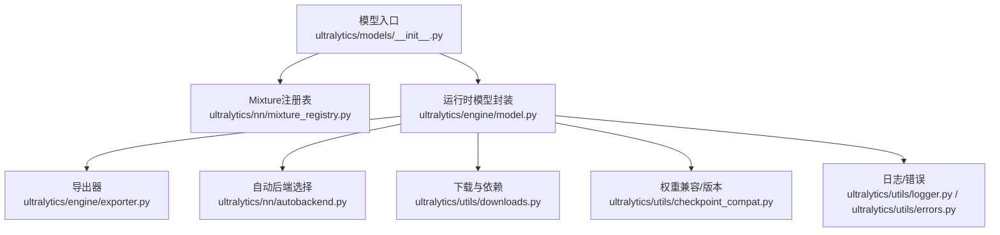
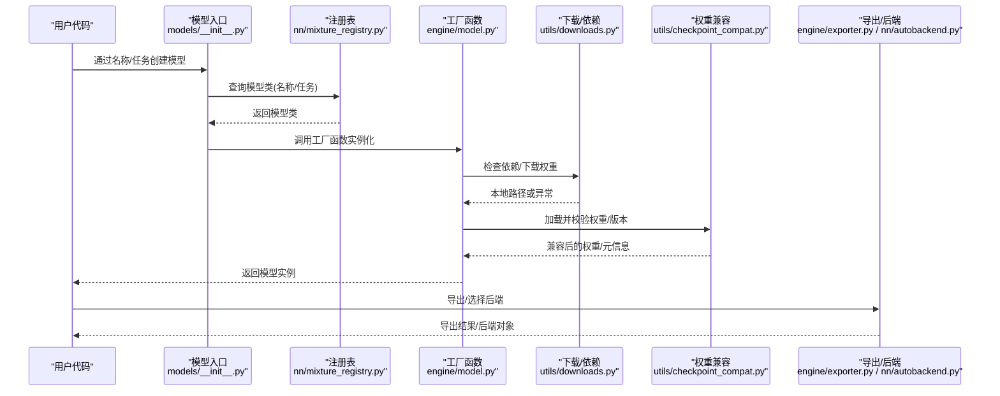
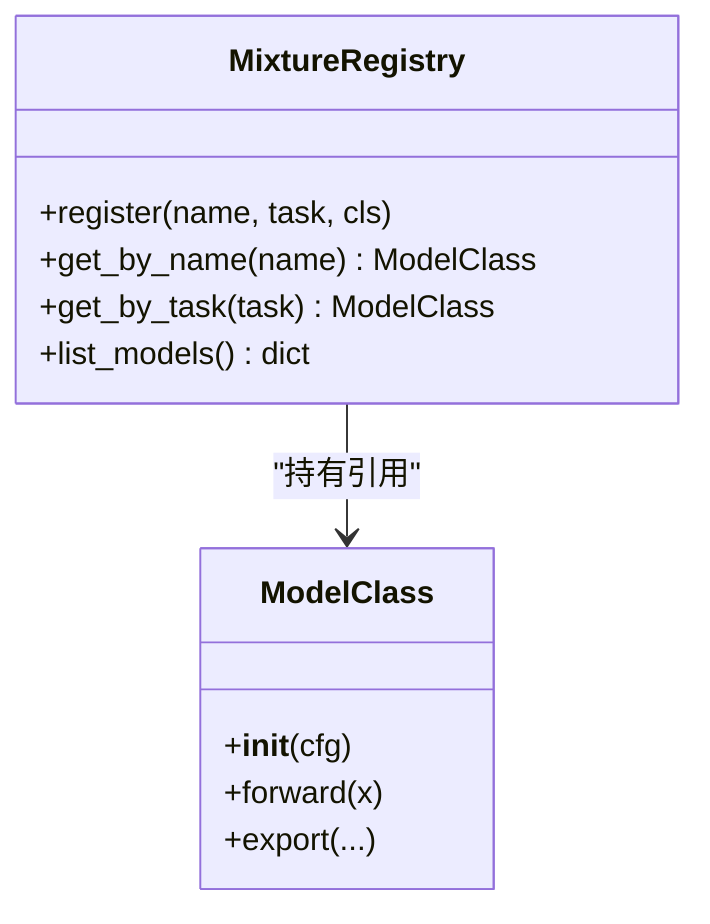
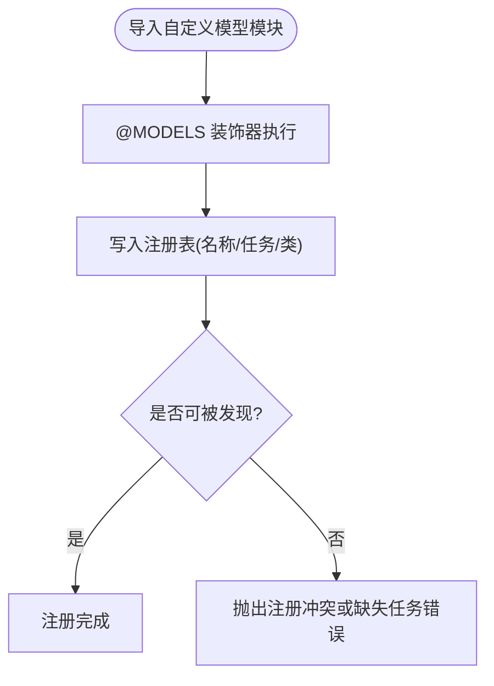
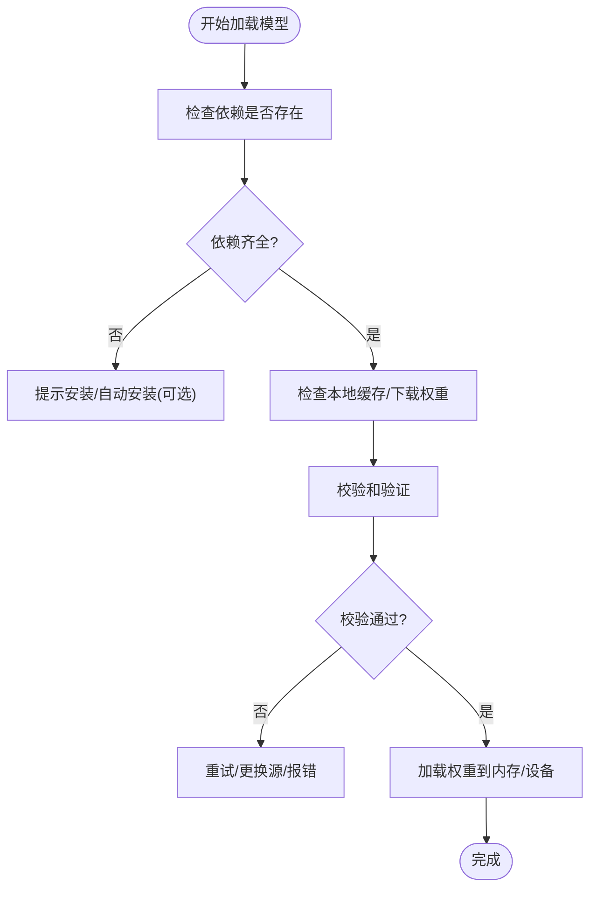
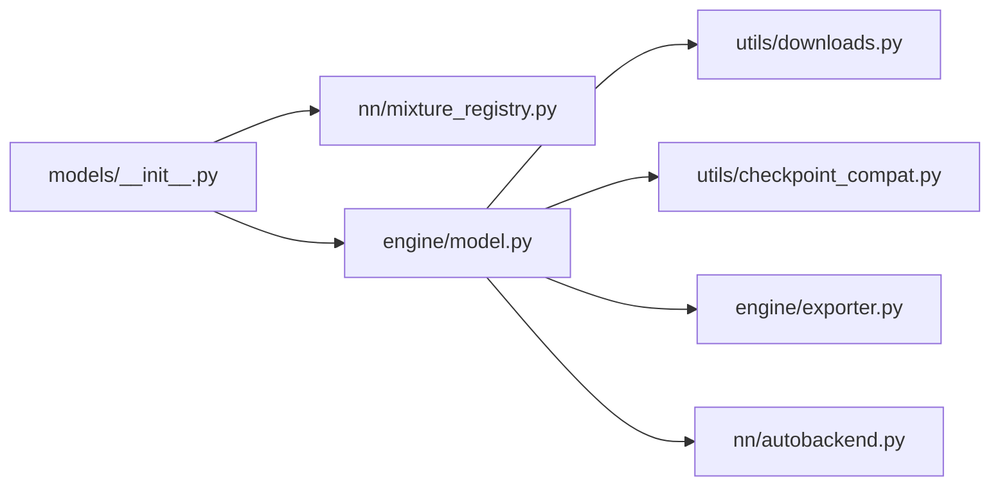

# 模型注册机制API

<cite>
**本文引用的文件**
- [ultralytics/models/__init__.py](file://ultralytics/models/__init__.py)
- [ultralytics/nn/mixture_registry.py](file://ultralytics/nn/mixture_registry.py)
- [tests/test_mixture_model_registry.py](file://tests/test_mixture_model_registry.py)
- [ultralytics/utils/downloads.py](file://ultralytics/utils/downloads.py)
- [ultralytics/utils/checkpoint_compat.py](file://ultralytics/utils/checkpoint_compat.py)
- [ultralytics/engine/model.py](file://ultralytics/engine/model.py)
- [ultralytics/engine/exporter.py](file://ultralytics/engine/exporter.py)
- [ultralytics/nn/autobackend.py](file://ultralytics/nn/autobackend.py)
- [ultralytics/utils/logger.py](file://ultralytics/utils/logger.py)
- [ultralytics/utils/errors.py](file://ultralytics/utils/errors.py)
</cite>

## 目录
1. [简介](#简介)
2. [项目结构](#项目结构)
3. [核心组件](#核心组件)
4. [架构总览](#架构总览)
5. [详细组件分析](#详细组件分析)
6. [依赖关系分析](#依赖关系分析)
7. [性能考虑](#性能考虑)
8. [故障排查指南](#故障排查指南)
9. [结论](#结论)
10. [附录](#附录)

## 简介
本文件面向“模型注册机制API”，系统性说明模型类的注册与发现、装饰器使用方式、自定义模型的注册流程与命名规范、配置文件解析与校验、工厂函数接口、版本管理与兼容性检查、依赖检查与自动下载、缓存策略与内存管理，以及调试与诊断工具接口。文档以代码级实现为依据，辅以可视化图示，帮助读者快速理解并扩展模型注册体系。

## 项目结构
围绕模型注册与发现的核心路径位于以下模块：
- 模型入口与统一装配：ultralytics/models/__init__.py
- 混合专家（Mixture）注册表：ultralytics/nn/mixture_registry.py
- 运行时模型封装与加载：ultralytics/engine/model.py
- 导出与后端选择：ultralytics/engine/exporter.py、ultralytics/nn/autobackend.py
- 下载与依赖：ultralytics/utils/downloads.py
- 权重兼容与版本：ultralytics/utils/checkpoint_compat.py
- 日志与错误：ultralytics/utils/logger.py、ultralytics/utils/errors.py
- 测试用例：tests/test_mixture_model_registry.py

图表来源
- [ultralytics/models/__init__.py](file://ultralytics/models/__init__.py)
- [ultralytics/nn/mixture_registry.py](file://ultralytics/nn/mixture_registry.py)
- [ultralytics/engine/model.py](file://ultralytics/engine/model.py)
- [ultralytics/engine/exporter.py](file://ultralytics/engine/exporter.py)
- [ultralytics/nn/autobackend.py](file://ultralytics/nn/autobackend.py)
- [ultralytics/utils/downloads.py](file://ultralytics/utils/downloads.py)
- [ultralytics/utils/checkpoint_compat.py](file://ultralytics/utils/checkpoint_compat.py)
- [ultralytics/utils/logger.py](file://ultralytics/utils/logger.py)
- [ultralytics/utils/errors.py](file://ultralytics/utils/errors.py)

章节来源
- [ultralytics/models/__init__.py](file://ultralytics/models/__init__.py)
- [ultralytics/nn/mixture_registry.py](file://ultralytics/nn/mixture_registry.py)
- [ultralytics/engine/model.py](file://ultralytics/engine/model.py)
- [ultralytics/engine/exporter.py](file://ultralytics/engine/exporter.py)
- [ultralytics/nn/autobackend.py](file://ultralytics/nn/autobackend.py)
- [ultralytics/utils/downloads.py](file://ultralytics/utils/downloads.py)
- [ultralytics/utils/checkpoint_compat.py](file://ultralytics/utils/checkpoint_compat.py)
- [ultralytics/utils/logger.py](file://ultralytics/utils/logger.py)
- [ultralytics/utils/errors.py](file://ultralytics/utils/errors.py)

## 核心组件
- 模型注册表（MixtureRegistry）
  - 负责维护任务到模型类映射、别名与元数据，提供按名称或任务查找模型类的能力。
  - 支持装饰器式注册，便于在导入时完成自动发现。
- 模型入口装配器
  - 统一对外暴露的模型创建入口，内部根据配置或名称解析到具体模型类，并调用工厂方法实例化。
- 运行时模型封装（Model）
  - 负责权重加载、设备放置、推理/训练/验证生命周期、导出与后端选择、依赖检查与下载、缓存与内存管理。
- 权重兼容与版本管理
  - 提供权重格式探测、向后兼容转换、版本约束检查等能力。
- 下载与依赖
  - 提供远程资源下载、断点续传、校验和校验、失败重试等。
- 日志与错误
  - 统一的日志输出与异常类型定义，贯穿注册、加载、导出全流程。

章节来源
- [ultralytics/nn/mixture_registry.py](file://ultralytics/nn/mixture_registry.py)
- [ultralytics/models/__init__.py](file://ultralytics/models/__init__.py)
- [ultralytics/engine/model.py](file://ultralytics/engine/model.py)
- [ultralytics/utils/checkpoint_compat.py](file://ultralytics/utils/checkpoint_compat.py)
- [ultralytics/utils/downloads.py](file://ultralytics/utils/downloads.py)
- [ultralytics/utils/logger.py](file://ultralytics/utils/logger.py)
- [ultralytics/utils/errors.py](file://ultralytics/utils/errors.py)

## 架构总览
下图展示了从用户调用到模型实例化的关键路径，包括注册、发现、工厂创建、依赖检查与下载、权重加载与兼容处理、以及导出与后端选择。

图表来源
- [ultralytics/models/__init__.py](file://ultralytics/models/__init__.py)
- [ultralytics/nn/mixture_registry.py](file://ultralytics/nn/mixture_registry.py)
- [ultralytics/engine/model.py](file://ultralytics/engine/model.py)
- [ultralytics/utils/downloads.py](file://ultralytics/utils/downloads.py)
- [ultralytics/utils/checkpoint_compat.py](file://ultralytics/utils/checkpoint_compat.py)
- [ultralytics/engine/exporter.py](file://ultralytics/engine/exporter.py)
- [ultralytics/nn/autobackend.py](file://ultralytics/nn/autobackend.py)

## 详细组件分析

### 模型注册表（MixtureRegistry）
- 职责
  - 维护“任务→模型类”、“名称→模型类”的双向映射。
  - 提供按名称或任务查找模型类的方法。
  - 支持装饰器式注册，使模型类在导入时自动加入注册表。
- 关键接口（概念性描述）
  - 注册：将模型类与其任务/别名绑定。
  - 查找：根据名称或任务获取模型类。
  - 列表：列出已注册的模型名与任务。
- 设计要点
  - 线程安全：注册表应在多进程/多线程环境下安全访问。
  - 幂等：重复注册同一名称应覆盖或报错，需明确策略。
  - 可扩展：支持动态插件式扩展，无需修改核心逻辑。

图表来源
- [ultralytics/nn/mixture_registry.py](file://ultralytics/nn/mixture_registry.py)

章节来源
- [ultralytics/nn/mixture_registry.py](file://ultralytics/nn/mixture_registry.py)
- [tests/test_mixture_model_registry.py](file://tests/test_mixture_model_registry.py)

### @MODELS 装饰器与模型发现
- 作用
  - 在模型类定义处通过装饰器声明其任务与别名，自动完成注册。
- 使用方法
  - 在自定义模型类上应用装饰器，指定任务标识与可选别名。
  - 确保包含该类的模块被导入，以便装饰器生效。
- 命名规范
  - 名称建议采用小写短横线风格，避免特殊字符。
  - 任务标识应与系统内置任务一致，保证可被发现。
- 发现机制
  - 模块导入即触发装饰器执行，将模型类写入注册表。
  - 可通过注册表枚举所有已注册模型，用于UI展示或CLI命令补全。

图表来源
- [ultralytics/nn/mixture_registry.py](file://ultralytics/nn/mixture_registry.py)

章节来源
- [ultralytics/nn/mixture_registry.py](file://ultralytics/nn/mixture_registry.py)
- [tests/test_mixture_model_registry.py](file://tests/test_mixture_model_registry.py)

### 自定义模型注册流程与命名规范
- 注册流程
  - 定义模型类，实现必要接口（初始化、前向、导出等）。
  - 使用装饰器声明任务与别名。
  - 确保模块被导入，完成自动注册。
- 命名规范
  - 名称唯一且稳定，避免与内置模型冲突。
  - 任务标识遵循系统约定，便于路由与分发。
- 最佳实践
  - 在包初始化中显式导入自定义模型模块，保证装饰器执行。
  - 为模型提供清晰的元数据（作者、版本、适用任务），便于治理与审计。

章节来源
- [ultralytics/nn/mixture_registry.py](file://ultralytics/nn/mixture_registry.py)
- [tests/test_mixture_model_registry.py](file://tests/test_mixture_model_registry.py)

### 模型配置文件解析与验证
- 解析过程
  - 读取YAML/字典配置，合并默认配置与用户覆盖项。
  - 对关键字段进行类型与范围校验，缺失必填字段时报错。
- 验证规则
  - 任务一致性：配置中的任务必须与模型类声明的任务匹配。
  - 输入维度：图像尺寸、通道数等需满足模型要求。
  - 导出选项：目标格式、优化级别等需受控。
- 错误处理
  - 对非法配置抛出结构化错误，附带修复建议。

章节来源
- [ultralytics/engine/model.py](file://ultralytics/engine/model.py)
- [ultralytics/utils/errors.py](file://ultralytics/utils/errors.py)

### 模型工厂函数接口
- 职责
  - 根据名称或任务解析模型类，构建实例，并执行必要的初始化（设备、权重、后端）。
- 主要参数（概念性）
  - 名称/任务：定位模型类。
  - 配置：模型超参与任务设置。
  - 权重路径：预训练权重或微调权重。
  - 设备：CPU/GPU/其他后端。
  - 导出/后端：是否立即导出或选择最优后端。
- 返回值
  - 返回已初始化的模型实例，可直接用于推理/训练/验证/导出。

章节来源
- [ultralytics/engine/model.py](file://ultralytics/engine/model.py)
- [ultralytics/models/__init__.py](file://ultralytics/models/__init__.py)

### 版本管理与兼容性检查
- 版本信息
  - 模型权重与配置中包含版本元数据，用于前后兼容判断。
- 兼容性检查
  - 检测权重格式变更、字段缺失/新增、数值精度变化等。
  - 必要时执行自动迁移或提示用户更新。
- 回退策略
  - 当检测到不兼容时，尝试降级或给出明确的升级指引。

章节来源
- [ultralytics/utils/checkpoint_compat.py](file://ultralytics/utils/checkpoint_compat.py)
- [ultralytics/engine/model.py](file://ultralytics/engine/model.py)

### 依赖检查与自动下载
- 依赖检查
  - 启动时扫描所需外部依赖（如特定后端库、量化引擎）。
  - 若缺失则记录警告或阻止运行，视策略而定。
- 自动下载
  - 根据模型ID或URL拉取权重与配置文件。
  - 支持校验和验证、断点续传、失败重试与超时控制。
- 缓存位置
  - 下载内容持久化至本地缓存目录，避免重复下载。

图表来源
- [ultralytics/utils/downloads.py](file://ultralytics/utils/downloads.py)
- [ultralytics/engine/model.py](file://ultralytics/engine/model.py)

章节来源
- [ultralytics/utils/downloads.py](file://ultralytics/utils/downloads.py)
- [ultralytics/engine/model.py](file://ultralytics/engine/model.py)

### 缓存策略与内存管理
- 缓存策略
  - 模型类与注册表：进程内常驻，避免重复解析。
  - 权重文件：磁盘缓存，按哈希去重。
  - 后端对象：按需创建与复用，减少初始化开销。
- 内存管理
  - 显式释放：提供卸载接口，清理GPU/CPU缓存。
  - 惰性加载：仅在首次使用时加载权重。
  - 批量推理：共享中间张量缓冲区，降低分配频率。

章节来源
- [ultralytics/engine/model.py](file://ultralytics/engine/model.py)
- [ultralytics/nn/autobackend.py](file://ultralytics/nn/autobackend.py)

### 调试与诊断工具接口
- 日志
  - 统一日志输出，支持分级与格式化，便于追踪注册、加载、导出流程。
- 诊断
  - 打印模型图、节点统计、后端选择原因。
  - 导出前自检：检查输入形状、数据类型、算子支持。
- 错误上报
  - 结构化错误信息，包含上下文与修复建议。

章节来源
- [ultralytics/utils/logger.py](file://ultralytics/utils/logger.py)
- [ultralytics/utils/errors.py](file://ultralytics/utils/errors.py)
- [ultralytics/engine/exporter.py](file://ultralytics/engine/exporter.py)

## 依赖关系分析
- 组件耦合
  - 模型入口依赖注册表与工厂函数。
  - 工厂函数依赖下载、权重兼容、后端选择。
  - 导出器依赖后端选择与模型实例。
- 潜在循环
  - 注册表不应反向依赖工厂函数，避免循环导入。
- 外部依赖
  - 网络下载、磁盘IO、设备驱动等。

图表来源
- [ultralytics/models/__init__.py](file://ultralytics/models/__init__.py)
- [ultralytics/nn/mixture_registry.py](file://ultralytics/nn/mixture_registry.py)
- [ultralytics/engine/model.py](file://ultralytics/engine/model.py)
- [ultralytics/utils/downloads.py](file://ultralytics/utils/downloads.py)
- [ultralytics/utils/checkpoint_compat.py](file://ultralytics/utils/checkpoint_compat.py)
- [ultralytics/engine/exporter.py](file://ultralytics/engine/exporter.py)
- [ultralytics/nn/autobackend.py](file://ultralytics/nn/autobackend.py)

章节来源
- [ultralytics/models/__init__.py](file://ultralytics/models/__init__.py)
- [ultralytics/nn/mixture_registry.py](file://ultralytics/nn/mixture_registry.py)
- [ultralytics/engine/model.py](file://ultralytics/engine/model.py)
- [ultralytics/utils/downloads.py](file://ultralytics/utils/downloads.py)
- [ultralytics/utils/checkpoint_compat.py](file://ultralytics/utils/checkpoint_compat.py)
- [ultralytics/engine/exporter.py](file://ultralytics/engine/exporter.py)
- [ultralytics/nn/autobackend.py](file://ultralytics/nn/autobackend.py)

## 性能考虑
- 注册表查询应为O(1)哈希查找，避免线性扫描。
- 权重加载采用懒加载与分块读取，降低首启延迟。
- 后端选择基于硬件特征与算子支持，避免不必要的转换。
- 导出阶段启用并行与批处理，提升吞吐。

[本节为通用指导，不涉及具体文件分析]

## 故障排查指南
- 常见问题
  - 模型未找到：确认名称/任务是否正确，模块是否导入。
  - 权重不兼容：检查版本元数据，执行兼容转换或更新权重。
  - 依赖缺失：安装所需后端库或启用相应功能开关。
  - 下载失败：检查网络、代理、校验和；启用重试与换源。
- 诊断步骤
  - 开启详细日志，查看注册、加载、导出各阶段输出。
  - 使用诊断接口打印模型图与后端选择原因。
  - 复现最小示例，隔离问题范围。

章节来源
- [ultralytics/utils/logger.py](file://ultralytics/utils/logger.py)
- [ultralytics/utils/errors.py](file://ultralytics/utils/errors.py)
- [ultralytics/engine/model.py](file://ultralytics/engine/model.py)
- [ultralytics/engine/exporter.py](file://ultralytics/engine/exporter.py)

## 结论
本注册机制通过装饰器驱动的自动发现、集中式注册表与工厂函数装配，实现了模型的高内聚与低耦合。配合权重兼容、依赖检查与自动下载、缓存与内存管理、以及完善的日志与诊断工具，形成了完整的模型生命周期管理能力。建议在扩展新模型时严格遵循命名与任务规范，并在模块初始化中显式导入，以确保注册生效。

[本节为总结，不涉及具体文件分析]

## 附录
- 术语
  - 任务：模型所解决的视觉任务类别（如检测、分割、姿态等）。
  - 别名：模型名称的替代写法，便于兼容历史用法。
  - 后端：推理或导出的具体实现（如ONNXRuntime、TensorRT等）。
- 参考
  - 测试用例可用于验证注册表行为与边界条件。

章节来源
- [tests/test_mixture_model_registry.py](file://tests/test_mixture_model_registry.py)