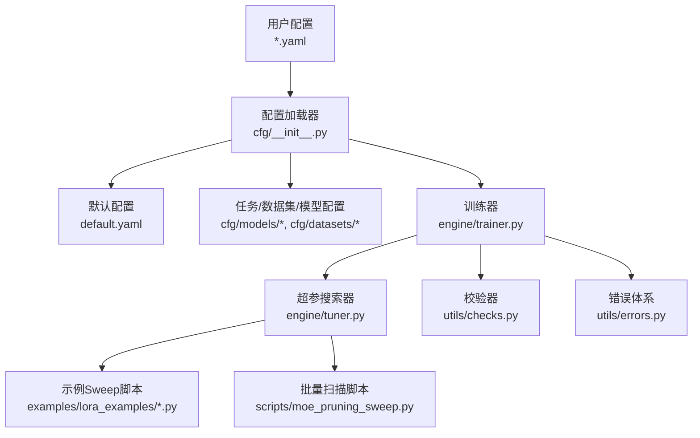
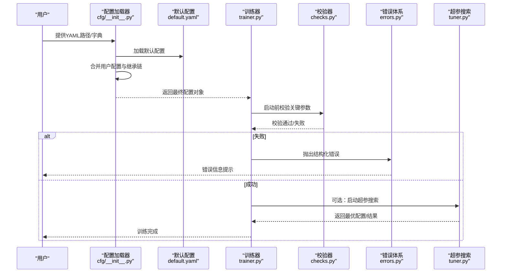
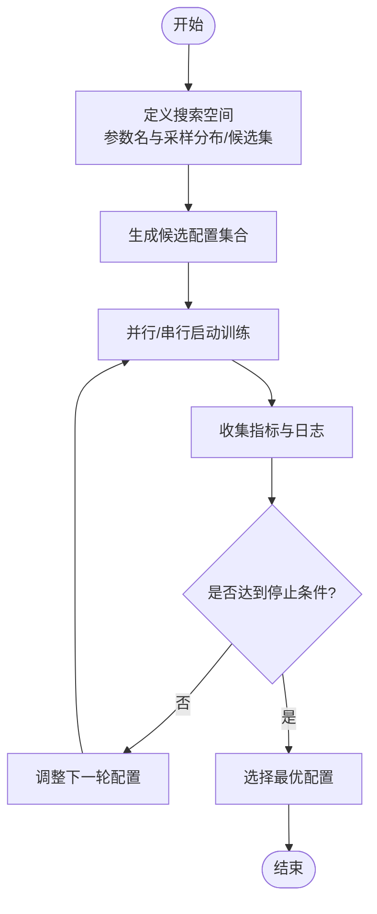
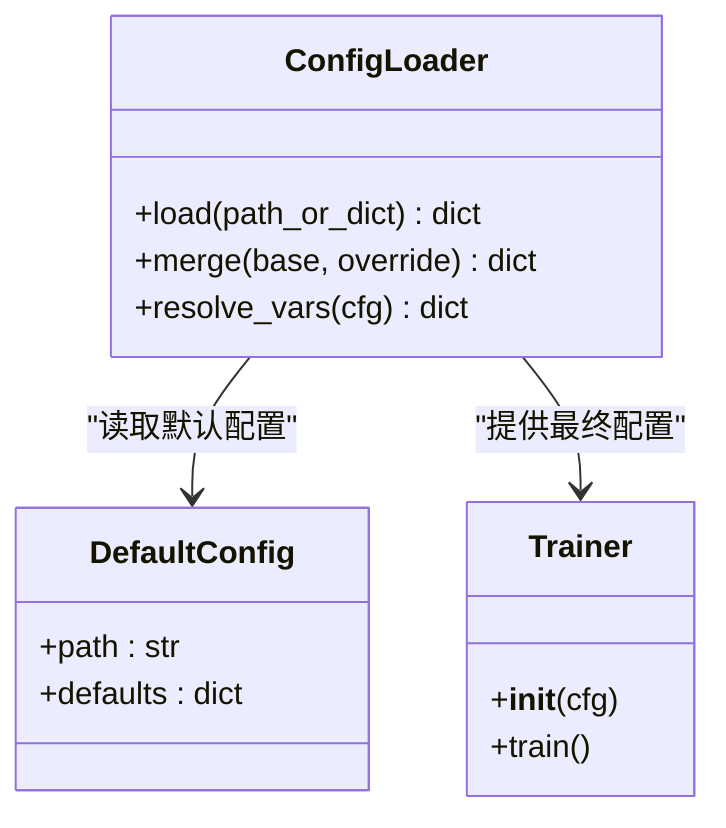
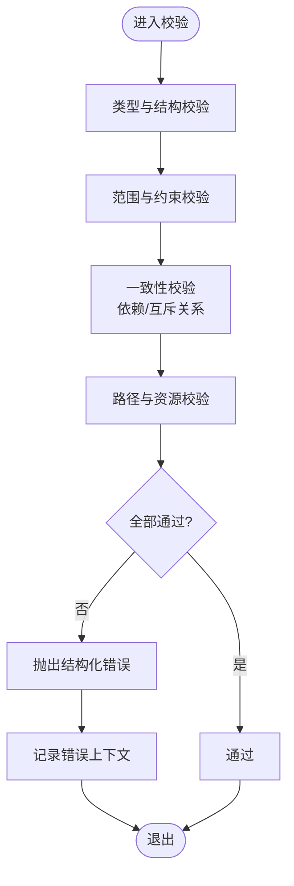
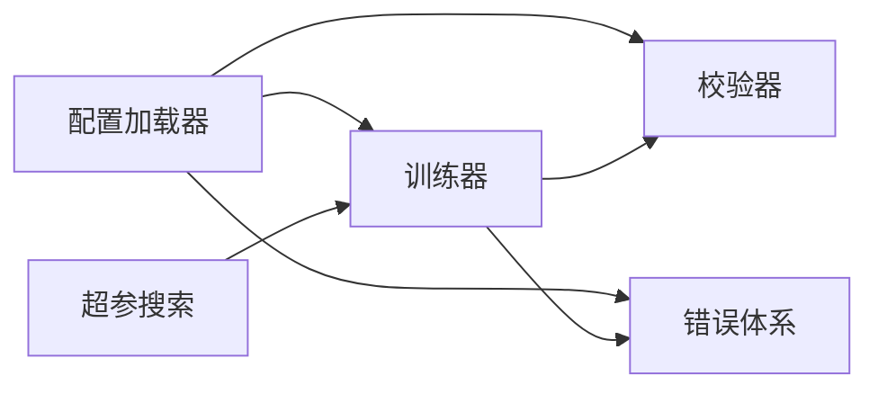

# 模型配置API

<cite>
**本文引用的文件**
- [ultralytics/cfg/default.yaml](file://ultralytics/cfg/default.yaml)
- [ultralytics/cfg/__init__.py](file://ultralytics/cfg/__init__.py)
- [ultralytics/engine/trainer.py](file://ultralytics/engine/trainer.py)
- [ultralytics/engine/tuner.py](file://ultralytics/engine/tuner.py)
- [ultralytics/utils/checks.py](file://ultralytics/utils/checks.py)
- [ultralytics/utils/errors.py](file://ultralytics/utils/errors.py)
- [examples/lora_examples/yolo11_lora.yaml](file://examples/lora_examples/yolo11_lora.yaml)
- [examples/lora_examples/run_yolo_master_lora_rank_sweep.py](file://examples/lora_examples/run_yolo_master_lora_rank_sweep.py)
- [scripts/moe_pruning_sweep.py](file://scripts/moe_pruning_sweep.py)
- [tests/test_default_config_integrity.py](file://tests/test_default_config_integrity.py)
- [tests/test_mixture_config_resolution.py](file://tests/test_mixture_config_resolution.py)
</cite>

## 目录
1. [简介](#简介)
2. [项目结构](#项目结构)
3. [核心组件](#核心组件)
4. [架构总览](#架构总览)
5. [详细组件分析](#详细组件分析)
6. [依赖分析](#依赖分析)
7. [性能考虑](#性能考虑)
8. [故障排查指南](#故障排查指南)
9. [结论](#结论)
10. [附录](#附录)

## 简介
本文件面向“模型配置API”，系统化说明YAML配置文件的结构与语法规范、参数含义与默认值、超参数调优与自动化搜索接口、配置的继承与组合机制、环境特定配置的优先级与覆盖规则、配置验证与错误处理机制，并提供模板与最佳实践示例以及可视化/编辑工具接口建议。文档内容基于仓库中实际实现与测试用例进行归纳总结，确保可追溯与可复现。

## 项目结构
与模型配置相关的代码主要分布在以下位置：
- 配置定义与加载：ultralytics/cfg
- 训练流程对配置的解析与应用：ultralytics/engine/trainer.py
- 超参搜索与自动调优：ultralytics/engine/tuner.py
- 配置校验与通用检查：ultralytics/utils/checks.py
- 错误类型与异常体系：ultralytics/utils/errors.py
- 示例配置与Sweep脚本：examples/lora_examples/*.yaml, examples/lora_examples/run_yolo_master_lora_rank_sweep.py
- 批量扫描与实验脚本：scripts/moe_pruning_sweep.py
- 配置完整性与解析测试：tests/test_default_config_integrity.py, tests/test_mixture_config_resolution.py

图表来源
- [ultralytics/cfg/__init__.py](file://ultralytics/cfg/__init__.py)
- [ultralytics/cfg/default.yaml](file://ultralytics/cfg/default.yaml)
- [ultralytics/engine/trainer.py](file://ultralytics/engine/trainer.py)
- [ultralytics/engine/tuner.py](file://ultralytics/engine/tuner.py)
- [ultralytics/utils/checks.py](file://ultralytics/utils/checks.py)
- [ultralytics/utils/errors.py](file://ultralytics/utils/errors.py)
- [examples/lora_examples/run_yolo_master_lora_rank_sweep.py](file://examples/lora_examples/run_yolo_master_lora_rank_sweep.py)
- [scripts/moe_pruning_sweep.py](file://scripts/moe_pruning_sweep.py)

章节来源
- [ultralytics/cfg/default.yaml](file://ultralytics/cfg/default.yaml)
- [ultralytics/cfg/__init__.py](file://ultralytics/cfg/__init__.py)
- [ultralytics/engine/trainer.py](file://ultralytics/engine/trainer.py)
- [ultralytics/engine/tuner.py](file://ultralytics/engine/tuner.py)
- [ultralytics/utils/checks.py](file://ultralytics/utils/checks.py)
- [ultralytics/utils/errors.py](file://ultralytics/utils/errors.py)
- [examples/lora_examples/run_yolo_master_lora_rank_sweep.py](file://examples/lora_examples/run_yolo_master_lora_rank_sweep.py)
- [scripts/moe_pruning_sweep.py](file://scripts/moe_pruning_sweep.py)

## 核心组件
- 配置加载与合并：负责读取用户提供的YAML、合并默认配置、解析继承关系与变量替换，并输出最终配置对象供训练器使用。
- 训练器集成：在训练生命周期各阶段（初始化、数据构建、优化器/调度器创建、回调注册等）消费配置项。
- 超参搜索：通过Tuner或外部Sweep脚本驱动多组配置并行/串行执行，收集指标并选择最优。
- 校验与错误：在加载后对关键参数进行范围、类型与一致性校验，失败时抛出结构化错误以便定位。

章节来源
- [ultralytics/cfg/__init__.py](file://ultralytics/cfg/__init__.py)
- [ultralytics/engine/trainer.py](file://ultralytics/engine/trainer.py)
- [ultralytics/engine/tuner.py](file://ultralytics/engine/tuner.py)
- [ultralytics/utils/checks.py](file://ultralytics/utils/checks.py)
- [ultralytics/utils/errors.py](file://ultralytics/utils/errors.py)

## 架构总览
下图展示了从YAML到训练执行的端到端流程，包括继承、合并、校验与搜索的交互。

图表来源
- [ultralytics/cfg/__init__.py](file://ultralytics/cfg/__init__.py)
- [ultralytics/cfg/default.yaml](file://ultralytics/cfg/default.yaml)
- [ultralytics/engine/trainer.py](file://ultralytics/engine/trainer.py)
- [ultralytics/engine/tuner.py](file://ultralytics/engine/tuner.py)
- [ultralytics/utils/checks.py](file://ultralytics/utils/checks.py)
- [ultralytics/utils/errors.py](file://ultralytics/utils/errors.py)

## 详细组件分析

### YAML配置文件结构与语法规范
- 基本语法
  - 支持键值对、嵌套字典、列表、布尔、数值、字符串等标准YAML类型。
  - 支持引用与继承：可通过特殊字段引用基础配置，形成层次化组合。
  - 支持变量占位符与环境变量注入：可在配置中引用环境变量或内部变量，便于跨环境复用。
- 典型顶层键
  - 任务相关：如任务类型、输入尺寸、类别数等。
  - 数据相关：数据集路径、划分比例、增强策略等。
  - 模型相关：网络结构、通道数、深度/宽度系数、头配置等。
  - 训练相关：学习率、批次大小、优化器、调度器、损失权重等。
  - 导出/推理相关：目标格式、精度、动态轴等。
  - 日志/保存：输出目录、日志级别、断点续训等。
- 继承与组合
  - 通过继承字段指定父配置路径，子配置仅声明差异项，减少重复。
  - 多个继承层级按顺序合并，后声明的键覆盖先声明的键。
- 变量与环境
  - 使用占位符语法引用环境变量或内部变量，避免硬编码路径与敏感信息。
  - 建议在CI/CD或不同设备环境中通过环境变量覆盖关键路径与资源限制。

章节来源
- [ultralytics/cfg/default.yaml](file://ultralytics/cfg/default.yaml)
- [ultralytics/cfg/__init__.py](file://ultralytics/cfg/__init__.py)

### 可配置参数清单与取值范围
- 参数分类
  - 数据类：数据集根目录、图像尺寸、类别映射、增强开关等。
  - 模型类：骨干网络、颈部、头部、通道/深度缩放、注意力/路由开关等。
  - 训练类：优化器类型与超参、学习率调度、损失权重、早停条件、EMA等。
  - 导出/推理类：导出格式、量化、动态维度、NMS阈值等。
  - 系统类：设备选择、批大小、工作进程、随机种子、日志与保存路径等。
- 默认值与范围
  - 默认值来源于默认配置与模块内建默认；具体数值以默认配置为准。
  - 取值范围由校验逻辑约束，超出范围将触发错误。
- 推荐实践
  - 优先修改高层语义键（如“任务”、“模型规模”），避免直接改动底层实现细节。
  - 使用继承组织多套配置（开发/测试/生产），并通过环境变量覆盖差异。

章节来源
- [ultralytics/cfg/default.yaml](file://ultralytics/cfg/default.yaml)
- [ultralytics/utils/checks.py](file://ultralytics/utils/checks.py)

### 超参数调优与自动化搜索接口
- Tuner内置接口
  - 通过Tuner封装搜索空间、目标函数与评估指标，支持网格/随机/贝叶斯等策略（取决于后端）。
  - 支持并发执行与结果聚合，输出最优配置与对应指标。
- 外部Sweep脚本
  - 示例脚本演示如何构造多组配置并批量运行，适合自定义搜索策略与复杂依赖。
  - 可与分布式训练结合，提升搜索效率。
- 与训练器的集成
  - 训练器接受Tuner生成的配置，并在每次迭代中重新实例化所需组件。
  - 搜索过程中可复用同一份数据与模型定义，仅变更超参。

章节来源
- [ultralytics/engine/tuner.py](file://ultralytics/engine/tuner.py)
- [examples/lora_examples/run_yolo_master_lora_rank_sweep.py](file://examples/lora_examples/run_yolo_master_lora_rank_sweep.py)
- [scripts/moe_pruning_sweep.py](file://scripts/moe_pruning_sweep.py)

### 配置继承与组合机制
- 继承链解析
  - 从当前配置向上查找父配置，递归合并，直至无父配置为止。
  - 合并策略为浅层覆盖：同层字典键按声明顺序覆盖，列表通常拼接或覆盖（取决于字段语义）。
- 变量替换
  - 在合并完成后进行变量替换，支持环境变量与内部变量引用。
- 组合模式
  - 可将通用片段（如数据增强、日志、导出）抽离为独立配置，再通过继承组合到任务配置中。

图表来源
- [ultralytics/cfg/__init__.py](file://ultralytics/cfg/__init__.py)
- [ultralytics/cfg/default.yaml](file://ultralytics/cfg/default.yaml)
- [ultralytics/engine/trainer.py](file://ultralytics/engine/trainer.py)

章节来源
- [ultralytics/cfg/__init__.py](file://ultralytics/cfg/__init__.py)
- [ultralytics/cfg/default.yaml](file://ultralytics/cfg/default.yaml)

### 环境特定配置的优先级与覆盖规则
- 优先级顺序（从高到低）
  - 运行时传入的参数（命令行/调用方显式覆盖）
  - 用户YAML中的显式键
  - 继承链中后声明的配置
  - 默认配置
  - 环境变量（若配置中引用了环境变量）
- 覆盖规则
  - 同层键严格覆盖；嵌套字典需保持结构一致，否则可能产生未定义行为。
  - 列表字段的行为取决于具体实现，常见为覆盖或拼接，应参考相应字段的校验逻辑。
- 最佳实践
  - 将易变的环境相关项（路径、设备、批大小）放入环境变量，避免修改核心配置。
  - 使用最小化的覆盖配置，保留大部分默认值，降低维护成本。

章节来源
- [ultralytics/cfg/__init__.py](file://ultralytics/cfg/__init__.py)
- [ultralytics/cfg/default.yaml](file://ultralytics/cfg/default.yaml)

### 配置验证与错误处理机制
- 校验时机
  - 加载后立即进行必要校验（类型、范围、一致性），尽早失败以减少后续开销。
- 校验内容
  - 必填字段存在性、数值范围、互斥/依赖关系、路径有效性、设备可用性、导出能力矩阵匹配等。
- 错误处理
  - 统一通过错误体系抛出结构化异常，包含错误码、上下文信息与修复建议。
  - 训练器捕获并记录详细日志，便于定位问题。

图表来源
- [ultralytics/utils/checks.py](file://ultralytics/utils/checks.py)
- [ultralytics/utils/errors.py](file://ultralytics/utils/errors.py)

章节来源
- [ultralytics/utils/checks.py](file://ultralytics/utils/checks.py)
- [ultralytics/utils/errors.py](file://ultralytics/utils/errors.py)

### 配置文件模板与最佳实践示例
- 模板建议
  - 基础模板：包含任务、数据、模型、训练、导出、系统六大块，留空待填。
  - 任务模板：针对检测、分割、姿态、跟踪等任务提供专用键集。
  - 环境模板：开发/测试/生产三套，仅覆盖差异项。
- 最佳实践
  - 使用继承减少重复，保持单一事实源。
  - 将敏感信息与易变项外置为环境变量。
  - 在CI中运行配置完整性测试，防止漂移。
  - 为每个重要配置添加注释与变更记录。

章节来源
- [ultralytics/cfg/default.yaml](file://ultralytics/cfg/default.yaml)
- [examples/lora_examples/yolo11_lora.yaml](file://examples/lora_examples/yolo11_lora.yaml)
- [tests/test_default_config_integrity.py](file://tests/test_default_config_integrity.py)

### 可视化与编辑工具接口
- 建议接口
  - 配置Schema导出：将配置键、类型、默认值、描述导出为JSON Schema，便于前端渲染表单。
  - 在线编辑器：基于Schema生成表单，支持实时校验与预览。
  - 对比与Diff：展示多版本配置差异，辅助回归分析。
  - 导入/导出：支持YAML与JSON互转，兼容现有工作流。
- 集成方式
  - 通过配置加载器暴露Schema与校验API，供Web服务或桌面工具调用。
  - 与Tuner/Sweep集成，实现“所见即所得”的超参探索。

[本节为概念性设计，不直接分析具体文件]

## 依赖分析
- 组件耦合
  - 配置加载器依赖默认配置与继承链解析逻辑。
  - 训练器强依赖配置对象，贯穿整个训练生命周期。
  - 校验器与错误体系被多处复用，保证一致的健壮性。
  - 超参搜索与训练器解耦，通过配置对象传递变更。
- 外部依赖
  - YAML解析库、环境变量访问、文件系统操作、分布式通信（可选）。
- 循环依赖
  - 应避免配置加载器与训练器之间的双向依赖，采用单向依赖（加载器→训练器）。

图表来源
- [ultralytics/cfg/__init__.py](file://ultralytics/cfg/__init__.py)
- [ultralytics/engine/trainer.py](file://ultralytics/engine/trainer.py)
- [ultralytics/utils/checks.py](file://ultralytics/utils/checks.py)
- [ultralytics/utils/errors.py](file://ultralytics/utils/errors.py)
- [ultralytics/engine/tuner.py](file://ultralytics/engine/tuner.py)

章节来源
- [ultralytics/cfg/__init__.py](file://ultralytics/cfg/__init__.py)
- [ultralytics/engine/trainer.py](file://ultralytics/engine/trainer.py)
- [ultralytics/utils/checks.py](file://ultralytics/utils/checks.py)
- [ultralytics/utils/errors.py](file://ultralytics/utils/errors.py)
- [ultralytics/engine/tuner.py](file://ultralytics/engine/tuner.py)

## 性能考虑
- 配置加载开销
  - 大型继承链与大量变量替换会增加加载时间，建议控制继承深度与变量数量。
- 校验成本
  - 全量校验在首次加载时执行，后续复用配置对象，避免重复计算。
- 搜索效率
  - 合理设置并发度与早停策略，利用缓存与增量更新减少重复训练。
- 内存占用
  - 避免在配置中嵌入大对象或冗余数据，必要时使用外部引用。

[本节提供一般性指导，不直接分析具体文件]

## 故障排查指南
- 常见问题
  - 键不存在或拼写错误：检查Schema与默认配置，确认键名正确。
  - 类型不符或范围越界：查看校验错误信息，修正数值或类型。
  - 路径无效或权限不足：确认绝对路径与读写权限。
  - 继承冲突：检查覆盖顺序与嵌套结构一致性。
  - 环境变量缺失：确保运行环境已设置必需变量。
- 定位方法
  - 启用详细日志，观察配置加载与校验阶段的输出。
  - 使用最小化配置逐步还原，定位问题所在字段。
  - 借助配置Diff工具对比基线与变更。

章节来源
- [ultralytics/utils/checks.py](file://ultralytics/utils/checks.py)
- [ultralytics/utils/errors.py](file://ultralytics/utils/errors.py)
- [tests/test_default_config_integrity.py](file://tests/test_default_config_integrity.py)

## 结论
本API围绕“YAML配置+继承合并+变量替换+严格校验”的核心范式，提供了可扩展、可组合、可验证的配置体系。配合Tuner与Sweep脚本，可实现高效的超参搜索与实验管理。遵循本文的最佳实践与故障排查建议，可显著提升配置的可维护性与稳定性。

[本节为总结性内容，不直接分析具体文件]

## 附录
- 术语
  - 继承：通过父配置派生子配置，减少重复。
  - 合并：将多份配置按优先级融合为最终配置。
  - 变量替换：在配置中引用环境变量或内部变量。
  - 校验：对配置进行类型、范围与一致性检查。
- 参考实现
  - 默认配置与继承解析：见配置加载器与默认配置。
  - 训练器集成：见训练器中对配置的读取与使用。
  - 超参搜索：见Tuner与示例Sweep脚本。
  - 校验与错误：见校验器与错误体系。

章节来源
- [ultralytics/cfg/__init__.py](file://ultralytics/cfg/__init__.py)
- [ultralytics/cfg/default.yaml](file://ultralytics/cfg/default.yaml)
- [ultralytics/engine/trainer.py](file://ultralytics/engine/trainer.py)
- [ultralytics/engine/tuner.py](file://ultralytics/engine/tuner.py)
- [ultralytics/utils/checks.py](file://ultralytics/utils/checks.py)
- [ultralytics/utils/errors.py](file://ultralytics/utils/errors.py)