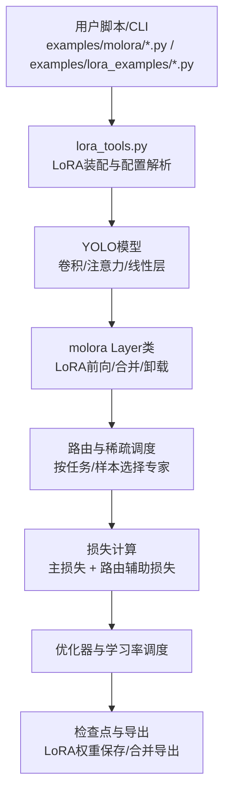
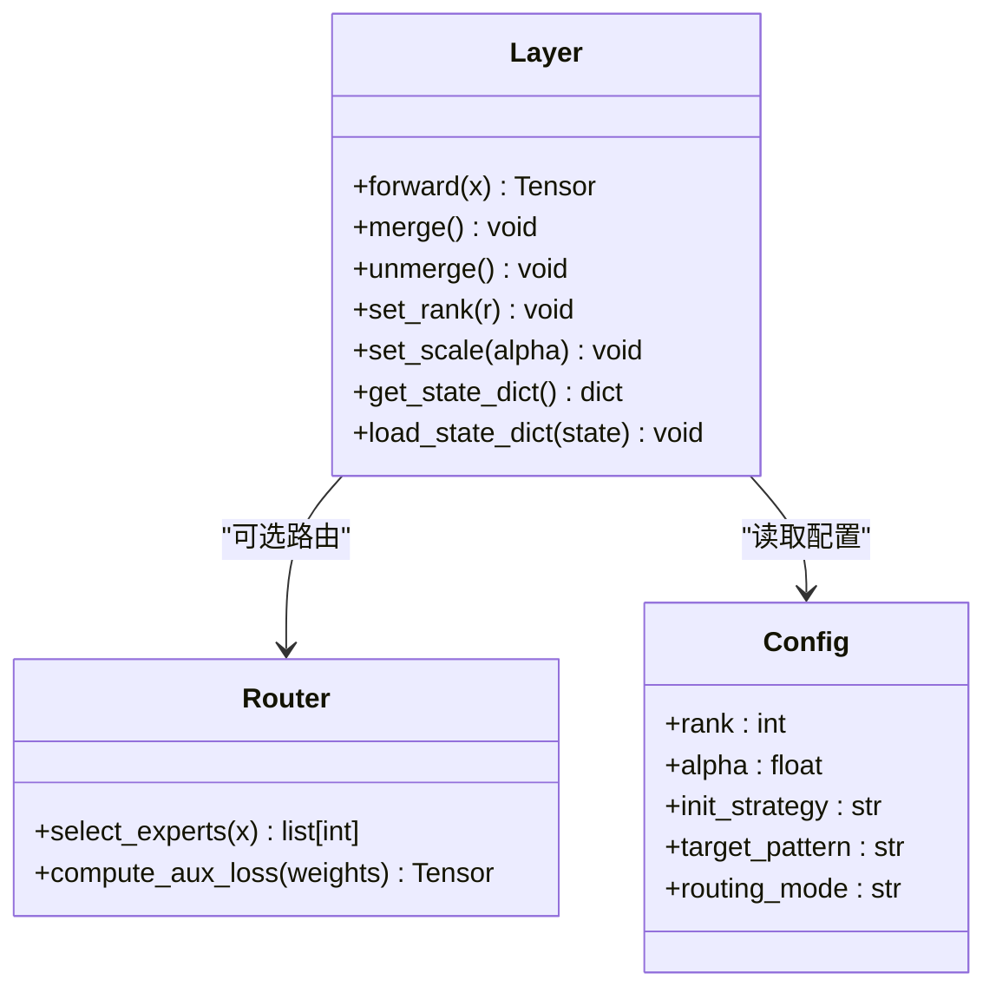
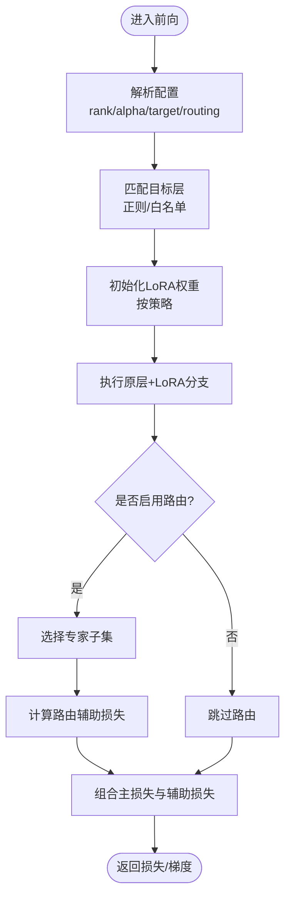
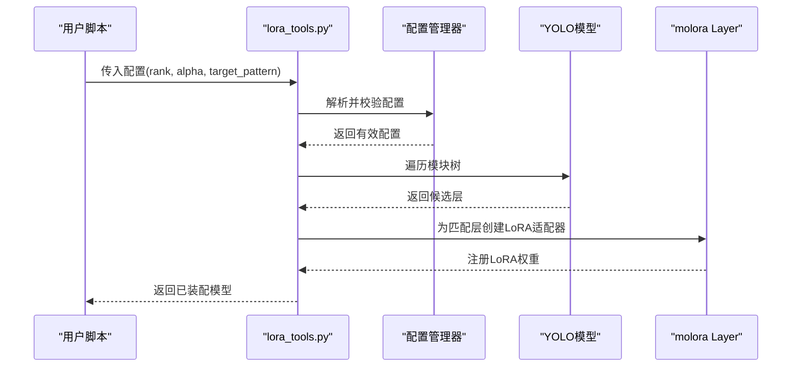
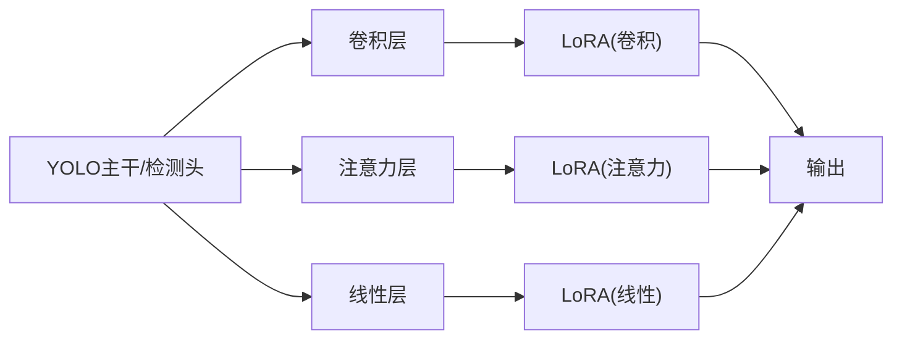
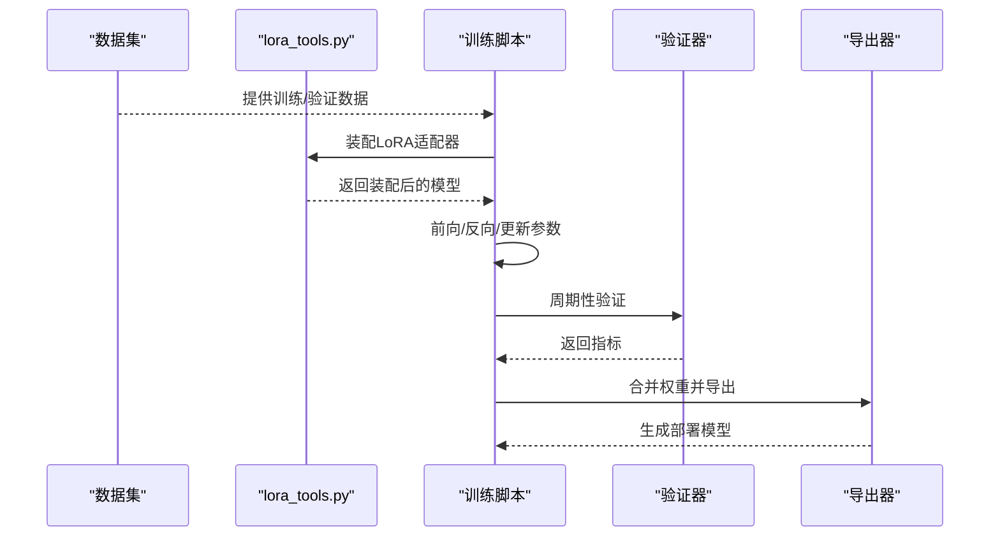

# LoRA核心实现

<cite>
**本文引用的文件**
- [molora_guide.md](file://docs/molora_guide.md)
- [LoRA_Quickstart.md](file://docs/LoRA_Quickstart.md)
- [yolo_master_lora_README.md](file://examples/lora_examples/yolo_master_lora_README.md)
- [lora_tools.py](file://agent/runtime/cli/lora_tools.py)
- [test_molora.py](file://tests/test_molora.py)
- [test_molora_dtype.py](file://tests/test_molora_dtype.py)
- [test_molora_merge_semantics.py](file://tests/test_molora_merge_semantics.py)
- [test_molora_routing_aware_merge.py](file://tests/test_molora_routing_aware_merge.py)
- [test_molora_sparse_dispatch.py](file://tests/test_molora_sparse_dispatch.py)
- [test_molora_supplementary.py](file://tests/test_molora_supplementary.py)
- [test_peft_adapters.py](file://tests/test_peft_adapters.py)
- [test_moe_aware_peft.py](file://tests/test_moe_aware_peft.py)
- [peft_compare.py](file://agent/runtime/cli/peft_compare.py)
- [benchmark_molora_dispatch.py](file://benchmarks/benchmark_molora_dispatch.py)
- [basic_finetune.py](file://examples/molora/basic_finetune.py)
- [compare_coco128.py](file://examples/molora/compare_coco128.py)
- [compare_coco128_fast.py](file://examples/molora/compare_coco128_fast.py)
- [compare_lora_molora.py](file://examples/molora/compare_lora_molora.py)
- [continual_learning.py](file://examples/molora/continual_learning.py)
- [run_yolo_master_lora_rank_sweep.py](file://examples/lora_examples/run_yolo_master_lora_rank_sweep.py)
- [ablation_molora_full.py](file://scripts/ablation_suite/ablation_molora_full.py)
- [fewshot_lora_quick.py](file://scripts/fewshot_lora_quick.py)
- [fewshot_lora_verify.py](file://scripts/fewshot_lora_verify.py)
- [verify_lora_package_split.py](file://scripts/verify_lora_package_split.py)
- [domain-specific-lora-tuning.md](file://.plan_archive/domain-specific-lora-tuning.md)
- [moe_aware_peft_plan.md](file://.plan_archive/moe_aware_peft_plan.md)
- [2026-07-17-molora-routing-aware-merge.md](file://docs/plans/2026-07-17-molora-routing-aware-merge.md)
</cite>

## 目录
1. [简介](#简介)
2. [项目结构](#项目结构)
3. [核心组件](#核心组件)
4. [架构总览](#架构总览)
5. [详细组件分析](#详细组件分析)
6. [依赖关系分析](#依赖关系分析)
7. [性能考虑](#性能考虑)
8. [故障排查指南](#故障排查指南)
9. [结论](#结论)
10. [附录](#附录)

## 简介
本技术文档聚焦于YOLO-Master中的LoRA（低秩适应）核心实现，尤其是molora模块。文档从数学原理出发，系统阐述低秩矩阵分解与参数高效微调机制，随后深入解析molora的Layer类设计、配置管理、路由机制与损失函数；并详细说明LoRA适配器的创建流程（秩选择、初始化策略、位置选择）、与YOLO模型中卷积层/注意力层/线性层的集成方式；最后给出训练配置选项、端到端工作流程示例、超参调优最佳实践与性能优化建议。

## 项目结构
围绕LoRA与molora的相关代码主要分布在以下区域：
- 文档与计划：docs下的molora指南、快速开始、以及多个计划文档
- 运行时工具：agent/runtime/cli下的lora_tools与peft_compare等CLI工具
- 测试套件：tests下覆盖molora多特性的单测与回归用例
- 基准与示例：benchmarks与examples/molora、examples/lora_examples下的脚本与案例
- 实验与验证：scripts下的消融、Few-shot、包拆分验证等脚本

```mermaid
graph TB
subgraph "文档与计划"
D1["docs/molora_guide.md"]
D2["docs/LoRA_Quickstart.md"]
P1[".plan_archive/domain-specific-lora-tuning.md"]
P2[".plan_archive/moe_aware_peft_plan.md"]
P3["docs/plans/2026-07-17-molora-routing-aware-merge.md"]
end
subgraph "运行时工具"
R1["agent/runtime/cli/lora_tools.py"]
R2["agent/runtime/cli/peft_compare.py"]
end
subgraph "测试套件"
T1["tests/test_molora.py"]
T2["tests/test_molora_dtype.py"]
T3["tests/test_molora_merge_semantics.py"]
T4["tests/test_molora_routing_aware_merge.py"]
T5["tests/test_molora_sparse_dispatch.py"]
T6["tests/test_molora_supplementary.py"]
T7["tests/test_peft_adapters.py"]
T8["tests/test_moe_aware_peft.py"]
end
subgraph "基准与示例"
B1["benchmarks/benchmark_molora_dispatch.py"]
E1["examples/molora/basic_finetune.py"]
E2["examples/molora/compare_coco128.py"]
E3["examples/molora/compare_coco128_fast.py"]
E4["examples/molora/compare_lora_molora.py"]
E5["examples/molora/continual_learning.py"]
L1["examples/lora_examples/yolo_master_lora_README.md"]
L2["examples/lora_examples/run_yolo_master_lora_rank_sweep.py"]
end
subgraph "实验与验证"
S1["scripts/ablation_suite/ablation_molora_full.py"]
S2["scripts/fewshot_lora_quick.py"]
S3["scripts/fewshot_lora_verify.py"]
S4["scripts/verify_lora_package_split.py"]
end
D1 --> R1
D2 --> R1
L1 --> R1
P1 --> R1
P2 --> R1
P3 --> R1
R1 --> T1
R1 --> T2
R1 --> T3
R1 --> T4
R1 --> T5
R1 --> T6
R1 --> T7
R1 --> T8
R1 --> B1
R1 --> E1
R1 --> E2
R1 --> E3
R1 --> E4
R1 --> E5
R1 --> L2
R1 --> S1
R1 --> S2
R1 --> S3
R1 --> S4
```

图表来源
- [molora_guide.md](file://docs/molora_guide.md)
- [LoRA_Quickstart.md](file://docs/LoRA_Quickstart.md)
- [yolo_master_lora_README.md](file://examples/lora_examples/yolo_master_lora_README.md)
- [lora_tools.py](file://agent/runtime/cli/lora_tools.py)
- [test_molora.py](file://tests/test_molora.py)
- [test_molora_dtype.py](file://tests/test_molora_dtype.py)
- [test_molora_merge_semantics.py](file://tests/test_molora_merge_semantics.py)
- [test_molora_routing_aware_merge.py](file://tests/test_molora_routing_aware_merge.py)
- [test_molora_sparse_dispatch.py](file://tests/test_molora_sparse_dispatch.py)
- [test_molora_supplementary.py](file://tests/test_molora_supplementary.py)
- [test_peft_adapters.py](file://tests/test_peft_adapters.py)
- [test_moe_aware_peft.py](file://tests/test_moe_aware_peft.py)
- [peft_compare.py](file://agent/runtime/cli/peft_compare.py)
- [benchmark_molora_dispatch.py](file://benchmarks/benchmark_molora_dispatch.py)
- [basic_finetune.py](file://examples/molora/basic_finetune.py)
- [compare_coco128.py](file://examples/molora/compare_coco128.py)
- [compare_coco128_fast.py](file://examples/molora/compare_coco128_fast.py)
- [compare_lora_molora.py](file://examples/molora/compare_lora_molora.py)
- [continual_learning.py](file://examples/molora/continual_learning.py)
- [run_yolo_master_lora_rank_sweep.py](file://examples/lora_examples/run_yolo_master_lora_rank_sweep.py)
- [ablation_molora_full.py](file://scripts/ablation_suite/ablation_molora_full.py)
- [fewshot_lora_quick.py](file://scripts/fewshot_lora_quick.py)
- [fewshot_lora_verify.py](file://scripts/fewshot_lora_verify.py)
- [verify_lora_package_split.py](file://scripts/verify_lora_package_split.py)

章节来源
- [molora_guide.md](file://docs/molora_guide.md)
- [LoRA_Quickstart.md](file://docs/LoRA_Quickstart.md)
- [yolo_master_lora_README.md](file://examples/lora_examples/yolo_master_lora_README.md)

## 核心组件
本节概述molora的核心能力与关键构件：
- Layer类：封装LoRA适配器的挂载、前向计算、权重合并与卸载逻辑，支持在推理时按需合并以降低延迟
- 配置管理：集中管理LoRA秩、缩放系数、初始化策略、目标层匹配规则、路由策略与混合专家相关参数
- 路由机制：在MoE/MoA场景下，按样本或任务动态选择专家路径，结合稀疏调度减少计算量
- 损失函数：除主任务损失外，引入路由辅助损失以平衡专家使用率与稳定性
- 适配器创建：提供基于正则表达式或白名单的目标层选择、秩分配与初始化策略（如高斯/零初始化）
- 与YOLO集成：对卷积层、注意力层与线性层进行适配，保持原有前向语义不变

章节来源
- [molora_guide.md](file://docs/molora_guide.md)
- [test_molora.py](file://tests/test_molora.py)
- [test_molora_dtype.py](file://tests/test_molora_dtype.py)
- [test_molora_merge_semantics.py](file://tests/test_molora_merge_semantics.py)
- [test_molora_routing_aware_merge.py](file://tests/test_molora_routing_aware_merge.py)
- [test_molora_sparse_dispatch.py](file://tests/test_molora_sparse_dispatch.py)
- [test_molora_supplementary.py](file://tests/test_molora_supplementary.py)
- [test_peft_adapters.py](file://tests/test_peft_adapters.py)
- [test_moe_aware_peft.py](file://tests/test_moe_aware_peft.py)

## 架构总览
下图展示molora在YOLO训练/推理管线中的位置与交互关系：训练阶段通过lora_tools注入LoRA适配器，执行前向与反向传播；推理阶段可选择合并LoRA权重以提升吞吐。

图表来源
- [lora_tools.py](file://agent/runtime/cli/lora_tools.py)
- [basic_finetune.py](file://examples/molora/basic_finetune.py)
- [compare_lora_molora.py](file://examples/molora/compare_lora_molora.py)
- [run_yolo_master_lora_rank_sweep.py](file://examples/lora_examples/run_yolo_master_lora_rank_sweep.py)

## 详细组件分析

### molora Layer类设计与职责
- 职责边界
  - 负责将LoRA低秩矩阵插入到目标层的前向路径中
  - 维护LoRA权重状态，支持训练态与推理态切换
  - 提供权重合并接口，用于导出或部署
- 关键方法
  - 前向：在原层输出上叠加LoRA分支的输出
  - 合并：将LoRA权重融合进原层权重，关闭LoRA分支
  - 卸载：恢复原层权重，释放LoRA内存
- 数据类型与精度
  - 支持不同精度（如float32/bfloat16）与混合精度训练
  - 在合并前后保证数值一致性校验

图表来源
- [test_molora.py](file://tests/test_molora.py)
- [test_molora_dtype.py](file://tests/test_molora_dtype.py)
- [test_molora_merge_semantics.py](file://tests/test_molora_merge_semantics.py)
- [test_molora_routing_aware_merge.py](file://tests/test_molora_routing_aware_merge.py)
- [test_molora_sparse_dispatch.py](file://tests/test_molora_sparse_dispatch.py)
- [test_molora_supplementary.py](file://tests/test_molora_supplementary.py)

章节来源
- [test_molora.py](file://tests/test_molora.py)
- [test_molora_dtype.py](file://tests/test_molora_dtype.py)
- [test_molora_merge_semantics.py](file://tests/test_molora_merge_semantics.py)
- [test_molora_routing_aware_merge.py](file://tests/test_molora_routing_aware_merge.py)
- [test_molora_sparse_dispatch.py](file://tests/test_molora_sparse_dispatch.py)
- [test_molora_supplementary.py](file://tests/test_molora_supplementary.py)

### 配置管理与路由机制
- 配置项
  - rank：LoRA秩，控制可训练参数量与表达能力
  - alpha：缩放系数，影响LoRA分支贡献度
  - init_strategy：初始化策略（如高斯噪声、零初始化）
  - target_pattern：目标层匹配规则（正则或白名单）
  - routing_mode：路由模式（如top-k、门控、场景感知）
- 路由机制
  - 根据输入特征或任务上下文选择专家子集
  - 稀疏调度降低激活成本，提升吞吐
  - 路由辅助损失鼓励负载均衡与稳定收敛

图表来源
- [lora_tools.py](file://agent/runtime/cli/lora_tools.py)
- [test_molora_routing_aware_merge.py](file://tests/test_molora_routing_aware_merge.py)
- [test_molora_sparse_dispatch.py](file://tests/test_molora_sparse_dispatch.py)

章节来源
- [lora_tools.py](file://agent/runtime/cli/lora_tools.py)
- [test_molora_routing_aware_merge.py](file://tests/test_molora_routing_aware_merge.py)
- [test_molora_sparse_dispatch.py](file://tests/test_molora_sparse_dispatch.py)

### LoRA适配器创建流程
- 秩选择
  - 依据任务复杂度与数据规模选择rank，常见范围从小秩起步再扩展
  - 可通过扫描脚本评估不同rank的性能收益与开销
- 初始化策略
  - 高斯初始化：利于打破对称性
  - 零初始化：在某些任务中更稳定
- 位置选择
  - 基于正则表达式或白名单匹配目标层（卷积/注意力/线性）
  - 避免在不需要微调的层上引入额外参数

图表来源
- [lora_tools.py](file://agent/runtime/cli/lora_tools.py)
- [test_peft_adapters.py](file://tests/test_peft_adapters.py)
- [run_yolo_master_lora_rank_sweep.py](file://examples/lora_examples/run_yolo_master_lora_rank_sweep.py)

章节来源
- [lora_tools.py](file://agent/runtime/cli/lora_tools.py)
- [test_peft_adapters.py](file://tests/test_peft_adapters.py)
- [run_yolo_master_lora_rank_sweep.py](file://examples/lora_examples/run_yolo_master_lora_rank_sweep.py)

### 与YOLO模型的集成方式
- 卷积层适配
  - 在卷积核维度上施加低秩分解，保持感受野与通道数不变
- 注意力层适配
  - 对Q/K/V或输出投影矩阵应用LoRA，增强跨模态或长程依赖建模
- 线性层适配
  - 对全连接层直接注入LoRA分支，便于快速实验与迁移

图表来源
- [test_molora.py](file://tests/test_molora.py)
- [test_peft_adapters.py](file://tests/test_peft_adapters.py)

章节来源
- [test_molora.py](file://tests/test_molora.py)
- [test_peft_adapters.py](file://tests/test_peft_adapters.py)

### 训练配置选项与优化设置
- 学习率调度
  - 支持余弦退火、线性衰减等策略，配合LoRA小参数量通常可使用较高初始学习率
- 正则化技术
  - 权重衰减、Dropout、早停等，防止过拟合
- 优化器设置
  - AdamW常用，注意LoRA分支与主干的学习率分离策略
- 混合精度与分布式
  - 利用AMP加速训练，DDP并行提升吞吐

章节来源
- [molora_guide.md](file://docs/molora_guide.md)
- [LoRA_Quickstart.md](file://docs/LoRA_Quickstart.md)
- [yolo_master_lora_README.md](file://examples/lora_examples/yolo_master_lora_README.md)

### 完整训练工作流示例
- 数据准备
  - 构建YOLO格式数据集，划分训练/验证集
- 模型装配
  - 使用lora_tools加载预训练YOLO模型并注入LoRA适配器
- 训练循环
  - 定义损失（主损失+路由辅助损失），配置优化器与调度器
- 验证与评估
  - 定期验证指标，记录最佳权重
- 导出与部署
  - 合并LoRA权重后导出ONNX/TensorRT等格式

图表来源
- [basic_finetune.py](file://examples/molora/basic_finetune.py)
- [compare_coco128.py](file://examples/molora/compare_coco128.py)
- [compare_coco128_fast.py](file://examples/molora/compare_coco128_fast.py)
- [compare_lora_molora.py](file://examples/molora/compare_lora_molora.py)

章节来源
- [basic_finetune.py](file://examples/molora/basic_finetune.py)
- [compare_coco128.py](file://examples/molora/compare_coco128.py)
- [compare_coco128_fast.py](file://examples/molora/compare_coco128_fast.py)
- [compare_lora_molora.py](file://examples/molora/compare_lora_molora.py)

### 超参数调优最佳实践与性能优化
- 秩与缩放系数
  - 从小rank起步，逐步增加直至收益饱和；alpha与lr联合调节
- 目标层选择
  - 优先在注意力与线性层注入LoRA，卷积层视任务需求添加
- 路由与稀疏调度
  - top-k值与路由温度需协同调优，避免专家坍塌
- 混合精度与算子优化
  - 开启AMP，使用高效后端（如CUDA/cuDNN/TensorRT）
- 批量大小与梯度累积
  - 在显存受限情况下采用梯度累积维持等效批大小

章节来源
- [benchmark_molora_dispatch.py](file://benchmarks/benchmark_molora_dispatch.py)
- [run_yolo_master_lora_rank_sweep.py](file://examples/lora_examples/run_yolo_master_lora_rank_sweep.py)
- [ablation_molora_full.py](file://scripts/ablation_suite/ablation_molora_full.py)

## 依赖关系分析
LoRA与molora的依赖关系主要体现在工具链、测试与示例之间：
- lora_tools作为装配入口，被各类示例与脚本调用
- 测试套件覆盖数据类型、合并语义、路由感知合并、稀疏调度等特性
- 基准脚本评估路由分发性能
- 示例脚本提供端到端Finetune、对比实验与持续学习场景

图表来源
- [lora_tools.py](file://agent/runtime/cli/lora_tools.py)
- [basic_finetune.py](file://examples/molora/basic_finetune.py)
- [compare_coco128.py](file://examples/molora/compare_coco128.py)
- [compare_coco128_fast.py](file://examples/molora/compare_coco128_fast.py)
- [compare_lora_molora.py](file://examples/molora/compare_lora_molora.py)
- [continual_learning.py](file://examples/molora/continual_learning.py)
- [run_yolo_master_lora_rank_sweep.py](file://examples/lora_examples/run_yolo_master_lora_rank_sweep.py)
- [ablation_molora_full.py](file://scripts/ablation_suite/ablation_molora_full.py)
- [fewshot_lora_quick.py](file://scripts/fewshot_lora_quick.py)
- [fewshot_lora_verify.py](file://scripts/fewshot_lora_verify.py)
- [verify_lora_package_split.py](file://scripts/verify_lora_package_split.py)
- [benchmark_molora_dispatch.py](file://benchmarks/benchmark_molora_dispatch.py)
- [test_molora.py](file://tests/test_molora.py)
- [test_molora_dtype.py](file://tests/test_molora_dtype.py)
- [test_molora_merge_semantics.py](file://tests/test_molora_merge_semantics.py)
- [test_molora_routing_aware_merge.py](file://tests/test_molora_routing_aware_merge.py)
- [test_molora_sparse_dispatch.py](file://tests/test_molora_sparse_dispatch.py)
- [test_molora_supplementary.py](file://tests/test_molora_supplementary.py)
- [test_peft_adapters.py](file://tests/test_peft_adapters.py)
- [test_moe_aware_peft.py](file://tests/test_moe_aware_peft.py)

章节来源
- [lora_tools.py](file://agent/runtime/cli/lora_tools.py)
- [test_molora.py](file://tests/test_molora.py)
- [test_molora_dtype.py](file://tests/test_molora_dtype.py)
- [test_molora_merge_semantics.py](file://tests/test_molora_merge_semantics.py)
- [test_molora_routing_aware_merge.py](file://tests/test_molora_routing_aware_merge.py)
- [test_molora_sparse_dispatch.py](file://tests/test_molora_sparse_dispatch.py)
- [test_molora_supplementary.py](file://tests/test_molora_supplementary.py)
- [test_peft_adapters.py](file://tests/test_peft_adapters.py)
- [test_moe_aware_peft.py](file://tests/test_moe_aware_peft.py)
- [benchmark_molora_dispatch.py](file://benchmarks/benchmark_molora_dispatch.py)

## 性能考虑
- 路由稀疏度与吞吐
  - 合理设置top-k与路由温度，避免过多专家激活导致延迟上升
- 权重合并时机
  - 推理前合并LoRA可减少分支叠加开销，但会失去LoRA灵活性
- 数据类型与内存占用
  - 使用bfloat16/float16可降低显存占用，注意数值稳定性
- 分布式与批大小
  - 在DDP环境下调整梯度同步频率与批大小，平衡速度与质量

[本节为通用指导，不直接分析具体文件]

## 故障排查指南
- 数值不稳定
  - 检查LoRA初始化策略与学习率，必要时降低初始lr或增大warmup步数
- 路由崩溃或专家坍塌
  - 调整路由辅助损失权重与top-k，观察专家使用分布
- 合并后精度下降
  - 确认合并顺序与精度一致，进行前后向数值一致性校验
- 包拆分与导出问题
  - 使用验证脚本检查LoRA权重包完整性与兼容性

章节来源
- [test_molora_merge_semantics.py](file://tests/test_molora_merge_semantics.py)
- [test_molora_routing_aware_merge.py](file://tests/test_molora_routing_aware_merge.py)
- [verify_lora_package_split.py](file://scripts/verify_lora_package_split.py)

## 结论
molora为YOLO-Master提供了高效的LoRA适配能力，结合路由与稀疏调度可在复杂任务中取得良好效果。通过合理的秩选择、初始化策略与目标层匹配，能够在较小参数增量下显著提升模型表现。建议在真实场景中结合基准与消融实验，系统化地调优超参与路由策略，以获得最优性价比。

[本节为总结性内容，不直接分析具体文件]

## 附录
- 数学原理与理论基础
  - 低秩矩阵分解：将大矩阵近似为两个低秩矩阵乘积，显著降低可训练参数量
  - 参数高效微调：仅训练LoRA分支，冻结主干，兼顾性能与效率
- 参考文档与计划
  - 领域特定LoRA调优指南
  - MoE感知的PEFT计划
  - 路由感知合并方案

章节来源
- [domain-specific-lora-tuning.md](file://.plan_archive/domain-specific-lora-tuning.md)
- [moe_aware_peft_plan.md](file://.plan_archive/moe_aware_peft_plan.md)
- [2026-07-17-molora-routing-aware-merge.md](file://docs/plans/2026-07-17-molora-routing-aware-merge.md)