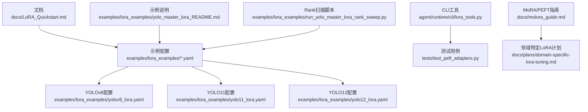
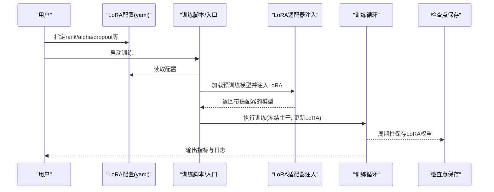
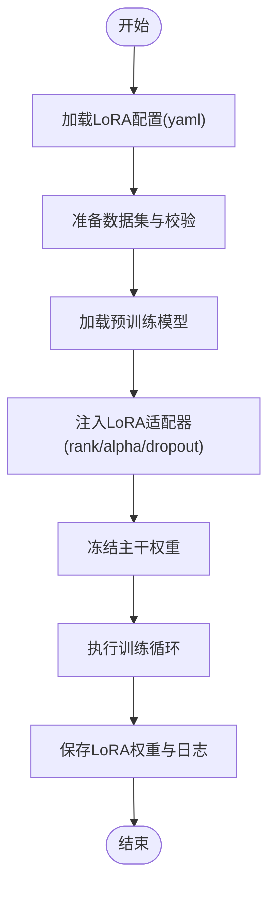
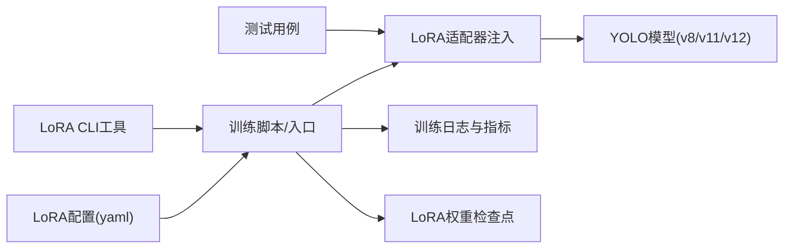

# LoRA基础入门

<cite>
**本文引用的文件**
- [LoRA_Quickstart.md](file://docs/LoRA_Quickstart.md)
- [yolo_master_lora_README.md](file://examples/lora_examples/yolo_master_lora_README.md)
- [yolov8_lora.yaml](file://examples/lora_examples/yolov8_lora.yaml)
- [yolo11_lora.yaml](file://examples/lora_examples/yolo11_lora.yaml)
- [yolo12_lora.yaml](file://examples/lora_examples/yolo12_lora.yaml)
- [run_yolo_master_lora_rank_sweep.py](file://examples/lora_examples/run_yolo_master_lora_rank_sweep.py)
- [lora_tools.py](file://agent/runtime/cli/lora_tools.py)
- [test_peft_adapters.py](file://tests/test_peft_adapters.py)
- [molora_guide.md](file://docs/molora_guide.md)
- [domain-specific-lora-tuning.md](file://docs/plans/domain-specific-lora-tuning.md)
</cite>

## 目录
1. [简介](#简介)
2. [项目结构](#项目结构)
3. [核心组件](#核心组件)
4. [架构总览](#架构总览)
5. [详细组件分析](#详细组件分析)
6. [依赖关系分析](#依赖关系分析)
7. [性能与内存优化](#性能与内存优化)
8. [常见问题排查](#常见问题排查)
9. [结论](#结论)
10. [附录：快速上手清单](#附录快速上手清单)

## 简介
本教程面向初次接触YOLO-Master中LoRA（Low-Rank Adaptation，低秩适配）的读者，目标是帮助你从零开始理解LoRA的基本原理、在YOLO系列中的落地方式，并完成一次完整的微调实践。内容涵盖：
- LoRA的核心思想：低秩矩阵分解与参数高效微调
- 环境准备：依赖安装、GPU设置与内存优化建议
- 数据准备与配置文件说明
- 训练流程与关键参数调优（rank、alpha、dropout等）
- YOLO v8/v11/v12的配置示例与最佳实践
- 常见问题定位与结果评估方法

## 项目结构
围绕LoRA能力，仓库提供了文档、示例配置、脚本与测试用例，便于快速上手与验证。下图展示了与本教程相关的核心位置与职责：

图示来源
- [LoRA_Quickstart.md:1-200](file://docs/LoRA_Quickstart.md#L1-L200)
- [yolo_master_lora_README.md:1-200](file://examples/lora_examples/yolo_master_lora_README.md#L1-L200)
- [yolov8_lora.yaml:1-200](file://examples/lora_examples/yolov8_lora.yaml#L1-L200)
- [yolo11_lora.yaml:1-200](file://examples/lora_examples/yolo11_lora.yaml#L1-L200)
- [yolo12_lora.yaml:1-200](file://examples/lora_examples/yolo12_lora.yaml#L1-L200)
- [run_yolo_master_lora_rank_sweep.py:1-200](file://examples/lora_examples/run_yolo_master_lora_rank_sweep.py#L1-L200)
- [lora_tools.py:1-200](file://agent/runtime/cli/lora_tools.py#L1-L200)
- [test_peft_adapters.py:1-200](file://tests/test_peft_adapters.py#L1-L200)
- [molora_guide.md:1-200](file://docs/molora_guide.md#L1-L200)
- [domain-specific-lora-tuning.md:1-200](file://docs/plans/domain-specific-lora-tuning.md#L1-L200)

章节来源
- [LoRA_Quickstart.md:1-200](file://docs/LoRA_Quickstart.md#L1-L200)
- [yolo_master_lora_README.md:1-200](file://examples/lora_examples/yolo_master_lora_README.md#L1-L200)

## 核心组件
- LoRA概念与要点
  - 低秩矩阵分解：将大权重增量近似为两个小矩阵的乘积，显著降低可训练参数量
  - 参数高效微调：冻结主干权重，仅训练少量LoRA适配器，兼顾效果与效率
  - 推理融合：训练完成后可将LoRA权重合并回原模型，避免额外开销
- 工程化支撑
  - 示例配置：针对YOLO v8/v11/v12提供开箱即用的LoRA配置
  - Rank扫描脚本：自动化遍历不同rank值，辅助选择合适复杂度
  - CLI工具与测试：提供LoRA相关命令与回归测试，保障稳定性

章节来源
- [yolo_master_lora_README.md:1-200](file://examples/lora_examples/yolo_master_lora_README.md#L1-L200)
- [run_yolo_master_lora_rank_sweep.py:1-200](file://examples/lora_examples/run_yolo_master_lora_rank_sweep.py#L1-L200)
- [lora_tools.py:1-200](file://agent/runtime/cli/lora_tools.py#L1-L200)
- [test_peft_adapters.py:1-200](file://tests/test_peft_adapters.py#L1-L200)

## 架构总览
下图展示从“配置”到“训练”的关键路径，以及LoRA在其中的作用点：

图示来源
- [yolo_master_lora_README.md:1-200](file://examples/lora_examples/yolo_master_lora_README.md#L1-L200)
- [yolov8_lora.yaml:1-200](file://examples/lora_examples/yolov8_lora.yaml#L1-L200)
- [yolo11_lora.yaml:1-200](file://examples/lora_examples/yolo11_lora.yaml#L1-L200)
- [yolo12_lora.yaml:1-200](file://examples/lora_examples/yolo12_lora.yaml#L1-L200)

## 详细组件分析

### LoRA基本原理与关键参数
- 低秩分解思想
  - 将权重增量ΔW近似为A×B，其中A和B维度远小于原始权重，从而减少可训练参数量
  - 推理时可通过融合将ΔW加回原权重，不引入额外延迟
- 关键参数
  - rank：低秩维数，控制可训练参数量与表达能力；越大越灵活但更耗资源
  - alpha：缩放系数，常与rank配合调节有效学习率
  - dropout：对LoRA分支的随机失活，缓解过拟合
  - target_modules：需要注入LoRA的目标模块集合，需结合具体模型结构选择
- 适用场景
  - 数据量有限或算力受限时的任务迁移
  - 多任务/多域快速适配，便于部署轻量级适配器

章节来源
- [yolo_master_lora_README.md:1-200](file://examples/lora_examples/yolo_master_lora_README.md#L1-L200)
- [domain-specific-lora-tuning.md:1-200](file://docs/plans/domain-specific-lora-tuning.md#L1-L200)

### 环境配置与GPU/内存优化
- 依赖与环境
  - 使用项目提供的示例与脚本进行训练，确保Python与PyTorch版本兼容
  - 参考README与快速开始文档完成基础环境搭建
- GPU与显存
  - 合理设置batch size与梯度累积步数，平衡吞吐与显存占用
  - 开启混合精度训练以降低显存占用并提升速度
  - 若显存不足，优先降低rank、减小输入分辨率或启用梯度检查点
- 内存优化建议
  - 关闭不必要的日志与可视化回调
  - 使用数据缓存与预取，减少I/O瓶颈
  - 定期清理中间产物与临时文件

章节来源
- [LoRA_Quickstart.md:1-200](file://docs/LoRA_Quickstart.md#L1-L200)
- [yolo_master_lora_README.md:1-200](file://examples/lora_examples/yolo_master_lora_README.md#L1-L200)

### 数据准备与数据集格式
- 推荐的数据组织
  - 图像与标注分离存放，遵循YOLO标准目录结构
  - 划分train/val子集，保证分布一致性与代表性
- 标签格式
  - 使用YOLO格式的文本标注文件，类别索引与数据集中类别定义保持一致
- 校验与可视化
  - 训练前对数据进行完整性与一致性检查
  - 抽样可视化标注框，确认坐标与类别正确

章节来源
- [yolo_master_lora_README.md:1-200](file://examples/lora_examples/yolo_master_lora_README.md#L1-L200)

### 配置文件与训练流程
- 配置文件要点
  - 指定rank、alpha、dropout等LoRA超参
  - 指定目标模块target_modules（按模型类型调整）
  - 设置数据路径、训练轮次、学习率、批量大小等常规训练项
- 训练流程
  - 加载预训练权重
  - 注入LoRA适配器
  - 冻结主干，仅训练LoRA分支
  - 周期性保存LoRA权重与训练日志
- 多版本差异
  - v8/v11/v12在目标模块与默认策略上可能略有差异，应分别参考对应配置

图示来源
- [yolov8_lora.yaml:1-200](file://examples/lora_examples/yolov8_lora.yaml#L1-L200)
- [yolo11_lora.yaml:1-200](file://examples/lora_examples/yolo11_lora.yaml#L1-L200)
- [yolo12_lora.yaml:1-200](file://examples/lora_examples/yolo12_lora.yaml#L1-L200)
- [yolo_master_lora_README.md:1-200](file://examples/lora_examples/yolo_master_lora_README.md#L1-L200)

章节来源
- [yolov8_lora.yaml:1-200](file://examples/lora_examples/yolov8_lora.yaml#L1-L200)
- [yolo11_lora.yaml:1-200](file://examples/lora_examples/yolo11_lora.yaml#L1-L200)
- [yolo12_lora.yaml:1-200](file://examples/lora_examples/yolo12_lora.yaml#L1-L200)
- [yolo_master_lora_README.md:1-200](file://examples/lora_examples/yolo_master_lora_README.md#L1-L200)

### 关键参数调优方法与最佳实践
- rank
  - 从小值起步（如4/8），逐步增大观察指标变化
  - 数据量大且复杂时可适当提高rank
- alpha
  - 通常与rank同量级或略小，用于稳定训练与加速收敛
- dropout
  - 小数据集建议适度正则化（如0.05~0.1），防止过拟合
- target_modules
  - 根据模型结构选择关键层（如注意力、卷积投影等）
  - 不同YOLO版本默认策略不同，优先参考对应配置
- 学习率与批次
  - LoRA通常可使用比全量微调更大的学习率
  - 结合梯度累积实现更大等效批大小
- 早停与验证
  - 基于验证集指标监控，避免过拟合
  - 保存最佳权重与最终权重，便于对比

章节来源
- [run_yolo_master_lora_rank_sweep.py:1-200](file://examples/lora_examples/run_yolo_master_lora_rank_sweep.py#L1-L200)
- [yolo_master_lora_README.md:1-200](file://examples/lora_examples/yolo_master_lora_README.md#L1-L200)

### YOLO v8/v11/v12 配置示例与差异
- v8
  - 参考v8专用LoRA配置，关注其默认target_modules与学习率策略
- v11
  - 参考v11专用LoRA配置，注意新结构带来的适配差异
- v12
  - 参考v12专用LoRA配置，结合最新特性调整LoRA注入位置
- 通用建议
  - 先以保守参数跑通流程，再逐步调优
  - 使用Rank扫描脚本辅助确定合适的rank范围

章节来源
- [yolov8_lora.yaml:1-200](file://examples/lora_examples/yolov8_lora.yaml#L1-L200)
- [yolo11_lora.yaml:1-200](file://examples/lora_examples/yolo11_lora.yaml#L1-L200)
- [yolo12_lora.yaml:1-200](file://examples/lora_examples/yolo12_lora.yaml#L1-L200)
- [yolo_master_lora_README.md:1-200](file://examples/lora_examples/yolo_master_lora_README.md#L1-L200)

### 训练脚本与Rank扫描
- 训练脚本
  - 通过示例说明文档了解如何启动训练、指定配置与输出目录
- Rank扫描
  - 使用Rank扫描脚本自动遍历多个rank值，生成对比结果
  - 依据指标曲线与最终结果选择最优rank

章节来源
- [yolo_master_lora_README.md:1-200](file://examples/lora_examples/yolo_master_lora_README.md#L1-L200)
- [run_yolo_master_lora_rank_sweep.py:1-200](file://examples/lora_examples/run_yolo_master_lora_rank_sweep.py#L1-L200)

### CLI工具与测试验证
- CLI工具
  - 提供LoRA相关命令，便于快速注入、导出与诊断
- 测试用例
  - 覆盖LoRA适配器注入与基本训练流程，保障功能稳定

章节来源
- [lora_tools.py:1-200](file://agent/runtime/cli/lora_tools.py#L1-L200)
- [test_peft_adapters.py:1-200](file://tests/test_peft_adapters.py#L1-L200)

## 依赖关系分析
LoRA在本项目中的依赖关系如下：

图示来源
- [yolov8_lora.yaml:1-200](file://examples/lora_examples/yolov8_lora.yaml#L1-L200)
- [yolo11_lora.yaml:1-200](file://examples/lora_examples/yolo11_lora.yaml#L1-L200)
- [yolo12_lora.yaml:1-200](file://examples/lora_examples/yolo12_lora.yaml#L1-L200)
- [lora_tools.py:1-200](file://agent/runtime/cli/lora_tools.py#L1-L200)
- [test_peft_adapters.py:1-200](file://tests/test_peft_adapters.py#L1-L200)

章节来源
- [lora_tools.py:1-200](file://agent/runtime/cli/lora_tools.py#L1-L200)
- [test_peft_adapters.py:1-200](file://tests/test_peft_adapters.py#L1-L200)

## 性能与内存优化
- 显存优化
  - 降低rank与输入分辨率
  - 使用混合精度与梯度累积
  - 关闭非必要的可视化与日志
- 训练速度
  - 增加数据并行或分布式训练规模
  - 使用更快的存储介质与数据预取
- 结果质量
  - 合理设置学习率与正则化强度
  - 采用早停与验证集监控，避免过拟合

章节来源
- [molora_guide.md:1-200](file://docs/molora_guide.md#L1-L200)
- [domain-specific-lora-tuning.md:1-200](file://docs/plans/domain-specific-lora-tuning.md#L1-L200)

## 常见问题排查
- 显存溢出
  - 现象：训练中途崩溃或报错
  - 处理：降低rank、减小batch size、开启混合精度、启用梯度检查点
- 训练不收敛或震荡
  - 现象：损失波动大、指标无改善
  - 处理：降低学习率、增大alpha或调整dropout、检查数据质量与标注一致性
- 目标模块未生效
  - 现象：LoRA未注入或无效
  - 处理：核对target_modules与模型结构匹配性，参考各版本配置示例
- 结果不稳定
  - 现象：多次训练结果差异大
  - 处理：固定随机种子、统一数据顺序、延长预热步数

章节来源
- [lora_tools.py:1-200](file://agent/runtime/cli/lora_tools.py#L1-L200)
- [test_peft_adapters.py:1-200](file://tests/test_peft_adapters.py#L1-L200)

## 结论
通过LoRA，你可以在保持YOLO主干权重的同时，以极低的参数代价完成对新任务的适配。结合本项目提供的示例配置、Rank扫描脚本与CLI工具，你可以快速完成从环境搭建到训练评估的全流程。建议在真实场景中先以保守参数跑通流程，再逐步调优rank、alpha与dropout等关键超参，以获得稳定且高效的微调效果。

## 附录：快速上手清单
- 阅读快速开始与示例说明文档，了解整体流程
- 准备符合YOLO格式的数据集，并进行完整性校验
- 选择合适的LoRA配置（v8/v11/v12），设置rank、alpha、dropout等
- 启动训练，监控日志与验证指标
- 使用Rank扫描脚本探索合适的rank范围
- 保存并评估最佳LoRA权重，必要时进行融合导出

章节来源
- [LoRA_Quickstart.md:1-200](file://docs/LoRA_Quickstart.md#L1-L200)
- [yolo_master_lora_README.md:1-200](file://examples/lora_examples/yolo_master_lora_README.md#L1-L200)
- [yolov8_lora.yaml:1-200](file://examples/lora_examples/yolov8_lora.yaml#L1-L200)
- [yolo11_lora.yaml:1-200](file://examples/lora_examples/yolo11_lora.yaml#L1-L200)
- [yolo12_lora.yaml:1-200](file://examples/lora_examples/yolo12_lora.yaml#L1-L200)
- [run_yolo_master_lora_rank_sweep.py:1-200](file://examples/lora_examples/run_yolo_master_lora_rank_sweep.py#L1-L200)