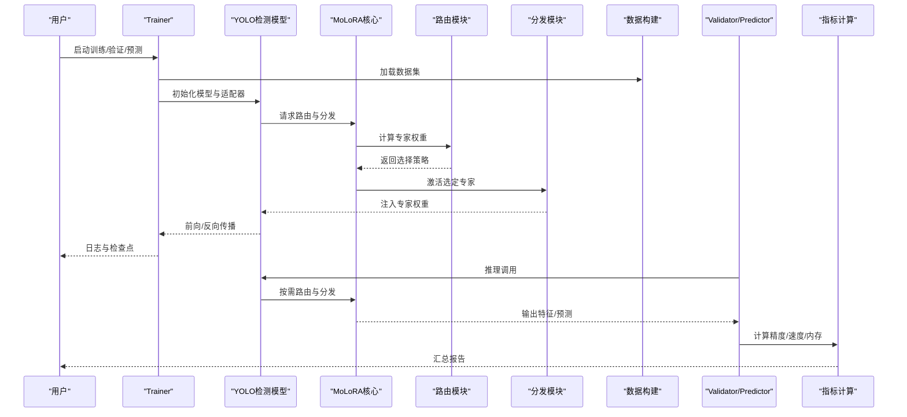
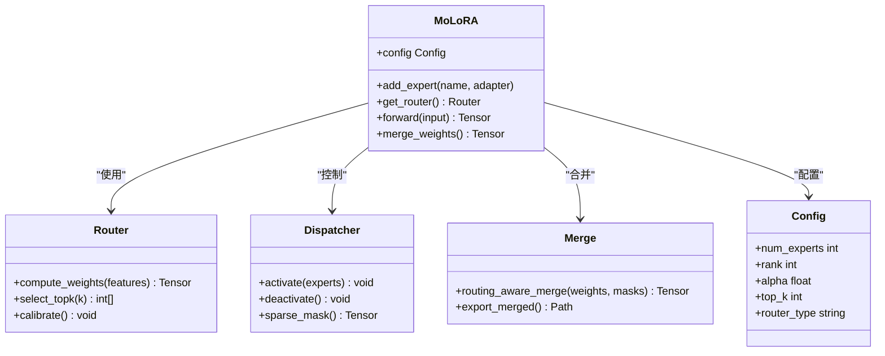
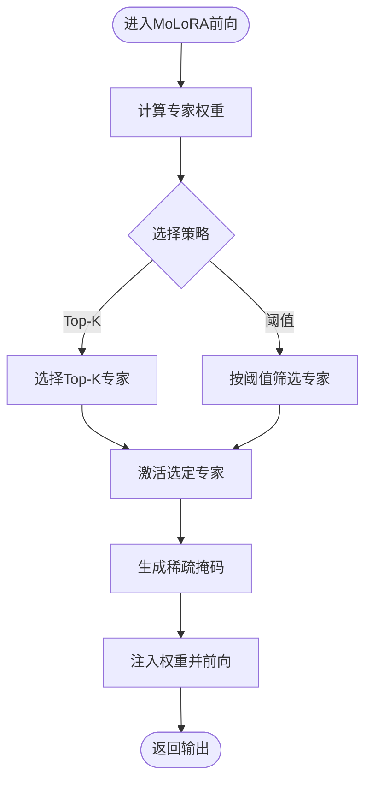
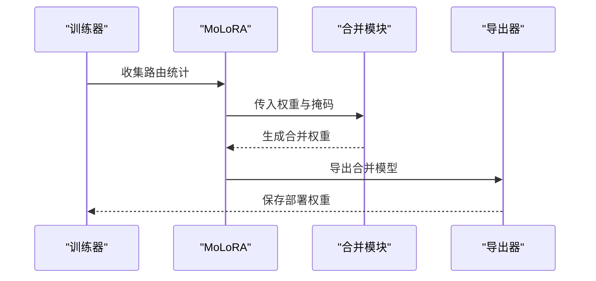
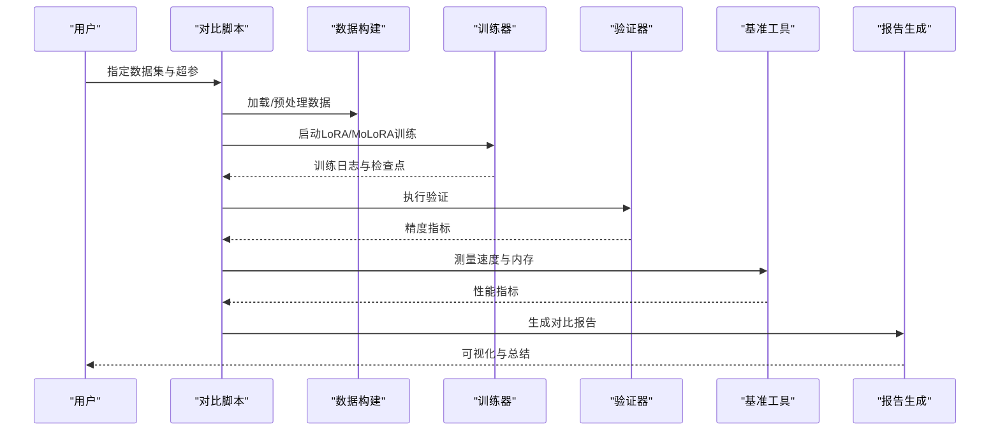
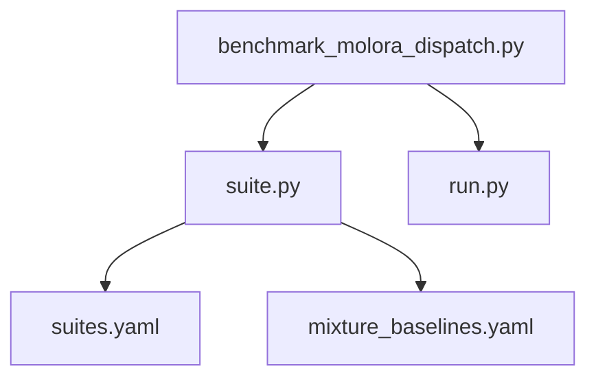
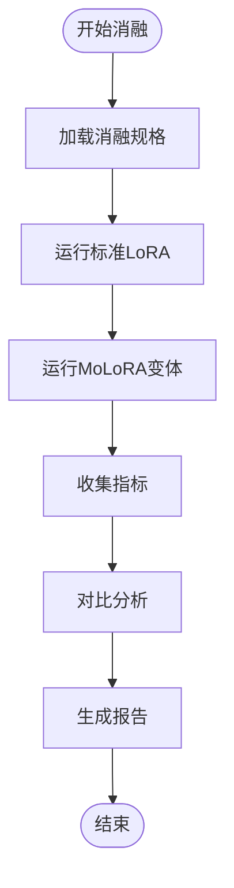
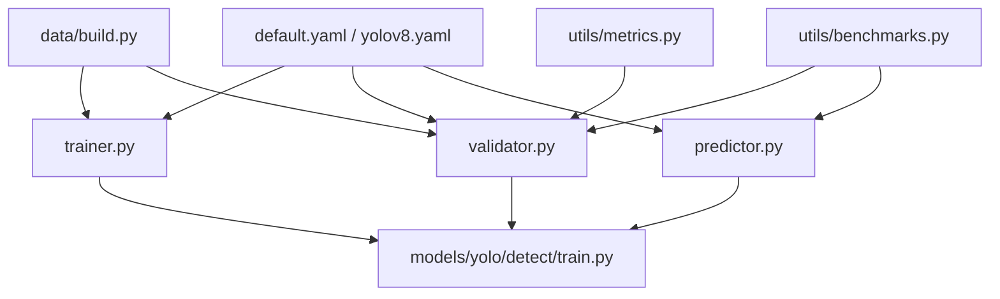

# MoLoRA对比实验

<cite>
**本文引用的文件**
- [examples/molora/compare_lora_molora.py](file://examples/molora/compare_lora_molora.py)
- [examples/molora/compare_coco128.py](file://examples/molora/compare_coco128.py)
- [examples/molora/compare_coco128_fast.py](file://examples/molora/compare_coco128_fast.py)
- [examples/molora/basic_finetune.py](file://examples/molora/basic_finetune.py)
- [examples/molora/continual_learning.py](file://examples/molora/continual_learning.py)
- [benchmarks/benchmark_molora_dispatch.py](file://benchmarks/benchmark_molora_dispatch.py)
- [benchmarks/run.py](file://benchmarks/run.py)
- [benchmarks/suite.py](file://benchmarks/suite.py)
- [benchmarks/suites.yaml](file://benchmarks/suites.yaml)
- [benchmarks/mixture_baselines.yaml](file://benchmarks/mixture_baselines.yaml)
- [scripts/ablation_suite/ablation_molora_full.py](file://scripts/ablation_suite/ablation_molora_full.py)
- [scripts/ablation_suite/full_ablation.py](file://scripts/ablation_suite/full_ablation.py)
- [scripts/ablation_suite/full_ablation_spec.py](file://scripts/ablation_suite/full_ablation_spec.py)
- [tests/test_molora.py](file://tests/test_molora.py)
- [tests/test_molora_routing_aware_merge.py](file://tests/test_molora_routing_aware_merge.py)
- [tests/test_molora_sparse_dispatch.py](file://tests/test_molora_sparse_dispatch.py)
- [ultralytics/utils/lora/__init__.py](file://ultralytics/utils/lora/__init__.py)
- [ultralytics/utils/lora/molora.py](file://ultralytics/utils/lora/molora.py)
- [ultralytics/utils/lora/routing.py](file://ultralytics/utils/lora/routing.py)
- [ultralytics/utils/lora/dispatch.py](file://ultralytics/utils/lora/dispatch.py)
- [ultralytics/utils/lora/merge.py](file://ultralytics/utils/lora/merge.py)
- [ultralytics/utils/lora/config.py](file://ultralytics/utils/lora/config.py)
- [ultralytics/engine/trainer.py](file://ultralytics/engine/trainer.py)
- [ultralytics/engine/validator.py](file://ultralytics/engine/validator.py)
- [ultralytics/engine/predictor.py](file://ultralytics/engine/predictor.py)
- [ultralytics/models/yolo/detect/train.py](file://ultralytics/models/yolo/detect/train.py)
- [ultralytics/models/yolo/detect/val.py](file://ultralytics/models/yolo/detect/val.py)
- [ultralytics/models/yolo/detect/predict.py](file://ultralytics/models/yolo/detect/predict.py)
- [ultralytics/cfg/default.yaml](file://ultralytics/cfg/default.yaml)
- [ultralytics/cfg/models/yolo/yolov8.yaml](file://ultralytics/cfg/models/yolo/yolov8.yaml)
- [ultralytics/data/build.py](file://ultralytics/data/build.py)
- [ultralytics/utils/benchmarks.py](file://ultralytics/utils/benchmarks.py)
- [ultralytics/utils/metrics.py](file://ultralytics/utils/metrics.py)
- [docs/molora_guide.md](file://docs/molora_guide.md)
</cite>

## 目录
1. [简介](#简介)
2. [项目结构](#项目结构)
3. [核心组件](#核心组件)
4. [架构总览](#架构总览)
5. [详细组件分析](#详细组件分析)
6. [依赖关系分析](#依赖关系分析)
7. [性能考量](#性能考量)
8. [故障排查指南](#故障排查指南)
9. [结论](#结论)
10. [附录](#附录)

## 简介
本指南面向希望在YOLO-Master中开展MoLoRA（Mixture of LoRA Adapters）与标准LoRA对比实验的研究者与工程师。文档从技术原理、实验设置、运行流程、指标体系、自动化报告生成到部署建议，提供端到端的可操作说明，帮助你在不同数据集上复现并扩展MoLoRA的对比结果。

## 项目结构
围绕MoLoRA与LoRA对比的关键代码分布在以下位置：
- 示例脚本：examples/molora 下提供多组对比与快速验证脚本
- 基准测试：benchmarks 下提供调度与套件化基准入口
- 消融与全量脚本：scripts/ablation_suite 下提供完整消融与场景化脚本
- 单元测试：tests 下覆盖路由、合并、稀疏调度等关键路径
- 核心实现：ultralytics/utils/lora 下包含MoLoRA配置、路由、分发、合并等模块
- 训练/推理管线：ultralytics/engine 与 ultralytics/models/yolo/detect 集成适配器
- 数据与指标：ultralytics/data/build.py 与 ultralytics/utils/metrics.py
- 文档：docs/molora_guide.md 提供概念性说明与使用指引

```mermaid
graph TB
subgraph "示例与脚本"
A["examples/molora/compare_lora_molora.py"]
B["examples/molora/compare_coco128.py"]
C["examples/molora/compare_coco128_fast.py"]
D["examples/molora/basic_finetune.py"]
E["examples/molora/continual_learning.py"]
end
subgraph "基准套件"
F["benchmarks/benchmark_molora_dispatch.py"]
G["benchmarks/run.py"]
H["benchmarks/suite.py"]
I["benchmarks/suites.yaml"]
J["benchmarks/mixture_baselines.yaml"]
end
subgraph "消融与全量"
K["scripts/ablation_suite/ablation_molora_full.py"]
L["scripts/ablation_suite/full_ablation.py"]
M["scripts/ablation_suite/full_ablation_spec.py"]
end
subgraph "核心实现"
N["ultralytics/utils/lora/molora.py"]
O["ultralytics/utils/lora/routing.py"]
P["ultralytics/utils/lora/dispatch.py"]
Q["ultralytics/utils/lora/merge.py"]
R["ultralytics/utils/lora/config.py"]
end
subgraph "训练/推理"
S["ultralytics/engine/trainer.py"]
T["ultralytics/engine/validator.py"]
U["ultralytics/engine/predictor.py"]
V["ultralytics/models/yolo/detect/train.py"]
W["ultralytics/models/yolo/detect/val.py"]
X["ultralytics/models/yolo/detect/predict.py"]
end
subgraph "数据与指标"
Y["ultralytics/data/build.py"]
Z["ultralytics/utils/metrics.py"]
end
A --> N
B --> N
C --> N
D --> N
E --> N
F --> P
G --> H
H --> I
H --> J
K --> N
L --> N
M --> N
N --> O
N --> P
N --> Q
N --> R
S --> N
T --> N
U --> N
V --> S
W --> T
X --> U
Y --> S
Z --> T
```

图表来源
- [examples/molora/compare_lora_molora.py:1-200](file://examples/molora/compare_lora_molora.py#L1-L200)
- [benchmarks/benchmark_molora_dispatch.py:1-200](file://benchmarks/benchmark_molora_dispatch.py#L1-L200)
- [benchmarks/run.py:1-200](file://benchmarks/run.py#L1-L200)
- [benchmarks/suite.py:1-200](file://benchmarks/suite.py#L1-L200)
- [benchmarks/suites.yaml:1-200](file://benchmarks/suites.yaml#L1-L200)
- [benchmarks/mixture_baselines.yaml:1-200](file://benchmarks/mixture_baselines.yaml#L1-L200)
- [scripts/ablation_suite/ablation_molora_full.py:1-200](file://scripts/ablation_suite/ablation_molora_full.py#L1-L200)
- [scripts/ablation_suite/full_ablation.py:1-200](file://scripts/ablation_suite/full_ablation.py#L1-L200)
- [scripts/ablation_suite/full_ablation_spec.py:1-200](file://scripts/ablation_suite/full_ablation_spec.py#L1-L200)
- [ultralytics/utils/lora/molora.py:1-200](file://ultralytics/utils/lora/molora.py#L1-L200)
- [ultralytics/utils/lora/routing.py:1-200](file://ultralytics/utils/lora/routing.py#L1-L200)
- [ultralytics/utils/lora/dispatch.py:1-200](file://ultralytics/utils/lora/dispatch.py#L1-L200)
- [ultralytics/utils/lora/merge.py:1-200](file://ultralytics/utils/lora/merge.py#L1-L200)
- [ultralytics/utils/lora/config.py:1-200](file://ultralytics/utils/lora/config.py#L1-L200)
- [ultralytics/engine/trainer.py:1-200](file://ultralytics/engine/trainer.py#L1-L200)
- [ultralytics/engine/validator.py:1-200](file://ultralytics/engine/validator.py#L1-L200)
- [ultralytics/engine/predictor.py:1-200](file://ultralytics/engine/predictor.py#L1-L200)
- [ultralytics/models/yolo/detect/train.py:1-200](file://ultralytics/models/yolo/detect/train.py#L1-L200)
- [ultralytics/models/yolo/detect/val.py:1-200](file://ultralytics/models/yolo/detect/val.py#L1-L200)
- [ultralytics/models/yolo/detect/predict.py:1-200](file://ultralytics/models/yolo/detect/predict.py#L1-L200)
- [ultralytics/data/build.py:1-200](file://ultralytics/data/build.py#L1-L200)
- [ultralytics/utils/metrics.py:1-200](file://ultralytics/utils/metrics.py#L1-L200)

章节来源
- [examples/molora/compare_lora_molora.py:1-200](file://examples/molora/compare_lora_molora.py#L1-L200)
- [benchmarks/benchmark_molora_dispatch.py:1-200](file://benchmarks/benchmark_molora_dispatch.py#L1-L200)
- [scripts/ablation_suite/ablation_molora_full.py:1-200](file://scripts/ablation_suite/ablation_molora_full.py#L1-L200)
- [ultralytics/utils/lora/molora.py:1-200](file://ultralytics/utils/lora/molora.py#L1-L200)
- [ultralytics/engine/trainer.py:1-200](file://ultralytics/engine/trainer.py#L1-L200)
- [ultralytics/utils/metrics.py:1-200](file://ultralytics/utils/metrics.py#L1-L200)

## 核心组件
- MoLoRA核心模块
  - molora.py：定义多适配器结构与组合策略
  - routing.py：动态路由机制与专家选择策略
  - dispatch.py：稀疏分发与激活控制
  - merge.py：路由感知合并与权重融合
  - config.py：MoLoRA超参数与注册表
- 训练/推理集成
  - trainer.py/validator.py/predictor.py：在训练、验证与预测阶段接入MoLoRA
  - models/yolo/detect/*：任务级封装，统一调用引擎层
- 基准与套件
  - benchmark_molora_dispatch.py：针对MoLoRA调度的基准
  - run.py/suite.py/suites.yaml/mixture_baselines.yaml：基准套件与基线配置
- 消融与全量脚本
  - ablation_molora_full.py/full_ablation.py/full_ablation_spec.py：系统化对比与场景化评估
- 数据与指标
  - data/build.py：数据集构建与加载
  - utils/metrics.py：精度、速度、内存等指标计算

章节来源
- [ultralytics/utils/lora/molora.py:1-200](file://ultralytics/utils/lora/molora.py#L1-L200)
- [ultralytics/utils/lora/routing.py:1-200](file://ultralytics/utils/lora/routing.py#L1-L200)
- [ultralytics/utils/lora/dispatch.py:1-200](file://ultralytics/utils/lora/dispatch.py#L1-L200)
- [ultralytics/utils/lora/merge.py:1-200](file://ultralytics/utils/lora/merge.py#L1-L200)
- [ultralytics/utils/lora/config.py:1-200](file://ultralytics/utils/lora/config.py#L1-L200)
- [ultralytics/engine/trainer.py:1-200](file://ultralytics/engine/trainer.py#L1-L200)
- [ultralytics/engine/validator.py:1-200](file://ultralytics/engine/validator.py#L1-L200)
- [ultralytics/engine/predictor.py:1-200](file://ultralytics/engine/predictor.py#L1-L200)
- [ultralytics/models/yolo/detect/train.py:1-200](file://ultralytics/models/yolo/detect/train.py#L1-L200)
- [ultralytics/models/yolo/detect/val.py:1-200](file://ultralytics/models/yolo/detect/val.py#L1-L200)
- [ultralytics/models/yolo/detect/predict.py:1-200](file://ultralytics/models/yolo/detect/predict.py#L1-L200)
- [ultralytics/data/build.py:1-200](file://ultralytics/data/build.py#L1-L200)
- [ultralytics/utils/metrics.py:1-200](file://ultralytics/utils/metrics.py#L1-L200)

## 架构总览
下图展示MoLoRA在训练与推理中的整体交互：训练时通过trainer加载数据与模型，按路由选择专家进行前向与反向；验证与预测阶段由validator/predictor执行，结合dispatch进行稀疏激活，最终输出指标或检测结果。

图表来源
- [ultralytics/engine/trainer.py:1-200](file://ultralytics/engine/trainer.py#L1-L200)
- [ultralytics/engine/validator.py:1-200](file://ultralytics/engine/validator.py#L1-L200)
- [ultralytics/engine/predictor.py:1-200](file://ultralytics/engine/predictor.py#L1-L200)
- [ultralytics/utils/lora/molora.py:1-200](file://ultralytics/utils/lora/molora.py#L1-L200)
- [ultralytics/utils/lora/routing.py:1-200](file://ultralytics/utils/lora/routing.py#L1-L200)
- [ultralytics/utils/lora/dispatch.py:1-200](file://ultralytics/utils/lora/dispatch.py#L1-L200)
- [ultralytics/data/build.py:1-200](file://ultralytics/data/build.py#L1-L200)
- [ultralytics/utils/metrics.py:1-200](file://ultralytics/utils/metrics.py#L1-L200)

## 详细组件分析

### MoLoRA核心类与关系
MoLoRA将多个LoRA适配器组织为“专家”，并通过路由与分发机制在训练与推理中动态选择与激活。

图表来源
- [ultralytics/utils/lora/molora.py:1-200](file://ultralytics/utils/lora/molora.py#L1-L200)
- [ultralytics/utils/lora/routing.py:1-200](file://ultralytics/utils/lora/routing.py#L1-L200)
- [ultralytics/utils/lora/dispatch.py:1-200](file://ultralytics/utils/lora/dispatch.py#L1-L200)
- [ultralytics/utils/lora/merge.py:1-200](file://ultralytics/utils/lora/merge.py#L1-L200)
- [ultralytics/utils/lora/config.py:1-200](file://ultralytics/utils/lora/config.py#L1-L200)

章节来源
- [ultralytics/utils/lora/molora.py:1-200](file://ultralytics/utils/lora/molora.py#L1-L200)
- [ultralytics/utils/lora/routing.py:1-200](file://ultralytics/utils/lora/routing.py#L1-L200)
- [ultralytics/utils/lora/dispatch.py:1-200](file://ultralytics/utils/lora/dispatch.py#L1-L200)
- [ultralytics/utils/lora/merge.py:1-200](file://ultralytics/utils/lora/merge.py#L1-L200)
- [ultralytics/utils/lora/config.py:1-200](file://ultralytics/utils/lora/config.py#L1-L200)

### 动态路由与专家选择流程
MoLoRA在每次前向时根据输入特征计算专家权重，并按策略选择Top-K专家进行激活，从而降低计算开销并提升适配能力。

图表来源
- [ultralytics/utils/lora/routing.py:1-200](file://ultralytics/utils/lora/routing.py#L1-L200)
- [ultralytics/utils/lora/dispatch.py:1-200](file://ultralytics/utils/lora/dispatch.py#L1-L200)
- [ultralytics/utils/lora/molora.py:1-200](file://ultralytics/utils/lora/molora.py#L1-L200)

章节来源
- [ultralytics/utils/lora/routing.py:1-200](file://ultralytics/utils/lora/routing.py#L1-L200)
- [ultralytics/utils/lora/dispatch.py:1-200](file://ultralytics/utils/lora/dispatch.py#L1-L200)
- [ultralytics/utils/lora/molora.py:1-200](file://ultralytics/utils/lora/molora.py#L1-L200)

### 路由感知合并与导出
在需要固定权重的部署场景，MoLoRA支持基于路由统计的路径感知合并，以保留多专家贡献的同时减少运行时开销。

图表来源
- [ultralytics/utils/lora/merge.py:1-200](file://ultralytics/utils/lora/merge.py#L1-L200)
- [ultralytics/utils/lora/molora.py:1-200](file://ultralytics/utils/lora/molora.py#L1-L200)

章节来源
- [ultralytics/utils/lora/merge.py:1-200](file://ultralytics/utils/lora/merge.py#L1-L200)
- [ultralytics/utils/lora/molora.py:1-200](file://ultralytics/utils/lora/molora.py#L1-L200)

### 对比实验脚本与运行流程
- 对比主脚本：examples/molora/compare_lora_molora.py
  - 功能：在同一数据集与超参下运行标准LoRA与MoLoRA，收集精度、速度与内存指标
  - 关键步骤：数据准备、配置解析、训练/验证循环、结果汇总
- 快速验证脚本：examples/molora/compare_coco128.py 与 compare_coco128_fast.py
  - 功能：针对COCO128的快速对比，便于本地调试
- 基础微调与持续学习：basic_finetune.py 与 continual_learning.py
  - 功能：演示单任务微调与多任务持续学习下的MoLoRA用法

图表来源
- [examples/molora/compare_lora_molora.py:1-200](file://examples/molora/compare_lora_molora.py#L1-L200)
- [examples/molora/compare_coco128.py:1-200](file://examples/molora/compare_coco128.py#L1-L200)
- [examples/molora/compare_coco128_fast.py:1-200](file://examples/molora/compare_coco128_fast.py#L1-L200)
- [examples/molora/basic_finetune.py:1-200](file://examples/molora/basic_finetune.py#L1-L200)
- [examples/molora/continual_learning.py:1-200](file://examples/molora/continual_learning.py#L1-L200)
- [ultralytics/data/build.py:1-200](file://ultralytics/data/build.py#L1-L200)
- [ultralytics/utils/benchmarks.py:1-200](file://ultralytics/utils/benchmarks.py#L1-L200)

章节来源
- [examples/molora/compare_lora_molora.py:1-200](file://examples/molora/compare_lora_molora.py#L1-L200)
- [examples/molora/compare_coco128.py:1-200](file://examples/molora/compare_coco128.py#L1-L200)
- [examples/molora/compare_coco128_fast.py:1-200](file://examples/molora/compare_coco128_fast.py#L1-L200)
- [examples/molora/basic_finetune.py:1-200](file://examples/molora/basic_finetune.py#L1-L200)
- [examples/molora/continual_learning.py:1-200](file://examples/molora/continual_learning.py#L1-L200)
- [ultralytics/data/build.py:1-200](file://ultralytics/data/build.py#L1-L200)
- [ultralytics/utils/benchmarks.py:1-200](file://ultralytics/utils/benchmarks.py#L1-L200)

### 基准套件与基线配置
- benchmark_molora_dispatch.py：聚焦MoLoRA调度路径的性能测量
- run.py/suite.py：基准套件编排与任务调度
- suites.yaml/mixture_baselines.yaml：套件与基线配置，统一数据集、超参与评估项

图表来源
- [benchmarks/benchmark_molora_dispatch.py:1-200](file://benchmarks/benchmark_molora_dispatch.py#L1-L200)
- [benchmarks/suite.py:1-200](file://benchmarks/suite.py#L1-L200)
- [benchmarks/suites.yaml:1-200](file://benchmarks/suites.yaml#L1-L200)
- [benchmarks/mixture_baselines.yaml:1-200](file://benchmarks/mixture_baselines.yaml#L1-L200)
- [benchmarks/run.py:1-200](file://benchmarks/run.py#L1-L200)

章节来源
- [benchmarks/benchmark_molora_dispatch.py:1-200](file://benchmarks/benchmark_molora_dispatch.py#L1-L200)
- [benchmarks/suite.py:1-200](file://benchmarks/suite.py#L1-L200)
- [benchmarks/suites.yaml:1-200](file://benchmarks/suites.yaml#L1-L200)
- [benchmarks/mixture_baselines.yaml:1-200](file://benchmarks/mixture_baselines.yaml#L1-L200)
- [benchmarks/run.py:1-200](file://benchmarks/run.py#L1-L200)

### 消融与全量对比
- ablation_molora_full.py：MoLoRA全量消融，覆盖路由类型、专家数量、rank与alpha等
- full_ablation.py/full_ablation_spec.py：通用消融框架与规格化配置，便于跨任务对比

图表来源
- [scripts/ablation_suite/ablation_molora_full.py:1-200](file://scripts/ablation_suite/ablation_molora_full.py#L1-L200)
- [scripts/ablation_suite/full_ablation.py:1-200](file://scripts/ablation_suite/full_ablation.py#L1-L200)
- [scripts/ablation_suite/full_ablation_spec.py:1-200](file://scripts/ablation_suite/full_ablation_spec.py#L1-L200)

章节来源
- [scripts/ablation_suite/ablation_molora_full.py:1-200](file://scripts/ablation_suite/ablation_molora_full.py#L1-L200)
- [scripts/ablation_suite/full_ablation.py:1-200](file://scripts/ablation_suite/full_ablation.py#L1-L200)
- [scripts/ablation_suite/full_ablation_spec.py:1-200](file://scripts/ablation_suite/full_ablation_spec.py#L1-L200)

### 单元测试与正确性保障
- test_molora.py：核心功能与接口契约测试
- test_molora_routing_aware_merge.py：路由感知合并的正确性与数值稳定性
- test_molora_sparse_dispatch.py：稀疏分发的行为与边界条件

章节来源
- [tests/test_molora.py:1-200](file://tests/test_molora.py#L1-L200)
- [tests/test_molora_routing_aware_merge.py:1-200](file://tests/test_molora_routing_aware_merge.py#L1-L200)
- [tests/test_molora_sparse_dispatch.py:1-200](file://tests/test_molora_sparse_dispatch.py#L1-L200)

## 依赖关系分析
MoLoRA与LoRA对比涉及多层依赖：
- 配置层：default.yaml与模型配置文件提供默认超参与任务设定
- 数据层：data/build.py负责数据集构建与加载
- 训练/推理层：engine与models/yolo/detect封装训练、验证与预测流程
- 指标层：utils/metrics.py与utils/benchmarks.py提供精度、速度与内存度量

图表来源
- [ultralytics/cfg/default.yaml:1-200](file://ultralytics/cfg/default.yaml#L1-L200)
- [ultralytics/cfg/models/yolo/yolov8.yaml:1-200](file://ultralytics/cfg/models/yolo/yolov8.yaml#L1-L200)
- [ultralytics/data/build.py:1-200](file://ultralytics/data/build.py#L1-L200)
- [ultralytics/engine/trainer.py:1-200](file://ultralytics/engine/trainer.py#L1-L200)
- [ultralytics/engine/validator.py:1-200](file://ultralytics/engine/validator.py#L1-L200)
- [ultralytics/engine/predictor.py:1-200](file://ultralytics/engine/predictor.py#L1-L200)
- [ultralytics/models/yolo/detect/train.py:1-200](file://ultralytics/models/yolo/detect/train.py#L1-L200)
- [ultralytics/models/yolo/detect/val.py:1-200](file://ultralytics/models/yolo/detect/val.py#L1-L200)
- [ultralytics/models/yolo/detect/predict.py:1-200](file://ultralytics/models/yolo/detect/predict.py#L1-L200)
- [ultralytics/utils/metrics.py:1-200](file://ultralytics/utils/metrics.py#L1-L200)
- [ultralytics/utils/benchmarks.py:1-200](file://ultralytics/utils/benchmarks.py#L1-L200)

章节来源
- [ultralytics/cfg/default.yaml:1-200](file://ultralytics/cfg/default.yaml#L1-L200)
- [ultralytics/cfg/models/yolo/yolov8.yaml:1-200](file://ultralytics/cfg/models/yolo/yolov8.yaml#L1-L200)
- [ultralytics/data/build.py:1-200](file://ultralytics/data/build.py#L1-L200)
- [ultralytics/engine/trainer.py:1-200](file://ultralytics/engine/trainer.py#L1-L200)
- [ultralytics/engine/validator.py:1-200](file://ultralytics/engine/validator.py#L1-L200)
- [ultralytics/engine/predictor.py:1-200](file://ultralytics/engine/predictor.py#L1-L200)
- [ultralytics/models/yolo/detect/train.py:1-200](file://ultralytics/models/yolo/detect/train.py#L1-L200)
- [ultralytics/models/yolo/detect/val.py:1-200](file://ultralytics/models/yolo/detect/val.py#L1-L200)
- [ultralytics/models/yolo/detect/predict.py:1-200](file://ultralytics/models/yolo/detect/predict.py#L1-L200)
- [ultralytics/utils/metrics.py:1-200](file://ultralytics/utils/metrics.py#L1-L200)
- [ultralytics/utils/benchmarks.py:1-200](file://ultralytics/utils/benchmarks.py#L1-L200)

## 性能考量
- 精度提升：在多专家与动态路由下，MoLoRA通常能更好地拟合复杂分布，尤其在长尾类别与小样本场景
- 推理速度：稀疏激活可降低计算量，但路由与分发存在额外开销；需权衡Top-K与专家规模
- 内存占用：多适配器增加显存峰值；合并后可显著降低部署内存
- 训练效率：MoLoRA的反向传播路径更复杂，需关注梯度稳定与学习率调度

[本节为通用指导，不直接分析具体文件]

## 故障排查指南
- 路由不稳定或NaN
  - 检查路由权重归一化与校准逻辑
  - 参考路由相关测试用例定位问题
- 合并后精度下降
  - 确认路由统计是否充分采集
  - 调整合并策略与阈值
- 稀疏分发异常
  - 验证掩码生成与专家激活顺序
  - 检查边界条件与空激活处理

章节来源
- [tests/test_molora.py:1-200](file://tests/test_molora.py#L1-L200)
- [tests/test_molora_routing_aware_merge.py:1-200](file://tests/test_molora_routing_aware_merge.py#L1-L200)
- [tests/test_molora_sparse_dispatch.py:1-200](file://tests/test_molora_sparse_dispatch.py#L1-L200)

## 结论
MoLoRA通过多适配器与动态路由在保持低参数量的同时提升了模型适配能力。对比实验应统一数据与超参，系统性地评估精度、速度、内存与训练效率。结合路由感知合并可在部署阶段获得更好的性价比。建议在长尾与小样本场景中优先尝试MoLoRA，并在资源受限环境下谨慎选择Top-K与专家规模。

[本节为总结性内容，不直接分析具体文件]

## 附录
- 快速上手
  - 使用examples/molora/compare_coco128.py或compare_coco128_fast.py进行本地快速验证
  - 使用examples/molora/compare_lora_molora.py进行完整对比
- 数据集准备
  - 依据ultralytics/data/build.py的配置要求准备YAML与标注格式
- 超参建议
  - 从ultralytics/cfg/default.yaml与yolov8.yaml获取默认值，再按任务调整
- 指标与可视化
  - 使用ultralytics/utils/metrics.py与utils/benchmarks.py收集指标
  - 参考docs/molora_guide.md了解可视化与解读方法

章节来源
- [examples/molora/compare_coco128.py:1-200](file://examples/molora/compare_coco128.py#L1-L200)
- [examples/molora/compare_coco128_fast.py:1-200](file://examples/molora/compare_coco128_fast.py#L1-L200)
- [examples/molora/compare_lora_molora.py:1-200](file://examples/molora/compare_lora_molora.py#L1-L200)
- [ultralytics/data/build.py:1-200](file://ultralytics/data/build.py#L1-L200)
- [ultralytics/cfg/default.yaml:1-200](file://ultralytics/cfg/default.yaml#L1-L200)
- [ultralytics/cfg/models/yolo/yolov8.yaml:1-200](file://ultralytics/cfg/models/yolo/yolov8.yaml#L1-L200)
- [ultralytics/utils/metrics.py:1-200](file://ultralytics/utils/metrics.py#L1-L200)
- [ultralytics/utils/benchmarks.py:1-200](file://ultralytics/utils/benchmarks.py#L1-L200)
- [docs/molora_guide.md:1-200](file://docs/molora_guide.md#L1-L200)