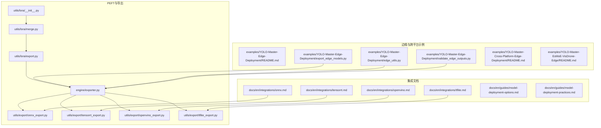
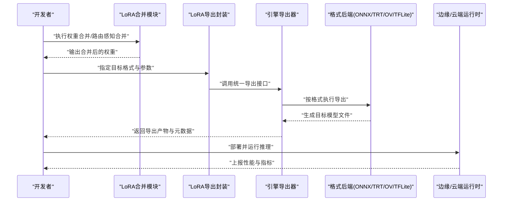
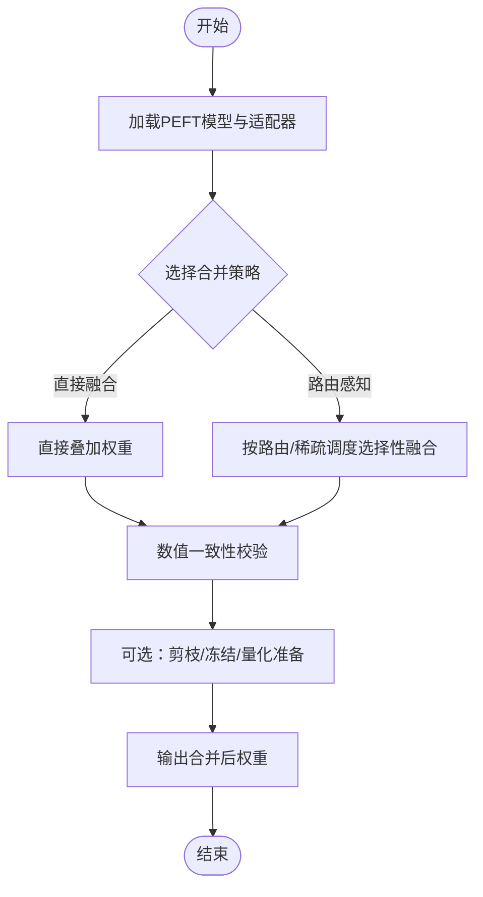
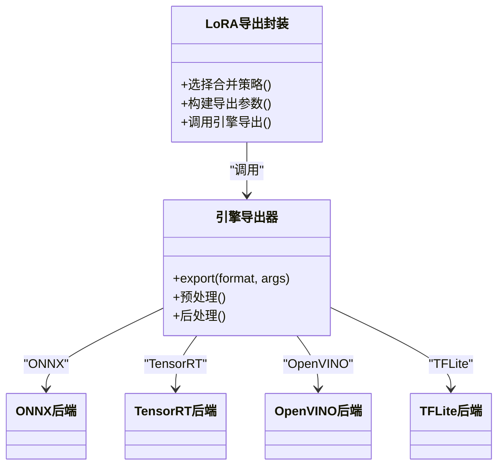
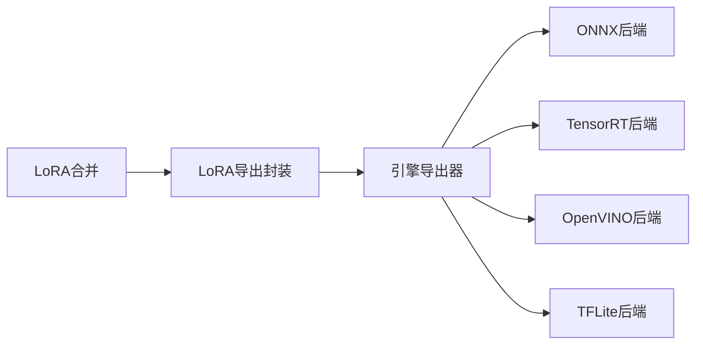

# PEFT模型部署

<cite>
**本文引用的文件**
- [ultralytics/utils/lora/__init__.py](file://ultralytics/utils/lora/__init__.py)
- [ultralytics/utils/lora/merge.py](file://ultralytics/utils/lora/merge.py)
- [ultralytics/utils/lora/export.py](file://ultralytics/utils/lora/export.py)
- [ultralytics/engine/exporter.py](file://ultralytics/engine/exporter.py)
- [ultralytics/utils/export/onnx_export.py](file://ultralytics/utils/export/onnx_export.py)
- [ultralytics/utils/export/tensorrt_export.py](file://ultralytics/utils/export/tensorrt_export.py)
- [ultralytics/utils/export/openvino_export.py](file://ultralytics/utils/export/openvino_export.py)
- [ultralytics/utils/export/tflite_export.py](file://ultralytics/utils/export/tflite_export.py)
- [examples/YOLO-Master-Cross-Platform-Edge-Deployment/README.md](file://examples/YOLO-Master-Cross-Platform-Edge-Deployment/README.md)
- [examples/YOLO-Master-Edge-Deployment/README.md](file://examples/YOLO-Master-Edge-Deployment/README.md)
- [examples/YOLO-Master-Edge-Deployment/export_edge_models.py](file://examples/YOLO-Master-Edge-Deployment/export_edge_models.py)
- [examples/YOLO-Master-Edge-Deployment/edge_utils.py](file://examples/YOLO-Master-Edge-Deployment/edge_utils.py)
- [examples/YOLO-Master-Edge-Deployment/validate_edge_outputs.py](file://examples/YOLO-Master-Edge-Deployment/validate_edge_outputs.py)
- [examples/YOLO-Master-EsMoE-VisDrone-Edge/README.md](file://examples/YOLO-Master-EsMoE-VisDrone-Edge/README.md)
- [examples/YOLOv8-TFLite-Python/main.py](file://examples/YOLOv8-TFLite-Python/main.py)
- [examples/YOLOv8-OpenVINO-CPP-Inference/main.cc](file://examples/YOLOv8-OpenVINO-CPP-Inference/main.cc)
- [examples/YOLO11-Triton-CPP/main.cpp](file://examples/YOLO11-Triton-CPP/main.cpp)
- [docker/Dockerfile](file://docker/Dockerfile)
- [scripts/peft_validation/run_peft_compare.py](file://scripts/peft_validation/run_peft_compare.py)
- [tests/test_molora_merge_semantics.py](file://tests/test_molora_merge_semantics.py)
- [tests/test_molora_routing_aware_merge.py](file://tests/test_molora_routing_aware_merge.py)
- [tests/test_peft_adapters.py](file://tests/test_peft_adapters.py)
- [benchmarks/suite.py](file://benchmarks/suite.py)
- [benchmarks/benchmark_molora_dispatch.py](file://benchmarks/benchmark_molora_dispatch.py)
- [docs/en/guides/model-deployment-options.md](file://docs/en/guides/model-deployment-options.md)
- [docs/en/guides/model-deployment-practices.md](file://docs/en/guides/model-deployment-practices.md)
- [docs/en/integrations/onnx.md](file://docs/en/integrations/onnx.md)
- [docs/en/integrations/tensorrt.md](file://docs/en/integrations/tensorrt.md)
- [docs/en/integrations/openvino.md](file://docs/en/integrations/openvino.md)
- [docs/en/integrations/tflite.md](file://docs/en/integrations/tflite.md)
</cite>

## 目录
1. [简介](#简介)
2. [项目结构](#项目结构)
3. [核心组件](#核心组件)
4. [架构总览](#架构总览)
5. [详细组件分析](#详细组件分析)
6. [依赖关系分析](#依赖关系分析)
7. [性能与优化](#性能与优化)
8. [故障诊断与监控](#故障诊断与监控)
9. [结论](#结论)
10. [附录](#附录)

## 简介
本指南面向YOLO-Master的PEFT（以LoRA为主）模型，提供从权重合并、导出到多平台部署的一体化方案。内容覆盖：
- LoRA适配器合并方法与权重优化技术
- ONNX、TensorRT、OpenVINO、TFLite等导出流程
- 边缘设备部署的内存优化、量化压缩与推理加速
- 移动端（iOS/Android）适配要点
- 云服务容器化、微服务与负载均衡最佳实践
- PEFT版本管理与A/B测试策略
- 部署后性能监控与故障诊断方法
- 不同场景硬件要求与成本优化建议

## 项目结构
围绕PEFT部署的关键代码与示例分布如下：
- LoRA与PEFT工具：utils/lora、engine/exporter、utils/export_*
- 边缘与跨平台示例：examples/YOLO-Master-*
- 集成文档：docs/en/integrations/*
- 基准与验证：benchmarks、tests、scripts/peft_validation

图表来源
- [ultralytics/utils/lora/__init__.py](file://ultralytics/utils/lora/__init__.py)
- [ultralytics/utils/lora/merge.py](file://ultralytics/utils/lora/merge.py)
- [ultralytics/utils/lora/export.py](file://ultralytics/utils/lora/export.py)
- [ultralytics/engine/exporter.py](file://ultralytics/engine/exporter.py)
- [ultralytics/utils/export/onnx_export.py](file://ultralytics/utils/export/onnx_export.py)
- [ultralytics/utils/export/tensorrt_export.py](file://ultralytics/utils/export/tensorrt_export.py)
- [ultralytics/utils/export/openvino_export.py](file://ultralytics/utils/export/openvino_export.py)
- [ultralytics/utils/export/tflite_export.py](file://ultralytics/utils/export/tflite_export.py)
- [examples/YOLO-Master-Edge-Deployment/export_edge_models.py](file://examples/YOLO-Master-Edge-Deployment/export_edge_models.py)
- [examples/YOLO-Master-Edge-Deployment/edge_utils.py](file://examples/YOLO-Master-Edge-Deployment/edge_utils.py)
- [examples/YOLO-Master-Edge-Deployment/validate_edge_outputs.py](file://examples/YOLO-Master-Edge-Deployment/validate_edge_outputs.py)
- [docs/en/integrations/onnx.md](file://docs/en/integrations/onnx.md)
- [docs/en/integrations/tensorrt.md](file://docs/en/integrations/tensorrt.md)
- [docs/en/integrations/openvino.md](file://docs/en/integrations/openvino.md)
- [docs/en/integrations/tflite.md](file://docs/en/integrations/tflite.md)

章节来源
- [ultralytics/utils/lora/__init__.py](file://ultralytics/utils/lora/__init__.py)
- [ultralytics/utils/lora/merge.py](file://ultralytics/utils/lora/merge.py)
- [ultralytics/utils/lora/export.py](file://ultralytics/utils/lora/export.py)
- [ultralytics/engine/exporter.py](file://ultralytics/engine/exporter.py)
- [ultralytics/utils/export/onnx_export.py](file://ultralytics/utils/export/onnx_export.py)
- [ultralytics/utils/export/tensorrt_export.py](file://ultralytics/utils/export/tensorrt_export.py)
- [ultralytics/utils/export/openvino_export.py](file://ultralytics/utils/export/openvino_export.py)
- [ultralytics/utils/export/tflite_export.py](file://ultralytics/utils/export/tflite_export.py)
- [examples/YOLO-Master-Edge-Deployment/export_edge_models.py](file://examples/YOLO-Master-Edge-Deployment/export_edge_models.py)
- [examples/YOLO-Master-Edge-Deployment/edge_utils.py](file://examples/YOLO-Master-Edge-Deployment/edge_utils.py)
- [examples/YOLO-Master-Edge-Deployment/validate_edge_outputs.py](file://examples/YOLO-Master-Edge-Deployment/validate_edge_outputs.py)
- [docs/en/integrations/onnx.md](file://docs/en/integrations/onnx.md)
- [docs/en/integrations/tensorrt.md](file://docs/en/integrations/tensorrt.md)
- [docs/en/integrations/openvino.md](file://docs/en/integrations/openvino.md)
- [docs/en/integrations/tflite.md](file://docs/en/integrations/tflite.md)

## 核心组件
- LoRA合并模块：负责将LoRA权重安全地融合回主干网络，支持路由感知与稀疏调度场景下的合并语义校验。
- LoRA导出封装：在导出前完成合并或动态加载策略选择，统一对接引擎导出器。
- 引擎导出器：对外暴露统一的export接口，内部根据目标格式调用具体后端（ONNX/TensorRT/OpenVINO/TFLite）。
- 各格式后端：分别实现图转换、算子兼容、精度/性能开关与量化选项。
- 边缘示例脚本：提供端到端导出、验证与部署参考，涵盖CPU/GPU/NPU等不同目标。

章节来源
- [ultralytics/utils/lora/merge.py](file://ultralytics/utils/lora/merge.py)
- [ultralytics/utils/lora/export.py](file://ultralytics/utils/lora/export.py)
- [ultralytics/engine/exporter.py](file://ultralytics/engine/exporter.py)
- [ultralytics/utils/export/onnx_export.py](file://ultralytics/utils/export/onnx_export.py)
- [ultralytics/utils/export/tensorrt_export.py](file://ultralytics/utils/export/tensorrt_export.py)
- [ultralytics/utils/export/openvino_export.py](file://ultralytics/utils/export/openvino_export.py)
- [ultralytics/utils/export/tflite_export.py](file://ultralytics/utils/export/tflite_export.py)

## 架构总览
下图展示从训练好的PEFT模型到多目标部署产物的整体流程，包括合并、导出、验证与运行。

图表来源
- [ultralytics/utils/lora/merge.py](file://ultralytics/utils/lora/merge.py)
- [ultralytics/utils/lora/export.py](file://ultralytics/utils/lora/export.py)
- [ultralytics/engine/exporter.py](file://ultralytics/engine/exporter.py)
- [ultralytics/utils/export/onnx_export.py](file://ultralytics/utils/export/onnx_export.py)
- [ultralytics/utils/export/tensorrt_export.py](file://ultralytics/utils/export/tensorrt_export.py)
- [ultralytics/utils/export/openvino_export.py](file://ultralytics/utils/export/openvino_export.py)
- [ultralytics/utils/export/tflite_export.py](file://ultralytics/utils/export/tflite_export.py)

## 详细组件分析

### LoRA适配器合并与权重优化
- 合并策略
  - 直接融合：将LoRA增量权重叠加回主干，减少推理时分支开销。
  - 路由感知合并：针对MoE/MoA等路由结构，按专家激活比例与稀疏调度进行选择性融合，避免无关专家参与计算。
- 权重优化
  - 精度保留：合并前后数值一致性校验，必要时启用高精度中间态。
  - 稀疏性保持：对未激活专家或低贡献路径进行剪枝或冻结，降低显存占用。
  - 量化友好：合并后便于后续INT8/FP16量化，减少精度损失。
- 关键实现位置
  - 合并入口与API：[ultralytics/utils/lora/merge.py](file://ultralytics/utils/lora/merge.py)
  - 合并语义与路由感知逻辑：[tests/test_molora_merge_semantics.py](file://tests/test_molora_merge_semantics.py)、[tests/test_molora_routing_aware_merge.py](file://tests/test_molora_routing_aware_merge.py)

图表来源
- [ultralytics/utils/lora/merge.py](file://ultralytics/utils/lora/merge.py)
- [tests/test_molora_merge_semantics.py](file://tests/test_molora_merge_semantics.py)
- [tests/test_molora_routing_aware_merge.py](file://tests/test_molora_routing_aware_merge.py)

章节来源
- [ultralytics/utils/lora/merge.py](file://ultralytics/utils/lora/merge.py)
- [tests/test_molora_merge_semantics.py](file://tests/test_molora_merge_semantics.py)
- [tests/test_molora_routing_aware_merge.py](file://tests/test_molora_routing_aware_merge.py)

### 导出封装与引擎对接
- 职责划分
  - LoRA导出封装：决定“先合并再导出”或“动态加载适配器”的策略，统一参数传递。
  - 引擎导出器：接收目标格式、输入形状、精度与优化开关，协调后端完成导出。
- 关键实现位置
  - LoRA导出封装：[ultralytics/utils/lora/export.py](file://ultralytics/utils/lora/export.py)
  - 引擎导出器：[ultralytics/engine/exporter.py](file://ultralytics/engine/exporter.py)

图表来源
- [ultralytics/utils/lora/export.py](file://ultralytics/utils/lora/export.py)
- [ultralytics/engine/exporter.py](file://ultralytics/engine/exporter.py)
- [ultralytics/utils/export/onnx_export.py](file://ultralytics/utils/export/onnx_export.py)
- [ultralytics/utils/export/tensorrt_export.py](file://ultralytics/utils/export/tensorrt_export.py)
- [ultralytics/utils/export/openvino_export.py](file://ultralytics/utils/export/openvino_export.py)
- [ultralytics/utils/export/tflite_export.py](file://ultralytics/utils/export/tflite_export.py)

章节来源
- [ultralytics/utils/lora/export.py](file://ultralytics/utils/lora/export.py)
- [ultralytics/engine/exporter.py](file://ultralytics/engine/exporter.py)

### 多格式导出流程

#### ONNX导出
- 适用场景：通用推理、跨框架迁移、服务端批量推理
- 关键步骤
  - 设置输入形状与动态轴
  - 选择算子集与优化级别
  - 导出后使用onnxruntime进行验证
- 参考实现与文档
  - 后端实现：[ultralytics/utils/export/onnx_export.py](file://ultralytics/utils/export/onnx_export.py)
  - 集成文档：[docs/en/integrations/onnx.md](file://docs/en/integrations/onnx.md)

章节来源
- [ultralytics/utils/export/onnx_export.py](file://ultralytics/utils/export/onnx_export.py)
- [docs/en/integrations/onnx.md](file://docs/en/integrations/onnx.md)

#### TensorRT导出
- 适用场景：NVIDIA GPU高吞吐低延迟推理
- 关键步骤
  - 配置精度（FP16/INT8）、校准数据集与优化级别
  - 生成engine文件并进行warmup
- 参考实现与文档
  - 后端实现：[ultralytics/utils/export/tensorrt_export.py](file://ultralytics/utils/export/tensorrt_export.py)
  - 集成文档：[docs/en/integrations/tensorrt.md](file://docs/en/integrations/tensorrt.md)

章节来源
- [ultralytics/utils/export/tensorrt_export.py](file://ultralytics/utils/export/tensorrt_export.py)
- [docs/en/integrations/tensorrt.md](file://docs/en/integrations/tensorrt.md)

#### OpenVINO导出
- 适用场景：Intel CPU/NPU、边缘设备
- 关键步骤
  - 选择IR或MO模型，配置IOMode（延迟/吞吐）
  - 结合量化与编译优化
- 参考实现与文档
  - 后端实现：[ultralytics/utils/export/openvino_export.py](file://ultralytics/utils/export/openvino_export.py)
  - 集成文档：[docs/en/integrations/openvino.md](file://docs/en/integrations/openvino.md)

章节来源
- [ultralytics/utils/export/openvino_export.py](file://ultralytics/utils/export/openvino_export.py)
- [docs/en/integrations/openvino.md](file://docs/en/integrations/openvino.md)

#### TFLite导出
- 适用场景：移动端与嵌入式设备
- 关键步骤
  - 配置输入形状与量化（FP16/INT8）
  - 使用Lite Runtime验证
- 参考实现与文档
  - 后端实现：[ultralytics/utils/export/tflite_export.py](file://ultralytics/utils/export/tflite_export.py)
  - 集成文档：[docs/en/integrations/tflite.md](file://docs/en/integrations/tflite.md)
  - Python示例：[examples/YOLOv8-TFLite-Python/main.py](file://examples/YOLOv8-TFLite-Python/main.py)

章节来源
- [ultralytics/utils/export/tflite_export.py](file://ultralytics/utils/export/tflite_export.py)
- [docs/en/integrations/tflite.md](file://docs/en/integrations/tflite.md)
- [examples/YOLOv8-TFLite-Python/main.py](file://examples/YOLOv8-TFLite-Python/main.py)

### 边缘设备部署
- 推荐流程
  - 使用边缘导出脚本统一生成目标格式，并进行输出一致性校验
  - 结合设备特性选择最优后端（如OpenVINO NPU、CoreML、RKNN等）
- 参考实现与文档
  - 边缘导出脚本：[examples/YOLO-Master-Edge-Deployment/export_edge_models.py](file://examples/YOLO-Master-Edge-Deployment/export_edge_models.py)
  - 边缘工具与验证：[examples/YOLO-Master-Edge-Deployment/edge_utils.py](file://examples/YOLO-Master-Edge-Deployment/edge_utils.py)、[examples/YOLO-Master-Edge-Deployment/validate_edge_outputs.py](file://examples/YOLO-Master-Edge-Deployment/validate_edge_outputs.py)
  - 跨平台部署说明：[examples/YOLO-Master-Cross-Platform-Edge-Deployment/README.md](file://examples/YOLO-Master-Cross-Platform-Edge-Deployment/README.md)
  - 特定任务边缘案例（EsMoE+VisDrone）：[examples/YOLO-Master-EsMoE-VisDrone-Edge/README.md](file://examples/YOLO-Master-EsMoE-VisDrone-Edge/README.md)

章节来源
- [examples/YOLO-Master-Edge-Deployment/export_edge_models.py](file://examples/YOLO-Master-Edge-Deployment/export_edge_models.py)
- [examples/YOLO-Master-Edge-Deployment/edge_utils.py](file://examples/YOLO-Master-Edge-Deployment/edge_utils.py)
- [examples/YOLO-Master-Edge-Deployment/validate_edge_outputs.py](file://examples/YOLO-Master-Edge-Deployment/validate_edge_outputs.py)
- [examples/YOLO-Master-Cross-Platform-Edge-Deployment/README.md](file://examples/YOLO-Master-Cross-Platform-Edge-Deployment/README.md)
- [examples/YOLO-Master-EsMoE-VisDrone-Edge/README.md](file://examples/YOLO-Master-EsMoE-VisDrone-Edge/README.md)

### 移动端部署（iOS/Android）
- iOS
  - 优先使用CoreML导出，结合Xcode集成与Metal加速
  - 注意输入尺寸与动态轴限制，必要时固定shape
- Android
  - 使用TFLite或NCNN/MNN等轻量后端，配合GPU/NPU插件
  - 量化与算子兼容性需充分验证
- 参考文档与示例
  - TFLite集成文档与示例：[docs/en/integrations/tflite.md](file://docs/en/integrations/tflite.md)、[examples/YOLOv8-TFLite-Python/main.py](file://examples/YOLOv8-TFLite-Python/main.py)
  - 跨平台部署说明：[examples/YOLO-Master-Cross-Platform-Edge-Deployment/README.md](file://examples/YOLO-Master-Cross-Platform-Edge-Deployment/README.md)

章节来源
- [docs/en/integrations/tflite.md](file://docs/en/integrations/tflite.md)
- [examples/YOLOv8-TFLite-Python/main.py](file://examples/YOLOv8-TFLite-Python/main.py)
- [examples/YOLO-Master-Cross-Platform-Edge-Deployment/README.md](file://examples/YOLO-Master-Cross-Platform-Edge-Deployment/README.md)

### 云服务部署（容器化、微服务、负载均衡）
- 容器化
  - 基于Docker镜像打包推理环境，固化依赖与驱动版本
  - 参考镜像：[docker/Dockerfile](file://docker/Dockerfile)
- 微服务
  - 将导出模型作为独立服务，通过gRPC/HTTP暴露推理接口
  - 结合批处理与队列提升吞吐
- 负载均衡
  - 使用Triton Inference Server或Kubernetes HPA进行水平扩展
  - 参考C++示例与服务编排思路：[examples/YOLO11-Triton-CPP/main.cpp](file://examples/YOLO11-Triton-CPP/main.cpp)
- 参考文档
  - 部署选项与实践：[docs/en/guides/model-deployment-options.md](file://docs/en/guides/model-deployment-options.md)、[docs/en/guides/model-deployment-practices.md](file://docs/en/guides/model-deployment-practices.md)

章节来源
- [docker/Dockerfile](file://docker/Dockerfile)
- [examples/YOLO11-Triton-CPP/main.cpp](file://examples/YOLO11-Triton-CPP/main.cpp)
- [docs/en/guides/model-deployment-options.md](file://docs/en/guides/model-deployment-options.md)
- [docs/en/guides/model-deployment-practices.md](file://docs/en/guides/model-deployment-practices.md)

### PEFT版本管理与A/B测试
- 版本管理
  - 为每次合并与导出产物打上唯一版本号，记录超参、数据分布与评估指标
  - 使用模型注册表与制品库管理不同格式的产出物
- A/B测试
  - 并行部署多个版本，按流量切分对比关键指标（mAP、延迟、吞吐、资源占用）
  - 自动化回归与漂移检测，确保上线质量
- 参考脚本与测试
  - PEFT对比验证脚本：[scripts/peft_validation/run_peft_compare.py](file://scripts/peft_validation/run_peft_compare.py)
  - 合并语义与路由感知测试：[tests/test_molora_merge_semantics.py](file://tests/test_molora_merge_semantics.py)、[tests/test_molora_routing_aware_merge.py](file://tests/test_molora_routing_aware_merge.py)

章节来源
- [scripts/peft_validation/run_peft_compare.py](file://scripts/peft_validation/run_peft_compare.py)
- [tests/test_molora_merge_semantics.py](file://tests/test_molora_merge_semantics.py)
- [tests/test_molora_routing_aware_merge.py](file://tests/test_molora_routing_aware_merge.py)

## 依赖关系分析
- 耦合与内聚
  - LoRA合并与导出封装相对独立，通过统一接口与引擎导出器解耦
  - 各格式后端仅关注自身转换细节，利于替换与扩展
- 外部依赖
  - ONNXRuntime、TensorRT、OpenVINO、TFLite运行时
  - 边缘SDK（CoreML、RKNN、NCNN等）
- 潜在循环依赖
  - 当前结构无循环导入风险；导出器与后端单向依赖

图表来源
- [ultralytics/utils/lora/merge.py](file://ultralytics/utils/lora/merge.py)
- [ultralytics/utils/lora/export.py](file://ultralytics/utils/lora/export.py)
- [ultralytics/engine/exporter.py](file://ultralytics/engine/exporter.py)
- [ultralytics/utils/export/onnx_export.py](file://ultralytics/utils/export/onnx_export.py)
- [ultralytics/utils/export/tensorrt_export.py](file://ultralytics/utils/export/tensorrt_export.py)
- [ultralytics/utils/export/openvino_export.py](file://ultralytics/utils/export/openvino_export.py)
- [ultralytics/utils/export/tflite_export.py](file://ultralytics/utils/export/tflite_export.py)

章节来源
- [ultralytics/utils/lora/merge.py](file://ultralytics/utils/lora/merge.py)
- [ultralytics/utils/lora/export.py](file://ultralytics/utils/lora/export.py)
- [ultralytics/engine/exporter.py](file://ultralytics/engine/exporter.py)
- [ultralytics/utils/export/onnx_export.py](file://ultralytics/utils/export/onnx_export.py)
- [ultralytics/utils/export/tensorrt_export.py](file://ultralytics/utils/export/tensorrt_export.py)
- [ultralytics/utils/export/openvino_export.py](file://ultralytics/utils/export/openvino_export.py)
- [ultralytics/utils/export/tflite_export.py](file://ultralytics/utils/export/tflite_export.py)

## 性能与优化
- 合并阶段
  - 路由感知合并可减少无效专家计算，适合稀疏调度场景
  - 合并后进行数值一致性校验，避免精度退化
- 导出阶段
  - ONNX：合理设置动态轴与优化级别，结合onnxruntime会话池
  - TensorRT：开启FP16/INT8，使用校准集与层融合
  - OpenVINO：选择IOMode=THROUGHPUT或LATENCY，启用量化与NPU加速
  - TFLite：优先INT8量化，关闭不必要算子
- 运行阶段
  - 批处理与流水线并行，预热会话，复用内存
  - 边缘设备：固定输入尺寸、裁剪冗余通道、利用专用加速器
- 基准与回归
  - 使用基准套件进行回归测试与性能门控
  - 参考：[benchmarks/suite.py](file://benchmarks/suite.py)、[benchmarks/benchmark_molora_dispatch.py](file://benchmarks/benchmark_molora_dispatch.py)

章节来源
- [benchmarks/suite.py](file://benchmarks/suite.py)
- [benchmarks/benchmark_molora_dispatch.py](file://benchmarks/benchmark_molora_dispatch.py)

## 故障诊断与监控
- 常见问题定位
  - 合并失败：检查路由/稀疏调度状态与权重对齐
  - 导出报错：核对算子支持与后端版本
  - 精度下降：对比合并前后输出差异，逐步定位层
- 监控指标
  - 延迟、吞吐、P95/P99、错误率、资源占用（CPU/GPU/NPU/内存）
  - 业务指标：mAP、召回率、误报率
- 诊断工具
  - 使用导出验证脚本与边缘输出校验工具
  - 参考：[examples/YOLO-Master-Edge-Deployment/validate_edge_outputs.py](file://examples/YOLO-Master-Edge-Deployment/validate_edge_outputs.py)
- 参考文档
  - 部署实践与问题排查：[docs/en/guides/model-deployment-practices.md](file://docs/en/guides/model-deployment-practices.md)

章节来源
- [examples/YOLO-Master-Edge-Deployment/validate_edge_outputs.py](file://examples/YOLO-Master-Edge-Deployment/validate_edge_outputs.py)
- [docs/en/guides/model-deployment-practices.md](file://docs/en/guides/model-deployment-practices.md)

## 结论
通过LoRA合并与统一导出封装，YOLO-Master可将PEFT模型高效转换为多种部署格式，并在边缘、移动端与云侧获得稳定性能。结合路由感知合并、量化与后端优化，可在保证精度的前提下显著降低成本与延迟。完善的版本管理、A/B测试与监控体系是保障持续交付质量的关键。

## 附录

### 部署清单与最佳实践
- 合并与导出
  - 明确合并策略（直接/路由感知）
  - 统一导出参数模板（输入形状、精度、优化开关）
  - 导出后自动验证（数值一致性与功能回归）
- 边缘与移动端
  - 优先选择设备原生后端（CoreML、NPU、RKNN）
  - 固定输入尺寸与量化策略，预热与批处理
- 云服务
  - 容器化打包，微服务拆分，HPA弹性伸缩
  - 灰度发布与A/B分流，指标看板与告警
- 版本与回归
  - 制品版本化，变更可追溯
  - 基准套件门禁，防止性能回退

章节来源
- [docs/en/guides/model-deployment-options.md](file://docs/en/guides/model-deployment-options.md)
- [docs/en/guides/model-deployment-practices.md](file://docs/en/guides/model-deployment-practices.md)
- [examples/YOLO-Master-Edge-Deployment/README.md](file://examples/YOLO-Master-Edge-Deployment/README.md)
- [examples/YOLO-Master-Cross-Platform-Edge-Deployment/README.md](file://examples/YOLO-Master-Cross-Platform-Edge-Deployment/README.md)