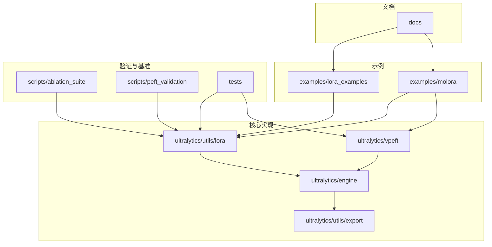
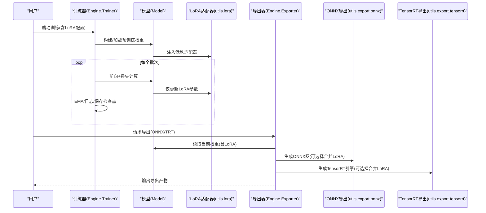
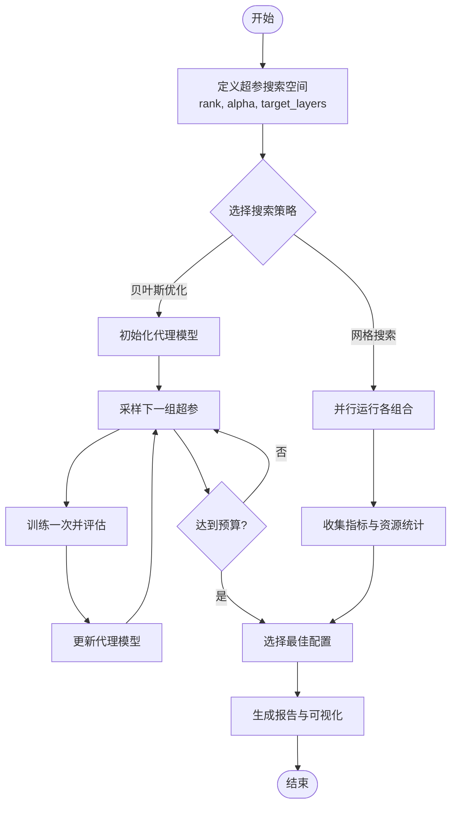
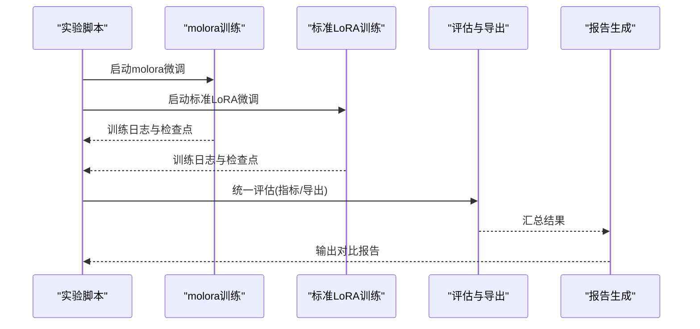
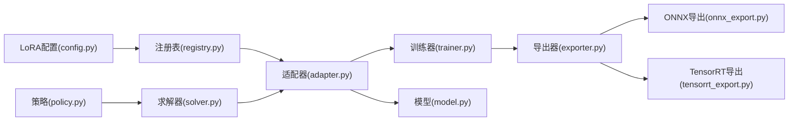

# PEFT示例与教程

<cite>
**本文引用的文件**
- [examples/lora_examples/yolo_master_lora_README.md](file://examples/lora_examples/yolo_master_lora_README.md)
- [examples/lora_examples/yolo11_lora.yaml](file://examples/lora_examples/yolo11_lora.yaml)
- [examples/lora_examples/yolo12_lora.yaml](file://examples/lora_examples/yolo12_lora.yaml)
- [examples/lora_examples/yolov8_lora.yaml](file://examples/lora_examples/yolov8_lora.yaml)
- [examples/lora_examples/yolo_master_visdrone_lora.yaml](file://examples/lora_examples/yolo_master_visdrone_lora.yaml)
- [examples/lora_examples/run_yolo_master_lora_rank_sweep.py](file://examples/lora_examples/run_yolo_master_lora_rank_sweep.py)
- [examples/molora/compare_lora_molora.py](file://examples/molora/compare_lora_molora.py)
- [examples/molora/basic_finetune.py](file://examples/molora/basic_finetune.py)
- [examples/molora/compare_coco128.py](file://examples/molora/compare_coco128.py)
- [examples/molora/continual_learning.py](file://examples/molora/continual_learning.py)
- [ultralytics/utils/lora/__init__.py](file://ultralytics/utils/lora/__init__.py)
- [ultralytics/utils/lora/adapter.py](file://ultralytics/utils/lora/adapter.py)
- [ultralytics/utils/lora/config.py](file://ultralytics/utils/lora/config.py)
- [ultralytics/utils/lora/registry.py](file://ultralytics/utils/lora/registry.py)
- [ultralytics/utils/lora/export_utils.py](file://ultralytics/utils/lora/export_utils.py)
- [ultralytics/vpeft/__init__.py](file://ultralytics/vpeft/__init__.py)
- [ultralytics/vpeft/policy.py](file://ultralytics/vpeft/policy.py)
- [ultralytics/vpeft/solver.py](file://ultralytics/vpeft/solver.py)
- [ultralytics/engine/trainer.py](file://ultralytics/engine/trainer.py)
- [ultralytics/engine/model.py](file://ultralytics/engine/model.py)
- [ultralytics/engine/exporter.py](file://ultralytics/engine/exporter.py)
- [ultralytics/utils/export/onnx_export.py](file://ultralytics/utils/export/onnx_export.py)
- [ultralytics/utils/export/tensorrt_export.py](file://ultralytics/utils/export/tensorrt_export.py)
- [scripts/ablation_suite/ablation_peft_coco128.py](file://scripts/ablation_suite/ablation_peft_coco128.py)
- [scripts/peft_validation/plot_results.py](file://scripts/peft_validation/plot_results.py)
- [scripts/peft_validation/run_peft_compare.py](file://scripts/peft_validation/run_peft_compare.py)
- [tests/test_molora.py](file://tests/test_molora.py)
- [tests/test_vpeft.py](file://tests/test_vpeft.py)
- [tests/test_moe_aware_peft.py](file://tests/test_moe_aware_peft.py)
- [docs/LoRA_Quickstart.md](file://docs/LoRA_Quickstart.md)
- [docs/molora_guide.md](file://docs/molora_guide.md)
</cite>

## 目录
1. [简介](#简介)
2. [项目结构](#项目结构)
3. [核心组件](#核心组件)
4. [架构总览](#架构总览)
5. [详细组件分析](#详细组件分析)
6. [依赖关系分析](#依赖关系分析)
7. [性能考量](#性能考量)
8. [故障排查指南](#故障排查指南)
9. [结论](#结论)
10. [附录](#附录)

## 简介
本教程面向希望在YOLO-Master中使用参数高效微调（PEFT，以LoRA为主）的工程师与研究者。内容覆盖：
- LoRA微调入门：环境配置、数据准备、模型选择、训练脚本
- 多任务PEFT配置：目标检测、实例分割、姿态估计、旋转边界框检测
- LoRA秩选择实验方法：网格搜索、贝叶斯优化、自动化调参
- molora与标准LoRA对比：性能比较、资源消耗、部署效果评估
- 多任务学习与领域适应案例
- 导出与部署：ONNX转换、TensorRT优化、边缘设备部署
- 诊断与调试工具使用
- 基准测试与评估方法

## 项目结构
仓库中与PEFT相关的代码与示例主要分布在以下位置：
- 示例与教程
  - examples/lora_examples：LoRA配置文件与秩扫描脚本
  - examples/molora：molora基础微调、对比实验、持续学习示例
- 核心实现
  - ultralytics/utils/lora：LoRA适配器、配置、注册表、导出辅助
  - ultralytics/vpeft：策略与求解器（用于更广泛的PEFT规划与执行）
  - ultralytics/engine：训练器、模型、导出器集成点
  - ultralytics/utils/export：ONNX/TensorRT等导出后端
- 验证与基准
  - scripts/ablation_suite：PEFT消融与对比脚本
  - scripts/peft_validation：结果可视化与对比运行
  - tests：单元测试覆盖molora、vpeft、MoE-aware PEFT等
- 文档
  - docs/LoRA_Quickstart.md、docs/molora_guide.md：快速开始与molora指南

图表来源
- [examples/lora_examples/yolo_master_lora_README.md:1-200](file://examples/lora_examples/yolo_master_lora_README.md#L1-L200)
- [examples/molora/compare_lora_molora.py:1-200](file://examples/molora/compare_lora_molora.py#L1-L200)
- [ultralytics/utils/lora/__init__.py:1-200](file://ultralytics/utils/lora/__init__.py#L1-L200)
- [ultralytics/vpeft/__init__.py:1-200](file://ultralytics/vpeft/__init__.py#L1-L200)
- [ultralytics/engine/trainer.py:1-200](file://ultralytics/engine/trainer.py#L1-L200)
- [ultralytics/utils/export/onnx_export.py:1-200](file://ultralytics/utils/export/onnx_export.py#L1-L200)

章节来源
- [examples/lora_examples/yolo_master_lora_README.md:1-200](file://examples/lora_examples/yolo_master_lora_README.md#L1-L200)
- [examples/molora/compare_lora_molora.py:1-200](file://examples/molora/compare_lora_molora.py#L1-L200)
- [ultralytics/utils/lora/__init__.py:1-200](file://ultralytics/utils/lora/__init__.py#L1-L200)
- [ultralytics/vpeft/__init__.py:1-200](file://ultralytics/vpeft/__init__.py#L1-L200)
- [ultralytics/engine/trainer.py:1-200](file://ultralytics/engine/trainer.py#L1-L200)
- [ultralytics/utils/export/onnx_export.py:1-200](file://ultralytics/utils/export/onnx_export.py#L1-L200)

## 核心组件
- LoRA适配器与配置
  - 适配器注入与权重管理：负责将低秩矩阵插入到指定模块中，并维护可训练参数集合
  - 配置解析与校验：从YAML或字典加载rank、alpha、target_modules、dropout等关键超参
  - 注册表机制：按任务与模型族自动匹配适配规则，避免手工拼装
  - 导出辅助：在导出时合并或分离LoRA权重，生成兼容格式
- vPEFT策略与求解器
  - 策略定义：描述哪些层应被冻结、哪些层应用何种PEFT方法（LoRA、DoRA等）
  - 求解器：根据约束与目标（显存、精度、吞吐）给出具体装配方案
- 训练器集成
  - 训练流程中动态启用/禁用LoRA参数更新
  - 与EMA、梯度累积、分布式训练协同
- 导出器集成
  - ONNX/TensorRT导出前对LoRA权重的处理（合并/保留为插件）
  - 运行时推理路径的兼容性保证

章节来源
- [ultralytics/utils/lora/adapter.py:1-200](file://ultralytics/utils/lora/adapter.py#L1-L200)
- [ultralytics/utils/lora/config.py:1-200](file://ultralytics/utils/lora/config.py#L1-L200)
- [ultralytics/utils/lora/registry.py:1-200](file://ultralytics/utils/lora/registry.py#L1-L200)
- [ultralytics/utils/lora/export_utils.py:1-200](file://ultralytics/utils/lora/export_utils.py#L1-L200)
- [ultralytics/vpeft/policy.py:1-200](file://ultralytics/vpeft/policy.py#L1-L200)
- [ultralytics/vpeft/solver.py:1-200](file://ultralytics/vpeft/solver.py#L1-L200)
- [ultralytics/engine/trainer.py:1-200](file://ultralytics/engine/trainer.py#L1-L200)
- [ultralytics/engine/exporter.py:1-200](file://ultralytics/engine/exporter.py#L1-L200)

## 架构总览
下图展示了PEFT在训练与导出链路中的整体交互：

图表来源
- [ultralytics/engine/trainer.py:1-200](file://ultralytics/engine/trainer.py#L1-L200)
- [ultralytics/engine/model.py:1-200](file://ultralytics/engine/model.py#L1-L200)
- [ultralytics/utils/lora/adapter.py:1-200](file://ultralytics/utils/lora/adapter.py#L1-L200)
- [ultralytics/engine/exporter.py:1-200](file://ultralytics/engine/exporter.py#L1-L200)
- [ultralytics/utils/export/onnx_export.py:1-200](file://ultralytics/utils/export/onnx_export.py#L1-L200)
- [ultralytics/utils/export/tensorrt_export.py:1-200](file://ultralytics/utils/export/tensorrt_export.py#L1-L200)

## 详细组件分析

### LoRA微调入门教程
- 环境配置
  - 安装PyTorch与CUDA驱动；确保GPU可用
  - 克隆仓库并安装依赖；建议创建独立虚拟环境
- 数据准备
  - 采用YOLO格式数据集（images/labels），并在YAML中声明train/val路径与类别数
  - 参考示例中的mini-detect或自定义数据集
- 模型选择
  - 选择YOLO11/YOLO12/YOLOv8等对应配置文件
  - 在LoRA YAML中指定base_model与任务类型
- 训练脚本
  - 使用提供的LoRA YAML进行训练；支持单卡/多卡
  - 通过rank/alpha控制拟合能力与显存占用
- 验证与导出
  - 训练后在验证集上评估指标
  - 导出为ONNX或TensorRT，便于部署

章节来源
- [examples/lora_examples/yolo_master_lora_README.md:1-200](file://examples/lora_examples/yolo_master_lora_README.md#L1-L200)
- [examples/lora_examples/yolo11_lora.yaml:1-200](file://examples/lora_examples/yolo11_lora.yaml#L1-L200)
- [examples/lora_examples/yolo12_lora.yaml:1-200](file://examples/lora_examples/yolo12_lora.yaml#L1-L200)
- [examples/lora_examples/yolov8_lora.yaml:1-200](file://examples/lora_examples/yolov8_lora.yaml#L1-L200)
- [examples/lora_examples/yolo_master_visdrone_lora.yaml:1-200](file://examples/lora_examples/yolo_master_visdrone_lora.yaml#L1-L200)
- [docs/LoRA_Quickstart.md:1-200](file://docs/LoRA_Quickstart.md#L1-L200)

### 多任务PEFT配置（检测/分割/姿态/旋转框）
- 目标检测
  - 在LoRA YAML中设置task=detect，并指定类别数与输入尺寸
  - 推荐优先在检测头附近注入LoRA，兼顾精度与效率
- 实例分割
  - task=segment，注意掩码分支的LoRA注入位置与秩大小
- 姿态估计
  - task=pose，关注关键点分支的适配策略
- 旋转边界框检测
  - task=obb，需确保旋转IoU与NMS在导出阶段兼容

章节来源
- [examples/lora_examples/yolo11_lora.yaml:1-200](file://examples/lora_examples/yolo11_lora.yaml#L1-L200)
- [examples/lora_examples/yolo12_lora.yaml:1-200](file://examples/lora_examples/yolo12_lora.yaml#L1-L200)
- [examples/lora_examples/yolov8_lora.yaml:1-200](file://examples/lora_examples/yolov8_lora.yaml#L1-L200)
- [examples/lora_examples/yolo_master_visdrone_lora.yaml:1-200](file://examples/lora_examples/yolo_master_visdrone_lora.yaml#L1-L200)

### LoRA秩选择的实验方法
- 网格搜索
  - 遍历rank∈{4,8,16,32}与alpha∈{2,4,8}的组合，记录mAP与显存占用
  - 使用秩扫描脚本批量运行并汇总结果
- 贝叶斯优化
  - 基于历史训练结果构建代理模型，自动探索最优超参空间
  - 结合早停与资源限制，减少无效训练
- 自动化调参
  - 统一入口脚本聚合不同任务的LoRA配置，输出标准化报告

图表来源
- [examples/lora_examples/run_yolo_master_lora_rank_sweep.py:1-200](file://examples/lora_examples/run_yolo_master_lora_rank_sweep.py#L1-L200)
- [scripts/ablation_suite/ablation_peft_coco128.py:1-200](file://scripts/ablation_suite/ablation_peft_coco128.py#L1-L200)
- [scripts/peft_validation/plot_results.py:1-200](file://scripts/peft_validation/plot_results.py#L1-L200)

章节来源
- [examples/lora_examples/run_yolo_master_lora_rank_sweep.py:1-200](file://examples/lora_examples/run_yolo_master_lora_rank_sweep.py#L1-L200)
- [scripts/ablation_suite/ablation_peft_coco128.py:1-200](file://scripts/ablation_suite/ablation_peft_coco128.py#L1-L200)
- [scripts/peft_validation/plot_results.py:1-200](file://scripts/peft_validation/plot_results.py#L1-L200)

### molora与标准LoRA对比实验指南
- 实验设计
  - 相同数据集、相同基座模型、相同训练时长与批大小
  - 分别使用molora与标准LoRA进行训练，记录mAP、F1、收敛曲线
- 资源消耗分析
  - 统计峰值显存、训练时间、导出模型体积
- 部署效果评估
  - 在ONNX与TensorRT下对比推理延迟与吞吐
  - 边缘设备上验证稳定性与功耗

图表来源
- [examples/molora/compare_lora_molora.py:1-200](file://examples/molora/compare_lora_molora.py#L1-L200)
- [examples/molora/basic_finetune.py:1-200](file://examples/molora/basic_finetune.py#L1-L200)
- [examples/molora/compare_coco128.py:1-200](file://examples/molora/compare_coco128.py#L1-L200)
- [docs/molora_guide.md:1-200](file://docs/molora_guide.md#L1-L200)

章节来源
- [examples/molora/compare_lora_molora.py:1-200](file://examples/molora/compare_lora_molora.py#L1-L200)
- [examples/molora/basic_finetune.py:1-200](file://examples/molora/basic_finetune.py#L1-L200)
- [examples/molora/compare_coco128.py:1-200](file://examples/molora/compare_coco128.py#L1-L200)
- [docs/molora_guide.md:1-200](file://docs/molora_guide.md#L1-L200)

### 多任务学习与领域适应案例
- 多任务学习
  - 在同一基座上同时适配检测、分割、姿态等多任务分支
  - 使用vPEFT策略在不同任务间共享与隔离LoRA参数
- 领域适应
  - 针对特定领域（如VisDrone、医学影像）进行轻量微调
  - 结合数据增强与正则化提升泛化能力

章节来源
- [ultralytics/vpeft/policy.py:1-200](file://ultralytics/vpeft/policy.py#L1-L200)
- [ultralytics/vpeft/solver.py:1-200](file://ultralytics/vpeft/solver.py#L1-L200)
- [examples/molora/continual_learning.py:1-200](file://examples/molora/continual_learning.py#L1-L200)

### 导出与部署示例
- ONNX转换
  - 导出前可选择是否合并LoRA权重；保持推理图简洁
  - 验证导出模型的数值一致性
- TensorRT优化
  - 生成FP16/INT8引擎，权衡精度与速度
  - 在目标硬件上进行端到端延迟测试
- 边缘设备部署
  - 将ONNX/TensorRT模型部署至Jetson、RKNN等平台
  - 监控内存占用与温度，调整批大小与分辨率

章节来源
- [ultralytics/utils/lora/export_utils.py:1-200](file://ultralytics/utils/lora/export_utils.py#L1-L200)
- [ultralytics/utils/export/onnx_export.py:1-200](file://ultralytics/utils/export/onnx_export.py#L1-L200)
- [ultralytics/utils/export/tensorrt_export.py:1-200](file://ultralytics/utils/export/tensorrt_export.py#L1-L200)
- [ultralytics/engine/exporter.py:1-200](file://ultralytics/engine/exporter.py#L1-L200)

### 诊断与调试工具使用方法
- 训练诊断
  - 查看LoRA参数更新幅度与分布，识别不收敛或过拟合
  - 使用验证脚本对比不同配置的指标趋势
- 导出诊断
  - 检查导出前后数值差异，定位潜在算子兼容问题
- 单元测试
  - 运行molora、vPEFT、MoE-aware PEFT相关测试用例，确保功能稳定

章节来源
- [scripts/peft_validation/run_peft_compare.py:1-200](file://scripts/peft_validation/run_peft_compare.py#L1-L200)
- [scripts/peft_validation/plot_results.py:1-200](file://scripts/peft_validation/plot_results.py#L1-L200)
- [tests/test_molora.py:1-200](file://tests/test_molora.py#L1-L200)
- [tests/test_vpeft.py:1-200](file://tests/test_vpeft.py#L1-L200)
- [tests/test_moe_aware_peft.py:1-200](file://tests/test_moe_aware_peft.py#L1-L200)

### 性能基准测试与评估方法
- 指标体系
  - 检测：mAP@0.5:0.95、F1、召回率
  - 分割：mAP、Dice系数
  - 姿态：AP、PCK
- 资源指标
  - 峰值显存、训练时长、导出模型体积、推理延迟、吞吐
- 评估流程
  - 固定随机种子与数据划分，重复多次取均值与方差
  - 跨平台对比（CPU/GPU/边缘设备）

章节来源
- [scripts/ablation_suite/ablation_peft_coco128.py:1-200](file://scripts/ablation_suite/ablation_peft_coco128.py#L1-L200)
- [scripts/peft_validation/plot_results.py:1-200](file://scripts/peft_validation/plot_results.py#L1-L200)

## 依赖关系分析
LoRA与vPEFT在训练与导出链路中的依赖关系如下：

图表来源
- [ultralytics/utils/lora/config.py:1-200](file://ultralytics/utils/lora/config.py#L1-L200)
- [ultralytics/utils/lora/registry.py:1-200](file://ultralytics/utils/lora/registry.py#L1-L200)
- [ultralytics/utils/lora/adapter.py:1-200](file://ultralytics/utils/lora/adapter.py#L1-L200)
- [ultralytics/engine/trainer.py:1-200](file://ultralytics/engine/trainer.py#L1-L200)
- [ultralytics/engine/model.py:1-200](file://ultralytics/engine/model.py#L1-L200)
- [ultralytics/engine/exporter.py:1-200](file://ultralytics/engine/exporter.py#L1-L200)
- [ultralytics/utils/export/onnx_export.py:1-200](file://ultralytics/utils/export/onnx_export.py#L1-L200)
- [ultralytics/utils/export/tensorrt_export.py:1-200](file://ultralytics/utils/export/tensorrt_export.py#L1-L200)
- [ultralytics/vpeft/policy.py:1-200](file://ultralytics/vpeft/policy.py#L1-L200)
- [ultralytics/vpeft/solver.py:1-200](file://ultralytics/vpeft/solver.py#L1-L200)

章节来源
- [ultralytics/utils/lora/config.py:1-200](file://ultralytics/utils/lora/config.py#L1-L200)
- [ultralytics/utils/lora/registry.py:1-200](file://ultralytics/utils/lora/registry.py#L1-L200)
- [ultralytics/utils/lora/adapter.py:1-200](file://ultralytics/utils/lora/adapter.py#L1-L200)
- [ultralytics/engine/trainer.py:1-200](file://ultralytics/engine/trainer.py#L1-L200)
- [ultralytics/engine/model.py:1-200](file://ultralytics/engine/model.py#L1-L200)
- [ultralytics/engine/exporter.py:1-200](file://ultralytics/engine/exporter.py#L1-L200)
- [ultralytics/utils/export/onnx_export.py:1-200](file://ultralytics/utils/export/onnx_export.py#L1-L200)
- [ultralytics/utils/export/tensorrt_export.py:1-200](file://ultralytics/utils/export/tensorrt_export.py#L1-L200)
- [ultralytics/vpeft/policy.py:1-200](file://ultralytics/vpeft/policy.py#L1-L200)
- [ultralytics/vpeft/solver.py:1-200](file://ultralytics/vpeft/solver.py#L1-L200)

## 性能考量
- 秩与Alpha的选择
  - rank越大拟合能力越强但显存与计算开销增加；alpha影响缩放比例，需与lr配合
- 目标层选择
  - 仅在关键分支注入LoRA可减少参数规模并保持精度
- 训练技巧
  - 使用EMA平滑权重、梯度裁剪与混合精度加速训练
- 导出优化
  - 合并LoRA权重可降低推理图复杂度；TensorRT量化需谨慎校准

[本节提供一般性指导，无需特定文件引用]

## 故障排查指南
- 训练不收敛
  - 检查LoRA lr与主模型lr的比例；确认目标层是否正确注入
  - 观察LoRA参数范数变化，避免爆炸或消失
- 导出失败或数值不一致
  - 核对导出选项（是否合并LoRA）；验证ONNX/TensorRT算子支持
  - 使用导出前后对比脚本定位差异
- 资源不足
  - 降低rank或batch size；启用梯度累积
  - 使用半精度训练与导出

章节来源
- [scripts/peft_validation/run_peft_compare.py:1-200](file://scripts/peft_validation/run_peft_compare.py#L1-L200)
- [ultralytics/utils/lora/export_utils.py:1-200](file://ultralytics/utils/lora/export_utils.py#L1-L200)
- [ultralytics/utils/export/onnx_export.py:1-200](file://ultralytics/utils/export/onnx_export.py#L1-L200)
- [ultralytics/utils/export/tensorrt_export.py:1-200](file://ultralytics/utils/export/tensorrt_export.py#L1-L200)

## 结论
本教程系统梳理了YOLO-Master中PEFT（以LoRA为主）的完整工作流，涵盖从入门到高级应用的关键环节。通过合理的秩选择与任务适配策略，可在有限资源下获得良好性能；结合molora与标准LoRA的对比实验，可进一步挖掘不同场景下的最优实践。导出与部署环节的规范操作有助于将研究成果稳定落地。

[本节为总结性内容，无需特定文件引用]

## 附录
- 快速开始
  - 参考LoRA快速开始文档与示例YAML，完成首次微调
- molora指南
  - 了解molora的训练流程与对比实验方法
- 更多示例
  - 浏览examples/lora_examples与examples/molora中的脚本与配置

章节来源
- [docs/LoRA_Quickstart.md:1-200](file://docs/LoRA_Quickstart.md#L1-L200)
- [docs/molora_guide.md:1-200](file://docs/molora_guide.md#L1-L200)
- [examples/lora_examples/yolo_master_lora_README.md:1-200](file://examples/lora_examples/yolo_master_lora_README.md#L1-L200)