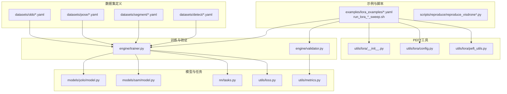
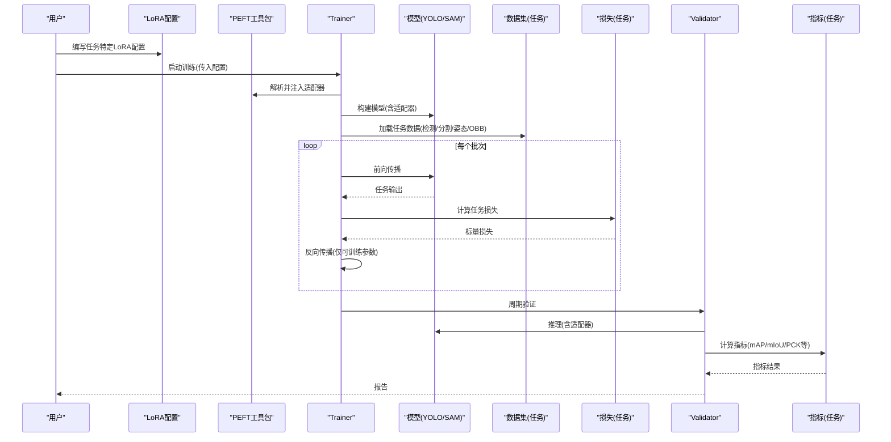
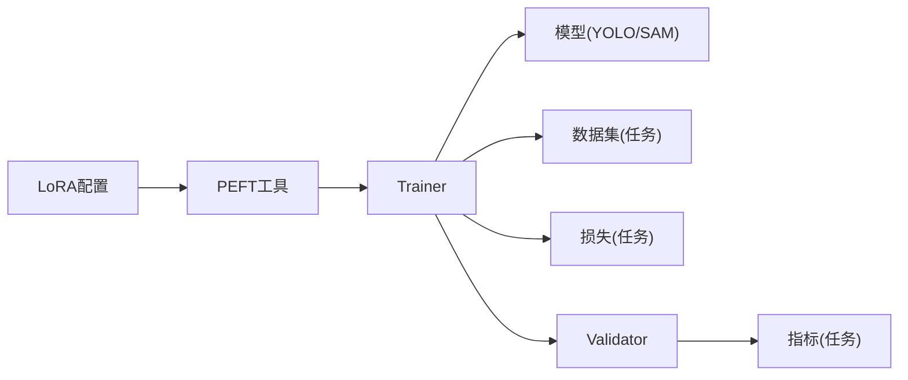

# 任务特定PEFT配置

<cite>
**本文引用的文件**
- [examples/lora_examples/yolo_master_visdrone_lora.yaml](file://examples/lora_examples/yolo_master_visdrone_lora.yaml)
- [examples/lora_examples/yolo_master_brain_tumor_lora.yaml](file://examples/lora_examples/yolo_master_brain_tumor_lora.yaml)
- [examples/lora_examples/run_lora_visdrone_sweep.sh](file://examples/lora_examples/run_lora_visdrone_sweep.sh)
- [examples/lora_examples/run_lora_brain_tumor_sweep.sh](file://examples/lora_examples/run_lora_brain_tumor_sweep.sh)
- [ultralytics/cfg/datasets/detect/coco128.yaml](file://ultralytics/cfg/datasets/detect/coco128.yaml)
- [ultralytics/cfg/datasets/segment/sam.yaml](file://ultralytics/cfg/datasets/segment/sam.yaml)
- [ultralytics/cfg/datasets/pose/coco-pose.yaml](file://ultralytics/cfg/datasets/pose/coco-pose.yaml)
- [ultralytics/cfg/datasets/obb/dota-v1.0.yaml](file://ultralytics/cfg/datasets/obb/dota-v1.0.yaml)
- [ultralytics/utils/lora/__init__.py](file://ultralytics/utils/lora/__init__.py)
- [ultralytics/utils/lora/config.py](file://ultralytics/utils/lora/config.py)
- [ultralytics/utils/lora/peft_utils.py](file://ultralytics/utils/lora/peft_utils.py)
- [ultralytics/engine/trainer.py](file://ultralytics/engine/trainer.py)
- [ultralytics/engine/validator.py](file://ultralytics/engine/validator.py)
- [ultralytics/models/yolo/model.py](file://ultralytics/models/yolo/model.py)
- [ultralytics/models/sam/model.py](file://ultralytics/models/sam/model.py)
- [ultralytics/nn/tasks.py](file://ultralytics/nn/tasks.py)
- [ultralytics/utils/loss.py](file://ultralytics/utils/loss.py)
- [ultralytics/utils/metrics.py](file://ultralytics/utils/metrics.py)
- [scripts/reproduce/reproduce_visdrone.py](file://scripts/reproduce/reproduce_visdrone.py)
- [scripts/reproduce/reproduce_visdrone_v01n_800.py](file://scripts/reproduce/reproduce_visdrone_v01n_800.py)
- [docs/en/guides/finetuning-guide.md](file://docs/en/guides/finetuning-guide.md)
- [docs/en/guides/coco-json-training.md](file://docs/en/guides/coco-json-training.md)
- [docs/en/guides/instance-segmentation-and-tracking.md](file://docs/en/guides/instance-segmentation-and-tracking.md)
- [docs/en/datasets/detect/index.md](file://docs/en/datasets/detect/index.md)
- [docs/en/datasets/segment/index.md](file://docs/en/datasets/segment/index.md)
- [docs/en/datasets/pose/index.md](file://docs/en/datasets/pose/index.md)
- [docs/en/datasets/obb/index.md](file://docs/en/datasets/obb/index.md)
</cite>

## 目录
1. [简介](#简介)
2. [项目结构](#项目结构)
3. [核心组件](#核心组件)
4. [架构总览](#架构总览)
5. [详细组件分析](#详细组件分析)
6. [依赖关系分析](#依赖关系分析)
7. [性能考虑](#性能考虑)
8. [故障排查指南](#故障排查指南)
9. [结论](#结论)
10. [附录](#附录)

## 简介
本文件面向YOLO-Master在不同计算机视觉任务上的参数高效微调（PEFT）实践，聚焦LoRA与适配器的任务级配置。内容覆盖：
- 目标检测：COCO、VisDrone数据集的LoRA微调示例与数据格式要求
- 实例分割：SAM模型适配与自定义分割头训练要点
- 姿态估计：关键点检测与人体姿态分析的LoRA应用
- 旋转边界框检测（OBB）：特殊配置需求
- 实际场景：医学图像（脑肿瘤检测）、无人机检测等完整配置示例
- 损失函数选择与评估指标的任务化配置建议

## 项目结构
仓库中与PEFT和任务配置相关的关键位置如下：
- LoRA示例与脚本：examples/lora_examples
- 数据集定义：ultralytics/cfg/datasets/{detect,segment,pose,obb}
- PEFT工具与配置解析：ultralytics/utils/lora
- 训练/验证引擎：ultralytics/engine/{trainer,validator}
- 模型入口：ultralytics/models/{yolo,sam}/model.py
- 任务与损失/指标：ultralytics/nn/tasks.py, ultralytics/utils/loss.py, ultralytics/utils/metrics.py
- 文档：docs/en/guides/* 与 docs/en/datasets/*

图表来源
- [examples/lora_examples/yolo_master_visdrone_lora.yaml](file://examples/lora_examples/yolo_master_visdrone_lora.yaml)
- [examples/lora_examples/yolo_master_brain_tumor_lora.yaml](file://examples/lora_examples/yolo_master_brain_tumor_lora.yaml)
- [ultralytics/utils/lora/__init__.py](file://ultralytics/utils/lora/__init__.py)
- [ultralytics/utils/lora/config.py](file://ultralytics/utils/lora/config.py)
- [ultralytics/utils/lora/peft_utils.py](file://ultralytics/utils/lora/peft_utils.py)
- [ultralytics/engine/trainer.py](file://ultralytics/engine/trainer.py)
- [ultralytics/engine/validator.py](file://ultralytics/engine/validator.py)
- [ultralytics/models/yolo/model.py](file://ultralytics/models/yolo/model.py)
- [ultralytics/models/sam/model.py](file://ultralytics/models/sam/model.py)
- [ultralytics/nn/tasks.py](file://ultralytics/nn/tasks.py)
- [ultralytics/utils/loss.py](file://ultralytics/utils/loss.py)
- [ultralytics/utils/metrics.py](file://ultralytics/utils/metrics.py)

章节来源
- [examples/lora_examples/yolo_master_visdrone_lora.yaml](file://examples/lora_examples/yolo_master_visdrone_lora.yaml)
- [examples/lora_examples/yolo_master_brain_tumor_lora.yaml](file://examples/lora_examples/yolo_master_brain_tumor_lora.yaml)
- [ultralytics/utils/lora/config.py](file://ultralytics/utils/lora/config.py)
- [ultralytics/engine/trainer.py](file://ultralytics/engine/trainer.py)
- [ultralytics/engine/validator.py](file://ultralytics/engine/validator.py)

## 核心组件
- LoRA配置与加载
  - 通过配置文件声明LoRA目标模块、秩rank、缩放alpha、dropout等关键超参，并在训练时由PEFT工具注入到指定层。
  - 参考路径：[ultralytics/utils/lora/config.py](file://ultralytics/utils/lora/config.py)、[ultralytics/utils/lora/peft_utils.py](file://ultralytics/utils/lora/peft_utils.py)
- 训练/验证集成
  - Trainer在构建模型后根据配置启用适配器；Validator在评估阶段使用相同适配器权重进行推理。
  - 参考路径：[ultralytics/engine/trainer.py](file://ultralytics/engine/trainer.py)、[ultralytics/engine/validator.py](file://ultralytics/engine/validator.py)
- 任务与损失/指标
  - 不同任务对应不同的损失组合与评估指标，如检测用Box/GIoU/DFL等，分割增加mask分支，姿态增加keypoint损失，OBB引入角度项。
  - 参考路径：[ultralytics/nn/tasks.py](file://ultralytics/nn/tasks.py)、[ultralytics/utils/loss.py](file://ultralytics/utils/loss.py)、[ultralytics/utils/metrics.py](file://ultralytics/utils/metrics.py)
- 模型适配
  - YOLO系列与SAM模型均支持在骨干或头部插入适配器，以最小代价实现任务迁移。
  - 参考路径：[ultralytics/models/yolo/model.py](file://ultralytics/models/yolo/model.py)、[ultralytics/models/sam/model.py](file://ultralytics/models/sam/model.py)

章节来源
- [ultralytics/utils/lora/config.py](file://ultralytics/utils/lora/config.py)
- [ultralytics/utils/lora/peft_utils.py](file://ultralytics/utils/lora/peft_utils.py)
- [ultralytics/engine/trainer.py](file://ultralytics/engine/trainer.py)
- [ultralytics/engine/validator.py](file://ultralytics/engine/validator.py)
- [ultralytics/nn/tasks.py](file://ultralytics/nn/tasks.py)
- [ultralytics/utils/loss.py](file://ultralytics/utils/loss.py)
- [ultralytics/utils/metrics.py](file://ultralytics/utils/metrics.py)
- [ultralytics/models/yolo/model.py](file://ultralytics/models/yolo/model.py)
- [ultralytics/models/sam/model.py](file://ultralytics/models/sam/model.py)

## 架构总览
下图展示从配置到训练/验证的端到端流程，以及各任务对应的数据、损失与指标。

图表来源
- [ultralytics/utils/lora/config.py](file://ultralytics/utils/lora/config.py)
- [ultralytics/utils/lora/peft_utils.py](file://ultralytics/utils/lora/peft_utils.py)
- [ultralytics/engine/trainer.py](file://ultralytics/engine/trainer.py)
- [ultralytics/engine/validator.py](file://ultralytics/engine/validator.py)
- [ultralytics/nn/tasks.py](file://ultralytics/nn/tasks.py)
- [ultralytics/utils/loss.py](file://ultralytics/utils/loss.py)
- [ultralytics/utils/metrics.py](file://ultralytics/utils/metrics.py)

## 详细组件分析

### 目标检测任务的LoRA配置（COCO与VisDrone）
- 配置要点
  - 选择检测任务的数据集定义（COCO或VisDrone），确保类别数与标签格式匹配。
  - 设置LoRA目标为检测头或主干中合适的线性/卷积层，合理选择rank与alpha，避免过拟合小样本。
  - 若数据规模较小，适当增大dropout与正则强度，配合早停策略。
- 数据格式与预处理
  - COCO：遵循标准COCO JSON标注，包含bbox、类别映射与图像路径。
  - VisDrone：提供专用数据集定义与下载脚本，注意航拍视角下的尺度变化与小目标增强。
- 损失与指标
  - 损失：Box回归、分类、DFL等组合；可根据任务调整权重。
  - 指标：mAP@0.5:0.95、P/R曲线、混淆矩阵等。
- 示例与脚本
  - 参考LoRA配置文件与 sweeps 脚本，快速复现COCO/VisDrone的检测微调流程。

章节来源
- [ultralytics/cfg/datasets/detect/coco128.yaml](file://ultralytics/cfg/datasets/detect/coco128.yaml)
- [examples/lora_examples/yolo_master_visdrone_lora.yaml](file://examples/lora_examples/yolo_master_visdrone_lora.yaml)
- [examples/lora_examples/run_lora_visdrone_sweep.sh](file://examples/lora_examples/run_lora_visdrone_sweep.sh)
- [scripts/reproduce/reproduce_visdrone.py](file://scripts/reproduce/reproduce_visdrone.py)
- [scripts/reproduce/reproduce_visdrone_v01n_800.py](file://scripts/reproduce/reproduce_visdrone_v01n_800.py)
- [docs/en/guides/coco-json-training.md](file://docs/en/guides/coco-json-training.md)
- [docs/en/datasets/detect/index.md](file://docs/en/datasets/detect/index.md)
- [ultralytics/utils/loss.py](file://ultralytics/utils/loss.py)
- [ultralytics/utils/metrics.py](file://ultralytics/utils/metrics.py)

### 实例分割任务的PEFT配置（SAM适配与自定义分割头）
- 配置要点
  - 基于SAM的提示式分割能力，可在编码器或解码器部分插入LoRA，冻结大部分权重，仅微调轻量适配器。
  - 若需自定义分割头，保持编码器冻结，对新增头进行全参或LoRA微调。
- 数据格式与预处理
  - 分割标注通常为多边形或掩码，需转换为任务所需格式；注意分辨率与裁剪策略。
- 损失与指标
  - 损失：Dice/BCE、Focal等组合；结合分类/定位辅助任务提升稳定性。
  - 指标：mIoU、mAP（针对实例）、轮廓精度等。
- 示例与参考
  - 参考分割数据集定义与文档，了解标注与训练流程。

章节来源
- [ultralytics/cfg/datasets/segment/sam.yaml](file://ultralytics/cfg/datasets/segment/sam.yaml)
- [ultralytics/models/sam/model.py](file://ultralytics/models/sam/model.py)
- [docs/en/guides/instance-segmentation-and-tracking.md](file://docs/en/guides/instance-segmentation-and-tracking.md)
- [docs/en/datasets/segment/index.md](file://docs/en/datasets/segment/index.md)
- [ultralytics/utils/loss.py](file://ultralytics/utils/loss.py)
- [ultralytics/utils/metrics.py](file://ultralytics/utils/metrics.py)

### 姿态估计任务的LoRA应用（关键点检测与人体姿态）
- 配置要点
  - 在关键点检测头或共享骨干上注入LoRA，关注关键点坐标回归的损失稳定性。
  - 对于人体姿态，建议采用对称性增强与遮挡鲁棒性策略。
- 数据格式与预处理
  - 关键点标注通常包含(x,y)坐标与可见性标志；需统一坐标系与归一化。
- 损失与指标
  - 损失：关键点MSE/SmoothL1、可见性加权；可加入热力图分支。
  - 指标：PCK、AP、OKS等。
- 示例与参考
  - 参考姿态数据集定义与文档，理解标注与评估方式。

章节来源
- [ultralytics/cfg/datasets/pose/coco-pose.yaml](file://ultralytics/cfg/datasets/pose/coco-pose.yaml)
- [docs/en/datasets/pose/index.md](file://docs/en/datasets/pose/index.md)
- [ultralytics/utils/loss.py](file://ultralytics/utils/loss.py)
- [ultralytics/utils/metrics.py](file://ultralytics/utils/metrics.py)

### 旋转边界框检测（OBB）的特殊配置
- 配置要点
  - OBB需要角度参数参与回归，建议在检测头或特征融合处注入LoRA，并对角度损失进行单独调权。
  - 注意角度周期性处理与角度平滑约束，避免梯度不稳定。
- 数据格式与预处理
  - 标注包含中心点、宽高与角度；需保证角度范围一致（如[-π/2, π/2]）。
- 损失与指标
  - 损失：Box+角度联合损失；可引入角度正则项。
  - 指标：OBB mAP、角度误差分布等。
- 示例与参考
  - 参考OBB数据集定义与文档。

章节来源
- [ultralytics/cfg/datasets/obb/dota-v1.0.yaml](file://ultralytics/cfg/datasets/obb/dota-v1.0.yaml)
- [docs/en/datasets/obb/index.md](file://docs/en/datasets/obb/index.md)
- [ultralytics/utils/loss.py](file://ultralytics/utils/loss.py)
- [ultralytics/utils/metrics.py](file://ultralytics/utils/metrics.py)

### 实际应用场景：医学图像（脑肿瘤检测）与无人机检测
- 脑肿瘤检测（医学图像）
  - 配置：使用专门LoRA配置文件，冻结骨干，仅微调检测头或浅层特征；降低学习率，增加正则。
  - 数据：医学影像标注常为矩形框或掩码，需严格对齐像素坐标与尺寸。
  - 示例：参考脑肿瘤LoRA配置与sweep脚本。
- 无人机检测（VisDrone）
  - 配置：针对航拍小目标与密集场景，LoRA rank不宜过大，配合数据增强（马赛克、随机裁剪）。
  - 示例：参考VisDrone LoRA配置与reproduce脚本。

章节来源
- [examples/lora_examples/yolo_master_brain_tumor_lora.yaml](file://examples/lora_examples/yolo_master_brain_tumor_lora.yaml)
- [examples/lora_examples/run_lora_brain_tumor_sweep.sh](file://examples/lora_examples/run_lora_brain_tumor_sweep.sh)
- [examples/lora_examples/yolo_master_visdrone_lora.yaml](file://examples/lora_examples/yolo_master_visdrone_lora.yaml)
- [examples/lora_examples/run_lora_visdrone_sweep.sh](file://examples/lora_examples/run_lora_visdrone_sweep.sh)
- [scripts/reproduce/reproduce_visdrone.py](file://scripts/reproduce/reproduce_visdrone.py)
- [scripts/reproduce/reproduce_visdrone_v01n_800.py](file://scripts/reproduce/reproduce_visdrone_v01n_800.py)

### 任务特定的损失函数选择与评估指标配置
- 损失函数
  - 检测：Box回归、分类、DFL；可按任务调整权重。
  - 分割：Dice/BCE/Focal；必要时加入边缘损失。
  - 姿态：关键点回归损失与可见性加权。
  - OBB：Box+角度联合损失，角度正则。
- 评估指标
  - 检测：mAP@0.5:0.95、PR曲线。
  - 分割：mIoU、实例mAP。
  - 姿态：PCK、AP、OKS。
  - OBB：OBB mAP、角度误差统计。
- 参考实现
  - 查看任务相关的损失与指标模块，确认默认组合与可调参数。

章节来源
- [ultralytics/utils/loss.py](file://ultralytics/utils/loss.py)
- [ultralytics/utils/metrics.py](file://ultralytics/utils/metrics.py)
- [ultralytics/nn/tasks.py](file://ultralytics/nn/tasks.py)

## 依赖关系分析
- 配置到训练链路
  - LoRA配置被PEFT工具解析，Trainer在模型构建阶段注入适配器，随后按任务加载数据、计算损失与指标。
- 任务与数据耦合
  - 不同任务的数据集定义与标注格式直接影响预处理与损失设计。
- 外部依赖
  - 数据集下载与转换脚本（如VisDrone）位于scripts目录，便于自动化流水线。

图表来源
- [ultralytics/utils/lora/config.py](file://ultralytics/utils/lora/config.py)
- [ultralytics/utils/lora/peft_utils.py](file://ultralytics/utils/lora/peft_utils.py)
- [ultralytics/engine/trainer.py](file://ultralytics/engine/trainer.py)
- [ultralytics/engine/validator.py](file://ultralytics/engine/validator.py)
- [ultralytics/nn/tasks.py](file://ultralytics/nn/tasks.py)
- [ultralytics/utils/loss.py](file://ultralytics/utils/loss.py)
- [ultralytics/utils/metrics.py](file://ultralytics/utils/metrics.py)

章节来源
- [ultralytics/utils/lora/config.py](file://ultralytics/utils/lora/config.py)
- [ultralytics/utils/lora/peft_utils.py](file://ultralytics/utils/lora/peft_utils.py)
- [ultralytics/engine/trainer.py](file://ultralytics/engine/trainer.py)
- [ultralytics/engine/validator.py](file://ultralytics/engine/validator.py)

## 性能考虑
- 选择合适rank与alpha：过小导致表达能力不足，过大易过拟合且显存占用上升。
- 冻结策略：优先冻结骨干，仅微调检测/分割/姿态头或浅层特征。
- 数据增强：对小目标与密集场景（如VisDrone）尤为重要。
- 混合精度与优化器：开启AMP与稳定优化器（AdamW/Lion）有助于收敛速度与稳定性。
- 早停与学习率调度：防止过拟合，提高泛化能力。

## 故障排查指南
- 常见错误
  - 类别数不匹配：检查数据集定义的类别映射与模型输出通道。
  - 标注格式错误：确保bbox/关键点/掩码格式与任务要求一致。
  - 角度问题（OBB）：检查角度范围与周期性处理。
  - 显存溢出：降低batch size或rank，启用AMP。
- 调试建议
  - 逐步验证：先跑通无LoRA基线，再逐步启用适配器。
  - 日志与可视化：观察损失曲线与中间输出，定位异常。
  - 参考文档：查阅微调指南与数据集说明。

章节来源
- [docs/en/guides/finetuning-guide.md](file://docs/en/guides/finetuning-guide.md)
- [docs/en/guides/coco-json-training.md](file://docs/en/guides/coco-json-training.md)
- [docs/en/datasets/detect/index.md](file://docs/en/datasets/detect/index.md)
- [docs/en/datasets/segment/index.md](file://docs/en/datasets/segment/index.md)
- [docs/en/datasets/pose/index.md](file://docs/en/datasets/pose/index.md)
- [docs/en/datasets/obb/index.md](file://docs/en/datasets/obb/index.md)

## 结论
通过任务特定的LoRA配置与适配器注入，YOLO-Master能够在不同CV任务上实现高效微调。结合正确的数据格式、损失设计与评估指标，可在有限算力下取得良好效果。建议从基线开始，逐步引入LoRA与数据增强，并结合早停与学习率调度以获得更稳健的泛化性能。

## 附录
- 快速上手
  - 参考LoRA示例与sweep脚本，快速复现检测与分割任务。
- 扩展阅读
  - 微调指南与数据集文档提供详细的步骤与注意事项。