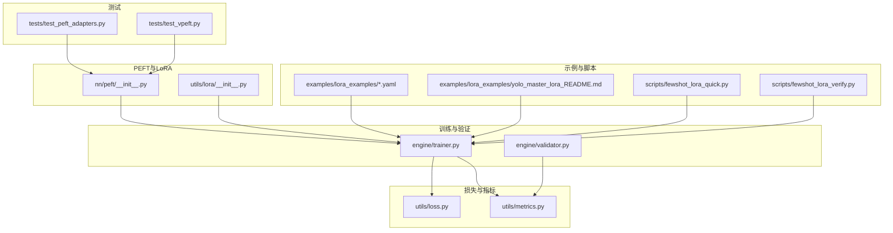
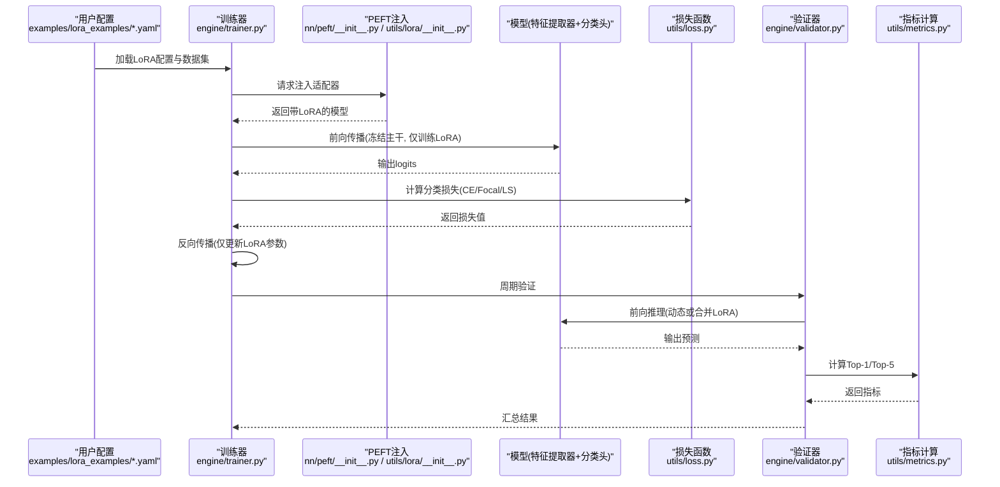
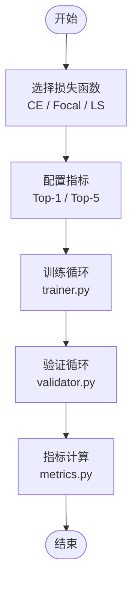
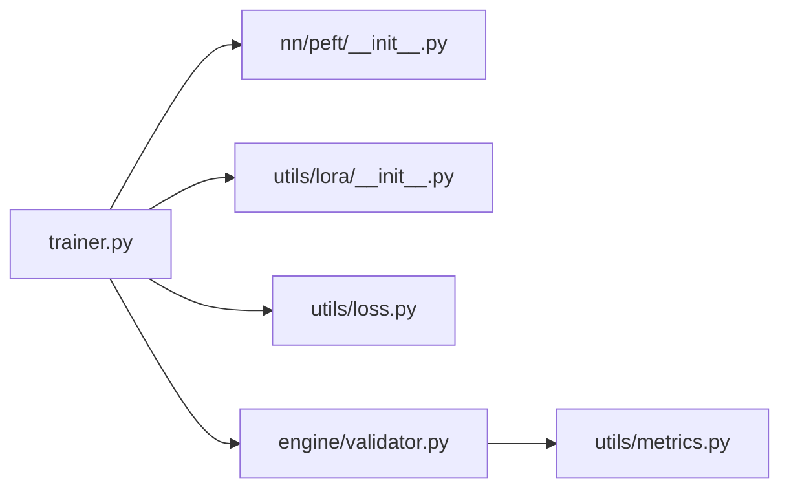

# 图像分类PEFT配置

<cite>
**本文引用的文件**
- [ultralytics/nn/peft/__init__.py](file://ultralytics/nn/peft/__init__.py)
- [ultralytics/utils/lora/__init__.py](file://ultralytics/utils/lora/__init__.py)
- [ultralytics/engine/trainer.py](file://ultralytics/engine/trainer.py)
- [ultralytics/engine/validator.py](file://ultralytics/engine/validator.py)
- [ultralytics/utils/metrics.py](file://ultralytics/utils/metrics.py)
- [ultralytics/utils/loss.py](file://ultralytics/utils/loss.py)
- [examples/lora_examples/yolo11_lora.yaml](file://examples/lora_examples/yolo11_lora.yaml)
- [examples/lora_examples/yolo_master_lora_README.md](file://examples/lora_examples/yolo_master_lora_README.md)
- [scripts/fewshot_lora_quick.py](file://scripts/fewshot_lora_quick.py)
- [scripts/fewshot_lora_verify.py](file://scripts/fewshot_lora_verify.py)
- [tests/test_peft_adapters.py](file://tests/test_peft_adapters.py)
- [tests/test_vpeft.py](file://tests/test_vpeft.py)
</cite>

## 目录
1. [简介](#简介)
2. [项目结构](#项目结构)
3. [核心组件](#核心组件)
4. [架构总览](#架构总览)
5. [详细组件分析](#详细组件分析)
6. [依赖关系分析](#依赖关系分析)
7. [性能考虑](#性能考虑)
8. [故障排查指南](#故障排查指南)
9. [结论](#结论)
10. [附录](#附录)

## 简介
本文件面向图像分类任务的参数高效微调（PEFT），重点围绕LoRA适配策略与配置方法，覆盖特征提取器适配器与分类头适配器的设置、不同数据集（ImageNet、CIFAR、Fashion-MNIST）的微调要点、细粒度与粗粒度分类策略（含层次化与多标签）、损失函数选择（交叉熵、Focal Loss、Label Smoothing）、评估指标（Top-1、Top-5），以及精度提升技巧、模型压缩部署优化和少样本/零样本场景下的PEFT应用策略。文档以仓库现有实现为依据，提供可落地的配置建议与实践路径。

## 项目结构
本项目在以下位置提供了与分类PEFT相关的核心能力：
- PEFT接口与注册入口：位于 nn/peft 与 utils/lora 模块中，负责适配器的发现、注入与生命周期管理。
- 训练与验证流程：engine/trainer.py 与 engine/validator.py 集成PEFT参数更新与指标计算。
- 损失与指标：utils/loss.py 与 utils/metrics.py 提供分类任务常用损失与Top-K准确率等指标。
- LoRA示例与说明：examples/lora_examples 下包含LoRA配置文件与使用说明。
- 少样本学习脚本：scripts/fewshot_lora_quick.py 与 scripts/fewshot_lora_verify.py 演示少量样本下的LoRA快速实验。
- 测试用例：tests/test_peft_adapters.py 与 tests/test_vpeft.py 覆盖适配器行为与约束校验。

图表来源
- [ultralytics/nn/peft/__init__.py](file://ultralytics/nn/peft/__init__.py)
- [ultralytics/utils/lora/__init__.py](file://ultralytics/utils/lora/__init__.py)
- [ultralytics/engine/trainer.py](file://ultralytics/engine/trainer.py)
- [ultralytics/engine/validator.py](file://ultralytics/engine/validator.py)
- [ultralytics/utils/loss.py](file://ultralytics/utils/loss.py)
- [ultralytics/utils/metrics.py](file://ultralytics/utils/metrics.py)
- [examples/lora_examples/yolo11_lora.yaml](file://examples/lora_examples/yolo11_lora.yaml)
- [examples/lora_examples/yolo_master_lora_README.md](file://examples/lora_examples/yolo_master_lora_README.md)
- [scripts/fewshot_lora_quick.py](file://scripts/fewshot_lora_quick.py)
- [scripts/fewshot_lora_verify.py](file://scripts/fewshot_lora_verify.py)
- [tests/test_peft_adapters.py](file://tests/test_peft_adapters.py)
- [tests/test_vpeft.py](file://tests/test_vpeft.py)

章节来源
- [ultralytics/nn/peft/__init__.py](file://ultralytics/nn/peft/__init__.py)
- [ultralytics/utils/lora/__init__.py](file://ultralytics/utils/lora/__init__.py)
- [ultralytics/engine/trainer.py](file://ultralytics/engine/trainer.py)
- [ultralytics/engine/validator.py](file://ultralytics/engine/validator.py)
- [ultralytics/utils/loss.py](file://ultralytics/utils/loss.py)
- [ultralytics/utils/metrics.py](file://ultralytics/utils/metrics.py)
- [examples/lora_examples/yolo11_lora.yaml](file://examples/lora_examples/yolo11_lora.yaml)
- [examples/lora_examples/yolo_master_lora_README.md](file://examples/lora_examples/yolo_master_lora_README.md)
- [scripts/fewshot_lora_quick.py](file://scripts/fewshot_lora_quick.py)
- [scripts/fewshot_lora_verify.py](file://scripts/fewshot_lora_verify.py)
- [tests/test_peft_adapters.py](file://tests/test_peft_adapters.py)
- [tests/test_vpeft.py](file://tests/test_vpeft.py)

## 核心组件
- PEFT适配器注册与注入
  - 通过 nn/peft 与 utils/lora 的初始化入口完成适配器的发现与挂载，确保在构建模型时按策略插入LoRA层。
- 训练流程集成
  - trainer.py 在反向传播阶段仅对可训练参数（含LoRA权重）进行梯度更新，冻结主干网络其余参数，降低显存占用并加速收敛。
- 验证流程集成
  - validator.py 在推理阶段加载已合并或动态LoRA权重，计算Top-1/Top-5等指标，支持批量评估与早停策略。
- 损失与指标
  - loss.py 提供分类损失（如交叉熵、Focal Loss、Label Smoothing等）；metrics.py 提供Top-K准确率等指标。
- LoRA示例与说明
  - examples/lora_examples 提供LoRA配置文件与使用指南，便于快速复现实验。
- 少样本学习脚本
  - fewshot_lora_quick.py 与 fewshot_lora_verify.py 展示在极少样本下启用LoRA的快速实验流程。

章节来源
- [ultralytics/nn/peft/__init__.py](file://ultralytics/nn/peft/__init__.py)
- [ultralytics/utils/lora/__init__.py](file://ultralytics/utils/lora/__init__.py)
- [ultralytics/engine/trainer.py](file://ultralytics/engine/trainer.py)
- [ultralytics/engine/validator.py](file://ultralytics/engine/validator.py)
- [ultralytics/utils/loss.py](file://ultralytics/utils/loss.py)
- [ultralytics/utils/metrics.py](file://ultralytics/utils/metrics.py)
- [examples/lora_examples/yolo11_lora.yaml](file://examples/lora_examples/yolo11_lora.yaml)
- [examples/lora_examples/yolo_master_lora_README.md](file://examples/lora_examples/yolo_master_lora_README.md)
- [scripts/fewshot_lora_quick.py](file://scripts/fewshot_lora_quick.py)
- [scripts/fewshot_lora_verify.py](file://scripts/fewshot_lora_verify.py)

## 架构总览
下图展示了分类任务中PEFT（LoRA）在训练与验证阶段的整体数据与控制流，包括适配器注入、损失计算与指标统计。

图表来源
- [ultralytics/engine/trainer.py](file://ultralytics/engine/trainer.py)
- [ultralytics/nn/peft/__init__.py](file://ultralytics/nn/peft/__init__.py)
- [ultralytics/utils/lora/__init__.py](file://ultralytics/utils/lora/__init__.py)
- [ultralytics/utils/loss.py](file://ultralytics/utils/loss.py)
- [ultralytics/engine/validator.py](file://ultralytics/engine/validator.py)
- [ultralytics/utils/metrics.py](file://ultralytics/utils/metrics.py)
- [examples/lora_examples/yolo11_lora.yaml](file://examples/lora_examples/yolo11_lora.yaml)

## 详细组件分析

### 分类任务LoRA适配策略
- 特征提取器适配器
  - 针对骨干网络的若干关键层（如卷积块或注意力模块）插入低秩分解矩阵，保持主干预训练表征稳定，同时引入少量可训练参数以适应下游类别分布。
- 分类头适配器
  - 在分类头（全连接或线性映射）前后添加轻量级适配器，使模型快速适应新类别数量与标签语义，避免从头训练分类头导致的过拟合风险。
- 适配器选择与层级控制
  - 通过配置指定目标模块名称或正则匹配规则，结合rank与alpha等超参控制表达能力与内存开销。
- 冻结与解冻策略
  - 默认冻结主干非LoRA参数，仅在验证或特定阶段选择性解冻部分层进行微调。

章节来源
- [ultralytics/nn/peft/__init__.py](file://ultralytics/nn/peft/__init__.py)
- [ultralytics/utils/lora/__init__.py](file://ultralytics/utils/lora/__init__.py)
- [ultralytics/engine/trainer.py](file://ultralytics/engine/trainer.py)
- [examples/lora_examples/yolo11_lora.yaml](file://examples/lora_examples/yolo11_lora.yaml)
- [examples/lora_examples/yolo_master_lora_README.md](file://examples/lora_examples/yolo_master_lora_README.md)

### 不同数据集的微调配置（ImageNet、CIFAR、Fashion-MNIST）
- 类别数量处理
  - ImageNet：大规模多类别，建议使用较小rank与适度学习率，配合Label Smoothing缓解过拟合。
  - CIFAR：中等规模，可适当增大rank以提升表达力，但仍需正则化与数据增强。
  - Fashion-MNIST：小规模，优先采用更保守的rank与更强正则，必要时冻结更多主干层。
- 标签平滑技术
  - 在损失配置中启用Label Smoothing，有助于提升泛化与稳定性，尤其在大类数场景（如ImageNet）。
- 数据增强与预处理
  - 针对不同数据集调整裁剪、翻转、色彩抖动等增强强度，保证输入分布与预训练一致。

章节来源
- [ultralytics/utils/loss.py](file://ultralytics/utils/loss.py)
- [ultralytics/utils/metrics.py](file://ultralytics/utils/metrics.py)
- [examples/lora_examples/yolo11_lora.yaml](file://examples/lora_examples/yolo11_lora.yaml)
- [examples/lora_examples/yolo_master_lora_README.md](file://examples/lora_examples/yolo_master_lora_README.md)

### 细粒度与粗粒度分类策略
- 细粒度分类
  - 建议在特征提取器中增加适配器密度（更多层），提高局部判别能力；分类头适配器用于捕捉细微差异。
  - 损失方面可尝试Focal Loss以关注难分样本。
- 粗粒度分类
  - 减少适配器密度，聚焦全局语义；分类头适配器足以应对大类区分。
- 层次化分类
  - 将大类作为根节点，子类别作为叶子节点，分别训练或联合训练；可在分类头处引入层级约束或辅助损失。
- 多标签分类
  - 将分类头改为多输出形式，损失切换为多标签二分类或加权交叉熵；指标改用mAP或每类AUC。

章节来源
- [ultralytics/utils/loss.py](file://ultralytics/utils/loss.py)
- [ultralytics/utils/metrics.py](file://ultralytics/utils/metrics.py)
- [ultralytics/engine/trainer.py](file://ultralytics/engine/trainer.py)

### 损失函数选择与评估指标配置
- 损失函数
  - 交叉熵：标准单标签分类基线。
  - Focal Loss：解决类别不平衡与难分样本问题。
  - Label Smoothing：提升泛化与数值稳定性。
- 评估指标
  - Top-1准确率：主指标，衡量最高概率预测正确率。
  - Top-5准确率：常用于ImageNet等大类数任务，衡量真实标签是否出现在前5个预测中。

图表来源
- [ultralytics/utils/loss.py](file://ultralytics/utils/loss.py)
- [ultralytics/utils/metrics.py](file://ultralytics/utils/metrics.py)
- [ultralytics/engine/trainer.py](file://ultralytics/engine/trainer.py)
- [ultralytics/engine/validator.py](file://ultralytics/engine/validator.py)

章节来源
- [ultralytics/utils/loss.py](file://ultralytics/utils/loss.py)
- [ultralytics/utils/metrics.py](file://ultralytics/utils/metrics.py)
- [ultralytics/engine/trainer.py](file://ultralytics/engine/trainer.py)
- [ultralytics/engine/validator.py](file://ultralytics/engine/validator.py)

### 分类精度提升技巧
- 适配器超参搜索
  - rank与alpha组合影响表达能力与过拟合风险，建议在小范围网格搜索后固定最优配置。
- 学习率调度
  - 使用余弦退火或分段学习率，初期较大后期衰减，利于稳定收敛。
- 正则化与数据增强
  - 结合Dropout、权重衰减与强增强（随机裁剪、MixUp/CutMix）提升鲁棒性。
- 半精度训练
  - 启用混合精度降低显存占用并加速训练，注意数值稳定性。

章节来源
- [ultralytics/engine/trainer.py](file://ultralytics/engine/trainer.py)
- [examples/lora_examples/yolo_master_lora_README.md](file://examples/lora_examples/yolo_master_lora_README.md)

### 模型压缩与部署优化
- 权重合并
  - 将LoRA权重合并回主干，减少推理分支，提升部署效率。
- 量化与导出
  - 导出为ONNX/TensorRT/TFLite等格式，并进行INT8/FP16量化以降低延迟与体积。
- 稀疏与剪枝
  - 在适配器或主干层进行结构化剪枝，进一步压缩模型。

章节来源
- [ultralytics/engine/trainer.py](file://ultralytics/engine/trainer.py)
- [ultralytics/engine/validator.py](file://ultralytics/engine/validator.py)

### 少样本学习与零样本分类的PEFT策略
- 少样本学习
  - 使用fewshot_lora_quick.py与fewshot_lora_verify.py快速搭建实验，设置较小rank与较强正则，避免过拟合。
- 零样本分类
  - 利用预训练模型的通用表征，结合提示工程或对比学习，LoRA用于对齐领域分布；评估以Top-1/Top-5为主。

章节来源
- [scripts/fewshot_lora_quick.py](file://scripts/fewshot_lora_quick.py)
- [scripts/fewshot_lora_verify.py](file://scripts/fewshot_lora_verify.py)
- [ultralytics/utils/metrics.py](file://ultralytics/utils/metrics.py)

## 依赖关系分析
- 模块耦合
  - trainer.py 依赖 nn/peft 与 utils/lora 完成适配器注入；依赖 utils/loss.py 与 utils/metrics.py 完成损失与指标计算。
  - validator.py 依赖 metrics.py 进行指标统计。
- 外部依赖
  - PyTorch生态（张量运算、自动微分）、可选后端（ONNX/TensorRT/TFLite）用于导出与部署。
- 潜在循环依赖
  - 当前结构清晰，未见明显循环依赖；适配器注册与注入集中在初始化入口，训练与验证流程单向调用。

图表来源
- [ultralytics/engine/trainer.py](file://ultralytics/engine/trainer.py)
- [ultralytics/nn/peft/__init__.py](file://ultralytics/nn/peft/__init__.py)
- [ultralytics/utils/lora/__init__.py](file://ultralytics/utils/lora/__init__.py)
- [ultralytics/utils/loss.py](file://ultralytics/utils/loss.py)
- [ultralytics/engine/validator.py](file://ultralytics/engine/validator.py)
- [ultralytics/utils/metrics.py](file://ultralytics/utils/metrics.py)

章节来源
- [ultralytics/engine/trainer.py](file://ultralytics/engine/trainer.py)
- [ultralytics/nn/peft/__init__.py](file://ultralytics/nn/peft/__init__.py)
- [ultralytics/utils/lora/__init__.py](file://ultralytics/utils/lora/__init__.py)
- [ultralytics/utils/loss.py](file://ultralytics/utils/loss.py)
- [ultralytics/engine/validator.py](file://ultralytics/engine/validator.py)
- [ultralytics/utils/metrics.py](file://ultralytics/utils/metrics.py)

## 性能考虑
- 显存与吞吐
  - 冻结主干、仅训练LoRA显著降低显存占用；合理batch size与混合精度进一步提升吞吐。
- 收敛速度
  - 小rank与合适学习率可加快收敛；Label Smoothing与Focal Loss在不同场景下改善稳定性与平衡性。
- 部署延迟
  - 权重合并与量化可减少推理分支与计算量，提升端侧部署效率。

[本节为通用指导，不直接分析具体文件]

## 故障排查指南
- 适配器未生效
  - 检查nn/peft与utils/lora的初始化是否正确注入目标模块；确认配置中的模块名匹配规则。
- 训练不稳定或NaN
  - 降低学习率、启用Label Smoothing、检查混合精度数值稳定性；查看损失与梯度范数。
- 指标异常
  - 确认Top-1/Top-5计算逻辑与标签编码一致；验证验证集划分与预处理一致性。
- 少样本过拟合
  - 减小rank、增强正则、缩短训练轮次；参考fewshot脚本的默认配置。

章节来源
- [tests/test_peft_adapters.py](file://tests/test_peft_adapters.py)
- [tests/test_vpeft.py](file://tests/test_vpeft.py)
- [ultralytics/engine/trainer.py](file://ultralytics/engine/trainer.py)
- [ultralytics/engine/validator.py](file://ultralytics/engine/validator.py)
- [ultralytics/utils/loss.py](file://ultralytics/utils/loss.py)
- [ultralytics/utils/metrics.py](file://ultralytics/utils/metrics.py)

## 结论
通过将LoRA适配策略应用于特征提取器与分类头，并结合合适的损失函数与评估指标，可以在大幅降低训练成本的同时显著提升分类性能。针对不同数据集与任务类型（细粒度/粗粒度、层次化/多标签），应灵活调整适配器密度、超参与正则策略。结合权重合并与量化导出，可实现高效的部署落地。少样本与零样本场景下，LoRA同样能发挥重要作用，配合提示与对比学习可进一步提升泛化能力。

[本节为总结性内容，不直接分析具体文件]

## 附录
- 快速上手
  - 参考examples/lora_examples/yolo_master_lora_README.md与yolo11_lora.yaml，按步骤完成LoRA配置与训练。
- 少样本实验
  - 使用scripts/fewshot_lora_quick.py与scripts/fewshot_lora_verify.py快速验证小样本下的LoRA效果。
- 测试与验证
  - 通过tests/test_peft_adapters.py与tests/test_vpeft.py了解适配器行为与约束校验。

章节来源
- [examples/lora_examples/yolo_master_lora_README.md](file://examples/lora_examples/yolo_master_lora_README.md)
- [examples/lora_examples/yolo11_lora.yaml](file://examples/lora_examples/yolo11_lora.yaml)
- [scripts/fewshot_lora_quick.py](file://scripts/fewshot_lora_quick.py)
- [scripts/fewshot_lora_verify.py](file://scripts/fewshot_lora_verify.py)
- [tests/test_peft_adapters.py](file://tests/test_peft_adapters.py)
- [tests/test_vpeft.py](file://tests/test_vpeft.py)